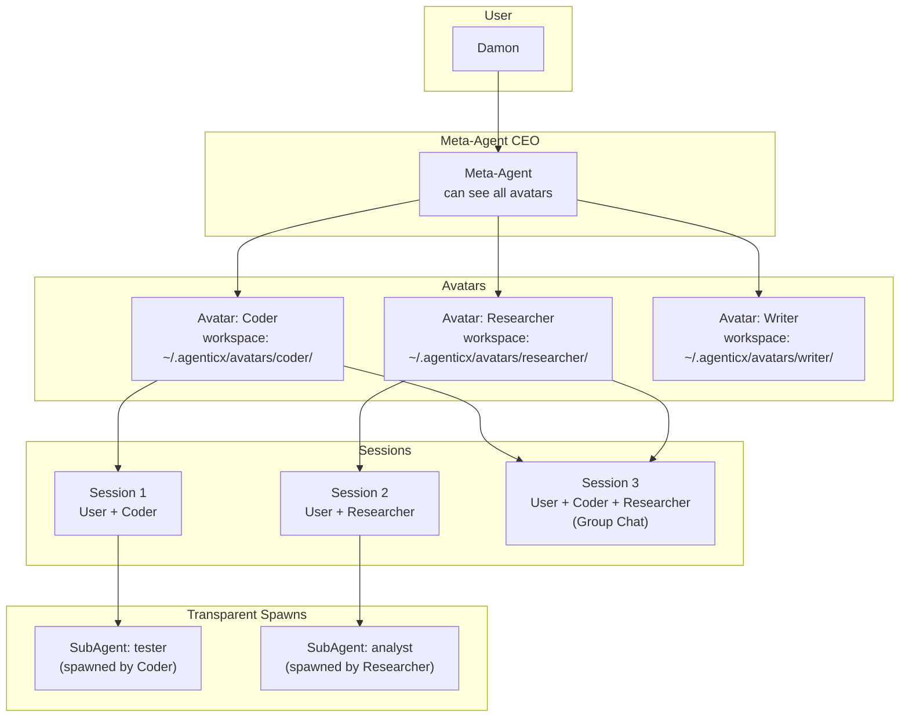

# AgenticX Desktop 数字分身 + 群聊架构

## 现状

当前 AgenticX Desktop 只有**单一 session**：一个 meta-agent 加其下的子智能体池。没有分身（avatar/persona）概念，没有多 session 并行，没有群聊。设置面板是 provider 列表，MCP 配置混在 provider 详情里。

## 核心概念




### 分身（Avatar）

- 持久化实体，有名称、角色、头像、system prompt、独立 workspace
- 创建方式：手动配置 / AI 生成 / 会话派生（fork 当前对话为新分身）
- 每个分身可独立开多个 session（会话）
- 分身之间默认隔离：User 和 Avatar A 的对话，Avatar B 看不到

### 会话（Session）

- 一个分身可以有多个独立会话（不同任务/上下文）
- 会话内产生的 sub-agent 和 session spawn 对用户透明可见

### 群聊（GroupChat）

- 用户 + 多个分身的共享对话空间
- 所有参与者看到所有消息
- 路由策略：用户指定 / meta 分发 / 轮询

### Meta-Agent

- 全局 CEO，可接管所有分身的 workspace
- 可查看所有分身的会话历史
- 可跨分身调度任务

## 数据模型

### Avatar（持久化到 `~/.agenticx/avatars/<id>/`）

```python
@dataclass
class AvatarConfig:
    id: str
    name: str
    role: str = ""
    avatar_url: str = ""
    system_prompt: str = ""
    workspace_dir: str = ""
    created_by: str = "manual"       # manual | ai | session_fork
    default_provider: str = ""
    default_model: str = ""
    pinned: bool = False
    created_at: str = ""
    updated_at: str = ""
```

每个分身目录结构：

```
~/.agenticx/avatars/<id>/
  avatar.yaml
  workspace/
    IDENTITY.md
    MEMORY.md
    memory/
      2026-03-11.md
```

### GroupChat（持久化到 `~/.agenticx/groups/<id>.yaml`）

```python
@dataclass
class GroupChatConfig:
    id: str
    name: str
    avatar_ids: List[str]
    routing: str = "user-directed"   # user-directed | meta-routed | round-robin
    created_at: str = ""
```

### Session 扩展

`SessionState` 增加：

- `avatar_id: Optional[str]` -- 关联哪个分身
- `avatar_name: Optional[str]` -- 分身名称
- `group_id: Optional[str]` -- 关联哪个群聊
- `parent_session_id: Optional[str]` -- 派生自哪个 session

---

## Phase 1: 分身骨架 + 设置面板重构 (已完成)

- AvatarRegistry 后端 + YAML 持久化
- Avatar CRUD HTTP API
- Session 关联 avatar_id
- AvatarSidebar + AvatarCreateDialog 前端组件
- App.tsx 三栏布局（AvatarSidebar | ChatView | SubAgentPanel）
- SettingsPanel 多 tab 重构（通用 / 模型与 API / MCP 服务 / 工作区）
- Store + IPC 扩展
- 构建验证通过

---

## Phase 2: 会话管理 + Sub-Agent 透明化 + AI 分身生成

### 2.1 多会话支持

**后端：**

- [agenticx/studio/server.py](agenticx/studio/server.py) 新增：
  - `GET /api/sessions?avatar_id=xxx` -- 列出分身的所有 session
  - `POST /api/sessions` -- 为分身创建新 session（`{avatar_id, name?}`）
  - `PUT /api/sessions/{session_id}` -- 重命名 session
  - `DELETE /api/session` -- 已有，保持兼容
- [agenticx/studio/session_manager.py](agenticx/studio/session_manager.py)：
  - `list_sessions(avatar_id)` -- 按 avatar 过滤
  - ManagedSession 增加 `session_name: Optional[str]`

**前端：**

- AvatarSidebar 中分身下方展示 session tab 列表
- 点击 session tab 切换对话上下文
- "+" 按钮创建新 session
- 右键：重命名 / 删除

### 2.2 Session Spawn 透明化

**后端：**

- [agenticx/runtime/team_manager.py](agenticx/runtime/team_manager.py) `SubAgentContext` 增加:
  - `spawn_tree_path: str` -- 层级路径如 `"meta/coder-1/tester-1"`
- `GET /api/subagents/status` 响应增加 `spawn_tree` 字段

**前端：**

- AvatarSidebar 中当前 session 下方显示 spawn 树（缩进层级）
- 每个 spawn 节点显示：名称、状态、当前动作
- 点击 spawn 节点在右侧 SubAgentPanel 展开详情

### 2.3 会话派生为新分身（Session Fork）

**后端：**

- [agenticx/studio/server.py](agenticx/studio/server.py) 新增：
  - `POST /api/avatars/fork` -- `{session_id, name, role}` -> 复制对话上下文 -> 创建新 Avatar

**前端：**

- ChatView 输入区域增加 "派生分身" 操作（命令面板 `/fork`）
- 弹窗确认名称和角色后执行

### 2.4 AI 生成分身

**后端：**

- [agenticx/studio/server.py](agenticx/studio/server.py) 新增：
  - `POST /api/avatars/generate` -- `{description}` -> LLM 推导 -> 创建 Avatar
- LLM prompt: "根据用户描述生成 name/role/system_prompt，输出 JSON"

**前端：**

- AvatarCreateDialog 增加 "AI 生成" 模式
- 用户输入描述 -> 调用 /api/avatars/generate -> 预填字段 -> 确认创建

---

## Phase 3: 群聊模式 + Meta 全局视图

### 3.1 群聊后端

新建 [agenticx/avatar/group_chat.py](agenticx/avatar/group_chat.py)：

- `GroupChatConfig` 模型 + YAML 持久化
- `GroupChatManager`：
  - 创建/删除群聊
  - 消息路由（user-directed / meta-routed / round-robin）
  - 共享 session 管理

在 [agenticx/studio/server.py](agenticx/studio/server.py) 新增：

- `GET /api/groups` -- 群聊列表
- `POST /api/groups` -- 创建群聊
- `DELETE /api/groups/{group_id}`
- `POST /api/groups/{group_id}/chat` -- 群聊消息（路由到目标 avatar 的 session）

### 3.2 群聊前端

- 左侧面板新增"群聊"区域（在分身列表下方）
- 创建群聊弹窗：选择参与分身 + 命名 + 路由策略
- 群聊消息视图：每条消息显示发送者头像和名称
- @mention 路由：输入框支持 @avatar_name 指定回答者

### 3.3 Meta-Agent 全局视图

- 点击 Meta-Agent 入口时，主区域切换为仪表盘视图
- 展示所有分身的运行状态、活跃 session 数、最近活动
- 支持跨分身下达指令（"让 Coder 写代码"）
- Meta-Agent 的 system prompt 注入所有分身信息

### 3.4 分身间协作

- Meta-Agent 可调用 `delegate_to_avatar(avatar_id, task)` 工具
- 被委派分身在自己的 workspace 中执行，结果回传
- 协作历史记录到 Meta-Agent 的 session 中

---

## 涉及文件总表

### Phase 1（已完成）

- `agenticx/avatar/__init__.py`, `registry.py`
- `agenticx/studio/server.py`, `protocols.py`, `session_manager.py`
- `desktop/src/App.tsx`, `store.ts`, `global.d.ts`
- `desktop/electron/main.ts`, `preload.ts`
- `desktop/src/components/AvatarSidebar.tsx`, `AvatarCreateDialog.tsx`, `SettingsPanel.tsx`

### Phase 2（待实现）

- `agenticx/studio/server.py` -- session 列表/创建 API + avatar fork + AI generate
- `agenticx/studio/session_manager.py` -- list_sessions + session_name
- `agenticx/runtime/team_manager.py` -- spawn_tree_path
- `desktop/src/components/AvatarSidebar.tsx` -- session tabs + spawn tree
- `desktop/src/components/AvatarCreateDialog.tsx` -- AI 生成模式
- `desktop/src/store.ts` + `global.d.ts` + IPC -- session 列表状态

### Phase 3（待实现）

- `agenticx/avatar/group_chat.py` -- GroupChatConfig + GroupChatManager
- `agenticx/studio/server.py` -- /api/groups endpoints
- `desktop/src/components/GroupChatPanel.tsx` -- 群聊 UI
- `desktop/src/components/MetaDashboard.tsx` -- Meta 全局视图
- `agenticx/runtime/meta_tools.py` -- delegate_to_avatar 工具
- `agenticx/runtime/prompts/meta_agent.py` -- 注入分身列表

