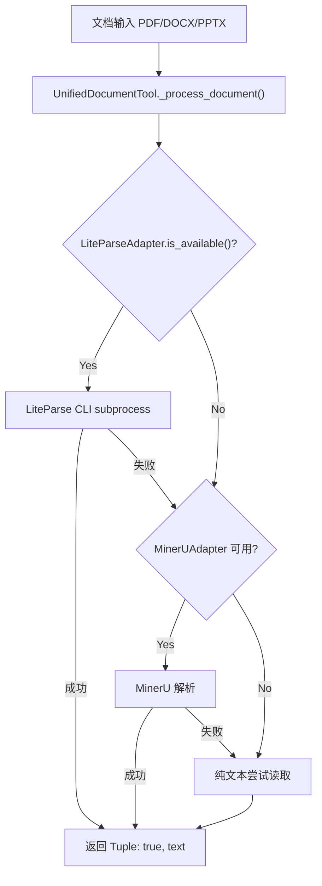

# LiteParse 集成开发计划

## 背景

AgenticX 的 `UnifiedDocumentTool._process_document()` 对 PDF/DOCX/PPTX 是**占位实现**（仅返回文件大小），而 MinerU 是重量级方案（需 GPU/API）。LiteParse 是 LlamaIndex 的轻量级 PDF 解析库（TypeScript + Python wrapper），可填补这一空白。

## Proposal 修正点

原 proposal 有三处与实际代码不匹配，必须修正：

- `**ParsedArtifacts` 字段**: proposal 写的 `markdown_path`/`json_path`/`images`/`metadata` 不存在。实际字段见 [agenticx/tools/adapters/base.py](agenticx/tools/adapters/base.py) 第 14-48 行: `markdown_file`(Path), `model_json`(Path), `content_list_json`(Path), `backend_type`(str), `page_count`(int) 等
- `**FallbackChain` 不适用**: [agenticx/tools/fallback_chain.py](agenticx/tools/fallback_chain.py) 是 API/Browser/ComputerUse 的工具降级链，不适用于文档解析。文档三层降级直接在 `_process_document()` 内用 try/except 链实现
- `**_process_document` 签名**: 返回 `Tuple[bool, str]`，不是 `ParsedArtifacts`。LiteParse 适配器需同时支持两种调用模式

## 架构



## 改动范围（4 个文件）

### 1. 新建 `agenticx/tools/adapters/liteparse.py`

核心适配器，继承 `DocumentAdapter`。关键设计：

- `is_available()` 静态方法: `shutil.which("liteparse")` 或 `shutil.which("npx")` 检测 CLI
- `_find_cli()`: 查找路径链: PATH -> npx -> node_modules/.bin/liteparse
- `parse()`: 异步 subprocess 调用 `liteparse parse <file> --format json -q`，解析 JSON stdout，映射到 `ParsedArtifacts`（`backend_type="liteparse"`，`markdown_file` 写文本内容到 md 文件，`content_list_json` 写结构化 JSON）
- `parse_to_text()`: 简化版，直接返回文本内容字符串（供 `_process_document` 使用）
- `get_supported_formats()`: `.pdf` + `.docx`/`.pptx`/`.xlsx`/`.jpg`/`.png`（LiteParse 通过 LibreOffice/ImageMagick 转换）
- `validate_config()`: 检查 CLI 可用性
- 超时控制: `asyncio.wait_for(..., timeout=self.timeout)`
- 所有 `ImportError`/`FileNotFoundError`/`subprocess` 失败都 catch 并 log，不抛到上层

### 2. 修改 `agenticx/tools/unified_document.py`

将 `_process_document()` 从占位实现改为三层降级：

```python
def _process_document(self, path: str) -> Tuple[bool, str]:
    # Level 1: Try LiteParse (lightweight, local)
    # Level 2: Try MinerU via adapters (heavy, needs GPU/API)
    # Level 3: Fallback to basic text read
```

由于 `_process_document` 是同步方法（`DocumentRouter.route` 同步调用），LiteParse 调用需要用 `asyncio.run()` 或 `loop.run_until_complete()` 包装。参考 [agenticx/tools/adapters/pipeline.py](agenticx/tools/adapters/pipeline.py) 中 `PipelineAdapter` 的做法。

### 3. 修改 `agenticx/tools/adapters/__init__.py`

注册 `LiteParseAdapter`:

```python
from .liteparse import LiteParseAdapter
__all__ = [..., "LiteParseAdapter"]
```

### 4. 修改 `agenticx/tools/__init__.py`

导出 `LiteParseAdapter` 到顶层:

```python
from .adapters.liteparse import LiteParseAdapter
```

## 不改动的文件

- `agenticx/tools/fallback_chain.py` — 这是工具解析降级链，与文档解析无关，不动
- `agenticx/tools/mineru.py` — MinerU 工具代码不动（no-scope-creep）
- `agenticx/tools/adapters/pipeline.py` — Pipeline 适配器不动
- `agenticx/tools/document_routers.py` — 路由框架不动，降级逻辑在 `_process_document` 内部
- Desktop 端 — 本次不动桌面端代码，后续可单独跟进

## 依赖

- LiteParse CLI: `npm install -g @llamaindex/liteparse`（可选依赖，is_available 检测）
- 无新 Python 包依赖（纯 subprocess + asyncio + json + shutil）
