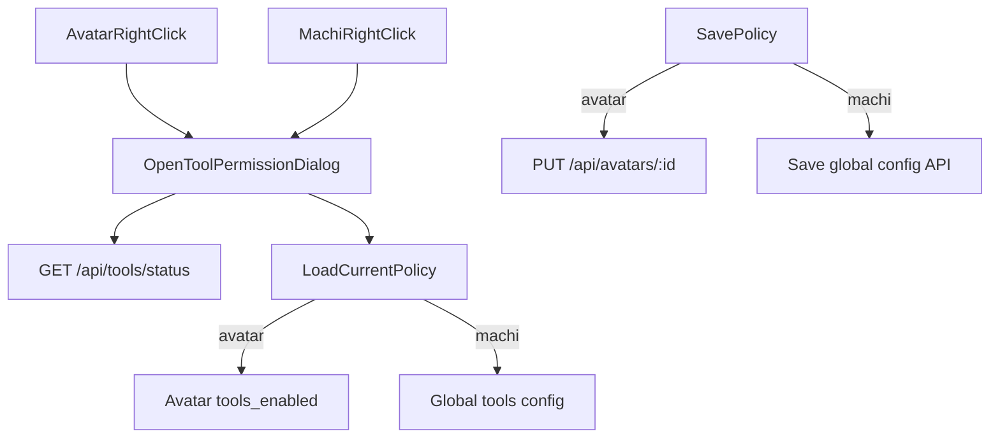

# 高质量补齐右键工具权限入口

## 目标与边界
- 仅做你确认的范围：
  - 分身右键新增“工具权限”并可编辑保存。
  - Machi（元智能体）也可右键配置，且其配置默认/落盘到全局配置。
- 不新增“设置页第二入口”，不改你未点名的其它交互。

## 现状结论（基于现有代码）
- 分身右键菜单当前仅有“置顶/删除”，入口在 [desktop/src/components/AvatarSidebar.tsx](/Users/damon/myWork/AgenticX/desktop/src/components/AvatarSidebar.tsx)。
- 新建分身已支持 `tools_enabled` 提交，但缺少“编辑已有分身工具权限”入口，相关表单在 [desktop/src/components/AvatarCreateDialog.tsx](/Users/damon/myWork/AgenticX/desktop/src/components/AvatarCreateDialog.tsx)。
- 头像配置持久化已支持 `tools_enabled`，在 [agenticx/avatar/registry.py](/Users/damon/myWork/AgenticX/agenticx/avatar/registry.py)。
- 后端已有工具状态/安装接口，可复用：`/api/tools/status`、`/api/tools/install`，在 [agenticx/studio/server.py](/Users/damon/myWork/AgenticX/agenticx/studio/server.py)。

## 设计方案

## 实施步骤
1. 在 [desktop/src/components/AvatarSidebar.tsx](/Users/damon/myWork/AgenticX/desktop/src/components/AvatarSidebar.tsx) 新增右键菜单项“工具权限”
- 分身菜单从“置顶/删除”扩展为“置顶/工具权限/删除”。
- Machi 卡片支持右键，菜单至少包含“工具权限（全局）”。

2. 提炼可复用权限编辑弹窗（避免重复逻辑）
- 从现有 [desktop/src/components/AvatarCreateDialog.tsx](/Users/damon/myWork/AgenticX/desktop/src/components/AvatarCreateDialog.tsx) 中的工具权限 UI 抽成独立组件（如 `AvatarToolPermissionDialog`），支持两种模式：
  - `avatar` 模式：编辑某个 avatar 的 `tools_enabled` 覆盖。
  - `machi-global` 模式：编辑全局工具权限配置。
- 保持“继承全局/已自定义 N 项/重置”这套语义，避免用户学习成本。

3. 后端补全 Machi 全局工具权限持久化 API
- 在 [agenticx/studio/server.py](/Users/damon/myWork/AgenticX/agenticx/studio/server.py) 增加轻量接口（例如 `GET/PUT /api/tools/policy`）：
  - 读取/写入全局 `tools_enabled`（存于 `~/.agenticx/config.yaml`）。
  - 作为 Machi 的默认策略来源。
- 复用已有 token 校验与配置读写能力，避免新增存储体系。

4. Desktop IPC 与类型补齐
- 在 [desktop/electron/main.ts](/Users/damon/myWork/AgenticX/desktop/electron/main.ts)、[desktop/electron/preload.ts](/Users/damon/myWork/AgenticX/desktop/electron/preload.ts)、[desktop/src/global.d.ts](/Users/damon/myWork/AgenticX/desktop/src/global.d.ts) 增加：
  - `getToolsPolicy()` / `saveToolsPolicy()`（Machi 全局配置）。
  - 现有 avatar 更新接口继续承载 `tools_enabled`。

5. 策略生效链路对齐
- 在后端会话创建/运行时，明确优先级：
  - Avatar 自定义 `tools_enabled` > Machi 全局工具配置 > 系统默认（全开）。
- 仅补接线，不做额外重构，确保无 scope creep。

6. 验证与回归
- 用例覆盖：
  - 分身右键打开权限弹窗、修改并重开后回填正确。
  - Machi 右键修改全局权限后，新会话生效。
  - 未自定义分身继续继承全局。
  - 安装状态卡与权限开关联动不冲突。
- 执行最小必要检查：Python 编译检查 + Desktop TS 检查（仅报告与本次相关问题）。
