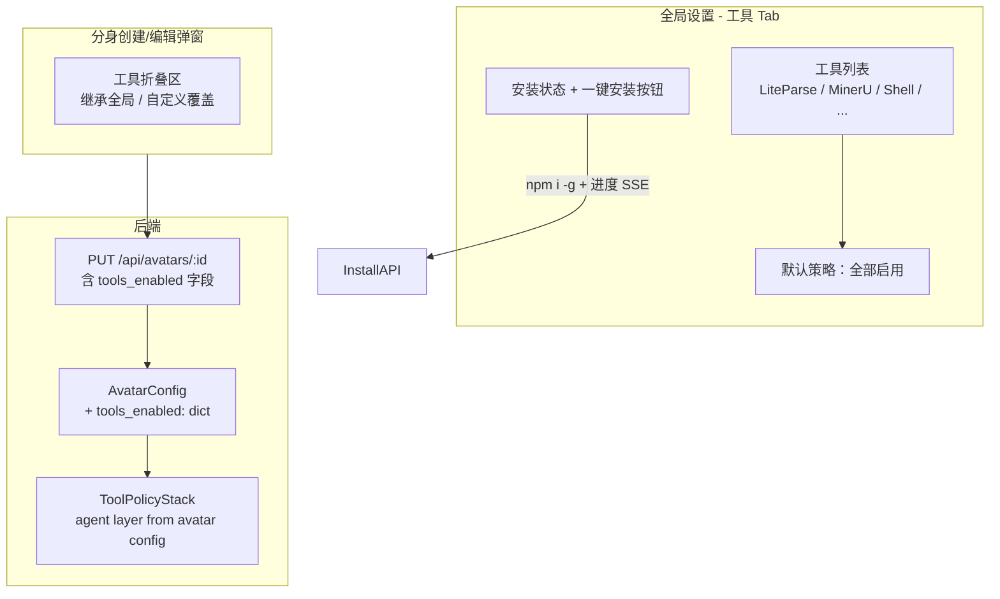

# Per-Avatar 工具授权面板

## 设计原则

- 零额外使用成本：所有工具**默认全开**，用户只在需要**限制**时才手动关闭
- 全局装一次，所有分身共享：安装操作是全局的（`npm i -g`），无 per-avatar 隔离
- 安装有感知：一键安装按钮带进度动画和状态反馈
- 分身级覆盖是可选的：不设置就继承全局默认，设置了就覆盖

## 架构



## 改动范围

### 一、后端（3 个文件）

#### 1. `AvatarConfig` 新增 `tools_enabled` 字段

文件：[agenticx/avatar/registry.py](agenticx/avatar/registry.py)

当前 `AvatarConfig` dataclass 只有 `name/role/system_prompt/default_provider/default_model` 等字段，无工具配置。新增：

```python
tools_enabled: Dict[str, bool] = field(default_factory=dict)
```

空 dict 表示"继承全局默认（全部启用）"。只有用户在分身弹窗里手动调整后才会写入具体值，如 `{"liteparse": false, "shell": true}`。

`to_dict()` 和 `from_dict()` 已使用 `asdict` / `__dataclass_fields__` 动态获取，无需额外改动即可序列化。

#### 2. Studio API 新增工具状态检测 + 安装端点

文件：[agenticx/studio/server.py](agenticx/studio/server.py)

新增两个 API：

- `GET /api/tools/status` -- 返回各工具安装状态

```json
{
  "tools": [
    {"id": "liteparse", "name": "LiteParse", "description": "轻量 PDF 解析", "installed": true, "version": "1.3.1"},
    {"id": "mineru", "name": "MinerU", "description": "深度文档解析", "installed": false, "install_command": "pip install magic-pdf"},
    {"id": "libreoffice", "name": "LibreOffice", "description": "Office 格式转换", "installed": true}
  ]
}
```

检测逻辑：`shutil.which("liteparse")`、`importlib.util.find_spec("magic_pdf")`、`shutil.which("soffice")` 等。

- `POST /api/tools/install` -- 触发安装并通过 SSE 流回报进度

请求体：`{"tool_id": "liteparse"}`

SSE 流事件格式：

```
event: progress
data: {"tool_id": "liteparse", "phase": "downloading", "percent": 45, "message": "Installing @llamaindex/liteparse..."}

event: progress
data: {"tool_id": "liteparse", "phase": "done", "percent": 100, "message": "LiteParse v1.3.1 installed"}
```

安装命令映射表：
- `liteparse` -> `npm i -g @llamaindex/liteparse`
- `libreoffice` -> 返回平台特定提示（brew/apt/choco），不自动执行
- `imagemagick` -> 同上

对于 `npm i -g` 类命令，用 `asyncio.create_subprocess_exec` 执行并逐行读 stderr 流转为 SSE 事件。

#### 3. 现有 `PUT /api/avatars/:id` 已支持任意字段更新

文件：[agenticx/studio/server.py](agenticx/studio/server.py) 约 1573 行

当前 `update_avatar` 直接把 payload 传给 `registry.update(avatar_id, **payload)`，`AvatarConfig.from_dict` 会自动过滤未知字段。新增 `tools_enabled` 到 dataclass 后，PUT 请求自然能持久化此字段，无需额外改 API 逻辑。

### 二、Desktop 前端（3 个文件）

#### 4. 全局设置新增「工具」Tab

文件：[desktop/src/components/SettingsPanel.tsx](desktop/src/components/SettingsPanel.tsx)

在 `TABS` 数组中追加：

```typescript
{ id: "tools", label: "工具", icon: Wrench }
```

`SettingsTab` 类型追加 `"tools"`。

Tab 内容：工具卡片列表，每张卡片包含：
- 工具名称 + 简介
- 安装状态徽章：已安装(绿) / 未安装(灰) / 安装中(转圈)
- 「安装」按钮（未安装时显示）
- 版本号（已安装时显示）

安装按钮点击后：
1. 按钮变为带进度条的 loading 状态
2. 调用 `POST /api/tools/install` SSE 端点
3. 逐帧更新进度百分比和状态文案
4. 完成后刷新状态，按钮变为"已安装"徽章

#### 5. 分身创建/编辑弹窗新增「工具」折叠区

文件：[desktop/src/components/AvatarCreateDialog.tsx](desktop/src/components/AvatarCreateDialog.tsx)

在现有表单（名称/角色/系统提示词）下方，新增一个可折叠的「工具权限」区：

- 默认**收起**，标题显示"工具权限（继承全局默认）"
- 展开后显示工具开关列表，初始状态全灰（表示继承全局）
- 用户拨动任一开关后，该项变为"自定义"状态（蓝/灰），标题变为"工具权限（已自定义 N 项）"
- "重置为全局默认"按钮一键清空所有覆盖

数据流：
- 创建时：`createAvatar` payload 携带 `tools_enabled: {}`（或用户自定义的 dict）
- 编辑时：从 `avatar.tools_enabled` 回填开关状态
- 保存时：`updateAvatar` payload 携带 `tools_enabled`

#### 6. IPC / Preload 补充

文件：[desktop/electron/preload.ts](desktop/electron/preload.ts) + [desktop/electron/main.ts](desktop/electron/main.ts)

新增：
- `getToolsStatus()` -> `GET /api/tools/status`
- `installTool(toolId)` -> `POST /api/tools/install`（SSE，需要在 main 进程中处理流并通过 IPC 逐帧转发给渲染进程）

`createAvatar` / `updateAvatar` 的 payload 类型追加 `tools_enabled?: Record<string, boolean>`（preload 已有泛型 payload，只需更新 TypeScript 类型）。

### 三、安装进度 UX 细节

安装流程用户感知：

```
[未安装]        用户点「安装」
    |
    v
[安装中]        按钮变 spinner + 进度条
    |           "正在安装 LiteParse..."  45%
    |           "正在下载依赖..."        72%
    v
[已安装]        绿色徽章 + 版本号
    或
[安装失败]      红色提示 + 重试按钮 + 错误详情折叠
```

进度条采用 SSE 实时推送，不是轮询。失败时保留错误信息供排查。

对于无法自动安装的系统依赖（LibreOffice / ImageMagick），显示为：
- 状态："需手动安装"
- 按钮变为"查看安装指南"，点击弹出平台对应的安装命令（macOS: `brew install ...` / Ubuntu: `apt install ...` / Windows: `choco install ...`）

## 不改动的文件

- [agenticx/tools/policy.py](agenticx/tools/policy.py) -- `ToolPolicyStack` 已支持动态 add_layer，运行时读取 avatar 的 `tools_enabled` 构建 agent layer 即可，无需改框架代码
- [agenticx/tools/adapters/liteparse.py](agenticx/tools/adapters/liteparse.py) -- 上次集成的代码不动
- [agenticx/tools/unified_document.py](agenticx/tools/unified_document.py) -- 降级链不动
- [agenticx/tools/fallback_chain.py](agenticx/tools/fallback_chain.py) -- 工具解析降级链不动
