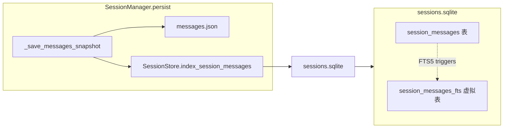

# hermes-agent Codegen Plan

## 功能点清单


| #   | 功能点                 | 优先级 | 上游证据                                       | AgenticX 落点                                | 验收场景                     |
| --- | ------------------- | --- | ------------------------------------------ | ------------------------------------------ | ------------------------ |
| 1a  | Session 消息 FTS5 索引层 | P1  | `hermes_state.py` FTS5 + triggers          | `agenticx/memory/session_store.py`         | 写入消息后 FTS5 可命中           |
| 1b  | session_search 工具注册 | P1  | `tools/session_search_tool.py` schema      | `agenticx/cli/agent_tools.py` STUDIO_TOOLS | schema 出现在工具列表           |
| 1c  | session_search 工具实现 | P1  | 同上：FTS + truncation + fallback             | `agenticx/cli/agent_tools.py` dispatch     | 跨 session 关键词可检索并返回结构化结果 |
| 2a  | Skill 安全扫描器         | P1  | `tools/skills_guard.py` scan_skill + trust | `agenticx/skills/guard.py`（新建）             | 危险模式被拦截，安全内容放行           |
| 2b  | skill_manage 工具注册   | P1  | `tools/skill_manager_tool.py` schema       | `agenticx/cli/agent_tools.py` STUDIO_TOOLS | schema 出现在工具列表           |
| 2c  | skill_manage 工具实现   | P1  | 同上：create/patch/delete + guard             | `agenticx/cli/agent_tools.py` dispatch     | 创建/patch/删除技能并通过安全扫描     |


## 推进顺序

G1（1a -> 1b -> 1c）先于 G2（2a -> 2b -> 2c）。每个子功能点含测试，绿灯后推进下一个。

---

## Feature 1a: Session 消息 FTS5 索引层

**策略**: 抽象迁移 -- 借鉴 Hermes `hermes_state.py` 的 FTS5 外部内容表模式，适配到 AgenticX 现有 `SessionStore`。

**改动文件**: [agenticx/memory/session_store.py](agenticx/memory/session_store.py)

**设计**:




在 `SessionStore._ensure_schema` 中新增两张表（不影响现有 todos/scratchpad/session_summaries）:

```sql
CREATE TABLE IF NOT EXISTS session_messages (
    id INTEGER PRIMARY KEY AUTOINCREMENT,
    session_id TEXT NOT NULL,
    role TEXT NOT NULL,
    content TEXT NOT NULL,
    timestamp REAL,
    indexed_at TEXT NOT NULL
);
CREATE INDEX IF NOT EXISTS idx_sm_session ON session_messages(session_id);

CREATE VIRTUAL TABLE IF NOT EXISTS session_messages_fts USING fts5(
    content,
    content=session_messages,
    content_rowid=id
);
-- INSERT/DELETE triggers on session_messages -> session_messages_fts
```

新增方法:

- `index_session_messages(session_id: str, messages: list[dict]) -> int` -- 先 DELETE 旧行再 INSERT（幂等），返回索引条数
- `search_session_messages(query: str, *, role_filter: list[str] | None, limit: int = 20) -> list[dict]` -- FTS5 MATCH + snippet + 上下文窗口
- `_sanitize_fts5_query(raw: str) -> str` -- 参考 Hermes 的引号/连字符/特殊字符清洗

特性开关: 环境变量 `AGX_SESSION_FTS`（默认 `1` 启用），关闭时 `index_session_messages` 为 no-op、`search_session_messages` 返回空列表。

**测试**: `tests/test_smoke_hermes_agent_session_fts.py`

- Happy path: 写入 3 个 session 各 5 条消息 -> search 命中正确 session
- 边界: 空 query -> 空列表; 特殊字符 query 不崩溃; FTS 关闭时返回空

---

## Feature 1b: session_search 工具注册

**策略**: 直接新增 -- 在 `STUDIO_TOOLS` 中追加 `session_search` schema。

**改动文件**: [agenticx/cli/agent_tools.py](agenticx/cli/agent_tools.py)

在 `memory_search` 工具定义之后插入:

```python
{
    "type": "function",
    "function": {
        "name": "session_search",
        "description": "Search past conversation sessions by keyword. "
                       "Returns matching message excerpts grouped by session.",
        "parameters": {
            "type": "object",
            "properties": {
                "query": {"type": "string", "description": "Search keywords (FTS5 syntax supported)"},
                "role_filter": {"type": "string", "description": "Comma-separated roles to filter: user,assistant,tool"},
                "limit": {"type": "integer", "description": "Max sessions to return (1-5, default 3)"},
            },
            "required": [],
        },
    },
}
```

**测试**: `tests/test_smoke_hermes_agent_session_search.py`（1b 仅验证 schema 注册；1c 验证行为）

- 断言 `session_search` 出现在 `STUDIO_TOOLS` 的 function names 集合中

---

## Feature 1c: session_search 工具实现

**策略**: 抽象迁移 -- 核心逻辑参考 Hermes `tools/session_search_tool.py`：FTS 查询 -> 按 session 聚合 -> 截断 -> 返回 JSON。**不移植 LLM 摘要**（MVP 阶段），保留接口预留。

**改动文件**: [agenticx/cli/agent_tools.py](agenticx/cli/agent_tools.py)

在 `dispatch_tool_async` 的 `elif` 链中 `memory_search` 之后新增:

```python
elif name == "session_search":
    return await _tool_session_search(arguments, session)
```

`_tool_session_search` 实现:

1. 从 `SessionStore()` 获取 `search_session_messages(query, role_filter, limit)`
2. 按 `session_id` 分组，每组截断到 `max_chars`（默认 10000）
3. 空 query 走 `list_latest_sessions(limit)` 返回最近会话摘要
4. 返回 JSON: `{"mode": "search"|"recent", "sessions": [...]}`

**测试**: 同 `tests/test_smoke_hermes_agent_session_search.py` 扩展

- Happy: 调 `_tool_session_search` mock session 后验证返回结构
- 边界: query="" 走 recent 模式; limit 超限 clamp 到 5

---

## Feature 2a: Skill 安全扫描器

**策略**: 轻量替代 -- Hermes `skills_guard.py` 用 regex 扫描危险模式（exfiltration/credential/injection/destructive），AgenticX 做最小等价实现，接口对齐 `SafetyLayer` 风格。

**新建文件**: [agenticx/skills/guard.py](agenticx/skills/guard.py)

```python
@dataclass
class ScanResult:
    verdict: Literal["safe", "caution", "dangerous"]
    findings: list[ScanFinding]

@dataclass
class ScanFinding:
    severity: Literal["safe", "caution", "dangerous"]
    pattern_name: str
    matched_text: str
    file_path: str
    line_number: int

TRUST_POLICY: dict[str, tuple[str, str, str]] = {
    # source: (safe_action, caution_action, dangerous_action)
    "agent-created": ("allow", "allow", "block"),
    "community":     ("allow", "allow", "block"),
    "builtin":       ("allow", "allow", "allow"),
}

def scan_skill(skill_dir: Path, *, source: str = "agent-created") -> ScanResult: ...
def should_allow(result: ScanResult, source: str) -> tuple[bool, str]: ...
```

扫描模式（regex，参考 Hermes）:

- **exfiltration**: `curl.*\$`, `wget.*\$`, `fetch.*env`
- **credential_access**: `~/.ssh`, `.env`, `credentials`
- **prompt_injection**: `ignore previous`, `system prompt`, `<system>`
- **destructive**: `rm -rf /`, `chmod 777`, `DROP TABLE`

**测试**: `tests/test_smoke_hermes_agent_skill_guard.py`

- Happy: 安全 SKILL.md -> verdict=safe, allow=True
- 边界: 含 `curl $SECRET` -> verdict=dangerous, allow=False
- 边界: 空目录 -> verdict=safe

---

## Feature 2b: skill_manage 工具注册

**策略**: 直接新增

**改动文件**: [agenticx/cli/agent_tools.py](agenticx/cli/agent_tools.py)

在 `skill_list` 之后插入 `skill_manage` schema，`action` enum: `["create", "patch", "delete"]`（MVP 不含 `edit`/`write_file`/`remove_file`，减少攻击面）。

**测试**: `tests/test_smoke_hermes_agent_skill_manage.py`

- 断言 schema 在 STUDIO_TOOLS 中存在

---

## Feature 2c: skill_manage 工具实现

**策略**: 抽象迁移 -- 参考 Hermes `skill_manager_tool.py` 的 create/patch/delete 流程，集成 Feature 2a 的 guard。

**改动文件**: [agenticx/cli/agent_tools.py](agenticx/cli/agent_tools.py)

在 `dispatch_tool_async` 的 `skill_list` 之后新增:

```python
elif name == "skill_manage":
    return await _tool_skill_manage(arguments, session)
```

`_tool_skill_manage` 实现:

- **create**: 在 `~/.agenticx/skills/agent-created/<name>/` 写 `SKILL.md`（frontmatter + content）-> `scan_skill` -> 失败则回滚（`shutil.rmtree`）
- **patch**: 读现有 `SKILL.md` -> `old_string`/`new_string` 替换 -> 写回 -> `scan_skill` -> 失败则恢复备份
- **delete**: 直接 `shutil.rmtree`（无安全扫描）
- 特性开关: `AGX_SKILL_MANAGE`（默认 `0` 关闭），需显式开启或 `Run Everything` 权限

**测试**: `tests/test_smoke_hermes_agent_skill_manage.py` 扩展

- Happy: create -> 文件存在 + guard pass
- Happy: patch -> 内容替换正确
- Happy: delete -> 目录不存在
- 边界: create 含危险内容 -> 被 guard 拦截并回滚
- 边界: patch old_string 不匹配 -> 错误返回

---

## 不改动的文件（边界）

- `agenticx/runtime/agent_runtime.py` -- 不改（工具通过已有 dispatch 链注入）
- `agenticx/memory/workspace_memory.py` -- 不改（FTS5 是独立的知识块索引）
- `agenticx/runtime/hooks/session_summary_hook.py` -- 本批次不扩展（后续可合并 nudge）
- `agenticx/studio/session_manager.py` -- 仅在 `_persist_session_state` 追加一行调用 `index_session_messages`（最小侵入）

