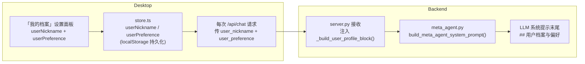

# 用户档案与偏好注入方案

## 数据流

## 改动文件与内容

### 1. `desktop/src/store.ts`

- `userNickname: string` — 原 `userDisplayName` 重命名，兼容旧 localStorage key（`agx-user-display-name`），群聊 + 单聊均使用
- `userPreference: string` — 新增，存入 key `agx-user-preference`，上限 500 字

### 2. `desktop/src/components/SettingsPanel.tsx`

在「显示」Panel 下方、「权限」Panel 上方，新增 **「我的档案」** Panel：

- **我的称呼**：原「群内显示名称」移入，label 为「我的称呼（用于所有对话）」
- **个人偏好**：`<textarea>` rows=4，maxLength=500，实时保存到 store
- 删除原「显示」Panel 里的「群内显示名称」input

### 3. `desktop/src/components/ChatPane.tsx`

- 使用 `userNickname` / `userPreference`
- 请求 body 附带 `user_nickname`、`user_preference`（单聊与群聊）

### 4. `agenticx/studio/protocols.py`

`ChatRequest` 新增：

- `user_nickname: Optional[str] = None`
- `user_preference: Optional[str] = None`

### 5. `agenticx/studio/server.py`

从 payload 读取并传入 `build_meta_agent_system_prompt(..., user_nickname=..., user_preference=...)`。

### 6. `agenticx/runtime/prompts/meta_agent.py`

新增 `_build_user_profile_block(nickname, preference)`，在 `build_meta_agent_system_prompt` 末尾、`MetaSkillInjector().inject(...)` 之前追加到 `base_prompt`。

### 7. `agenticx/runtime/group_router.py`（可选）

群聊子 agent 系统提示可后续扩展传入 preference；首版以 Meta-Agent 路径注入为主。

---

## 关键约束

- `userPreference` 不写入服务器磁盘配置，仅 localStorage + 请求 body
- 上限 500 字，防止超大系统提示
- 字段均可选，空值时不注入对应 block

---

## 实现结论

- 代码已合入：`236a0a1`（feat(desktop+backend): 用户档案与个人偏好全局注入）。
- 与草案差异：`run_group_turn` 未新增 `user_preference` 参数；`meta_agent` 中称呼行文案含「禁止省略」等强化表述；`user_nickname` 仅在非默认「我」时由前端发送。
