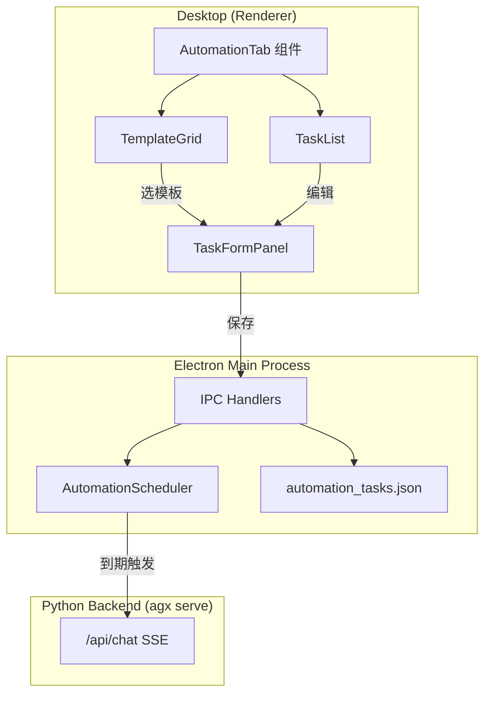

# Automation Feature Redesign

## 现状

当前自动化 Tab（[`desktop/src/components/SettingsPanel.tsx`](desktop/src/components/SettingsPanel.tsx)）仅包含一个 `AutomationPreventSleepPanel` 组件，提供"抑制系统睡眠"单一开关。图标为 `Zap`（闪电），无调度任务能力。

## 目标

对标 WorkBuddy 自动化但保持 AgenticX 自身风格：

- 图标改为时钟（`Clock`）
- 预定义模板卡片网格（一键创建常用自动化）
- 手动创建任务表单（名称/提示词/工作区/频率/生效区间）
- 任务列表管理（启停/编辑/删除/最近运行记录）
- 调度引擎在 Electron 主进程运行，到期时向 Studio API 发消息触发 Agent 执行

---

## 数据模型

### AutomationTask

```typescript
interface AutomationTask {
  id: string; // nanoid
  name: string;
  prompt: string;
  workspace?: string; // 绝对路径，可选
  frequency: AutomationFrequency;
  effectiveDateRange?: { start?: string; end?: string }; // ISO date
  enabled: boolean;
  createdAt: string; // ISO datetime
  lastRunAt?: string;
  lastRunStatus?: "success" | "error";
  fromTemplate?: string; // 模板 id
}

type AutomationFrequency =
  | { type: "daily"; time: string; days: number[] } // days: 1=周一..7=周日
  | { type: "interval"; hours: number; days: number[] }
  | { type: "once"; time: string; date: string }; // date: YYYY-MM-DD
```

### 持久化

- 新建独立文件 `~/.agenticx/automation_tasks.json`（避免 config.yaml 膨胀）
- `automation.prevent_sleep` 保留在 config.yaml 不动

### 预定义模板

在 Desktop 侧定义常量数组 `AUTOMATION_TEMPLATES`，每项含：

- `id`, `name`, `icon`（lucide 组件名）, `description`, `defaultPrompt`, `defaultFrequency`

初期模板（参考 WorkBuddy 但适配 AgenticX 场景）：

- 每日 AI 新闻推送、每日技术趋势、每周工作周报、每日代码审查提醒、会议前准备、每日学习打卡、项目进度追踪、每周依赖安全扫描、自定义定时提醒

---

## 架构



### Electron 主进程调度器

- `AutomationScheduler` 类：启动时加载任务列表，每 60s 检查是否有任务到期
- 到期判断：对比当前时间与任务频率配置（日期/星期/时间）
- 触发方式：向 `agx serve` 的 `/api/chat` 发 POST（携带 prompt + workspace），创建一轮对话
- 记录 `lastRunAt` / `lastRunStatus` 回写 JSON

---

## UI 设计

### 布局（自动化 Tab 内容区）

```
+-------------------------------------------------------+
| 自动化                                                  |
| 管理自动化任务，让 Machi 按计划为你工作。                     |
+-------------------------------------------------------+
| [系统] (可折叠 Panel，默认折叠)                            |
|   抑制系统睡眠 toggle (现有)                              |
+-------------------------------------------------------+
| [从模板快速创建]                                          |
|  +--------+ +--------+ +--------+                      |
|  | 模板1  | | 模板2  | | 模板3  |   3 列响应式 grid     |
|  +--------+ +--------+ +--------+                      |
|  +--------+ +--------+ +--------+                      |
|  | 模板4  | | 模板5  | | 模板6  |                       |
|  +--------+ +--------+ +--------+                      |
+-------------------------------------------------------+
| [我的自动化任务] + [+ 添加任务] 按钮                       |
|  任务行1: 名称 | 频率标签 | 下次执行 | 开关 | 编辑/删除    |
|  任务行2: ...                                           |
|  (空态: 插画 + "还没有自动化任务，从模板开始或手动创建")       |
+-------------------------------------------------------+
```

### 模板卡片

- 圆角边框卡片，左侧 lucide 图标（与模板语义匹配），右侧名称 + 一行描述
- hover 高亮，点击弹出 TaskFormPanel（预填模板内容）
- 对齐现有 Skills Tab 推荐区的 grid 样式但加图标区分

### TaskFormPanel（右侧滑出面板或 Modal）

- 名称输入
- 工作区选择（下拉，复用现有工作区列表 + 搜索）
- 提示词多行输入
- 频率选择器：
  - 三个 Tab 按钮：**每天** / **按间隔** / **单次**
  - 每天：时间选择 + 星期多选
  - 按间隔：N 小时输入 + 星期多选
  - 单次：日期选择 + 时间选择
- 生效日期区间（可选，折叠展开）
- 底部：取消 + 保存

### 任务列表行

- 左侧：名称 + 频率摘要文案（如"每天 09:00 / 周一至五"）
- 右侧：启停 Switch + 编辑按钮 + 删除按钮
- 展开可见最近一次运行时间和状态

---

## 涉及文件

| 文件 | 改动 |
|------|------|
| `desktop/src/components/SettingsPanel.tsx` | Tab 图标改 `Clock`；automation 内容区重构为新组件 |
| `desktop/src/components/automation/AutomationTab.tsx` | **新建** - 自动化 Tab 主组件 |
| `desktop/src/components/automation/TemplateGrid.tsx` | **新建** - 模板卡片网格 |
| `desktop/src/components/automation/TaskFormPanel.tsx` | **新建** - 任务创建/编辑表单 |
| `desktop/src/components/automation/TaskList.tsx` | **新建** - 任务列表 |
| `desktop/src/components/automation/FrequencyPicker.tsx` | **新建** - 频率选择器（每天/间隔/单次） |
| `desktop/src/components/automation/templates.ts` | **新建** - 预定义模板常量 |
| `desktop/src/components/automation/types.ts` | **新建** - TypeScript 类型定义 |
| `desktop/electron/main.ts` | 新增 IPC：`load-automation-tasks` / `save-automation-tasks` / `run-automation-task`；新增 `AutomationScheduler` |
| `desktop/electron/preload.ts` | 暴露新 IPC 方法 |
| `desktop/src/global.d.ts` | 新增类型声明 |

---

## 不改动范围

- `automation.prevent_sleep` 现有逻辑保持不变，仅 UI 位置下移到"系统"折叠区
- 不改动 Python 后端 `task_scheduler.py`（本次调度在 Electron 侧完成）
- 不改动其他 Tab

---

## 需求与验收

- FR-1: 设置「自动化」Tab 展示模板、任务列表、系统睡眠折叠区。
- FR-2: 任务持久化至 `~/.agenticx/automation_tasks.json`，主进程可调度并调用 `/api/chat`。
- AC-1: 可创建/编辑/删除/启停任务，可选工作区与三种频率模式。
