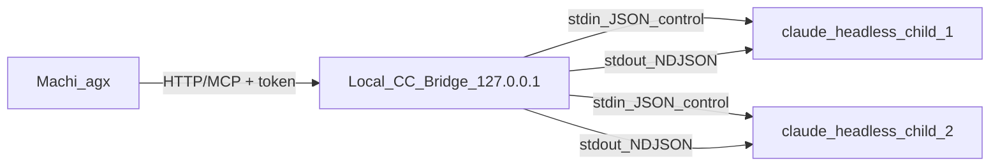

# 自研 CC 本机 Bridge（群控）实施计划

## 源码结论（基于 `research/codedeepresearch/claude-code/upstream/src`）

### 1. 不要与「官方 Cloud Bridge」混淆（但勿误伤 `sessionRunner`）

`src/bridge/` 目录内 **并存两类东西**，实施时语义要拆开：

- **Cloud / Remote Control 链路**：`replBridge.ts`、`bridgeApi.ts`、`types.ts`（`WorkSecret`、`session_ingress`）等主要服务 **claude.ai Remote Control** 与 **会话 ingress**，依赖 **订阅账号与云端 API**（如 `BRIDGE_LOGIN_INSTRUCTION`）。**Machi 自研本机桥不应复制整条云链路**，除非产品明确要对接该能力。
- **本地子进程模式**：同目录下的 **`sessionRunner.ts` 是父进程在本机 `spawn` 子 CLI、解析 stdout、转发 `control_request` 的参考实现**，与上述云端 ingress **不是同一条产品路径**；自研 Bridge 应对齐的是后者（本地 spawn + StructuredIO），而非前者（云会话桥）。

### 2. 应优先对齐的路径：**Headless + StructuredIO + 子进程 JSON 行协议**

- `runHeadless`（`print.ts`）在 `outputFormat === 'stream-json'` 时调用 **`installStreamJsonStdoutGuard()`**，保证 **stdout 为可解析 NDJSON**；上游行号会随版本漂移，以函数名为准（该 guard 与 `runHeadless` 内 `getStructuredIO` 的衔接处约在 **`installStreamJsonStdoutGuard` 调用附近**，勿用过大行号区间概括整段 `runHeadless`）。
- `sessionRunner.ts` 已展示 **父进程 spawn 子 CLI、按行 `jsonParse`、抽取 activity、转发 `control_request`（can_use_tool）** 的模式——这是 **自研 Bridge 的参考实现**，优于盲解析 TUI。

```typescript
// print.ts — 语义锚点（行号以本机上游为准）
if (options.outputFormat === 'stream-json') {
  installStreamJsonStdoutGuard()
}
```

```28:67:research/codedeepresearch/claude-code/upstream/src/bridge/sessionRunner.ts
/**
 * A control_request emitted by the child CLI when it needs permission to
 * execute a **specific** tool invocation (not a general capability check).
 * The bridge forwards this to the server so the user can approve/deny.
 */
export type PermissionRequest = {
  type: 'control_request'
  request_id: string
  request: {
    subtype: 'can_use_tool'
    tool_name: string
    input: Record<string, unknown>
    tool_use_id: string
  }
}
// ...
type SessionSpawnerDeps = {
  execPath: string
  scriptArgs: string[]
  env: NodeJS.ProcessEnv
  // ...
  onPermissionRequest?: (
    sessionId: string,
    request: PermissionRequest,
    accessToken: string,
  ) => void
}
```

### 3. PTY 的角色

- **非主路径**：仅当必须驱动 **无 headless 契约的交互 TUI** 时再用 `node-pty` / tmux；与 Ink/React TUI 强耦合，升级易碎。
- **Swarm 内置 tmux**：`utils/swarm/backends/TmuxBackend.ts` 是 **CC 内部多窗格**，不等于给 Machi 的稳定公共 API。

### 4. `-p` / in-process

`registry.ts` 提及对非交互 session 强制 in-process；群控多实例时以 **多子进程** 为主，避免单进程内多 CC 状态纠缠（具体 flag 组合在 **Phase 0** 用你本机 `claude --help` 与上游 argv 解析对齐）。

## 目标架构（Machi ↔ Bridge ↔ CC）



## 分阶段实施

### Phase 0 — 协议锁定（1 周内）

- 在本机固定 **CC 二进制路径** 与版本；从上游 `print.ts` / `structuredIO.ts` / `sessionRunner.ts` 梳理 **最小 argv + env**（含 `stream-json`、resume、permission mode）。
- 写 **契约文档**（仓库内 `docs/` 或 bridge 包内 README）：一行一条 JSON 的类型表、`control_request` / `control_response` 字段与子进程生命周期。
- **验收**：单进程 `bridge debug spawn` 能在 cwd 下跑完一轮 query 并在 stdout 得到稳定 NDJSON（无杂行）。

### Phase 1 — Bridge 核心（MVP）

- **会话表**：`session_id`（bridge 生成 UUID）、`cwd`、`child_pid`、`状态`、`最后活动`。
- **Spawn**：包装 `sessionRunner` 同类逻辑（或等价）：`stdio: ['pipe','pipe','pipe']`，stdout **按行解析**，stderr 落盘可选。
- **Permission**：`onPermissionRequest` → Bridge 通过 **HTTP 长轮询/WebSocket** 问 Machi 或默认策略（yolo/拒绝）；**禁止**在公网 IM 直连默认 yolo。
- **Cancel**：`SIGTERM` 进程树 + 清理会话行。
- **安全**：仅监听 `127.0.0.1`；`BRIDGE_TOKEN` 随机 32+ byte；CORS 不适用或白名单。

### Phase 2 — Machi / AgenticX 集成

- **工具**：`cc_bridge_send(session_id, prompt)`、`cc_bridge_list`、`cc_bridge_stop`；内部 `httpx`/`fetch` 调 Bridge（与现有 `STUDIO_TOOLS` 中 `bash_exec` / `mcp_connect` 并列，亦可把 Bridge 暴露为 MCP 再 `mcp_connect`）。
- **与现有策略对齐**：远程 `agx serve` 时 **默认禁用** Bridge 调用或要求 **SSH 隧道**；与 `bash_exec` workspace 规则一致（cwd 必须在 taskspace 内或显式允许路径）。
- **Desktop 终端（事实核对）**：Electron `main.ts` 已具备 **`terminal-spawn` / `terminal-write` / `terminal-kill`**（`node-pty`），经 `preload` 供 **Workspace 内嵌终端**使用；**`agx serve`（Python）当前无到上述 IPC 的受控通道**。本期默认仍是 **独立 Bridge 进程 + 127.0.0.1 HTTP**；若未来要「Meta 驱动 Machi 里已打开的那块 PTY」，需另设计 **Studio→Main 的鉴权转发**（token/会话绑定），**非本期 MVP**。
- **Meta 提示**：引导用户「CC 须由 Bridge 拉起」而非「任意 IDE 窗口」。

### Phase 3 — 群控与可靠性

- **并发上限**：全局 `N` 路子进程 + 队列；超时与熔断。
- **可观测**：每会话 ring buffer 日志；可选 OpenTelemetry span（session_id 维度）。
- **升级策略**：CC 小版本升级后重跑 Phase 0 fixture。

## 非目标（本期不做）

- 复刻 `src/bridge/replBridge.ts` 全量云协议与 claude.ai ingress。
- 用 `/proc/$pid/fd/0` 或裸写他人 TTY 作为生产路径。
- 在 Bridge 内嵌完整 Machi LLM（Bridge 只做进程与 IO，决策仍在 agx）。

## 风险

| 风险 | 缓解 |
|------|------|
| NDJSON 契约随 CC 版本变化 | Phase 0 fixture CI；版本钉选 |
| 权限从 IM 注入 | IM → agx 策略门 + Bridge 二次确认 |
| 资源耗尽 | 硬并发上限、会话 TTL |

## 参考上游路径（研读）

- `src/cli/print.ts` — `runHeadless`、`stream-json`
- `src/cli/structuredIO.ts` — stdin/stdout 控制消息
- `src/bridge/sessionRunner.ts` — 子进程 spawn + 解析 + permission
- `src/utils/swarm/backends/registry.ts` — `-p`/非交互 in-process 提示

---

**Plan-Id 说明**：若本 plan 随代码提交，请按仓库规范在 commit message 中加入 `Plan-Id` / `Plan-File` 与 `Made-with: Damon Li`。
