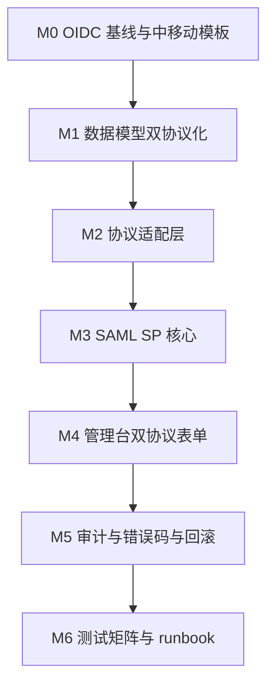

# Enterprise SSO 双栈核心建设计划

> 本计划面向后续低门槛执行模型（含 compose-2 类）使用。每一节都给出：要改的文件、要新增的接口、要写的测试命令、要满足的验收条件。执行模型不需要发挥，只需按节落地。

## 0. 执行规则与硬约束

- 改动范围必须严格限定在以下目录：
  - `enterprise/apps/web-portal/`
  - `enterprise/apps/admin-console/`
  - `enterprise/packages/auth/`
  - `enterprise/packages/iam-core/`
  - `enterprise/packages/db-schema/`
  - `enterprise/docs/runbooks/`
  - `enterprise/scripts/`（仅本地测试 fixture / e2e）
- 不得修改 `desktop/`、`agenticx/`、`gateway/` 与 `customers/`。
- 不得删除任何已存在的 OIDC 错误码、路由、测试。可新增、可标记 deprecated，但不得删除。
- 不得手写 XML 签名校验。
- 所有数据库 schema 变更必须通过 drizzle-kit generate 生成迁移；不允许手改 `drizzle/meta/_journal.json` 与 snapshot。
- 所有改动需保证 `pnpm --filter @agenticx/app-web-portal typecheck` 与 `pnpm --filter @agenticx/app-admin-console typecheck` 通过。
- 任何新增环境变量必须同步加入：
  - `enterprise/.env.local.example`
  - `enterprise/turbo.json` 的 globalEnv 数组
  - `enterprise/scripts/bootstrap.sh` 的本地默认值（local 模式）
  - `enterprise/docs/runbooks/sso-*-setup.md`

## 0.1 关键决策（已锁定，禁止再讨论）

下列决策已经与用户确认，执行模型不得改动选型或命名：

| 决策项 | 锁定值 | 备注 |
| --- | --- | --- |
| SAML 库 | `@node-saml/node-saml` | 不得引入 `passport-saml` 老分支或自写 XML 签名 |
| 一键回退开关名 | `SSO_SAML_DISABLED` | 取值 `true` / `false`（默认 `false`），仅关 SAML，不影响 OIDC |
| 回退开关作用范围 | 仅 SAML 链路 | OIDC 不得新增统一总开关 `SSO_DISABLED` |
| 协议字段命名 | `protocol = 'oidc' | 'saml'` | 默认值 `'oidc'`，旧数据迁移时显式回填 |
| 错误码命名空间 | 现有 `oidc.*` 保留 + 新增 `saml.*` | 不得把 `oidc.*` 重命名为 `sso.*` |
| 路由分目录 | `api/auth/sso/oidc/*` 与 `api/auth/sso/saml/*` 各自独立 | 不允许合并到一个 `api/auth/sso/[protocol]/*` 动态路由 |

## 1. 现状基线（截至 2026-05-07）

代码事实：

- portal OIDC 入口：`enterprise/apps/web-portal/src/app/api/auth/sso/oidc/start/route.ts`、`.../callback/route.ts`
- admin OIDC 入口：`enterprise/apps/admin-console/src/app/api/auth/sso/oidc/start/route.ts`、`.../callback/route.ts`
- portal SSO runtime：`enterprise/apps/web-portal/src/lib/sso-runtime.ts`
- admin SSO runtime：`enterprise/apps/admin-console/src/lib/admin-sso-runtime.ts`
- 认证服务包：`enterprise/packages/auth/src/services/oidc-client.ts`、`oidc-state.ts`、`oidc-claims.ts`、`oidc-redirect-policy.ts`、`secret-cipher.ts`
- 错误码单一来源：`enterprise/packages/auth/src/services/oidc-error-codes.ts`
- providers 工厂：`enterprise/packages/auth/src/providers/factory.ts`，分发 `password` / `oidc` / `saml`
- SAML 现状：`enterprise/packages/auth/src/providers/saml-provider.ts` 仅抛 “not implemented”
- DB schema：`enterprise/packages/db-schema/src/schema/sso-providers.ts`，字段以 OIDC 为前提（`issuer`/`clientId`/`clientSecretEncrypted`/`redirectUri`/`scopes`/`claimMapping`/`enabled`/`defaultRoleCodes`），无 `protocol` 字段
- IAM repo：`enterprise/packages/iam-core/src/repos/sso-providers.ts`
- 现有迁移：`enterprise/packages/db-schema/drizzle/0008_sso_providers.sql`
- runbook：`enterprise/docs/runbooks/sso-oidc-setup.md`、`sso-acceptance-checklist.md`

## 2. 总体架构

```mermaid
flowchart LR
  user[End_User]
  loginPage[Portal_or_Admin_Login_Page]
  startRoute[Start_Route_Per_Protocol]
  providerStore[sso_providers_table]
  router[Protocol_Router]
  oidcHandler[OIDC_Handler]
  samlHandler[SAML_Handler]
  idp[Enterprise_IdP]
  callbackRoute[Callback_Route_Per_Protocol]
  mapping[Claim_or_Attribute_Mapper]
  policy[Admin_Or_Portal_Policy]
  identity[Local_User_And_Roles]
  audit[Audit_Event_Store]

  user --> loginPage
  loginPage --> startRoute
  startRoute --> providerStore
  providerStore --> router
  router --> oidcHandler
  router --> samlHandler
  oidcHandler --> idp
  samlHandler --> idp
  idp --> callbackRoute
  callbackRoute --> mapping
  mapping --> policy
  policy --> identity
  identity --> audit
```



设计原则：

- `start` 和 `callback` 都按协议分目录：`api/auth/sso/oidc/*`、`api/auth/sso/saml/*`。
- 所有协议共享 provider 选择器（来自 `sso_providers` 表）。
- portal/admin 的 policy 层不下沉到 provider，admin 必须保持“预开户 + admin:enter”。
- 错误码统一在 `oidc-error-codes.ts`（保留命名为兼容历史），但新增 `saml.*` 子表项。

## 3. M0 固化 OIDC 基线与中移动 IDaaS 模板

### 3.1 任务清单

- 不改业务代码，只新增配置模板与运行手册。
- 在 `enterprise/.env.local.example` 增加注释段「中移动 IDaaS（OIDC）模板」，列出 issuer / client_id / client_secret / redirect_uri / scopes / claim 映射的 placeholder。
- 在 `enterprise/docs/runbooks/sso-oidc-setup.md` 新增章节「中移动 IDaaS 接入信息收集清单」，至少包含：
  - 是否走 OIDC（如否则进入 M3 SAML）
  - issuer 完整 URL
  - 是否支持 OIDC discovery（`.well-known/openid-configuration`）
  - 用户邮箱 claim 字段
  - 部门 claim、角色 claim
  - 注销 endpoint
  - 是否能允许 `http://localhost:3000` 与 `http://localhost:3001` 加入测试白名单
- 新增冒烟脚本（如 `enterprise/scripts/sso/oidc-smoke.ts`），仅通过命令行打印当前生效的 OIDC provider 列表与必填字段是否齐全（不发外网请求）。

### 3.2 验收

- `pnpm --filter @agenticx/app-web-portal test` 与 `pnpm --filter @agenticx/app-admin-console test` 全部通过。
- `pnpm --filter @agenticx/app-web-portal typecheck` 与 `pnpm --filter @agenticx/app-admin-console typecheck` 全部通过。
- 不配置真实 issuer 时，前端登录页点 SSO 仍展示 `oidc.provider_not_configured`。

## 4. M1 数据模型双协议化

### 4.1 schema 变更（drizzle）

修改 `enterprise/packages/db-schema/src/schema/sso-providers.ts`：

新增字段：

- `protocol`: `varchar(16) NOT NULL DEFAULT 'oidc'`，取值 `oidc | saml`
- `samlConfig`: `jsonb NULL`，结构如下：
  ```ts
  type SsoProviderSamlConfig = {
    idpEntityId: string;
    idpSsoUrl: string;             // SAML SSO POST URL
    idpSloUrl?: string;            // 单点登出（可选）
    idpCertPemList: string[];      // 至少一份签名公钥
    spEntityId: string;            // 通常 = redirectUri 的 issuer 域
    acsUrl: string;                // 我们 SP 的 ACS 回调
    nameIdFormat?:
      | "urn:oasis:names:tc:SAML:1.1:nameid-format:emailAddress"
      | "urn:oasis:names:tc:SAML:2.0:nameid-format:persistent"
      | "urn:oasis:names:tc:SAML:2.0:nameid-format:transient"
      | "urn:oasis:names:tc:SAML:1.1:nameid-format:unspecified";
    wantAssertionsSigned: boolean;
    wantResponseSigned: boolean;
    clockSkewSeconds: number;       // 默认 60
    attributeMapping: {
      email: string;                // 必填
      displayName?: string;
      firstName?: string;
      lastName?: string;
      dept?: string;
      roles?: string;
      externalId?: string;
    };
  };
  ```
- 现有的 `issuer / clientId / clientSecretEncrypted / redirectUri / scopes / claimMapping` 全部允许在 `protocol = 'saml'` 时为空（schema 改 `notNull` 为 `NULL` 兼容）。

约束规则：

- 当 `protocol = 'oidc'` 时：`issuer/clientId/clientSecretEncrypted/redirectUri` 必填；`samlConfig` 必为 NULL。
- 当 `protocol = 'saml'` 时：`samlConfig` 必填；`issuer/clientId/clientSecretEncrypted/redirectUri` 可为 NULL。
- 校验逻辑由 admin API 的 zod schema 保障，不放进 DB constraint，避免迁移复杂化。

### 4.2 迁移产物

- 用 `pnpm --filter @agenticx/db-schema db:generate` 产出新迁移（编号紧跟当前 0008）。
- 同时更新 `drizzle/meta/_journal.json` 与对应 snapshot（必须 generate 产出，不允许手改）。
- 旧记录在迁移 SQL 中显式 `UPDATE sso_providers SET protocol = 'oidc' WHERE protocol IS NULL`。

### 4.3 IAM repo 变更

修改 `enterprise/packages/iam-core/src/repos/sso-providers.ts`：

- 在 `mapRow` 中读取 `protocol` 与 `samlConfig`。
- 新增 `findEnabledByProviderIdAndProtocol(tenantId, providerId, protocol)`，老的 `findEnabledByProviderId` 保留并默认按 `oidc` 回退（兼容 OIDC 链路）。
- 新增 `createSamlProvider(input)`，参数严格匹配 4.1 中 `samlConfig` 类型。

### 4.4 验收

- `pnpm --filter @agenticx/db-schema typecheck` 通过。
- `pnpm --filter @agenticx/db-schema db:migrate` 在干净本地库可执行。
- 旧 OIDC 数据登录流程无回归。

## 5. M2 协议适配层（SsoProtocolHandler）

### 5.1 新增接口

新增文件 `enterprise/packages/auth/src/services/sso-protocol-handler.ts`：

```ts
export type SsoProtocol = "oidc" | "saml";

export type SsoStartResult =
  | { kind: "redirect"; url: string; stateCookie: { name: string; value: string; maxAge: number } }
  | { kind: "form_post"; html: string; stateCookie: { name: string; value: string; maxAge: number } };

export type SsoCallbackResult = {
  externalSubject: string;
  email: string;
  displayName?: string;
  deptHint?: string | null;
  roleCodeHints?: string[];
  rawAttributes: Record<string, unknown>;
};

export interface SsoProtocolHandler {
  readonly protocol: SsoProtocol;
  startAuthentication(input: SsoStartInput): Promise<SsoStartResult>;
  handleCallback(input: SsoCallbackInput): Promise<SsoCallbackResult>;
}
```

### 5.2 OIDC handler 迁入

新增文件 `enterprise/packages/auth/src/services/oidc-protocol-handler.ts`：

- 复用 `OidcClientService`、`oidc-state`、`oidc-redirect-policy`。
- 把 `start` 路由中现有逻辑收敛进 `startAuthentication`。
- 把 `callback` 路由中现有逻辑收敛进 `handleCallback`。
- 错误必须映射为现有 `oidc.*` 错误码。

注意：portal/admin 现有 start/callback 文件继续保留，作为薄壳调用 handler。这一阶段不允许同步重写 portal/admin runtime 的政策层。

### 5.3 验收

- 现有 OIDC 单测 `enterprise/packages/auth/src/services/__tests__/oidc-client.test.ts` 与 `oidc-claims.test.ts` 全部通过。
- 现有 portal callback 测试 `enterprise/apps/web-portal/src/app/api/auth/sso/oidc/__tests__/callback.test.ts` 全部通过。

## 6. M3 SAML SP 核心实现

### 6.1 选型（已锁定）

依据 0.1 节决策表：

- 必须使用 `@node-saml/node-saml`（活跃维护、CVE 跟踪完整），版本范围 `^5`（执行模型选最新 minor）。
- 安装到 `enterprise/packages/auth/package.json`：
  - `@node-saml/node-saml` → 生产依赖
  - `xmlbuilder2` → devDependency，仅在 M6 mock IdP fixture 中使用
- 禁止引入 `passport-saml`、`samlify`、自写 XML 签名校验库。
- 所有 SAML 协议细节只能经 `saml-protocol-handler.ts` 一层封装暴露给路由，不允许 portal/admin 路由直接 `import` 库的内部 API。

### 6.2 文件落点

新增：

- `enterprise/packages/auth/src/services/saml-protocol-handler.ts`
- `enterprise/packages/auth/src/services/saml-state.ts`
- `enterprise/packages/auth/src/services/saml-attribute-mapper.ts`
- `enterprise/apps/web-portal/src/app/api/auth/sso/saml/start/route.ts`
- `enterprise/apps/web-portal/src/app/api/auth/sso/saml/callback/route.ts`
- `enterprise/apps/admin-console/src/app/api/auth/sso/saml/start/route.ts`
- `enterprise/apps/admin-console/src/app/api/auth/sso/saml/callback/route.ts`

### 6.3 SAML start 行为

- 路径形如 `/api/auth/sso/saml/start?provider=<id>&returnTo=<safe>`。
- 必做：
  - 通过 protocol router 拿到 provider 配置（`protocol = 'saml'`）。
  - 校验 provider enabled。
  - 生成 RelayState 并和 returnTo 一起加密存入 cookie：`agenticx_saml_state_portal` / `agenticx_saml_state_admin`，cookie 标志：`HttpOnly`、`Secure` 在生产、`SameSite=Lax`。
  - 调用 `@node-saml/node-saml` 生成 AuthnRequest（HTTP-Redirect 绑定优先；POST 绑定作为备选）。
  - 返回 302 跳转 IdP SSO URL。
- 错误必须映射到统一错误码，且不写入 audit 失败日志（与现有 OIDC 行为一致：start 阶段失败仅 redirect 回登录页）。

### 6.4 SAML callback 行为

- 路径形如 `/api/auth/sso/saml/callback`，仅接收 `POST`。
- 必做：
  - 解析 SAMLResponse + RelayState。
  - 校验 RelayState 与 cookie 一致。
  - 用 provider 的 `idpCertPemList` 验签：默认 `wantAssertionsSigned = true`、`wantResponseSigned = false`，可被 provider 覆盖。
  - 校验 issuer、audience、NotBefore、NotOnOrAfter，clockSkew 默认 60s。
  - 校验 InResponseTo 与 cookie 中保存的 request id 匹配。
  - 经 `saml-attribute-mapper` 抽出 email / displayName / dept / roles 等字段。
  - 调用 mapping 层后进入与 OIDC 相同的 portal/admin 政策层：
    - portal：复用 `loginWithOidcClaims` 的最终落库行为或抽象为 `loginWithExternalClaims`；admin：复用 `authenticateAdminConsoleViaOidc` 等价路径。
- 失败必须写 `auth.sso.login_failed` 审计事件，`reason_code` 形如 `saml.invalid_signature`。

### 6.5 SAML 错误码扩展

修改 `enterprise/packages/auth/src/services/oidc-error-codes.ts`，新增以下条目（中英文同步）：

- `saml.provider_not_configured`
- `saml.provider_disabled`
- `saml.invalid_signature`
- `saml.expired_assertion`
- `saml.invalid_audience`
- `saml.invalid_issuer`
- `saml.missing_in_response_to`
- `saml.relay_state_invalid`
- `saml.relay_state_expired`
- `saml.attribute_email_missing`
- `saml.callback_failed`

文案要求与现有 OIDC 文案一致风格，避免暴露内部路径或证书内容。

### 6.6 政策层抽象

新增中间件函数 `applySsoSignInPolicy(audience, externalIdentity)`，audience 为 `portal` 或 `admin`：

- portal：复用现有 JIT 与角色 allowlist。
- admin：复用现有「预开户 + admin:enter」校验与三态错误（`admin_unprovisioned` / `admin_scope_missing` / `account_disabled`）。
- 该函数放在 `enterprise/packages/auth/src/services/sso-sign-in-policy.ts`，避免 portal 和 admin 各自重写。

### 6.7 验收

- 单测：`saml-attribute-mapper.test.ts` 覆盖 email 缺失、邮箱大小写规范化、roles 字段切分。
- 单测：`saml-protocol-handler.test.ts` 覆盖：合法断言、签名错误、断言过期、issuer 不匹配、InResponseTo 不匹配。
- 集成测试：使用本地 mock IdP fixture（M6 提供）跑 portal 和 admin 各一条 happy path。

## 7. M4 管理台 SSO 设置页

### 7.1 改动文件

- `enterprise/apps/admin-console/src/app/settings/sso/page.tsx`
- `enterprise/apps/admin-console/src/app/api/admin/sso/providers/route.ts`
- `enterprise/apps/admin-console/src/app/api/admin/sso/providers/[id]/route.ts`
- 必要的客户端组件文件位于 `enterprise/apps/admin-console/src/components/sso/`，按需新建。

### 7.2 必做能力

- 创建 provider 时先选协议：`oidc | saml`，再渲染对应表单。
- OIDC 表单字段（与现状一致）：providerId、displayName、issuer、clientId、clientSecret、redirectUri、scopes、claim mapping、defaultRoleCodes、enabled。
- SAML 表单字段（M1 的 `samlConfig` 全部）：providerId、displayName、idpEntityId、idpSsoUrl、idpSloUrl、idpCertPemList（textarea，多份）、spEntityId、acsUrl（只读，按域名自动生成）、nameIdFormat（select）、wantAssertionsSigned（switch）、wantResponseSigned（switch）、clockSkewSeconds（number）、attributeMapping（必填 email）、defaultRoleCodes、enabled。
- 增加“健康检查”按钮：
  - OIDC：尝试 discovery、解析 `.well-known/openid-configuration`，展示 issuer / endpoints / 算法集。
  - SAML：解析每份 IdP 证书 notBefore / notAfter；尝试 GET idpSsoUrl 仅做 HEAD 探测（非强制必通过）。
- 健康检查实现位于服务端 API：`enterprise/apps/admin-console/src/app/api/admin/sso/providers/[id]/health/route.ts`（如未存在则新建）。所有出站请求经 `sso-url-guard` 防 SSRF。

### 7.3 验收

- 新建 SAML provider → 启用 → 在前台登录页能看到对应按钮。
- 禁用 SAML provider → 前台 start 路由返回 `saml.provider_disabled`。
- 健康检查接口对错误证书返回明确错误，不暴露密钥。

## 8. M5 审计、错误码、回滚

### 8.1 审计字段扩展

修改 audit 写入处（位于 portal 与 admin 的 callback route 与 policy 中），统一附带：

- `protocol`: `oidc | saml`
- `provider_id`: provider 配置 id
- `issuer`: 对 OIDC 是 issuer，对 SAML 是 idpEntityId
- `external_subject`: NameID 或 sub
- `reason_code`: `oidc.* | saml.*`

不允许把 client_secret、SAMLResponse 全文、私钥写入审计。

### 8.2 回滚开关（已锁定，名为 `SSO_SAML_DISABLED`）

- 默认值 `false`，开启 (`true`) 时：
  - portal 与 admin 的 `/api/auth/sso/saml/start` 路由直接 redirect 回登录页，错误码 `saml.provider_not_configured`。
  - portal 与 admin 的 `/api/auth/sso/saml/callback` 路由直接返回 `400`，错误码 `saml.provider_not_configured`，且不写入业务审计成功事件，仅写一条失败 audit。
  - 管理台「新增 SAML provider」按钮被隐藏；现有 SAML 配置仍可查看，但「启用 / 健康检查」按钮置灰。
- 严格只关 SAML：OIDC 链路、错误码、路由、审计字段不得受到影响。
- 不得新增其他总开关（如 `SSO_DISABLED`、`SSO_OIDC_DISABLED`、`SSO_DUAL_STACK_DISABLED`）。
- 同步落点：`bootstrap.sh`（local 模式默认 `false`）、`turbo.json` globalEnv、`.env.local.example`、`enterprise/docs/runbooks/sso-saml-setup.md` 顶部「回退操作」章节。

### 8.3 验收

- 审计日志查询接口能按 `protocol` 过滤。
- 设置 `SSO_SAML_DISABLED=true` 后 OIDC 完全不受影响。

## 9. M6 测试矩阵与本地 mock IdP fixture

### 9.1 mock IdP fixture

新增 `enterprise/scripts/sso/mock-saml-idp/`：

- 一个最小 Node 程序，使用与生产相同的库生成签名断言，仅在本地起 HTTP 端口。
- 自带一个测试用 RSA keypair（仅本地，永远不上传到生产）。
- 提供 `/sso` 与 `/metadata` 两个端点。
- 提供 `pnpm --filter @agenticx/app-web-portal saml:mock` 与 `pnpm --filter @agenticx/app-admin-console saml:mock` 两个脚本。

### 9.2 测试矩阵

OIDC 现有：

- portal callback happy path（已存在）
- portal callback 各种 oidc.* 错误码
- admin OIDC happy path 与 admin 三态错误（已存在）

SAML 必加：

- happy path：邮箱、displayName、roles 全部回传
- 缺 email
- 签名错误
- 过期断言
- issuer 不匹配
- audience 不匹配
- InResponseTo 不匹配
- relay state 不一致
- provider 禁用
- admin 路径下 `admin:enter` 缺失

### 9.3 runbook

新增：

- `enterprise/docs/runbooks/sso-saml-setup.md`：
  - 飞书 SAML（飞书作为 IdP）配置方式（参考飞书侧官方步骤）
  - Okta SAML（兜底举例）
  - 中移动 IDaaS（占位章节，待客户提供具体 Endpoint 后补全）
- 更新：
  - `enterprise/docs/runbooks/sso-oidc-setup.md`：补充中移动 IDaaS（OIDC）章节
  - `enterprise/docs/runbooks/sso-acceptance-checklist.md`：增加 SAML 验收项

## 10. 不纳入本计划

- 飞书后台、企业 IdP 控制台、运营商 IDaaS 后台的实际配置代操作。
- SCIM / LDAP / 目录同步。
- IP 白名单、强制 SSO、设备信任、二步校验等访问策略。
- AI 网关 / 模型策略相关改动。
- desktop / agenticx 主仓代码改动。

## 11. 总验收（执行模型必须逐条勾选）

- [ ] OIDC 现有所有单测、callback 测试、admin 三态测试全部通过。
- [ ] portal/admin 在未配置真实 IdP 时仍稳定显示 `oidc.provider_not_configured`。
- [ ] 新建一个 SAML provider 后，可在管理台启用、禁用、健康检查。
- [ ] 在本地 mock IdP fixture 下，portal/admin 都能完成一次 SAML 登录闭环。
- [ ] 审计日志包含 `protocol` 与 `reason_code`，且能区分 OIDC / SAML。
- [ ] 所有新增环境变量同时存在于 `.env.local.example`、`turbo.json`、`bootstrap.sh`、runbook。
- [ ] `pnpm --filter @agenticx/app-web-portal typecheck && pnpm --filter @agenticx/app-admin-console typecheck && pnpm --filter @agenticx/auth typecheck && pnpm --filter @agenticx/iam-core typecheck && pnpm --filter @agenticx/db-schema typecheck` 全部通过。
- [ ] `pnpm --filter @agenticx/app-web-portal test && pnpm --filter @agenticx/app-admin-console test && pnpm --filter @agenticx/auth test` 全部通过。
- [ ] `enterprise/docs/runbooks/sso-saml-setup.md` 已新建并被 `sso-acceptance-checklist.md` 引用。
- [ ] `SSO_SAML_DISABLED=true` 时 OIDC 链路完全不受影响。

## 12. 风险与回退

| 风险 | 缓解 |
| --- | --- |
| `@node-saml/node-saml` 版本切换造成 API 漂移 | 锁定具体版本号，集中封装在 `saml-protocol-handler.ts`；外部仅依赖我们的 handler |
| SAML 断言里携带恶意 XML / XSW 攻击 | 仅信任库返回的解析结构，不直接读原始 XML 节点 |
| 中移动 IDaaS 实际只支持 SAML 或非标 OIDC | M0 模板与对接清单先发对方，未到位前不动业务代码 |
| 管理台健康检查触发 SSRF | 复用 `sso-url-guard` 的 DNS 检查与生产强制 HTTPS 策略 |
| 升级阻断登录 | `SSO_SAML_DISABLED=true` 一键回退到只剩 OIDC 链路 |

## 13. 路线建议（执行顺序）



执行模型每完成一个 M 节，必须：

1. 跑该节验收命令；
2. 在 plan todo 状态里把对应 id 改为 in_progress 或 completed；
3. 在仓库根做一次 `pnpm --filter @agenticx/* typecheck` 抽样冒烟；
4. 仅在通过后再进入下一节。
