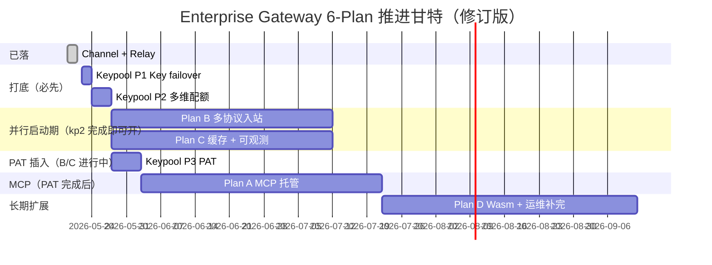

# Enterprise Gateway 路线图：超越 new-api / Higress 的企业级 AI 网关

- **Plan-Id**: 2026-05-21-enterprise-gateway-roadmap
- **Plan-File**: `.cursor/plans/2026-05-21-enterprise-gateway-roadmap.plan.md`
- **Owner**: Damon Li
- **Status**: Master Index（不直接落代码，作为四子 plan 的统筹）
- **创建日期**: 2026-05-21

## 1. 战略定位

企业级 AI 网关现状对标（依据 `.cursor/tmp_网关对比_parse.md` + 上游研究）：

| 维度 | LiteLLM | Portkey | new-api | Higress | Kong/APISIX | **AgenticX Enterprise（目标）** |
|---|---|---|---|---|---|---|
| LLM 协议广度 | ★★★★★ | ★★★★ | ★★★★★ | ★★★★ | ★★★ | **★★★★（聚焦 OpenAI/Claude/Gemini/Responses）** |
| 跨格式转换 | ★★ | ★★★ | ★★★★★ | ★★★ | ★ | **★★★★★（new-api 同档）** |
| 企业治理（IAM/审计/策略） | ★ | ★★★★★ | ★★ | ★★★★ | ★★★★ | **★★★★★（已落地 + 持续）** |
| MCP 托管 | ✗ | ✗ | ✗ | **★★★★★** | ✗ | **★★★★★（Higress 同档 + Machi 联动）** |
| Wasm 扩展性 | ✗ | ✗ | ✗ | ★★★★★ | ★★ | **★★★★（子集，足够企业自定义）** |
| AI 语义缓存 | ✗ | ★★★ | ★★ | ★★★★ | ✗ | **★★★★★（L1+L2 + 分价计费）** |
| AI 深度可观测 | ★ | ★★★★ | ★★ | ★★★★ | ★★ | **★★★★（TTFT/TPS/cache + Grafana）** |
| 端侧闭环（与 Desktop 联动） | ✗ | ✗ | ✗ | ✗ | ✗ | **★★★★★（独有，护城河）** |
| 配额（部门/用户/PAT 多维） | ✗ | ★★★★ | ★★ | ★★★ | ★★★ | **★★★★（含 TPM/RPM/并发）** |
| 私有化友好（单二进制） | ★★★★ | ✗ | ★★★★ | ★★★ | ★★ | **★★★★★（无 CGO，Go 单二进制）** |

**核心策略**：**不复制实现**（License 与维护负担），**只吸收机制**；用干净室方式在 `enterprise/apps/gateway` 内自研，保持 IAM / Policy / Audit / Quota 四条护城河不动。

---

## 2. 已完成 / 进行中工作（2026-05-22 修订）

| 能力 | Plan | 状态 |
|---|---|---|
| Channel + Relay + Adaptor 接口 + 加权重试 + 预扣结算 + 流式加固 | `2026-05-19-enterprise-gateway-channel-relay.plan.md` | ✅ 已落（2026-05-21 验收） |
| Key 级 failover + 多维配额 + PAT | `2026-05-19-enterprise-gateway-keypool-quota-pat.plan.md` | ⬜ **未开始**（2026-05-22 修订版：删 `/admin/keypool` 页、删 `provider_key_pool` 表，复用 `gateway_channels.metadata.keyRefs`） |
| 网关审计 PG 化 + Blake2b 链 + 双写 | `2026-05-04-gateway-audit-production.plan.md` | ✅ |
| IM 远程指令网关 | `2026-03-30-im-remote-command-gateway.plan.md` | 🟡 |

---

## 3. 本次新增的四个 Plan（按推荐推进顺序）

### Plan A — MCP Server 托管 + OpenAPI → MCP

- 文件：`.cursor/plans/2026-05-21-enterprise-gateway-mcp-hosting.plan.md`
- **价值定位**：**差异化 No.1**（Higress 杀手锏 + Machi 端侧联动护城河）
- **周期**：~7 周
- **核心 FR**：MCP server 容器化 / OpenAPI→Tool 转换 / streamable-http + SSE 双 transport / PAT 鉴权 / 工具调用配额 / 审计 / Admin UI / Machi 一键发现
- **依赖**：keypool plan PAT 链路

### Plan B — 跨格式协议入站 + 转换 + Reasoning Effort

- 文件：`.cursor/plans/2026-05-21-enterprise-gateway-multi-protocol-inbound.plan.md`
- **价值定位**：**对标 new-api 核心运营价值**（客户 Anthropic / Gemini SDK 无改造直连）
- **周期**：~6.5 周
- **核心 FR**：`/v1/messages` / `/v1beta/.../generateContent` / `/v1/responses` 入站；OpenAI ⇄ Claude 双向、OpenAI → Gemini、Gemini → OpenAI 文本；Reasoning Effort 派生；Thinking-to-content
- **依赖**：Channel/Relay plan（Adaptor 接口）

### Plan C — AI 语义缓存 + Cache 分价计费 + AI 可观测

- 文件：`.cursor/plans/2026-05-21-enterprise-gateway-ai-cache-observability.plan.md`
- **价值定位**：**省钱 + 看得清**，客户演示价值极高
- **周期**：~6.5 周
- **核心 FR**：L1 精确缓存 / L2 语义缓存（可选）/ usage 归一 / cache token 分价 / TTFT/TPS/hit-ratio 指标 / Grafana / Admin 缓存与计费 UI / Anthropic cache_control 透传
- **依赖**：与 Plan B 在 cache_control 处联调

### Plan D — Wasm 插件运行时 + 运维补完（自检/错误指纹/Pyroscope/WAF）

- 文件：`.cursor/plans/2026-05-21-enterprise-gateway-wasm-plugin-runtime.plan.md`
- **价值定位**：**长期扩展性**（Higress 同档）+ 收口运维细节
- **周期**：~7.5 周
- **核心 FR**：wazero 运行时 / ABI 子集 / 热加载 / 示范插件 / channel 自检 / 错误指纹聚类 / Pyroscope / 基础 WAF（作为首批 Wasm 插件）
- **依赖**：无强依赖；建议放在 A/B/C 之后

---

## 4. 推荐推进顺序与并行策略（2026-05-22 修订）



### 推进顺序要点

1. **Keypool 拆分推进**：原 plan 把 Key/Quota/PAT 三件事打包；修订版按 P1（1.5d）→ P2（4d）→ P3（6d）切片，**P2 完工即可放 B/C 并行启动**，PAT (P3) 不阻塞客户演示线。
2. **B / C 不等 PAT**：Multi-Protocol Inbound 与 AI Cache + Observability 在 JWT 上完全可跑；PAT 只是新增鉴权方式，不是先决条件。
3. **A（MCP）必须等 PAT**：MCP 的「远程发现 + Machi 一键添加」依赖 `agx-pat-` 体系；PAT 落地后 A 才能真正闭环。
4. **A / B / C 三 plan 文件层不冲突**（A 改 `mcphost/`、B 改 `adaptor/` + `inbound/` + `outbound/`、C 改 `cache/` + `metering/` + `observability/`），可三线并行。
5. **D 串行收尾**：Wasm 运行时是底层基础设施，放在 A/B/C 之后能让上游 plan 的"未来扩展点"自然走向 Wasm。
6. **「端 + 云」差异化**：A（MCP 托管）+ Machi Desktop 联动是我们超过 Higress 的关键，但优先级排在 B/C 之后是因为 B/C 客户演示价值更通用（B 让客户 SDK 零改造、C 让客户看见省钱）。

---

## 5. 子 plan 依赖矩阵（2026-05-22 修订，区分 Keypool 三阶段）

| | A · MCP | B · 多协议 | C · 缓存观测 | D · Wasm |
|---|---|---|---|---|
| **依赖 Channel/Relay** ✅ | ◑（用 adaptor） | ●（直接复用） | ◑（用 usage） | — |
| **依赖 Keypool P1（Key failover）** | — | — | — | — |
| **依赖 Keypool P2（多维配额）** | ◑（工具调用配额复用） | ◑（PAT 维度计费） | ◑（计费维度） | — |
| **依赖 Keypool P3（PAT）** | ●（远程发现鉴权） | — | — | — |
| **依赖 A** | — | — | — | ◑（Wasm 可作为 MCP backend 类型） |
| **依赖 B** | — | — | ◑（cache_control 透传协议联调） | — |
| **依赖 C** | — | — | — | ◑（Wasm 插件可观测沿用指标体系） |
| **依赖 D** | — | — | — | — |

`●`=强依赖 / `◑`=弱依赖。

**关键洞察**：B 和 C 对 PAT 是「弱依赖」——计费维度可后补；只有 A（MCP 远程发现）真正强依赖 PAT。所以 PAT (P3) 可与 B/C 并行实施。

---

## 6. 与对照对象的整体能力地图

```
                    ┌────────────────────────────────────┐
                    │     AgenticX Enterprise Gateway    │
                    │                                    │
   入站层（多协议）   │  /v1/* (OpenAI) ─ /v1/messages    │
   (Plan B)         │  /v1beta/* (Gemini) ─ /v1/responses│
                    │  /mcp/* (MCP host, Plan A)         │
                    │                                    │
   认证/策略         │  PAT + JWT + RS256 + RBAC scopes   │
                    │  Policy 3-channel (req/resp/stream)│
                    │                                    │
   缓存层 (Plan C)   │  L1 exact → L2 semantic            │
                    │                                    │
   插件链 (Plan D)   │  Wasm chain (hot-reload, sandbox)  │
                    │  Declarative rule-pack (existing)  │
                    │                                    │
   路由/Adaptor     │  Channel(weighted) → KeyPool      │
                    │  Adaptor: OpenAI/Claude/Gemini    │
                    │                                    │
   出站层 (Plan B)   │  Reasoning Effort 派生 + Thinking │
                    │  转换器（pivot ⇄ Claude/Gemini）   │
                    │                                    │
   计量/可观测       │  Usage 归一 + Cache 分价计费       │
   (Plan C)         │  Prometheus(TTFT/TPS/cache/health) │
                    │  Grafana dashboard                 │
                    │                                    │
   审计              │  PG + JSONL 兜底 + Blake2b 链      │
                    │  错误指纹聚类 (Plan D)             │
                    └────────────────────────────────────┘
                                  │
                                  ▼
                    ┌────────────────────────────────────┐
                    │  Machi Desktop（端侧闭环护城河）    │
                    │  • PAT 自动派发                    │
                    │  • 远程 MCP 一键发现 (Plan A FR-8) │
                    │  • 用量/审计回显                   │
                    └────────────────────────────────────┘
```

---

## 7. 风险与底线

| 风险 | 缓解 |
|---|---|
| 同时开 4 个大 plan 资源稀释 | 严格按"keypool 落地 → A/B/C 并行 → D"节奏；每 plan 内已分 P0~P5 可独立交付 |
| 与现有 IAM / Policy / Audit 模型不兼容 | 四 plan 均明确"不改既有表主结构、仅追加字段"；以 env 开关回退 |
| AGPL 污染 | 严禁从 new-api 源码复制；从协议规范出发自研（每 plan 已写入条款） |
| 客户演示节奏被工程节奏拖累 | A.P1 / B.P0 / C.P0 任一完成即可单独路演；不必等全套 |
| 我们 vs Higress 同台测评 | 同台时强调"端 + 云联动"+"私有化无 CGO 单二进制"，不在协议数量上硬拼 |

---

## 8. 推进与提交规范

1. 每个 plan 独立 git branch；commit 必带 `Plan-Id` + `Plan-File` trailers，统一用 `/commit --spec=<plan_path>` 自动注入。
2. 收尾时 `/update-conclusion --plan=<plan_path>` 聚合该 Plan-Id 所有 commits，更新对应模块 conclusion 文档。
3. 每个 plan 的 P0 完成都做一次 `enterprise/customers/<demo>/scripts/acceptance-*.sh` 验收基线护栏。
4. 任一 plan 的对外宣传话术须遵守工作区规则：**只描述仓库内已落地的能力**，不口头承诺尚未实现的特性（尤其压测指标、Gateway 部门/用户配额、企业 SSO 等历史 caveat）。

---

## 9. 总览结论

按上述四个 plan 全部交付后，AgenticX Enterprise Gateway 将拥有：

- **协议入站广度**：与 new-api 同档（OpenAI / Claude / Gemini / Responses + Reasoning Effort）
- **MCP 托管能力**：与 Higress 同档（且加 Machi 端侧联动）
- **跨格式转换**：与 new-api 同档（pivot 架构）
- **AI 缓存与可观测**：高于二者（统一计费 + Grafana 开箱）
- **扩展性**：达到 Higress 90%（Wasm 子集 + 声明式 manifest 双轨）
- **私有化部署**：优于二者（无 CGO 单二进制 Go + 无强外部依赖）
- **企业治理**：远超二者（IAM + RBAC + Blake2b 审计链 + 多维配额 + PAT 已成体系）
- **端云闭环**：独家（Machi Desktop + Web Portal + Gateway + Admin Console 全栈拉通）

→ **定位话术**："国内首个面向 2B 私有化的 AI Native Gateway + 端云闭环平台"。

---

**Made-with: Damon Li**
