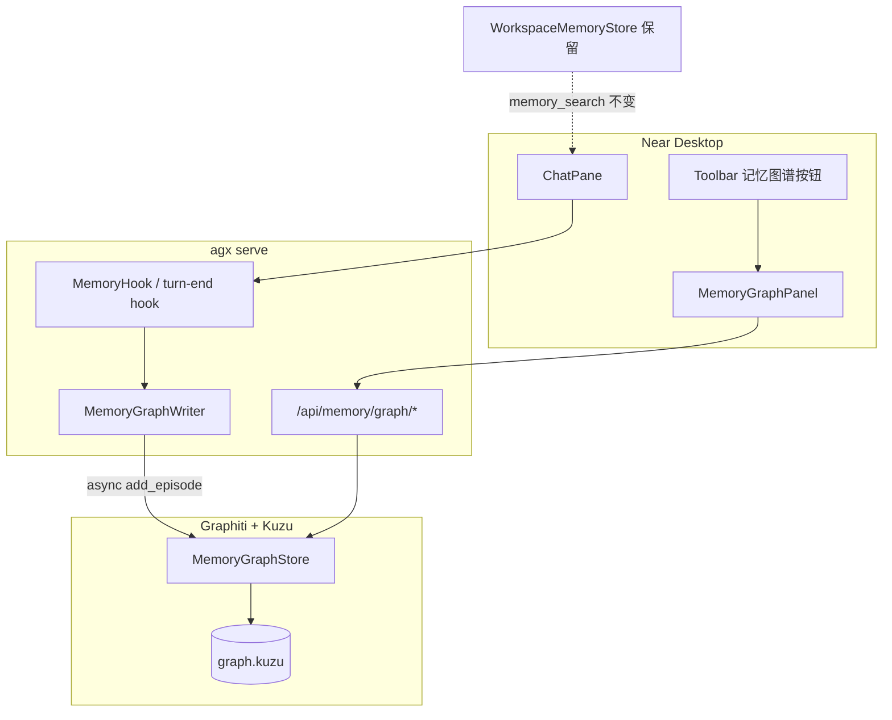

# Near Memory Graph — Graphiti 内化实施计划

**Plan-Id**: 2026-05-31-near-memory-graph-graphiti  
**Plan-File**: `.cursor/plans/2026-05-31-near-memory-graph-graphiti.plan.md`  
**Status**: Draft（待用户审核；**审核通过前禁止编码**）  
**Owner**: Damon  
**Made-with**: Damon Li

**研究依据**（已实现，不在本 Plan 编码范围）：

- `research/codedeepresearch/graphiti/graphiti_proposal.md`
- `research/codedeepresearch/graphiti/graphiti_agenticx_gap_analysis.md`
- `research/codedeepresearch/graphiti/graphiti_eval_plan.md`
- 上游 shallow clone：`research/codedeepresearch/graphiti/upstream/` @ `34f56e65` (graphiti-core 0.29.1)

---

## 1. 背景与动机

Near Desktop **后台已有记忆、前台不可见**：

| 层 | 现状 | 路径 |
|---|---|---|
| 写入 | MemoryHook 启发式 → daily md / MEMORY.md | `agenticx/runtime/hooks/memory_hook.py` |
| 检索 | WorkspaceMemoryStore FTS + hashing hybrid | `agenticx/memory/workspace_memory.py` |
| 注入 | Meta `_build_memory_recall_context` | `agenticx/runtime/prompts/meta_agent.py` |
| UI | 仅「会话摘要延续」开关 + 消息收藏 | `SettingsPanel.tsx` `SessionMemoryPanel` |

用户诉求：**图谱方式管理和展示记忆**，感知更立体直观。

Graphiti OSS 提供 **时态 context graph 构建与 hybrid 检索**，**不含可视化 UI**（Zep 托管才有 Dashboard）。因此本 Plan 拆为：

1. **数据层**：Graphiti + 嵌入式 Kuzu（默认零 Docker）
2. **API 层**：Studio 稳定 Graph DTO
3. **展示层**：Near 新建 Memory Graph Panel

**核心原则**：Human-visible graph, machine-usable text — **不替换** `memory_search` / `MEMORY.md` 主路径。

---

## 2. 目标与非目标

### 2.1 目标（In-Scope）

| ID | 目标 |
|---|---|
| **G1** | Near toolbar 可打开「记忆图谱」侧栏，2D 力导向图展示 entity / episode / fact |
| **G2** | Studio 暴露 `/api/memory/graph/*` 只读子图 API（overview / episode / search / status） |
| **G3** | 异步 Graphiti ingest：回合结束后后台 `add_episode`，**不阻塞** chat SSE |
| **G4** | `group_id` 按 meta / avatar / session 隔离，切换窗格不串图 |
| **G5** | `~/.agenticx/config.yaml` 新增 `memory_graph:` 节；`enabled: false` 默认关 |
| **G6** | LLM/embedder 复用 Near 已配置 provider（OpenAI-compatible / Ollama） |
| **G7** | ingest 失败可观测（status API + Panel 内黄色警示），chat 仍正常 |
| **G8** | 收藏消息可触发高优先级 ingest（MVP 阶段） |

### 2.2 非目标（Out-of-Scope）

- ❌ 用 Graphiti **完全替换** `WorkspaceMemoryStore` 或 MemoryHook
- ❌ 强制 Docker Neo4j / FalkorDB 才能使用 Near（FalkorDB 仅 dev optional）
- ❌ 复刻 Zep 托管 Dashboard / 多租户治理
- ❌ 3D 图谱、brain 级 Multi-Brain 融合（见 `2026-05-20-multi-brain-knowledge-architecture.plan.md`，本 Plan 不交叉）
- ❌ Phase 3「自动挖掘」Meta 工具 `memory_graph_explore`（单独后续 Plan）
- ❌ PyInstaller/DMG 必打包 graphiti+kuzu（Phase 2 评估；MVP 可 dev-only flag）

---

## 3. 概念模型

### 3.1 Graph 分区（group_id）

```
meta 窗格（avatar_id 空）     → group_id = "meta:default"
分身窗格（avatar_id = X）     → group_id = "avatar:{avatar_id}"
普通 session（可选细粒度）    → group_id = "session:{session_id}"
```

**UI 默认 scope**（可配置 `memory_graph.default_scope`）：

| scope 值 | Panel 默认展示 |
|---|---|
| `session` | 当前 pane 的 session 子图 |
| `avatar` | 当前分身聚合子图 |
| `meta` | Meta 全局子图 |

**不变量**：API 必须显式校验请求的 `group_id` 与当前 pane 的 `avatar_id` / `session_id` 一致，禁止跨 partition 读取。

### 3.2 UI DTO（前后端契约，MVP 冻结）

```typescript
type GraphNodeDTO = {
  id: string;
  kind: "entity" | "episode" | "community";
  label: string;
  summary?: string;
  validAt?: string | null;
  invalidAt?: string | null;
};

type GraphEdgeDTO = {
  id: string;
  source: string;
  target: string;
  label: string;
  status: "active" | "invalidated";
  validAt?: string | null;
  invalidAt?: string | null;
};

type GraphViewDTO = {
  nodes: GraphNodeDTO[];
  edges: GraphEdgeDTO[];
  meta: {
    groupId: string;
    generatedAt: string;
    truncated: boolean;
    nodeCount?: number;
    edgeCount?: number;
  };
};
```

### 3.3 存储布局

```
~/.agenticx/
├── memory/
│   ├── main.sqlite              # 既有 WorkspaceMemoryStore（不动）
│   └── graph.kuzu               # Graphiti Kuzu 单文件（新增）
├── memory/graph_ingest.json     # ingest 队列状态 / last_error（新增）
└── config.yaml                  # memory_graph: 节（新增）
```

---

## 4. 架构



---

## 5. 模块与文件清单

### 5.1 后端（新增）

```
agenticx/memory/graph/
├── __init__.py
├── config.py           # 读 ~/.agenticx/config.yaml memory_graph:
├── group_id.py         # scope → group_id 派生 + 校验
├── dto.py              # Graphiti → GraphViewDTO 映射
├── clients.py          # 从 AgenticX provider 构造 LLM/embedder/cross_encoder
├── store.py            # MemoryGraphStore：ensure_ready / overview / search / episode
└── writer.py           # asyncio Queue worker；ingest_turn()
```

**改动（非新增）**：

| 文件 | 改动 |
|---|---|
| `agenticx/studio/server.py` | 注册 `/api/memory/graph/*` 路由 |
| `agenticx/runtime/hooks/memory_hook.py` 或 server turn-end | enqueue ingest（P1；P0 仅 CLI 手动 ingest） |
| `agenticx/cli/main.py` 或子命令模块 | `agx memory-graph ingest|overview|status` |
| `pyproject.toml` | 可选 extra：`graphiti = ["graphiti-core[kuzu]>=0.29.1"]` |

### 5.2 Desktop（新增 / 改动）

```
desktop/src/components/memory/
├── MemoryGraphPanel.tsx      # 侧栏容器：顶栏筛选 + 画布 + 时间轴
├── MemoryGraphCanvas.tsx     # react-force-graph-2d 封装
├── MemoryGraphDetail.tsx     # 节点/边详情侧栏
├── memory-graph-api.ts       # fetch /api/memory/graph/*
└── memory-graph-types.ts     # GraphViewDTO 镜像

desktop/src/App.tsx           # toolbar 按钮 + cycleSidePanel("memory-graph")
desktop/package.json          # 新增 react-force-graph-2d（P0-T5 时加）
```

**设置页（P1）**：`SettingsPanel.tsx` 增加「记忆图谱」卡片：`enabled` / `default_scope` / `ingest.auto` / 状态只读（node_count、last_error）。

---

## 6. HTTP API 规格

| Method | Path | Phase | 说明 |
|---|---|---|---|
| GET | `/api/memory/graph/overview` | P0 | Query: `scope`, `avatar_id?`, `session_id?`, `limit_nodes`, `limit_edges` |
| GET | `/api/memory/graph/episodes` | P1 | Query: `group_id`, `last_n` |
| GET | `/api/memory/graph/episode/{uuid}` | P0 | 单 episode 溯源子图 |
| POST | `/api/memory/graph/search` | P1 | Body: `{ group_id, query, center_node_uuid? }` |
| GET | `/api/memory/graph/status` | P0 | pending_jobs, last_error, counts |
| DELETE | `/api/memory/graph/episode/{uuid}` | P1 | UI 删除记忆片段 |

**错误语义**：

- `memory_graph.enabled=false` → `503` + `{ "error": "memory_graph_disabled" }`
- group 校验失败 → `403`
- Kuzu/Graphiti 未初始化 → `503` + 可读 message（不 500 拖垮 serve）

---

## 7. 分阶段任务（可执行 WBS）

### Phase 0 — PoC（目标 1 周，只读 + 手动 ingest）

| Task | 内容 | 验收（AC） |
|---|---|---|
| **P0-T1** | `memory_graph` 配置加载；`GRAPHITI_TELEMETRY_ENABLED=false` 写入初始化 | 缺省 `enabled: false`；配置热读不 crash |
| **P0-T2** | `MemoryGraphStore.ensure_ready()`：KuzuDriver + Graphiti indices | 首次启动创建 `graph.kuzu` |
| **P0-T3** | `GET overview` / `GET episode/{uuid}` / `GET status` | curl 返回合法 `GraphViewDTO` |
| **P0-T4** | CLI `agx memory-graph ingest --session-id X` 从 messages.json 构造 episode | 3 轮对话后 overview ≥3 nodes |
| **P0-T5** | Desktop Panel 最小版：toolbar 入口 + 静态→真 API 画布 | 点击节点不 crash；空态文案正确 |
| **P0-T6** | `tests/test_smoke_memory_graph_graphiti.py`（mock Graphiti 的 unit 部分） | CI 默认绿；integration 标记 optional |

**P0 不做**：自动 turn-end ingest、搜索框、删除 episode、设置页 GUI。

### Phase 1 — MVP（目标 2 周，用户可日常使用）

| Task | 内容 | 验收（AC） |
|---|---|---|
| **P1-T1** | `MemoryGraphWriter` + asyncio Queue；server turn-end 或 MemoryHook 后 enqueue | 发消息后 chat 首 token 延迟无 measurable 回归 |
| **P1-T2** | `add_episode` 格式：`user({nick}): ...\nassistant(Machi): ...`；provider 复用 | ingest P95 ≤15s（本地 cloud LLM） |
| **P1-T3** | Panel 完整：scope 切换、搜索、时间轴、详情、invalidated 边样式 | 手动 T1–T3（eval plan）通过 |
| **P1-T4** | `POST /api/memory/save` 收藏成功后高优先级 ingest | 收藏 30s 内 episode 出现在时间轴 |
| **P1-T5** | group 隔离单测 + `ingest` 失败不影响 chat | T2/T4 eval 通过 |
| **P1-T6** | `docs/guides/memory-graph.md` + Settings 记忆图谱卡片 | 中文用户可自助启用 |

### Phase 2 — 稳定化（MVP 合并后另开 PR，本 Plan 仅列提纲）

- 大图谱 node cap + community 聚合展示
- `memory_search` 可选联动 graph search 摘要
- Windows DMG：`graphiti-core[kuzu]` 体积与 wheel 验证
- FalkorDB dev compose profile（文档级）
- eval 门禁纳入 CI nightly

### Phase 3 — 自动挖掘（**不在本 Plan 实施**）

- `memory_graph_explore` Meta 工具；fact 评分（度 + recency + favorite boost）

---

## 8. 需求块（FR / NFR / AC）

### Functional Requirements

- **FR-1**：用户在 Near toolbar 打开记忆图谱 Panel，看到当前 scope 的 force-directed 子图。
- **FR-2**：节点区分 entity / episode / community；边区分 active / invalidated。
- **FR-3**：点击节点展示 summary、时态窗口、来源 episode 摘录（P1）。
- **FR-4**：回合结束后异步 ingest，不阻塞 `/api/chat`（P1）。
- **FR-5**：`group_id` 隔离 meta / avatar / session（P0 派生 + P1 单测）。
- **FR-6**：`memory_graph.enabled=false` 时 API 明确拒绝、UI 显示未启用（P0）。
- **FR-7**：ingest 状态可通过 `/status` 与 Panel 内警示查看（P0 status，P1 UI）。
- **FR-8**：收藏触发高优先级 ingest（P1）。

### Non-Functional Requirements

- **NFR-1**：ingest 失败 never 导致 chat 500 或消息丢失。
- **NFR-2**：overview API P95 ≤300ms @80 nodes（P1 压测）。
- **NFR-3**：默认 `enabled: false`；一键回滚 = 关开关 + 可选删 `graph.kuzu`。
- **NFR-4**：Graphiti telemetry 默认关闭。
- **NFR-5**：不修改 `WorkspaceMemoryStore` 索引逻辑与 `memory_search` 工具语义。
- **NFR-6**：新增依赖走 optional extra，避免强制拉齐 Neo4j。

### Acceptance Criteria（合并 PR 最低门槛 = P1 完成）

- **AC-1**：3 轮含实体对话 → 图谱 ≥5 nodes、≥3 edges。
- **AC-2**：矛盾事实 ingest 后旧边 `invalidated`、新边 `active`。
- **AC-3**：Meta session A/B ingest 互不可见。
- **AC-4**：关闭 LLM key：ingest fail，chat 正常，status 有原因。
- **AC-5**：`pytest tests/test_smoke_memory_graph_graphiti.py` + memory 回归套件绿。
- **AC-6**：设置页可启用/关闭；重启 Near 后状态保持。

---

## 9. 依赖与配置

### 9.1 Python 依赖（建议）

```toml
# pyproject.toml [project.optional-dependencies]
graphiti = ["graphiti-core[kuzu]>=0.29.1,<0.30"]
```

安装：`pip install -e ".[graphiti]"`（开发）；DMG 打包 Phase 2 再决。

### 9.2 config.yaml 草案

```yaml
memory_graph:
  enabled: false
  backend: kuzu
  db_path: ~/.agenticx/memory/graph.kuzu
  default_scope: session
  ingest:
    auto: true
    max_queue: 32
    semaphore_limit: 2
    max_chars_per_episode: 4096
  llm:
    provider: ""
    model: ""
  embedder:
    provider: ""
    model: ""
  telemetry: false
```

### 9.3 Desktop 依赖（P0-T5）

- `react-force-graph-2d`（或 `react-force-graph` 2d 导出）
- 节点配色使用现有 theme token（`--ui-*` / avatar tint），禁止硬编码 cyan 主按钮外溢

---

## 10. 测试计划

详见 `research/codedeepresearch/graphiti/graphiti_eval_plan.md`。

**本 Plan 强制新增**：

| 文件 | 覆盖 |
|---|---|
| `tests/test_smoke_memory_graph_graphiti.py` | group_id、DTO shape、disabled flag、queue 非阻塞 |
| `tests/test_memory_graph_isolation.py`（P1） | cross-group 403 |
| `tests/test_memory_graph_api.py`（P0） | overview/status 契约 |

**回归必跑**：

```bash
pytest tests/test_smoke_memory_graph_graphiti.py \
       tests/test_workspace_memory_chunking.py \
       tests/test_memory_append_tool.py \
       tests/test_memory_hook_extraction.py \
       tests/test_favorite_to_memory.py -v
```

---

## 11. 风险、回滚与开放问题

### 11.1 风险矩阵

| 风险 | 缓解 |
|---|---|
| Graphiti ingest 429 / 结构化输出失败 | semaphore=2；失败写 status；不重试阻塞 chat |
| Kuzu hybrid 弱 | UI 仍以图结构展示；文本检索继续 WorkspaceMemoryStore |
| 打包体积 | MVP `enabled=false` 默认；Phase 2 再议 DMG |
| scope creep 改 MemoryHook 启发式 | MemoryHook 仅加 enqueue 一行；不改抽取逻辑 |

### 11.2 回滚

1. `memory_graph.enabled: false`
2. 删除 `~/.agenticx/memory/graph.kuzu`（可选）
3. Desktop toolbar 按钮随 flag 隐藏

### 11.3 开放问题（**请审核时确认**）

| # | 问题 | 建议默认 | 备选 |
|---|---|---|---|
| **Q1** | MVP 默认 scope：`session` 还是 `avatar`？ | `session`（最不易串） | `avatar` 聚合更有「分身人格」感 |
| **Q2** | turn-end ingest 挂点：`MemoryHook.on_agent_end` 还是 `server.py` chat 完成回调？ | **server turn-end**（有 session_id 上下文） | MemoryHook（更统一但 session 边界需验证） |
| **Q3** | P0 是否允许仅 dev 手动 CLI ingest（无自动）？ | **是**（降低 P0 风险） | P0 就要自动 |
| **Q4** | Panel 入口：toolbar 独立按钮 vs 设置页内 Tab？ | **toolbar**（与历史/工作区并列） | 设置页 deep link |
| **Q5** | 是否与 Mem0 路径合并？ | **否**，Graphiti 专注结构化图谱；Mem0 保持 optional | 长期统一 memory backend |
| **Q6** | Phase 2 前 DMG 是否打包 graphiti？ | **否**，文档说明 dev 安装 extra | 必须开箱即用 |

---

## 12. 执行顺序与 Commit 策略

### 12.1 建议 Commit 顺序（审核通过后）

1. `feat(memory-graph): config + MemoryGraphStore skeleton (P0-T1,T2)` + 本 Plan 文件
2. `feat(studio): memory graph read API (P0-T3)`
3. `feat(cli): memory-graph ingest/overview commands (P0-T4)`
4. `feat(desktop): MemoryGraphPanel minimal canvas (P0-T5)`
5. `test(memory-graph): smoke tests (P0-T6)`
6. `feat(memory-graph): async writer + turn-end ingest (P1-T1,T2)`
7. `feat(desktop): full memory graph panel + settings (P1-T3,T4)`
8. `test(memory-graph): isolation + docs (P1-T5,T6)`

每 commit 使用 `/commit --spec=.cursor/plans/2026-05-31-near-memory-graph-graphiti.plan.md` 注入 Plan-Id trailer。

### 12.2 Commit Message 模板

```
feat(desktop): near memory graph panel with graphiti backend

## What & Why
- Add Graphiti+Kuzu structured memory layer and Near force-directed graph panel.
- Keep WorkspaceMemoryStore / memory_search unchanged; graph ingest is async.

## Requirements
- FR-1..FR-8, NFR-1..NFR-6, AC-1..AC-6 (see plan)

Plan-Id: 2026-05-31-near-memory-graph-graphiti
Plan-File: .cursor/plans/2026-05-31-near-memory-graph-graphiti.plan.md
Made-with: Damon Li
```

---

## 13. 审核检查清单（给用户）

- [ ] 目标/非目标是否与预期一致（特别是「不替换 WorkspaceMemoryStore」）
- [ ] group_id 三分法是否满足 meta/分身/会话隔离预期
- [ ] P0 只读 + 手动 ingest 是否可接受
- [ ] §11.3 开放问题 Q1–Q6 请选择或补充
- [ ] Phase 2/3 边界是否 OK
- [ ] 确认后可回复「Plan Approved」或逐条修改意见 — **收到 Approved 前不启动编码**
