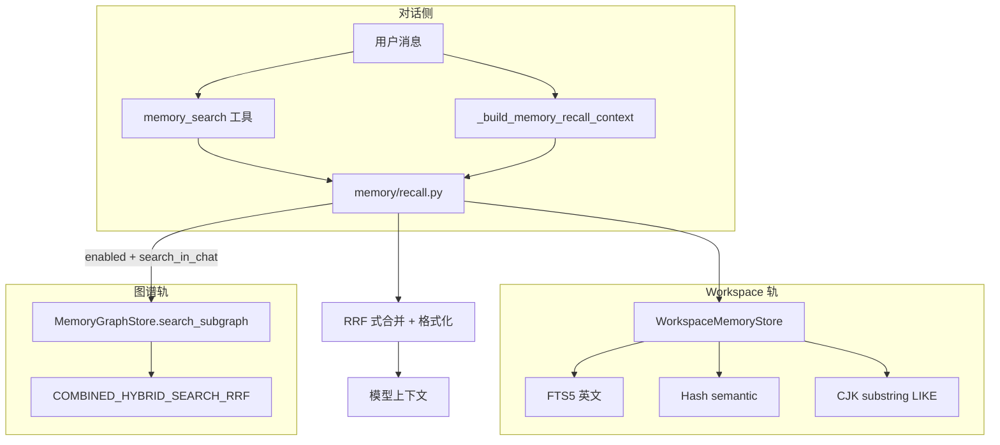

# 记忆检索打通：中文 Workspace 搜索 + 图谱进对话

**Plan-Id**: 2026-06-09-memory-recall-graph-bridge  
**Plan-File**: `.cursor/plans/2026-06-09-memory-recall-graph-bridge.plan.md`  
**Status**: Draft（**用户审核通过前禁止编码**）  
**Owner**: Damon  
**Made-with**: Damon Li  

**前置 Plan（已完成）**：

- `.cursor/plans/2026-05-31-near-memory-graph-graphiti.plan.md` — Graphiti 双轨架构、Panel 只读 API、ingest 队列
- `.cursor/plans/2026-06-09-memory-graph-qwen-extraction-search-fix.plan.md` — qwen `facts→edges`、图谱 Panel 搜索 RRF

**与旧 NFR 的关系**：Graphiti 原 Plan NFR-5 写「不修改 `memory_search` 工具语义」。本 Plan **有意扩展**该语义：在 `memory_graph.enabled` 且配置允许时，同一工具返回 Workspace + Graph 合并结果；Workspace 纯文本路径行为保持向后兼容（仅增强中文检索，不改变 JSON 字段结构）。

---

## 1. 问题陈述

用户观察到三类不一致：

| 现象 | 用户预期 | 实际 |
|------|----------|------|
| 记忆图谱 Panel 有「黑夜传说」节点 | 聊天问「黑夜传说是我喜欢的吗」应能回答 | 模型调用 `memory_search` 后回答「记忆里没有偏好记录」 |
| `MEMORY.md` 已写入「用户喜欢《黑夜传说》」 | 文本记忆应可检索 | hybrid Top5 **不含**该 chunk |
| 图谱 vs 文本双轨 | 至少一条路径能答 | 两条路径对「偏好类问句」均弱 |

**验收场景（AC 锚点）**：

1. 索引后 `memory_search(query="黑夜传说 是我喜欢的吗")` 的 matches 中至少一条含「黑夜传说」与「喜欢」语义。
2. `memory_graph.enabled=true` 且图谱已 ingest 时，同一 query 的返回中含 `source: "graph"` 条目（节点/边摘要），或合并文本里可见图谱 fact。
3. Meta 单聊自动召回块（`_build_memory_recall_context`）对含「黑夜传说」的最近用户句能注入相关 snippet，而非空块。

---

## 2. 根因分析（证据链）

### 2.1 WorkspaceMemoryStore 中文检索失败

**数据存在**：`~/.agenticx/workspace/MEMORY.md` 约 379–401 行 chunk 含「黑夜传说」「喜欢」；`SELECT ... FROM chunks WHERE text LIKE '%黑夜传说%'` 可命中。

**检索失败机制**（`agenticx/memory/workspace_memory.py`）：

1. **FTS5**：`_search_fts` 直接把整句中文 `MATCH ?` 交给 SQLite FTS5；中文无空格分词 → **0 条**。
2. **Semantic**：`_embedding_vector` 仅 `text.split()` 空格分词；中文 query/chunk 常得 **空 token 或单 token** → 64 维 hash 向量几乎无区分度。
3. **Hybrid**：`_merge_ranked(fts, semantic)` 两路皆弱 → Top5 被无关英文 chunk 占据。

### 2.2 图谱与对话未打通（设计缺口）

- **记忆图谱**：Graphiti ingest + Panel `search_subgraph`（已改为 RRF，Panel 可搜）。
- **对话工具**：`memory_search` → 仅 `WorkspaceMemoryStore.search_sync`（`meta_tools.py` L2562–2576、`agent_tools.py` L4265–4288）。
- **自动召回**：`_build_memory_recall_context` 同样只查 Workspace（`meta_agent.py` L299）。
- 原 Graphiti Plan Phase 2 提到「memory_search 可选联动 graph search」——**未实现**。

### 2.3 图谱节点 ≠ 偏好关系（次要）

Panel 中「黑夜传说」可能是 **实体节点**，未必有 `用户 —[LIKES/PREFERS]→ 黑夜传说` 边；问「是我喜欢的吗」更依赖 **Workspace 文本** 或 **带 fact 的边**。因此 **P0 中文 Workspace 修复是阻塞项**；P1 图谱接入是增强项，不能替代 P0。

---

## 3. 目标与非目标

### 3.1 目标

- **G1**：中文（CJK）query 对 `MEMORY.md` / `memory/*.md` 稳定命中（子串 + 改进 tokenization）。
- **G2**：`memory_search` 在配置开启时 **best-effort** 合并图谱 RRF 结果，按会话 `avatar_id` 选 `group_id`。
- **G3**：自动召回与工具描述对齐，减少模型误判「无记忆」。
- **G4**：图谱检索失败不拖垮 Workspace 路径（降级、超时可控）。

### 3.2 非目标（本 Plan 不做）

- 不替换 Workspace 为 Graphiti 单一存储；双轨并行不变。
- 不引入外部 embedding API（百炼/DashScope）改造 Workspace 向量——保持本地 hash 方案，仅增强 CJK token。
- 不改 Graphiti ingest 抽取 prompt 或关系 schema（偏好边质量属后续 eval）。
- 不改 Desktop Panel UI（除可选 tooltip 文案，非必须）。
- 不做 Enterprise portal 侧记忆检索。

---

## 4. 架构概览



**分区**：`derive_group_id_from_avatar_id(session.bound_avatar_id)` → `meta_default` / `avatar_<id>` / `group_<gid>`（与 ingest 一致，`group_id.py`）。

---

## 5. 分阶段实施

### Phase P0 — Workspace 中文检索（必须先做）

#### P0-T1：Query 分词与 CJK 检测

**文件**：`agenticx/memory/workspace_memory.py`

新增（私有）辅助：

```python
_CJK_RE = re.compile(r"[\u4e00-\u9fff\u3400-\u4dbf\uf900-\ufaff]")
_CJK_SEQ_RE = re.compile(r"[\u4e00-\u9fff\u3400-\u4dbf\uf900-\ufaff]{2,}")

def _extract_search_terms(query: str) -> list[str]:
    """英文按空格；CJK 提取连续 2+ 字序列 + 单字（去重，长度降序）。"""
```

规则：

- 英文 token：`split()` 后长度 ≥2 的 alnum 词保留。
- CJK：优先 2–8 字连续段（覆盖「黑夜传说」）；若 query 总长 ≤4 且含 CJK，再保留单字以支持「喜」「猫」类短查。
- 去重、按 term 长度降序（长词优先匹配，减少误命中）。

#### P0-T2：Substring 检索通道

新增 `_search_substring(self, terms: list[str], limit: int)`：

- 对每个 term：`SELECT ... FROM chunks WHERE text LIKE ? ESCAPE '\'`  
- 参数：`%term%`（term 内 `%` `_` 转义）。
- 多 term 命中同一 chunk 时 score 累加（term 越长权重略高）。
- **仅当** `terms` 非空且（存在 CJK term **或** FTS 返回空）时参与 hybrid。

#### P0-T3：改进 semantic token（CJK）

扩展 `_embedding_vector`：

- 保留现有英文 `split()` token。
- 追加 `_extract_search_terms(text)` 中的 CJK terms 作为额外 token 参与 hash 累加。
- **不**改变 `embedding_model` 字段值，避免触发全量 re-index；旧 chunk 在下次 `index_file` 时自然刷新 embedding。可选：在 `search_sync` 首次 CJK 查询时对 query 单独算 vec（chunk 侧已在 index 时写入，需 **P0 验收时** 对用户环境执行一次 `agx` 触发的 `index_workspace` 或文档说明「重新索引一次」）。

**推荐**：P0 实现后在 `search_sync` 开头若检测到 DB 中 chunk 的 embedding 与新版 token 不一致时不自动 rebuild；在 Plan AC 中写「开发者/用户跑一次 workspace 索引」——与现有 `memory_append` 后 index 行为一致。若实现成本低，可在 `_search_semantic` 对 CJK query 增加 **substring 分数加成** 而非依赖旧 embedding。

#### P0-T4：Hybrid 合并策略

```python
def search_sync(..., mode="hybrid"):
    fts = self._search_fts(...)
    sem = self._search_semantic(...)
    terms = _extract_search_terms(q)
    sub = self._search_substring(terms, n*2) if _should_substring(q, fts, terms) else []
    merged = self._merge_ranked(fts, sem, sub)  # 扩展为 N 路，同 id 取 max score
```

`_should_substring`：`bool(terms) and (any(_CJK_RE.search(t) for t in terms) or not fts)`。

#### P0-T5：测试

**文件**：`tests/test_workspace_memory.py`

新增 `test_workspace_memory_cjk_substring_search`：

- 临时 workspace 写入 `MEMORY.md`：`- 用户喜欢《黑夜传说》系列电影`
- index → `search_sync("黑夜传说 是我喜欢的吗", mode="hybrid")`
- assert 任一 match.text 含「黑夜传说」

可选：`test_workspace_memory_cjk_fts_still_empty` 文档化 FTS 对中文仍为 0，靠 substring 补位。

---

### Phase P1 — 图谱检索接入对话

#### P1-T1：统一 recall 模块

**新文件**：`agenticx/memory/recall.py`

```python
async def search_memory_for_chat(
    query: str,
    *,
    limit: int = 5,
    mode: str = "hybrid",
    avatar_id: str | None = None,
    session_id: str | None = None,
    include_graph: bool | None = None,  # None → 读 config
) -> list[dict]:
```

职责：

1. 调 `WorkspaceMemoryStore().search_sync(...)` → 每条标记 `"source": "workspace"`。
2. 若 `load_memory_graph_config().enabled` 且 `search_in_chat`（新字段，默认 `true`）且 `include_graph != False`：
   - `group_id = derive_group_id_from_avatar_id(avatar_id, session_id=session_id)`
   - `MemoryGraphStore().search_subgraph(group_id, query, limit_nodes=20, limit_edges=30)`（复用现有 25s timeout）
   - 将 nodes/edges 转为 compact snippets（见下）
   - 标记 `"source": "graph"`
3. **合并**：按 chunk id / `(node_uuid, edge_uuid)` 去重；分数 Workspace 与 Graph **分轨 RRF**（rank 1→1.0, 2→0.5…）再归一化；总条数截断 `limit`（默认 workspace 至少保留 `ceil(limit*0.6)`，graph 最多 `floor(limit*0.4)`，可配置）。
4. **异常**：`MemoryGraphUnavailableError` / timeout → 仅返回 workspace 结果，附 optional `graph_skipped_reason` 于 JSON（工具层决定是否暴露给模型）。

**Graph snippet 格式**（供 LLM 读）：

```
[graph] 节点: 黑夜传说 | 摘要: ... 
[graph] 关系: 用户 -[MENTIONS]-> 黑夜传说 | fact: ...
```

实现参考 `build_graph_view` 返回的 node `name`/`summary`、`edge` `fact`/`name` 字段（读 `agenticx/memory/graph/dto.py` 现有 mapper）。

#### P1-T2：工具与自动召回接线

| 位置 | 改动 |
|------|------|
| `agenticx/runtime/meta_tools.py` `memory_search` | 传入 `session.bound_avatar_id` / `session_id`；改调 `search_memory_for_chat`（sync 包装 `asyncio.run` 或已有 loop 则用 `run_on_graphiti_loop` 仅 graph 部分——**避免嵌套 loop**：recall 内 graph 走 `run_on_graphiti_loop`，workspace 保持 sync） |
| `agenticx/cli/agent_tools.py` `_tool_memory_search` | 同上；需 `dispatch_tool_async` 传入 `session`（已有 pattern，参照 `skill_use` L3914） |
| `agenticx/runtime/prompts/meta_agent.py` `_build_memory_recall_context` | 用 recall 合并结果填充「相关历史记忆」；graph 条目前缀 `[图谱]` |

**Sync 边界**：`search_memory_for_chat` 提供 `search_memory_for_chat_sync` = workspace sync + `asyncio.run(graph_part)` 或使用 `agenticx/memory/graph/executor.run_on_graphiti_loop` 包装整段 async recall（与 store 一致）。

#### P1-T3：配置

**文件**：`agenticx/memory/graph/config.py`

```yaml
memory_graph:
  enabled: true
  search_in_chat: true   # 新：false 则对话仅 Workspace（Panel 搜索不受影响）
  search_in_chat_graph_limit: 2  # 可选：合并结果中 graph 条数上限
```

环境变量：`AGX_MEMORY_GRAPH_SEARCH_IN_CHAT=0` 可关闭。

#### P1-T4：工具 schema 描述

更新 `meta_tools.py` / `agent_tools.py` 中 `memory_search` description：

> 检索工作区 Markdown 记忆（MEMORY.md 等）；启用记忆图谱时合并同分区图谱事实。中文关键词依赖子串匹配；英文支持 FTS。

不新增独立 `graph_memory_search` 工具（减少模型选择负担）；若后续 eval 显示混淆再拆。

#### P1-T5：测试

**新文件或扩展**：`tests/test_smoke_memory_recall_bridge.py`

- Mock `MemoryGraphStore.search_subgraph` 返回固定 node/edge
- assert merge 结果含 workspace + graph sources
- `search_in_chat=false` 时仅 workspace
- graph 抛 `MemoryGraphUnavailableError` 时仍返回 workspace matches

#### P1-T6：文档

**文件**：`docs/guides/memory-graph.md`

增加章节「对话检索」：双轨并行、配置项、`memory_search` 行为、与 Panel 搜索区别。

---

## 6. 需求与验收

### 功能需求

| ID | 描述 |
|----|------|
| FR-1 | CJK query 必须通过 substring 或改进 semantic 命中含该词的 MEMORY chunk |
| FR-2 | hybrid 在 FTS 为空时不得返回与 query 无关的纯英文 junk 占满 TopN（substring 应优先） |
| FR-3 | `memory_search` 在 `memory_graph.enabled && search_in_chat` 时合并 graph 结果 |
| FR-4 | group_id 与会话 avatar 一致，不跨分区泄漏 |
| FR-5 | 图谱超时/未初始化时 Workspace 路径仍成功 |
| FR-6 | 自动召回使用与工具相同的 recall 逻辑（同一函数） |

### 非功能需求

| ID | 描述 |
|----|------|
| NFR-1 | Workspace search 额外延迟 < 50ms（substring 单表 LIKE，chunk 量级 <10k） |
| NFR-2 | 含 graph 的 recall P95 < 30s（继承 graph search timeout） |
| NFR-3 | 不新增必填 Python 依赖 |
| NFR-4 | JSON 响应向后兼容：`matches[]` 仅新增可选字段 `source`、`graph_kind` |

### 验收标准

| ID | 步骤 | 期望 |
|----|------|------|
| AC-1 | 本地 index workspace 后 CLI/工具 `memory_search("黑夜传说 是我喜欢的吗")` | matches[0].text 含「黑夜传说」 |
| AC-2 | `pytest tests/test_workspace_memory.py -k cjk` | 绿 |
| AC-3 | enabled graph + mock ingest 后 recall merge | 含 source=graph 条目 |
| AC-4 | Meta 单聊发送「黑夜传说是我喜欢的吗」 | 系统提示或工具结果可见偏好 snippet，模型不再声称「完全没有记录」 |
| AC-5 | `search_in_chat=false` | 行为等同 P0，无 graph 调用 |

---

## 7. 涉及文件清单

| 文件 | Phase | 操作 |
|------|-------|------|
| `agenticx/memory/workspace_memory.py` | P0 | 修改 |
| `tests/test_workspace_memory.py` | P0 | 修改 |
| `agenticx/memory/recall.py` | P1 | 新增 |
| `agenticx/memory/graph/config.py` | P1 | 修改 |
| `agenticx/runtime/meta_tools.py` | P1 | 修改 |
| `agenticx/cli/agent_tools.py` | P1 | 修改 |
| `agenticx/runtime/prompts/meta_agent.py` | P1 | 修改 |
| `tests/test_smoke_memory_recall_bridge.py` | P1 | 新增 |
| `docs/guides/memory-graph.md` | P1 | 修改 |

**明确不改**：`desktop/` Panel 组件、Enterprise、`graphiti` ingest writer（除只读 search 复用）。

---

## 8. 风险与缓解

| 风险 | 缓解 |
|------|------|
| LIKE `%term%` 全表扫描变慢 | chunk 规模小可接受；term 长度 ≥2；limit 严格 |
| 旧 embedding 未含 CJK token | P0 依赖 substring 为主；index 后自然更新 semantic |
| asyncio 嵌套 | graph 仅经 `run_on_graphiti_loop`；recall 提供单一 sync 入口 |
| 图谱无 LIKES 边仍答不好 | P0 保证 MEMORY 命中；工具描述提示「偏好以 MEMORY 为准，图谱为补充」 |
| 合并结果过长 | tool_result_budget 已有 `memory_search: small`；snippet 截断 240 字 |

---

## 9. 实施顺序与提交建议

1. **Commit 1（P0）**：`fix(memory): CJK substring search for workspace memory`  
   - Plan-Id: 2026-06-09-memory-recall-graph-bridge  
   - 仅 workspace_memory + tests  

2. **Commit 2（P1）**：`feat(memory): merge graph search into memory_search and recall`  
   - recall 模块 + tools + config + docs + smoke tests  

每 commit 含 `Made-with: Damon Li`；使用 `/commit --spec=.cursor/plans/2026-06-09-memory-recall-graph-bridge.plan.md`。

---

## 10. 实施后验证清单（人工）

- [ ] `~/.agenticx/workspace` 已 index（设置页或发一条消息后自动）
- [ ] Desktop 记忆图谱 Panel 搜「黑夜传说」仍正常（RRF，不回归）
- [ ] Machi 单聊：「黑夜传说是我喜欢的吗」→ 引用 MEMORY 或 graph fact
- [ ] 分身窗格：graph 结果限定 `avatar_<id>` 分区
- [ ] 关闭 `search_in_chat` 后无 graph 延迟

---

## 11. 后续（本 Plan 外）

- Phase 2 eval：偏好类关系抽取质量（LIKES/PREFERS 边）
- 可选：Workspace 换真实 embedding provider（config 驱动）
- 原 Graphiti Plan P2 性能 cap / Windows 打包（已有独立 track）
