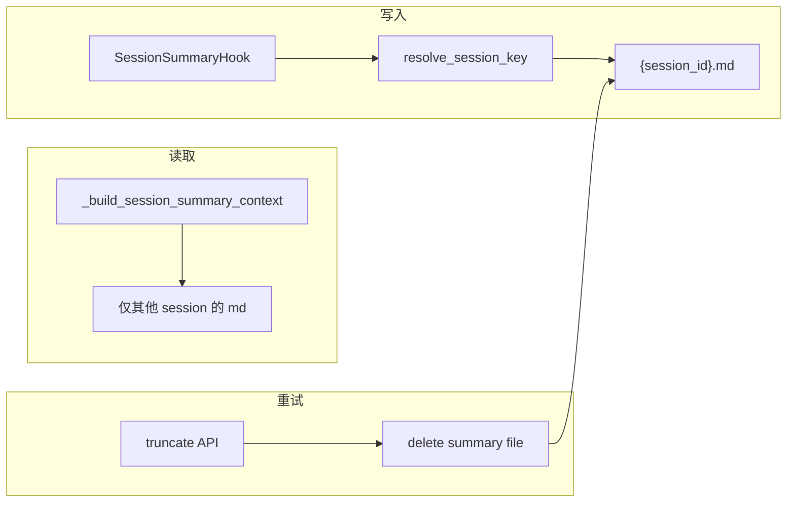

# Session Summary 重试隔离 — 消除「上一轮答错了」幽灵上下文

**Plan-Id**: 2026-06-09-session-summary-retry-isolation  
**Plan-File**: `.cursor/plans/2026-06-09-session-summary-retry-isolation.plan.md`  
**Status**: Draft（**用户审核通过前禁止编码**）  
**Owner**: Damon  
**Made-with**: Damon Li  

**关联 incident**（session `7e4c73e1-cc75-4dce-bd43-0d29c807a6d7`）：

- UI `messages.json` 仅 1 user + 1 assistant，用户感知为「当前一轮」。
- metrics / `context_stats.jsonl` 显示同 session 在 05:17 与 08:33 各跑过一次；重试 truncate 清掉了 chat/agent 历史，但 **未清理 session summary 文件**。
- 第二次系统提示注入 `## Previous Session Summary`（内容来自第一次错误回答「记忆里没有找到…」），同时 memory recall 已能注入「user 很喜欢看 黑夜传说」→ 模型 reconciling 后对用户说「上一轮我答错了」。

---

## 1. 问题陈述

| 现象 | 用户预期 | 实际 |
|------|----------|------|
| 重试同一 user 问题后，回复提到「上一轮答错了」 | 重试 = 当前轮重新作答，不应引用已 truncate 的旧 assistant | 系统提示仍含旧轮摘要 |
| 开启 Trinity `session_summary` | 跨**会话**延续有用上下文 | 跨**同 session 重试**泄漏已删除轮次 |

**验收场景（AC 锚点）**：

1. session A 首次回答错误 → 用户点「重试」→ truncate 后再次生成：**不得**在可见回复中引用「上一轮/之前那次回答错了」（除非 chat_history 中仍存在该 assistant 消息）。
2. session A 的 summary 文件写入 `{session_id}.md`，**不得**再出现 `20260609051738.md` 类 timestamp 孤儿文件（在 `_session_id` 可用时）。
3. session B 打开时仍可注入 session A 的摘要（跨会话 continuity 保留）。
4. `AGX_SESSION_SUMMARY=false` 时行为与现网一致（不写文件、不注入）。

---

## 2. 根因分析（证据链）

### 2.1 Hook 落盘 session key 错误

`SessionSummaryHook.on_agent_end`（`agenticx/runtime/hooks/session_summary_hook.py`）：

```python
session_id = str(
    getattr(session, "session_id", None)
    or getattr(session, "id", None)
    or datetime.now(timezone.utc).strftime("%Y%m%d%H%M%S")
)
```

`StudioSession` **无** `session_id` 字段；`agent_runtime` / `server.py` 在 chat 前设置的是 **`_session_id`**（见 `server.py` L2498、L3137）。Hook 读不到 → **fallback 为时间戳文件名**。

用户现场文件：`~/.agenticx/workspace/sessions/20260609051738.md`（非 UUID）。

### 2.2 注入逻辑未绑定当前 session

`_build_session_summary_context`（`meta_agent.py` L333–352）：

- 遍历 `workspace/sessions/*.md`，按 **mtime 取全局最新** 一个文件。
- **不传入 / 不使用** 当前 `session_id`。
- **不区分** 跨会话 vs 同 session 重试。

重试后 chat 只剩 user，但注入块仍是第一次错误 Q&A。

### 2.3 truncate 不同步摘要

`POST /api/session/messages/truncate`（`server.py` L1881+）只裁剪 `chat_history` / `agent_messages` 并 persist，**不删除** `{session_id}.md` 或 timestamp 孤儿文件。

现有 truncate 测试（`tests/test_studio_server.py`）只断言 agent/chat 对齐，未覆盖 summary 失效。

### 2.4 与 memory recall 的交互（非本 Plan 回退）

记忆检索修复后，自动召回块含正确偏好；与 stale summary 矛盾 → 模型更倾向「更正上一轮」。**不回退 recall**，只修 summary 语义。

---

## 3. 目标与非目标

### 3.1 目标

- **G1**：摘要文件与 `ManagedSession.session_id` / `session._session_id` 一致命名。
- **G2**：系统提示中的 `Previous Session Summary` **仅用于其他 session** 的跨会话延续。
- **G3**：retry/truncate 后，当前 session 的旧摘要立即失效。
- **G4**：单轮首问（chat 末尾仅为 pending user）不注入会误导的「刚发生过的 assistant 摘要」。

### 3.2 非目标

- 不改 Desktop UI 重试按钮行为（仍走现有 truncate API）。
- 不关闭 Trinity `session_summary` 产品开关默认值。
- 不清理用户磁盘上全部历史 timestamp 孤儿文件（可选文档说明手动删 `workspace/sessions/2026*.md`）。
- 不改 `SessionStore` PG/SQLite 的 `save_session_summary`（另一套 last_user/last_assistant 摘要，scope 不同）。

---

## 4. 方案设计



### P0-T1：共享 helper

**新文件**（推荐）：`agenticx/runtime/session_summary_store.py`

```python
def resolve_session_key(session: Any) -> str | None:
    """Prefer _session_id / _owner_session_id / session_id / id; reject empty."""

def summary_path(session_key: str) -> Path:
    """~/.agenticx/workspace/sessions/{safe(session_key)}.md"""

def delete_session_summary(session_key: str) -> bool: ...

def list_cross_session_summaries(*, exclude_session_key: str | None, max_age_days: int = 7) -> list[Path]: ...
```

- `safe()` 复用 `agent_runtime._session_disk_dir` 同款 sanitization，或抽成共用函数避免 drift。
- **禁止** timestamp fallback；`session_key` 为空时 hook **skip write** 并 `logger.warning`（一次 per agent_end）。

### P0-T2：Hook 改用 session key

**文件**：`agenticx/runtime/hooks/session_summary_hook.py`

- `on_agent_end` → `key = resolve_session_key(session)`；无 key 则 return。
- `output_path = summary_path(key)`，覆盖写入（同 session 多次 run 更新同一文件）。

### P0-T3：Prompt 注入 scoped + retry 守卫

**文件**：`agenticx/runtime/prompts/meta_agent.py` — `_build_session_summary_context(session)`

1. 读取 `current_key = resolve_session_key(session)`。
2. 从 `list_cross_session_summaries(exclude_session_key=current_key)` 取 **mtime 最新** 一条（保留原跨会话语义）。
3. **Retry 守卫**（满足任一则 return `""`）：
   - `chat_history` 非空且**最后一条 role=user**（pending 重试态，旧 assistant 已 truncate）；
   - 或 cross-session 摘要的 `Final Response` / Recent Turns 与当前最后 user 内容高度重合（可选：相同 normalize 后相等，防同题跨文件误伤）。

标题改为 `## 其他会话摘要（跨会话延续）`（或保留英文 key + 中文说明），避免模型理解为「本会话上一轮」。

`build_meta_agent_system_prompt` 传入的 `session` 已具备 `_session_id`（chat 路径保证）。

### P0-T4：truncate 失效摘要

**文件**：`agenticx/studio/server.py` — `truncate_session_messages`

在 `persist_async` 之前：

```python
if matched_chat or matched_agent:
    delete_session_summary(session_id)
```

使用 URL path 的 `session_id`（ManagedSession 真 id），不依赖 `StudioSession` 动态属性。

可选：若存在 legacy timestamp 文件且内容与刚 truncate 的 assistant 一致，**不**自动删（scope 外）；仅删 `{session_id}.md`。

### P0-T5：测试

| 文件 | 用例 |
|------|------|
| `tests/test_smoke_trinity_session_summary.py` | Hook 在 `session._session_id="uuid"` 时写 `uuid.md`；无 key 不写 |
| 同上 / 新文件 | `_build_session_summary_context` 不读取当前 session 文件 |
| 同上 | chat 末尾仅 user 时不注入 |
| `tests/test_studio_server.py` | truncate 后 `{session_id}.md` 不存在 |
| 新用例 | session A summary 存在时，session B prompt 仍可注入 A |

**手工 AC**（session `7e4c73e1…` 复现路径）：

1. 开 `session_summary`，问「黑夜传说 是我喜欢的吗」得错误答 → 重试 → 新答**不得**含「上一轮答错」除非用户可见历史里有该 assistant。

---

## 5. 需求与验收

### 功能需求

| ID | 描述 |
|----|------|
| FR-1 | Hook 必须使用 `_session_id` 等真实 session key 落盘 |
| FR-2 | 无 session key 时不得写 timestamp 孤儿摘要 |
| FR-3 | 系统提示不得注入**当前 session** 的 summary 文件 |
| FR-4 | truncate/retry 成功匹配后删除当前 session summary 文件 |
| FR-5 | 跨 session summary 能力保持（exclude current 后仍注入最新其他 session） |

### 非功能需求

| ID | 描述 |
|----|------|
| NFR-1 | 不新增第三方依赖 |
| NFR-2 | helper 单测 + 现有 truncate 测试全绿 |
| NFR-3 | 变更仅限 summary 读写与 truncate；不动 memory recall |

### 验收标准

| ID | 步骤 | 期望 |
|----|------|------|
| AC-1 | 同 session 错误答 → 重试 → 再问 | 无「上一轮答错」类话术 |
| AC-2 | 新 session 创建后首条消息 | 可注入上一 session 摘要（若存在） |
| AC-3 | `pytest tests/test_smoke_trinity_session_summary.py tests/test_studio_server.py -k summary` | 绿 |
| AC-4 | Hook 写盘路径为 `{uuid}.md` | 无新 timestamp 文件 |

---

## 6. 涉及文件

| 文件 | 操作 |
|------|------|
| `agenticx/runtime/session_summary_store.py` | 新增 |
| `agenticx/runtime/hooks/session_summary_hook.py` | 修改 |
| `agenticx/runtime/prompts/meta_agent.py` | 修改 |
| `agenticx/studio/server.py` | 修改（truncate） |
| `tests/test_smoke_trinity_session_summary.py` | 修改 |
| `tests/test_studio_server.py` | 修改 |

**不改**：Desktop UI、`memory/recall.py`、SessionSummary PG store。

---

## 7. 风险与缓解

| 风险 | 缓解 |
|------|------|
| 旧 timestamp 文件仍被注入（exclude 只按文件名） | exclude 当前 key；timestamp 文件无 session 关联仍可能被当作「其他会话」— 可接受；文档建议手动清理 |
| 跨 session 同题误判 retry 守卫 | 守卫仅针对「末尾 user + 无 assistant」；不做全文 fuzzy |
| `_session_id` 未设置的边缘路径 | hook skip + warning；与 disk dir 行为一致 |

---

## 8. 提交建议

单 commit（范围小、强耦合）：

```
fix(runtime): isolate session summary from retry truncate

Plan-Id: 2026-06-09-session-summary-retry-isolation
Plan-File: .cursor/plans/2026-06-09-session-summary-retry-isolation.plan.md
Made-with: Damon Li
```

---

## 9. 实施后人工验证

- [ ] Trinity `session_summary` 仍开启
- [ ] 同 session 重试不再出现「上一轮答错」
- [ ] 新建 session 仍能看到上一会话摘要（若需要 cross-session）
- [ ] 可选：删除 `~/.agenticx/workspace/sessions/202606*.md` 孤儿文件
