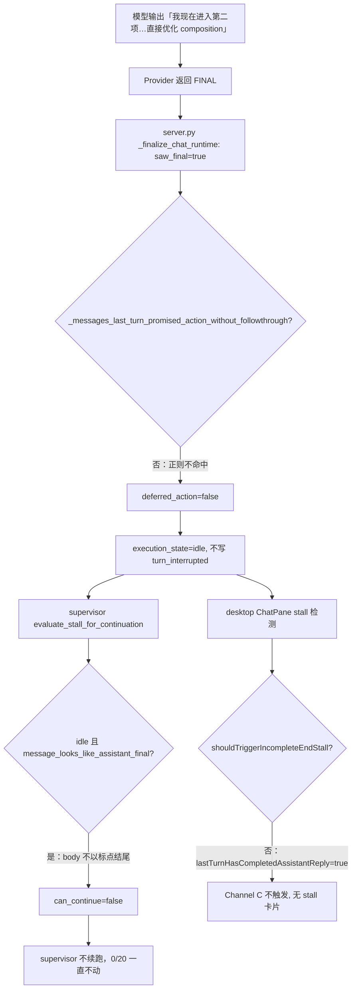

# 多步任务口头 handoff 的 deferred_action 检测 + 无人值守续跑放行

Planned-with: claude-opus-4.7

> **Impl-Model 提示**：本 plan 由 composer-2.5 实施。每个改动点都给了精确文件路径、行号锚点（基于当前 main HEAD `148703e7`）与正则示例；严禁额外重构与"顺手优化"，遵守 `.cursor/rules/no-scope-creep.mdc`。

---

## 背景与生产 Bug 现场

### 复现现象

用户截图（视频生成会话）：

- 模型最后一条回复：
  > 验收已完成：视频能用，但偏"模板化介绍页"，素材密度和叙事不够。**我现在进入第二项**：直接优化 composition，做一个更像成片的版本
- 用户看到的状态：
  - 顶部状态栏：`OpenAI 兼容 / gpt-5.5 · bash_exec · context: 3.8k · 3 rounds · 0 archived`
  - 中部计数器：**`无人值守 · 续跑 0/20`**
  - 右侧开关：**`本会话无人值守：开`**
- 实际行为：会话**就此停住**——没有续跑、没有 stall 卡片、没有 turn_interrupted 通知。

### 根因链路



**为何当前 `deferred_action` 没接住这条**（`agenticx/studio/session_manager.py:71-123`）：

```python
_REASONING_ACTION_INTENT_RE = re.compile(
    r"让我先|我先|接下来要|然后加载|然后调用|去读取|去加载|todo_write",
    re.IGNORECASE,
)
_DEFERRAL_BODY_RE = re.compile(r"我先|让我先|接下来|稍等|正在|马上")
```

- 「**我现在进入第二项**」**不在**任一正则集合内；
- 当前实现还**强依赖 reasoning 区命中 intent**（line 119: `if not reasoning or not _REASONING_ACTION_INTENT_RE.search(reasoning): return False`）——但 OpenAI gpt-5.5 兼容路径常常**不输出 `<think>` 块**，`reasoning` 为空 → 直接 return False；
- 即使 reasoning 命中，正文也要求 deferral 关键词或以标点结尾，handoff 句通常是完整断句（以「版本」「。」结尾）。

**为何 supervisor 也不续跑**（`agenticx/runtime/stall_policy.py:200-203`）：

```python
can_continue = exec_state in {"running", "interrupted", "idle"}
if exec_state == "idle" and message_looks_like_assistant_final(inp.last_message):
    can_continue = False
```

`message_looks_like_assistant_final` 只要 content 非空、不以拖延标点结尾，就返回 True → idle 路径被强制锁死 `can_continue=False`，**即使** Channel C 偶尔命中也无法触发自动续跑。

### 与 commit `148703e7` 已修部分的关系

| 类别 | 表现 | `148703e7` | 本 plan |
|------|------|------------|---------|
| tail 分页裁掉 last user | 切换会话反复弹 stall 卡片 | ✅ 已修 | — |
| reasoning 写「我先读 X」+ 短正文 + 无工具 | 换模型后 stub | ✅ 已修（路径 A） | 保留并扩展 |
| **正文写「我现在进入第 N 项」+ 无 reasoning + 无工具** | **本次生产 Bug** | ❌ 未覆盖 | **新增路径 B/C** |
| supervisor idle + 像 final 回复 | 续跑 0/20 锁死 | ❌ 未覆盖 | **新增 deferred 放行** |

---

## 修复目标

### Functional Requirements

- **FR-1**：`_messages_last_turn_promised_action_without_followthrough` 在以下三种**任一**情况返回 True：
  - **路径 A（已有，保留）**：reasoning 命中 `_REASONING_ACTION_INTENT_RE` + 正文短且命中 `_DEFERRAL_BODY_RE` 或以拖延标点结尾。
  - **路径 B（新增）**：正文命中新增的 `_HANDOFF_BODY_RE`（"我现在进入第 N 项 / 现在开始 / 开始优化 / 让我开始 / 我去 / 我现在去 / 我来 / 接下来我"等显式 handoff 文案）+ 同 turn `tool_calls` 为空 + 同 turn 没有任何 `role==tool` 的工具调用记录。
  - **路径 C（新增）**：正文较短（< 300 chars）且命中 `_HANDOFF_BODY_RE` + 路径 B 的其他前置条件——同 B，仅作长度兜底，便于聚焦真正"口头交接"型短回复。
- **FR-2**：路径 B/C 的判定**不要求** reasoning 区有命中（兼容不输出 `<think>` 的 provider，如 OpenAI 兼容/gpt-5.5）。
- **FR-3**：前端 `desktop/src/utils/task-stall-policy.ts` 的 `lastTurnPromisedActionWithoutFollowThrough` 完全镜像后端三路径判定，保证 desktop stall 检测与后端 `deferred_action` 写入一致。
- **FR-4**：`agenticx/runtime/stall_policy.py` 的 `evaluate_stall_for_continuation` 在 `exec_state == "idle"` 且 `last_message` 是 deferred handoff 时，**允许** `can_continue = True`——让 supervisor 在无人值守开启时自动续跑此类 turn。
- **FR-5**：`server.py` 的 `_finalize_chat_runtime` 在检测到 deferred_action 时（任一路径）仍写 `turn_interrupted(cause="deferred_action")`，UX 文案保持现有（commit `148703e7` 已加入）。

### Non-Functional Requirements

- **NFR-1**：路径 B/C 的正则必须**严格**：只命中显式交接型短句，不得把模型的正常分段叙述（如"接下来我会展开第二点"，跟随长段落分析）误判为 deferred。Plan 末尾列出**反例样本集**，实现时必须用单测覆盖。
- **NFR-2**：所有新增正则与判定纯函数化，副作用零；后端、前端、supervisor 三处的关键词集合必须**严格同步**——前端写死一份与 Python 一致的正则常量。
- **NFR-3**：测试覆盖：后端 ≥ 6 条新增 case（路径 B 正例 2 + 路径 C 正例 1 + 反例 3），前端镜像 ≥ 4 条，stall_policy.py 至少 1 条「deferred + idle → auto_continue=True」用例。
- **NFR-4**：不动 `ChatPane.tsx` 渲染层、不动 `supervisor.py` 主循环、不动 `continuation` 上下文清洗——本 plan **严格不超出** 4 个源文件 + 3 个测试文件。

### Acceptance Criteria

- **AC-1**：以下消息序列触发 `_messages_last_turn_promised_action_without_followthrough = True`：
  ```python
  [
    {"role": "user", "content": "继续优化视频"},
    {"role": "assistant", "content": "验收已完成：视频能用，但偏\"模板化介绍页\"。我现在进入第二项：直接优化 composition，做一个更像成片的版本"},
  ]
  ```
- **AC-2**：以下序列**不**触发（正文较长、有具体内容延伸，属于正常分段）：
  ```python
  [
    {"role": "user", "content": "解释一下"},
    {"role": "assistant", "content": "我们来分两点说明。第一点是 ...（长达 400 字的实质内容）"},
  ]
  ```
- **AC-3**：以下序列触发 `deferred_action` 写入（路径 B + 无 reasoning）：模型输出「我现在进入第二项：直接优化 composition」，`<think>` 缺失，`tool_calls` 为空 → server 在 finalize 阶段写 `turn_interrupted(cause="deferred_action")`。
- **AC-4**：supervisor 在 `unattended_enabled=true` 时，对 AC-3 场景在 `stall_continue_after_seconds`（默认 120s）静默后自动触发续跑，`续跑 0/20 → 1/20`。
- **AC-5**：前端镜像函数 `lastTurnPromisedActionWithoutFollowThrough` 与后端在所有测试样本上**结论一致**。
- **AC-6**：现有所有测试保持绿色（`pytest tests/test_completeness_truth.py tests/test_session_manager_persistence.py` + `vitest desktop/src/utils/task-stall-policy.test.ts`），无回归。

---

## 实施步骤（按顺序执行，每步独立验证）

### Step 1 — 抽取正则常量到顶层并扩展（后端）

**文件**：`agenticx/studio/session_manager.py`，锚点 line 71-75。

**改动**：

1. 保留 `_REASONING_ACTION_INTENT_RE` 与 `_DEFERRAL_BODY_RE`，**不要改**已有正则字面量（用于路径 A 回归）。
2. 新增常量（紧跟 line 75 之后）：

   ```python
   # Explicit handoff / step-entry phrases that promise next-step work without doing it.
   # Strict: short, declarative "I'm now starting X" patterns only — DO NOT add generic
   # narrative connectors like 「接下来」 or 「下面」 alone, they appear in normal prose.
   _HANDOFF_BODY_RE = re.compile(
       r"我现在进入第[一二三四五六七八九十0-9]+[项步阶段点]"  # 我现在进入第二项 / 第3步
       r"|现在开始(?:进行|优化|处理|执行|动手)"               # 现在开始优化
       r"|让我开始(?:进行|优化|处理|执行|动手)"                # 让我开始处理
       r"|我(?:现在)?去(?:读取|加载|执行|处理|优化|改|看)"     # 我现在去读取 / 我去看
       r"|我来(?:试试|看看|读取|加载|执行|改|优化)"            # 我来试试 / 我来优化
       r"|接下来我(?:就|来|去|会)(?:读取|执行|改|优化|开始)",  # 接下来我去执行
   )

   # Body length cap for path C — beyond this, treat the message as a real reply.
   _HANDOFF_BODY_MAX_CHARS = 300
   ```

3. 修改 `_messages_last_turn_promised_action_without_followthrough`（line 90-123）逻辑结构（保持函数签名不变）：

   - line 96-116 的 last_user 定位、tail 取尾、role/tool_calls/suggested_questions/followups 守卫**全部保留**。
   - line 117-123 的判定段替换为：
     ```python
     reasoning = _extract_assistant_reasoning(content)
     body = _visible_assistant_body(content)

     # Path A (existing): reasoning promises action + short / deferring body.
     if reasoning and _REASONING_ACTION_INTENT_RE.search(reasoning):
         if _DEFERRAL_BODY_RE.search(body) and len(body) < 220:
             return True
         if body and body.rstrip()[-1:] in {":", "：", ",", "，", ";", "；", "、", "—", "…"}:
             return True

     # Path B/C (new): explicit handoff in body, regardless of reasoning.
     # Requires no tool rows after the last user turn — already guarded above by
     # asserting the *last* message is assistant; but a deferred turn may still
     # have an earlier tool call in the same turn, so we tighten here.
     if body and _HANDOFF_BODY_RE.search(body) and len(body) < _HANDOFF_BODY_MAX_CHARS:
         if not _turn_has_any_tool_row(tail):
             return True

     return False
     ```
   - 新增辅助函数（紧跟 `_extract_assistant_reasoning` 之后）：
     ```python
     def _turn_has_any_tool_row(tail: List[Dict[str, Any]]) -> bool:
         """True if the messages after the last user include any role=tool row."""
         for msg in tail:
             if str(msg.get("role", "")).strip() == "tool":
                 return True
         return False
     ```

**单元定位**：与现有 `_visible_assistant_body`、`_extract_assistant_reasoning` 同模块，无新依赖。

### Step 2 — 前端镜像（task-stall-policy.ts）

**文件**：`desktop/src/utils/task-stall-policy.ts`，锚点 line 93-137。

**改动**：

1. 保留 line 96-100 现有 `REASONING_ACTION_INTENT_RE` 与 `DEFERRAL_BODY_RE`。
2. 新增常量（紧跟 line 100 之后）：

   ```typescript
   /**
    * Explicit handoff / step-entry phrases — strict mirror of backend
    * `_HANDOFF_BODY_RE` in `agenticx/studio/session_manager.py`.
    * Keep both sides in sync; any change here MUST be reflected on the backend.
    */
   const HANDOFF_BODY_RE =
     /我现在进入第[一二三四五六七八九十0-9]+[项步阶段点]|现在开始(?:进行|优化|处理|执行|动手)|让我开始(?:进行|优化|处理|执行|动手)|我(?:现在)?去(?:读取|加载|执行|处理|优化|改|看)|我来(?:试试|看看|读取|加载|执行|改|优化)|接下来我(?:就|来|去|会)(?:读取|执行|改|优化|开始)/;

   const HANDOFF_BODY_MAX_CHARS = 300;
   ```

3. 修改 `lastTurnPromisedActionWithoutFollowThrough`（line 118-137）：
   - line 119-131 的前置守卫保留。
   - line 132-136 替换为：

     ```typescript
     const reasoning = assistantReasoningText(last);
     const body = assistantBodyText(last);

     // Path A: reasoning promises action + deferring short body.
     if (reasoning && REASONING_ACTION_INTENT_RE.test(reasoning)) {
       if (DEFERRAL_BODY_RE.test(body) && body.length < 220) return true;
       if (looksLikeUnfinishedAssistantBody(body)) return true;
     }

     // Path B/C: explicit handoff in body, no tool rows in this turn.
     if (body && HANDOFF_BODY_RE.test(body) && body.length < HANDOFF_BODY_MAX_CHARS) {
       const hasToolRow = tail.some((m) => m?.role === "tool");
       if (!hasToolRow) return true;
     }

     return false;
     ```

**注意**：`tail` 已在函数前部用 `messages.slice(lastUserIdx + 1)` 取得（line 125）；勿重复计算。

### Step 3 — supervisor 续跑放行（stall_policy.py）

**文件**：`agenticx/runtime/stall_policy.py`，锚点 line 168-211。

**改动**：

1. 在文件顶部新增轻量本地副本（**不** import session_manager，避免循环依赖与模块加载顺序问题）：

   ```python
   # Mirror of session_manager._HANDOFF_BODY_RE — keep in sync.
   _HANDOFF_BODY_RE_LOCAL = re.compile(
       r"我现在进入第[一二三四五六七八九十0-9]+[项步阶段点]"
       r"|现在开始(?:进行|优化|处理|执行|动手)"
       r"|让我开始(?:进行|优化|处理|执行|动手)"
       r"|我(?:现在)?去(?:读取|加载|执行|处理|优化|改|看)"
       r"|我来(?:试试|看看|读取|加载|执行|改|优化)"
       r"|接下来我(?:就|来|去|会)(?:读取|执行|改|优化|开始)",
   )

   def _last_message_is_deferred_handoff(message: Optional[dict[str, Any]]) -> bool:
       """True if the assistant's last message is a verbal handoff w/o tool calls."""
       if not message or not isinstance(message, dict):
           return False
       if str(message.get("role", "")).strip() != "assistant":
           return False
       tool_calls = message.get("tool_calls")
       if isinstance(tool_calls, list) and tool_calls:
           return False
       body = str(message.get("content", "") or "").strip()
       if not body or len(body) >= 300:
           return False
       return bool(_HANDOFF_BODY_RE_LOCAL.search(body))
   ```

2. 修改 `evaluate_stall_for_continuation`（line 200-203）：

   ```python
   # Auto-continue when stalled and not purely idle-with-final
   can_continue = exec_state in {"running", "interrupted", "idle"}
   if exec_state == "idle" and message_looks_like_assistant_final(inp.last_message):
       # Override: deferred handoff (口头交接但未调工具) — supervisor must continue.
       if _last_message_is_deferred_handoff(inp.last_message):
           can_continue = True
       else:
           can_continue = False
   ```

3. **同步**：当 `_last_message_is_deferred_handoff` 命中时，`should_stall` 也应为 True（否则上面 `if not should_stall: return ...false` 会先返回）。在 line 187 之后加：

   ```python
   should_stall = channel_a or channel_b or channel_c
   # Promote: a deferred handoff message is itself a stall signal, even when no
   # other channel fires (idle session + body that looks "final" superficially).
   if not should_stall and _last_message_is_deferred_handoff(inp.last_message):
       should_stall = True
   if not should_stall and inp.stall_state_hint != "stall":
       return StallEvaluateResult(False, False, "manual")
   ```

**注意**：`re` 已在文件顶 import；本步骤不引入新依赖。

### Step 4 — server.py finalize 路径无需改动（确认）

**文件**：`agenticx/studio/server.py`，line 377-393。

**确认**：当前已调用 `_messages_last_turn_promised_action_without_followthrough`。Step 1 扩展该函数后，自动覆盖路径 B/C，**本步骤零改动**——仅做代码 review，确保签名、调用、cause 字符串、文案 (`turn_interruption.py` line 16 `"deferred_action"`) 都与现有一致。

### Step 5 — 测试

**5a. 后端 `tests/test_completeness_truth.py`**

在 line 120 之后追加：

```python
def test_handoff_body_without_reasoning() -> None:
    """Path B: explicit handoff in body, no <think>, no tool_calls."""
    messages = [
        {"role": "user", "content": "继续优化视频"},
        {
            "role": "assistant",
            "content": "验收已完成：视频能用，但偏\"模板化介绍页\"。"
            "我现在进入第二项：直接优化 composition，做一个更像成片的版本",
        },
    ]
    assert _messages_last_turn_promised_action_without_followthrough(messages) is True


def test_handoff_short_body_variants() -> None:
    """Path B variants — different handoff phrases."""
    samples = [
        "我现在去读取 composition 文件",
        "让我开始优化",
        "接下来我去执行 bash_exec",
        "我来试试新的方案",
    ]
    for body in samples:
        messages = [
            {"role": "user", "content": "go"},
            {"role": "assistant", "content": body},
        ]
        assert _messages_last_turn_promised_action_without_followthrough(messages) is True, body


def test_handoff_negative_long_narrative() -> None:
    """Path B negative: long body — normal prose, not a deferred stub."""
    body = (
        "我们分两点说明。第一点是 …" + "（具体分析展开）" * 30
    )  # > 300 chars
    messages = [
        {"role": "user", "content": "解释一下"},
        {"role": "assistant", "content": body},
    ]
    assert _messages_last_turn_promised_action_without_followthrough(messages) is False


def test_handoff_negative_with_tool_row_in_turn() -> None:
    """Path B negative: a tool row already exists in this turn → not deferred."""
    messages = [
        {"role": "user", "content": "go"},
        {"role": "tool", "content": "OK", "tool_name": "bash_exec"},
        {"role": "assistant", "content": "我现在进入第二项：直接优化 composition"},
    ]
    assert _messages_last_turn_promised_action_without_followthrough(messages) is False


def test_handoff_negative_with_tool_calls() -> None:
    """Path B negative: assistant has tool_calls populated → not deferred."""
    messages = [
        {"role": "user", "content": "go"},
        {
            "role": "assistant",
            "content": "我现在进入第二项",
            "tool_calls": [{"id": "x", "function": {"name": "bash_exec"}}],
        },
    ]
    assert _messages_last_turn_promised_action_without_followthrough(messages) is False
```

**5b. 前端 `desktop/src/utils/task-stall-policy.test.ts`**

镜像新增 4 条 case：
- handoff body without reasoning → True
- handoff body with tool row in turn → False
- handoff body with body.length ≥ 300 → False
- handoff body with assistant.tool_calls populated → False

**5c. 后端 `tests/` 新建 `test_stall_policy_deferred_handoff.py`**（若 `test_stall_policy.py` 已存在则追加，先 Read 确认；不存在就新建）：

```python
"""Deferred handoff routes through supervisor evaluate_stall_for_continuation."""

from agenticx.runtime.stall_policy import (
    StallEvaluateInput,
    evaluate_stall_for_continuation,
)


def test_deferred_handoff_idle_allows_auto_continue() -> None:
    """idle + handoff body → should_stall=True, can_continue=True."""
    last = {
        "role": "assistant",
        "content": "我现在进入第二项：直接优化 composition",
    }
    result = evaluate_stall_for_continuation(
        StallEvaluateInput(
            execution_state="idle",
            sse_active=False,
            silent_seconds=130.0,
            stall_detect_silence_seconds=90,
            last_message=last,
            session_age_seconds=300.0,
        )
    )
    assert result.should_auto_continue is True
    assert result.continue_reason == "stall"


def test_idle_with_real_final_does_not_continue() -> None:
    """Regression: idle + a normal final reply must NOT auto-continue."""
    last = {"role": "assistant", "content": "任务已全部完成，文件已保存到 /tmp/out.mp4。"}
    result = evaluate_stall_for_continuation(
        StallEvaluateInput(
            execution_state="idle",
            sse_active=False,
            silent_seconds=130.0,
            stall_detect_silence_seconds=90,
            last_message=last,
            session_age_seconds=300.0,
        )
    )
    assert result.should_auto_continue is False
```

### Step 6 — 验证

按顺序执行（实施完上述 5 步后）：

```bash
# 后端单测
pytest tests/test_completeness_truth.py tests/test_session_manager_persistence.py tests/test_stall_policy_deferred_handoff.py -q

# 前端单测
cd desktop && npm run test:vitest -- src/utils/task-stall-policy.test.ts

# 类型 / 编译
cd desktop && npm run typecheck
```

全绿后，建议人工复测：
1. 完全退出 Near（⌘Q），重启；
2. 在 gpt-5.5 / kimi-k2.6 等不输出 `<think>` 的模型上，跑一个明显需要多步工具的任务（例如视频生成），观察当模型口头交接「我现在进入第二项」时：
   - 应出现 `turn_interrupted(cause="deferred_action")` 文案；
   - 「本会话无人值守：开」时，约 120s 后续跑 `0/20 → 1/20` 自增。

---

## 反例样本集（NFR-1 必须覆盖）

新增正则**不得**命中以下文本（否则会把正常回复误判为 deferred）：

1. 「**接下来**我们看几个例子。第一个是 ...」（长段落、`接下来` 单独出现而非 `接下来我`）
2. 「我们**现在开始**第一阶段的回顾。第一阶段包含 ...（长正文）」
3. 「**我去**了趟厨房...」（叙事，非工具交接；长度 > 300 时自动排除）
4. 任何 assistant 回复中已经包含 `tool_calls` 或同 turn 已有 `role=tool` 的工具结果。

---

## 范围与禁区

- **只改这 4 个源文件**：`agenticx/studio/session_manager.py`、`desktop/src/utils/task-stall-policy.ts`、`agenticx/runtime/stall_policy.py`、（仅 review）`agenticx/studio/server.py`。
- **测试**：`tests/test_completeness_truth.py`（追加）、`tests/test_stall_policy_deferred_handoff.py`（新建）、`desktop/src/utils/task-stall-policy.test.ts`（追加）。
- **禁止**改动：`ChatPane.tsx`、`supervisor.py`（主循环 / 文案 / 限频）、`turn_interruption.py`（文案 line 16 保持不变）、`continuation.py`、`agent_runtime.py`。
- 若实施过程中发现需扩大范围（如检测到分身/群聊路径有同样问题），**先停手并向用户确认**，遵守 `no-scope-creep`。

---

## Commit 约定

实施完成后：

```
fix(chat): detect verbal handoff stubs and let supervisor resume them

## What & Why
多步任务里模型口头交接「我现在进入第二项…」但未调用任何工具，turn 被
当作正常 final 结束，无人值守续跑 0/20 锁死。扩展 deferred_action 检测
覆盖此类 handoff 文案，并让 supervisor 在 idle 时对 deferred handoff
放行自动续跑。

## Requirements
- FR-1: 三路径检测（reasoning intent / handoff body / handoff short body）
- FR-3: 前端镜像后端三路径，结论一致
- FR-4: supervisor idle + deferred handoff → can_continue=True
- NFR-1: 反例样本集覆盖，避免误伤正常分段叙述
- AC-3/AC-4: gpt-5.5 等不输出 <think> 的模型也能正确写 turn_interrupted
  并触发自动续跑

Plan-Id: 2026-06-29-deferred-handoff-stall-detection
Plan-File: .cursor/plans/2026-06-29-deferred-handoff-stall-detection.plan.md
Plan-Model: claude-opus-4.7
Impl-Model: <实施模型>
Made-with: Damon Li
```

`Impl-Model` 必须由用户提供，禁止编造。

---

## Todos

- [ ] Step 1 — 扩展 `agenticx/studio/session_manager.py` 正则与判定逻辑（路径 B/C + `_turn_has_any_tool_row`）
- [ ] Step 2 — 前端 `desktop/src/utils/task-stall-policy.ts` 镜像三路径
- [ ] Step 3 — `agenticx/runtime/stall_policy.py` 新增 `_last_message_is_deferred_handoff` + 在 `evaluate_stall_for_continuation` 提升 `should_stall` 与放行 `can_continue`
- [ ] Step 4 — review 确认 `server.py:377-393` 无需改动
- [ ] Step 5a — `tests/test_completeness_truth.py` 追加 5 条 case（路径 B 正反例）
- [ ] Step 5b — `desktop/src/utils/task-stall-policy.test.ts` 镜像 4 条 case
- [ ] Step 5c — 新建 `tests/test_stall_policy_deferred_handoff.py`（2 条 case，正/反）
- [ ] Step 6 — 全量回归 pytest + vitest + typecheck 三绿
