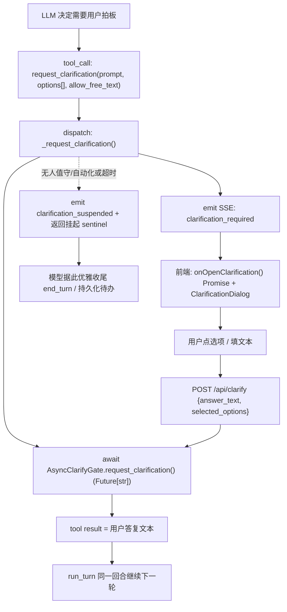

# Human-in-the-Loop 澄清提问原语（request_clarification）

Planned-with: claude-opus-4.8

> 目标读者：实施模型（Composer 2.5）。本 plan 给出精确的文件:行号锚点、数据结构、SSE 协议字段、状态机改点与验收脚本，可直接照做。

---

## 1. 背景与问题定位

### 1.1 现象

无人值守长跑（约 6h 触顶停止）的最后一条消息里，Meta-Agent 把「方案是否需要调整再开工？视频时长是否锁 2 分钟？配色调性偏好？」这类**需要用户拍板的开放式问题写成了普通 markdown 正文，然后 `end_turn` 结束回合**。用户体感是「每次到这种需要决策的地方就断了」，没有一个可点选/可自定义回复的阻塞交互框（类似 Cursor 的提问卡）。

### 1.2 根因：缺少「向用户提问」的一等公民原语

经过全链路勘探（后端 + 前端），现状是：

1. **权限确认链路（`confirm_required`）存在且是真正的阻塞 HITL**，但它的语义是 **yes/no 布尔确认**（工具权限放行），不是开放式提问：
   - 发起：`agenticx/cli/agent_tools.py` 的 `_confirm()`（~`2015-2041`）emit `{"type":"confirm_required","data":{"id","question","context"}}`。
   - 阻塞：`agenticx/runtime/confirm.py` 的 `AsyncConfirmGate.request_confirm()`（`77-118`）用 `asyncio.Future[bool]` + `asyncio.wait_for`（默认 120s，`AGX_CONFIRM_TIMEOUT_SEC`）。
   - 回传：`POST /api/confirm`（`agenticx/studio/server.py` ~`2148-2165`），body = `ConfirmResponse{session_id, request_id, approved: bool, agent_id}`（`agenticx/studio/protocols.py:66-70`）→ `gate.resolve(request_id, approved)`。
   - 前端：`confirm_required` → `App.tsx` 的 `onOpenConfirm()`（`1583-1607`，Promise 阻塞）→ 弹 `ConfirmDialog`（`desktop/src/components/ConfirmDialog.tsx`，仅「确认/取消」+ 策略单选）→ `POST /api/confirm`。
2. **`suggestedQuestions`**（模型回复里的 `<followups>` 解析）是**回复结束后的非阻塞建议 chips**，不能用来阻塞等待用户决策。
3. **现有 `ask_user` 工具在 Desktop 被显式禁用**：`agenticx/cli/agent_tools.py:5569-5576` 的 `_tool_ask_user` 在 `service_mode`（即 `AsyncConfirmGate` 在场，Near/Desktop 恒为真）直接返回 `ERROR: ask_user is not supported in service mode`，且**未注册进 `STUDIO_TOOLS` schema**，LLM 根本看不到。

### 1.3 关键陷阱（实施务必遵守）

**澄清提问绝不能复用 confirm 的「自动放行」语义**：
- `App.tsx:1591` 当 `confirmStrategy === "auto"`（Run-Everything）直接 `resolve(true)`，跳过弹窗。
- 自动化会话用 `AutoApproveConfirmGate` 自动放行（`server.py:2610-2614`）。

对权限确认，自动放行是对的；但对**开放式提问**，自动「放行」会丢掉用户的真实选择/文本，等于没问。因此澄清链路必须是**独立事件类型 + 独立 gate + 独立 endpoint**，并且在「无人值守/自动化」下走**优雅挂起**而非自动放行（见 FR-7）。

### 1.4 回合状态机结论（无需大改）

`agent_runtime.run_turn`（`agenticx/runtime/agent_runtime.py:1621`）的工具轮次循环（`for round_idx in range(1, self.max_tool_rounds + 1)` @ `1914`）中，工具内 `await Future` 阻塞**不会结束回合**——approve 后工具返回结果，循环 `continue` 到下一轮。这正是 `_confirm` 的模式。**所以 `request_clarification` 只要做成「工具内阻塞、把用户答复作为 tool result 返回」，就天然在同一回合内续跑，无需改 `run_turn` 状态机。**回合结束仅发生在「无 tool_calls → `FINAL` + return」（`2827-2972`）。

---

## 2. 方案总览

新增一个 Meta-Agent（及子智能体）可调用的工具 **`request_clarification`**：模型需要用户拍板时，不再写正文 + 结束，而是调用该工具，前端弹出**阻塞式提问卡**（预设选项按钮 + 自定义文本输入），用户选择/填写后，答复作为 tool result 注入 LLM，**同一回合继续执行**。



复用对象：`AsyncConfirmGate` 的 Future 模式、SSE 序列化、子智能体 `pending_*` 暴露、`onOpenConfirm` 的 Promise 阻塞模式。新增对象：`clarification_*` 事件、`AsyncClarifyGate`、`/api/clarify`、`ClarificationDialog`、`request_clarification` 工具 + system prompt 引导。

---

## 3. 需求（FR / NFR / AC）

### FR（功能需求）

- **FR-1**：新增工具 `request_clarification`，注册进 `STUDIO_TOOLS`，对 Meta-Agent 与子智能体均可见。参数：`prompt: string`（必填，提问正文）、`options?: string[]`（可选，预设选项，0–8 个）、`allow_free_text?: boolean`（默认 true，是否允许自定义文本）、`context?: object`（可选，附带的方案要点等，仅展示）。
- **FR-2**：调用该工具时，后端 emit SSE 事件 `clarification_required`，data = `{id, prompt, options, allow_free_text, context, agent_id}`；并通过新的 `AsyncClarifyGate` 阻塞等待，直至前端回传或超时。
- **FR-3**：前端收到 `clarification_required` 弹出阻塞 `ClarificationDialog`：渲染 `prompt` + `options`（每个选项一个可点按钮/单选）+（当 `allow_free_text`）一个多行自定义输入框 + 提交按钮。提交后 `POST /api/clarify`。
- **FR-4**：新增 `POST /api/clarify`，body = `ClarifyResponse{session_id, request_id, agent_id, answer_text: string, selected_options?: string[]}` → `gate.resolve(request_id, answer)`。`answer` 是结构化对象（见 §4.2），最终拼成给 LLM 的文本 tool result。
- **FR-5**：工具返回给 LLM 的 tool result 必须是**用户答复的自然语言文本**（例如 `用户选择：锁定 2 分钟；自定义补充：配色用深蓝紫+科技金`），让模型据此继续执行。
- **FR-6**：子智能体调用 `request_clarification` 时，复用其 per-agent gate，并在 `/api/subagents/status` 的 `_serialize_status` 暴露 `pending_clarification`（结构同 `pending_confirm`，但带 `options`/`allow_free_text`），前端据此把子智能体状态派生为 `awaiting_input`（新增子状态，见 §6.3）。
- **FR-7**：**无人值守 / 自动化会话下的优雅挂起**：当当前会话是 automation 会话，或 `clarification` gate 在超时窗口内无人回复时，工具不得无限阻塞，应返回挂起 sentinel（如 `[CLARIFICATION_PENDING] 已向用户发起提问但暂无人回复，请将待确认项写入待办并结束本轮。`），并 emit `clarification_suspended` SSE；模型据此优雅收尾。供给 supervisor：存在未决 clarification 时，wall-clock/stall 续跑逻辑不得把它误判为「卡住自动续跑」而反复重启（见 Step 6）。
- **FR-8**：System prompt 引导——在 `agenticx/runtime/prompts/meta_agent.py` 注入一段明确指令：「当你需要用户做开放式决策（方案确认、二选一、偏好、缺参数）时，必须调用 `request_clarification` 工具发起阻塞提问，禁止把开放式问题写进正文后直接结束回合。」

### NFR（非功能）

- **NFR-1**：与权限确认**完全解耦**——`clarification_required` 不得走 `confirm` 的 auto-approve/allowlist 路径；`confirmStrategy === "auto"` 与 `AutoApproveConfirmGate` 都不影响澄清提问（automation 走 FR-7 的显式挂起，而非静默放行）。
- **NFR-2**：提问卡内容必须**持久化为可见消息**——在 `chat_history` 追加一条 `role="tool"`、`metadata.kind="clarification"` 的记录（含 prompt/options），保证用户切走再切回、或刷新仍可见；该消息 `metadata.kind="clarification"` 应被 `agent_runtime` 上下文清洗当作 UI-only，不重复污染 LLM 上下文（用户答复已经以 tool result 进入上下文）。
- **NFR-3**：超时可配置——新增 `runtime.clarification.timeout_seconds`（默认 1800s = 30min；automation 会话用更短的 `runtime.clarification.unattended_grace_seconds`，默认 0 = 立即挂起）。读取走既有 `get_runtime_value`（参考 `continuation.py:load_unattended_config`）。
- **NFR-4**：幂等与并发——同一 `request_id` 重复 resolve 安全（沿用 `AsyncConfirmGate.resolve` 的 `fut.done()` 判定）；同一会话同时只允许一个未决 clarification（第二个直接复用/拒绝并提示）。
- **NFR-5**：群聊兼容——参考 `group_router.py:485-489` 把 `clarification_required` 映射为群聊事件（`group_blocked` 或新增 `group_clarification`），带 `clarification_request_id`，不破坏现有群聊路由。
- **NFR-6**：前端通知去重——澄清卡的展示统一收敛，不与 `stallState` / `budget_exceeded` / supervisor `⛔` / `turn_interrupted` 通知叠加刷屏。

### AC（验收）

- **AC-1**：本机 `agx serve` + Desktop，给 Meta 发一句「帮我定个视频方案，拿不准的地方问我」。模型应调用 `request_clarification`，前端弹出含选项 + 自定义输入框的阻塞卡；选择/填写提交后，模型基于答复继续输出，**回合不中断**。
- **AC-2**：`messages.json` 中出现 `{"role":"tool","metadata":{"kind":"clarification",...}}` 记录；关闭重开会话后该提问卡仍可见，且不会被 `mergeTailFromDisk` 覆盖丢失。
- **AC-3**：Run-Everything（`confirmStrategy=auto`）开启时，`request_clarification` **仍然弹窗**等待用户输入，不被自动放行（区别于权限确认）。
- **AC-4**：自动化/定时会话（`avatar_id` 形如 `automation:*`）下模型调用 `request_clarification`，工具在 `unattended_grace_seconds` 后返回挂起 sentinel，模型优雅收尾；supervisor 不因此反复重启续跑。
- **AC-5**：子智能体调用 `request_clarification` 时，`/api/subagents/status` 返回 `pending_clarification`，前端子智能体卡状态显示为「等待输入」并提供入口弹出同款提问卡；用户回复后子智能体继续。
- **AC-6**：超时（`timeout_seconds`）无人回复，gate 返回超时 sentinel，工具结果告知模型「用户未在时限内回复」，模型优雅收尾，不抛未捕获异常。
- **AC-7**：单元测试 `tests/test_request_clarification.py` 覆盖：(a) gate resolve 正常返回结构化答复；(b) 超时返回 sentinel；(c) automation 会话立即挂起；(d) 重复 resolve 幂等；(e) tool result 文本拼接正确。前端 `desktop/src/utils/clarification-notice.test.ts` 覆盖答复文本拼接与去重。

---

## 4. 数据结构与协议

### 4.1 SSE 事件（新增）

在 `agenticx/runtime/events.py`（参考 `34-35` 的 `CONFIRM_REQUIRED`）新增：

```python
CLARIFICATION_REQUIRED = "clarification_required"
CLARIFICATION_RESPONSE = "clarification_response"
CLARIFICATION_SUSPENDED = "clarification_suspended"
```

`clarification_required` data 字段：

| 字段 | 类型 | 说明 |
|------|------|------|
| `id` | string | request_id（UUID） |
| `prompt` | string | 提问正文 |
| `options` | string[] | 预设选项（可空） |
| `allow_free_text` | bool | 是否允许自定义文本 |
| `context` | object\|null | 附带要点，仅展示 |
| `agent_id` | string | 由 `_runtime_event_to_sse_lines` 注入（`server.py:275-297`，无需特殊分支） |

### 4.2 REST：`POST /api/clarify`

请求体（在 `agenticx/studio/protocols.py` 新增，参考 `ConfirmResponse:66-70`）：

```python
class ClarifyResponse(BaseModel):
    session_id: str
    request_id: str
    agent_id: str = "meta"
    answer_text: str = ""              # 用户自定义文本（可空）
    selected_options: list[str] = []   # 用户点选的预设选项（可空）
```

gate 内部存的结构化答复：

```python
{"answer_text": str, "selected_options": list[str]}
```

拼成给 LLM 的 tool result 文本（helper，前后端各实现一份，前端用于乐观展示）：
- 有选项：`用户选择：{选项1；选项2}`
- 有文本：`；自定义补充：{answer_text}`
- 都空：`用户未提供具体内容（视为按你的默认方案推进）`

### 4.3 新 gate：`AsyncClarifyGate`

新增 `agenticx/runtime/clarify.py`（结构对照 `confirm.py`，但 Future 泛型是 `dict`）：

```python
@dataclass
class AsyncClarifyGate:
    timeout_seconds: float = 1800.0
    _pending: dict[str, asyncio.Future] = field(default_factory=dict)
    last_request: dict | None = None

    async def request_clarification(self, prompt, options, allow_free_text, context=None) -> dict:
        # 建 Future、存 last_request、await wait_for；超时返回 {"__timeout__": True}
    def resolve(self, request_id: str, answer: dict) -> bool:
        # 同 AsyncConfirmGate.resolve 的 done() 幂等判定
```

挂载到 session：在 `agenticx/studio/session_manager.py:233-250`（`confirm_gate` 旁）新增 `clarify_gate: AsyncClarifyGate` + `sub_clarify_gates: dict[str, AsyncClarifyGate]` + `get_clarify_gate(agent_id)`。子智能体侧在 `team_manager.py:116` `confirm_gate` 旁新增 `clarify_gate`。

---

## 5. 实施步骤（后端）

### Step 1 · 事件 + 协议 + gate

- `agenticx/runtime/events.py`：新增 3 个 `EventType`（§4.1）。
- `agenticx/runtime/clarify.py`：新建 `AsyncClarifyGate`（§4.3），并新增 `AutoSuspendClarifyGate`（automation 用：`request_clarification` 立即返回 `{"__suspended__": True}`，不阻塞）。
- `agenticx/studio/protocols.py`：新增 `ClarifyResponse`（§4.2）。
- `agenticx/studio/session_manager.py`：挂 `clarify_gate` / `get_clarify_gate`（§4.3）。
- `agenticx/runtime/team_manager.py`：`SubAgentContext` 加 `clarify_gate`；`AgentRuntime` 构造时传入（参考 `1030-1037` 传 `confirm_gate` 的位置，evaluate 是否需要把 clarify_gate 也注入 runtime；若工具 dispatch 能拿到 gate 则不必）。

### Step 2 · 工具 schema + dispatch

- `agenticx/cli/agent_tools.py`：
  - 在 `STUDIO_TOOLS`（~`292+`）新增 `request_clarification` schema（§FR-1 参数）。
  - 新增 helper `async def _request_clarification(prompt, options, allow_free_text, *, clarify_gate, emit_event, context=None, is_unattended=False) -> str`：
    - `is_unattended` 或 `isinstance(clarify_gate, AutoSuspendClarifyGate)` → emit `clarification_suspended` + return 挂起 sentinel（FR-7）。
    - 否则 emit `clarification_required`（结构同 `_confirm` 的 emit，~`2015-2041`）→ `answer = await clarify_gate.request_clarification(...)`：
      - `answer.get("__timeout__")` → return 超时 sentinel（AC-6）。
      - 否则 emit `clarification_response` + return §4.2 拼好的文本。
  - 在 `dispatch_tool_async`（`5915+`）新增 `if name == "request_clarification":` 分支（放在 `name.startswith("confirm_")` 拦截之前），从 `session`/参数解析 `clarify_gate`（参考 confirm_gate 的解析方式）与 `is_unattended`（由调用方注入，见 Step 3）。
  - **不要动** `_tool_ask_user`；可在其 ERROR 文案里补一句「请改用 request_clarification」。
- dispatch 需要 `clarify_gate` 参数：扩展 `dispatch_tool_async` 签名加 `clarify_gate=None`，并在 `agent_runtime` 调用处（`3380` 附近 `dispatch_tool_async(... confirm_gate=self.confirm_gate ...)`）一并传 `clarify_gate=self.clarify_gate`。`AgentRuntime.__init__` 增加 `clarify_gate` 字段（与 `confirm_gate` 并列）。

### Step 3 · /api/clarify + 会话装配

- `agenticx/studio/server.py`：
  - 新增 `@app.post("/api/clarify")`（仿 `post_confirm:2148-2165`）：取 `managed.get_clarify_gate(agent_id)`（子智能体走 `team_manager` 的 gate），`gate.resolve(request_id, {"answer_text","selected_options"})`。
  - 会话装配处（`_resolve_confirm_gate` 旁，~`2610`）新增 `_resolve_clarify_gate(managed, agent_id)`：**automation 会话返回 `AutoSuspendClarifyGate()`**（对照 confirm 的 `AutoApproveConfirmGate`），普通会话返回 `managed.get_clarify_gate(...)`。把结果接到 `AgentRuntime(clarify_gate=...)` 与 `dispatch` 链路上。
  - `is_unattended` 透传：从会话 meta（`SESSION_META_UNATTENDED` / automation 判定）推导，传到 runtime → dispatch。
  - **NFR-2 持久化**：在 emit `clarification_required` 的同时（或前端首次渲染后由后端补写），向 `session.chat_history` 追加 `{"role":"tool","metadata":{"kind":"clarification","request_id","prompt","options","allow_free_text"}}` 并 `persist_async`。建议在后端发起 emit 时一次性写入，避免依赖前端。

### Step 4 · 上下文清洗（NFR-2）

- `agenticx/runtime/agent_runtime.py`：在 `chat_history → agent_messages` 同步/`_sanitize_context_messages` 阶段，过滤 `metadata.kind == "clarification"` 的 tool 记录（参考既有对 `turn_interrupted` / `[系统通知]` 的过滤），避免重复进入 LLM 上下文。

### Step 5 · System prompt 引导（FR-8）

- `agenticx/runtime/prompts/meta_agent.py`：在工具使用规范段落新增明确指令（中文 + 关键英文工具名），强调「开放式决策必须调用 `request_clarification`，禁止把问题写正文后结束回合」。子智能体 prompt（若有独立构造）同样补充。

### Step 6 · 无人值守/续跑协同（FR-7）

- `agenticx/studio/supervisor.py` / `agenticx/studio/continuation.py`：
  - 当会话存在未决 clarification（gate `_pending` 非空，或最近一条 chat_history 是 `kind="clarification"` 且尚无后续用户答复）时，stall 续跑评估（`evaluate_stall_for_continuation`）应判定为「等待人工输入」，**不自动续跑**，并避免 wall-clock 误报为「卡住」。新增一个轻量判定 helper（如 `has_pending_clarification(managed)`）供 supervisor `_tick` 早返回 `continue`。
  - automation 路径因走 `AutoSuspendClarifyGate` 已立即返回挂起 sentinel，模型据此收尾，无需额外阻塞。

---

## 6. 实施步骤（前端 Desktop）

### Step 7 · store 类型

- `desktop/src/store.ts`：
  - 新增 `PendingClarification` 类型：`{requestId, prompt, options: string[], allowFreeText: boolean, agentId, sessionId, context?}`（对照 `PendingConfirm:271-277`）。
  - 新增 `ClarificationState`（对照 `ConfirmState:297-304`）与 `openClarification` / `closeClarification` actions。
  - `SubAgentStatus` 新增 `"awaiting_input"`（`17-22`）；`SubAgent` 加 `pendingClarification?`。
  - `Message` 可选字段 `clarificationPrompt?: PendingClarification`（用于内联持久化展示，对照 `inlineConfirm:181`），并加入 `persistableMessageFields` 白名单（`218-226` 及 `503-510`、`588-594`）。

### Step 8 · ClarificationDialog 组件

- 新建 `desktop/src/components/ClarificationDialog.tsx`（结构对照 `ConfirmDialog.tsx`，用同款 `Modal` + `Button`）：
  - props：`{open, prompt, options, allowFreeText, sourceLabel, context?, onSubmit: (answer: {answerText, selectedOptions}) => void, onSkip: () => void}`。
  - UI：`prompt` 正文；`options` 渲染为可多选/单选按钮（建议单选 + 「其它」触发文本框）；`allowFreeText` 时显示多行 textarea；底部「提交」主按钮 + 「跳过/按默认推进」次按钮。
  - 主题 token 复用 `ConfirmDialog` 的 `--ui-btn-primary-*` / `text-text-*` / `bg-surface-*`。

### Step 9 · App.tsx 装配（Promise 阻塞）

- `desktop/src/App.tsx`：
  - 新增 `onOpenClarification(requestId, prompt, options, allowFreeText, agentId, context): Promise<{answerText, selectedOptions} | null>`（对照 `onOpenConfirm:1583-1607`，但**不读 `confirmStrategy`、不走 allowlist**，直接弹窗——这是 NFR-1/AC-3 的关键）。
  - `clarifyResolverRef`（对照 `confirmResolverRef:291`）。
  - 渲染 `<ClarificationDialog>`（对照 `<ConfirmDialog>:2133-2162`），`onSubmit` → resolve 答复 + `POST /api/clarify`；`onSkip` → resolve 空答复（`selected_options=[]`, `answer_text=""`，FR 中视为按默认推进）。
  - 把 `onOpenClarification` 经 props 透传到 `PaneManager` / `LiteChatView` → `ChatView` / `ChatPane`（与 `onOpenConfirm` 同路径，`2121-2124`）。

### Step 10 · SSE 处理（ChatPane / ChatView）

- `desktop/src/components/ChatPane.tsx`（SSE switch，参考 `7682-7733` 的 `confirm_required` 分支）与 `ChatView.tsx`（`1377-1383`）：
  - `payload.type === "clarification_required"`：
    - 若 `eventAgentId !== "meta"` → `updateSubAgent(eventAgentId, {status:"awaiting_input", pendingClarification:{...}})`。
    - 持久化展示：`addPaneMessage`/合并磁盘时保留后端落盘的 `kind="clarification"` 记录（NFR-2 由后端落盘保证；前端只需把 `clarificationPrompt` 渲染成卡）。
    - `const ans = await onOpenClarification(...)`；提交后 `POST /api/clarify`（body=§4.2）。
  - `payload.type === "clarification_response"`：子智能体 `status` 回到 `running`，清 `pendingClarification`。
  - `payload.type === "clarification_suspended"`：展示一次性轻提示「已发起提问，等待你的输入」，不刷屏（NFR-6）。
- 新建 `desktop/src/utils/clarification-notice.ts` + `.test.ts`：答复文本拼接（§4.2）与去重逻辑，单测覆盖（AC-7）。

### Step 11 · 内联渲染 + 子智能体卡

- `desktop/src/components/messages/MessageRenderer.tsx`：当 message 带 `clarificationPrompt` 或 `metadata.kind==="clarification"`，渲染一张澄清提问卡（已回复则展示问题 + 用户答复摘要；未回复则提供「回复」按钮再次唤起 `ClarificationDialog`）。视觉对齐 `inlineConfirm` / `ToolCallCard`（默认对齐 `ImBubble` 宽度基准）。
- `desktop/src/App.tsx` 子智能体轮询（`962-1014`）：识别 `item.pending_clarification` → 派生 `awaiting_input` + `pendingClarification`（对照 `pending_confirm` 逻辑）。
- `desktop/src/components/SubAgentCard.tsx` / `SubAgentPanel.tsx`：`awaiting_input` 状态展示「等待输入」徽标 + 唤起提问卡入口。

---

## 7. 测试与验收脚本

- 后端：`tests/test_request_clarification.py`（AC-7）——直接构造 `AsyncClarifyGate` / `AutoSuspendClarifyGate` 与 `_request_clarification`，断言：正常 resolve、超时 sentinel、automation 立即挂起、重复 resolve 幂等、tool result 文本拼接。
- 前端：`desktop/src/utils/clarification-notice.test.ts`（答复拼接 + 去重）。
- 手动 E2E：按 AC-1 ~ AC-6 逐条跑（本机 `agx serve` + `npm run dev`）。注意：**改了 `desktop/electron/*` 不需要**（本 plan 不碰主进程 IPC）；改了渲染层热更新即可，改了 `agenticx/*` 需重启 `agx serve`。

---

## 8. 范围边界（no-scope-creep）

- **只新增** clarification 链路，**不改动** 现有 `confirm` 权限确认的任何行为（事件、gate、endpoint、Dialog 都是新建并行的）。
- 不重构 `run_turn` 状态机；不动 `ask_user` 的禁用逻辑（仅补文案引导）。
- 不改 wall-clock / token budget / stall 既有阈值，只在 supervisor 续跑评估里加「未决 clarification 则不自动续跑」的早返回。
- 群聊路由仅做事件映射兼容（NFR-5），不重排路由策略。

---

## 9. 关键锚点速查（实施时按此定位）

| 关注点 | 文件:行 |
|--------|--------|
| confirm emit 范式 | `agenticx/cli/agent_tools.py:2015-2041` |
| AsyncConfirmGate（仿写 gate） | `agenticx/runtime/confirm.py:77-118` |
| ConfirmResponse（仿写协议） | `agenticx/studio/protocols.py:66-70` |
| post_confirm（仿写 endpoint） | `agenticx/studio/server.py:2148-2165` |
| automation 自动放行 gate 装配 | `agenticx/studio/server.py:2610-2614` |
| SSE 序列化（无需改） | `agenticx/studio/server.py:275-297` |
| STUDIO_TOOLS 注册位 | `agenticx/cli/agent_tools.py:292+` |
| dispatch_tool_async 分发 | `agenticx/cli/agent_tools.py:5915+` |
| ask_user 禁用（仅补文案） | `agenticx/cli/agent_tools.py:5569-5576` |
| run_turn / 回合结束判定 | `agenticx/runtime/agent_runtime.py:1621 / 2827-2972` |
| dispatch 传 confirm_gate 处 | `agenticx/runtime/agent_runtime.py:~3380` |
| session gate 挂载 | `agenticx/studio/session_manager.py:233-250` |
| 子 agent gate / runtime 装配 | `agenticx/runtime/team_manager.py:116 / 1030-1037` |
| 子 agent 状态序列化 | `agenticx/runtime/team_manager.py:945-974` |
| 子 agent 状态枚举 | `agenticx/runtime/team_manager.py:75-81` |
| supervisor wall-clock fail | `agenticx/studio/supervisor.py:188-195 / 229-265` |
| unattended 配置读取范式 | `agenticx/studio/continuation.py:49-76` |
| 群聊事件映射 | `agenticx/runtime/group_router.py:485-489` |
| PendingConfirm / ConfirmState | `desktop/src/store.ts:271-277 / 297-304` |
| onOpenConfirm（仿写 Promise） | `desktop/src/App.tsx:1583-1607` |
| ConfirmDialog（仿写组件） | `desktop/src/components/ConfirmDialog.tsx` |
| ChatPane confirm SSE 分支 | `desktop/src/components/ChatPane.tsx:7682-7733` |
| ChatView confirm SSE 分支 | `desktop/src/components/ChatView.tsx:1377-1383` |
| 子 agent pending 派生 | `desktop/src/App.tsx:962-1014` |
