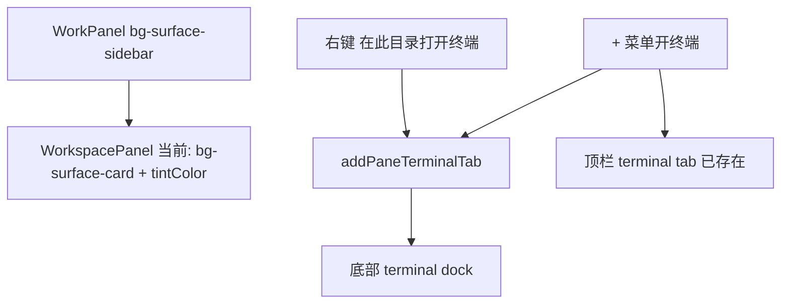

# WorkPanel 工作区色差与侧边终端

Planned-with: Cursor Grok 4.5
Suggested-Impl-Model: Composer 2.5

## 根因（证据）

截图 UI 属于 Desktop [`WorkPanel`](desktop/src/components/work-panel/WorkPanel.tsx)，不是 Enterprise web-portal。



1. **色差**：WorkPanel 外壳是 `bg-surface-sidebar`（约 L1218）。WorkPanel 嵌入 `WorkspacePanel` 时未传 `backAction`，于是 `isSidebarEmbed === false`，根节点走 `bg-surface-card` 并 inline `backgroundColor: tintColor`（[`WorkspacePanel.tsx` L1242–1245](desktop/src/components/WorkspacePanel.tsx)），与左侧/外壳不一致。
2. **终端落底部**：`openTerminalForPath` / `addSameCwdTerminal` 只调用 `addPaneTerminalTab`（L837–845、L1230–1237），**不**切 `activeKind`。而底部 dock 条件是 `!isSidebarEmbed && terminalTabs.length > 0`（L1558）。`+` 菜单的 `openTerminalTab`（WorkPanel L960–982）会 `setActiveKind("terminal")`，所以只有后者符合图4。

## In scope

- WorkPanel 嵌入的工作区背景对齐 `bg-surface-sidebar`，去掉该路径上的 tint 叠色。
- WorkPanel 嵌入时隐藏工作区底部终端 dock。
- 工作区内「在此目录打开终端」、工具栏「开终端」、`agx:open-terminal`：创建 tab 后切到顶栏 terminal 并列 tab。

## Out of scope

- Enterprise `/workspace`、侧栏历史里的 `SidebarSessionFileManage`（已有 `backAction` + `bg-surface-sidebar`）。
- 改 `TerminalEmbed` / xterm 主题算法、聊天主区布局、store schema。
- 移除顶栏 `+` → 终端已有行为（保持不变）。

## 推荐实施模型

| 子任务 | Suggested-Impl-Model | 理由 |
|--------|----------------------|------|
| 背景 token + hide dock + focus 回调 | Composer 2.5 | 窄改动、落点明确、无跨栈风险 |

Suggested-Impl-Model: Composer 2.5

---

## FR / AC

**FR-1**：WorkPanel「工作区」tab 背景与 WorkPanel / 侧栏 `surface-sidebar` 一致，无 tint 色差。  
**AC-1**：打开 WorkPanel → 工作区，根容器 class 含 `bg-surface-sidebar`，无 inline tint；肉眼与左侧导航同色阶。

**FR-2**：WorkPanel 工作区内开终端时，切到顶栏终端 pill，全高展示；工作区下方不再出现可拖拽终端条。  
**AC-2**：右键文件夹「在此目录下打开终端」后 `activeKind === "terminal"`，顶栏出现/激活终端 tab，工作区树被替换为全高 `TerminalEmbed`；同一动作不再渲染底部 dock。  
**AC-3**：工具栏终端按钮与 `window` 事件 `agx:open-terminal` 行为与 AC-2 一致。  
**AC-4**：`+` 菜单开终端行为不变（仍侧边 tab）。

---

## 改动落点

### 1. [`desktop/src/components/WorkspacePanel.tsx`](desktop/src/components/WorkspacePanel.tsx)

**Props**（约 L77–80）：新增可选回调：

```ts
/** WorkPanel 嵌入时：开终端后让父级切到顶栏 terminal tab */
onFocusTerminalTab?: () => void;
```

**背景**（L1242–1245）before → after 意图：

```tsx
// before
isSidebarEmbed ? "bg-surface-sidebar" : "bg-surface-card"
style={!isSidebarEmbed && tintColor ? { backgroundColor: tintColor } : undefined}

// after — WorkPanel 已传 hidePanelClose，与 sidebar 同源表面
const useSidebarSurface = isSidebarEmbed || hidePanelClose;
isSidebarEmbed || hidePanelClose  // class: bg-surface-sidebar
style={!useSidebarSurface && tintColor ? { backgroundColor: tintColor } : undefined}
```

「添加文件夹」展开条（约 L1367–1369）同样：仅在 `!useSidebarSurface` 时应用 `tintColor`，避免条带色差。

**开终端**（L837–845、`addSameCwdTerminal` L1230–1237）：

```tsx
addPaneTerminalTab(paneId, p, labelHint);
onFocusTerminalTab?.();
```

`agx:open-terminal` 已走 `openTerminalForPath`，无需另改。

**底部 dock**（L1558）：

```tsx
// before
{!isSidebarEmbed && terminalTabs.length > 0 ? (
// after — WorkPanel 嵌入时永不底部挂终端
{!isSidebarEmbed && !hidePanelClose && terminalTabs.length > 0 ? (
```

### 2. [`desktop/src/components/work-panel/WorkPanel.tsx`](desktop/src/components/work-panel/WorkPanel.tsx)

挂载 `WorkspacePanel`（约 L1661–1676）增加：

```tsx
onFocusTerminalTab={() => {
  setActiveKind("terminal");
}}
```

`addPaneTerminalTab` 已把 `activeTerminalTabId` 设为新 tab，无需再传 `tabId`。与现有 `focusRequest.kind === "terminal"`（L847–849）语义一致。

---

## 自测（人工）

1. Desktop `npm run dev`，打开侧栏 WorkPanel `+` → 工作区：背景应与外壳/左栏一致。  
2. 右键工作区根或子目录 →「在此目录下打开终端」：切到顶栏终端 tab，底部无 dock。  
3. 再点「工作区」pill：文件树仍在，底部仍无终端条；点终端 pill 可回看同一会话。  
4. `+` → 终端：仍侧边开 tab（回归）。  
5. 侧栏「历史 → 文件管理」（`backAction` 路径）：背景仍为 sidebar，行为不回归。

## no-scope-creep

只改上述两文件中列出的 prop / class / dock 条件 / 回调接线。不重构 WorkPanel tab 状态机，不改 `store.addPaneTerminalTab` 签名，不碰 ChatPane 布局宽度逻辑。
