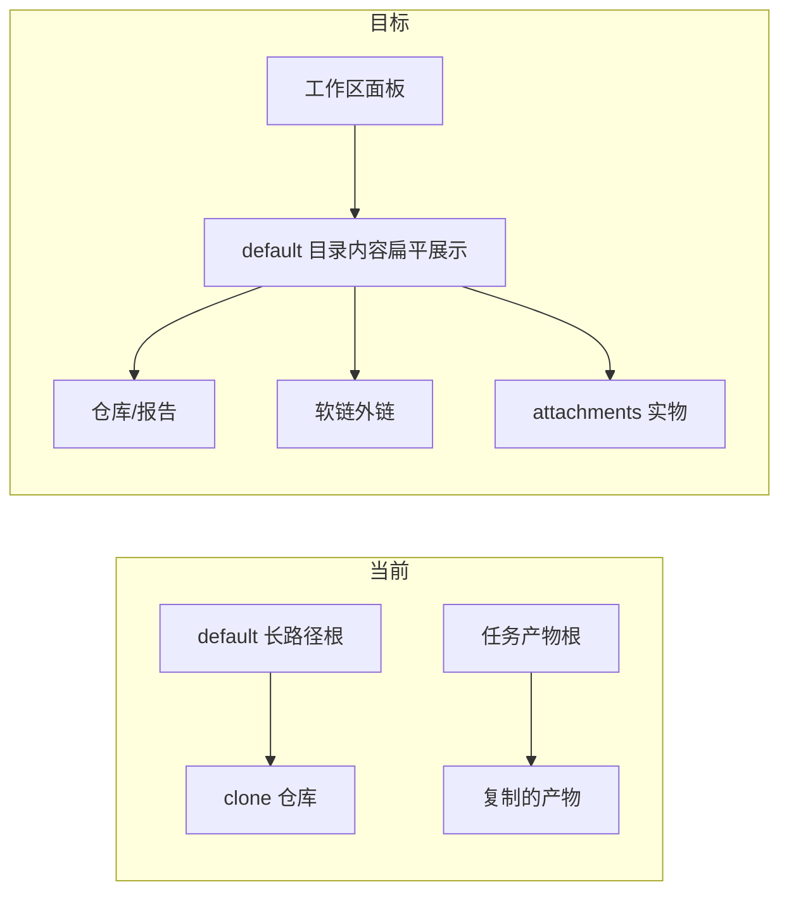

# 工作区单根展示 + 软链添加

Planned-with: grok-4.5
Suggested-Impl-Model: composer-2.5（Desktop UI + IPC）/ gpt-5.x（`_resolve_inside_root` 安全语义）

## 判断（同意）

你的模型合理，且与刚落地的 per-session default 一致：

- 打开「工作区」= 看当前 session 干活目录内容，而不是再挂一个「任务产物」副本根。
- 外链目录/文件用**软链**进 default，避免复制占空间、也避免再 `addTaskspace` 出第二根。
- 聊天**附件**写**实物**进 default（可放 `attachments/` 子目录），因为附件是会话资产，不是外部工程引用。

现有「任务产物」来自 [`ensure-artifact-taskspaces.ts`](desktop/src/utils/ensure-artifact-taskspaces.ts) + Electron `stage-session-artifacts`（**复制**到 `~/.agenticx/sessions/&lt;sid&gt;/task_artifacts` 再 `addTaskspace`）。注释里写明曾因 Studio `Path.resolve()` 会把软链解析出根外而改用复制——落地软链时必须一并修 [`_resolve_inside_root`](agenticx/studio/session_manager.py)。

## In scope

- Workspace 文件树：只展示 `default` taskspace **内部内容**（不显示长路径根行、不显示「任务产物」根）
- 停止自动挂载 `task_artifacts` 为独立 taskspace；Agent 产物改为软链进 default（已在 default 内则跳过）
- 「添加文件 / 添加文件夹」：软链进 default，不再 `addTaskspace` 挂第二根
- 聊天附件：落盘到 `&lt;default&gt;/attachments/`
- Studio：`_resolve_inside_root` 改为「词法路径必须在根下」，允许最终节点是指向根外的 symlink（修复读/列软链）

## Out of scope

- WorkPanel 摘要 Tab 里名为「任务产物」的**路径列表区块**（与左侧文件树第二根不同；本轮不改文案/结构）
- 分身 avatar workspace 策略大改
- 自动清理历史已复制的 `task_artifacts` 磁盘内容（仅从 UI/taskspace 列表移除挂载）

## 关键落点

### 1) Studio 允许根内软链

**文件:** [`agenticx/studio/session_manager.py`](agenticx/studio/session_manager.py) `_resolve_inside_root`（约 2930–2944）

**Before:** `(root / rel).resolve()` 后 `relative_to(root)` → 软链指向 `/tmp/...` 即 `path escapes`。

**After（意图）:**

- 规范化 `rel_path`，拒绝 `..` 逃逸
- `joined = root / clean_rel`，用**未 follow 最终软链**的路径做 containment（`os.path.normpath` + 前缀检查，或逐段拼接校验）
- I/O 时再 `stat`/`open`（系统 follow 软链）
- `list_taskspace_files`：`path` 仍报相对 default 的相对路径；可加可选 `is_symlink` 字段供 UI 标记（非必须）

**测试:** 新建/扩展 smoke：在临时 default 下 `ln -s /tmp/xxx file`，`list`/`read` 成功且 `..` 仍拒绝。

### 2) IPC：软链进 default / 附件落盘

**文件:** [`desktop/electron/main.ts`](desktop/electron/main.ts)、[`desktop/electron/preload.ts`](desktop/electron/preload.ts)、[`desktop/src/global.d.ts`](desktop/src/global.d.ts)

新增（或改写 stage）handler，例如：

- `linkIntoSessionWorkspace({ sessionId, sources: string[] })`  
  - 解析 Meta default：`~/.agenticx/taskspaces/&lt;sid&gt;/default`（与 SessionManager 一致；可从 `listTaskspaces` 取 `id===default` 的 path）  
  - 对每个 source：`symlink` 到 default 下唯一 basename（冲突则 `parent_name` 前缀）；目录用 `symlink` 整目录  
  - **不**再写入 `sessions/.../task_artifacts`，**不** `addTaskspace`
- `materializeSessionAttachments({ sessionId, files: { name, dataBase64|path }[] })` → 写到 `&lt;default&gt;/attachments/`

旧 `stage-session-artifacts`：改为内部调用「软链进 default」，或保留但不再挂第二根（推荐：stage 逻辑迁到 linkInto，避免双路径）。

### 3) 去掉「任务产物」自动挂载

**文件:** [`desktop/src/utils/ensure-artifact-taskspaces.ts`](desktop/src/utils/ensure-artifact-taskspaces.ts)、[`WorkPanel.tsx`](desktop/src/components/work-panel/WorkPanel.tsx) 同步 effect

**After:**

- 收集到的 artifact 路径：若已在 default 下 → noop；否则 `linkIntoSessionWorkspace`
- `removeTaskspace` 清理已挂载且 label/path 命中「任务产物」/`task_artifacts` 的旧根
- 不再 `addTaskspace(..., label: "任务产物")`

更新 [`ensure-artifact-taskspaces.test.ts`](desktop/src/utils/ensure-artifact-taskspaces.test.ts)。

### 4) WorkspacePanel：单根扁平内容

**文件:** [`desktop/src/components/WorkspacePanel.tsx`](desktop/src/components/WorkspacePanel.tsx)（约 1479–1613 树渲染；`pickAndAttachFiles` / `pickAndAttachDirectory` 约 900–956）

**展示:**

- 只渲染 `id === "default"` 的内容：`loadDir(defaultId, ".")` 后直接列出子项（等价今天展开根后的那一层），**不**渲染以完整 path 为标题的根行
- 空态文案改为「当前会话工作区为空」

**添加:**

- `pickAndAttach*` → 调 `linkIntoSessionWorkspace`，然后 `refresh` default 目录
- 不再 `addTaskspace` 挂父目录

**移除菜单语义:** 「添加」= 软链进当前会话工作区（可在空态/菜单旁加一行短说明）。

### 5) 聊天附件落盘

**文件:** [`desktop/src/components/ChatPane.tsx`](desktop/src/components/ChatPane.tsx) 发送附件路径（约 8392 附近 persist 逻辑）

**After:** 发送/上传时，对非 workspace-reference 的本地文件调用 `materializeSessionAttachments`，`AttachedFile.sourcePath` 优先指向 `&lt;default&gt;/attachments/&lt;name&gt;`，便于工作区可见与重试复用。

## 验收 AC

- AC-1: 打开工作区，树中**无**「任务产物」根，**无**以 `.../taskspaces/.../default` 为标题的可折叠根；直接见 `graphify/` 等子项
- AC-2: 「添加文件夹」到外部工程 → default 下出现同名**软链**，`ls -la` 可见 `->`；磁盘无整树复制
- AC-3: 聊天上传图片/文件 → `&lt;default&gt;/attachments/` 有实物，工作区可见
- AC-4: Agent 在 `/tmp` 写的产物经同步后以软链出现在 default，且 Studio `read_taskspace_file` 可读
- AC-5: 相关 pytest + desktop 单测绿；改 `main.ts` 后需完全重启 Near

## 子任务 → 推荐模型

| 子任务 | 推荐 | 理由 |
|--------|------|------|
| `_resolve_inside_root` + 测试 | gpt-5.x / composer-2.5 | 安全边界敏感 |
| Electron IPC 软链/附件 | composer-2.5 | 样板 IPC |
| WorkspacePanel + ensure-artifact | composer-2.5 | 前端接线 |
| ChatPane 附件落盘 | composer-2.5 | 局部接线 |
