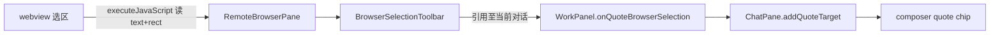

# 工作台远程网页选区引用至当前对话

Planned-with: cursor-grok-4.5
Suggested-Impl-Model: Composer 2.5（够用且最省：复用已有 `SelectionQuotePopover` / `addQuoteTarget` / `computePopupAnchorFromRect`；webview 侧用 `executeJavaScript` 注入选区钩子，无需新主进程 preload 打包路径）

> 复杂度：中等（M）。范围锁定 WorkPanel **远程** `<webview>`（`RemoteBrowserPane`）选区 → 引用 chip 进当前对话输入框。本地 `srcDoc` HTML 已由 `HtmlPreviewShell` + `onQuoteHtmlElement` 覆盖，**本次不改**。不重做聊天气泡选区菜单（已落地）。

---

## 1. 背景与结论

用户在工作台内嵌浏览器（百度等）选中正文后，浮层目前只有页面/宿主侧「搜索 / 复制」，**没有「引用至当前对话」**。`RemoteBrowserPane`（`desktop/src/components/work-panel/WorkPanel.tsx` L129–268）无选区监听、无 quote 回调。

与用户确认方向：选区应能进入左侧对话框，语义对齐文件预览的「引用至当前对话」与聊天气泡引用——走 **`quoted_content` / 内联 quote chip**（`addQuoteTarget`），不是 `context_files` 片段挂载（网页无本地 `absolutePath`，无法走 `insertWorkspaceSnippetReference`）。



---

## 2. In scope / Out of scope

**In scope**

- 远程 `https?://` webview 内选中非空文本 → 宿主浮层展示至少 **「引用至当前对话」**；建议同排提供 **复制**、**搜索**（对齐用户截图已有两项，避免能力回退感）
- 点击「引用至当前对话」→ 当前 pane 输入框插入 quote chip（光标位置逻辑复用既有 `addQuoteTarget`）
- 搜索：打开/聚焦工作台浏览器标签，URL 用 Google（与聊天气泡 `onWebSearchMessage` 一致：`https://www.google.com/search?q=...`）
- 纯函数选区坐标换算 + vitest

**Out of scope**

- `srcDoc` / `HtmlPreviewShell` 选元素（已有）
- 「引用至新对话」新窗格（可后续加；本次不强制）
- webview guest preload 独立打包（避免 `file://` preload 路径与 electron-builder 额外配置）
- 修改 `agx serve` / 后端协议（复用现有 `quoted_content`）

---

## 3. 需求

### FR

- **FR-1**：在 `RemoteBrowserPane` 中，用户松开鼠标或键盘选区变化且选区文本 `trim()` 非空时，在选区附近显示宿主浮层工具条。
- **FR-2**：工具条「引用至当前对话」调用 `onQuoteBrowserSelection({ text, url, title })`；`ChatPane` 内 `addQuoteTarget` 合成消息：`role: "assistant"`，`avatarName` = 页标题或 hostname（截断），`content`/`body` = 选区文本，`id` = 每次唯一（如 `web-${Date.now()}-${random}`）。
- **FR-3**：工具条「复制」：`navigator.clipboard.writeText(text)`；「搜索」：与 `ChatPane` 气泡网络搜索相同（确保工作台打开 + `setWorkPanelFocus({ kind: "browser", url: googleUrl, title })`）。可由 `ChatPane` 传入 `onSearchBrowserSelection` 或在 `onQuoteBrowserSelection` 旁新增 `onSearchBrowserSelection`。
- **FR-4**：点击工具条按钮时 `mousedown` 使用 `preventDefault`，避免 webview 失焦导致选区丢失后再读空（对齐 `SelectionQuotePopover`）。
- **FR-5**：导航 / `reloadKey` 变化后重新注入 guest 钩子；选区清空时隐藏工具条。

### AC

- **AC-1**：`browser-selection.test.ts`：guest rect + webview `getBoundingClientRect` → host anchor；空文本 / 无 range 返回 null。
- **AC-2**：手动：工作台打开百度 → 选中一段话 → 出现「引用至当前对话」→ 点击后输入框出现 quote chip → 发送后气泡内联 pill，模型能读到引用正文。
- **AC-3**：`npm run build`（desktop）绿。

### NFR

- 不在主进程新增 IPC（除非 `executeJavaScript` 在类型上不可用——当前 Electron webview 支持，仅需扩展 `NearElectronWebview` 类型）。
- 注入脚本须幂等（`window.__nearBrowserSelHook` 标记），避免重复 listener。
- 跨域页面只需读 `window.getSelection()`，不读页面私有 API。

---

## 4. 精确落点

### 4.1 新建 `desktop/src/components/work-panel/browser-selection.ts`

导出：

```ts
export type BrowserGuestSelection = {
  text: string;
  /** Guest viewport rect (before host offset). */
  rect: { top: number; left: number; width: number; height: number };
};

export type BrowserQuotePayload = {
  text: string;
  url: string;
  title: string;
};

/** Injected once per document; stores last selection on mouseup/keyup. */
export const BROWSER_SELECTION_HOOK_JS = `(() => { ... })()`;

/** Read last selection snapshot from guest. */
export const BROWSER_SELECTION_READ_JS = `(() => { ... return null | { text, rect } })()`;

export function mapGuestRectToHostAnchor(
  guestRect: BrowserGuestSelection["rect"],
  webviewHostRect: DOMRect,
  opts?: { zoom?: number }
): SelectionPopupAnchor;
```

**注入钩子意图（before → after）**

- Before：guest 无钩子，宿主不知选区。
- After：`mouseup`/`keyup` 把 `{ text, rect }` 写到 `window.__nearBrowserSel`；宿主定时或事件后 `executeJavaScript(BROWSER_SELECTION_READ_JS)` 读取。

读脚本返回：`text` 为空则 `null`；否则 `getBoundingClientRect()` 取选区最后一行。

`mapGuestRectToHostAnchor`：  
`centerX = webviewHostRect.left + (guestRect.left + guestRect.width/2) * zoom`  
`belowY = webviewHostRect.top + (guestRect.top + guestRect.height) * zoom + gap`  
再调用已有 `computePopupAnchorFromRect` / `clamp`（从 `selection-quote-popover.tsx` import `computePopupAnchorFromRect` 或复制 clamp 逻辑到本文件避免循环依赖——**优先 import** `computePopupAnchorFromRect`）。

### 4.2 新建 `desktop/src/components/work-panel/BrowserSelectionToolbar.tsx`

- Portal 到 `document.body`，`fixed z-[100]`，样式对齐截图双按钮条（白底圆角 + 搜索/复制），并加第三项或主项「引用至当前对话」。
- Props：`anchor: SelectionPopupAnchor`；`onQuote`；`onCopy`；`onSearch`；均在 `onMouseDown` preventDefault。
- 文案硬编码中文：`引用至当前对话` / `复制` / `搜索`。

### 4.3 修改 `desktop/src/global.d.ts` — `NearElectronWebview`

在现有 type（约 L3–13）增加：

```ts
executeJavaScript: (code: string, userGesture?: boolean) => Promise<unknown>;
addEventListener: HTMLElement["addEventListener"]; // 若已继承可省略
// 实际需要监听：dom-ready / did-finish-load / did-navigate-in-page
```

若 `NearElectronWebview` 已是 `HTMLElement & {...}`，只需补 `executeJavaScript`。

### 4.4 修改 `RemoteBrowserPane`（`WorkPanel.tsx` L129–268）

新增 props：

```ts
onQuoteSelection?: (payload: BrowserQuotePayload) => void;
onSearchSelection?: (text: string) => void;
```

逻辑：

1. `useState` 保存 `{ text, anchor } | null`。
2. `dom-ready` / `did-finish-load` / `did-navigate-in-page`：`executeJavaScript(BROWSER_SELECTION_HOOK_JS)`（catch 忽略）。
3. `useEffect` 轮询（建议 250ms，仅当 webview mounted）：`executeJavaScript(BROWSER_SELECTION_READ_JS)` → 映射 anchor → setState；null 则 clear。组件卸载 clearInterval。
4. 渲染 `BrowserSelectionToolbar`；quote 时 `onQuoteSelection({ text, url, title })`；copy 本地 clipboard；search 调 `onSearchSelection?.(text)`。
5. Device toolbar `zoom`：把 `viewport.zoomPercent/100` 传入 `mapGuestRectToHostAnchor`（fixed 尺寸缩放时 guest CSS 像素与 host 显示比例一致时必需）。

### 4.5 修改 `WorkPanel` props（约 L417）

```ts
onQuoteBrowserSelection?: (payload: BrowserQuotePayload) => void;
onSearchBrowserSelection?: (text: string) => void;
```

传给 `RemoteBrowserPane`（约 L1840）。**不要**传给 `HtmlPreviewShell` srcDoc 分支。

### 4.6 修改 `ChatPane.tsx`（WorkPanel 调用处约 L12224）

```tsx
onQuoteBrowserSelection={(payload) => {
  const text = payload.text.trim();
  if (!text) return;
  let host = "";
  try { host = new URL(payload.url).hostname; } catch { /* ignore */ }
  const label = (payload.title || host || "网页").trim().slice(0, 48);
  addQuoteTarget(
    {
      id: `web-${crypto.randomUUID()}`,
      role: "assistant",
      content: text,
      avatarName: label,
    },
    text,
  );
}}
onSearchBrowserSelection={(text) => {
  const q = text.trim();
  if (!q) return;
  // 同 onWebSearchMessage 分支（打开侧栏 + setWorkPanelFocus google）
}}
```

---

## 5. 测试

**新建** `desktop/src/components/work-panel/browser-selection.test.ts`：

- `mapGuestRectToHostAnchor` 给定 guestRect `{top:10,left:20,width:100,height:20}` 与 hostRect `{top:100,left:200,...}` → left/top 落在预期区间。
- zoom=2 时偏移加倍。

手动回归见 AC-2。

---

## 6. 实施任务顺序

1. 写 `browser-selection.ts` + 失败单测 → 实现 map → 单测绿  
2. 写 `BrowserSelectionToolbar.tsx`  
3. 扩 `NearElectronWebview` + 改 `RemoteBrowserPane`  
4. 接线 `WorkPanel` → `ChatPane`  
5. `npx vitest run src/components/work-panel/browser-selection.test.ts` + `npm run build`

---

## 7. no-scope-creep

- 不改 `SelectionQuotePopover` 默认单按钮行为（文件预览继续只用「引用至当前对话」）。
- 不改 `insertWorkspaceSnippetReference`。
- 不改 `agenticx/studio/server.py` import 区。
- 不把 Baidu 特有 DOM 写进钩子。
