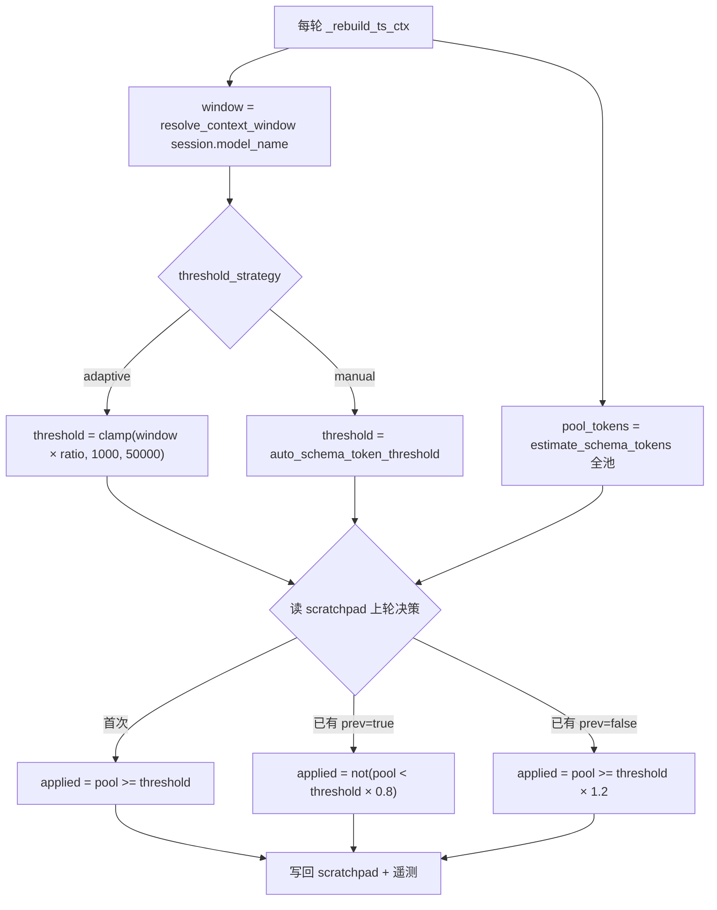

# ToolSearch 自适应阈值与决策滞回

Planned-with: Opus 5（Cursor；具体 slug 由用户在 commit 时确认，勿臆造）
Suggested-Impl-Model: cursor-grok-4.5-high-fast（分阶段建议见下表）

## 背景与根因

`runtime.tool_search.mode: auto` 当前用一个**静态绝对 token 数**决定是否启用工具按需加载：

```311:316:agenticx/runtime/tool_search.py
    if cfg.mode == "off":
        return False
    if cfg.mode == "always":
        return True
    # auto
    return int(full_pool_schema_tokens) >= int(cfg.auto_schema_token_threshold)
```

两个实际问题：

**问题 1：阈值不可迁移。** 6000 这个数字对 128k 窗口的模型和 1M 窗口的模型意义完全不同。用户无法凭直觉设定，只能试。实测某会话（`~/.agenticx/sessions/8f058fbb-7966-40f9-9179-3f8712751f43/context_stats.jsonl`）全量工具池 `schema_tokens_before = 15977`，阈值设 1000 / 6000 / 15000 行为完全一致，用户调了等于没调。

**问题 2：可能中途翻转。** `_project_active_tools()` 每轮重建 ctx 并重新判定：

```2815:2816:agenticx/runtime/agent_runtime.py
            # Re-project each round so tool_search loads take effect next round.
            active_tools, allowed_tool_names = _project_active_tools()
```

会话中途连接 MCP 会让 `full_pool_schema_tokens` 跳变。若恰好跨过阈值，同一会话内工具面会突然收缩或扩张，模型上一轮能直接调的工具下一轮报 `schema is not loaded yet`。该风险今天已存在，改为自适应后若不加滞回会更易触发。

## 目标

1. `auto` 模式的阈值改为按**模型上下文窗口的百分比**推导，跨模型自动校准。
2. 判定结果在**会话内加滞回**，避免工具面中途抖动。
3. 保留手动绝对阈值作为高级覆盖通道，且不破坏现有配置。
4. `TOOL_SEARCH_MAX_LOADED` 由固定 24 改为按剩余预算推导。
5. 遥测暴露当轮实际阈值与决策依据，可排障。

## In scope / Out of scope

**In scope：** `agenticx/runtime/tool_search.py` 纯函数扩展、`tool_search_runtime.py` 配置读取与决策落盘、`agent_runtime.py` 遥测字段、新建 `agenticx/runtime/model_context_window.py`、`context_usage.py` 改为复用该模块、Desktop 设置项（Electron IPC + React）、对应单测与冒烟测试。

**Out of scope（严禁顺手改）：**
- **不修** system prompt 与工具投影不一致导致的 `web_search` 首轮被拒问题。那是独立根因（`_build_web_search_capability_block` 鼓励直接调用，但 `web_search` 在 `BUILTIN_DEFER_ALLOWLIST` 内被 defer），本 plan 无论怎么调阈值都不解决它，需另开 plan。
- 不改 `CORE_ALWAYS_LOAD_TOOLS` / `BUILTIN_DEFER_ALLOWLIST` 名单内容。
- 不改 `rank_tools` 检索算法、MCP 公开名生成、scratchpad 状态协议 `__tool_search_state_v1__`。
- 不改 `mode` 三态语义（`off` / `auto` / `always` 保持不变）。
- 不动 `agenticx/studio/server.py`。

## 设计



### 配置 schema（`~/.agenticx/config.yaml`）

```yaml
runtime:
  tool_search:
    mode: auto                          # 不变
    threshold_strategy: adaptive        # 新增：adaptive | manual，缺省 adaptive
    context_budget_ratio: 0.05          # 新增：adaptive 下生效，范围 0.01–0.25
    auto_schema_token_threshold: 6000   # 保留：manual 下生效；adaptive 下不读
```

**迁移规则（必须严格按此实现）：** 配置中**不存在** `threshold_strategy` 键时一律视为 `adaptive`，不做「按旧阈值是否等于默认值来猜用户意图」这类启发式。旧的 `auto_schema_token_threshold` 值原样保留在文件里不删除，切回 `manual` 时仍可用。

## FR / AC

### FR-1 上下文窗口查表抽成共享模块

**落点：** 新建 `agenticx/runtime/model_context_window.py`。

把 `agenticx/studio/context_usage.py` 第 22–51 行的 `_MODEL_CONTEXT_WINDOWS`、`_DEFAULT_CONTEXT_WINDOW`、`resolve_context_window` **原样移动**到新模块（表内容一字不改），公开名去掉下划线前缀：

```python
#!/usr/bin/env python3
"""Model context window lookup shared by ToolSearch and context usage.

Author: Damon Li
"""

MODEL_CONTEXT_WINDOWS: list[tuple[str, int]] = [
    ("claude-opus-4", 200_000),
    # ... 与 context_usage.py 现有表逐行一致，不增删不改序 ...
]
DEFAULT_CONTEXT_WINDOW = 128_000


def resolve_context_window(model_name: str | None) -> int:
    """Best-effort lookup of a model's context window size, by substring match."""
```

然后修改 `agenticx/studio/context_usage.py`：删除本地表与本地 `resolve_context_window` 定义，改为 `from agenticx.runtime.model_context_window import resolve_context_window`。**保留** `context_usage.py` 内 `resolve_context_window` 这个名字可被外部导入（即直接 re-export，不要改名），第 160 行 `max_tokens = resolve_context_window(model_name)` 一行不动。

> 顺序敏感：表是按 substring 前缀匹配、**先命中先返回**（`claude-sonnet-5` 必须排在 `claude` 之前），移动时禁止排序或去重。

**AC-1：** 新增 `tests/test_model_context_window.py`，对 `["claude-sonnet-5-x", "claude-3", "gpt-5-codex", "gpt-4o", "gemini-2.5-pro", "gemini-1.5", "qwen-plus", "unknown-model"]` 逐一断言返回值与改动前 `context_usage.resolve_context_window` 的返回值相同（预期依次：200000、200000、256000、128000、1048576、1000000、128000、128000）。

### FR-2 纯函数：自适应阈值 + 滞回判定

**落点：** `agenticx/runtime/tool_search.py`。该文件 docstring 声明「Pure functions only — no AgentRuntime / MCPHub / Desktop imports」，本次新增代码**必须继续保持纯函数**，`context_window` 由调用方传入，不得在此文件 import `model_context_window` 之外的任何运行时模块。

新增常量（放在第 20 行 `TOOL_NOT_YET_LOADED_TEMPLATE` 之后）：

```python
DEFAULT_CONTEXT_BUDGET_RATIO = 0.05
CONTEXT_BUDGET_RATIO_MIN = 0.01
CONTEXT_BUDGET_RATIO_MAX = 0.25
THRESHOLD_FLOOR = 1000
THRESHOLD_CEIL = 50000
HYSTERESIS_RATIO = 0.2
TOOL_SEARCH_DECISION_KEY = "__tool_search_decision_v1__"
_VALID_STRATEGIES = frozenset({"adaptive", "manual"})
```

扩展 `ToolSearchConfig`（现第 131–143 行），**追加字段并给默认值**，保证既有构造调用不破：

```python
@dataclass(frozen=True)
class ToolSearchConfig:
    mode: str = "off"
    auto_schema_token_threshold: int = DEFAULT_AUTO_SCHEMA_TOKEN_THRESHOLD
    threshold_strategy: str = "adaptive"
    context_budget_ratio: float = DEFAULT_CONTEXT_BUDGET_RATIO
```

`normalized()` 同步补：strategy 不在 `_VALID_STRATEGIES` 时回落 `"adaptive"`；ratio 非有限数或越界时 clamp 到 `[0.01, 0.25]`，非法值回落 `DEFAULT_CONTEXT_BUDGET_RATIO`。既有 mode / threshold 归一化逻辑**保持原样不动**。

新增两个纯函数：

```python
def resolve_effective_threshold(
    config: ToolSearchConfig,
    *,
    context_window: int,
) -> int:
    """Absolute schema-token threshold for the current model."""
    cfg = config.normalized()
    if cfg.threshold_strategy == "manual":
        return int(cfg.auto_schema_token_threshold)
    window = int(context_window) if int(context_window) > 0 else 128_000
    raw = int(window * cfg.context_budget_ratio)
    return max(THRESHOLD_FLOOR, min(THRESHOLD_CEIL, raw))


def decide_apply_with_hysteresis(
    *,
    prev_applied: Optional[bool],
    pool_tokens: int,
    threshold: int,
    hysteresis_ratio: float = HYSTERESIS_RATIO,
) -> bool:
    """Latch the previous decision unless the pool moves clear of the band."""
    tokens = int(pool_tokens)
    thr = int(threshold)
    if prev_applied is None:
        return tokens >= thr
    if prev_applied:
        return tokens >= int(thr * (1.0 - hysteresis_ratio))
    return tokens >= int(thr * (1.0 + hysteresis_ratio))
```

**AC-2：** 新增 `tests/test_tool_search_adaptive_threshold.py`：
- `resolve_effective_threshold(ToolSearchConfig(mode="auto"), context_window=128_000) == 6400`
- `... context_window=200_000) == 10_000`
- `... context_window=1_048_576) == 50_000`（触顶封顶）
- `... context_window=8_000) == 1_000`（触底封底）
- `resolve_effective_threshold(ToolSearchConfig(mode="auto", threshold_strategy="manual", auto_schema_token_threshold=1000), context_window=200_000) == 1000`
- `ToolSearchConfig(mode="auto", context_budget_ratio=0.9).normalized().context_budget_ratio == 0.25`
- `ToolSearchConfig(mode="auto", threshold_strategy="bogus").normalized().threshold_strategy == "adaptive"`
- 滞回：`decide_apply_with_hysteresis(prev_applied=None, pool_tokens=6400, threshold=6400) is True`；`prev_applied=True, pool_tokens=5200, threshold=6400` → `True`（仍在带内，维持）；`prev_applied=True, pool_tokens=5119, threshold=6400` → `False`（跌破 0.8×）；`prev_applied=False, pool_tokens=7000, threshold=6400` → `False`（未达 1.2×）；`prev_applied=False, pool_tokens=7680, threshold=6400` → `True`

### FR-3 判定单点化，投影与拒绝消息必须同源

**落点：** `agenticx/runtime/tool_search.py` 的 `ToolSearchRuntimeContext`（第 159–164 行）、`should_apply_tool_search`（第 297 行）、`project_tools_for_round`（第 348 行）、`is_tool_pending_next_round`（第 590 行）。

当前 `project_tools_for_round` 与 `is_tool_pending_next_round` **各自独立**调用 `should_apply_tool_search` 重算一次。引入滞回后若两处算出不同结果，会出现「工具没进 `tools[]`，但拒绝消息却说不是延迟加载」的错乱。必须改为单点判定。

`ToolSearchRuntimeContext` 追加带默认值的字段：

```python
@dataclass
class ToolSearchRuntimeContext:
    config: ToolSearchConfig
    catalog: ToolCatalog
    state: ToolSearchStateV1
    tool_search_allowed: bool
    effective_threshold: Optional[int] = None
    prev_applied: Optional[bool] = None
    resolved_applied: Optional[bool] = None
```

`should_apply_tool_search` 追加两个可选关键字参数，**不改原有位置参数与既有语义**：

```python
def should_apply_tool_search(
    config: ToolSearchConfig,
    *,
    full_pool_schema_tokens: int,
    tool_search_allowed: bool,
    effective_threshold: Optional[int] = None,
    prev_applied: Optional[bool] = None,
) -> bool:
    if not tool_search_allowed:
        return False
    cfg = config.normalized()
    if cfg.mode == "off":
        return False
    if cfg.mode == "always":
        return True
    thr = (
        int(effective_threshold)
        if effective_threshold is not None
        else int(cfg.auto_schema_token_threshold)
    )
    return decide_apply_with_hysteresis(
        prev_applied=prev_applied,
        pool_tokens=int(full_pool_schema_tokens),
        threshold=thr,
    )
```

新增内部辅助，供两个消费方共用：

```python
def _resolve_applied(ctx: ToolSearchRuntimeContext, full_openai_tools: list[dict]) -> bool:
    if ctx.resolved_applied is not None:
        return bool(ctx.resolved_applied)
    return should_apply_tool_search(
        ctx.config,
        full_pool_schema_tokens=estimate_schema_tokens(list(full_openai_tools)),
        tool_search_allowed=ctx.tool_search_allowed,
        effective_threshold=ctx.effective_threshold,
        prev_applied=ctx.prev_applied,
    )
```

`project_tools_for_round` 开头的 `tokens = ...` + `if not should_apply_tool_search(...)` 改为 `if not _resolve_applied(ctx, full_openai_tools): return full_openai_tools`；`is_tool_pending_next_round` 内同样的判定块也改为调用 `_resolve_applied`。两处 fail-open 语义（返回全量池 / 返回 False）保持不变。

**AC-3：** `tests/test_tool_search.py` 全部现有用例保持绿（`test_mode_auto_threshold`、`test_fail_open_when_tool_search_disallowed` 等不修改）。在 `tests/test_tool_search_adaptive_threshold.py` 追加：构造 `resolved_applied=False` 的 ctx，断言 `project_tools_for_round` 返回的对象 `is` 传入的 `full_openai_tools`，且 `is_tool_pending_next_round(..., "web_search", ...)` 返回 `False`；`resolved_applied=True` 时两者行为反转。

### FR-4 运行时接线：读配置、算决策、落盘、复用

**落点：** `agenticx/runtime/tool_search_runtime.py`。

`read_tool_search_config()`（第 23–46 行）在现有 `mode` / `threshold` 解析**之后**追加读取，不改动既有 try/except 结构与 flat legacy 兼容分支：

```python
strategy = str(raw.get("threshold_strategy") or "adaptive").strip().lower()
try:
    ratio = float(raw.get("context_budget_ratio") or DEFAULT_CONTEXT_BUDGET_RATIO)
except (TypeError, ValueError):
    ratio = DEFAULT_CONTEXT_BUDGET_RATIO
```

并在末尾 `return ToolSearchConfig(...)` 补上 `threshold_strategy=strategy, context_budget_ratio=ratio`。

`build_runtime_context()`（第 86–123 行）在 `tool_search_allowed` 计算之后、`return` 之前插入决策段：

```python
from agenticx.runtime.model_context_window import resolve_context_window
from agenticx.runtime.tool_search import (
    TOOL_SEARCH_DECISION_KEY,
    estimate_schema_tokens,
    resolve_effective_threshold,
    should_apply_tool_search,
)

window = resolve_context_window(str(getattr(session, "model_name", "") or ""))
effective_threshold = resolve_effective_threshold(cfg, context_window=window)
prev_raw = scratchpad.get(TOOL_SEARCH_DECISION_KEY)
prev_applied = (
    bool(prev_raw.get("applied")) if isinstance(prev_raw, dict) and "applied" in prev_raw else None
)
pool_tokens = estimate_schema_tokens(list(full_openai_tools))
applied = should_apply_tool_search(
    cfg,
    full_pool_schema_tokens=pool_tokens,
    tool_search_allowed=tool_search_allowed,
    effective_threshold=effective_threshold,
    prev_applied=prev_applied,
)
scratchpad[TOOL_SEARCH_DECISION_KEY] = {
    "version": 1,
    "applied": bool(applied),
    "pool_tokens": int(pool_tokens),
    "effective_threshold": int(effective_threshold),
    "context_window": int(window),
    "threshold_strategy": cfg.normalized().threshold_strategy,
}
```

`return ToolSearchRuntimeContext(...)` 补 `effective_threshold=effective_threshold, prev_applied=prev_applied, resolved_applied=applied`。

> `import` 位置注意：本仓 rule 要求 import 置于文件顶部。`model_context_window` 与 `tool_search` 均无循环依赖风险，**应加到文件顶部第 7 行现有 `from agenticx.runtime.tool_search import (...)` 块内**，上面写成局部 import 只是为了标注新增符号，实现时请合并进顶部导入块，并且**只增行、不要整块替换**已有导入项。

**AC-4：** 新增 `tests/test_smoke_tool_search_adaptive_runtime.py`：用一个带 `model_name = "claude-sonnet-5"`、`scratchpad = {}`、`mcp_hub = None` 的假 session 调 `build_runtime_context`，断言 `ctx.effective_threshold == 10_000`；断言 `session.scratchpad["__tool_search_decision_v1__"]["context_window"] == 200_000`。再用 `model_name = "qwen-plus"` 断言 `effective_threshold == 6400`。滞回落盘验证：先塞 `scratchpad["__tool_search_decision_v1__"] = {"applied": True}`，用一个刚好低于 `0.8 × threshold` 的小工具池重建，断言 `ctx.resolved_applied is False`；改为略低于 threshold 但高于 `0.8 ×` 时断言仍为 `True`。

### FR-5 遥测

**落点：** `agenticx/runtime/agent_runtime.py` 第 2985–3007 行的 try 块与第 3022–3028 行的 `context_payload`。

在 try 块内 `_ts_applied = should_apply_tool_search(...)` 调用处补传 `effective_threshold=ts_ctx.effective_threshold, prev_applied=ts_ctx.prev_applied`；若 `ts_ctx.resolved_applied is not None` 则直接取之。并采集 `_ts_threshold = int(ts_ctx.effective_threshold or 0)`、`_ts_strategy = ts_ctx.config.normalized().threshold_strategy`、`_ts_latched = bool(ts_ctx.prev_applied is not None and ts_ctx.prev_applied == _ts_applied)`。except 分支同步补默认值 `0` / `"adaptive"` / `False`。

`context_payload` 在现有 `tool_search_*` 字段**之后追加**三个键，不动已有键名与顺序：

```python
"tool_search_effective_threshold": int(_ts_threshold),
"tool_search_threshold_strategy": str(_ts_strategy),
"tool_search_decision_latched": bool(_ts_latched),
```

**AC-5：** 手工验证 —— 跑一次真实会话后，`~/.agenticx/sessions/<id>/context_stats.jsonl` 每行含上述三个新键，且 `tool_search_applied` 与 `tool_search_effective_threshold` 在同一会话内不因中途连接 MCP 而翻转（除非跨过 ±20% 带）。

### FR-6 `TOOL_SEARCH_MAX_LOADED` 预算化

**落点：** `agenticx/runtime/tool_search.py` 第 17 行常量与 `mark_loaded`（第 278 行）。

`TOOL_SEARCH_MAX_LOADED = 24` 保留为**上限封顶**，另加下限常量 `TOOL_SEARCH_MIN_LOADED = 8`。新增纯函数：

```python
def resolve_max_loaded(*, effective_threshold: int, core_schema_tokens: int) -> int:
    """How many deferred tools may stay hot, given the remaining budget."""
    remaining = max(0, int(effective_threshold) - int(core_schema_tokens))
    # ~350 tokens is a rough per-tool schema cost in this codebase.
    est = remaining // 350
    return max(TOOL_SEARCH_MIN_LOADED, min(TOOL_SEARCH_MAX_LOADED, est))
```

`mark_loaded` 追加可选参数 `max_loaded: Optional[int] = None`，为 `None` 时沿用 `TOOL_SEARCH_MAX_LOADED`（保证既有调用与测试不变）。`apply_search`（第 533 行）改为传入由 `resolve_max_loaded` 算出的值，`core_schema_tokens` 取 `estimate_schema_tokens` 作用于「投影后的核心工具集」。

**AC-6：** 在 `tests/test_tool_search_adaptive_threshold.py` 追加：`resolve_max_loaded(effective_threshold=50_000, core_schema_tokens=5_000) == 24`（触顶）；`resolve_max_loaded(effective_threshold=6_400, core_schema_tokens=5_777) == 8`（触底）；`mark_loaded(state, ids)` 不传 `max_loaded` 时行为与改动前完全一致（沿用 `tests/test_tool_search.py` 中既有 LRU 用例）。

### FR-7 Desktop 设置项

**落点（四个文件，逐个改）：**

1. `desktop/electron/main.ts` 第 8855–8876 行 `load-runtime-config`：`toolSearchRaw` 解析后追加 `threshold_strategy`（非 `adaptive`/`manual` 回落 `adaptive`）与 `context_budget_ratio`（clamp `0.01`–`0.25`，非法回落 `0.05`），返回体追加 `tool_search_threshold_strategy`、`tool_search_context_budget_ratio`。第 8888 行的 error 分支同步补默认值。**只增行**，勿整块替换相邻的 `readStallNudgeRuntime` / `readUnattendedRuntime` 展开。

2. `desktop/electron/main.ts` 第 9018–9045 行 `save-runtime-config`：`if` 条件追加两个新 key 的 `!== undefined` 判断；块内追加两段校验写入（strategy 非法返回 `{ ok: false, error: "tool_search_threshold_strategy must be adaptive|manual" }`；ratio 非有限数返回 `{ ok: false, error: "tool_search_context_budget_ratio must be a number" }`，合法则 clamp 后写 `prevTs.context_budget_ratio`）。第 9040–9043 行的兜底默认同步补 `threshold_strategy` 与 `context_budget_ratio`。

3. `desktop/electron/preload.ts` 第 273 行附近与 `desktop/src/global.d.ts` 第 103–104、628–629、650–651 行：三处 `tool_search_*` 类型声明各补 `tool_search_threshold_strategy?: "adaptive" | "manual"` 与 `tool_search_context_budget_ratio?: number`。

4. `desktop/src/components/automation/ToolSearchConfigSection.tsx`：`mode === "auto"` 分支内，把当前唯一的绝对阈值滑杆改为「策略切换 + 条件渲染」——`adaptive` 时渲染比例滑杆（`min=1` `max=25` `step=0.5`，展示为百分比），`manual` 时渲染原有 `SettingsRangeField`（`TOOL_SEARCH_THRESHOLD_MIN/MAX` 常量保留不动）。比例滑杆下方加一行说明文案（静态计算，不需要新 API）：`上下文窗口 × N%（128k 模型 ≈ X，200k ≈ Y，1M 封顶 50000）`，X/Y 由当前 ratio 实时算出。

5. `desktop/src/components/SettingsPanel.tsx`：第 2278–2299 行 `persistToolSearchConfig` 签名扩展为携带 strategy 与 ratio；第 2366–2375 行加载处补两个新状态的读取与 clamp；第 2506 行保存处补两个新字段。沿用现有「切换即写入、失败就近展示 `toolSearchPersistError`」的模式，**不要**在此区块新增顶部保存按钮。

**AC-7：**
- `cd desktop && npx tsc --noEmit` 通过；`npm run build` 通过。
- 手工：设置页切到 `自动` → 出现「阈值策略」切换；选 `自适应` 时只见比例滑杆，选 `手动` 时只见原 token 滑杆。
- 手工：调整比例后 `~/.agenticx/config.yaml` 的 `runtime.tool_search.context_budget_ratio` 即时更新，且 `auto_schema_token_threshold` 原值**未被删除**。
- 手工：完全退出 Electron 后重启（改了 `main.ts` 必须 ⌘Q 重启，仅刷新渲染进程不加载新 IPC handler），设置项能正确回显。

## 实施顺序与推荐模型

| 阶段 | 内容 | 依赖 | Suggested-Impl-Model | 理由 |
|------|------|------|----------------------|------|
| P1 | FR-1 + FR-2（共享模块 + 纯函数 + 单测） | — | kimi-k2.7-code | 纯函数与表移动，代码专精便宜档足够 |
| P2 | FR-3 + FR-4（判定单点化 + 运行时接线 + 冒烟） | P1 | cursor-grok-4.5-high-fast | 与既有 tool-search 子规划一致，接线有回归风险 |
| P3 | FR-7（Electron IPC + 设置 UI） | P1 | composer-2.5-fast | 表单与 IPC 样板 |
| P4 | FR-5 + FR-6 + 收口验证 | P2、P3 | gpt-5.6-sol-medium | 跨栈一致性与遥测收口 |

P2 与 P3 仅在隔离 worktree 下可并行；共享工作区必须串行。

## 全局验收

1. `python -m pytest tests/test_tool_search.py tests/test_tool_search_adaptive_threshold.py tests/test_model_context_window.py tests/test_smoke_tool_search_adaptive_runtime.py -q` 全绿。
2. `cd desktop && npx tsc --noEmit && npm run build` 通过。
3. 冷启动验证：`agx serve --host 127.0.0.1 --port <临时端口>` 不崩溃，`/api/session`、`/api/avatars`、`/api/sessions` 返回 200。
4. 回归：把 `threshold_strategy` 显式设为 `manual` 且 `auto_schema_token_threshold: 1000`，行为与本次改动前完全一致。
5. 回归：`mode: off` 与 `mode: always` 的行为不受任何新增字段影响。

## Commit 约定

按仓库规范用 `/commit --spec=.cursor/plans/2026-07-26-tool-search-adaptive-threshold.plan.md`，trailer 顺序 `Plan-Id` → `Plan-File` → `Plan-Model` → `Impl-Model` → `Made-with: Damon Li`。`Plan-Model` / `Impl-Model` 取值由用户提供，**不得臆造**。

实施前请将本文件从 `.cursor/plans/pending/` 移回 `.cursor/plans/` 根目录。
