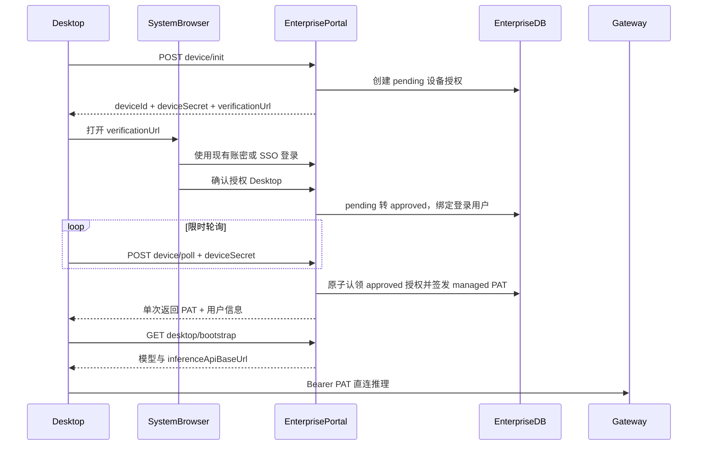

# Enterprise 用户账号统一计划

Planned-with: GPT-5.6 Sol
Suggested-Impl-Model: gpt-5.6-sol-medium（跨 Portal、数据库、Electron IPC 与鉴权协议，需强推理模型收口并发和安全边界）

## 目标与边界
- 最终 hc-0730 仅保留设置侧栏「用户账号」；删除独立「企业账号」Tab，以及 Topbar、Lite Chat、设置页中的 Near 官网账号/agxbuilder.com 登录入口和文案。
- 点击登录时，Desktop 只要求填写组织地址，随后系统浏览器打开该 Enterprise Portal 的授权页面；用户可用现有账密或 SSO 登录，完成后 Desktop 自动取得 managed PAT、执行 bootstrap 并直连 Gateway。
- 保留 `POST /api/desktop/auth/token` 仅供 smoke/自动化兼容，不再暴露给 Desktop UI；不改变 Gateway 推理、模型可见性、计量和配额语义。
- 不触碰 `agenticx/studio/server.py`，不重构无关账号、Provider 或 Portal 登录页面视觉。

## 分支落点
因设备授权协议涉及数据表、PAT 签发和安全边界，先在 `main` 的 pending plan 审核并实现 Portal 通用能力；合入 `hc-0730` 后，再在 `hc-0730` 完成 Desktop UI 定制。最终用户体验仍只出现在 `hc-0730`，但不把底层鉴权协议直接沉入交付分支。

## 目标链路

## 实施任务

### 1. Portal 设备授权持久化与服务层（main）
- 在 `enterprise/packages/db-schema/src/schema/desktop-device-auth.ts` 与 `src/mysql-schema/desktop-device-auth.ts` 定义等价表，并从双方 `index.ts` 导出；新增 PostgreSQL `drizzle/0030_desktop_device_auth.sql` 与 MySQL `drizzle-mysql/0002_desktop_device_auth.sql`。
- 字段固定为：`device_id`、`tenant_id`、`device_secret_hash`、`device_name`、`status`（pending/approved/issuing/consumed/cancelled/expired）、批准用户/部门、`issued_token_id`、过期/批准/消费时间、创建时间；不保存 PAT 明文。
- 在 `enterprise/packages/iam-core/src/desktop-device-auth-service.ts` 实现 `initDesktopDeviceAuth`、`approveDesktopDeviceAuth`、`claimApprovedDeviceAuth`、`completeDesktopDeviceAuth`、`releaseDeviceAuthClaim`、`cancelDesktopDeviceAuth`。`poll` 先用 secret hash 校验，再用条件更新 `approved -> issuing` 抢占唯一签发权；PAT 创建失败时释放 claim，成功后记录 token id 并转 consumed，避免双签发/双交付。
- PostgreSQL/MySQL repository 采用现有 `resolveDatabaseConfig()` 分派模式，所有状态更新必须带旧状态条件；过期项 lazy 标记 expired。
- 测试 `enterprise/packages/iam-core/src/__tests__/desktop-device-auth-service.test.ts`：错误 secret、过期、跨租户、并发 poll 仅一方 claim、cancel、失败释放 claim、consumed 不可重放。

### 2. Portal 设备授权 API 与浏览器确认页（main）
- 新增 `enterprise/apps/web-portal/src/app/api/desktop/auth/device/init/route.ts`：生成 256-bit secret，仅存 SHA-256；返回 `verificationUrl`、600 秒 TTL、2500ms poll interval；从请求 origin 构造同源 URL，不接受客户端提供回调地址。
- 新增 `.../device/approve/route.ts`：必须经 `getSessionFromCookies()`；只允许同租户、pending、未过期记录；只写批准身份，不返回 PAT。
- 新增 `.../device/poll/route.ts`：验证 device id + secret，状态为 approved 时唯一 claim 后复用 `createPat()`，scopes 固定为 `DESKTOP_MANAGED_PAT_SCOPES`，首次成功响应返回 token/user/expiresAt 并消费授权；pending 返回 200，expired/cancelled/consumed 返回 410，错误 secret 返回统一 401。
- 新增 `.../device/cancel/route.ts`：仅正确 secret 可取消 pending；Desktop 主动取消和超时调用。
- 新增 `enterprise/apps/web-portal/src/app/auth/desktop/page.tsx`：未登录跳 `/auth?returnTo=/auth/desktop?device=...`，登录后显示当前企业身份并由用户确认授权；成功页不渲染 token。
- 收紧 `enterprise/apps/web-portal/src/app/auth/page.tsx` 的 `returnTo` 校验，复用已有安全 helper，明确允许 `/auth/desktop`，拒绝协议相对 URL 与外部地址；SSO 回跳也保持该 returnTo。
- 在 `enterprise/apps/web-portal/src/lib/desktop-device-rate-limit.ts` 对 init 按 IP、poll 按 device+IP 限流；所有日志和审计禁止打印 secret/PAT。
- 路由测试分别放入各端点 `__tests__/route.test.ts`，覆盖无 session approve=401、租户不一致=403、pending、单次 completed、replay=410、rate-limit=429、PAT scopes 含 `workspace:chat` 和 `desktop:managed`。

### 3. 环境配置、迁移与协议验证（main）
- 在 `enterprise/.env.local.example` 增加 `DESKTOP_DEVICE_AUTH_TTL_SECONDS=600`、`DESKTOP_DEVICE_AUTH_POLL_INTERVAL_MS=2500`；本地 `.env.local` 同步但不提交。
- 更新 `enterprise/packages/db-schema/src/__tests__/schema-parity.test.ts` 与 `migration-inventory.test.ts`，确保 PG/MySQL 表结构与 migration inventory 对齐。
- 扩展 `enterprise/scripts/perf/desktop-enterprise-smoke.ts` 的非交互协议检查：init、错误 secret、cancel、旧账密 token/bootstrap 兼容；浏览器批准链作为手工 E2E，不在 CI 伪造用户 session。
- 验证：db-schema/iam-core/web-portal typecheck 与相关 Vitest；分别在 MySQL 和 PostgreSQL migration 测试中通过。

### 4. Electron 企业浏览器登录状态机（main 合入 hc-0730 后）
- 在 `desktop/electron/main.ts` 抽取现有 `enterprise-login` 后半段为 `finishEnterpriseLogin(baseUrl, tokenPayload)`：调用 bootstrap、`selectEnterpriseInferenceBase`、`applyEnterpriseProvider`、保存 config；账密兼容端点和新浏览器流共用这一函数。
- 新增统一 IPC：`user-account-login-start({ baseUrl })`、`user-account-login-cancel`、`user-account-logout`、`load-user-account`，以及 `user-account-changed/login-timeout` 事件；init 后用 `shell.openExternal(verificationUrl)`，按服务端 interval 用 `proxyAwareFetch` 轮询，最多服务端 TTL，完成后调用上述 finish 函数。
- verificationUrl 必须与规范化后的组织 origin 同源；生产地址仅允许 HTTPS，本地仅放行 `localhost/127.0.0.1` HTTP；切换组织或重复点击前先取消旧轮询。
- 在 `desktop/electron/preload.ts` 与 `desktop/src/global.d.ts` 同步类型；为状态机抽出可测 helper，并新增 `desktop/tests/enterprise-browser-login.test.ts` 覆盖 pending→completed、cancel、timeout、错误 origin、重复 start 与 token 不进入日志。

### 5. 合并为单一「用户账号」UI（hc-0730）
- 重写 `desktop/src/components/AccountTab.tsx`：数据源改为 enterprise/user account；未登录仅显示组织地址和「在浏览器中登录」，等待态对齐图2（spinner、取消等待）；已登录显示企业邮箱/显示名、组织地址、模型数、刷新模型和退出登录。
- 删除 `desktop/src/components/settings/enterprise/EnterpriseAccountPanel.tsx` 及其独立渲染；在 `desktop/src/components/SettingsPanel.tsx` 删除 `enterprise` Tab，只让 `account` 渲染统一面板，并复用 `reloadProvidersAfterEnterpriseChange()`。
- 在 `desktop/src/settings-tab.ts` 删除 `enterprise` id；旧的 `openSettings("enterprise")` 调用迁移到 `account`。
- 将 `desktop/src/store.ts` 的 `agxAccount` 迁移为语义中性的 `userAccount`，由 `load-user-account` hydration；`desktop/src/App.tsx` 订阅统一事件，登录成功后同步 account state 和 provider，超时只显示一次企业登录提示。
- 修改 `desktop/src/components/Topbar.tsx` 和 `desktop/src/components/ChatView.tsx`：未登录点击仅打开设置的 `account` Tab（由用户填写组织地址后启动浏览器），已登录读取企业账号状态；退出调用统一企业 logout。
- 全仓库删除 Desktop 账号链中的 `AGX_ACCOUNT_WEB_BASE_DEFAULT`、`getAgxAccountWebBase()`、`agx-account-*` IPC、`agx_account` config 读写、AGX-AUTH 错误码和 Near 官网账号/agxbuilder.com 登录文案。安装文档等非账号链接不在本需求范围。
- 对旧本地配置采用一次性忽略策略：不把历史 `agx_account` 视为已登录，不迁移官网 token；企业 `enterprise` 配置继续正常恢复。

### 6. 端到端验收与回归
- 静态验收：设置侧栏只有「用户账号」，无「企业账号」；Topbar、Lite Chat、设置账号链无“Near 官网账号”或 agxbuilder 登录入口。
- 浏览器验收：本地组织地址打开 `http://localhost:3000/auth/desktop?...`，生产组织地址打开对应 HTTPS Portal；账密和 SSO 均能回到授权页，Desktop 自动结束等待。
- 登录后断言：`~/.agenticx/config.yaml` 只有有效 `enterprise`/managed provider 状态；模型列表严格按管理员分配；推理请求 Desktop→Gateway，PAT 身份和 usage 可归集。
- 安全验收：复制 verification URL 到另一浏览器只能批准、不能领取 PAT；错误 secret、重复 poll、取消/过期均不能签发；PAT/secret 不出现在 URL、页面、日志和审计 detail。
- 生命周期验收：⌘Q 重启恢复登录；刷新模型成功；退出清理 enterprise provider 并恢复非托管 providers；组织停用/PAT 失效时提示重新登录。
- 运行 `desktop` typecheck/build、enterprise 相关单测、`enterprise/scripts/perf/desktop-enterprise-smoke.ts`，最后完全重启 Electron 验证 main-process IPC 生效。

## 完成标准
- hc-0730 用户只感知一个「用户账号」，任何登录入口均不再访问 agxbuilder.com。
- Enterprise Portal 是唯一身份控制面，Gateway 仍是唯一推理数据面。
- PAT 只在 Desktop 持 secret 的首次成功 poll 中返回一次，无 URL/DOM/日志泄漏，无并发双签发。
- PG/MySQL、账密/SSO、Desktop 重启/退出、严格托管模型与计量链路均有可核验证据。