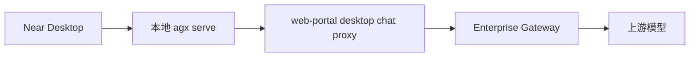
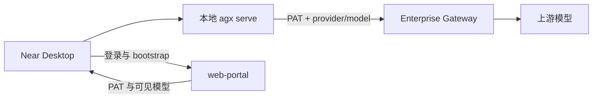

# Enterprise Desktop 推理直连 Gateway 与单轮响应优化

Planned-with: GPT-5.6 Sol

Suggested-Impl-Model: 见「子规划 → 推荐实施模型」表

> 实施前必须使用 `.cursor/skills/executing-plans/SKILL.md`，严格按任务顺序执行；涉及运行时行为修复时同时使用 `.cursor/skills/test-driven-development/SKILL.md` 与 `.cursor/skills/verification-before-completion/SKILL.md`。

---

## 1. 目标

在不削弱企业身份、模型可见性、配额、策略与审计边界的前提下，将 Enterprise Desktop 的推理数据面由：



调整为：



同时修复简单请求出现「第一轮只有 reasoning、运行时再发起第二轮完整模型请求」的延迟放大问题，使：

1. Portal 保留控制面职责：账密认证、PAT 签发、用户资料与可见模型 bootstrap；
2. Gateway 成为推理数据面的唯一安全入口：自行从 PAT 解析身份并校验模型权限；
3. Desktop 登录后将托管 provider 的 `base_url` 指向 Gateway 公网 `/v1`，不再经 Portal 转发推理；
4. 模型收到明确的可见回复协议，降低 reasoning-only 空正文发生率；
5. reasoning-only 仍发生时，安全场景的第二轮不再重复发送无关工具 schema；
6. 通过会话级性能元数据区分网络跳数、模型轮次、首 token 与最终完成耗时。

---

## 2. 强制前置条件

### P-0：在交付分支 `hc-0730` 上实施（不经 `main`）

本 plan 与企业账号绑定、Portal bootstrap、Desktop 托管 provider 同一交付面，**在 `hc-0730` 上直接实施**，不要求先合入 `main`。相关前置能力以当前 `hc-0730` HEAD 为准（对应既有 plan）：

```text
.cursor/plans/pending/2026-07-25-desktop-enterprise-account-binding.plan.md
```

实施前切换到 `hc-0730`，并验证以下锚点均存在：

- `desktop/electron/main.ts`
  - `type EnterpriseConfig`
  - `applyEnterpriseProvider(...)`
  - IPC `enterprise-login` / `enterprise-refresh` / `enterprise-logout`
- `enterprise/apps/web-portal/src/app/api/desktop/auth/token/route.ts`
- `enterprise/apps/web-portal/src/app/api/desktop/bootstrap/route.ts`
- `enterprise/apps/web-portal/src/app/api/desktop/v1/chat/completions/route.ts`
- `enterprise/apps/web-portal/src/lib/gateway-forward.ts`
- `enterprise/apps/gateway/internal/openai/tool_calls_roundtrip_test.go`

若任一锚点不存在：停止本 plan，不在本 plan 中复制实现；先在 `hc-0730` 补齐前置能力。

### P-1：保留 Portal 代理兼容路径

`/api/desktop/v1/chat/completions` 本轮不删除。它作为旧 Desktop / 灰度回滚路径保留，但新版 bootstrap 应下发 Gateway 直连地址，新版 Desktop 优先直连。

---

## 3. 根因与证据链

### 3.1 当前推理多了一层 Portal 转发

`desktop/electron/main.ts` 的 `applyEnterpriseProvider(...)` 当前执行：

```ts
const apiBase = `${opts.baseUrl}/api/desktop/v1`;
cfg.providers.enterprise = {
  interface: "openai",
  base_url: apiBase,
  api_key: opts.token,
  models,
  managed: true,
};
```

因此本地 `agx serve` 通过 `LiteLLMProvider` 调用 Portal：

```text
POST {portalOrigin}/api/desktop/v1/chat/completions
```

Portal 路由 `enterprise/apps/web-portal/src/app/api/desktop/v1/chat/completions/route.ts:42-113` 依次执行：

1. `resolveDesktopIdentity(request)` 再验一次 PAT；
2. `prepareGatewayForward(...)` 查数据库、校验可见模型、拆 `provider/model`；
3. `fetch(GATEWAY_COMPLETIONS_URL)` 转发完整请求和流；
4. 把 Gateway SSE 再透传给 Desktop。

这层不是 12 秒延迟的主因，但它增加一次身份查询、模型授权查询、HTTP/SSE 转发与故障面。

### 3.2 Gateway 已能验证 PAT，但尚不能独立执行托管模型授权

`enterprise/apps/gateway/internal/server/server.go:663-702`：

- `handleChatCompletions` 首先调用 `identityFromRequest`；
- 然后解析 `ChatCompletionRequest`；
- 当前直接把 `req.Model` 与请求 Header 交给 `s.decider.Decide(...)`。

`enterprise/apps/gateway/internal/server/server.go:1429-1450`：

- `agx-pat-*` 已由 `PATVerifier.Verify(...)` 从数据库解析；
- `TenantID` / `UserID` / `DepartmentID` / scopes 均来自 token 记录；
- **不需要且不得相信客户端传来的** `x-tenant-id` / `x-user-id` / `x-dept-id`。

缺口：

1. Gateway 没有读取 `enterprise_runtime_user_visible_models`；
2. Gateway 不知道部门祖先链的级联收窄语义；
3. `x-agenticx-provider` 当前由请求直接提供，未区分「客户端声明」与「服务端授权后的 provider」；
4. Gateway 当前期望 body 中是裸模型名，不能安全地直接消费 `provider/model`。

### 3.3 Portal 的可见模型算法不能简单绕过

`enterprise/apps/web-portal/src/lib/admin-providers-reader.ts:161-205` 定义最终可见集：

```text
启用 provider × 启用 model
  ∩ 根部门到直属部门逐级配置
  ∩ 用户 ID / email assignment 配置
```

纯函数语义位于 `enterprise/apps/web-portal/src/lib/effective-models.ts`：

- `computeEffectiveDeptAllowed(...)`
- `mergeUserStoredSet(...)`
- `computeEffectiveUserAllowed(...)`
- `collectUserAssignmentKeys(...)`

Gateway 直连前必须在 Go 数据面实现相同的 **fail-closed** 授权，不能只依赖 Desktop bootstrap 得到的旧列表；管理员撤销模型后，即使 Desktop 未刷新也必须在有限 TTL 内失效。

### 3.4 当前 PAT 身份缺少 email

`enterprise/apps/gateway/internal/auth/pat.go:105-153` 查询 `api_tokens` 时只读取：

```text
id / tenant_id / user_id / dept_id / status / scopes / expire_at
```

虽然 `PATIdentity` 已声明 `UserEmail`，但 `Verify(...)` 未赋值；该路径也没有像 Portal `resolveDesktopIdentity(...)` 一样拒绝 disabled user。Gateway 若要保持 `email:<normalized>` assignment 兼容并阻止已禁用员工继续直连，需要在 PAT 查询中通过 `(tenant_id, user_id)` 连接 `users` 获取 email 与 user status。

### 3.5 12.5 秒案例的主因是两轮完整模型调用

证据会话：`039ce24d-bddf-4b06-8c2d-f84a5801acb2`。

`messages.json`：

- user timestamp：`1785077626957`
- assistant timestamp：`1785077639434`
- 端到端约 `12477 ms`

`agent_messages.json`：

1. 第一轮 assistant `content = " "`，只有 `reasoning_content`；
2. runtime 注入 `[runtime-reasoning-only]`；
3. 第二轮才生成可见回复。

`context_stats.jsonl`：

- 记录两轮；
- 每轮 `prompt_tokens_approx ≈ 22k`；
- 每轮工具候选 184 个；
- tool search 后仍发送约 `5777` 个 schema tokens。

`agenticx/runtime/agent_runtime.py:4064-4089` 当前策略是 reasoning-only 后把完整上下文与工具再次发送。故直连 Gateway 只能减少小部分网络开销；真正的大头是第二轮大上下文推理。

### 3.6 Gateway 会丢弃 MiniMax 的 `reasoning_split`

`agenticx/llms/litellm_provider.py:359-365` 对 MiniMax 模型设置：

```python
extra["reasoning_split"] = True
```

但 `enterprise/apps/gateway/internal/openai/types.go:41-57` 的 `ChatCompletionRequest` 没有 `reasoning_split` 字段。Gateway 反序列化后再 marshal 上游请求时会丢掉该参数。该协议缺口必须补齐并用 request round-trip 测试锁定。

---

## 4. 方案选择

### 方案 A：继续由 Portal 转发，只加缓存

优点：改动最小。  
缺点：数据面继续依赖 Next.js；Gateway 仍缺真正的模型授权；无法形成清晰的控制面/数据面边界。  
结论：不采用。

### 方案 B：Desktop 直连 Gateway，信任 bootstrap 或客户端 Header

优点：最快落地。  
缺点：用户可篡改 body / Header 调用未分配模型；管理员撤销模型后旧 Desktop 仍可调用。  
结论：安全上不可接受，禁止采用。

### 方案 C（采用）：控制面走 Portal，数据面直连并由 Gateway 强制授权

关键决策：

1. Desktop 登录 token 增加 scope：`desktop:managed`；
2. Gateway 仅对具备该 scope 的 PAT 启用严格托管模型授权；
3. 新 Desktop body 保留完整 `provider/model`；
4. Gateway 从经授权的 composite ID 推导 provider 与裸 model；
5. Gateway 以 PAT 身份查询模型可见集，客户端身份 Header 不参与授权；
6. Portal bootstrap 下发公网 Gateway `/v1`；
7. 旧 Portal proxy 保留；缺少直连地址时 Desktop 自动使用旧 `apiBaseUrl`；
8. 先用协议约束预防 reasoning-only，再对安全的 retry 移除工具 schema；不把 chain-of-thought 当可见回复。

---

## 5. API 与配置契约

### 5.1 Desktop bootstrap 响应

修改：

```text
enterprise/apps/web-portal/src/app/api/desktop/bootstrap/route.ts
```

响应新增：

```ts
data: {
  // 既有字段
  user: { ... },
  models: PortalModelOption[],
  policy: { strict: true },
  apiBaseUrl: "https://portal.example.invalid/api/desktop/v1",

  // 新增：必须是 Gateway 的公网 OpenAI-compatible /v1 根地址
  inferenceApiBaseUrl: "https://gateway.example.invalid/v1",
  inferenceTransport: "gateway-direct-v1",
  reauthRequiredForDirect: false,
}
```

地址来源：

```text
NEXT_PUBLIC_GATEWAY_PUBLIC_BASE_URL
```

规则：

- 去掉尾随 `/`，再补 `/v1`；
- development/test 未配置时允许回落 `http://127.0.0.1:8088/v1`；
- production 未配置时 bootstrap 返回 `503` 和中性错误码 `50302`，禁止把 Portal 机器内部的 `GATEWAY_COMPLETIONS_URL` 或 `127.0.0.1` 下发给远端员工；
- production 的公网地址必须是 `https://`，除非 host 是 loopback。

### 5.2 Desktop 本地配置

`~/.agenticx/config.yaml`：

```yaml
enterprise:
  enabled: true
  base_url: "https://portal.example.invalid"       # 控制面
  inference_base_url: "https://gateway.example.invalid/v1" # 数据面
  transport: "gateway-direct-v1"
  token: "agx-pat-..." # 仍只写本地，不进日志
  models:
    - "provider-a/model-a"

providers:
  enterprise:
    interface: openai
    base_url: "https://gateway.example.invalid/v1"
    api_key: "agx-pat-..."
    models:
      - "provider-a/model-a"
    managed: true
```

兼容规则：

```ts
const effectiveInferenceBase =
  bootstrap.inferenceApiBaseUrl?.trim()
  || bootstrap.apiBaseUrl?.trim(); // 旧服务端兼容
```

不得自动从 `GATEWAY_COMPLETIONS_URL` 推导公网地址。

### 5.3 Gateway managed PAT

设备 token 由：

```ts
createPat({
  ...,
  scopes: ["workspace:chat", "desktop:managed"],
})
```

签发。

Gateway 行为：

| token 类型 | 行为 |
|---|---|
| PAT 含 `desktop:managed` | 强制模型可见性校验；失败 403；授权数据不可用 503 |
| 其它 PAT | 保持既有 API token 行为 |
| Web JWT | 保持既有行为，本 plan 不扩大语义 |

### 5.4 模型 ID

新版 Desktop 请求：

```json
{
  "model": "provider-a/model-a",
  "messages": [{ "role": "user", "content": "hello" }],
  "stream": true,
  "reasoning_split": true
}
```

Gateway 内部解析后：

```go
requestedModelID := "provider-a/model-a" // 授权键
explicitProvider := "provider-a"        // 服务端解析后的可信 provider
req.Model = "model-a"                   // 上游裸模型名
```

旧 Portal proxy 兼容：

- body 为裸模型；
- `x-agenticx-provider` 有值；
- Gateway 组合为 `provider/model` 后执行同一授权；
- Header 仅作为候选输入，必须经过可见性校验，不能直接成为可信路由结果。

---

## 6. 子规划 → 推荐实施模型

| 子规划 | Suggested-Impl-Model | 理由 |
|---|---|---|
| P0 前置核对与测试基线 | `gpt-5.6-sol-medium` | 在 `hc-0730` 上核对锚点，防止重复实现已有绑定能力 |
| P1 Gateway PAT 身份与模型授权 | `gpt-5.6-sol-medium` | 多租户、授权、缓存与 fail-closed，安全风险高 |
| P2 Gateway composite routing / 协议透传 | `gpt-5.6-sol-medium` | 涉及路由、审计、配额与上游协议 |
| P3 Portal bootstrap + Desktop 接线 | `kimi-k2.7-code` | TypeScript 契约与配置接线明确，性价比高 |
| P4 runtime reasoning-only 优化 | `gpt-5.6-sol-medium` | 易造成空回复、工具链中断或重复输出回归 |
| P5 E2E 与性能验收 | `kimi-k2.7-code` | 测试脚本与证据整理为主 |

---

## 7. 实施任务

## Task 0：前置合流与红线测试

Suggested-Impl-Model: `gpt-5.6-sol-medium`

**Files**

- Verify: `.cursor/plans/pending/2026-07-25-desktop-enterprise-account-binding.plan.md`
- Verify: `desktop/electron/main.ts`
- Verify: `enterprise/apps/web-portal/src/app/api/desktop/**`
- Verify: `enterprise/apps/gateway/internal/openai/tool_calls_roundtrip_test.go`

**Steps**

1. 确认当前分支为 `hc-0730`（或基于 `hc-0730` 的实现子分支），不要切到 `main` 单独开线。
2. 确认第 2 节所有前置锚点已存在（以 `hc-0730` HEAD 为准）。
3. 运行前置测试：

```bash
pnpm -C enterprise --filter @agenticx/web-portal test -- gateway-forward
cd enterprise/apps/gateway && go test ./internal/openai ./internal/server
cd desktop && npx tsc -p electron/tsconfig.json --noEmit
```

4. 记录基线，不改代码：
   - 简单问候的 `messages.json` 时间戳差；
   - `context_stats.jsonl` 的 model round 数量；
   - `prompt_tokens_approx`；
   - `tool_search_schema_tokens_sent`；
   - Gateway `/metrics` 的 TTFT（若已启用）。
5. 若前置锚点缺失或基线测试失败，停止并回报，不在本 plan 内顺手修其它问题。

**AC-0**

- 前置企业账号绑定锚点已在 `hc-0730`；
- 基线命令全绿；
- 基线报告不含 token、密码、客户域名或用户邮箱。

**Commit**

无代码则不提交；若只移动本 plan 到 `.cursor/plans/`，与 Task 1 首个提交一起完成。

---

## Task 1：签发 managed PAT，并补全可信身份

Suggested-Impl-Model: `gpt-5.6-sol-medium`

**Files**

- Modify: `enterprise/apps/web-portal/src/app/api/desktop/auth/token/route.ts`
- Modify: `enterprise/apps/web-portal/src/lib/desktop-auth.ts`
- Modify: `enterprise/apps/gateway/internal/auth/pat.go`
- Modify: `enterprise/apps/gateway/internal/auth/auth_rbac_test.go`
- Add: `enterprise/apps/gateway/internal/auth/pat_identity_test.go`

**Test first**

1. Portal token route测试断言 `createPat` 收到：

```ts
scopes: ["workspace:chat", "desktop:managed"]
```

2. PAT verifier 测试断言：
   - 数据库返回用户 email 后，`PATIdentity.UserEmail` 有值；
   - tenant/user/dept 仍来自 `api_tokens`；
   - 缓存命中保留 email 与 scopes；
   - revoked / expired 行为不变。

3. `DesktopIdentity` 增加 `scopes: string[]`，值只来自 `verifyPat(...)`；bootstrap 用它判断当前 token 是否具备 direct 资格。

**Implementation**

`PATVerifier.Verify(...)` 查询改为等价语义：

```sql
SELECT
  t.id,
  t.tenant_id,
  t.user_id,
  COALESCE(t.dept_id, ''),
  t.status,
  t.scopes,
  t.expire_at,
  COALESCE(u.email, ''),
  COALESCE(u.status, '')
FROM api_tokens t
LEFT JOIN users u
  ON u.id = t.user_id
 AND u.tenant_id = t.tenant_id
 AND u.is_deleted = FALSE
 AND u.deleted_at IS NULL
WHERE t.token_hash = ?
LIMIT 1
```

要求：

- 继续走 `database.Handle.QueryRowContext`，由 `Rebind` 兼容 PostgreSQL/MySQL；
- 不读取客户端 `x-user-email` 补身份；
- user 不存在或 `status != "active"` 时拒绝 PAT，错误使用稳定内部码，不把数据库细节返回给客户端；
- email 只进入内存身份与审计，不写日志明文；
- `identityFromRequest(...)` 的 PAT 分支设置 `UserEmail: pat.UserEmail`。

**AC-1**

- Desktop PAT scopes 同时包含 `workspace:chat` 与 `desktop:managed`；
- PAT 解析可得到数据库中的用户 email；
- 客户端伪造 `x-user-email` 不改变 identity。
- 旧 token 的 scopes 不被伪造或自动扩权。
- 用户被禁用后，PAT 最迟在既有 PAT cache TTL 到期后返回 401。

**Commit subject**

```text
feat(gateway): bind managed desktop tokens to trusted identity
```

---

## Task 2：Gateway 模型可见性授权器

Suggested-Impl-Model: `gpt-5.6-sol-medium`

**Files**

- Add: `enterprise/apps/gateway/internal/auth/model_access.go`
- Add: `enterprise/apps/gateway/internal/auth/model_access_test.go`
- Modify: `enterprise/apps/gateway/internal/server/server.go`（`Server` 字段与 `New(...)` 注入）
- Modify: `enterprise/docs/configuration/env-vars.md`
- Modify: `enterprise/.env.local.example`

**设计接口**

```go
type ManagedModelIdentity struct {
    TenantID string
    UserID   string
    UserEmail string
    DeptID   string
}

type ManagedModelAuthorizer interface {
    IsAllowed(
        ctx context.Context,
        identity ManagedModelIdentity,
        modelID string,
    ) (bool, error)
}
```

实现拆分：

```go
type modelAccessReader interface {
    EnabledModelIDs(ctx context.Context, tenantID string) ([]string, error)
    DepartmentAncestors(ctx context.Context, tenantID, deptID string) ([]string, error)
    AssignmentsForKeys(
        ctx context.Context,
        tenantID string,
        assignmentKeys []string,
    ) (map[string][]string, error)
}
```

纯函数：

```go
func computeEffectiveModelIDs(
    allEnabled []string,
    assignments map[string][]string,
    deptAncestorsLeafFirst []string,
    userID string,
    userEmail string,
) map[string]struct{}
```

必须与 TS 语义一致：

1. `allEnabled` 只包含 provider enabled 且 model enabled 的 `provider/model`；
2. 部门祖先链输入 leaf→root，计算时 reverse 成 root→leaf；
3. 每个有配置的部门与上一层取交集；
4. 用户 keys 为 `userID` 与 `email:<lowercase>`；
5. 多个用户 key 的配置先取并集，再与部门结果取交集；
6. 没有用户配置则继承部门结果；
7. tenant 必须来自 PAT，不得使用 `DEFAULT_TENANT_ID`。

查询顺序：

1. 读取 tenant 下启用 provider/model；
2. 读取直属部门到根的祖先链；
3. 构造本次请求唯一需要的 keys：

```text
dept:<ancestor-id>...
<user-id>
email:<normalized-email>
```

4. `AssignmentsForKeys` 只查询这些 keys，禁止像 Portal 当前实现一样把整个 tenant 的 assignment 表全部加载到内存；
5. PostgreSQL/MySQL 动态 `IN` placeholder 必须经 `database.Rebind`，空 keys 时不执行非法 `IN ()`。

**缓存**

新增：

```text
GATEWAY_MANAGED_MODEL_CACHE_TTL=15s
```

缓存 key：

```text
tenantID + userID + normalizedEmail + deptID
```

规则：

- 默认 TTL 15 秒；
- 仅缓存完整 effective set，不缓存单次 allow/deny；
- cache miss 且 DB 失败：返回 error，服务端 503（fail closed）；
- cache hit 在 TTL 内可用；TTL 到期后 DB 仍失败则 503；
- 禁止 DB 失败时默认允许；
- 缓存不存 token。

**Test first**

至少覆盖：

1. 全部未配置 → 继承所有 enabled model；
2. 根部门/子部门逐级交集；
3. 用户 ID 配置收窄；
4. email 配置兼容；
5. 用户 ID + email 配置取并集后再收窄；
6. disabled provider/model 永不允许；
7. tenant A 的配置不能授权 tenant B；
8. DB error fail closed；
9. cache TTL 内命中；过期后重新查询；
10. composite ID 精确匹配，大小写与 admin 写入值一致。

测试使用 fake `modelAccessReader`，不新增 sqlmock 依赖。SQL reader 的 PostgreSQL/MySQL placeholder 继续通过现有 `database.Rebind` 测试保障。

**AC-2**

- Gateway 能独立判断 PAT 用户是否可使用某 `provider/model`；
- 管理员撤销后最迟 TTL 到期生效；
- 数据库不可用时不得绕过授权。

**Commit subject**

```text
feat(gateway): enforce managed model visibility
```

---

## Task 3：Gateway composite model 与可信路由

Suggested-Impl-Model: `gpt-5.6-sol-medium`

**Files**

- Modify: `enterprise/apps/gateway/internal/server/server.go`
  - `handleChatCompletions(...)`
  - `Server` 依赖
- Modify: `enterprise/apps/gateway/internal/routing/decision.go`
- Modify: `enterprise/apps/gateway/internal/runtimeconfig/runtimeconfig.go`（仅当需要公开可信 provider 参数入口）
- Modify: `enterprise/apps/gateway/internal/openai/types.go`
- Modify: `enterprise/apps/gateway/internal/openai/errors.go`
- Add: `enterprise/apps/gateway/internal/openai/errors_test.go`
- Modify: `enterprise/apps/gateway/internal/openai/tool_calls_roundtrip_test.go`
- Add: `enterprise/apps/gateway/internal/server/managed_model_routing_test.go`

**Before**

```go
decision := s.decider.Decide(r, req.Model)
```

该调用直接读取请求 Header 中的 provider hint。

**After intent**

```go
requestedModelID := strings.TrimSpace(req.Model)
trustedProvider := ""

if gatewayauth.HasScope(identity.Scopes, "desktop:managed") {
    providerID, modelName, err := resolveManagedModelCandidate(
        requestedModelID,
        r.Header.Get(routing.HeaderProvider), // 仅兼容候选
    )
    if err != nil {
        writeAPIError(w, openai.BadRequest("managed model must be provider/model"))
        return
    }
    allowed, err := s.managedModels.IsAllowed(
        r.Context(),
        managedIdentityFromRequest(identity),
        providerID+"/"+modelName,
    )
    if err != nil {
        writeAPIError(w, openai.Unavailable("managed model authorization unavailable"))
        return
    }
    if !allowed {
        writeAPIError(w, openai.Forbidden("model is not assigned to this account"))
        return
    }
    trustedProvider = providerID
    req.Model = modelName
}

decision := s.decider.DecideForProvider(req.Model, trustedProvider)
```

在 `openai/errors.go` 新增明确的 503 helper，禁止用 500 掩盖授权数据源不可用：

```go
func Unavailable(message string) APIError {
    return APIError{
        Code:       "50302",
        Message:    message,
        HTTPStatus: http.StatusServiceUnavailable,
    }
}
```

**候选解析规则**

- body model 含 `/`：以第一个 `/` 左侧为 provider，右侧全部保留为 model；
- body model 不含 `/` 且兼容 Header 有 provider：组合为 `headerProvider/bodyModel` 后授权；
- 两者都给出且冲突：400；
- provider/model 任一为空：400；
- 只有授权通过后，provider 才进入 `DecideForProvider`；
- managed PAT 不允许回落到 YAML 模糊模型匹配；
- 非 managed token 继续走原 `Decide(r, model)`，避免扩大变更面。

**路由器**

新增：

```go
func (d *Decider) DecideForProvider(model, explicitProvider string) Decision
```

既有：

```go
func (d *Decider) Decide(r *http.Request, model string) Decision
```

只负责读取兼容 Header 后委托 `DecideForProvider`。managed path 不再信任原始 Header。

**协议字段**

`ChatCompletionRequest` 增加：

```go
ReasoningSplit *bool `json:"reasoning_split,omitempty"`
```

使用 pointer 是为了区分「未提供」与显式 `false`。请求 marshal 上游时必须保留。

**审计/配额语义**

- 授权键使用 composite `requestedModelID`；
- 上游、路由、现有 quota/metering 的 `req.Model` 继续使用裸模型名，避免破坏现有报表；
- audit 继续写 `Provider` + `Model` 两字段；
- 新增结构化日志可记录 provider/model，但禁止 token 与用户邮箱；
- `ClientType` 对 managed PAT 设为 `desktop`，不要继续标成 `web-portal`。

**Test first**

1. direct composite model 授权后路由至正确 provider；
2. 未分配模型返回 403，provider 不被调用；
3. DB 授权错误返回 503；
4. 伪造 `x-agenticx-provider` 不能越权；
5. body 与 Header 冲突返回 400；
6. 旧 Portal bare model + Header 在授权后仍可调用；
7. 非 managed PAT 既有测试不变；
8. `reasoning_split: true` round-trip 后仍为 true；
9. tools / tool_calls / role=tool 测试继续通过；
10. stream reasoning_content 与 content 顺序不回归。

**AC-3**

- 新 Desktop 可直接 POST Gateway `/v1/chat/completions`；
- Gateway 不依赖 Portal 的 `prepareGatewayForward` 才能安全路由；
- 任意客户端 Header 伪造都不能扩大模型权限。

**Commit subject**

```text
feat(gateway): route authorized composite model identifiers
```

---

## Task 4：Portal bootstrap 下发公网 Gateway 地址

Suggested-Impl-Model: `kimi-k2.7-code`

**Files**

- Modify: `enterprise/apps/web-portal/src/app/api/desktop/bootstrap/route.ts`
- Add: `enterprise/apps/web-portal/src/lib/desktop-inference-base.ts`
- Add: `enterprise/apps/web-portal/src/lib/desktop-inference-base.test.ts`
- Modify: `enterprise/.env.local.example`
- Modify: `enterprise/docs/configuration/env-vars.md`
- Modify: `enterprise/docs/api/web-portal.md`
- Modify: `enterprise/docs/deployment/vercel-env-checklist.md`
- Verify: `enterprise/deploy/nginx/gateway.conf`（`location /v1/` 的 SSE/timeout 配置）
- Verify: `enterprise/deploy/docker-compose/prod.yml`（公网 Gateway origin 注入 Portal）

**Pure helper**

```ts
export function resolveDesktopInferenceApiBase(input: {
  configured?: string;
  nodeEnv?: string;
}): { ok: true; url: string } | { ok: false; error: string }
```

规则按第 5.1 节执行。

bootstrap 只返回地址与模型元数据，不返回 Gateway provider API key；Desktop 继续只持有自己的 PAT。

**旧 PAT 迁移**

既有登录状态中的 PAT 只有 `workspace:chat`，不能直接切到 Gateway，否则 Gateway 不会进入 managed 授权分支。bootstrap 必须按可信 scopes 决定：

```ts
const directEligible = identity.scopes.includes("desktop:managed");
```

- `directEligible=true`：返回 `inferenceApiBaseUrl`、`inferenceTransport="gateway-direct-v1"`、`reauthRequiredForDirect=false`；
- `directEligible=false`：不返回 direct URL，继续返回旧 `apiBaseUrl`，并返回 `reauthRequiredForDirect=true`；
- 禁止为旧 token 在数据库中静默追加 scope；
- 用户退出并重新用账密登录后才获得新 managed PAT。

**Test first**

1. `https://gateway.example.invalid/` → `https://gateway.example.invalid/v1`；
2. 已带 `/v1` 不重复追加；
3. production 缺配置 → error；
4. production `http://` 非 loopback → error；
5. development 缺配置 → loopback fallback；
6. bootstrap 保留 `apiBaseUrl` 并新增 `inferenceApiBaseUrl` / `inferenceTransport`。
7. 旧 PAT 只获得 proxy transport，且 `reauthRequiredForDirect=true`。

**部署检查**

- `enterprise/deploy/nginx/gateway.conf` 已有 `/v1/` 反代、HTTP/1.1 与 600s read timeout；不得把 `/internal/*` 暴露给 Desktop；
- TLS 可在该 Nginx 或其上游负载均衡终止，但 `inferenceApiBaseUrl` 必须是员工设备可解析、可访问的公网/企业网域名；
- `prod.yml` 中 Portal 必须获得 `NEXT_PUBLIC_GATEWAY_PUBLIC_BASE_URL`，其值不能是 docker service name；
- 不修改 `/admin/`、`/internal/` 或 Portal 根路由。

**AC-4**

- 生产 bootstrap 不泄漏内部 `127.0.0.1` / docker service name；
- 配置错误时返回明确 503，不伪装登录成功；
- 旧 `apiBaseUrl` 保留。

**Commit subject**

```text
feat(portal): publish managed inference endpoint
```

---

## Task 5：Desktop 将托管 provider 指向 Gateway

Suggested-Impl-Model: `kimi-k2.7-code`

**Files**

- Add: `desktop/electron/enterprise-routing.ts`
- Add: `desktop/tests/enterprise-routing.test.ts`
- Modify: `tests/test_llm_provider_resolver.py`
- Modify: `desktop/electron/main.ts`
  - `EnterpriseConfig`
  - `applyEnterpriseProvider(...)`
  - `enterprise-login`
  - `enterprise-refresh`
- Modify: `desktop/src/global.d.ts`（如 IPC 返回类型暴露 transport）
- Modify: `desktop/electron/preload.ts`（仅类型需要时）
- Modify: `desktop/src/components/settings/enterprise/EnterpriseAccountPanel.tsx`（仅展示连接失败，不新增高级配置）

**Pure helper**

```ts
type EnterpriseBootstrapTransport = {
  apiBaseUrl?: string;
  inferenceApiBaseUrl?: string;
  inferenceTransport?: string;
  reauthRequiredForDirect?: boolean;
};

export function selectEnterpriseInferenceBase(
  bootstrap: EnterpriseBootstrapTransport,
): {
  baseUrl: string;
  transport: "gateway-direct-v1" | "portal-proxy-v1";
}
```

规则：

1. 有合法 `inferenceApiBaseUrl`：使用 Gateway direct；
2. 缺失时使用 `apiBaseUrl`：兼容旧 Portal；
3. 两者都为空：登录/刷新失败，不写半成品配置；
4. 不允许 Desktop 自行把 Portal host 改端口猜 Gateway；
5. 保存前统一去尾随 `/`；
6. token 不打印、不进入错误文本。

`applyEnterpriseProvider(...)` after intent：

```ts
cfg.enterprise = {
  enabled: true,
  base_url: portalOrigin,
  inference_base_url: inference.baseUrl,
  transport: inference.transport,
  token,
  user,
  policy: { strict },
  models,
  synced_at: new Date().toISOString(),
};

cfg.providers.enterprise = {
  display_name: "企业模型",
  interface: "openai",
  base_url: inference.baseUrl,
  api_key: token,
  models, // 继续保留 provider/model
  model: models[0] ?? "",
  enabled: true,
  managed: true,
  drop_params: true,
};
```

**实际出站模型 ID 门禁**

`ProviderResolver` 为自定义 OpenAI-compatible base URL 在 LiteLLM 内部给 model 增加 `openai/` transport prefix。实施者不得凭字符串推断该 prefix 是否会出现在 HTTP body；先在 `tests/test_llm_provider_resolver.py` 用本地 mock HTTP server 捕获真实请求并断言：

```text
Authorization: Bearer <PAT>
POST /v1/chat/completions
body.model == "provider-a/model-a"
```

- 预期 LiteLLM 只在内部使用 `openai/`，发往 Gateway 时 body 仍为 composite `provider/model`；
- 若捕获结果包含 `openai/provider-a/model-a`，先在 provider 层做仅针对 managed OpenAI-compatible route 的出站规范化并补测试；禁止让 Gateway 把任意 `openai/*` 都当作可信 provider；
- Python 侧不自行生成 `x-agenticx-provider`，provider 拆分与授权保持在 Gateway 一处。

**迁移**

- 已持有 `desktop:managed` scope 的配置在下次「刷新模型列表」时切换为 Gateway direct；
- 若 bootstrap 返回 `reauthRequiredForDirect=true`，旧配置继续走 Portal proxy，并在企业账号卡片就近显示「重新登录后启用直连通道」；不得假装已直连；
- 未刷新前仍走 Portal proxy，不破坏现有会话；
- 退出企业登录继续只删除 enterprise provider，不删除个人 provider；
- 不增加自动静默回落：直连失败应报错，避免同一请求重复打 Portal/Gateway；
- 管理员需要回滚时，可让 bootstrap 暂不下发 `inferenceApiBaseUrl`。

**Test first**

1. 新 bootstrap 优先 direct；
2. 旧 bootstrap fallback proxy；
3. 空地址拒绝；
4. `applyEnterpriseProvider` 后 control/data URL 分离；
5. refresh 更新 data URL；
6. logout 清理新字段；
7. 个人 provider 不被覆盖或删除；
8. 模型仍以 `provider/model` 进入请求。
9. 旧 PAT refresh 后仍走 proxy 并显示重新登录提示；重新登录后切为 direct。
10. mock HTTP 捕获证明出站 body 不携带 LiteLLM 内部 transport prefix。

**Verification**

```bash
cd desktop
npx vitest run tests/enterprise-routing.test.ts
npx tsc -p electron/tsconfig.json --noEmit
npm run build
```

改动 `desktop/electron/main.ts` 后必须完整退出并重启 `npm run dev`，仅刷新 renderer 无效。

**AC-5**

- `~/.agenticx/config.yaml` 中 enterprise provider 的 base URL 为 Gateway `/v1`；
- 聊天期间 Portal desktop chat proxy 无请求；
- 登录/bootstrap 仍走 Portal；
- 严格托管模型列表与退出恢复行为不变。

**Commit subject**

```text
feat(desktop): separate enterprise control and inference planes
```

---

## Task 6：预防 reasoning-only，并缩小安全重试

Suggested-Impl-Model: `gpt-5.6-sol-medium`

**Files**

- Modify: `agenticx/runtime/prompts/meta_agent.py`
  - `build_meta_agent_system_prompt(...)` 的「输出要求」
- Modify: `agenticx/runtime/agent_runtime.py`
  - turn-level retry state
  - 每轮 `active_tools` 计算
  - reasoning-only 分支
  - final metadata
- Modify: `agenticx/runtime/truncated_final.py`
- Modify: `tests/test_reasoning_only_turn_retry.py`
- Add: `tests/test_meta_visible_response_contract.py`

### 6.1 首轮可见响应协议

在 Meta-Agent「输出要求」增加明确协议，文案意图如下：

```text
- 每轮模型输出必须满足以下至少一项：产生用户可见正文，或产生合法 tool_call。
- reasoning / <think> 仅用于内部思考，不算用户可见回复。
- 即使用户只是问候，也必须在同一轮输出简短可见正文；禁止只结束在 reasoning。
```

要求：

- 不要求模型泄漏 reasoning；
- 不把 reasoning 文本复制到正文；
- 不改变工具调用规则；
- 仅在 Meta-Agent prompt 增加一次，不在每轮继续堆叠。

### 6.2 可复用的 action intent 判断

`agenticx/runtime/truncated_final.py` 抽出：

```python
def reasoning_has_action_intent(reasoning_text: str) -> bool:
    return bool(ACTION_INTENT_RE.search(str(reasoning_text or "")))
```

`detect_suspected_truncated_final(...)` 改为调用它，语义不变。

在 `agent_runtime.py` 增加纯 helper（放在现有 message/context helper 区域）：

```python
def _turn_has_external_context(session: StudioSession, user_input: Any) -> bool:
    if getattr(session, "context_files", None):
        return True
    if isinstance(user_input, dict):
        return bool(user_input.get("attachments") or user_input.get("context_files"))
    text = str(user_input or "")
    return "@file[" in text
```

该 helper 只用于决定 retry 是否可去掉 tools，不改变附件注入或 taskspace 语义；仅绑定工作区但本轮未引用文件时不应阻止轻量 retry。

### 6.3 reasoning-only retry 工具缩减

新增 turn state：

```python
reason_only_retry_without_tools = False
```

第一轮 reasoning-only 时：

```python
can_finalize_without_tools = (
    round_idx == 1
    and not executed_tool_names
    and not reasoning_has_action_intent(reasoning_for_tool_call)
    and not _turn_has_external_context(session, user_input)
)
reason_only_retry_without_tools = can_finalize_without_tools
```

下一轮 `_project_active_tools()` 后：

```python
if reason_only_retry_without_tools:
    active_tools = []
    allowed_tool_names = set()
```

并把 nudge 文案分成两种：

- `can_finalize_without_tools=true`：明确「直接输出可见最终回复，不要调用工具」；
- false：保留现有「最终回复或 tool_call」与完整工具集。

不得创建本地 canned reply；最终正文仍由模型生成。

### 6.4 性能元数据

每轮记录：

```python
round_timing = {
    "round": round_idx,
    "elapsed_ms": ...,
    "first_feedback_ms": ...,
    "first_visible_token_ms": ...,
    "reasoning_only": ...,
    "tool_schema_tokens_sent": ...,
}
```

最终 assistant metadata 增加：

```json
{
  "model_round_count": 1,
  "reasoning_only_retry_count": 0,
  "model_elapsed_ms": 0,
  "first_visible_token_ms": 0,
  "round_timings": []
}
```

约束：

- 不记录 prompt 正文、reasoning 正文、token 或 email；
- `round_timings` 最多 `max_tool_rounds` 项；
- timing 使用 `time.monotonic()`；
- 老消息没有字段时前端保持兼容；
- 本 plan 不新增 UI 面板，只用于诊断与验收。

**Test first**

在 `tests/test_reasoning_only_turn_retry.py` 增加/调整：

1. Meta prompt 明确要求 visible body；
2. 正常 reasoning + body：1 次 invoke；
3. reasoning-only、无 action intent：仍最多重试 1 次，但第二轮 `tools == []`；
4. reasoning-only 包含「搜索/核实/调用」意图：第二轮保留工具；
5. 带附件或 `context_files` 的 reasoning-only：第二轮保留工具；
6. 已执行工具后 reasoning-only：保持既有 tool-turn fallback；
7. 永久 reasoning-only：仍输出中性 fallback，不泄漏 `<think>`；
8. system trigger 不新增重试；
9. metadata 中 round count / retry count 正确；
10. timing 非负且无 prompt/reasoning 文本；
11. 普通工具调用与截断检测测试全绿。

**AC-6**

- 简单问候在真实模型 smoke 中优先一轮完成；
- 若仍触发 retry，第二轮 `tool_search_schema_tokens_sent == 0`；
- 不出现 reasoning 泄漏、空 FINAL、工具能力误删或无限重试。

**Commit subject**

```text
perf(runtime): reduce bodyless response retry overhead
```

---

## Task 7：端到端安全与性能验收

Suggested-Impl-Model: `kimi-k2.7-code`

**Files**

- Add: `enterprise/scripts/perf/desktop-enterprise-smoke.ts`
- Modify: `enterprise/docs/perf-baselines/README.md`
- Modify: `.cursor/plans/2026-07-27-enterprise-direct-gateway-latency.plan.md`（开始实施时已从 pending 移入根目录，补实测结果）

**脚本输入**

仅从环境变量读取：

```text
PORTAL_BASE_URL
GATEWAY_PUBLIC_BASE_URL
DESKTOP_TEST_EMAIL
DESKTOP_TEST_PASSWORD
```

脚本不得打印 password / PAT；PAT 日志只显示固定掩码。

**场景**

1. Portal 账密登录取得 managed PAT；
2. bootstrap 取得模型与 `inferenceApiBaseUrl`；
3. 直接调用 Gateway 流式 hello；
4. 带 tools + `tool_choice:auto`；
5. 回传 `role:tool` 历史；
6. 未分配模型 → 403；
7. 伪造 provider Header → 400/403；
8. revoked PAT → 401；
9. 连续 5 次简单问候，收集 TTFT/完成时间/model round；
10. 校验 usage_records / audit 中 tenant/user/dept 来自 PAT。

**性能 AC（不伪造绝对 SLA）**

鉴于仓库没有稳定上游性能基线，本 plan 不承诺固定 P95 数字。验收采用可归因指标：

- 新版聊天请求不命中 Portal chat proxy；
- Gateway direct 比 Portal proxy 少一次 HTTP/SSE 转发；
- 5 次简单问候中至少 4 次 `model_round_count == 1`；
- 若发生 reasoning-only retry，第二轮工具 schema tokens 为 0；
- 相同模型、相同 prompt、同一测试窗口下，direct path 的 Gateway TTFT 不劣于 proxy path；
- 任何性能不达标必须保留原始 timing 证据，禁止只凭 UI「思考 N 秒」判断。

**全量验证**

```bash
# Python runtime
pytest -q tests/test_reasoning_only_turn_retry.py tests/test_meta_visible_response_contract.py

# Gateway
cd enterprise/apps/gateway
go test ./internal/auth ./internal/openai ./internal/routing ./internal/server

# Portal
cd enterprise
pnpm --filter @agenticx/web-portal test
pnpm --filter @agenticx/web-portal typecheck
pnpm --filter @agenticx/web-portal build

# Desktop
cd desktop
npx vitest run tests/enterprise-routing.test.ts
npx tsc -p electron/tsconfig.json --noEmit
npm run build
```

**AC-7**

- 安全场景全部通过；
- direct 数据面证据可见；
- 真实会话 performance metadata 可解释总耗时；
- 计划内记录 baseline/after，但不写凭据、邮箱或企业域名。

**Commit subject**

```text
test(enterprise): verify direct managed inference path
```

---

## 8. 功能需求（FR）

- **FR-1**：Desktop 企业账密登录与 bootstrap 继续由 Portal 提供。
- **FR-2**：新版 Desktop 推理请求直接发送到 Gateway 公网 `/v1`。
- **FR-3**：Gateway 从 PAT 获取 tenant/user/dept/email，不信任客户端身份 Header。
- **FR-4**：managed PAT 每次推理均执行 Gateway 侧模型可见性授权。
- **FR-5**：Gateway 支持并安全拆解 `provider/model`。
- **FR-6**：旧 Portal proxy 在灰度期继续可用。
- **FR-7**：MiniMax `reasoning_split` 经 Gateway 转发不丢失。
- **FR-8**：Meta-Agent 首轮 prompt 明确要求可见正文或 tool call。
- **FR-9**：无 action intent 的 reasoning-only retry 不重复发送工具 schema。
- **FR-10**：会话持久化模型轮次与关键 latency 元数据。

## 9. 非功能需求（NFR）

- **NFR-1 安全**：授权失败/数据库异常 fail closed。
- **NFR-2 多租户**：所有模型查询以 PAT tenant 为边界，不使用默认 tenant。
- **NFR-3 一致性**：模型撤销最迟在 15 秒默认 TTL 后生效。
- **NFR-4 隐私**：日志、测试报告、plan 不记录 PAT、密码、企业域名或员工邮箱。
- **NFR-5 兼容**：旧 Desktop/旧 Portal proxy、非 managed PAT、Web JWT 行为不回归。
- **NFR-6 可观测**：能够区分 model round、首 feedback、首 visible token、完成时间。
- **NFR-7 可回滚**：停止下发 `inferenceApiBaseUrl` 即回到 Portal proxy，无需降级 Desktop。
- **NFR-8 no-scope-creep**：不重构通用 provider、quota、policy、audit 或 admin UI。

---

## 10. In scope / Out of scope

### In scope

- 企业 Desktop PAT 增加 managed scope；
- Gateway PAT email 补全；
- Gateway 模型可见性授权；
- Gateway composite model 安全路由；
- Portal bootstrap 下发 Gateway 公网地址；
- Desktop 控制面/数据面 URL 分离；
- `reasoning_split` 协议透传；
- Meta-Agent visible response contract；
- reasoning-only retry 工具 schema 缩减；
- 会话性能 metadata 与 E2E smoke。

### Out of scope

- 删除 Portal browser chat route；
- 删除 Portal desktop proxy；
- embeddings 改走 Gateway；
- 自动根据 Portal 域名猜 Gateway 域名/端口；
- Desktop 在一次模型请求失败后自动双发或静默 fallback；
- 改造个人 provider；
- 新增 admin-console 页面；
- 部门/用户 TPM/QPM/并发配额重构；
- 提示词整体瘦身或 Skills/MCP 全面裁剪；
- 本地 canned greeting；
- 把 reasoning/chain-of-thought 直接显示给用户；
- 修改 `agenticx/studio/server.py`。

---

## 11. Rollout 与回滚

### Rollout

1. 先部署 Gateway：支持 managed scope、授权和 composite model；此时旧 Portal proxy 仍工作。
2. 再部署 Portal：签发 managed PAT，并在 bootstrap 下发 direct URL。
3. 最后发布 Desktop：识别 direct URL。
4. 先小范围观察：
   - 401/403/503；
   - model authorization cache；
   - TTFT；
   - model round count；
   - usage/audit 主体。
5. 稳定后扩大范围。

### Rollback

优先配置回滚：

1. Portal bootstrap 暂停返回 `inferenceApiBaseUrl`；
2. Desktop refresh 后回到 `apiBaseUrl` Portal proxy；
3. Gateway 保留新授权，不需要回滚安全能力；
4. runtime visible-response prompt 可独立回滚；
5. 禁止通过放宽 Gateway 授权来“快速恢复”。

---

## 12. 完成定义

只有同时满足以下条件才可宣布完成：

- [ ] 前置企业账号绑定锚点已在 `hc-0730`；
- [ ] managed PAT 由 Gateway 可信解析；
- [ ] Gateway 独立执行模型可见性授权；
- [ ] Desktop 推理不经过 Portal proxy；
- [ ] 旧 proxy 路径仍通过兼容测试；
- [ ] 客户端 Header 伪造不能越权；
- [ ] reasoning_split 不再被 Gateway 丢弃；
- [ ] 简单问候真实 smoke 主要为单轮；
- [ ] reasoning-only retry 安全场景不发送工具 schema；
- [ ] Python / Go / Portal / Desktop 测试与构建全绿；
- [ ] 实测记录不含任何凭据或可识别企业信息；
- [ ] plan 已从 `.cursor/plans/pending/` 移至 `.cursor/plans/`，所有实现 commit 带正确 `Plan-Id` / `Plan-File` / `Plan-Model` / `Impl-Model` / `Made-with: Damon Li`。

