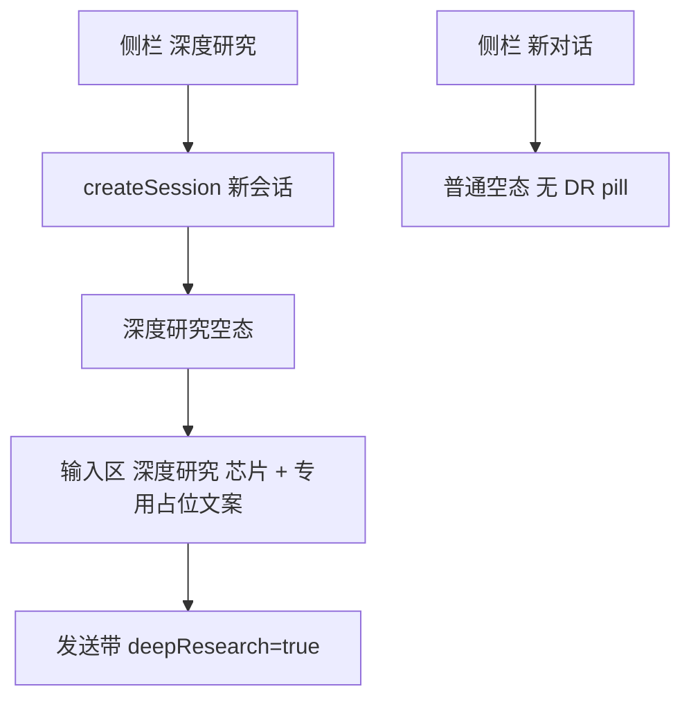

# Enterprise 前台深度研究入口交互（侧栏新会话 + 空态模式）

Planned-with: grok-4.5  
Suggested-Impl-Model: composer-2.5-fast  
Depends-On: `2026-07-27-enterprise-portal-deep-research`（流水线与租户开关已合入）

落盘路径（实施前）：`.cursor/plans/pending/2026-07-27-enterprise-portal-deep-research-entry-ux.plan.md`；开始写代码前移到 `.cursor/plans/` 根目录。

> **勘误 / 产品定稿（后于本 plan 初稿）：**  
> 普通空态下方的「深度研究」pill **按产品要求隐藏**，深度研究**只保留侧栏入口**（见 `341ae17f` NEAR 空态相关决策）。下文流程图与 FR-2 中「空态 pill」段落视为**已废止**；已实现的侧栏进模式、深度研究空态芯片 / placeholder **保留**，勿再恢复 pill。

---

## 1. 目标交互（已定）



用户选择：**深度研究主入口仅侧栏**；普通空态**不**再放能力 pill（不做 PPT/文档等占位，也不放深度研究 pill）。

与已实现能力的关系：
- BFF 四阶段流水线、租户 `deepResearchEnabled` 总闸、输入区显微镜开关**保留**。
- 侧栏入口**恢复**，但语义不是「翻转本地布尔」：点击 = **新建会话并进入深度研究模式**（即使用户当前正处在有历史的对话里）。
- 「管理员未开启…」仍是租户总闸未开时的降级文案，不是入口 bug。

---

## 2. In scope / Out of scope

### In scope

- [`WorkspaceShell.tsx`](enterprise/apps/web-portal/src/components/WorkspaceShell.tsx)：侧栏「深度研究」按钮；`deepResearchMode` 状态上提并传给聊天视图。
- [`MachiChatView.tsx`](enterprise/apps/web-portal/src/components/MachiChatView.tsx)：深度研究空态（欢迎文案/占位/输入区芯片）；`deepResearch` 与父级 mode 同步后仍走现有 `sendMessage(..., { deepResearch })`。普通空态**无** DR pill。
- [`InputArea.tsx`](enterprise/features/chat/src/components/molecules/InputArea.tsx)：可选 `placeholder`（避免硬编码「发送消息给 Machi...」）。
- i18n：`messages/zh.json` / `en.json` 的 `workspace.*` 文案。
- 轻量前端行为测试（若现有 vitest 便于挂载则加；否则以手工验收为主）。

### Out of scope

- 不动 gateway / desktop / admin-console / BFF 研究流水线逻辑。
- 不实现其它能力 pill（PPT、文档等）。
- 不改 MessageList / 来源侧栏。
- 不取消租户级深度研究总闸。

---

## 3. 状态与落点

### 3.1 `deepResearchMode` 上提到 `WorkspaceShell`

在 [`WorkspaceShell.tsx`](enterprise/apps/web-portal/src/components/WorkspaceShell.tsx) 增加：

```ts
const [deepResearchMode, setDeepResearchMode] = React.useState(false);
```

行为（写死，不留选项）：

| 动作 | 行为 |
| --- | --- |
| 侧栏「新对话」 | `createSession` + `setDeepResearchMode(false)` |
| 侧栏「深度研究」 | `createSession` + `setDeepResearchMode(true)` + `setPanelMode("chat")` + 关移动端抽屉 |
| 点选历史会话 | `switchSession` + `setDeepResearchMode(false)`（历史会话用输入区显微镜自行再开） |
| 传给 `MachiChatView` | `deepResearchMode` + `onDeepResearchModeChange` |

侧栏 UI：在「新对话」按钮下方恢复带 `Microscope` 的「深度研究」按钮（`outline`/`default` 按 `deepResearchMode && isEmpty` 高亮可选；最小实现：点击即新会话进模式，高亮仅在当前为空且 mode=true 时）。

### 3.2 `MachiChatView` 空态双形态

文件：[`MachiChatView.tsx`](enterprise/apps/web-portal/src/components/MachiChatView.tsx)

- 去掉组件内独立的「无人消费」式侧栏状态；`deepResearch` 与 props `deepResearchMode` 双向同步：
  - `useEffect`：props → 本地/`deepResearch` 发送标志
  - 显微镜或芯片关闭 → `onDeepResearchModeChange(false)`
- **普通空态**（`isEmpty && !deepResearchMode`）：**不**展示深度研究 pill（产品定稿）；进模式只靠侧栏。
- **深度研究空态**（`isEmpty && deepResearchMode`）：
  - 欢迎副文案改为深度研究说明（i18n）
  - **隐藏**建议卡片 `suggestions`（若仍存在）
  - `InputArea` placeholder 用「描述你的问题，生成深度研究报告」类文案
  - 输入区 leftToolbar：可关闭的「深度研究」文字芯片；关闭芯片 = 退出模式回到普通空态
- **非空会话**：composer 仍保留显微镜图标开关（与现网一致），绑定同一 `deepResearchMode` / 发送字段。

发送路径（已有，勿改语义）：`handleSend` 继续传 `deepResearch: deepResearchMode`。

### 3.3 `InputArea` placeholder

[`InputArea.tsx`](enterprise/features/chat/src/components/molecules/InputArea.tsx)：

```ts
placeholder?: string;
// textarea: placeholder={placeholder ?? "发送消息给 Machi..."}
```

仅加可选 prop，不改其它队列/双 Enter 逻辑。

### 3.4 i18n

在 [`messages/zh.json`](enterprise/apps/web-portal/messages/zh.json) / [`en.json`](enterprise/apps/web-portal/messages/en.json) 的 `workspace` 下新增（key 名可微调，语义固定）：

- `deepResearch`（侧栏/ pill，可复用已有）
- `deepResearchEmptySubtitle`：深度研究空态说明
- `deepResearchPlaceholder`：输入框占位
- `deepResearchChip`：输入区内芯片文案（可与 `deepResearch` 相同）
- `enterDeepResearch`：空态 pill 文案（可与 `deepResearch` 相同）

中文主文案对齐产品口语「深度研究」；commit/PR **禁止**写第三方产品名。

---

## 4. FR / AC

### FR-1 侧栏开新会话进模式

- 在任意有消息的会话中点侧栏「深度研究」→ 新建 session、主区变为空态且 `deepResearchMode===true`。
- AC-1：手工验收；`createSession` 被调用，随后发送请求带 `deepResearch: true`（Network 或既有 store 单测扩展一条「mode 由父级注入」可选）。

### FR-2 普通空态 pill（已废止）

- **废止**：不再在普通空态下方展示「深度研究」pill；入口只走侧栏。
- AC-2（现行）：普通空态无该 pill；侧栏「深度研究」仍可 `createSession` 进深度研究空态。

### FR-3 深度研究空态与退出

- 关闭芯片或关显微镜 → 回到普通空态；再发消息时 `deepResearch` 为 false。
- AC-3：退出后再发送，请求体无 `agenticx_deep_research`。

### FR-4 租户总闸不变

- 总闸关闭时仍可进入 UI 模式，发送后前缀「管理员未开启深度研究…」——**不改** BFF。
- AC-4：对照既有 `deep-research-config.test.ts`，无需新后端测试。

---

## 5. 实施顺序与提交

单 commit 即可（纯前台 UX）：

```
feat(portal-chat): 深度研究侧栏新会话与空态入口

Plan-Id: 2026-07-27-enterprise-portal-deep-research-entry-ux
Plan-File: .cursor/plans/2026-07-27-enterprise-portal-deep-research-entry-ux.plan.md
Plan-Model: grok-4.5
Impl-Model: <实施时确认>
Made-with: Damon Li
```

提交前：`pnpm --filter @agenticx/app-web-portal typecheck` 与相关 vitest（若有）绿。

---

## 6. 手工验收

1. 设置中开启「深度研究」总闸。
2. 在有历史的会话中点侧栏「深度研究」→ 新空会话 + 深度研究空态。
3. 点「新对话」→ 普通空态，**下方无**深度研究 pill；进深度研究只靠侧栏。
4. 深度研究空态发问 → 出现进度/报告（总闸开时）；关芯片再问 → 普通回答。
5. 总闸关闭时进模式发问 → 仍见管理员未开启降级提示。
6. 侧栏不再出现「只高亮、不新建会话」的旧行为。
