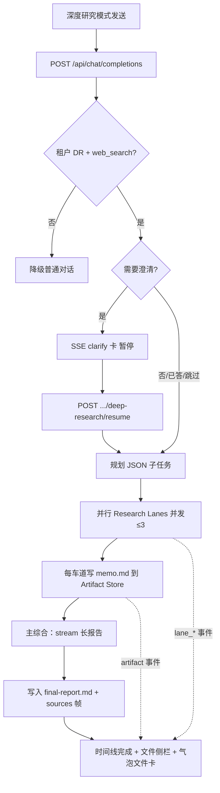

# Enterprise 前台深度研究工作台（ReAct + 并行车道 + Artifacts）

Planned-with: grok-4.5
Suggested-Impl-Model: 见文末「子任务 → 推荐模型」表
Depends-On:
- `2026-07-27-enterprise-portal-deep-research`（BFF 四阶段流水线与租户开关已落地）
- `2026-07-27-enterprise-portal-web-search-sources-panel`（来源 Sheet / `[N]` 胶囊可复用）
- `2026-07-27-enterprise-portal-deep-research-entry-ux` + 后续 NEAR 空态决策（**入口已定稿，本 plan 勿再改**）

**入口基线（已定，本 plan 不重做、不回退）：**
- 深度研究**唯一主入口 = 侧栏「深度研究」**（`createSession` + `deepResearchMode`）。
- **普通空态下方不再展示「深度研究」pill**——产品明确要求隐藏；只保留侧栏入口。
- 深度研究空态下的输入区芯片 / 专用 placeholder / 侧栏高亮等已有行为一律保留，实施工作台时不要顺手改入口 UX。

Supersedes-Constraints-From: `2026-07-27-enterprise-portal-deep-research` 中「不改 MessageList / 不落盘产物 / 不实现澄清」三条 OOS——本 plan 明确废止这三条，其余 OOS（不动 Go 网关 / desktop / agenticx / admin-console）仍然有效。

---

## 1. 背景与问题

### 1.1 用户对「深度调研」的产品定义（本 plan 的北极星）

深度调研不是「一次长补全」，而是可见的 **ReAct 工作台**：

1. **澄清**：先问清场景 / 渠道 / 约束（可跳过），再开工。
2. **并行多路调研**：主智能体拆任务后，多条「调研车道」并行检索与写备忘（逻辑子智能体，非 Desktop spawn）。
3. **产物落盘**：每条车道把 memo / 摘录写成可预览的 artifact（`.md` 等），挂在会话路径树下。
4. **主智能体综合**：汇总各车道产物，生成一份完整长篇调研文档（主 artifact），前端可预览 / 下载。
5. **过程可交互展示**：步骤时间线 + 产物侧栏，而不是灰字进度刷屏与裸文本来源清单。

对标体验（内部对照，**不得**写入 commit/PR 文案）：左侧过程时间线与澄清卡；右侧「全部文件」树（主报告 + assets）；气泡内嵌入可预览的文件卡片。

### 1.2 现状痛点（已落地 MVP）

| 现象 | 根因（证据） |
| --- | --- |
| 进度「很丑」：`> 1/3…` 灰字堆在气泡里 | `orchestrator.ts` 用 `sseDelta` 把进度写入同一条 `content`（约 L249–317） |
| 来源「很丑」：`**来源**` 纯文本块 | DR 走 `formatSourcesAppendix` 文本附录，**不**发 `agenticx_web_search_sources`，故无芯片 / Sheet |
| 无澄清、无并行车道感、无产物 | 原 plan 明确 OOS；portal 无 subagent / artifact 概念 |
| 用户误以为「已对齐深度研究」 | 能力只有单轮规划 + 检索 + 综述，体验仍是普通聊天气泡 |

### 1.3 架构事实（写 plan 必须认清）

- Portal **没有** Desktop `spawn_subagent` / `AgentTeamManager`；本 plan **不引入**真进程级子智能体，而用 BFF 内 **Research Lane（逻辑并行车道）** 模拟多路调研。
- **不做**「可执行沙箱 / Terminal / iPython」（对标「Kimi 的电脑」真执行面）——那是独立安全工程；本期右侧栏只做 **产物浏览器（只读）**，视觉上对齐「全部文件」而非假终端。
- 每次 LLM 调用仍走 Go 网关；策略 / 审计 / 计费不绕过。

---

## 2. 方案（已定，不留选项）

**在 Portal BFF 把 DeepResearch 升级为「Conductor + Lanes + Artifact Store」工作台；前端用结构化 SSE 事件驱动时间线 / 澄清卡 / 文件侧栏；产物落 PG（会话级逻辑路径），刷新可恢复。**

### 2.1 端到端流程



### 2.2 关键决策

1. **进度不再写入助手正文**：正文只承载最终报告（或报告摘要 +「详见产物」）；过程走 `agenticx_deep_research_event`。
2. **来源复用联网搜索通道**：综述结束后发 `agenticx_web_search_sources`；**删除** DR 文本 `**来源**` 附录。
3. **澄清为可选门闩**：规划前由轻量 LLM（`stream:false`）决定是否需要 1–2 个选择题；用户「跳过」或超时（默认 120s）则用默认假设继续。
4. **并行 = BFF `mapPool` 车道**，每车道：检索 → 写 `lanes/<slug>/memo.md` → 可选短综述段落；不是 Desktop 分身。
5. **产物存 PG**，逻辑路径形如 `research/<runId>/lanes/q1-xxx/memo.md`、`research/<runId>/final-report.md`；单文件正文上限 512KB；单次 run 文件数 ≤ 40。
6. **前端 MessageList 允许改动**：新增时间线组件、澄清卡、产物卡；复用 `WebSearchSourcesPanel` Sheet 模式做「全部文件」侧栏。

---

## 3. In scope / Out of scope

### In scope

- 结构化 SSE 事件协议 + SDK/store 贯通。
- 过程时间线 UI（可折叠步骤：规划 / 澄清 / 车道检索 / 写产物 / 综合）。
- 澄清卡（多选 + 跳过 + 下一步）与 resume API。
- Research Lane 并行写 memo 产物 + 主报告产物。
- Artifact PG 表 + REST（list / get / download）。
- 气泡内文件卡 + 右侧「全部文件」树 + Markdown 预览。
- DR 结束后挂载 `web_search_sources`（芯片 + 现有来源 Sheet）。
- 从 orchestrator 去掉丑陋的进度灰字与文本来源附录。
- 单元测试 + 关键手工验收。

### Out of scope（no-scope-creep）

- 不动 `enterprise/apps/gateway` 任何 Go 代码。
- 不动 `desktop/`、`agenticx/`、`examples/`、admin-console。
- **不做**真沙箱代码执行 / Terminal / Playwright / 图表 PNG 渲染引擎（可预留 `assets/` 空目录约定，本期不生成图）。
- **不做** Desktop `spawn_subagent` 真委派；车道仅存在于 portal BFF。
- **不做**多轮反思迭代研究（固定：澄清 0–1 轮 → 单轮规划 → 单轮并行车道 → 单轮综合）。
- 不改 Go 配额模型；仍靠现有网关计费（多阶段会放大 token，沿用租户 DR 开关）。
- **不改入口 UX**：不恢复空态下方深度研究 pill；不重做侧栏 / 空态芯片 / placeholder（已定稿）。

---

## 4. 事件协议与数据模型

### 4.1 SSE 帧（BFF → SDK）

在现有 `data: {…}\n\n` 上新增（与 `agenticx_web_search_sources` 同级，**非** delta）：

```ts
// enterprise/packages/sdk-ts/src/types.ts — 扩展 ChatChunk
export type DeepResearchEvent =
  | { type: "run_started"; runId: string }
  | { type: "phase"; phase: "clarify" | "plan" | "lanes" | "synthesize" | "done"; message: string }
  | {
      type: "clarify";
      runId: string;
      step: number;
      total: number;
      question: string;
      options: Array<{ id: string; label: string }>;
      allowCustom?: boolean;
    }
  | { type: "lane_started"; laneId: string; title: string; index: number; total: number }
  | { type: "lane_progress"; laneId: string; message: string; sourcesCollected?: number }
  | { type: "lane_done"; laneId: string; artifactPath?: string; status: "ok" | "failed" }
  | {
      type: "artifact";
      id: string;
      path: string;
      title: string;
      kind: "memo" | "report" | "other";
      bytes: number;
    }
  | { type: "clarify_timeout"; runId: string };

// ChatChunk 增加：
deepResearchEvent?: DeepResearchEvent;
```

帧形状：

```json
{ "agenticx_deep_research_event": { "type": "lane_started", "laneId": "lane-1", "...": "..." } }
```

解析落点：`enterprise/packages/sdk-ts/src/chat/http.ts`（在 `agenticx_web_search_sources` 分支旁，约 L183–190）。

### 4.2 消息模型

`enterprise/packages/core-api/src/chat.ts` `ChatMessage` 增加可选字段：

```ts
deep_research?: {
  runId: string;
  status: "running" | "awaiting_clarify" | "completed" | "failed" | "cancelled";
  events: DeepResearchEvent[]; // 截断保留最近 200 条；完整时间线也可只放 store 内存 + 刷新从 artifacts/API 重建
  artifactIds?: string[];
};
```

持久化：扩展 `sql-store.ts` 的 `MessageMetadata`（现 L56–59）写入 `metadata.deep_research`（与 `web_search_sources` 并列）；`sanitizeInboundMessages` 必须保留该字段（对照此前 sources 刷新丢失事故）。

### 4.3 Artifact 表

新建迁移（PG 下一号 / MySQL 下一号；以实施时 journal 末号 +1 为准，**禁止**复用已占用编号）：

```sql
-- PostgreSQL 示例名：0035_enterprise_chat_artifacts.sql
CREATE TABLE IF NOT EXISTS enterprise_chat_artifacts (
  id varchar(26) PRIMARY KEY,
  tenant_id varchar(26) NOT NULL,
  user_id varchar(26) NOT NULL,
  session_id varchar(26) NOT NULL,
  run_id varchar(26) NOT NULL,
  path text NOT NULL,
  title text NOT NULL,
  kind varchar(32) NOT NULL DEFAULT 'other',
  mime_type varchar(128) NOT NULL DEFAULT 'text/markdown',
  content text NOT NULL,
  byte_size integer NOT NULL,
  created_at timestamptz NOT NULL DEFAULT now(),
  UNIQUE (session_id, path)
);
CREATE INDEX IF NOT EXISTS enterprise_chat_artifacts_session_idx
  ON enterprise_chat_artifacts (tenant_id, session_id, created_at);
```

Drizzle 双方言：`enterprise/packages/db-schema/src/schema/` 与 `mysql-schema/` 同步；更新 `schema-parity.test.ts`、`migration-inventory.test.ts`、双方 `_journal.json`。

---

## 5. 功能需求（FR）与验收标准（AC）

### FR-1 事件协议贯通（消灭灰字进度）

1. `orchestrator.ts`：删除向 `content` 追加 `> 深度研究进行中` / `1/3` / `2/3` / `3/3` 的逻辑；改为 `enqueueEvent(...)`。
2. `http.ts` 解析 `agenticx_deep_research_event` → `ChatChunk.deepResearchEvent`。
3. `store.ts`：`applyDeepResearchEvent(assistantId, event)` 追加到 `message.deep_research.events`；**不**把 event 拼进 `content`。
4. 综述正文仍通过 `delta.content` 累加（或改为只写 artifact、气泡显示摘要——**本期定案：气泡仍 stream 最终报告正文**，同时写 `final-report.md` 产物，二者内容一致）。

**AC-1**：
- `orchestrator.test.ts`：完整成功路径的 SSE 文本中，**不出现** `> 1/3` / `**来源**`；出现至少一条 `agenticx_deep_research_event` 且末尾仍有 `agenticx_web_search_sources` + `[DONE]`。
- `http.test.ts`：能解析 event 帧且不污染 `delta`。
- `store.deep-research.test.ts`：event 进入 `deep_research.events`，`content` 不含进度灰字。

### FR-2 过程时间线 UI

新建 `enterprise/features/chat/src/components/molecules/DeepResearchTimeline.tsx`：

- 输入：`events: DeepResearchEvent[]`、`status`。
- 渲染垂直时间线：phase / lane_* / clarify / artifact；进行中项 spinner；失败项红色。
- 嵌入 `MessageList.tsx`：当 `message.deep_research` 存在时，**在 ReasoningBlock 之下、Markdown 正文之上**渲染（精确锚点：现来源 chip 条附近，约 L516–595）。

**AC-2**：组件单测（vitest + testing-library）覆盖：lane_started→lane_done 顺序；running 显示 spinner；无 event 时不渲染。

### FR-3 澄清门闩 + Resume

1. 新建 `enterprise/apps/web-portal/src/lib/deep-research/clarifier.ts`：
   - `proposeClarification(deps) → { needed: false } | { needed: true; questions: ClarifyQuestion[] }`
   - LLM `stream:false`，只输出 JSON；失败则 `needed: false`（不阻塞）。
2. `orchestrator.ts`：若 needed，发 `clarify` 事件后进入等待：
   - 用内存 `Map<runId, Deferred>`（单进程 dev 足够；注释标明多副本需外置 store——本期接受 sticky 单实例限制，与现 portal 本地部署一致）。
   - 超时 120s → `clarify_timeout` → 默认继续。
3. 新建 `POST /api/chat/deep-research/resume`：
   - body: `{ runId, answers: Record<string,string>, skip?: boolean }`
   - 校验 session 归属后 `resolve` Deferred。
4. 前端 `DeepResearchClarifyCard.tsx`：多选 / 其他 / 跳过 / 下一步；提交打 resume API。

**AC-3**：
- `clarifier.test.ts`：非法 JSON → needed false；标准 JSON → questions 截断 ≤2。
- `orchestrator.test.ts`：注入 fake clarifier needed=true 时，在 resume 前不启动 lanes；resume 后 lanes 启动；timeout 路径可继续。

### FR-4 并行 Research Lanes + memo 产物

1. 将现「子问题检索」升级为 `runLane(lane, ctx)`：
   - `executeWebSearch`（复用 `providers.ts`）
   - 登记 `CitationRegistry`
   - 调用短摘要（`stream:false`，失败则用命中 snippet 拼接）
   - `artifactStore.write({ path: \`research/${runId}/lanes/${laneId}/memo.md\`, content })`
   - 发 `lane_*` + `artifact` 事件
2. 并发仍用现有 `mapPool`，`SEARCH_CONCURRENCY = 3`；`MAX_LANES = 5`（对齐 `MAX_SUB_QUESTIONS`）。
3. 单车道失败不拖死整轮；全失败仍输出既有失败文案（改为 event + 短 content，不再依赖灰字进度）。

**AC-4**：
- `orchestrator.test.ts`：5 lanes 并发峰值 ≤3；每 lane 成功产生 1 个 artifact path；全失败无 final-report。

### FR-5 Artifact Store + REST +「全部文件」侧栏

1. 新建 `enterprise/apps/web-portal/src/lib/deep-research/artifact-store.ts`：`write / listBySession / get / getByPath`（PG/MySQL 双方言，模式对齐 `tenant-config.ts`）。
2. API：
   - `GET /api/chat/sessions/:sessionId/artifacts`
   - `GET /api/chat/artifacts/:id`（返回 content；校验 tenant/user/session）
3. UI：
   - `DeepResearchArtifactCard.tsx`：气泡内文件卡（图标 + 标题 +「预览」）。
   - `DeepResearchFilesPanel.tsx`：右 Sheet，树形 path（按 `/` 分层），点击预览 Markdown；顶部「下载全部」打 zip（可用简易客户端拼接多个 md；若 zip 依赖过重则先「逐个下载」，plan 定案：**逐个下载 + 列表导出 JSON 清单**，不做 zip 以免加依赖）。
4. 综合阶段结束后写 `research/${runId}/final-report.md`，并发 artifact 事件；气泡在报告流结束后插入主报告文件卡。

**AC-5**：
- `artifact-store.test.ts`：同 session 同 path upsert；跨 user 读取 404/403。
- 手工：跑完一次 DR → 侧栏见 `lanes/*/memo.md` + `final-report.md` → 预览正文与气泡报告一致 → 刷新后文件仍在。

### FR-6 来源体验对齐联网搜索

1. `runDeepResearchTurn` 结束前：`formatWebSearchSourcesSse(registry.list())`（从 `tool-loop.ts` 导出或抽到 `web-search/sse.ts` 避免循环依赖）。
2. 删除 `formatSourcesAppendix` 在主路径的调用（函数可留作单测无或删除）。
3. store 已有 `webSearchSources` 路径 → MessageList 芯片 / Sheet 自动生效。

**AC-6**：DR 助手消息存在 `web_search_sources.length > 0`；UI 出现「搜索网页 · N 个结果」；正文 `[N]` 变为胶囊；**不再**出现裸 `**来源**` 文本块。

### FR-7 中断与预算

保留 `TOTAL_BUDGET_MS = 180_000` 与 `request.signal` 透传；abort 后：
- 不再写新 artifact / 不再开新 lane；
- 发 `phase: done` 或标记 `status: cancelled`；
- 已产生的 artifact **保留**（用户可看部分成果）。

**AC-7**：abort 后 `fetch` 调用次数不再增加；已写入的 memo 仍可通过 list API 读到。

---

## 6. 精确落点清单（Composer 锚点）

| 改动 | 文件 |
| --- | --- |
| 事件协议类型 | `enterprise/packages/sdk-ts/src/types.ts` |
| SSE 解析 | `enterprise/packages/sdk-ts/src/chat/http.ts` |
| 消息模型 | `enterprise/packages/core-api/src/chat.ts` |
| store 应用 event / 持久化字段 | `enterprise/features/chat/src/store.ts`；`store.deep-research.test.ts` |
| 时间线 / 澄清卡 / 文件卡 / 侧栏 | `enterprise/features/chat/src/components/molecules/DeepResearch*.tsx`；导出 barrel 若有 |
| MessageList 嵌入 | `enterprise/features/chat/src/components/molecules/MessageList.tsx` |
| sanitize 保留字段 | `enterprise/apps/web-portal/src/lib/chat-message-sanitize.ts` |
| metadata 序列化 | `enterprise/apps/web-portal/src/lib/chat-history/sql-store.ts` |
| orchestrator / clarifier / artifact-store | `enterprise/apps/web-portal/src/lib/deep-research/*` |
| resume + artifacts API | `enterprise/apps/web-portal/src/app/api/chat/deep-research/resume/route.ts`；`.../sessions/[sessionId]/artifacts/route.ts`；`.../artifacts/[id]/route.ts` |
| completions 接线（传 sessionId/run 上下文） | `enterprise/apps/web-portal/src/app/api/chat/completions/route.ts`（现 L135–142） |
| schema / 迁移 | `enterprise/packages/db-schema/...` |
| i18n | `enterprise/apps/web-portal/messages/zh.json`、`en.json`（`workspace` / `chat.deepResearch*`） |

---

## 7. 实施顺序与提交切分

五段提交，每段 `pnpm -C enterprise typecheck` 绿；涉及 UI 的段再跑相关 vitest。

1. `feat(portal-chat): 深度研究结构化事件与时间线`（FR-1/2）
2. `feat(portal-chat): 深度研究澄清门闩与 resume`（FR-3）
3. `feat(portal-chat): 并行调研车道与 memo 产物落库`（FR-4 + artifact-store 核心）
4. `feat(portal-chat): 调研产物侧栏与最终报告卡`（FR-5）
5. `fix(portal-chat): 深度研究来源复用联网搜索芯片`（FR-6/7 收口）

commit trailer：

```
Plan-Id: 2026-07-27-enterprise-portal-deep-research-workbench
Plan-File: .cursor/plans/2026-07-27-enterprise-portal-deep-research-workbench.plan.md
Plan-Model: <规划模型>
Impl-Model: <实施模型>
Made-with: Damon Li
```

（实施前将本文件从 `pending/` 移回 `.cursor/plans/` 根目录。）

---

## 8. 端到端手工验收

前置：`bash enterprise/scripts/start-dev-with-infra.sh`；租户开启联网搜索 + 深度研究。

1. 深度研究模式提问「对比主流编码模型性价比…」。
2. 若出现澄清卡：选一项 → 下一步；或点跳过。
3. 时间线出现：规划 → 多条车道并行（可见多个 lane）→ 产物事件 → 综合。
4. 气泡：**无**灰字 `1/3` 刷屏；有报告正文；有主报告文件卡；`[N]` 为胶囊。
5. 打开「全部文件」：见 `lanes/*/memo.md` 与 `final-report.md`，预览可读。
6. 刷新会话：时间线摘要或至少产物仍在；来源芯片仍在。
7. 生成中点停止：不报错；已有 memo 保留。
8. 关闭深度研究问同一句：普通回答，无时间线 / 无产物卡。
9. 回归：普通对话、仅联网搜索、附件、重试 / 重新生成。

---

## 9. 风险与对策

| 风险 | 对策 |
| --- | --- |
| token / 时延再放大（澄清 + 每车道摘要 + 综合） | 租户开关；车道 ≤5；摘要 prompt 限 600 tokens；总预算 180s |
| 多副本 resume Deferred 丢失 | 本期文档标明需单实例 / sticky；后续可迁 Redis（显式 Out of scope） |
| 产物撑爆 PG | 单文件 512KB、单 run ≤40；超限截断并 event 警告 |
| MessageList 改动回归聊天气泡 | 仅在 `message.deep_research` 存在时挂载；普通消息路径零行为变化 |
| 被要求做真沙箱终端 | 本 plan 拒绝范围蠕变；另开 plan |

---

## 10. 子任务 → 推荐实施模型

| 子任务 | 推荐模型 | 理由 |
| --- | --- | --- |
| FR-1 SDK/store 事件贯通 | composer-2.5-fast | 字段透传，落点清晰 |
| FR-2 时间线 UI | gpt-5.6-terra-medium 或 opus 档 | 需视觉层次与交互品味 |
| FR-3 澄清 + resume | gpt-5.6-sol-medium | 异步门闩易回归 |
| FR-4 lanes + orchestrator 重构 | gpt-5.6-terra-medium | 并发 / abort / 预算敏感 |
| FR-5 artifact 表 + 侧栏 | gpt-5.6-sol-medium（schema）+ 前端品味档（面板） | 跨栈 + UI |
| FR-6 sources 复用 | composer-2.5-fast / kimi-k2.7-code | 小改动接线 |

最终 `Impl-Model` 以实际使用为准，由用户确认。

---

## 11. 与旧 plan 的关系（给实施者）

| 旧约束 | 本 plan |
| --- | --- |
| 进度走文本 delta | **废止** → 结构化 event |
| 不落盘产物 | **废止** → PG artifact |
| 不实现澄清 | **废止** → clarify + resume |
| 不改 MessageList | **废止** → 挂载工作台组件 |
| 不动 gateway / desktop / agenticx | **保持** |

旧流水线文件 `orchestrator.ts` / `planner.ts` / `registry.ts` **原地演进**，不要另起平行实现导致双栈。
