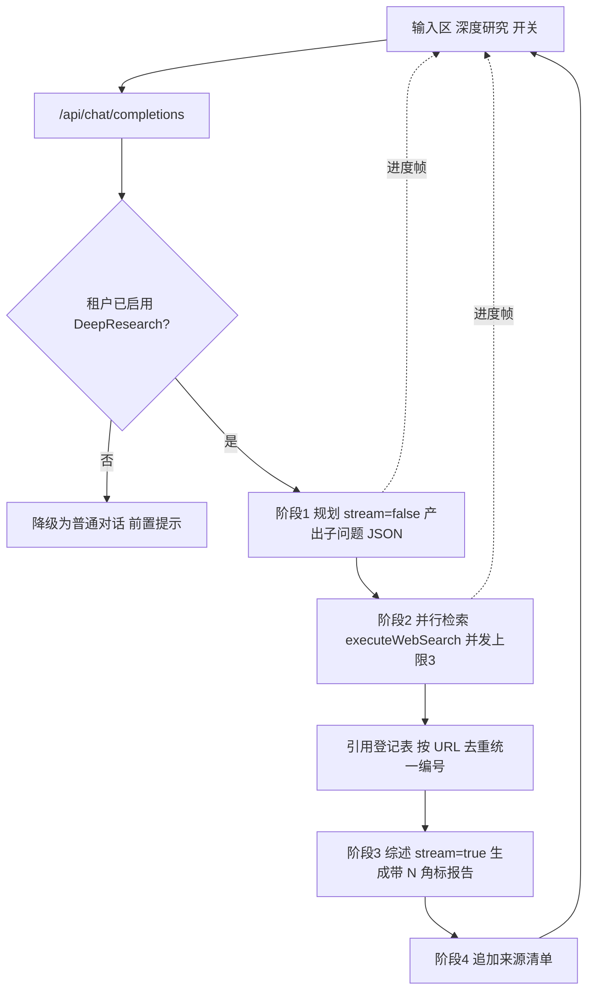

# Enterprise 前台深度研究（DeepResearch）能力落地

Planned-with: claude-opus-5-thinking
Suggested-Impl-Model: 见文末「子任务 → 推荐模型」表
Depends-On: `2026-07-27-enterprise-portal-web-search-wiring`（必须先落地，本 plan 复用其搜索层）

---

## 1. 背景与现状

### 1.1 现状：两处纯空壳

Enterprise 前台用户端存在两个 Deep research 入口，**都只翻转自身高亮，没有任何下游消费者**：

| 位置 | 文件与行号 | 现状 |
| --- | --- | --- |
| 输入区显微镜图标 | `enterprise/apps/web-portal/src/components/MachiChatView.tsx` L99 `const [deepResearch, setDeepResearch] = React.useState(false);`，L467-474 按钮仅 `setDeepResearch((prev) => !prev)` | 状态无人读取 |
| 左侧栏主操作按钮 | `enterprise/apps/web-portal/src/components/WorkspaceShell.tsx` L149 同款 `useState`，L284-292 按钮紧邻「新对话」 | 状态无人读取，且占据主操作位，最具误导性 |

全仓检索确认：`enterprise/` 内除上述 UI 与 i18n 文案（`messages/zh.json`、`messages/en.json` 的 `workspace.deepResearch`）外，无任何 deep research 逻辑；`agenticx/` 核心框架检索 `deep_research` **零命中**。

`examples/agenticx-for-deepresearch/AgenticX-DeepResearch/` 是独立 Python 示例应用（自带 planner / query_generator / research_summarizer / report_builder 与 `output/sub_reports/` 产物），属 demo 而非框架能力，**无法直接接入** Enterprise 的 Next.js + Go 网关栈；本 plan 仅借鉴其阶段划分思路（规划 → 检索 → 综述 → 引用），不复用代码。

### 1.2 目标

用户在对话中开启「深度研究」后发送问题，系统应：把问题拆成若干子问题 → 并行联网检索 → 汇总为带引用的结构化报告，过程可见、可中断、有明确边界，而不是一次普通补全。

---

## 2. 方案（已定，不留选项）

**在 Portal BFF 编排有界多阶段研究流水线，复用联网搜索 plan 交付的搜索层；Go 网关继续只做模型转发。**

理由与联网搜索 plan 一致：BFF 是每轮对话必经节点，且每次 LLM 调用仍然经网关，策略评估、审计与计费链路完整不绕过。

### 2.1 流水线



### 2.2 关键决策（不再讨论）

1. **进度以文本帧流式呈现**，走现有 SSE `delta.content` 通道，不新增数据通道、不改 `MessageList` 渲染架构。进度段与报告之间用 `\n\n---\n\n` 分隔。
2. **左侧栏 Deep research 按钮删除**，只保留输入区一个入口，避免两处状态各自为政。
3. **深度研究默认关闭（opt-in）**，因为单次消耗数倍 token；由租户在设置页显式开启。
4. **深度研究隐含联网**：开启 DR 时忽略联网搜索开关状态，始终检索；但仍受租户级 `web_search.enabled` 总闸约束。
5. **规划阶段用 JSON 输出而非 function calling**，避免对上游模型 tools 支持度的额外依赖（联网搜索 plan 已证实部分兼容代理会 400）。

---

## 3. In scope / Out of scope

### In scope

- 输入区 `deepResearch` 开关贯通到 BFF 请求字段。
- 删除左侧栏重复入口。
- BFF 侧四阶段研究流水线（规划 / 检索 / 综述 / 来源）。
- 全局引用登记表：跨子问题按 URL 去重、统一编号。
- 进度流式反馈与用户中断支持。
- 租户级 DeepResearch 开关落 PG + 设置页接线。
- 上述各点单元测试。

### Out of scope（no-scope-creep 边界）

- 不动 `enterprise/apps/gateway` 任何 Go 代码。
- 不动 `desktop/`、`agenticx/`、`examples/`。
- 不动 admin-console。
- **不实现多轮反思/迭代研究**（示例应用的 advanced 模式）：本期固定单轮规划 + 单轮综述。
- **不实现澄清提问交互**（示例应用的 interactive 模式）。
- 不生成子报告文件、不落盘产物目录，报告只作为一条助手消息存在。
- 不改 `MessageList`、`ToolCallCard`、`ReasoningBlock` 的渲染实现。
- 不新增前端 Markdown 渲染能力（报告使用现有 `assistant-markdown-components.tsx` 已支持的语法）。

---

## 4. 功能需求（FR）与验收标准（AC）

### FR-1 开关贯通与入口收敛

1. `enterprise/packages/sdk-ts/src/types.ts` L18-23 `ChatRequest` 增加 `deepResearch?: boolean;`（此时 `webSearch?: boolean` 已由前置 plan 加入）。
2. `enterprise/packages/sdk-ts/src/chat/http.ts` 请求体透传 `...(pending.request.deepResearch ? { agenticx_deep_research: true } : {})`。
3. `enterprise/features/chat/src/store.ts`：
   - `SendMessageInput`（L23-28）增加 `deepResearch?: boolean;`
   - `toSdkRequest` 签名再扩一个参数并写入返回对象。
   - 与前置 plan 的 `lastWebSearchBySessionId` 并列，新增 `lastDeepResearchBySessionId`，供 `editUserMessageAndResend`（L1047 附近）、`regenerateAssistantResponse`（L1227 附近）、队列续发（L939 附近）复用。
4. `enterprise/apps/web-portal/src/components/MachiChatView.tsx` L358-372 `handleSend` 传入 `deepResearch`，依赖数组补齐。
5. `enterprise/apps/web-portal/src/components/WorkspaceShell.tsx`：删除 L149 的 `deepResearch` state 与 L284-292 的按钮；同时清理该文件因此不再使用的 `Microscope` import。i18n key `workspace.deepResearch` 保留（输入区 tooltip 复用），`messages/zh.json` L46 与 `messages/en.json` L46 不动。

**AC-1**：`enterprise/features/chat/src/store.deep-research.test.ts` 断言开启后 mock client 收到 `ChatRequest.deepResearch === true`，重新生成时仍为 `true`；`pnpm -C enterprise typecheck` 通过（验证 `WorkspaceShell.tsx` 无残留未使用 import）。

### FR-2 阶段一：研究规划

新增 `enterprise/apps/web-portal/src/lib/deep-research/planner.ts`：

```ts
export type ResearchPlan = { topic: string; subQuestions: string[] };
export async function buildResearchPlan(deps: PlannerDeps): Promise<ResearchPlan>;
```

- 以 `stream: false` 调用网关，system 提示要求**只输出 JSON**：
  `{"topic": "...", "sub_questions": ["...", "..."]}`，3 到 5 条，覆盖不同角度，使用与用户提问相同的语言。
- 解析容错：先 `JSON.parse` 整体；失败则用 `/\{[\s\S]*\}/` 提取首个 JSON 对象再解析；仍失败则**降级**为 `{ topic: 原问题, subQuestions: [原问题] }`，不得抛错中断整轮。
- 子问题去空白、去重、截断到最多 `MAX_SUB_QUESTIONS = 5`。
- 超时 `AbortSignal.timeout(30_000)`。

**AC-2**：`planner.test.ts` 覆盖：标准 JSON 正常解析；带 ```json 代码围栏的响应能提取；纯自然语言响应降级为单问题且不抛错；返回 8 条时被截断为 5 条；重复子问题被去重。

### FR-3 阶段二：并行检索与引用登记

新增 `enterprise/apps/web-portal/src/lib/deep-research/registry.ts`：

```ts
export type Citation = { index: number; title: string; url: string; snippet: string };
export class CitationRegistry {
  add(hit: WebSearchHit): Citation;   // 同 URL 返回既有编号，不重复登记
  list(): Citation[];                  // 按 index 升序
  get size(): number;
}
```

- URL 归一化后比对（去 `#fragment`、去尾部 `/`、去 `utm_*` 参数），避免同源重复占号。
- 编号从 1 开始连续递增。

新增 `enterprise/apps/web-portal/src/lib/deep-research/orchestrator.ts` 的检索阶段：

- 对每个子问题调用前置 plan 交付的 `executeWebSearch`（`enterprise/apps/web-portal/src/lib/web-search/providers.ts`），每问 `RESULTS_PER_QUESTION = 5` 条。
- 并发上限 `SEARCH_CONCURRENCY = 3`（手写 worker 池，不引入第三方并发库）。
- 全局去重后上限 `MAX_SOURCES = 25`，超出部分丢弃。
- 单个子问题检索失败只记警告并继续；**全部失败**时终止流水线，向用户输出 `> 深度研究检索失败，请稍后重试或改用普通对话。` 并结束流。

**AC-3**：`registry.test.ts` 断言：同 URL 不同 `utm_source` 只占一个编号；`https://a.com/x/` 与 `https://a.com/x` 视为同一源；编号连续。`orchestrator.test.ts` 用 fake search 断言：5 个子问题时并发不超过 3；总源数被夹到 25；单问失败不影响整体；全失败时输出预期错误文案。

### FR-4 阶段三：综述生成与阶段四：来源清单

综述调用（`orchestrator.ts`）：

- `stream: true`，messages 为：system（综述指令）+ 原始对话历史 + 一条 user 消息承载证据包。
- 证据包格式：

```
研究主题：<topic>

## 子问题 1：<question>
[1] <title>
URL: <url>
摘要：<snippet>

[2] ...
```

- system 综述指令要求：产出结构化 Markdown 报告，包含「核心结论」「分项分析」「不确定性与信息缺口」三节；每条来自证据的事实必须以 `[N]` 标注，N 与证据包编号严格一致；**禁止编造证据包中不存在的编号**；证据不足以回答的部分要明说而非臆测。
- 上游 SSE 直接 pipe 给前端。
- 流结束后追加来源清单帧：

```
\n\n---\n**来源**\n[1] 标题 — https://...\n...
```
仅登记表非空时追加。

**AC-4**：`orchestrator.test.ts` 断言：综述请求的最后一条 user 消息含全部子问题与 `[1]`…`[N]` 编号；输出流末尾含 `**来源**` 与全部 URL；`data: [DONE]` 正确收尾。

### FR-5 进度可见与可中断

进度帧在各阶段开始时以文本形式写入同一 SSE 流（与报告之间用 `\n\n---\n\n` 分隔），内容形如：

```
> 深度研究进行中
> 1/3 正在规划研究路径…
> 2/3 已拆解 4 个子问题，正在检索…（已收集 12 个来源）
> 3/3 正在综合分析…
```

实现要求：
- 后续进度行采用**追加**语义（每帧只发新增文本），因为前端 `store.ts` 是 `content + delta` 累加，无法回删已输出内容。
- 中断：`route.ts` 里把 `request.signal` 透传进 `orchestrator`，各阶段 fetch 均带该 signal；前端 `HttpChatClient.cancel()`（`http.ts` L232-236）abort 后，BFF 应停止后续阶段、不再发起新的上游调用。
- 总预算 `TOTAL_BUDGET_MS = 180_000`；超时后跳过剩余阶段，用已有证据直接进入综述；若连规划都未完成则降级为普通对话。

**AC-5**：`orchestrator.test.ts` 断言：中途 abort 后不再发起新的 fetch（记录调用次数）；总预算耗尽时仍能产出报告而非报错；进度文本按阶段顺序出现且各帧只含增量。

### FR-6 租户级开关与设置页接线

1. 迁移 `enterprise/packages/db-schema/drizzle/0032_enterprise_runtime_deep_research.sql`（前置 plan 使用 0031），为前置 plan 建立的 `enterprise_runtime_web_search` 表新增列：

```sql
ALTER TABLE enterprise_runtime_web_search
  ADD COLUMN IF NOT EXISTS deep_research_enabled boolean NOT NULL DEFAULT false;
```

同步更新 `enterprise/packages/db-schema/src/schema/runtime-config.ts` 与 `src/mysql-schema/runtime-config.ts` 的表定义（`schema-parity.test.ts` 会校验双方言一致），并登记 `drizzle/meta/_journal.json`、`migration-inventory.test.ts`、`enterprise/scripts/db-portability/table-manifest.ts`。

2. `enterprise/apps/web-portal/src/app/api/me/web-search/route.ts`（前置 plan 新建）的 `GET` 返回体增加 `deepResearchEnabled`，`PUT` 接受同名可选字段。
3. `enterprise/apps/web-portal/src/components/settings/SettingsPanel.tsx` 的联网搜索 tab（L387-417 区块）内新增一行「深度研究」开关，描述文案说明其消耗显著更高、默认关闭；沿用该 tab 已有的保存与 toast 逻辑。i18n 在 `messages/zh.json` / `messages/en.json` 的 `settings.webSearch` 节下新增 `enableDeepResearch` 与 `enableDeepResearchDescription`。
4. BFF 守卫：请求带 `agenticx_deep_research: true` 但租户 `deepResearchEnabled === false` 时，降级为普通对话并前置一行 `> 管理员未开启深度研究，以下为普通回答。`；租户 `web_search.enabled === false` 时同样降级（深度研究依赖检索）。

**AC-6**：
- `enterprise/apps/web-portal/src/lib/__tests__/deep-research-config.test.ts` 断言两种关闭态都走降级路径且不发起任何搜索调用。
- 手工验收：设置页开启深度研究 → 保存 → 刷新仍为开启；PG `select deep_research_enabled from enterprise_runtime_web_search;` 为 `true`。

---

## 5. 端到端验收（必须人工跑通）

前置：`bash enterprise/scripts/start-dev-with-infra.sh`；联网搜索 plan 已合入并可用。

1. 设置 → 联网搜索 → 同时开启「启用联网搜索」与「深度研究」→ 保存 → 刷新确认保持。
2. 对话中点亮显微镜图标，发送：`调研一下 2026 年主流开源大模型在 Agent 场景的能力差异`。
3. 期望：先看到分阶段进度文本（规划 → 检索并显示来源数 → 综合分析），随后出现含「核心结论 / 分项分析 / 不确定性与信息缺口」的报告，正文带 `[N]` 角标，末尾有可点击的来源清单，编号与角标一一对应。
4. 中断验收：再发一次同类问题，在检索阶段点击停止，回答应停在已输出内容，不报错、不继续刷进度。
5. 关闭显微镜图标问同一问题：应是普通单轮回答，无进度文本、无来源段落。
6. 左侧栏确认 Deep research 按钮已移除，「新对话」布局无错位。
7. 回归：普通对话、仅开联网搜索、附件上传、模型切换、重试/重新生成、队列续发行为不变。

---

## 6. 风险与对策

| 风险 | 对策 |
| --- | --- |
| 单次消耗数倍 token，用户无感知超支 | 默认关闭、租户显式开启；子问题 ≤5、来源 ≤25、单轮综述；每次调用仍走网关计费与配额 |
| 首字延迟长（规划 + 检索都在综述之前） | 进度帧在规划开始时立即下发，用户 1 秒内看到反馈 |
| 模型不按 JSON 输出导致规划失败 | 三级容错：整体解析 → 正则提取 → 降级单问题，绝不中断 |
| 模型编造不存在的 `[N]` 角标 | 综述提示显式禁止；来源清单只列真实登记项，编号错位在人工验收步骤 3 可被发现 |
| 长流水线中途用户离开页面导致后端空跑 | `request.signal` 透传各阶段，abort 后不再发起新调用 |
| 误改到网关或其他端 | 提交前 `git diff --stat` 确认只涉及 `enterprise/apps/web-portal`、`enterprise/features/chat`、`enterprise/packages/sdk-ts`、`enterprise/packages/db-schema`、`enterprise/scripts/db-portability` |

---

## 7. 实施顺序与提交切分

前置条件：联网搜索 plan 的 FR-3（`web-search/providers.ts`）已合入 main。

三段提交，每段 `pnpm -C enterprise typecheck && pnpm -C enterprise build` 绿后再进下一段：

1. `feat(portal-chat): 深度研究开关贯通并收敛入口`（FR-1，含 AC-1）
2. `feat(portal-chat): BFF 深度研究流水线与引用登记`（FR-2/3/4/5，含 AC-2/3/4/5）
3. `feat(portal-settings): 深度研究租户开关落 PG`（FR-6，含迁移与 AC-6）

commit trailer：

```
Plan-Id: 2026-07-27-enterprise-portal-deep-research
Plan-File: .cursor/plans/2026-07-27-enterprise-portal-deep-research.plan.md
Plan-Model: <规划模型>
Impl-Model: <实施模型>
Made-with: Damon Li
```

---

## 8. 子任务 → 推荐实施模型

| 子任务 | 推荐模型 | 理由 |
| --- | --- | --- |
| FR-1 开关贯通 + 删除侧栏入口 | composer-2.5-fast | 字段透传与删除，落点已精确到行 |
| FR-2 规划阶段与三级容错解析 | kimi-k2.7-code | 单文件、边界清晰，代码专精便宜档够用 |
| FR-3/4/5 编排、并发、引用、中断、SSE | gpt-5.6-terra-medium | 并发控制、超时预算、abort 传播与流式增量语义是最易出回归处，需强推理 |
| FR-6 迁移 + 双方言 schema + 设置页 | gpt-5.6-sol-medium | 跨 schema 与前后端接线，需中高档稳妥落地 |

最终 `Impl-Model` 以实际使用为准，由用户确认。
