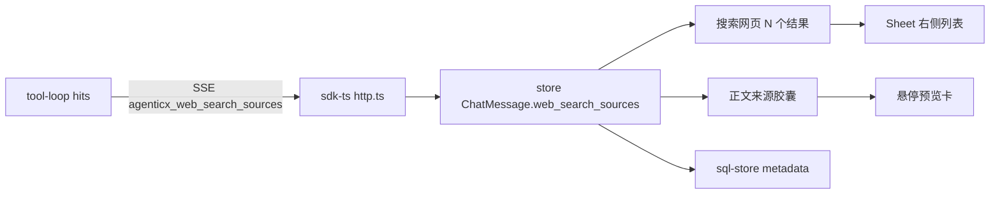

# Enterprise 前台联网搜索来源侧栏（Kimi 式）

Planned-with: grok-4.5
Suggested-Impl-Model: 见文末「子任务 → 推荐模型」表

落盘：`.cursor/plans/pending/2026-07-27-enterprise-portal-web-search-sources-panel.plan.md`（确认实施前移到 `.cursor/plans/`）

---

## 1. 背景与差距

当前联网已能检索并生成带 `[1][2][3]` 的回答，但来源只靠 BFF 在流末拼进文本附录（`**来源**\n[1] title — url`），且原 wiring plan 明确 **Out of scope**：不改 `MessageList`、不新增 references 通道。

用户对照 Kimi 要的是：
- 消息旁「搜索网页 · N 个结果」入口 → 右侧结果列表
- **正文句末后缀是来源链接胶囊**（显示站点名如 `VentureBeat`，不是裸 `[1]`）
- **鼠标悬停胶囊**弹出预览卡：favicon + 站点名 + 日期（有则显示）+ 标题 + 摘要；点击可打开原网页或定位侧栏

---

## 2. In scope / Out of scope

### In scope
- BFF 用自定义 SSE 帧下发结构化 `WebSearchHit[]`（对齐已有 `agenticx_usage` 模式）
- SDK / store / core-api 消息类型携带 `web_search_sources`
- 历史持久化进 `chat_messages.metadata`
- `MessageList`：可点入口行 + 右侧 `Sheet` 列表
- 正文 `[N]` **替换渲染**为站点名胶囊（hostname / 可读域名短名）；悬停预览卡；点击打开 url（`target=_blank`）
- 停止把纯文本「**来源**」附录拼进 `delta.content`
- 单测：SSE 解析、store 写入、附录不再进 content；citation 解析单测

### Out of scope
- 不动 gateway / desktop / agenticx Python / admin-console
- 不做 DeepResearch
- 不复刻 Kimi 完整「思考过程时间线」多步 UI
- 不爬取真实发布日期（sources 无 date 字段时预览卡省略日期行；不新增抓取）
- 不引入新 npm 依赖（Sheet / Popover / HoverCard 用现有 `@agenticx/ui`；若无 HoverCard 则用 `Popover` 或纯 CSS `group-hover` 浮层）

---

## 3. 精确改动点

### FR-1 BFF：结构化 sources SSE，去掉文本附录

文件：[`enterprise/apps/web-portal/src/lib/web-search/tool-loop.ts`](enterprise/apps/web-portal/src/lib/web-search/tool-loop.ts)

- 在 `pipeWithSourcesAppendix`（约 L165–219）于 `[DONE]` 之前改为发送：
  `data: {"agenticx_web_search_sources":[{title,url,snippet},...]}\n\n`
- **删除**拼进 `delta.content` 的 `formatSourcesAppendix` 文本附录
- 更新 [`tool-loop.test.ts`](enterprise/apps/web-portal/src/lib/web-search/__tests__/tool-loop.test.ts)

### FR-2 SDK：解析自定义帧

- [`enterprise/packages/sdk-ts/src/types.ts`](enterprise/packages/sdk-ts/src/types.ts) `ChatChunk` 增加 `webSearchSources?`
- [`enterprise/packages/sdk-ts/src/chat/http.ts`](enterprise/packages/sdk-ts/src/chat/http.ts) 在 `agenticx_usage` 旁解析 `agenticx_web_search_sources`，`yield` 后 `continue`

### FR-3 类型 + store + 持久化

- [`enterprise/packages/core-api/src/chat.ts`](enterprise/packages/core-api/src/chat.ts) `ChatMessage` 增加 `web_search_sources?: WebSearchSource[]`
- [`enterprise/features/chat/src/store.ts`](enterprise/features/chat/src/store.ts)：流式写入；`AssistantResponseVersion` 同步携带
- [`enterprise/apps/web-portal/src/lib/chat-history/sql-store.ts`](enterprise/apps/web-portal/src/lib/chat-history/sql-store.ts)：metadata 读写

### FR-4 UI：入口行 + 右侧 Sheet

- [`MessageList.tsx`](enterprise/features/chat/src/components/molecules/MessageList.tsx) 约 L487–534：有 sources 时渲染「搜索网页 · N 个结果 >」
- `@agenticx/ui` `Sheet` / `SheetContent side="right"`
- 列表：序号、title、snippet、hostname；整项可点开 url

新建：`enterprise/features/chat/src/components/molecules/WebSearchSourcesPanel.tsx`

### FR-5 UI：正文来源胶囊 + 悬停预览（本轮新增，对齐用户最新截图）

**交互定案（对齐 Kimi）：**
- 模型仍输出 `[1]` / `[2]`（system hint 已要求）；前端负责可视化，不要求模型输出站点名
- 将独立 token `[N]`（N 为 1-based 且 `N <= sources.length`）替换为 **胶囊按钮**，文案优先：
  1. `new URL(source.url).hostname` 去 `www.` 后的短名（如 `venturebeat.com` → 可再取主标签；若过长截断）
  2. 无法解析 url 时回退为 `[N]`
- **悬停**（desktop hover；触屏用长按/点击打开同一预览或直接开链）：浮层卡片包含
  - 左上：favicon（`https://www.google.com/s2/favicons?domain=${hostname}&sz=32`，加载失败显示首字母占位）
  - 站点名 +（可选）日期行——当前 hit 无 date 则整行省略，不伪造
  - 粗体 title
  - 最多 2 行 snippet
- **点击胶囊**：默认 `window.open(url)`；若按住修饰键或二次入口「在列表中查看」则打开 Sheet 并 `scrollIntoView` 第 N 项
- 实现落点：
  - 新建 `WebSearchCitation.tsx`（胶囊 + hover 浮层）
  - 扩展 [`assistant-markdown-components.tsx`](enterprise/features/chat/src/markdown/assistant-markdown-components.tsx)：在 `p`/`li`/`td` 等文本节点用自定义 `text` 处理，或对 content 做轻量 preprocess 把 `[N]` 换成 remark 可识别的 link 再自定义 `a`——**推荐**：在 `AssistantMessageMarkdown` 外包一层，用 ReactMarkdown 的 `components` 对字符串 children 做 `split(/\[(\d+)\]/)` 替换为 `<WebSearchCitation index={n} source={sources[n-1]} />`
  - `AssistantMessageMarkdown` 需接收 `sources` prop（从 MessageList 传入）
- 系统提示保持要求模型输出 `[N]`；不在 BFF 改写模型正文为站点名（避免流式中途闪烁）

---

## 4. 验收（AC）

- AC-1：出现「搜索网页 · N 个结果」，N 与命中一致
- AC-2：点击入口 → 右侧 Sheet 有 title/snippet/可点 url
- AC-3：正文句末出现**站点名胶囊**（非裸 `[1]` 纯文本）；悬停出现预览卡（favicon + 标题 + 摘要）
- AC-4：点击胶囊打开对应网页；侧栏仍可从入口打开并浏览全部来源
- AC-5：刷新/重进会话后胶囊与侧栏数据仍在
- AC-6：正文不再出现重复纯文本 `**来源**` 附录
- AC-7：单测覆盖 SSE 帧、`[N]`→胶囊映射（含越界 `[99]` 保持原文）

---

## 5. 子任务 → 推荐模型

| 子任务 | Suggested-Impl-Model | 理由 |
|--------|----------------------|------|
| FR-1/2 BFF+SDK SSE | composer-2.5-fast / kimi-k2.7-code | 样板接线 |
| FR-3 store+sql-store | gpt-5.6-terra / codex 档 | 持久化一致性 |
| FR-4/5 Sheet+胶囊悬停 | claude-opus / 强审美前端档 | Kimi 级交互与视觉 |

---

## 6. Composer 2.5 可实施门槛自检

- 每个改动有路径 + 锚点；悬停卡字段写死（无 date 则省略）
- before：裸 `[N]` + 文本附录；after：结构化 SSE + Sheet + 胶囊悬停
- AC 可测；越界 `[N]` 行为明确
