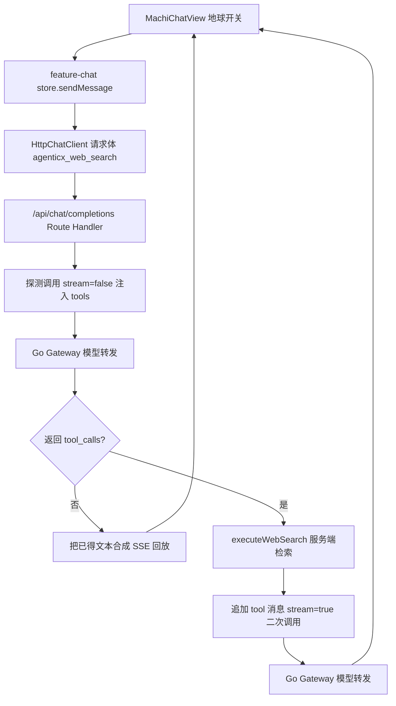

# Enterprise 前台联网搜索接线（用户侧「联网搜索」实际调用搜索工具）

Planned-with: claude-opus-5-thinking（根因排查由 cursor-grok-4.5 完成）
Suggested-Impl-Model: 见文末「子任务 → 推荐模型」表

---

## 1. 背景与问题

### 1.1 现象（用户可复现）

在 Enterprise 前台用户端（`http://localhost:3000/workspace`，即 `enterprise/apps/web-portal`）：

1. 点亮输入区左侧的地球图标（联网搜索）。
2. 发送：`测试，你可以联网搜索吗？deepseek 最新的模型是什么？`

实际结果：模型直接用内部知识作答，明确回复「目前没有主动进行实时联网搜索的能力」「知识库已涵盖至 2025 年初」，回答内容陈旧（把 DeepSeek-V3/R1 当作最新）。全程无任何工具调用、无网页来源引用。

期望结果：开启联网搜索后，本轮应真实调用搜索，把当前网页结果回灌模型，回答基于实时检索并给出来源。

### 1.2 根因（证据链，实施者可自行复核）

**联网搜索在 Enterprise 前台从未接线**，从 UI 到网关全链路没有任何一环携带或执行搜索能力。逐层证据：

| 层 | 文件与位置 | 现状 |
| --- | --- | --- |
| 输入区开关 | `enterprise/apps/web-portal/src/components/MachiChatView.tsx` L98 `const [webSearch, setWebSearch] = React.useState(false);`，L459-466 按钮仅 `setWebSearch((prev) => !prev)` | 纯本地 UI 状态 |
| 发送函数 | 同文件 L358-372 `handleSend` → `sendMessage(client, { content, attachments }, ...)` | **完全不读 `webSearch`**，标志在此断链 |
| Store | `enterprise/features/chat/src/store.ts` L23-28 `SendMessageInput`（只有 content/attachments/tenantId/userId）、L197-215 `toSdkRequest` | 无搜索字段 |
| SDK 类型 | `enterprise/packages/sdk-ts/src/types.ts` L18-23 `ChatRequest = { sessionId, model, messages, stream? }` | 无搜索字段、无 tools |
| HTTP 客户端 | `enterprise/packages/sdk-ts/src/chat/http.ts` L86-90 `body: JSON.stringify({ model, stream: true, messages })` | **请求体里没有 `tools`** |
| Portal BFF | `enterprise/apps/web-portal/src/app/api/chat/completions/route.ts` L66-115 | 只做模型可见性校验 + 拆 provider 前缀，原样转发 |
| Gateway | `enterprise/apps/gateway/internal/openai/types.go` L52 `Tools []Tool` | 仅**透传** `tools`/`tool_calls`（见 `internal/openai/tool_calls_roundtrip_test.go`），**没有工具执行环**，也没有任何 `web_search` 实现（全仓 `enterprise/apps/gateway` 内检索 `web_search` 零命中） |
| 设置页 | `enterprise/apps/web-portal/src/components/settings/SettingsPanel.tsx` L43 `useState(true)`、L399-415 开关与 API Key 输入 | 纯本地 state，**不落库、不读库**，刷新即丢 |

结论：模型侧没有收到任何工具定义，自然只能做普通补全并诚实声明「无联网能力」。这不是模型或提示词问题。

注意：Desktop/Studio 侧的 `web_search`（`agenticx/cli/agent_tools.py` L1806 工具定义 + L5604 `_tool_web_search`，`agenticx/studio/web_search/service.py` 的 provider 路由）跑在 Python AgentRuntime 的工具环里，与 Enterprise 的 Next.js + Go 网关是**两条独立架构**，不能直接复用运行时，只能复用 provider 设计与契约。

---

## 2. 方案选型（已定，不再留选项）

**在 Portal BFF（Next.js Route Handler）实现有界工具环，Go 网关保持纯模型转发。**

理由：
- 网关是租户级共享数据面，加工具执行环会引入出站网络、密钥管理与策略评估复杂度，改动面和风险远大于本 bug；
- Portal BFF 已经是每次对话的必经节点（做鉴权、模型可见性校验、provider 拆分），在此注入 tools 并执行搜索最短路径、最易回归；
- 搜索结果作为 `tool` 消息回灌后，仍然经由网关走完整策略/审计链路，不绕过合规。

数据流：



---

## 3. In scope / Out of scope

### In scope

- 联网搜索开关从 UI 贯通到 BFF 的请求字段传递。
- BFF 侧 `web_search` 工具注入 + 有界工具环（最多 2 轮搜索）。
- 服务端搜索执行模块（DuckDuckGo 默认 + Bocha/Tavily 可配）。
- 租户级联网搜索配置真落 PG（开关 + provider + 密钥密文），设置页读写真实接口。
- 搜索来源以 `[N]` 角标 + 末尾来源列表形式随回答返回。
- 上述各点的单元测试。

### Out of scope（no-scope-creep 边界）

- 不动 `enterprise/apps/gateway` 任何 Go 代码。
- 不动 `desktop/`、`agenticx/`（Python 侧 `web_search` 一行不改）。
- 不动 admin-console。
- 不做 DeepResearch（显微镜按钮）能力，不改其行为。
- 不重构 `store.ts` 已有的多版本/重试/队列逻辑，只做字段透传所需最小改动。
- 不改 `MessageList` 的消息渲染架构；来源以文本形式落在助手消息内，不新增 references 数据通道。

---

## 4. 功能需求（FR）与验收标准（AC）

### FR-1 联网搜索开关贯通请求链路

改动点：

1. `enterprise/packages/sdk-ts/src/types.ts` L18-23，`ChatRequest` 增加可选字段：

```ts
export type ChatRequest = {
  sessionId: string;
  model: string;
  messages: ChatMessage[];
  stream?: boolean;
  /** 用户在输入区开启了联网搜索：BFF 据此注入 web_search 工具。 */
  webSearch?: boolean;
};
```

2. `enterprise/packages/sdk-ts/src/chat/http.ts` L86-90，请求体透传（字段名加前缀避免与 OpenAI 规范冲突）：

```ts
body: JSON.stringify({
  model: pending.request.model,
  stream: true,
  messages: pending.request.messages.map((message) => toGatewayMessage(message)),
  ...(pending.request.webSearch ? { agenticx_web_search: true } : {}),
}),
```

3. `enterprise/features/chat/src/store.ts`：
   - L23-28 `SendMessageInput` 增加 `webSearch?: boolean;`
   - L197 `toSdkRequest(sessionId, model, messages)` 签名扩展为 `toSdkRequest(sessionId, model, messages, webSearch?: boolean)`，返回对象加 `webSearch`。
   - L833（`sendMessage`）传入 `input.webSearch`。
   - L1047（`editUserMessageAndResend`）与 L1227（`regenerateAssistantResponse`）：这两处没有 `input.webSearch`，改为读取新增的 store 状态 `lastWebSearchBySessionId[sessionId]`，即「本会话最近一次发送时的联网开关」，保证重试/重新生成不丢联网能力。在 `sendMessage` 成功进入发送分支时写入该 map。
   - L939 队列续发处补传 `webSearch: get().lastWebSearchBySessionId[next.sessionId]`。

4. `enterprise/apps/web-portal/src/components/MachiChatView.tsx` L358-372 `handleSend`：

```ts
void sendMessage(
  client,
  { content: trimmed, attachments: messageAttachments, webSearch },
  opts?.forceSend ? { forceSend: true } : undefined,
);
```
依赖数组补 `webSearch`。

**AC-1**：新增 `enterprise/features/chat/src/store.web-search.test.ts`，用 `store.multi-session.test.ts` 里的 mock client 模式断言：开启 `webSearch: true` 发送后，mock client 收到的 `ChatRequest.webSearch === true`；关闭时为 `undefined`/`false`；同一会话随后 `regenerateAssistantResponse` 仍带 `webSearch === true`。

### FR-2 BFF 注入 web_search 工具并执行有界工具环

新增文件 `enterprise/apps/web-portal/src/lib/web-search/tool-loop.ts`，导出：

```ts
export const WEB_SEARCH_TOOL = {
  type: "function",
  function: {
    name: "web_search",
    description:
      "检索公开网页，获取最新资讯、实时数据，以及超出模型知识截止日期的信息。用户问题涉及时效性、当前事实或外部网页时必须调用。",
    parameters: {
      type: "object",
      properties: {
        query: { type: "string", description: "搜索关键词，使用与问题相同的语言" },
        max_results: { type: "integer", description: "返回结果条数，1-10，默认 5" },
      },
      required: ["query"],
    },
  },
} as const;

export const WEB_SEARCH_SYSTEM_HINT =
  "你已具备联网搜索能力：当问题依赖时效性或最新事实时，必须先调用 web_search 再作答，禁止声称自己无法联网。" +
  "每条来自搜索结果的事实，句末用 [N] 标注来源编号，N 与工具返回结果中的编号一致。";
```

修改 `enterprise/apps/web-portal/src/app/api/chat/completions/route.ts`：

- 在 L71-98 的 JSON 解析块内一并取出并**剥离** `agenticx_web_search`（该字段绝不能转发给网关，否则上游 OpenAI 兼容端点会报未知参数）。
- 若 `agenticx_web_search !== true`：保持现有行为（原样转发、直接 pipe SSE），**不得改变任何既有代码路径**。
- 若为 `true`，走新分支 `runWebSearchTurn()`（实现在 `tool-loop.ts`）：

```
1. 构造 probeBody = { ...parsedBody, stream: false, tools: [WEB_SEARCH_TOOL], tool_choice: "auto",
                      messages: [systemHintMessage, ...原 messages] }
   systemHintMessage = { role: "system", content: WEB_SEARCH_SYSTEM_HINT }
   （若原 messages 首条已是 system，则把 hint 追加到其 content 末尾，不额外插入）
2. 以与现有转发完全相同的 headers 调用 GATEWAY_COMPLETIONS_URL。
3. 读取 choices[0].message：
   a. 无 tool_calls → 取 message.content，合成 SSE 回放给前端（见下）后结束。
   b. 有 tool_calls → 对每个 name === "web_search" 的调用执行 executeWebSearch(query, max_results)，
      把 assistant(tool_calls) 与对应 tool 结果消息按 OpenAI 规范追加进 messages。
4. 轮次上限 MAX_SEARCH_ROUNDS = 2：第 2 轮探测仍返回 tool_calls 时，强制 tool_choice: "none" 收口。
5. 收口调用：stream: true + 完整 messages（含 tool 消息），把上游 SSE 直接 pipe 给前端。
```

SSE 合成（分支 3a）规则：前端 `http.ts` L120-148 按 `\n\n` 分帧、只认 `data:` 行、以 `[DONE]` 结束，因此合成时必须逐帧输出

```
data: {"choices":[{"delta":{"content":"..."}}]}\n\n
```

并在末尾补 `data: [DONE]\n\n`；若探测响应带 `usage`，先发一帧携带 `usage` 的 chunk，保证 token 统计不丢（`http.ts` 会读取 `usage` / `agenticx_usage`）。

失败兜底：探测调用非 2xx、超时（`AbortSignal.timeout(20_000)`）或搜索全部失败时，**降级为原有直连转发**（不带 tools），并在最终回答前置一行 `> 联网搜索暂不可用，以下回答基于模型已有知识。`，不得让用户收到空响应或 500。

**AC-2**：新增 `enterprise/apps/web-portal/src/lib/web-search/__tests__/tool-loop.test.ts`，以注入的 fake fetch 断言：
- 开启时首次请求体包含 `tools[0].function.name === "web_search"` 且**不含** `agenticx_web_search`；
- 上游返回 `tool_calls` 时，第二次请求 messages 尾部为 `role: "tool"` 且内容含搜索结果标题；
- 上游未返回 `tool_calls` 时，输出流以 `data: [DONE]` 结束且包含原文本；
- 探测调用抛错时降级为不带 tools 的单次转发。

### FR-3 服务端搜索执行

新增 `enterprise/apps/web-portal/src/lib/web-search/providers.ts`，导出 `executeWebSearch(query, maxResults, cfg): Promise<WebSearchHit[]>`，`WebSearchHit = { title: string; url: string; snippet: string }`。

- 契约对齐 `agenticx/studio/web_search/contracts.py`（`WEB_SEARCH_MAX_RESULTS_CAP = 50`，默认 `max_results = 5`，`fetch_snippet_chars = 600`），但**用 TypeScript 独立实现，不跨语言复用**。
- provider 实现三个：
  - `duckduckgo`（默认，免密钥）：`POST https://html.duckduckgo.com/html/`，form `q=<query>`，解析 `a.result__a` 的 href/文本与 `a.result__snippet` 文本；用正则解析即可，不引入 HTML 解析依赖；DuckDuckGo 的 `uddg=` 跳转链接需 `decodeURIComponent` 还原真实 URL。
  - `bocha`：`POST https://api.bochaai.com/v1/web-search`，Bearer key，取 `data.webPages.value[]` 的 `name`/`url`/`snippet`。
  - `tavily`：`POST https://api.tavily.com/search`，body `{ api_key, query, max_results }`，取 `results[]` 的 `title`/`url`/`content`。
- 非默认 provider 调用失败时回退 `duckduckgo`（与 Python 侧 `service.py` L72-74 行为一致）。
- 单次调用 `AbortSignal.timeout(10_000)`；snippet 截断到 600 字符。

结果格式化 `formatHits(hits)` 返回喂给模型的 tool 文本：

```
[1] 标题
URL: https://...
摘要...

[2] ...
```

**AC-3**：`providers.test.ts` 用 fake fetch 覆盖：DuckDuckGo HTML 样例能解出 ≥2 条且 URL 已还原（不含 `uddg=`）；bocha/tavily 各自 JSON 样例能正确映射；bocha 抛错时回退到 duckduckgo 分支被调用；`max_results` 超过 50 时被夹到 50。

### FR-4 来源可见

`tool-loop.ts` 在收口调用前，把本轮所有命中按顺序编号，并在最终 SSE 流结束前追加一帧文本：

```
\n\n---\n**来源**\n[1] 标题 — https://...\n[2] ...
```

仅在本轮**确实执行过搜索**时追加；未搜索时不得出现该段落（避免用户误以为有来源）。

**AC-4**：`tool-loop.test.ts` 断言：有搜索时输出流末尾含 `**来源**` 与全部命中 URL；无搜索时不含。

### FR-5 联网搜索配置真落 PG

当前设置页开关与 API Key 是假的（`SettingsPanel.tsx` L43/L403/L412），必须改为真读写，否则用户「以为配好了其实没有」。

1. 新增表（Postgres，drizzle）：在 `enterprise/packages/db-schema/src/schema/runtime-config.ts` 末尾新增

```ts
/** 租户级联网搜索配置（开关 + provider + 密钥密文）。 */
export const enterpriseRuntimeWebSearch = pgTable("enterprise_runtime_web_search", {
  tenantId: varchar("tenant_id", { length: 26 }).primaryKey(),
  enabled: boolean("enabled").default(true).notNull(),
  provider: varchar("provider", { length: 32 }).default("duckduckgo").notNull(),
  apiKeyCipher: text("api_key_cipher").default("").notNull(),
  maxResults: integer("max_results").default(5).notNull(),
  updatedAt: timestamp("updated_at", { withTimezone: true }).defaultNow().notNull(),
});
```

对应 MySQL 侧 `enterprise/packages/db-schema/src/mysql-schema/runtime-config.ts` 同步等价定义（该包有 `schema-parity.test.ts` 会校验双方言一致）。

2. 迁移文件：`enterprise/packages/db-schema/drizzle/0031_enterprise_runtime_web_search.sql`（现有最大为 `0030_desktop_device_auth.sql`），并按 `drizzle/meta/_journal.json` 既有格式登记；MySQL 侧按 `drizzle-mysql/` 现有约定同步。`migration-inventory.test.ts` 与 `table-manifest.ts`（`enterprise/scripts/db-portability/table-manifest.ts`）需同步登记新表。

3. 密钥加解密复用 `enterprise/packages/iam-core/src/provider-api-key-crypto.ts` 的 `encryptProviderApiKey` / `decryptProviderApiKey`（与 `admin-providers-reader.ts` L90 同款用法），**明文密钥禁止落库、禁止返回给前端**。

4. 新增 API：`enterprise/apps/web-portal/src/app/api/me/web-search/route.ts`
   - `GET`：返回 `{ enabled, provider, maxResults, hasApiKey: boolean }`（不返回密钥）。
   - `PUT`：接收 `{ enabled?, provider?, maxResults?, apiKey? }`；`apiKey` 为空字符串表示清空，未传表示不变。
   - 两个方法都必须先 `getSessionFromCookies()` 鉴权（照抄 `api/chat/completions/route.ts` L13-24 的失败返回结构），按 `session.tenantId` 读写。
   - 库不可达时返回明确 5xx 错误文案，不得静默成功。

5. `SettingsPanel.tsx`：`webSearchOn` 改为挂载时 `GET` 初始化，切换与密钥输入 `PUT` 保存，保存成功/失败均给 toast；失败时保留用户输入并透出后端错误文案。密钥输入框在 `hasApiKey` 为真时显示占位掩码而非明文。

6. `tool-loop.ts` 读取配置的优先级：PG 租户配置 → 环境变量 `WEB_SEARCH_PROVIDER` / `WEB_SEARCH_API_KEY` / `WEB_SEARCH_MAX_RESULTS` → 默认 `duckduckgo` / 5。若租户配置 `enabled === false`，即使前端传了 `agenticx_web_search: true` 也**不注入工具**，并在回答前置 `> 管理员已关闭联网搜索。`

**AC-5**：
- `enterprise/apps/web-portal/src/lib/__tests__/web-search-config.test.ts` 断言配置优先级三级回退正确、`enabled: false` 时不注入工具。
- 手工验收：设置页开启联网搜索并填入 Bocha key → 保存 → **刷新页面**开关与 `hasApiKey` 仍为开启状态；直接查 PG `select provider, enabled, left(api_key_cipher, 8) from enterprise_runtime_web_search;` 有对应行且密文非明文。

---

## 5. 端到端验收（必须人工跑通）

前置：`bash enterprise/scripts/start-dev-with-infra.sh`（必须带中间件，否则 PG 不可达会误判为本 bug 未修复）。

1. 浏览器打开 `http://localhost:3000/workspace`，登录默认管理员 `admin@agenticx.local`。
2. 设置 → 联网搜索 → 打开开关（provider 保持 duckduckgo）→ 保存 → 刷新页面确认状态保持。
3. 回到对话，点亮地球图标，发送：`测试，你可以联网搜索吗？deepseek 最新的模型是什么？`
4. 期望：回答中出现 `[1]`、`[2]` 角标，末尾出现「来源」列表且 URL 可点开；内容包含检索到的当前信息，**不再出现**「没有主动进行实时联网搜索的能力」。
5. 关闭地球图标再问同一问题：不应出现来源段落，请求体不含 `tools`（可在 BFF 日志或 devtools 校验）。
6. 回归：关闭联网搜索时的普通对话、附件上传、模型切换、重试/重新生成、消息队列续发全部行为不变。

---

## 6. 风险与对策

| 风险 | 对策 |
| --- | --- |
| 探测调用（stream=false）使首字延迟变长 | 仅在开启联网搜索时发生；探测超时 20s 后降级直连，用户不会卡死 |
| 上游模型不支持 `tools`（部分兼容代理会 400） | 探测调用非 2xx 即降级直连并前置提示，不向用户抛错 |
| DuckDuckGo HTML 结构变化导致解析为空 | 解析结果为空视为搜索失败，走降级路径；provider 可切 Bocha/Tavily |
| 搜索结果注入让上下文超长 | 每条 snippet 截断 600 字符、默认 5 条、最多 2 轮 |
| 误改到网关或 Desktop | 本 plan 明确 Out of scope；提交前 `git diff --stat` 确认只涉及 `enterprise/apps/web-portal`、`enterprise/features/chat`、`enterprise/packages/sdk-ts`、`enterprise/packages/db-schema`、`enterprise/scripts/db-portability` |

---

## 7. 实施顺序与提交切分

建议三段提交，每段 `pnpm -C enterprise typecheck && pnpm -C enterprise build` 绿后再进下一段：

1. `feat(portal-chat): 联网搜索开关贯通请求链路`（FR-1，含 AC-1 测试）
2. `feat(portal-chat): BFF 注入 web_search 工具环与搜索执行`（FR-2/3/4，含 AC-2/3/4 测试）
3. `feat(portal-settings): 联网搜索配置真落 PG`（FR-5，含迁移与 AC-5 测试）

commit trailer（按仓库约定）：

```
Plan-Id: 2026-07-27-enterprise-portal-web-search-wiring
Plan-File: .cursor/plans/2026-07-27-enterprise-portal-web-search-wiring.plan.md
Plan-Model: <规划模型>
Impl-Model: <实施模型>
Made-with: Damon Li
```

---

## 8. 子任务 → 推荐实施模型

| 子任务 | 推荐模型 | 理由 |
| --- | --- | --- |
| FR-1 字段透传（UI → store → SDK） | composer-2.5-fast | 纯样板透传，改动点已精确到行 |
| FR-2 BFF 工具环 + SSE 合成 | gpt-5.6-terra-medium | 流式分帧与降级路径是本 plan 最易出回归的一段，需要强推理收口 |
| FR-3 搜索 provider 实现 | kimi-k2.7-code | 三个 HTTP 客户端 + 解析，代码专精便宜档足够 |
| FR-5 PG 落库 + 迁移 + 设置页接线 | gpt-5.6-sol-medium | 跨 schema/双方言/加密与前端表单，需中高档稳妥落地 |

最终 `Impl-Model` 以实际使用为准，由用户确认。
