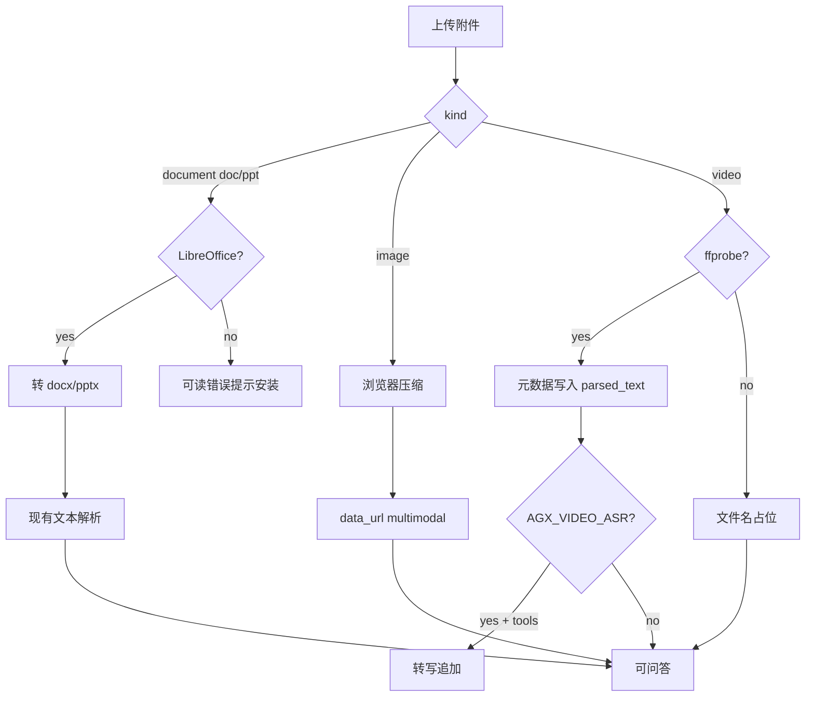

# Portal 附件解析对齐：旧版 Office + 大图压缩 + 视频可用性硬化

Planned-with: cursor-grok-4.5  
Suggested-Impl-Model: composer-2.5-fast（主路径：BFF 解析/单测/前端压缩）；若接入 ffmpeg/Whisper CLI 环境探测与超时编排，收口可用 gpt-5.x 档

> **For implementer:** REQUIRED SUB-SKILL: Use `executing-plans` / TDD. Composer 2.5 应能在不看对话上下文的前提下仅凭本文落地。

**Goal:** 缩小 Enterprise 前台附件能力与产品提示文案（「PDF、Word、Excel、PPT、图片及视频；最多 50、单文件 100MB」）之间的真实差距：支持旧版 `.doc`/`.ppt`（本机 LibreOffice 转换后复用现有解析）、允许大图上传但经压缩后仍可走现有 vision data URL 链路、视频从「仅文件名」升级为可检测的元数据/可选 ASR 文本注入。

**Architecture:** 解析仍收敛在 `enterprise/apps/web-portal` 的 BFF `POST /api/chat/attachments/parse` + `lib/attachment-parse.ts`。旧版 Office 在解析前可选调用本机 `soffice`/`libreoffice` 转为 `.docx`/`.pptx` 再走现有 mammoth/JSZip 路径；大图在浏览器侧压缩后再生成 data URL，避免抬高 PG metadata / sanitize 的 data URL 上限；视频在 Node 侧用 `ffprobe`（可选）抽时长/编码，有 `whisper`/`ffmpeg` 时再做短音频转写，否则返回结构化「可问答」占位文本（含时长与明确限制说明）。

**Tech Stack:** Next.js BFF（nodejs runtime）、`child_process` + LibreOffice CLI、浏览器 Canvas/`createImageBitmap` 压缩、可选 `ffprobe`/`ffmpeg`、vitest。

---

## 背景与根因（证据链）

当前（commit 系列含 `2026-07-28-portal-composer-plus-attachments`）已对齐：

- 上限：`MAX_ATTACHMENTS = 50`、`MAX_FILE_BYTES = 100MB`（`composer-attachment.ts`）
- UI 文案：`filesAndImagesHint`（zh/en）写「PDF、Word、Excel、PPT、图片及视频」
- 正文解析：`attachment-parse.ts` 支持 pdf / docx / xlsx·xls·csv / pptx / txt·md·json

差距：

| 能力 | 现状落点 | 用户感知问题 |
|------|----------|--------------|
| `.doc` | `attachment-parse.ts` L94–95 直接 `throw` | 可选中但解析失败 |
| `.ppt` | 同文件 L104–105 直接 `throw` | 同上 |
| 图片 | `MAX_IMAGE_BYTES = 5MB`（`useComposerAttachments.ts` L123–125）；sanitize `MAX_ATTACHMENT_DATA_URL_CHARS = 8_000_000`（`chat-message-sanitize.ts`） | 文案写 100MB，图片 5MB 即拒 |
| 视频 | `kind: video` 仅注入文件名占位（`attachment-parse.ts` L80–86） | 「支持视频」名不副实 |

原 plan 已把旧版 Office、视频深度解析标为 Out of scope；本 plan 单独收口这些差距，**不重做**加号菜单 / 分栏预览 / citations 清理。

---

## 推荐实施模型（子任务）

| 子任务 | Suggested-Impl-Model | 理由 |
|--------|----------------------|------|
| Wave A：LibreOffice 转换 + parse 单测 | composer-2.5-fast / kimi-k2.5 | 样板 CLI 封装 + 分支扩展 |
| Wave B：浏览器大图压缩 + 常量/文案 | composer-2.5-fast | 前端纯函数 + hook 接线 |
| Wave C：ffprobe 元数据 + 可选 ASR | composer-2.5-fast；超时/并发收口可用 gpt-5.x | 环境探测与失败降级需谨慎 |
| 跨栈验收 / 边界文案 | composer-2.5-fast | 对照 AC 自测即可 |

最终 `Impl-Model` trailer 以实际使用为准。

---

## In scope / Out of scope

**In scope（Enterprise 前台用户端 only）**

1. **Wave A — 旧版 Office**
   - `.doc` → LibreOffice → `.docx` → 现有 `extractDocx`
   - `.ppt` → LibreOffice → `.pptx` → 现有 `extractPptx`
   - 未安装 LibreOffice 时返回可读错误（含安装提示：`brew install --cask libreoffice`），**禁止**静默当成功
2. **Wave B — 大图**
   - 上传入口允许图片 ≤ `MAX_FILE_BYTES`（100MB）
   - 发送前浏览器压缩到「可嵌入 data URL」预算（见 FR-2），保留 vision multimodal
   - 更新/校正 UI hint，避免承诺「图片 100MB 原样进模型」
3. **Wave C — 视频可用性**
   - 有 `ffprobe`：写入时长/编码到 `parsed_text`
   - 有 `ffmpeg`+可选 Whisper（或等价 CLI，由 env 开关）：对 ≤N 分钟音频做转写注入
   - 无工具：仍可上传，文案明确「仅元数据/文件名，未解析画面」
4. 单测 + i18n 文案同步（zh/en）

**Out of scope（禁止顺手改）**

- Desktop Machi / `agenticx/studio` / LiteParseAdapter
- 完整视频多模态理解、云端 ASR 厂商对接、对象存储上传图片 URL
- 抬高 `MAX_ATTACHMENT_DATA_URL_CHARS` 到可塞 100MB 原图（会炸 PG metadata / 请求体）
- 插件/技能菜单、联网搜索、深度研究
- admin-console
- 修改 `agenticx/studio/server.py` import 区

---

## 精确落点

| 层 | 路径 | 改动意图 |
|----|------|----------|
| Parse core | `enterprise/apps/web-portal/src/lib/attachment-parse.ts` | 接入 legacy convert；视频分支增强 |
| LibreOffice helper | **新建** `enterprise/apps/web-portal/src/lib/office-convert.ts` | `convertLegacyOffice(buffer, ext) → Buffer` |
| Video probe | **新建** `enterprise/apps/web-portal/src/lib/video-probe.ts` | ffprobe/ffmpeg/whisper 探测与转写 |
| BFF | `enterprise/apps/web-portal/src/app/api/chat/attachments/parse/route.ts` | 透传错误；可选 timeout（默认 60s/文件） |
| 压缩 | **新建** `enterprise/features/chat/src/utils/compress-image.ts` | `compressImageFile(file) → { blob, dataUrl }` |
| Hook | `enterprise/features/chat/src/hooks/useComposerAttachments.ts` | 图片走压缩；取消硬拒 5MB（改为压后仍超预算再报错） |
| 常量 | `enterprise/features/chat/src/types/composer-attachment.ts` | 调整注释与可选 `MAX_IMAGE_DATA_URL_BYTES` |
| Sanitize | `enterprise/apps/web-portal/src/lib/chat-message-sanitize.ts` | **默认不抬** 8e6；仅当压缩后仍偶发超限时保持现有错误文案 |
| i18n | `enterprise/apps/web-portal/messages/zh.json` / `en.json` | hint 诚实化 |
| 测试 | `attachment-parse.test.ts`、**新建** `office-convert.test.ts`、`compress-image.test.ts`、`video-probe.test.ts` | mock `execFile` / canvas |

---

## FR / AC

### FR-1 旧版 Word/PPT 可解析（有 LibreOffice 时）

**Before（锚点 `attachment-parse.ts`）：**

```ts
} else if (ext === "doc") {
  throw new Error("暂不支持旧版 .doc，请另存为 .docx 后上传");
}
// ...
} else if (ext === "ppt") {
  throw new Error("暂不支持旧版 .ppt，请另存为 .pptx 后上传");
}
```

**After 意图：**

```ts
} else if (ext === "doc") {
  const converted = await convertLegacyOffice({ buffer: file.buffer, fromExt: "doc", toExt: "docx" });
  text = await extractDocx(converted);
} else if (ext === "ppt") {
  const converted = await convertLegacyOffice({ buffer: file.buffer, fromExt: "ppt", toExt: "pptx" });
  text = await extractPptx(converted);
}
```

`convertLegacyOffice`：

1. `resolveLibreOfficeBin()`：依次试 `process.env.LIBREOFFICE_BIN`、`soffice`、`libreoffice`（`which`/`where`）
2. 写入 `os.tmpdir()/agx-office-<ulid>.doc`，`execFile(bin, ["--headless","--nologo","--nofirststartwizard","--convert-to", toExt, "--outdir", dir, inputPath], { timeout: 60_000 })`
3. 读出转换产物；finally 清理临时文件
4. bin 不存在 → throw：`未检测到 LibreOffice，无法解析旧版 .doc/.ppt。macOS 可执行：brew install --cask libreoffice`

**AC-1**

- `pnpm -C enterprise/apps/web-portal test src/lib/office-convert.test.ts`：mock `execFile` 成功路径返回 buffer；bin 缺失路径错误含 `LibreOffice`
- 本机装了 LibreOffice 时：手工上传真实 `.doc`（可用最小 fixture）→ 聊天可总结；右侧预览有正文
- 未安装时：UI 错误可读，非 500

### FR-2 大图可上传，压缩后进 vision

**常量建议（`composer-attachment.ts`）：**

```ts
export const MAX_FILE_BYTES = 100 * 1024 * 1024; // 不变
/** 压缩后 data URL 字节预算（对齐 sanitize ≈ 8e6，留安全余量） */
export const MAX_IMAGE_DATA_URL_CHARS = 7_500_000;
/** @deprecated 不再作为上传硬拒阈值；保留别名以免外部误用 */
export const MAX_IMAGE_BYTES = MAX_FILE_BYTES;
```

**`compress-image.ts` 伪代码意图：**

```ts
export async function compressImageForChat(file: File): Promise<{ dataUrl: string; mimeType: string; size: number }> {
  // 1) createImageBitmap / Image
  // 2) 最长边 ≤ 2048（或 3072），canvas draw
  // 3) toBlob('image/jpeg', quality 从 0.85 递减到 0.5) 直至 dataUrl.length ≤ MAX_IMAGE_DATA_URL_CHARS
  // 4) 仍超限 → throw 可读错误
}
```

**`useComposerAttachments` before：** 图片 `file.size > 5MB` 直接 setError。  
**After：** 图片 ≤ 100MB 进入 slot；`compressImageForChat` → `dataUrl`；失败 mark `error`。

**AC-2**

- 单元：给定 fake canvas / stub，质量递减直到满足长度
- 手工：上传 ~8–20MB JPEG → 可发送且 vision 模型能描述；历史落库不触发 `attachment data_url too large`
- 非视觉模型：仍走现有「模型不支持该文件类型」拦截（不要改 vision 判定文件）

### FR-3 视频：元数据 + 可选转写

**`video-probe.ts`：**

```ts
export type VideoParseResult = {
  parsedText: string;
  usedTools: Array<"ffprobe" | "ffmpeg" | "whisper">;
};

export async function parseVideoAttachment(file: { name: string; buffer: Buffer }): Promise<VideoParseResult>
```

行为优先级：

1. `ffprobe -v quiet -print_format json -show_format -show_streams` → 时长、codec、分辨率写入 Markdown 块
2. 若 `AGX_VIDEO_ASR=1` 且检测到 `ffmpeg` + Whisper CLI（`AGX_WHISPER_BIN` 或 `whisper`）：
   - 仅当时长 ≤ `AGX_VIDEO_ASR_MAX_SECONDS`（默认 180）时抽音频并转写，截断进 `MAX_PARSED_TEXT_CHARS`
3. 否则 `parsedText` 仍含文件名 + ffprobe 摘要 +「未解析画面/未转写」说明（可被模型引用）

**`attachment-parse.ts` 视频分支** 改为 `await parseVideoAttachment(...)`，不再写死仅文件名。

**AC-3**

- mock：无 ffprobe → 与现状等价的友好占位（含文件名）
- mock：有 ffprobe JSON → `parsed_text` 含 `duration`
- mock：ASR 开启但超时 → 降级到元数据，不 500
- 手工：上传短 mp4，助手能回答「这个视频大概多长」类问题（有 ffprobe 时）

### FR-4 文案诚实化

`zh.json` `filesAndImagesHint` 建议：

```text
支持 PDF、Word（含旧版 .doc，需本机 LibreOffice）、Excel、PPT（含旧版 .ppt）、图片及视频。最多 50 个文件（单个不超过 100MB；大图会自动压缩后供视觉模型使用；视频默认提取元数据，完整转写需额外工具）。
```

`en.json` 同步。Tooltip 过长时可两行：主句对齐 Kimi，次行小字说明限制——**以不误导「100MB 原图原样进模型」为准**。

**AC-4：** `+` →「文件和图片」hover 文案含 LibreOffice / 压缩 / 视频元数据语义之一，且无「插件/技能」。

---

## 实施任务拆解（TDD）

### Task 1: `office-convert` 纯函数 + 失败单测

**Files:**

- Create: `enterprise/apps/web-portal/src/lib/office-convert.ts`
- Create: `enterprise/apps/web-portal/src/lib/office-convert.test.ts`

**Steps:** 写失败用例（bin missing）→ 实现 resolve+execFile mock → 绿 → commit。

### Task 2: 接入 `parseAttachmentFile` 的 `.doc`/`.ppt`

**Files:**

- Modify: `enterprise/apps/web-portal/src/lib/attachment-parse.ts`（doc/ppt 分支）
- Modify: `enterprise/apps/web-portal/src/lib/attachment-parse.test.ts`（mock convert 成功/失败）

**Steps:** 先改测试期望 → 接线 → `pnpm -C enterprise/apps/web-portal test src/lib/attachment-parse.test.ts` 绿。

### Task 3: `compress-image` + hook

**Files:**

- Create: `enterprise/features/chat/src/utils/compress-image.ts`
- Create: `enterprise/features/chat/src/utils/compress-image.test.ts`（jsdom/vitest stub）
- Modify: `enterprise/features/chat/src/hooks/useComposerAttachments.ts`
- Modify: `enterprise/features/chat/src/types/composer-attachment.ts`

**Steps:** 去掉 5MB 硬拒；图片路径 await compress；超预算 errorText 中文可读。

### Task 4: `video-probe` + parse 视频分支

**Files:**

- Create: `enterprise/apps/web-portal/src/lib/video-probe.ts`
- Create: `enterprise/apps/web-portal/src/lib/video-probe.test.ts`
- Modify: `attachment-parse.ts` 视频分支

**Steps:** 默认路径无外部依赖可测；ASR 整段用 env 门控，默认关。

### Task 5: i18n + 手工验收清单

**Files:**

- Modify: `enterprise/apps/web-portal/messages/zh.json`、`en.json`

**手工清单：**

1. docx/pdf 回归不受影响  
2. `.doc`（有/无 LibreOffice）  
3. 大图 10MB+  
4. mp4 短视频  
5. sanitize 落库后刷新会话，附件仍可预览  

### Task 6: Commit

```text
feat(portal-chat): 旧版 Office 转换、大图压缩与视频元数据解析

Plan-Id: 2026-07-28-portal-attachment-parse-parity
Plan-File: .cursor/plans/2026-07-28-portal-attachment-parse-parity.plan.md
Plan-Model: <规划模型>
Impl-Model: <实施模型>
Made-with: Damon Li
```

实施前将本文件从 `pending/` **移回** `.cursor/plans/` 根目录再开分支。

---

## 风险与降级



- LibreOffice / ffmpeg **不打进** Next 镜像为硬依赖；缺失必须降级，不能拖垮 `agx`/portal 启动。
- 转换与 ASR 必须有 timeout，防止 BFF 挂死。
- 并发：单次 parse 请求仍限 `MAX_FILES_PER_REQUEST = 10`；每个 legacy 转换串行即可（Wave A）。

---

## 验收总表

| ID | 断言 |
|----|------|
| AC-1 | 有 LibreOffice 时 `.doc`/`.ppt` 可总结；无则明确错误 |
| AC-2 | >5MB 且 ≤100MB 图片可发；落库不超 data URL 上限 |
| AC-3 | 视频至少元数据或诚实占位；ASR 默认关且可开 |
| AC-4 | 菜单 hint 与真实能力一致 |
| AC-5 | 既有 pdf/docx/xlsx/pptx/md 回归测试全绿 |

---

## 与既有 plan 关系

- 前置：`.cursor/plans/2026-07-28-portal-composer-plus-attachments.plan.md`（已实现基础解析与 UI）
- 本 plan：**增量硬化**，不重复加号菜单 / 分栏预览 / `[N]` 清理工作
