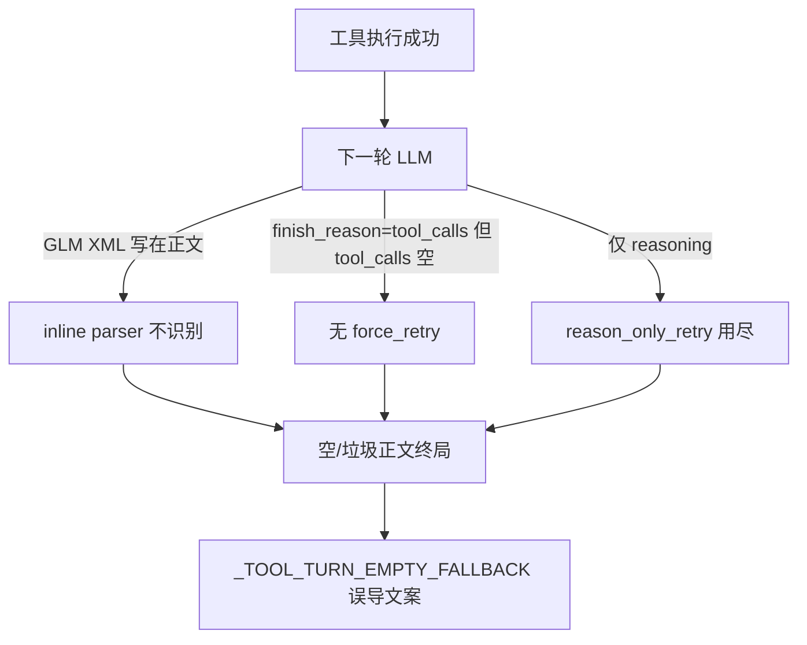

# Tool-turn 空正文兜底硬化（GLM XML 内联解析 + empty tool_calls 强制重试 + 成功态文案）

Planned-with: cursor-grok-4.5
Suggested-Impl-Model: gpt-5.6-terra-medium（跨 runtime 收口/序列敏感；单测与纯解析子项可下放 composer-2.5-fast / kimi-k2.5）

> **For implementer:** REQUIRED SUB-SKILL: Use `executing-plans` / TDD. Composer 2.5 应能在不看对话上下文的前提下仅凭本文落地。

**Goal:** 消除「工具已成功但模型下一轮无可见正文 / 无可用 tool_calls」时过早抛出的误导性兜底文案，并补齐 GLM XML 内联 tool_call 解析与大 payload 截断缓解，使长调研类任务能自动续跑到真正终局。

**Architecture:** 全部改动收敛在 `agenticx/runtime/agent_runtime.py` 的回合收口路径 + 既有纯函数解析器；不改 provider 流式实现、不改 Desktop UI 结构。用「解析 → 强制重试 → 多档 nudge → 区分成功/失败兜底 → 写文件分块预算」五层防御，对症两条真实 session 复现路径。

**Tech Stack:** Python 3.12、`AgentRuntime`、`pytest`（`tests/test_agent_runtime_inline_tool_call.py`、`tests/test_reasoning_only_turn_retry.py`、`tests/test_smoke_streaming_tool_truncation.py`）

---

## 背景与根因（证据链，实施者无需回看对话）

### 症状
同一调研任务在两模型上第一轮都落到：

> 工具已经跑完，但我没能说明结果。请展开上方工具卡片查看成功或失败原因，再告诉我下一步。

用户误以为工具失败；实际上工具大多 `exit_code=0` / `OK: wrote …`。

### 复现 session（只读证据，测试勿依赖本机路径存在）

| Session | 模型 | 终局 metadata | 真实情况 |
|---------|------|---------------|----------|
| `006cad6f-a39f-478c-8f90-e67b2c379e0a` | glm-5.2 | 中途：`terminal_reason=tool_turn_empty_fallback` + `protocol_errors=["unclosed_think"]`；续跑终局：`model_final` 但正文含未执行的 `<tool_call>file_edit…` | 调研已完成大半；`file_edit` 以 GLM XML 方言写在正文里，runtime 未派发 |
| `483a28dd-38bd-47ee-a239-fbb41044496d` | kimi-k2.6 | `terminal_reason=tool_turn_empty_fallback`，`model_finish_reason=tool_calls`，`had_tool_calls=true`，`protocol_errors=[]` | 21 轮工具成功后，下一轮声称 `tool_calls` 但结构化调用为空；`reason_only_retry` 额度已用尽 → 立刻兜底 |

落盘位置：`~/.agenticx/sessions/<id>/{messages.json,agent_messages.json}`。

### 根因分层

1. **P0-A（GLM）**：`_extract_inline_tool_call`（`agenticx/runtime/agent_runtime.py` ≈ L1444–1524）只认 `<tool_code>` / JSON / `name(...)`，不认智谱常见正文方言：
   ```text
   <tool_call>file_edit<arg_key>…</arg_key><arg_value>…</arg_value></tool_call>
   ```
   且 GLM 常把参数名写成 `new_str`/`old_str`，而 schema 要 `new_text`/`old_text`（见 `agenticx/cli/agent_tools.py` L685–699）。即使解析成功也必须做别名归一。

2. **P0-B（Kimi）**：`force_retry_next_round` 仅在「required 参数为空 → 判截断」时置位（≈ L3313–3351 / L3945–3951）。若 `finish_reason == tool_calls` 但流里没有任何有效 tool_call（名字非法被丢、或根本无 deltas），**不会** force_retry，直接进入空正文终局。

3. **P1-A**：`reason_only_retry < 1`（≈ L2747–2749 / L4066–4089）整轮只 nudge 一次。Kimi 中途已用掉额度后，末轮再沉默即兜底。

4. **P1-B**：成功工具后的兜底文案 `_TOOL_TURN_EMPTY_FALLBACK`（≈ L1648–1651）与失败文案语义混淆；`_user_facing_tool_error_fallback` 只在 ERROR 时给清晰说明，成功静默时仍说「查看成功或失败原因」。

5. **P2**：流式路径默认 `max_tokens=8192`（≈ L3107–3114）；大 `file_write`/`file_edit`/`bash_exec` 易触发「参数为空被丢弃」系统通知。缺少写文件分块引导与写操作轮次 token 抬升。

### 触发链路（现状）



---

## In scope / Out of scope

**In scope**
- `agenticx/runtime/agent_runtime.py`：`_extract_inline_tool_call`、empty-`tool_calls` force retry、`reason_only_retry` 额度、成功态兜底文案、写文件轮 `max_tokens` 抬升与截断后分块 hint
- `agenticx/cli/agent_tools.py`：`_repair_malformed_file_tool_arguments` 增加 `old_str`/`new_str`/`old_string`/`new_string` → `old_text`/`new_text` 别名（供结构化 tool_calls 路径，与 inline 归一一致）
- 单测：扩展既有三个测试文件；必要时新增 `tests/test_tool_turn_empty_force_retry.py`

**Out of scope（禁止顺手改）**
- 不改任何 LLM provider 的 `stream_with_tools` 实现
- 不改 Desktop/`ChatPane`/`ChatView` UI 结构（文案若仅后端落盘即可被现有气泡展示）
- 不改 `max_tool_rounds` 默认值、不改 `server.py` 顶部 import
- 不改 `_recover_public_completion_from_reasoning` 的公开摘要启发式（除非为接 `reasoning_content` 补一行候选源，见 P1-A 可选小补丁）
- 不做 OpenHuman 调研任务本身的内容产出

---

## 子规划 → 推荐实施模型

| 子规划 | Suggested-Impl-Model | 理由 |
|--------|----------------------|------|
| P0-A GLM XML 解析 + 别名 | composer-2.5-fast | 纯函数 + 单测，样板清晰 |
| P0-B empty tool_calls force retry | gpt-5.6-terra-medium | 触及 runtime 主循环序列，误报代价高 |
| P1-A reason_only 额度 | composer-2.5-fast | 局部计数器改动 |
| P1-B 成功态兜底文案 | composer-2.5-fast | 文案 + 小 helper |
| P2 max_tokens / 分块 hint | kimi-k2.5 或 composer-2.5-fast | 局部预算与 hint 字符串 |
| 收口回归 / 跨文件联调 | gpt-5.6-terra-medium | 跑全相关 pytest 并核对无回归 |

---

## 需求

### FR-P0-A：解析 GLM / 类 GLM 正文内联 `<tool_call>`

**落点：** `agenticx/runtime/agent_runtime.py` 函数 `_extract_inline_tool_call`（约 L1444）。

**Before：** 仅 `<tool_code>` / JSON / `name(args)`。  
**After：** 在现有逻辑之前（或 JSON 失败之后、`name(` 扫描之前）增加分支：

1. 用正则提取第一个完整块：
   ```python
   _GLM_TOOL_CALL_RE = re.compile(
       r"<tool_call>\s*([A-Za-z0-9_./-]+)\s*(.*?)\s*</tool_call>",
       re.IGNORECASE | re.DOTALL,
   )
   ```
2. `name` 必须 ∈ `allowed_tool_names`，否则忽略该块继续找下一个（本函数仍返回「第一个可用」；若实现循环则取第一个合法）。
3. 参数解析支持两种形态（必须都测）：
   - **规范：** `<arg_key>path</arg_key><arg_value>/tmp/a</arg_value>`
   - **粘连脏格式（真实 session）：** `<arg_key>new_str: …html…</arg_value>`（缺少独立 `</arg_key>`），用：
     ```python
     _GLM_ARG_PAIR_RE = re.compile(
         r"<arg_key>\s*([^<:\n]+?)\s*(?::\s*)?(?:</arg_key>\s*<arg_value>)?(.*?)</arg_value>",
         re.IGNORECASE | re.DOTALL,
     )
     ```
     或等价的两段式解析：先找所有 `</arg_value>` 边界，再从 `<arg_key>` 取 key（取到 `:` 或 `</arg_key>` 或换行前）。
4. **别名归一**（同一函数内小 helper `_normalize_file_tool_arg_aliases`）：
   - `old_str` / `old_string` → `old_text`
   - `new_str` / `new_string` → `new_text`
   - `content` 保持；`path` 保持
   - 仅当目标键缺失时写入，不覆盖已存在的规范键

**同步落点：** `agenticx/cli/agent_tools.py` `_repair_malformed_file_tool_arguments`（约 L7515）：在 `file_edit` 分支开头，先把别名键 rename 到 `old_text`/`new_text`，再跑现有 extra_keys 清理。避免结构化路径里 `new_str` 被当成 noise 丢掉。

**伪代码（插入点在 JSON 分支之后）：**

```python
glm_match = _GLM_TOOL_CALL_RE.search(text)
if glm_match:
    name = glm_match.group(1).strip()
    if name in allowed_tool_names:
        args = _parse_glm_arg_key_value_body(glm_match.group(2))
        args = _normalize_file_tool_arg_aliases(name, args)
        return {"name": name, "arguments": args}
# ... existing name(args) scan ...
```

**AC-P0-A**
- `tests/test_agent_runtime_inline_tool_call.py` 新增：
  - `test_extract_glm_xml_tool_call_file_edit_canonical`：规范 arg_key/arg_value → `file_edit` + `path`/`old_text`/`new_text`
  - `test_extract_glm_xml_tool_call_sticky_new_str_alias`：粘连 `new_str:` 脏格式 + 别名归一
  - `test_extract_glm_xml_ignores_unknown_tool_name`：未知工具名返回 `None`（或不命中该块）
- `tests/test_smoke_streaming_tool_truncation.py` 或新建单测：`_repair_malformed_file_tool_arguments("file_edit", {"path":"p","old_str":"a","new_str":"b"})` → 含 `old_text`/`new_text`
- 回归：既有 `test_extract_inline_tool_call_*` / sanitize 测试全绿

---

### FR-P0-B：`finish_reason=tool_calls` 但无可用 tool_calls → 强制下一轮

**落点：** `agenticx/runtime/agent_runtime.py` 主循环，紧接现有：

```python
if force_retry_next_round and not tool_calls:
    ...
    continue
```

（约 L3945–3951）之后、`if not tool_calls: inline_tool = ...` 之前或之后（**必须在 inline 解析之后**，避免 GLM XML 本可转成 tool_calls 却被误判为空）。

**After 意图：**

```python
# After inline extraction attempt
model_finish_reason = _response_finish_reason(response)
_fr = str(model_finish_reason or "").strip().lower()
if (
    not tool_calls
    and _fr in {"tool_calls", "tool_call", "function_call", "functions"}
    and not getattr(session, "_empty_tool_calls_retry_used", False)
):
    setattr(session, "_empty_tool_calls_retry_used", True)
    hint = (
        "[系统通知] 上一轮 finish_reason 表明模型要调用工具，但没有收到完整可用的 tool_call。"
        "请立即重新发出明确的 tool_call（补全所有 required 参数）；"
        "若已无需工具，请直接给出用户可见的最终说明。"
    )
    messages.append({"role": "system", "content": hint})
    session.agent_messages.append({"role": "system", "content": hint})
    yield RuntimeEvent(
        type=EventType.ROUND_END.value,
        data={
            "round": round_idx,
            "max_rounds": self.max_tool_rounds,
            "auto_retry": True,
            "reason": "empty_tool_calls_with_tool_finish",
        },
        agent_id=agent_id,
    )
    continue
```

**约束：**
- 每用户轮最多自动重试 **1 次**（用 session 标志；新 user turn 开始时应清除——在 `run()` 入口 `executed_tool_names = []` 同级重置 `setattr(session, "_empty_tool_calls_retry_used", False)`）。
- 不得在已有非空 `ac_clean` 时强制吞掉终局（仅当 `not tool_calls`；若同时有可见正文，**允许**走终局——真实 GLM 终局有正文+XML 时，应由 P0-A 先转成 tool_calls；若 P0-A 失败且正文非空，保持现有 `model_final`，不在本 FR 强制 retry，避免死循环）。
- **补充：** 若 `not tool_calls` 且 `not ac_clean.strip()` 且 `_fr in tool_calls集合`，即使上面 session 标志已用尽，仍走后续 reasoning-only / empty fallback（现状）；本 FR 只多给 1 次续命。

**AC-P0-B**
- 新增测试（建议 `tests/test_tool_turn_empty_force_retry.py` 或扩 `test_reasoning_only_turn_retry.py`）：
  1. Fake LLM：第 1 轮返回 `finish_reason=tool_calls` + 空 tool_calls + 空 content；第 2 轮返回正常正文 → 最终正文为第 2 轮，且 `llm.calls == 2`
  2. 两轮都空 tool_calls + tool_calls finish → 最终仍可落到 `_TOOL_TURN_EMPTY_FALLBACK` 或成功态新文案（P1-B），且 `calls == 2`（只多 1 次）
  3. 第 1 轮空 tool_calls 但 `finish_reason=stop` + 空正文 → **不**因本 FR 强制 retry（仍可走 reason_only）

---

### FR-P1-A：工具已执行后提高 reasoning-only nudge 额度

**落点：** `agenticx/runtime/agent_runtime.py` ≈ L4064–4089。

**Before：**
```python
and reason_only_retry < 1
```

**After：**
```python
_reason_only_budget = 3 if executed_tool_names else 1
...
and reason_only_retry < _reason_only_budget
```

**可选小补丁（同属本 FR，推荐做）：** `_recover_public_completion_from_reasoning` 的候选源在 ≈ L3968 扩为：
```python
reasoning_candidate = (
    parsed.reasoning
    or _nonstream_reasoning
    or reasoning_for_tool_call  # 已有局部变量时用；注意顺序：本段在 reasoning_for_tool_call 赋值之前则把 recovery 挪到赋值后
    or reasoning_before_nudge
)
```
若挪动成本高，可只做 budget 扩容，recovery 保持不动。

**AC-P1-A**
- 扩 `tests/test_reasoning_only_turn_retry.py`：
  - 工具成功后连续 2 次 reasoning-only，第 3 次给正文 → 成功（`calls` 相应增加，nudge 触发 2 次）
  - 无工具时仍只 nudge 1 次（保持现有 `test_*` 行为）

---

### FR-P1-B：成功工具静默 vs 失败工具 — 区分兜底文案

**落点：**
- 常量 `_TOOL_TURN_EMPTY_FALLBACK`（≈ L1648）
- 新增 helper `_user_facing_tool_success_silence_fallback(messages, executed_tool_names, disk_write_paths) -> str`
- 终局分支 ≈ L4234–4241：仅当 `_user_facing_tool_error_fallback` 为 `None` 时用成功态文案，不再用「查看失败原因」句式

**成功态文案要求（中文，面向用户）：**
```text
工具已执行完成，但模型没有给出总结说明。
最近工具：`file_read`, `list_files`（最多列 5 个，倒序去重）
若已写入文件：附「产物路径：`…`」（来自 disk_write_paths，最多 3 个）
请直接回复「继续」让我基于已有结果完成说明，或告诉我下一步。
```

失败路径保持 `_user_facing_tool_error_fallback` 优先。

**metadata：** `terminal_reason` 成功静默仍可用 `tool_turn_empty_fallback`（避免前端枚举爆炸），但 `terminal_metadata` 增加：
```python
"tool_silence_kind": "success" | "error"
```
（error 时若走了 `_user_facing_tool_error_fallback` 则 `"error"`；否则成功静默为 `"success"`）。

**AC-P1-B**
- 单元测 helper：无 ERROR 工具结果 + `executed_tool_names=["file_read"]` → 文案含「没有给出总结」且**不含**「失败原因」
- ERROR 工具结果 → 仍走原「没法修改… / 工具 xxx 没有成功」
- 既有 `test_reasoning_only_after_tool_triggers_fallback_placeholder`：断言改为接受新成功态文案（「没有给出总结」或保留对「工具已经跑完」的兼容——**推荐直接改断言到新文案**，旧常量可删或改为调用 helper）

---

### FR-P2：写文件轮抬升 max_tokens + 截断后分块 hint

**落点 A — max_tokens：** `agenticx/runtime/agent_runtime.py` 流式 ≈ L3107–3114 与 invoke ≈ L3412–3414（两处必须一致）。

```python
_base = int(getattr(session, "_max_tokens_override", None) or 8192)
_recent = executed_tool_names[-8:]
_write_heavy = any(n in {"file_write", "file_edit"} for n in _recent) or (
    # 本轮尚未执行、但上一轮系统 hint 已要求重写文件时也抬升
    any("file_write" in str(m.get("content", "")) or "file_edit" in str(m.get("content", ""))
        for m in messages[-3:] if isinstance(m, dict) and m.get("role") == "system")
)
_max_tokens = min(32768, _base * 2) if _write_heavy else _base
# MiniMax 仍遵守现有 min(4096, ...) 上限，不要破坏厂商约束
```

更稳妥的最小实现（推荐，避免扫 system 文案）：
```python
_write_heavy = any(n in {"file_write", "file_edit"} for n in executed_tool_names[-8:])
_max_tokens = min(16384, max(_base, 12288)) if _write_heavy else _base
```

**落点 B — 分块 hint：** `_build_streamed_tool_truncation_hint`（≈ L794–808）。

当 `truncated_tool_names` 与 `{"file_write","file_edit"}` 有交集时，hint 追加：
```text
请改用小块写入：file_write 先写骨架（< 80 行），再用多次 file_edit 追加章节；
单次 new_text/content 建议不超过 120 行，禁止一次生成完整长 HTML。
```

**AC-P2**
- 单测 `_build_streamed_tool_truncation_hint(["file_write"])` 含「小块写入」或「file_edit 追加」
- 单测 `_build_streamed_tool_truncation_hint(["bash_exec"])` **不含**该追加段
- max_tokens：用轻量单元测抽一层 helper（推荐新建 `_resolve_round_max_tokens(base, recent_tools, provider) -> int`），避免为测 token 起整轮 runtime：
  - `recent=["file_read"]` → 8192
  - `recent=["file_write"]` → ≥12288 且 ≤16384
  - provider=minimax 时仍 ≤4096（若 helper 接收 provider；否则在调用点保留现有 minimax clamp，单测只测 helper）

---

## 实施任务顺序（TDD）

### Task 1 — P0-A 解析器单测先红后绿
1. 在 `tests/test_agent_runtime_inline_tool_call.py` 写入 AC-P0-A 三个用例（含粘连脏格式样本，可从本 plan 附录复制）。
2. `pytest tests/test_agent_runtime_inline_tool_call.py -v` → 新用例 FAIL。
3. 实现 `_parse_glm_arg_key_value_body` / `_normalize_file_tool_arg_aliases` / 扩展 `_extract_inline_tool_call`。
4. 扩展 `_repair_malformed_file_tool_arguments` 别名。
5. 单测全绿。

### Task 2 — P0-B empty tool_calls force retry
1. 写 Fake LLM 集成测（AC-P0-B）。
2. 在 inline 解析之后插入 force retry；run 入口重置标志。
3. 绿。

### Task 3 — P1-A / P1-B
1. 改 `reason_only` budget + 成功态 fallback helper + 终局分支接线。
2. 更新 `test_reasoning_only_turn_retry.py` 断言。
3. 绿。

### Task 4 — P2
1. 抽 `_resolve_round_max_tokens`；改 truncation hint；接线两处 max_tokens。
2. 单测绿。

### Task 5 — 回归收口
```bash
pytest \
  tests/test_agent_runtime_inline_tool_call.py \
  tests/test_reasoning_only_turn_retry.py \
  tests/test_smoke_streaming_tool_truncation.py \
  tests/test_tool_turn_empty_force_retry.py \
  tests/test_agent_runtime.py \
  -q
```
期望：全绿。若改了 `server.py`（本 plan 不应改），必须冷启动 smoke——**本 plan 禁止改 server.py**。

---

## 附录：GLM 粘连脏格式最小样本（供单测）

```text
骨架已写入。现在追加第一部分。<tool_call>file_edit<arg_key>new_str:          <div class="section">hi</div></arg_value><arg_key>old_str:          <div id="content"></div></arg_value><arg_key>path</arg_key><arg_value>/tmp/openhuman-architecture.html</arg_value></tool_call>
```

期望解析：
```python
{
  "name": "file_edit",
  "arguments": {
    "path": "/tmp/openhuman-architecture.html",
    "old_text": "          <div id=\"content\"></div>",
    "new_text": "          <div class=\"section\">hi</div>",
  },
}
```

---

## no-scope-creep 检查清单

- [ ] 只改本 plan 列出的文件与函数
- [ ] 不「顺手」重构 `parse_assistant_output` / provider
- [ ] 不改 Desktop 组件树
- [ ] 每个 commit 可追溯到 FR-P0-A / P0-B / P1-A / P1-B / P2 之一
- [ ] commit trailer：`Plan-Id` / `Plan-File` / `Plan-Model` / `Impl-Model` / `Made-with: Damon Li`

---

## 验收总表

| ID | 验收 |
|----|------|
| AC-P0-A | GLM XML（规范+粘连）→ 可派发 `file_edit`；别名归一；未知工具忽略 |
| AC-P0-B | `finish_reason=tool_calls` + 空 calls → 自动续 1 轮；第 2 轮可正常终局 |
| AC-P1-A | 有工具史时 reasoning-only 最多 nudge 3 次；无工具史仍 1 次 |
| AC-P1-B | 成功静默文案不再提「失败原因」；ERROR 仍走原清晰文案 |
| AC-P2 | 写文件轮 max_tokens 抬升；file_* 截断 hint 含分块指引 |
| AC-R | 上列 pytest 集合全绿；无 server.py import 改动 |

---

## 开工前

1. 将本文件从 `.cursor/plans/pending/` **移到** `.cursor/plans/2026-07-28-tool-turn-empty-fallback-hardening.plan.md`
2. 开分支：`fix/tool-turn-empty-fallback-hardening`
3. 按 Task 1→5 实施；用户确认 `Plan-Model` / `Impl-Model` 后再 `/commit --spec=...`
