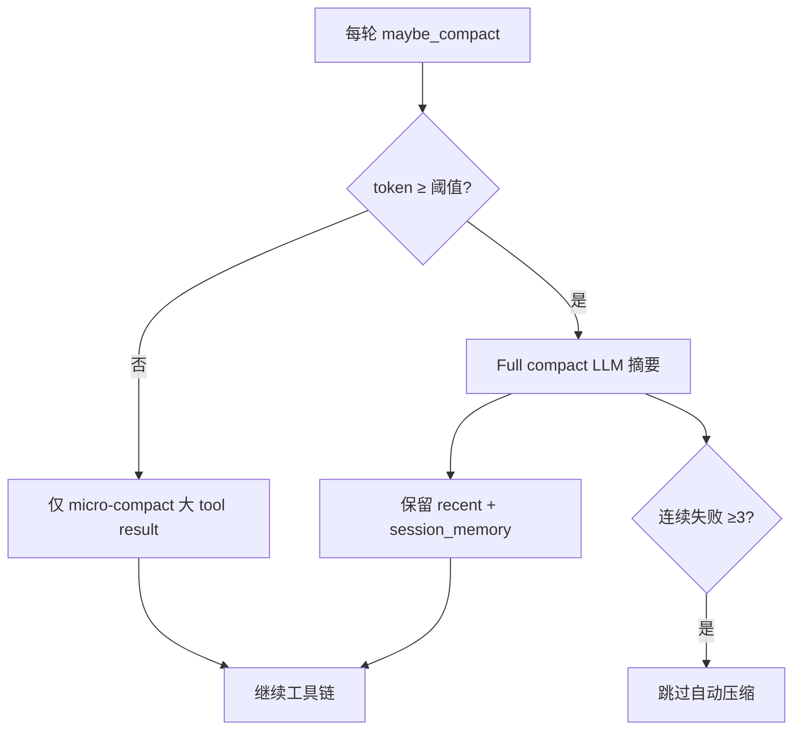

# Context Compaction Token-Window Trigger Alignment

Planned-with: cursor-grok-4.5
Suggested-Impl-Model: gpt-5.6-terra-medium（触发阈值/窗口同源跨模块收口；单测与常量提取可下放 composer-2.5-fast）

> **For implementer:** REQUIRED SUB-SKILL: Use `executing-plans` / TDD. Composer 2.5 应能在不看对话上下文的前提下仅凭本文落地。

**Goal:** 把全量历史压缩（full autocompact）的主触发从「消息条数 > 20 / 字符 > 48k」改为与 Desktop Context chip 同源的 **模型上下文窗口 token 水位**，避免 UI 显示约 50% 占用时后端已多次压缩、丢掉可复用的工具链细节。

**Architecture:** 改动收敛在 `agenticx/runtime/compactor.py` 的 `_should_compact` / 窗口估算，并强制复用已有 `agenticx/runtime/model_context_window.resolve_context_window`；micro-compact 保持现状；full compact 更晚触发；SSE/日志暴露 `trigger_reason`。不重做记忆子系统，不改 Desktop 视觉结构。

**Tech Stack:** Python 3.12、`ContextCompactor`、`resolve_context_window`、`pytest`（`tests/test_compactor.py`、`tests/test_smoke_compactor_rolling.py` 等）

---

## 背景与根因（证据链，实施者无需回看对话）

### 症状
长调研 / 多工具轮次任务中：
- Desktop Context 用量 UI 可显示约 **52%（如 67.1K / 128K）**；
- 同一会话后端已多次触发 `[compacted]` 全量压缩；
- 模型后续「忘记」刚读过的文件细节、重复搜索，或摘要质量导致任务漂移。

### 根因（仓库现状）

`ContextCompactor._should_compact`（`agenticx/runtime/compactor.py` ≈ L212–245）当前为 **OR 三闸门**，任一命中即 full compact：

```212:245:agenticx/runtime/compactor.py
    def _should_compact(
        self,
        messages: Sequence[Dict[str, Any]],
        *,
        model: str = "",
    ) -> bool:
        ...
        if model and self._should_compact_by_tokens(eval_msgs, model):
            return True
        if len(eval_msgs) > self.threshold_messages:
            return True
        total_chars = sum(len(_message_text_for_tokens(item)) for item in eval_msgs if isinstance(item, dict))
        return total_chars > self.threshold_chars
```

默认值（`__init__` ≈ L114–127）：
- `threshold_messages=20`（工具回合每轮常 +2 条：assistant tool_calls + tool result → **约 10 轮工具即触发**）
- `threshold_chars=48_000`（远早于 128K 窗口）
- `token_compact_ratio=0.80`，但 `_get_context_window_chars`（≈ L159–167）默认 `AGX_CONTEXT_WINDOW_CHARS=96_000` 且用 **chars/4** 估 token，与 UI 口径不一致

Desktop / Studio Context chip 已用同源窗口：

```28:34:agenticx/runtime/model_context_window.py
def resolve_context_window(model_name: str | None) -> int:
    """Best-effort lookup of a model's context window size, by substring match."""
    ...
```

`agenticx/studio/context_usage.py` 的 `estimate_session_context_usage` 调用同一 `resolve_context_window`。**Compactor 未用它**，导致「条上剩一半、后台已 compact」。

### 业界对照（内部调研结论；实施以本文 FR 为准）

主流编码 Agent 的分层压缩（代价从低到高）：
1. **Micro-compact**：只清旧 tool result，不动对话结构  
2. **区间折叠 / session-memory 路径**（可选）  
3. **Full autocompact**：LLM 结构化摘要 + 近期消息保留 + 压缩后确定性恢复可重读文件  

触发主轴是 **有效窗口 token 水位**，不是消息条数。常见公式：
- `effective_window = context_window - min(max_output, summary_reserve≈20k)`
- `autocompact_threshold = effective_window - buffer≈13k` → 约 **83%–90%** 窗口占用才 full compact  
- 连续失败 **3** 次熔断（我们已有 `_MAX_CONSECUTIVE_AUTOCOMPACT_FAILURES = 3`）  
- 压缩后恢复近期文件附件，摘要写意图/约束/状态，不写可重读全文  

我们已有：`micro_compact_tool_result`、熔断、`retain_recent_messages`、session_memory / pending_user_question。缺口是 **触发主轴被 message/char 抢跑** + **窗口估算与 UI 不同源**。



---

## In scope / Out of scope

**In scope**
- `agenticx/runtime/compactor.py`：窗口同源、`_should_compact` 主轴改为 token、message/char 降级为 escape hatch、可选 buffer/pct 环境变量、`trigger_reason` 可观测
- 必要时极小改动 `agenticx/runtime/agent_runtime.py`：把 compact SSE/notice 带上 `trigger_reason`（若现有 payload 已有扩展位则复用；否则只打日志亦可满足 AC）
- 单测：更新依赖「20 条即 compact」的断言；新增 token 主触发 / 中等消息数不触发用例
- 配置：环境变量（见 FR）；可选 `config.yaml` `runtime.compaction` 读取（若已有配置路径则对齐，无则仅 env 即可）

**Out of scope（禁止顺手改）**
- 不重做 `WorkspaceMemoryStore` / Learning / FTS 记忆子系统
- 不改 Desktop Context chip UI 布局（可只保证口径一致）
- 不引入远端托管 Compaction API
- 不改 `server.py` 顶部 import
- 不在本 plan 做「压缩后重新注入最近 N 个文件附件」的完整 post-compact restore（可列为 P2 follow-up；本 plan 仅要求触发对齐 + 可观测 + 既有摘要模板不回退）
- 不调整 `TokenBudgetGuard` 的 session 累计 80%/95% 语义（那是会话总消耗预算，不是上下文窗口填充率）

**no-scope-creep：** 每个 diff 必须能追溯到下方 FR；禁止「顺便重构」compactor 摘要 LLM prompt 大改（除非 FR-5 明确要求的最小结构化补强）。

---

## 推荐实施模型

| 子任务 | Suggested-Impl-Model | 理由 |
|--------|----------------------|------|
| FR-1/2 窗口同源 + `_should_compact` 改写 | gpt-5.6-terra-medium | 阈值语义敏感，易与 rolling/cooldown 交互回归 |
| FR-3 env/config 开关 | composer-2.5-fast | 样板读取 |
| FR-4 可观测 trigger_reason | composer-2.5-fast | 小接线 |
| FR-5 摘要模板最小补强（可选） | kimi-k2.5 / composer-2.5-fast | 纯字符串 |
| 单测改写 | composer-2.5-fast | 跟现有 `tests/test_compactor.py` 模式 |

最终 `Impl-Model` trailer 以实际使用为准。

---

## FR / AC

### FR-1: 窗口单一来源
Compactor 估算上下文上限时必须调用 `resolve_context_window(model)`（token 单位），**删除或旁路** `_get_context_window_chars` 作为 full-compact 主路径的依据（可保留函数仅给遗留 char escape hatch 使用，或改为内部用 `window_tokens * 4` 粗算）。

**AC-1:**
- `tests/test_compactor.py` 新增：`model="glm-5"` 时内部 limit 为 `128_000`（与 `resolve_context_window("glm-5")` 一致），而非默认 96_000 chars/4。
- `tests/test_model_context_window.py` 既有用例仍绿。

### FR-2: Token 主触发 + message/char 降级
`_should_compact` 默认逻辑改为：

1. 若 `len(eval_msgs) <= retain_recent_messages` → False（保持现状）  
2. 若已有 `[compacted]` 前缀：保留现有 cooldown（`min_new_messages_after_compact` / `AGX_COMPACT_MIN_NEW_MESSAGES`），**仅当** token 超过阈值（或 chars 极端 escape）才允许再 compact  
3. **主触发：** `est_tokens >= autocompact_threshold`  
   - `window = resolve_context_window(model)`（model 空则 `DEFAULT_CONTEXT_WINDOW`）  
   - `summary_reserve = env AGX_COMPACT_SUMMARY_RESERVE_TOKENS default 20_000`  
   - `buffer = env AGX_COMPACT_BUFFER_TOKENS default 13_000`  
   - `effective = max(1024, window - min(summary_reserve, window // 4))`  
   - `threshold = effective - buffer`  
   - 或若设置了 `AGX_AUTOCOMPACT_PCT`（0.50–0.99），则 `threshold = int(effective * pct)`，并取 **更紧（更早）** 的那个：`min(threshold_buffer_formula, threshold_pct)`（只允许更早，不允许更晚突破安全缓冲——与业界「可更早不可更晚」一致）  
4. **Escape hatch（非主路径）：**  
   - `threshold_chars` 默认抬到 **≥ 200_000**（或 `window * 4 * 0.95` 量级），仅防估算器失灵时的爆炸文本  
   - `threshold_messages` 默认抬到 **≥ 200**（或 env `AGX_COMPACT_THRESHOLD_MESSAGES`），**不得**再在 20 条时抢跑  
5. 构造函数保留参数以兼容旧测试显式传入；**默认值必须改变**。显式传入小阈值的测试（如 `threshold_messages=8`）仍应能强制触发（用于单测可控性）。

**Before 意图：** `12` 条短 user 消息 + `threshold_messages=8` → compact（旧测试依赖）。  
**After 意图：** 默认构造下，`40` 条短消息（远低于 token 阈值）→ **不** compact；人造超长消息使 `est_tokens` 超过阈值 → compact。显式 `threshold_messages=8` 的测试仍可 compact。

**AC-2:**
- 新增 `test_compactor_default_does_not_compact_on_message_count_alone`：默认 `ContextCompactor(_LLM())`，构造 40 条 `content="x"*20`，`model="glm-5"`，`maybe_compact` → `changed is False`。  
- 新增 `test_compactor_triggers_on_token_threshold`：构造总文本使 `_estimate_token_usage` > 阈值（可用超长字符串或 mock `_estimate_token_usage`），`changed is True`。  
- 更新 `tests/test_compactor.py::test_compactor_compacts_when_message_count_exceeded`：改为显式传入 `threshold_messages=8`（已如此）并重命名/注释标明「escape / explicit override」。  
- `tests/test_smoke_compactor_rolling.py` 等凡假设默认 20 条触发的用例：改为显式 `threshold_messages=…` 或改断言为 token 驱动。

### FR-3: 环境变量与默认值表（写死到实现）

| Env | Default | 含义 |
|-----|---------|------|
| `AGX_COMPACT_SUMMARY_RESERVE_TOKENS` | `20000` | 从窗口扣除的摘要输出预留 |
| `AGX_COMPACT_BUFFER_TOKENS` | `13000` | autocompact 安全缓冲 |
| `AGX_AUTOCOMPACT_PCT` | 空（不用） | 若设置，与 buffer 公式取更紧阈值 |
| `AGX_COMPACT_THRESHOLD_MESSAGES` | `200` | message escape hatch |
| `AGX_COMPACT_THRESHOLD_CHARS` | `200000` | char escape hatch |
| `AGX_COMPACT_MIN_NEW_MESSAGES` | `6`（已有） | 再压缩 cooldown |

`token_compact_ratio=0.80`：**废弃为主触发**（可删除字段或保留但不再被 `_should_compact` 使用，避免双轨）。若保留兼容属性，须在 docstring 标明 deprecated。

**AC-3:** 单测覆盖 env 覆盖 buffer 时阈值变化（可用 `monkeypatch.setenv`）。

### FR-4: 可观测 `trigger_reason`
在决定 compact 时记录原因枚举之一：
- `token_window`
- `message_escape`
- `char_escape`
- `force`
- `cooldown_token_escape`（已 compact 前缀下因 token 紧急再压）

实现建议：
- 新增 `_should_compact_with_reason(...) -> tuple[bool, str]`，`_should_compact` 薄封装返回 bool。  
- `maybe_compact` 在 `did_compact` 时 `_log.info("context_compaction trigger_reason=%s est_tokens=%s threshold=%s window=%s", ...)`  
- 若 `agent_runtime.py` 发 SSE `type=compaction`（搜索现有 `compaction` payload ≈ ChatView 消费处），在 `data` 中增加 `trigger_reason` 字段；**没有 SSE 也不阻塞**，日志为硬性 AC。

**AC-4:** 单测 mock LLM，触发 token 路径后，用 `caplog` 或让 `maybe_compact` 多返回 reason（优先扩展返回值需同步所有调用方——若嫌大，仅 caplog 断言即可）。**禁止**静默改 `maybe_compact` 返回元组长度而不更新所有调用点：
- `agenticx/runtime/agent_runtime.py`（多处 unpack）
- 各 smoke 测试

推荐：**不改返回元组**，用实例属性 `self.last_trigger_reason: str` 在 compact 后可读，单测读该属性。

### FR-5（P1，可同 PR）: 摘要提示最小结构化
在 `_summarize` 的 prompt（`compactor.py` 内构建处）确保要求保留（已有 session_memory JSON 则勿删）：
1. 用户目标与硬约束  
2. 关键文件路径  
3. 错误与已尝试修复  
4. 当前进度与下一步  
5. pending user question（已有 FR 逻辑，勿回退）

**禁止**在 compact 用的 LLM 调用中挂 tools。若当前 `invoke` 已无 tools，保持即可。

**AC-5:** 既有 `tests/test_smoke_compactor_hard_constraints.py`、`tests/test_smoke_compactor_pending_question.py` 全绿。

---

## 任务拆解（TDD）

### Task 1: 失败单测锁定新默认语义
Suggested-Impl-Model: composer-2.5-fast

**Files:**
- Modify: `tests/test_compactor.py`
- Create（可选）: `tests/test_compactor_token_window_trigger.py`

**Step 1:** 写入 AC-2 两条新测试（默认 40 短消息不 compact；超 token 才 compact）。  
**Step 2:** `pytest tests/test_compactor.py -v` → 预期有失败（旧默认仍会因 message 触发）。  
**Step 3:** 先不改生产代码以外的东西。

### Task 2: 窗口同源 + `_should_compact` 改写
Suggested-Impl-Model: gpt-5.6-terra-medium

**Files:**
- Modify: `agenticx/runtime/compactor.py`（`__init__` 默认值、`_should_compact_by_tokens`、`_get_context_window_chars` / 替换、`_should_compact`、`last_trigger_reason`）

**Before（伪代码）:**
```python
if model and self._should_compact_by_tokens(...): return True
if len(eval_msgs) > self.threshold_messages: return True  # default 20
return total_chars > self.threshold_chars  # default 48_000
```

**After（伪代码）:**
```python
from agenticx.runtime.model_context_window import resolve_context_window
window = resolve_context_window(model)
threshold = compute_autocompact_threshold(window)  # buffer/pct
est = self._estimate_token_usage(eval_msgs)
if est >= threshold:
    self.last_trigger_reason = "token_window"; return True
if len(eval_msgs) > self.threshold_messages:  # default 200
    self.last_trigger_reason = "message_escape"; return True
if total_chars > self.threshold_chars:  # default 200_000
    self.last_trigger_reason = "char_escape"; return True
return False
```

**Step 4:** 跑 Task 1 测试至绿。  
**Step 5:** 跑 `pytest tests/test_compactor.py tests/test_smoke_compactor_rolling.py tests/test_smoke_compactor_pending_question.py tests/test_smoke_compactor_hard_constraints.py tests/test_smoke_proactive_compaction_persist.py tests/test_model_context_window.py -q`

### Task 3: 修复依赖默认 20 的 smoke
Suggested-Impl-Model: composer-2.5-fast

**Files:** 凡构造 `ContextCompactor(_LLM())` 且期望「少量消息就 compact」的测试，改为显式 `threshold_messages=` / `threshold_chars=`。

**AC:** 上述测试目录全绿。

### Task 4: 可观测 + env 单测
Suggested-Impl-Model: composer-2.5-fast

**Files:** `compactor.py` + 新单测  
**AC-3/AC-4** 绿。

### Task 5: 回归与手工核对清单
Suggested-Impl-Model: composer-2.5-fast

```bash
pytest tests/test_compactor.py tests/test_compactor_token_window_trigger.py \
  tests/test_smoke_compactor_*.py tests/test_smoke_proactive_compaction_persist.py \
  tests/test_model_context_window.py tests/test_smoke_cc_stability_m2.py \
  tests/test_smoke_cc_stability_m6.py -q
```

手工（开发者本机）：
1. 开 Desktop，对 128K 模型跑多工具调研至 Context chip ~50%：日志中 **不应** 出现多次 `trigger_reason=message_escape` / 默认抢跑 full compact。  
2. 继续堆到 ~85%+：应出现 `trigger_reason=token_window`。  
3. UI Context 百分比与后端 `window=` 日志一致（同 `resolve_context_window`）。

---

## 风险与回滚

| 风险 | 缓解 |
|------|------|
| 过晚 compact 撞上 provider context 错误 | 保留 13k buffer + summary reserve；PTL/context_window 故障路径已有 runtime fault 处理，勿删 |
| 旧测试大面积红 | 显式 threshold 覆盖，不改测试意图 |
| 双轨阈值（ratio + buffer）混乱 | 删除/废弃 `token_compact_ratio` 主路径 |
| 估算器（tiktoken/chars）偏差 | char escape hatch；后续可接 usage prompt_tokens（out of scope） |

回滚：恢复 `threshold_messages=20`、`threshold_chars=48_000` 默认值即可紧急止血（不推荐长期）。

---

## Follow-up（本 plan 不实施）

- Post-compact 确定性恢复最近 N 个读过的文件（业界常见 5 文件 × per-file token cap）  
- Context collapse 中间层（区间折叠，抑制抢跑 full compact）  
- 压缩请求自身 PTL 时按 API 轮次从头部丢组重试  
- Desktop 设置面板可视化 `runtime.compaction` 阈值  

---

## 验收清单（实施者勾选）

- [ ] 默认不再因 20 条消息 full compact  
- [ ] full compact 主触发为 token-window（与 `resolve_context_window` 同源）  
- [ ] escape hatch 默认 ≥200 条 / ≥200k chars  
- [ ] `last_trigger_reason` 或等价日志可见  
- [ ] 列出的 pytest 全绿  
- [ ] 未改 `server.py` import、未改记忆子系统、无 scope creep  
