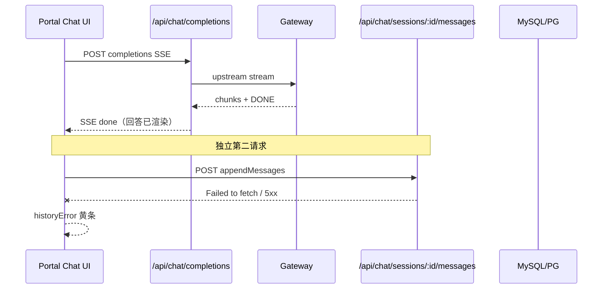
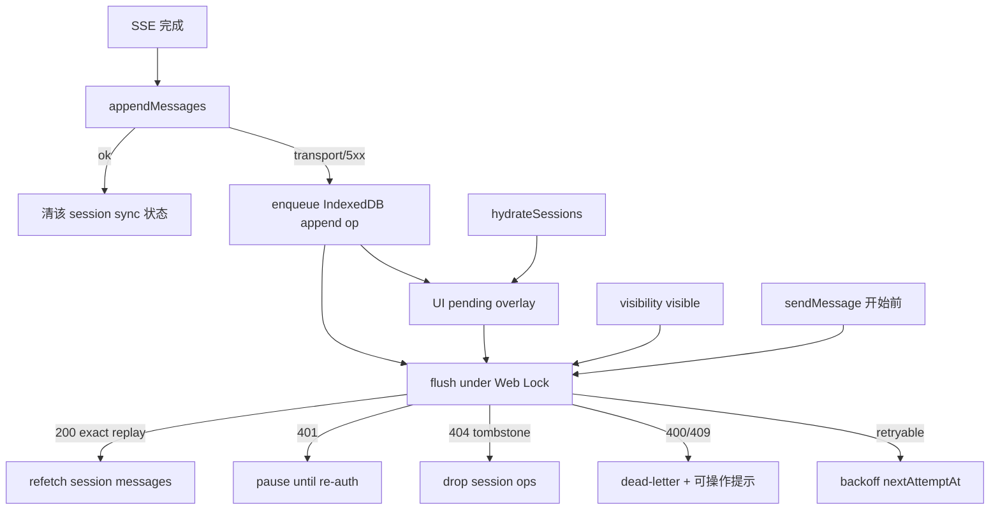

# Enterprise 聊天历史持久化韧性（回答完成后「历史同步」失败）

Planned-with: cursor-grok-4.5
Suggested-Impl-Model: gpt-5.6-sol
Status: pending-review
Prerequisite-Commit: `06d321b9` (`fix/enterprise-chat-stream-history-resilience`)
Review-Revision: 2026-07-30（吸收多角色评审：禁止 replace 盲重放、禁止全局 key、IndexedDB 最小 DTO、跨标签页锁、错误分类、会话级 UI）

## Goal

回答流（SSE）已成功结束后，后续「落库历史」若因浏览器→门户瞬断失败，不得只弹一次「历史同步」就放弃。

**P0（本 plan 必达）：** 仅对 **append** 落库做 durable outbox + 幂等 + 自动补同步；回答成功时 UI 保持 idle，仅展示会话级历史同步状态。

**P1（本 plan 明确 defer，不得在 P0 一并做）：** `replace_all`（编辑/重生成）离线重放，必须先有 `history_revision` + CAS；在 CAS 落地前 **禁止** 对 replace 做 durable 重试。

## Suggested-Impl-Model

| 子任务 | Suggested-Impl-Model | 理由 |
|--------|----------------------|------|
| P0-A 身份注入 + IndexedDB outbox + 跨标签锁 | gpt-5.6-sol | 状态机与并发边界，中档够用 |
| P0-B append 幂等（operation_id / payload hash）+ COUNT 回写 | gpt-5.6-sol | 双方言 SQL，偏后端 |
| P0-C store/UI 接线、错误分类、hydrate overlay | gpt-5.6-sol | 跨栈但边界清晰 |
| P0-D 测试与验收 | gpt-5.6-sol / Composer 2.5 | 并发与幂等用例为主 |
| P1 revision/CAS for replace | gpt-5.6-sol | 高风险，单独 PR |

Suggested-Impl-Model（P0 整包默认）: gpt-5.6-sol

---

## 根因与证据链（实施者无需对话上下文）

### 现象

- UI 已显示完整助手回答；输入区上方出现 **「历史同步」** 黄条（文案含「无法连接门户服务…」）。
- 这不是「模型没答完」，而是 **SSE 结束后的独立 POST `/api/chat/sessions/:id/messages` 失败**。

### 链路



### 代码落点（当前行为）

1. `enterprise/features/chat/src/store.ts` ~L1173–1189：SSE 成功后 `appendMessages`；失败只 `set({ historyError })`，无跨刷新队列。
2. 同类：`replaceMessages` ~L1420–1430、~L1626–1636（**P0 不 durable 重试这些路径**）。
3. `enterprise/features/chat/src/history-client.ts`：`historyFetch` 短重试只包住 `fetch()`；`ensureOk()` 在 loop 外 → HTTP 502/503/504 **实际不重试**。
4. `enterprise/apps/web-portal/src/lib/chat-history/sql-store.ts`：`insertMessages` 纯 INSERT；非法 ID 每次 `ulid()` 重生（~L252）→ 重放无法按 id 去重；`appendChatMessages` 用 `message_count + messages.length`。
5. `MachiChatView.tsx` ~L428–435：全局 `historyError` 展示；与 rename/delete 等共用字段。
6. 证据（2026-07-30）：回答可见后 DB 无新行、无 chat-history 500 → 浏览器侧 fetch 失败（metadata stringify 已在 `06d321b9` 修复）。

### 评审否决的旧方案（不得再写回）

| 否决项 | 原因 |
|--------|------|
| localStorage 存完整 `ChatMessage[]` | 含 reasoning/工具预览/附件 data_url，隐私与配额风险 |
| 无身份时退化全局 key | 跨账号泄漏 / 错账号 flush |
| replace_all durable 盲重放 | 旧快照 `DELETE ALL` 抹掉后续成功 append |
| 进程内 Promise 单飞锁 | 多标签页无法互斥 |
| `ON CONFLICT DO NOTHING` 仅按 id | 同 ID 不同内容假成功 |
| 所有失败统一 attempts++ | 401/404/409 成僵尸任务 |
| flush 成功清全局 `historyError` | 吞掉 rename/delete 等硬错误 |

---

## In scope（P0）

- Portal 注入 `{tenantId,userId}`（`GET /api/auth/session` 已返回完整 session）。
- **IndexedDB** outbox，仅存 **append** 的最小 DTO + `operation_id`。
- 跨标签页 `navigator.locks`（无 API 时同标签页内单飞 + 明确 best-effort 文档注释，不得声称跨标签强一致）。
- 服务端 append：稳定 ULID、`operation_id` 幂等、payload hash 冲突 → 409、`message_count` 用 `COUNT(*)`。
- `historyRequest` 统一重试（含 408/429/5xx）；错误分类 retry/pause/dead-letter。
- hydrate：pending overlay → 再 flush → 成功后 refetch 受影响 session。
- 会话级 UI 状态（非全局误归属）。
- 登出/换号：停止 coordinator、quarantine 旧 principal 队列。

## Out of scope

- Desktop / Studio / admin-console。
- Gateway / web-search 检索逻辑。
- **P1：** `replace_all` durable 重试、`history_revision` migration、跨设备同步、PWA。
- 重构整个 `store.ts` 流式状态机。
- 改 `agenticx/studio/server.py`。

## no-scope-creep

- P0 禁止实现 replace durable outbox；edit/regenerate 失败仍可短重试 `historyFetch`，失败后只提示「编辑结果未保存，请重试」，**不得**入 durable 队列。
- 禁止把历史失败映射为聊天 `status: "error"`（回答已成功时保持 idle）。
- 禁止顺手改 completions/tool-loop/gateway。

---

## 架构（P0）



### 最小 DTO（禁止存完整 ChatMessage）

```ts
type HistoryAppendPayload = {
  id: string;              // 合法 ULID，入队前强制校验
  role: "user" | "assistant" | "system" | "tool";
  content: string;
  model?: string;
  created_at: string;
  // 仅服务端 metadata 需要的字段；禁止 reasoning / tool_calls previews / attachments.data_url / parsed_text
  web_search_sources?: WebSearchSource[];
  // attachments：仅允许 {name,mime_type,size,kind}；图片若必须落库则仅在服务端已接受的短 data_url，且单 job 字节上限内——默认 P0 对超限附件拒绝入队并一次明确提示
};

type HistoryOutboxOp = {
  operation_id: string;    // ulid，服务端幂等主键
  principal: { tenantId: string; userId: string };
  sessionId: string;
  mode: "append";          // P0 仅此值
  messages: HistoryAppendPayload[];
  payload_hash: string;    // canonical JSON sha256
  attempts: number;
  nextAttemptAt: number;
  state: "pending" | "paused" | "dead_letter";
  lastError?: string;
  createdAt: number;
  localSeq: number;        // 同 session 单调，flush 必须按 seq 串行
};
```

IndexedDB store 名建议：`agx-portal-history-outbox-v1`，objectStore：`ops`，key=`operation_id`，index：`byPrincipalSession`、`byNextAttempt`。

---

## FR / NFR / AC

### FR-1：身份门禁

- `WorkspaceShell` / chat 根在 mount 时 `GET /api/auth/session`，得到 `tenantId`/`userId` 后才 `startHistoryOutboxCoordinator(principal)`。
- **禁止**无 principal 的全局 key / 未命名队列。
- 身份未就绪：不 load、不 flush。
- 登出（`WorkspaceShell.onSignOut` 现仅 `POST /api/auth/logout` + redirect）：登出前必须 `disposeHistoryOutbox()`（停 timer/lock、取消 in-flight）；旧 principal 队列保留在 IndexedDB 但 **新账号不得读取/flush**；仅当新 session 的 principal 完全匹配才恢复。

### FR-2：Append outbox + flush 触发

触发（均单飞 + Web Lock `agx-history-outbox:${tenantId}:${userId}`）：

1. persist catch 入队后；
2. `hydrateSessions` 在 pending overlay 合并之后；
3. `document.visibilitychange` → visible；
4. **`sendMessage` 开始前**（不阻塞用户输入：`void flush`，带短超时）；
5. `nextAttemptAt` 到期的 `setTimeout`。

Backoff：`min(30_000, 500 * 2^attempts)`，attempts 上限 8 后进入 `dead_letter`（**不再**无限 pending 伪装「正在同步」）。

同 session：严格按 `localSeq` 串行；有 pending/paused 时 **新 append 也必须入队**（禁止绕过队列直写，避免与未完成 op 乱序）。

### FR-3：服务端 append 幂等

**文件：**  
- `enterprise/apps/web-portal/src/lib/chat-history/sql-store.ts`  
- `enterprise/apps/web-portal/src/app/api/chat/sessions/[sessionId]/messages/route.ts`  
- `enterprise/apps/web-portal/src/lib/chat-message-sanitize.ts`

**Before：** 非法 id → 每次新 ulid；纯 INSERT；count += len。

**After：**

1. sanitize：**拒绝**空/非法 ULID（400），禁止静默重生。
2. 请求体新增可选 `operation_id`（P0 客户端必填）；服务端用表或会话内幂等记录：
   - 推荐新建轻量表 `chat_history_operations`：`(operation_id PK, tenant_id, user_id, session_id, payload_hash, created_at)`；或在无 migration 窗口时用「先查同 operation_id」——**优先真表**，与现有 drizzle 迁移流程一致。
3. 同一 `operation_id` + 相同 `payload_hash` → 200 幂等成功（不二次插入）。
4. 同一 `operation_id` + 不同 hash → **409**。
5. 消息 id 已存在：校验 `(session_id, tenant_id, user_id)` + content/role/created_at 等价；一致 → 200；否则 409。
6. `message_count` / `last_message_at`：事务内 `COUNT(*)` + `MAX(created_at)` 回写；`UPDATE chat_sessions ... WHERE id=? AND tenant_id=? AND user_id=?`。

### FR-4：错误分类

| 结果 | 行为 |
|------|------|
| 网络 / Failed to fetch / 408 / 429 / 502 / 503 / 504 | retry + backoff |
| 401 | `paused`，等重新认证后 resume（不耗尽 attempts） |
| 404 且本地有 session 删除 tombstone | drop 该 session 全部 ops |
| 404 无 tombstone | 有限次后 dead_letter（勿无限重试） |
| 400 / 409 / 403 | dead_letter + 一次明确 UI |
| `deleteSession(s)` 成功 | 写 tombstone + purge 该 session ops |

### FR-5：Hydrate / 刷新不丢回答

顺序：

1. 确认 principal；
2. 读 IndexedDB pending ops；
3. 拉远端 sessions/messages；
4. **将 pending append 投影合并进当前 UI**（远端尚无则显示本地内容）；
5. flush；
6. 成功后 **refetch** 受影响 `sessionId` 的 messages，替换 overlay。

AC：断网完成回答 → 刷新 → 回答始终可见 → 恢复网络后同步成功无重复。

### FR-6：UI 状态（会话级）

新增（与通用 `historyError` 分离）：

```ts
historySyncBySessionId: Record<string, {
  pendingCount: number;
  state: "syncing" | "waiting_retry" | "paused" | "dead_letter" | "idle";
  message?: string;
}>;
```

- `MachiChatView` **仅展示当前 `activeSessionId` 的同步条**。
- 其他会话有 pending：侧栏会话项低干扰标记（可选 P0 最小：仅当前会话条）。
- flush 成功只清该 session 的 sync 状态，**不得** `historyError = null` 一把清。
- 文案：用「这段对话尚未同步到服务器，将自动重试」；禁止把 job 数说成「N 条消息」；禁止要求用户「刷新页面」作为主路径。
- a11y：仅首次 pending、进入 dead_letter、最终成功时 live announce；退避计数变化静默。

### FR-7：historyRequest 修复

`history-client.ts`：新建 `historyRequest`，在 loop 内：

1. `fetch`；
2. 对 408/429/502/503/504 重试（尊重 `Retry-After`）；
3. 其它 HTTP 直接抛 `ChatHistoryHttpError`；
4. append 默认 retries=5，backoff `min(2000, 200 * 2^n)`。

### NFR

- 单 job / 总队列字节上限（UTF-8 序列化后计量）；`QuotaExceededError` → 拒绝入队 + 明确状态，**禁止**静默丢最旧伪装「正在同步」。
- Outbox TTL 建议 24h（过期 → dead_letter）。
- 不存 cookie / API key；DTO 不含 reasoning、tool previews、attachments.data_url、parsed_text（除非单测证明必需且受字节上限约束——默认不含）。

### AC（P0）

| ID | 验收 |
|----|------|
| AC-1 | append fail→outbox 非空→mock ok→outbox 空；该 session sync idle；**不**清无关 `historyError` |
| AC-2 | 同 `operation_id` 两次 append：仅 1 次插入；count 正确 |
| AC-3 | 同 message id 同 payload 重放 200；同 id 不同 content → 409 |
| AC-4 | 非法/空 message id → 400，重放不产生两行 |
| AC-5 | 手动：联网搜索完整回答后断网→刷新仍见回答→恢复网络后落库 |
| AC-6 | 回答成功时不得出现「聊天请求失败」；仅会话级历史条 |
| AC-7 | A 入队→登出→B 登录：B 不读不 flush A |
| AC-8 | `historyRequest` 对 503 至少重试 1 次（单测） |
| AC-9 | 双标签页并发 enqueue：任务不丢；同 session 有序（有 Web Locks 时） |
| AC-10 | 相关 vitest + features/chat、sdk-ts、web-portal chat-history typecheck |

---

## P1（defer，单独 plan/PR）

仅在以下就绪后实施：

1. `chat_sessions.history_revision`（或等价）migration；
2. `replace_all` 请求带 `base_revision` + `operation_id`；CAS 失败 409；
3. 客户端对 replace 入有序 op 流；旧 replace 不得覆盖新 revision；
4. AC：append 后旧 replace 到达 → 409 且 DB 保留 append。

P0 阶段 edit/regenerate：短重试失败 → 会话级「编辑结果未保存」提示 + 用户可再点重试；**不入 IndexedDB**。

---

## 实施任务（Composer 2.5 可独立执行）

### Task 0：前置

```bash
git log --oneline | head -5
# 须含 06d321b9 或等价 cherry-pick
```

将本文件从 `pending/` **移回** `.cursor/plans/2026-07-30-enterprise-chat-history-durable-sync.plan.md` 再开实施。

### Task 1：身份 + coordinator 壳

**Modify:**  
- `enterprise/apps/web-portal/src/components/WorkspaceShell.tsx` — mount 拉 `/api/auth/session`，把 principal 传给 chat；`onSignOut` 先 dispose。  
- `enterprise/features/chat/src/history-outbox.ts`（新建）— `start/dispose/enqueueAppend/flush` 骨架 + Web Lock。

**Test:** principal 未就绪不 flush；换 principal 不读旧队列。

### Task 2：IndexedDB append DTO

**Create:** `history-outbox.ts` 完整实现 + `history-outbox.test.ts`（可用 fake IDB）。  
入队前 strip 敏感字段、算 `payload_hash`、分配 `localSeq`。

### Task 3：服务端幂等 + 拒非法 id

**Modify:** sanitize、messages route、sql-store；**Create** drizzle migration `chat_history_operations`（双方言）。  
**Test:** `append-idempotent.test.ts`（stateful SqlClient fake，PG+MySQL 分支）。

### Task 4：historyRequest

**Modify:** `history-client.ts` + tests — 503 重试；append 走新 helper。

### Task 5：store 接线

**Modify:** `store.ts`  
- append catch → enqueue；  
- send 前 flush；  
- hydrate overlay→flush→refetch；  
- `historySyncBySessionId`；  
- **replace 路径不 enqueue。**

### Task 6：UI

**Modify:** `MachiChatView.tsx` — 仅当前 session 同步条；dead_letter 提供「立即重试」；文案分层。

### Task 7：验收命令

```bash
pnpm -C enterprise/features/chat exec vitest run src/history-outbox.test.ts src/history-client.test.ts
pnpm -C enterprise/apps/web-portal exec vitest run src/lib/chat-history
pnpm -C enterprise/packages/sdk-ts exec vitest run src/chat/http.test.ts
pnpm -C enterprise/features/chat typecheck
pnpm -C enterprise/apps/web-portal typecheck
pnpm -C enterprise/packages/sdk-ts typecheck
```

---

## 推荐实施顺序

1 → 2 → 3 → 4 → 5 → 6 → 7  

每 Task 独立 commit：

```
Plan-Id: 2026-07-30-enterprise-chat-history-durable-sync
Plan-File: .cursor/plans/2026-07-30-enterprise-chat-history-durable-sync.plan.md
Plan-Model: <规划模型>
Impl-Model: <实施模型>
Made-with: Damon Li
```

---

## 风险

| 风险 | 缓解 |
|------|------|
| 旧 replace 抹新消息 | P0 不做 replace durable |
| 跨账号串队列 | 强制 principal；登出 dispose |
| 多标签覆盖 | Web Locks + 按 op 存储 |
| 假幂等成功 | operation_id + payload_hash / 409 |
| 刷新丢回答 | overlay → flush → refetch |
| 僵尸任务 | 错误分类 + dead_letter |
| 附件撑爆配额 | 最小 DTO + 字节上限拒绝入队 |

## 完成定义（P0）

- AC-1～AC-10 全过。
- 复现路径「联网搜索完整回答 → 偶发 Failed to fetch」在恢复网络后 **无需用户重发问题** 即可落库；刷新不丢回答。
- P1 不在本 PR 范围。
