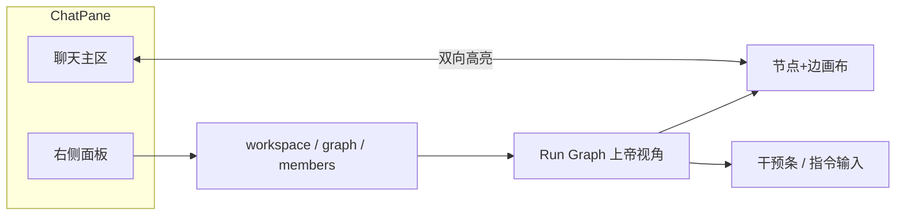
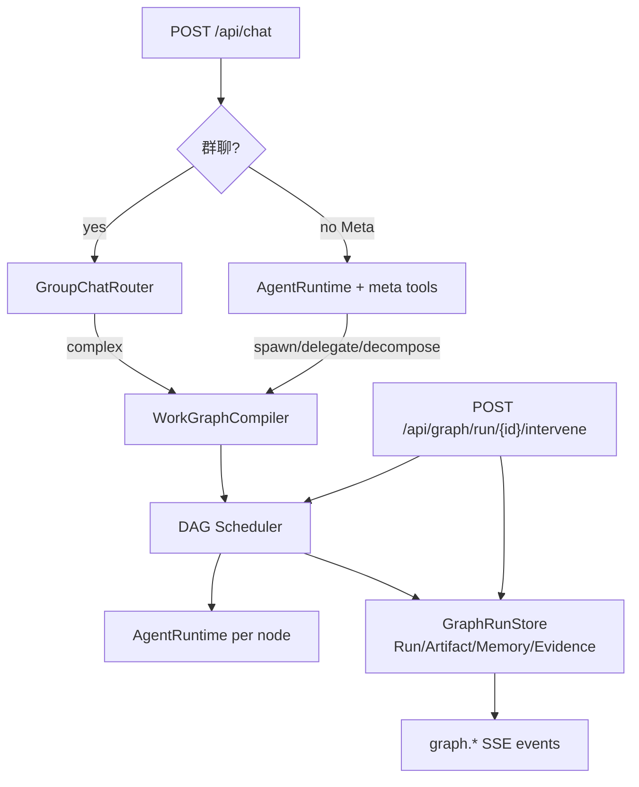
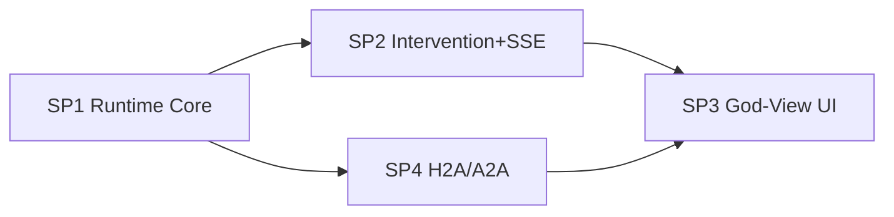

# Near Graph God-View：群聊人味 + 数据流观测 + 人类干预（主规划）

Planned-with: Cursor Grok 4.5
Suggested-Impl-Model: Cursor Grok 4.5（全部 subplan 默认由此实施）

**Goal:** 让 Near 在群聊与单专家场景下，既保留「像人类群聊」的对话体验，又提供右侧工作区级 **Run Graph 上帝视角**（观测谁在想/干/聊/协同），并支持对节点与边的多种快速干预，使协作从开放 loop 升级为可约束、可看见、可改道的 Graph Runtime。

**Architecture:** 聊天仍是自然语言入口与叙事层；背后引入显式 `WorkGraph`（节点=专家/spawn/任务，边=依赖/消息/产物传递）。运行时维护四类分离状态（Run / Artifact / Memory / Evidence），经 SSE 投影到 Desktop 右侧 Graph 面板。人类干预通过统一 `POST /api/graph/{run_id}/intervene` 写入图边与节点指令，调度器尊重干预结果，不绕过 ADR 0002 混合栈（Workforce 只规划、AgentRuntime 执行）。

**Tech Stack:** Python Studio（`group_router` / `team_manager` / 新 `graph_runtime`）+ Desktop React/Zustand + `@xyflow/react` 画布 + 既有 chat SSE / confirm / clarify / subagent APIs。

---

## 背景与问题

当前（2026-07 核实）：

| 能力 | 状态 |
|------|------|
| 单 Agent tool loop | ✅ |
| spawn 并行子 Agent（无依赖边） | ✅ |
| 群聊 intelligent + Workforce 分解 | ✅ 但执行 **线性 for** |
| `runtime/task_decomposer.py` DAG | ⚠ 有代码、主路径零消费 |
| collaboration DependencyGraph | ⚠ 未进 Studio |
| 任务图 UI | ❌ |
| confirm / clarify / cancel·retry | ✅ 但不在图上 |

用户目标（产品语言）：

1. **H2A / A2A 更像真人群聊**：人类对多智能体、智能体之间的过程可读、少刷屏、可接话。
2. **上帝视角数据流图**：右侧工作面板看到谁在思考、干活、沟通、协同（类「西部世界」观测台）。
3. **随时干预**：点节点加需求/取消需求；拖边改派；框选讨论并下规则强制收敛；以及更多模式。

---

## 产品原则（实施时不可违背）

1. **聊天是入口，图是观测与控制面**——不强制用户先画图才能聊。
2. **默认智能路由不变**——不恢复「编排模式」硬选项；复杂任务自动升成 Work Graph。
3. **四类状态分离**——Run / Artifact / Memory / Evidence 禁止揉进同一段会话上下文长期存储（见调研图「Graph Runtime」）。
4. **遵守 ADR 0002**——群聊仍 Hybrid：Workforce 规划 + AgentRuntime 执行；禁止直接 `WorkforcePattern.execute()`。
5. **`server.py` 敏感**——只精确增删目标路由行；改后必须冷启动 smoke。
6. **no-scope-creep**——不顺手重做 SpawnsColumn、不换群聊路由哲学、不引入完整 LangGraph 依赖。

---

## 干预模式目录（Intervention Taxonomy）

用户已提 3 类；规划补全为 **I1–I12**，分 P0/P1/P2 落地。

| ID | 模式 | 交互 | 语义 | 优先级 |
|----|------|------|------|--------|
| I1 | Node Inject | 点运行中节点 → 输入「增加 xxx」 | 向该节点追加 directive，**不重启整图**，下一轮/当前 loop 注入系统通知 | P0 |
| I2 | Node Retract | 点节点 →「xxx 不用做了」 | 从节点目标中撤回子目标；已完成 artifact 保留；未开始步骤跳过 | P0 |
| I3 | Edge Reassign | 拖依赖边 A→B 到 A→C | **仅 pending/blocked 边可改派**；running 目标需先 pause 或确认「中断 B 转 C」 | P0 |
| I4 | Selection Rule | 框选节点/边 →「快速出结论，先做一版」 | 对选中子图注入临时 policy（缩短讨论、强制 converge） | P0 |
| I5 | Pause / Resume | 节点或整图 | 暂停调度与 tool 轮；保留 Run State | P0 |
| I6 | Cancel Node | 节点菜单 | 等价 cancel subagent + 图上 mark cancelled；下游标 blocked 或跳过（可配） | P0 |
| I7 | Force Join | 并行分支未齐时点汇合点 | 用已完成分支 artifact 继续，未完成标 skipped | P1 |
| I8 | Pin Artifact | 点节点产出 | 冻结为 Evidence+Artifact 锚点，禁止后续节点 silently 覆盖 | P1 |
| I9 | Mute / Unmute | 点专家节点 | 抑制该成员 A2A follow-up 刷屏，仍可被 @ | P1 |
| I10 | Promote Chat→Task | 选一条讨论边 | 把争论话题升为 Work 节点并入 DAG | P1 |
| I11 | Split / Merge Node | 节点菜单 | 一任务拆两路 / 两路合一路（改图结构） | P2 |
| I12 | Rewind Checkpoint | 时间轴 | 回到某 Evidence checkpoint 重跑下游（高风险） | P2 |

**运行中改道规则（风险控制，写进 SP2）：**

- `pending` 边：可直接拖拽改派。
- `running` 节点：Inject/Retract 走「软干预」（系统通知注入）；Reassign 必须二次确认并 cancel/pause 原节点。
- `done` 节点：默认只读；Pin/Rewind 除外。
- 全图 Pause 期间禁止自动 mention follow-up 扩散。

---

## 目标信息架构（Desktop）

- 新增 `sidePanelTab: "graph"`（或与 workspace 内顶部分页「文件 | 运行图」二选一；**推荐独立 tab「运行图」**，避免挤掉工作区文件列表）。
- SpawnsColumn 可保留列表细节；上帝视角以 **图** 为总览，点击节点可下钻到现有 SubAgentCard 信息。

---

## 后端目标骨架

新建模块（建议路径，SP1 定稿）：

- `agenticx/runtime/graph/models.py` — Node / Edge / GraphRun / 四态容器
- `agenticx/runtime/graph/store.py` — 持久化 `~/.agenticx/graph_runs/<run_id>/`
- `agenticx/runtime/graph/scheduler.py` — ready 集并行 + 尊重干预
- `agenticx/runtime/graph/compiler.py` — 从 Workforce 子任务 / spawn 集 / 单 loop 编译图
- `agenticx/runtime/graph/intervene.py` — I1–I6 语义
- `agenticx/runtime/graph/events.py` — SSE payload 契约

复用：

- `agenticx/runtime/task_decomposer.py` 的 `depends_on` / `ready_tasks` 思想（可迁入 scheduler，避免继续零引用）
- `group_router._run_team_turn` 替换线性 for 为 scheduler
- 既有 `POST /api/confirm`、`/api/clarify`、`/api/subagent/*` — 图干预可调用它们，不必重写权限内核

---

## Subplan 拆分与依赖

| Plan-Id | 文件 | 内容 | 依赖 | Suggested-Impl-Model |
|---------|------|------|------|----------------------|
| `2026-07-30-near-graph-godview-master` | 本文件 | 愿景、原则、干预目录、风险、验收总览 | — | 规划完成，不单独写代码 |
| `2026-07-30-graph-runtime-core` | pending 同名 | WorkGraph 模型、四态、DAG 调度、接线 group/meta | 无 | Cursor Grok 4.5 |
| `2026-07-30-graph-intervention-api` | pending 同名 | intervene API、SSE `graph.*`、运行中改道语义 | SP1 | Cursor Grok 4.5 |
| `2026-07-30-run-graph-panel-ui` | pending 同名 | 右侧运行图面板、观测、干预 UI、聊双向高亮 | SP2 | Cursor Grok 4.5 |
| `2026-07-30-group-chat-h2a-a2a` | pending 同名 | 群聊人味：A2A 边投影、刷屏收敛、讨论→任务 | SP1 事件模型；UI 可与 SP3 并行后期 | Cursor Grok 4.5 |

**推荐实施顺序：** SP1 → SP2 → SP3；SP4 可在 SP1 后与 SP2/SP3 部分并行（先做后端 A2A 边事件，UI 跟 SP3）。

---

## 风险与缓解（考虑不周处）

| 风险 | 说明 | 缓解 |
|------|------|------|
| R1 中途改派丢活 | A→B 已跑一半拖到 C | running 边强制确认；B cancel + 把已完成 artifact 指针交给 C |
| R2 SSE 洪水 | 每个 thinking token 画边 | 图事件聚合：节点状态节流 ≥300ms；思考只显示「thinking」态，不投影全文到边 |
| R3 状态串味 | Run 写进 MEMORY.md | store 分目录；Memory 写入必须经显式 API + namespace |
| R4 破坏 server.py | import 误删 | 只加路由函数引用；冷启动 `/api/session` smoke |
| R5 与 Spawns 双轨 | 两套 UI 不一致 | 图为总览，Spawns 为列表详情；同一 `agent_id`/`node_id` |
| R6 过度编排 UX | 用户被迫管图 | 默认自动编译图；干预可选；小任务可不展开面板 |
| R7 群聊刷屏回潮 | A2A 边又变气泡 | 过程仍进 progress 卡；图上看边；最终结论才进气泡（延续现有偏好） |
| R8 权限绕过 | 图干预跳过 confirm | 高风险工具仍走 ConfirmGate；干预不能 `force_approve` 默认开启 |
| R9 依赖膨胀 | 引入重型图库 | Desktop 仅 `@xyflow/react`；后端不引入 LangGraph |

---

## 全局 FR / NFR / AC（跨 subplan）

### FR

- **FR-M1** 复杂群聊/单聊任务自动产生可查询的 `graph_run_id`，并随 chat SSE 下发。
- **FR-M2** 右侧「运行图」面板可实时显示节点状态与边流量（思考/工具/沟通/协同）。
- **FR-M3** 支持 I1–I6 干预且对运行中节点有明确定义（软/硬）。
- **FR-M4** 线性小任务可不建多节点图（单节点自环亦可），避免过度设计。
- **FR-M5** H2A/A2A 过程可观测：人类指令、成员讨论边、任务依赖边三类可视化区分。

### NFR

- **NFR-1** 图事件投影不得导致聊天主路径延迟可感（目标：干预 API p95 < 200ms 本地）。
- **NFR-2** 刷新/重开窗格可按 `graph_run_id` 恢复上次图快照。
- **NFR-3** 不回归现有 confirm/clarify/群聊 intelligent 路由。

### AC（端到端）

- **AC-M1** 群聊复杂任务：右侧图出现 ≥2 任务节点 + 依赖边；ready 无依赖节点可并行开始（日志/状态证明非纯顺序）。
- **AC-M2** 点运行中节点注入「加上验收清单」：该节点后续输出包含该要求，其它无关节点不受影响。
- **AC-M3** 将 pending 边从 B 拖到 C：B 不再执行该任务，C 执行。
- **AC-M4** 框选两讨论中成员 + 规则「先出一版结论」：双方停止加长讨论并在 ≤2 轮内产出收敛回复（启发式可测：follow-up hop 被 policy 压到 0 或 1）。
- **AC-M5** `agx serve` 冷启动 + `/api/avatars` `/api/sessions` 200；`server.py` import 无回归。

---

## In Scope / Out of Scope

### In Scope

- WorkGraph 运行时 + DAG 调度接线群聊 team / Meta spawn 分解
- 四态存储最小实现（Run 完整；Artifact 指针；Evidence 审批/trace；Memory 仅 namespace 约定）
- intervene API + graph SSE
- Desktop 右侧运行图画布 + I1–I6 UI
- 群聊 A2A 边投影与讨论收敛政策

### Out of Scope

- 完整 LangGraph / 外部 workflow SaaS
- 可视化「编排编辑器」作为建群必选项
- I11/I12 完整实现（仅预留事件与菜单灰位可选）
- Enterprise / web-portal 同步
- 重做 SpawnsColumn 视觉体系
- 自动把所有历史 session 回填为图

---

## 实施 checklist（给人看）

1. 将本主 plan + 4 份 subplan 从 `pending/` 移到 `.cursor/plans/` 根目录（开工时）。
2. 按 SP1 → SP2 → SP3 开分支；SP4 可并行。
3. 每波 `/commit --spec=<该 subplan>`，trailer：`Plan-Model` / `Impl-Model: Cursor Grok 4.5` / `Made-with: Damon Li`。
4. 每波自测对应 AC；触碰 `server.py` 必须冷启动 smoke。

---

## 子规划索引

- [SP1 Graph Runtime Core](./2026-07-30-graph-runtime-core.plan.md)
- [SP2 Intervention API + SSE](./2026-07-30-graph-intervention-api.plan.md)
- [SP3 Run Graph Panel UI](./2026-07-30-run-graph-panel-ui.plan.md)
- [SP4 Group Chat H2A/A2A](./2026-07-30-group-chat-h2a-a2a.plan.md)
