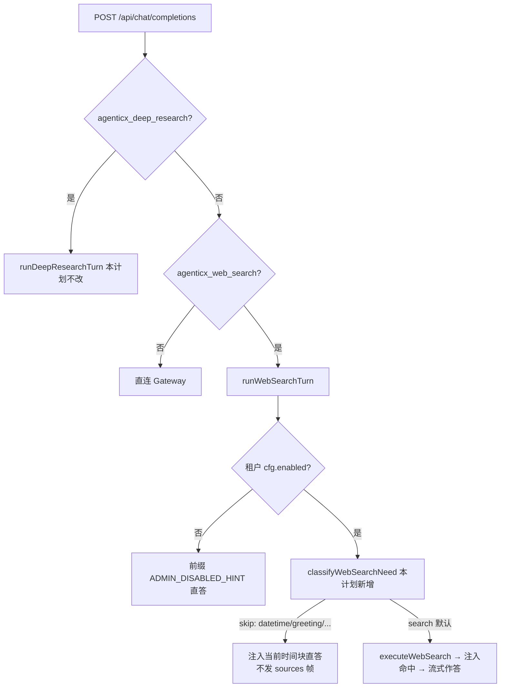

# Enterprise 前台：寒暄类轮次跳过联网搜索

Planned-with: claude-opus-5

Suggested-Impl-Model: composer-2.5-fast（备选 kimi-k2.7-code）

> 本计划为自包含实施说明：实施者无需阅读规划对话，仅凭本文件即可落地。

## 目标

联网搜索开关保持「默认常开」（与豆包 / Kimi 一致），但当用户这一轮明显不需要外部信息时
（寒暄、道谢、问「你是谁」、只让处理已上传附件、纯算式等），后端跳过 search-first，直接
让模型作答。判定默认「不确定就搜」，保证信息类问题零回归。

## 根因与证据链

Enterprise 前台的联网搜索**不是**模型 tool-calling 决策，而是 BFF 端「先搜再答」的固定流程：

- `enterprise/apps/web-portal/src/app/api/chat/completions/route.ts:105` 读取 body 里的
  `agenticx_web_search === true`，为真则走 `runWebSearchTurn`。
- `enterprise/apps/web-portal/src/lib/web-search/tool-loop.ts:438` 的 `runWebSearchTurn` 中，
  只要租户配置 `cfg.enabled` 为真，就在 `:488` 无条件 `await searchFn(query, undefined, cfg)`，
  再把命中注入 system 提示。文件头注释写明了这个设计动机：「用户开了开关就等于必须搜」。
- 唯一豁免在 `:467`：`isCurrentDateTimeQuery(query)` 为真（纯日期/时刻问句）时跳过搜索、
  只注入本机时间块。这是 2026-08-01 `2026-08-01-current-time-grounding` plan 的产物，
  证明「按 query 分流跳过 search-first」这条路径已经打通且被验证过。

所以「你好」会被当成搜索关键词打到 DuckDuckGo：既浪费一次外网往返（首字延迟多几百毫秒到
数秒）、又可能把无关 SERP 片段塞进 system 提示干扰寒暄回答，还白耗搜索配额。

补充证据（同类缺陷，本次一并修）：`sanitizeWebSearchQuery`（`tool-loop.ts:130`）在「纯附件轮次」
会把**文件名**当搜索词（`:136-140` 的 `nameMatch` 回退），于是用户上传 `2026年度预算.xlsx` 并说
「总结一下」时，后端会去网上搜这个文件名，命中全是噪音。

### 决策链路



## In scope

- 新增纯函数模块 `search-necessity.ts`：allowlist 式「本轮无需联网」判定。
- `runWebSearchTurn` 用该判定统一替换现有 datetime 单点豁免（含 datetime 语义，不回归）。
- 附件轮次（`--- 附件:` 注入）不再拿文件名当搜索词。
- 环境变量逃生开关：强制恢复「永远先搜」旧行为。
- 单测：新模块表驱动用例 + `tool-loop` 集成用例。

## Out of scope

- 不改 Desktop（`desktop/`、`agenticx/`）：Desktop 侧 `web_search` 是模型 tool-calling 决策，
  不存在本缺陷。
- 不改深度调研 `runDeepResearchTurn`：那是显式独立模式。
- 不改前端任何组件、不动联网开关 UI、不动 `web_search_sources` 渲染。
- 不引入额外 LLM 分类调用（会给每轮加一次往返，与「降低寒暄延迟」的目标相悖）。
- 不改 `providers.ts` 搜索实现、不改租户配置表结构、不动 `current-time.ts` 已有导出签名。
- 不顺手重构 `tool-loop.ts` 其余流程（SSE 管道、降级前缀、错误分流一律保持原样）。

## FR / NFR

### FR-1：新增判定模块

新建 `enterprise/apps/web-portal/src/lib/web-search/search-necessity.ts`。

```ts
/**
 * Allowlist-style gate: only obviously self-contained turns skip search-first.
 * Anything unrecognized MUST fall through to "search" so info queries never regress.
 */
import { isCurrentDateTimeQuery } from "../current-time";

export type WebSearchSkipReason =
  | "datetime"        // 纯日期/时刻 → 以本机时钟为权威
  | "greeting"        // 寒暄、道谢、告别、确认
  | "assistant_meta"  // 问助手身份/能力
  | "attachment_only" // 只让处理已注入的附件内容
  | "arithmetic";     // 纯算式

export type WebSearchNeed =
  | { need: "search" }
  | { need: "skip"; reason: WebSearchSkipReason };

export type ClassifyInput = {
  /** sanitizeWebSearchQuery 之后的短查询（可能为空）。 */
  query: string;
  /** 最后一条 user 消息的原始文本（未剥附件），用于识别附件轮次。 */
  rawQuery?: string;
};

export function classifyWebSearchNeed(input: ClassifyInput): WebSearchNeed;
/** 便捷包装，供调用点使用。 */
export function shouldSkipWebSearch(input: ClassifyInput): boolean;
```

判定顺序与规则（**必须按此顺序**，先命中先返回）：

1. **信息性否决词优先**：`query` 命中下列任一，立即 `{ need: "search" }`，后续 skip 规则一律不生效：

```ts
const INFO_MARKERS =
  /最新|近期|今年|去年|昨天|今天的|新闻|头条|热点|价格|股价|汇率|多少钱|财报|发布|版本|上线|排行|榜单|评测|对比|教程|文档|官网|地址|电话|天气|赛程|比分|招聘|政策|法规|公告|是谁(?!.*你)|哪家|哪个公司|latest|news|price|release|version|weather|stock/i;
```

2. **datetime**：`isCurrentDateTimeQuery(query)` 为真 → `{ need: "skip", reason: "datetime" }`
   （保持现有行为，测试 `skips web search for pure current-date questions…` 必须继续通过）。

3. **attachment_only**：`rawQuery` 命中 `/(^|\n)---\s*附件\s*[:：]/`，且**去掉附件块后**的用户
   自述文本长度 ≤ 40 字符或为空，且该自述文本不含 `INFO_MARKERS` → `{ need: "skip", reason: "attachment_only" }`。
   典型命中：附件 + 「总结一下」/「翻译成英文」/「提取要点」/空文本。

4. **greeting**：`normalize(query)` 全匹配下列之一 → `{ need: "skip", reason: "greeting" }`。
   `normalize` = 去首尾空白 → 去尾部语气词与标点 `[啊呀呢吧哦喔嘛么哈~～!！?？。.,，、]+$` → `toLowerCase`。

```ts
const GREETING =
  /^(你好+|您好|哈喽|哈啰|嗨|hi+|hello+|hey|早|早上好|上午好|中午好|下午好|晚上好|晚安|在吗|在么|有人吗|你在吗|test|测试|谢谢|谢谢你|多谢|感谢|thanks?|thank you|thx|好的?|行|收到|明白|知道了|懂了|ok|okay|嗯+|哦+|再见|拜拜|bye|goodbye|辛苦了|加油|哈哈+|666)$/i;
```

5. **assistant_meta**：`normalize(query)` 全匹配 → `{ need: "skip", reason: "assistant_meta" }`。

```ts
const ASSISTANT_META =
  /^(你是谁|你是什么|你叫什么(名字)?|你的名字(是什么)?|你能(做什么|干什么|帮我做什么)|你会(什么|做什么)|你有什么(功能|能力)|你是(什么|哪个)模型|介绍一下你自己|自我介绍|who are you|what can you do|what are you|your name)$/i;
```

6. **arithmetic**：`normalize(query)` 全匹配 `/^[\d\s+\-*/×÷().=%]+$/` 且含至少一个运算符
   → `{ need: "skip", reason: "arithmetic" }`。

7. 其余一律 `{ need: "search" }`。

约束：

- 长度护栏：规则 4/5/6 只在 `query.length <= 24` 时尝试匹配，避免长句里内嵌「你好」被误判。
- 空 `query`（且非 attachment_only）返回 `{ need: "search" }`，保持 `runWebSearchTurn` 现有
  「missing user query → 走降级路径」的行为不变。
- 纯函数，无 IO、无 `Date.now()`、不读 `process.env`（逃生开关在调用点读，见 FR-3）。

### FR-2：接线到 `runWebSearchTurn`

改 `enterprise/apps/web-portal/src/lib/web-search/tool-loop.ts`。

新增导出（放在 `extractLastUserQuery`，约 `:146` 之后，复用同文件已有的 `textFromMessageContent`）：

```ts
/** Raw last-user text (attachment bodies NOT stripped) — for skip classification. */
export function extractLastUserRawText(messages: ChatMessage[]): string {
  for (let i = messages.length - 1; i >= 0; i -= 1) {
    const msg = messages[i];
    if (msg?.role !== "user") continue;
    const text = textFromMessageContent(msg.content);
    if (text) return text;
  }
  return "";
}
```

把现有 `:466-478` 的 datetime 分支整段替换为统一 skip 分支（**只替换这一段，其余不动**）：

```ts
  // Before: only pure date/time questions short-circuited search-first.
  // After: any self-contained turn (greeting / assistant meta / attachment-only /
  // arithmetic / datetime) answers directly — matching Doubao / Kimi behavior where
  // the toggle stays on but trivial turns do not pay an外网 round-trip.
  const skip = webSearchAlwaysOn() ? null : classifyWebSearchNeed({ query, rawQuery: extractLastUserRawText(originalMessages) });
  if (skip && skip.need === "skip") {
    console.info(`[web-search] skipped search-first (reason=${skip.reason})`);
    try {
      const upstream = await callGatewayStream(deps, {
        ...rest,
        stream: true,
        messages: withCurrentTimeContext(originalMessages),
      });
      return pipeUpstreamSse(upstream, {});
    } catch (error) {
      return gatewayUnavailableResponse(error instanceof Error ? error.message : "gateway unreachable");
    }
  }
```

要求：

- import 加在文件顶部既有 import 区（不得整块替换相邻 import 行）：
  `import { classifyWebSearchNeed } from "./search-necessity";`
- `isCurrentDateTimeQuery` 若不再被 `tool-loop.ts` 直接引用，从该文件的 import 中移除，
  但**不得删除** `current-time.ts` 里的导出（`__tests__/current-time.test.ts` 仍在用）。
- skip 路径不发 `agenticx_web_search_sources` 帧、不加任何 `>` 提示前缀（用户不该看到噪音）。
- skip 路径仍注入 `withCurrentTimeContext`，与现有 datetime 分支一致。

### FR-3：逃生开关

同文件新增：

```ts
/** Escape hatch: set AGENTICX_WEB_SEARCH_ALWAYS=1 to restore unconditional search-first. */
function webSearchAlwaysOn(): boolean {
  const raw = process.env.AGENTICX_WEB_SEARCH_ALWAYS?.trim().toLowerCase();
  return raw === "1" || raw === "true";
}
```

置真时行为与本计划实施前完全一致（含 datetime 也会走搜索——这是「完全回退」语义，
文档需写明）。

### NFR-1：性能与配额

寒暄轮次省掉一次 DuckDuckGo 往返（本机实测 curl 路径通常 0.5–3s），首字延迟应显著下降；
被跳过的轮次不消耗搜索配额。

### NFR-2：不得误伤信息类问题

判定为 allowlist：未识别一律搜索。任何「把某类问题错判为 skip」都属严重回归，测试须覆盖
易混样本（见 AC-3）。

## 验收标准（AC）

新增测试文件 `enterprise/apps/web-portal/src/lib/web-search/__tests__/search-necessity.test.ts`：

- **AC-1（skip 命中）**：`classifyWebSearchNeed({ query })` 对下列输入返回 `need: "skip"`，
  且 `reason` 与括注一致：
  `你好` / `你好呀` / `hi` / `Hello!` / `在吗？` / `谢谢` / `ok` / `嗯嗯` / `晚安`（greeting）；
  `你是谁` / `你能做什么` / `你是什么模型`（assistant_meta）；
  `今天几号啊` / `现在几点`（datetime）；
  `1+1=?` / `(3+4)*2`（arithmetic）。
- **AC-2（附件轮次）**：`classifyWebSearchNeed({ query: "2026年度预算.xlsx", rawQuery: "--- 附件: 2026年度预算.xlsx ---\n<表格文本>" })`
  返回 `{ need: "skip", reason: "attachment_only" }`；
  `rawQuery` 为 `总结一下\n--- 附件: a.pdf ---\n…` 同样 skip。
- **AC-3（不误伤，最关键）**：下列一律 `need: "search"`：
  `你好，帮我查一下今天的黄金价格` / `Hello, what's the latest GPT release?` /
  `谢谢，再帮我搜一下他们的官网` / `你是谁写的这篇论文的作者` /
  `苹果最新财报` / `今天天气怎么样` / `2026 年 AI 大事件` /
  `--- 附件: a.pdf ---` + rawQuery 自述文本为 `结合这个文件，再帮我搜一下最新的行业政策`。
- **AC-4（长度护栏）**：一段 200 字的长文里包含「你好」时返回 `need: "search"`。

扩展 `enterprise/apps/web-portal/src/lib/web-search/__tests__/tool-loop.test.ts`
（复用文件内已有的 `sseResponse` / `readText` / `loadTenantConfig` 桩写法）：

- **AC-5**：新增用例 `skips web search for greetings`：`messages: [{ role: "user", content: "你好" }]`，
  `agenticx_web_search: true` → `expect(executeSearch).not.toHaveBeenCalled()`；
  上游 body 的 `messages[0].content` 含「当前时间」且**不含**「联网搜索结果」；
  响应文本不含 `agenticx_web_search_sources`。
- **AC-6**：新增用例 `still searches for informational queries`：query 为
  `最新的 AI 新闻` → `expect(executeSearch).toHaveBeenCalledTimes(1)`，响应含
  `agenticx_web_search_sources`。
- **AC-7（不回归）**：既有 14 条用例（含 `skips web search for pure current-date questions…`、
  `runs server-side search first and strips…`、`does not search when tenant enabled=false`、
  `degrades to direct stream when search throws`）全部继续通过。
- **AC-8（逃生开关）**：新增用例设置 `process.env.AGENTICX_WEB_SEARCH_ALWAYS = "1"`（用例末
  `delete` 复原），query 为 `你好` → `expect(executeSearch).toHaveBeenCalledTimes(1)`。

验收命令：

```bash
cd enterprise/apps/web-portal
pnpm exec vitest run src/lib/web-search/__tests__ src/lib/__tests__/current-time.test.ts
pnpm exec tsc --noEmit
```

## 实施步骤

1. 建 `search-necessity.ts`，按 FR-1 实现纯函数（先写 AC-1/2/3/4 测例再实现，TDD）。
2. 跑 `vitest run src/lib/web-search/__tests__/search-necessity.test.ts` 至全绿。
3. 按 FR-2 / FR-3 改 `tool-loop.ts`（只动指定行段与 import 区，逐行核对无误删）。
4. 补 AC-5/6/8 集成用例，跑整个 `__tests__` 目录 + `tsc --noEmit`。
5. 手工验证：`bash enterprise/scripts/start-dev-with-infra.sh`，前台开着联网搜索发「你好」，
   观察 `agx`/portal 日志出现 `[web-search] skipped search-first (reason=greeting)`、
   消息下方无「搜索网页 · N 个结果」行；再发「最新的 AI 新闻」确认来源行正常出现。
6. commit（trailer 按仓库规范，`Plan-Id: 2026-08-01-portal-skip-search-on-trivial-turns`，
   `Made-with: Damon Li`，`Impl-Model` 由用户提供）。

## 风险与回退

| 风险 | 缓解 |
|---|---|
| 误把信息类问题判为 skip | allowlist + `INFO_MARKERS` 优先否决 + 长度护栏 + AC-3 覆盖 |
| 正则漏词导致「谢谢」仍搜索 | 只影响体验不影响正确性；后续按用户反馈补词即可 |
| 线上需要立刻恢复旧行为 | 设 `AGENTICX_WEB_SEARCH_ALWAYS=1` 重启 portal，无需回滚代码 |
