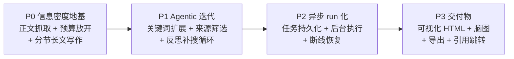

# Web-Portal 深度调研对标 Kimi-Researcher（主规划）

Planned-with: claude-opus-5-thinking-medium

> 本文是**主规划**，只负责差距分析、分期路线与验收口径。
> 具体实施拆到 4 个子规划（P0–P3），每个子规划都可**独立**交给实施模型执行。

---

## 1. 背景

用户在 `web-portal` 用深度调研问「deepseek v4 核心技术点」，产出报告约 2,800 字、29 个来源，
且大量结论依赖搜索摘要的二手转述（例如把博客里的「2026 年 4 月发布」当事实，只能在
「不确定性」一节里事后补救）。对照 Kimi-Researcher 的公开口径：

| 指标 | Kimi-Researcher | 我们当前实测 |
|---|---|---|
| 报告长度 | 平均 1 万字以上 | ~2,800 字 |
| 检索关键词数 | ~74 | 4–8（每车道 1 条 query） |
| 发现 URL 数 | ~206 | ~40（8 车道 × 最多 8 条） |
| 最终引用来源 | ~26（从 206 筛 3.2%） | ~29（几乎不筛，搜到即用） |
| 素材形态 | 网页**正文** | 搜索结果 **snippet（≤600 字符）** |
| 迭代反思 | 有（搜索→反思→补搜循环） | 无（plan-once，单轮检索） |
| 推理步数 | 平均 ~23 步 | 固定 4 步（recon→clarify→plan→synth） |
| 运行时长 | 异步 10–25 分钟 | 同步 3 分钟硬预算 |
| 交付物 | Markdown 长报告 + 可交互 HTML + 脑图 + PDF/Word | 单段 Markdown |

## 2. 根因（已核对代码，非推测）

### R1：素材只有 snippet，没有正文 —— **信息密度的根本瓶颈**
`enterprise/apps/web-portal/src/lib/web-search/providers.ts:12-18` 的 `WebSearchHit`
只有 `title / url / snippet / publishedAt`，且 `DEFAULT_SNIPPET_CHARS = 600`（同文件 L10）。
全链路**从未抓取过网页正文**。

于是证据包上限 ≈ `MAX_SOURCES(32) × 600 字符 ≈ 19K 字符`。用 19K 字符的二手摘要，
无论怎么调 prompt 都写不出 1 万字的一手报告——这是算术问题，不是提示词问题。
Kimi 的「206 URL 筛 3.2% 到 26 篇」筛出来的是 26 篇**全文**，量级差 20 倍以上。

### R2：单次 LLM 调用写全文，被 max_tokens 物理封顶
`orchestrator.ts:752-756` 只发起一次 `callGatewayStream` 写完整报告。
主流模型单次输出上限普遍 4K–8K token（中文约 3,000–6,000 字），
所以「万字」在当前结构下不可达，与素材多少无关。

### R3：plan-once，无反思无补搜
`orchestrator.ts` 的流水线是 `recon → clarify → plan → 并行 lanes → synth` 一次性直线。
每条车道只发 1 条 query、跑 1 轮，跑完即进综述。没有「看完结果判断哪里还缺 → 再搜一轮」的环节，
因此发现不了「V4 的 CSA/HCA/MHC 只有单一博客来源」这类需要交叉验证的缺口——
只能在报告末尾把它写成「信息缺口」，而不是主动补搜解决它。

### R4：预算 180s，而路由允许 900s
`orchestrator.ts:42` `TOTAL_BUDGET_MS = 180_000`，
但 `enterprise/apps/web-portal/src/app/api/chat/completions/route.ts:34` 已经是 `maxDuration = 900`。
**我们自己浪费了 720 秒的可用预算。** 这是本次最便宜的一处收益。

### R5：同步 SSE，用户必须守着页面
整个 run 挂在一次 HTTP 请求的 `ReadableStream` 上。关闭标签页 = 任务丢失。
Kimi 的 10–25 分钟异步靠的是任务持久化 + 完成通知。

## 3. 一条必须讲清楚的边界

Kimi-Researcher 的核心是**端到端 agentic RL 训练出来的模型**（单条轨迹 70+ 次搜索、上百步），
不是 workflow 拼装。**我们没有训练自己的研究模型的条件，这条不追、也不假装追。**

我们要追平的是**产出侧的可观测指标**：报告长度、来源数量与质量、正文级素材、
交叉验证、可追溯引用、交付物形态、异步时长。走的是「强 workflow + agentic 迭代循环」路线——
即 Moonshot 自述里那条「灵活性差、换模型要改 prompt」的路线。这是清醒的取舍，
在 plan / commit / 对客材料里都不得表述为「实现了端到端 RL」。

## 4. 分期路线

四期**严格按序**，每期独立可验收、可上线、可回滚。

### P0 — 信息密度地基（解决 R1 / R2 / R4）
不改流水线形状，只把「素材」和「写作」两处的物理天花板拆掉。**收益/成本比最高的一期。**
- 新增网页正文抓取（复用已有 `directFetch` 代理链路）
- `TOTAL_BUDGET_MS` 180s → 600s
- 报告改为 `outline → 逐节写 → 拼接` 的分节生成
- 目标：报告 2,800 字 → **≥8,000 字**，素材 19K 字符 → **≥120K 字符**

子规划：`.cursor/plans/2026-08-02-deep-research-p0-fulltext-longform.plan.md`

### P1 — Agentic 迭代（解决 R3）
把直线流水线改成带反馈的循环。
- 每车道展开 3–5 条关键词变体（总量向 ~74 靠）
- 建立来源候选池，用已有 `rerankHits` + 权威度做质量筛选（向「206 筛 3.2%」靠）
- 一轮检索后做 gap 分析，针对缺口发起第二轮补搜
- 暴露真实步数（对标「平均 23 步」）

子规划：`.cursor/plans/2026-08-02-deep-research-p1-iterative-agentic.plan.md`

### P2 — 异步 run 化（解决 R5）
- 新增 `enterprise_deep_research_runs` 表（PG `0040` + MySQL `0012`）
- run 脱离 HTTP 生命周期，后台执行并持久化事件
- 断线/刷新后可重连续看，完成后通知

子规划：`.cursor/plans/2026-08-02-deep-research-p2-async-run.plan.md`

### P3 — 交付物
- 可交互 HTML 报告 artifact + 思维导图
- PDF / Word 导出
- 正文引用内嵌可点击跳转 + 目录

子规划：`.cursor/plans/2026-08-02-deep-research-p3-deliverables.plan.md`

## 5. 子规划 → 推荐实施模型

以**高性价比**为准：够用即可，不给样板活上顶配，也不让弱模型碰高回归风险的活。

| 子规划 | 推荐模型 | 理由 |
|---|---|---|
| P0-A 正文抓取（`page-fetch.ts` + Citation 扩展 + 预算常量） | `kimi-k2.7-code` | 纯后端接线：HTTP 抓取、HTML 正文提取、并发与降级。逻辑边界清晰、有充分单测兜底，代码专精便宜档足够。 |
| P0-B 分节长文写作（`report-writer.ts` + 替换 synth） | `gpt-5.6-terra-medium` | 涉及 outline/分节 prompt 设计、流式顺序与预算收口，改错会直接砸掉报告可读性，需要强推理档。 |
| P1 Agentic 迭代循环 | `gpt-5.6-terra-medium` | 循环状态机 + 预算分配 + 去重一致性，序列敏感、回归面大。 |
| P2 异步 run 化 | `gpt-5.6-terra-medium` | 跨栈高风险：双数据库迁移、后台任务生命周期、断线恢复与幂等，属典型「跨栈高风险收口」。 |
| P3 交付物 | `claude-opus-5-thinking-medium` | 可交互 HTML 报告与思维导图是**前端视觉审美**活，需要品味档。 |

推荐仅供参考，最终 `Impl-Model` trailer 以实际使用为准、由用户确认。

## 6. 全局验收（四期全部完成后）

用同一个 query「deepseek v4 核心技术点」回归，须同时满足：

- **AC-G1** 报告正文 ≥ 10,000 字（不含引用列表），含目录。
- **AC-G2** 最终引用来源 ≥ 25 个，且每个来源都抓到过正文（非纯 snippet）。
- **AC-G3** 候选 URL 发现量 ≥ 150，最终采用率 ≤ 25%（有真实筛选，不是搜到即用）。
- **AC-G4** 关键词展开量 ≥ 40 条。
- **AC-G5** 至少发生 1 轮反思补搜，且 SSE 中可观测到 gap 描述与补搜 query。
- **AC-G6** 关闭浏览器标签页后重新打开，能恢复查看进行中的 run 并最终拿到报告。
- **AC-G7** 产出可交互 HTML 报告 + 可下载 PDF/Word，正文 `[N]` 可点击跳转到来源。
- **AC-G8** 单次 run 耗时落在 8–25 分钟区间（不再是 3 分钟截断）。

## 7. 全局 Out of scope

严格遵守 `no-scope-creep.mdc`。以下明确不做：

- **不训练模型**，不做任何形式的 agentic RL / SFT（见第 3 节）。
- 不改 `desktop/` 与 `admin-console/`，本系列**只动 `enterprise/apps/web-portal`
  与其依赖的 `enterprise/packages/{sdk-ts,core-api,db-schema}`、`enterprise/features/chat`**。
- 不改造 `agenticx/` Python 侧的深度研究（那是另一条线）。
- 不替换现有搜索 provider（bocha / tavily / duckduckgo 保持不变）。
- 不重构 `direct-fetch.ts` 的代理策略（只复用，不改）。
- 不引入浏览器自动化（Playwright / CDP）；正文抓取只做 HTTP + HTML 解析。
- 不做多模态检索（图片 / 音视频）。
- 不动 clarify / recon 两阶段的现有行为（那是上一个 plan 刚修好的，见
  `.cursor/plans/2026-08-02-portal-deep-research-recon-adaptive-lanes.plan.md`）。
