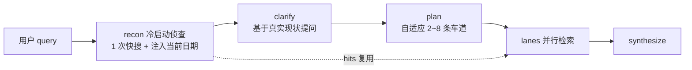

# Portal 深度研究：冷启动侦查（recon）+ 自适应调研车道

Planned-with: claude-opus-5-thinking
Suggested-Impl-Model: gpt-5.6-terra-medium（跨文件后端改动 + 序列敏感的 SSE 编排，需强推理收口；纯测试补齐部分可由 composer-2.5-fast 承接）

---

## 背景与根因（证据链）

### 现象

1. 深度研究开题时，模型对 2025-2026 年后发布的新事物（用户实测 DeepSeek V4）给出**过期前提**下的澄清问题：UI 显示「DeepSeek V4 尚未正式发布，你希望获取哪类内容？」并给出「基于 V2/V3 技术路线的合理推测与展望」这类选项。实际该模型已发布一段时间。
2. 无论 query 复杂度如何，调研车道**恒为 5 条**（UI 显示「已完成 5 条调研车道检索」）。

### 根因一：澄清阶段是零外部信息的纯参数知识判断

`enterprise/apps/web-portal/src/lib/deep-research/clarifier.ts` 的 `proposeClarification()`（L103-126）发给网关的 messages 只有两条：

```ts
messages: [
  { role: "system", content: CLARIFIER_SYSTEM },
  { role: "user", content: deps.userQuery },
],
```

- 没有任何检索结果注入；
- 没有注入**当前日期**，模型无法判断"现在是什么时候"。

因此模型只能用训练截止日的参数知识判断"缺什么约束"，对知识截止后发布的事物会先脑补出错误前提，再围绕错误前提生成选项。更糟的是 `orchestrator.ts` 的 `applyClarifyAnswers()`（L274-286）会把用户对这些错误选项的回答拼进 `userQuery`，错误前提沿整条流水线（plan → lanes → synthesize）放大。

补充排除项：`enterprise/apps/web-portal/.runtime/deep-research-clarify/` 仅为澄清挂起/恢复的 waiter 协调目录（内容形如 `{"status":"waiting","updatedAt":...}`），不是知识缓存，与本问题无关。

### 根因二：车道数硬编码，且 prompt 主动把模型推向上限

三处叠加：

| 位置 | 代码 | 作用 |
|---|---|---|
| `planner.ts:5` | `export const MAX_SUB_QUESTIONS = 5;` | 规划上限 |
| `planner.ts:25` | `` `sub_questions 必须 3 到 ${MAX_SUB_QUESTIONS} 条，覆盖不同角度，使用与用户提问相同的语言。` `` | prompt 硬区间，模型在区间约束下几乎恒取上限 |
| `planner.ts:40` | `if (out.length >= MAX_SUB_QUESTIONS) break;` | 解析截断到 5 |
| `orchestrator.ts:36` | `export const MAX_LANES = 5;` | 执行上限 |
| `orchestrator.ts:443` | `plan.subQuestions.slice(0, MAX_LANES)` | 二次夹紧 |

并且 planner 没有任何复杂度信号输入（既看不到检索现状，也不输出复杂度自评），"自适应"无从谈起。5 这个数字来源于初版 plan `2026-07-27-enterprise-portal-deep-research.plan.md` 的 token 成本边界（5 车道 × `RESULTS_PER_QUESTION=5` = `MAX_SOURCES=25`），不是算法推导。

### 分支说明

`main` 与 `hc-0730` / `origin/enterprise-fixing-0730` 的 `clarifier.ts` / `planner.ts` 基本一致（0730 仅少一处 diff，web-search 层更旧），两分支表现相同。本 plan 在 **main** 上实施。

---

## 目标流程



---

## In scope / Out of scope

**In scope**

- 新增 `lib/deep-research/recon.ts` 与其单测。
- `clarifier.ts`：注入当前日期 + recon 现状摘要。
- `planner.ts`：注入当前日期 + recon 摘要；prompt 与常量改为自适应；解析新增 `complexity`。
- `orchestrator.ts`：接线 recon 阶段、动态车道数、动态每车道结果数、recon hits 复用。
- `packages/sdk-ts/src/deep-research.ts`：`phase` 联合类型新增 `"recon"`。
- `features/chat/.../deep-research-segments.ts`：`"recon"` 与 clarify/plan 同样在时间线中忽略（避免出现未处理分支）。
- 相关单测：`recon.test.ts`（新增）、`planner.test.ts`、`clarifier.test.ts`、`orchestrator.test.ts`。

**Out of scope（严禁顺手改）**

- 不改 `web-search/` 下任何既有模块（`providers.ts` / `context-budget.ts` / `rerank.ts` / `tool-loop.ts` / `freshness.ts` 等），recon 只**调用** `executeWebSearch`。
- 不改普通联网对话（非深度研究）链路。
- 不改 Desktop（`desktop/`）与 admin-console。
- 不改澄清挂起/恢复机制（`run-wait.ts`）与 `.runtime/deep-research-clarify/`。
- 不改 UI 视觉与组件布局（仅 `deep-research-segments.ts` 增加一个忽略分支）。
- 不改 artifact 存储 / 引用注册表 `registry.ts` 的既有语义。

---

## FR / AC

### FR-1：新增 recon 冷启动侦查模块

**新建文件** `enterprise/apps/web-portal/src/lib/deep-research/recon.ts`。

导出：

```ts
export const RECON_RESULTS = 5;
export const RECON_SNIPPET_CHARS = 220;
export const RECON_BRIEF_MAX_CHARS = 900;

export type ReconResult = {
  /** 注入给 clarifier / planner 的现状摘要；无结果时为空串。 */
  brief: string;
  /** 原始命中，供 orchestrator 复用进 CitationRegistry。 */
  hits: WebSearchHit[];
};

export type ReconDeps = {
  query: string;
  searchCfg: Pick<WebSearchRuntimeConfig, "provider" | "apiKey" | "maxResults">;
  searchFn?: typeof executeWebSearch;
  fetchImpl?: typeof fetch;
  signal?: AbortSignal;
  timeoutMs?: number; // 默认 RECON_TIMEOUT_MS = 15_000
};

export function formatTodayLine(now?: () => number): string;
export function buildReconBrief(hits: WebSearchHit[]): string;
export async function runRecon(deps: ReconDeps): Promise<ReconResult>;
```

实现要点：

- `formatTodayLine()`：返回 `` `今天是 ${YYYY-MM-DD}（UTC+8）。你的训练知识可能已过期，遇到时间敏感问题必须以下方检索到的现状为准。` ``。日期用 `new Date(now())` 按 `Asia/Shanghai` 格式化（`toLocaleDateString("sv-SE", { timeZone: "Asia/Shanghai" })` 得到 `YYYY-MM-DD`）。`now` 可注入以便测试。
- `buildReconBrief(hits)`：把 hits 渲染成
  ```
  【检索到的现状（用于校准前提，非最终证据）】
  - 标题 ｜ 2026-07-15 ｜ 摘要前 220 字
  - ...
  ```
  无 `publishedAt` 时省略日期段。总长度超 `RECON_BRIEF_MAX_CHARS` 则按条截断（丢弃尾部整条，不截半条）。`hits` 为空返回 `""`。
- `runRecon()`：调 `searchFn(query, RECON_RESULTS, searchCfg, fetchImpl)`，用独立 `AbortController` 施加 `timeoutMs` 超时并桥接父 `signal`（模式对齐 `planner.ts` L123-130 的 timeout 写法）。**任何异常/超时都吞掉**，返回 `{ brief: "", hits: [] }` —— recon 是增强项，绝不能让整个深度研究失败。

**AC-1**：新建 `enterprise/apps/web-portal/src/lib/deep-research/recon.test.ts`，断言：
- `formatTodayLine(() => Date.parse("2026-08-02T04:00:00Z"))` 包含 `2026-08-02`；
- `buildReconBrief([])` 返回 `""`；
- `buildReconBrief` 对含 `publishedAt` 的 hit 输出包含该日期；超长时条数被裁剪且不产生半条；
- `runRecon` 在 `searchFn` reject 时返回 `{ brief: "", hits: [] }` 且不抛；
- `runRecon` 正常时 `hits.length <= RECON_RESULTS` 且 `brief` 非空。

### FR-2：clarifier 接入日期与 recon 摘要

修改 `clarifier.ts`：

1. `ClarifierDeps` 新增可选字段：`todayLine?: string; reconBrief?: string;`
2. `CLARIFIER_SYSTEM`（L25-30）在末尾追加一条：
   `"若下方提供了检索现状，必须以其为事实基线；禁止基于自身知识断言某事物『尚未发布/不存在』。"`
3. 请求 messages（L113-116）改为：

```ts
messages: [
  { role: "system", content: CLARIFIER_SYSTEM },
  ...(deps.todayLine ? [{ role: "system" as const, content: deps.todayLine }] : []),
  ...(deps.reconBrief ? [{ role: "system" as const, content: deps.reconBrief }] : []),
  { role: "user", content: deps.userQuery },
],
```

**AC-2**：`clarifier.test.ts` 新增用例——传入 `todayLine` / `reconBrief` 时，捕获的 `fetchImpl` 请求体 `messages` 中包含这两条 system 消息且顺序为 system(CLARIFIER) → todayLine → reconBrief → user；不传时 messages 长度仍为 2（回归保护）。

### FR-3：planner 自适应车道数

修改 `planner.ts`：

1. 常量：
   ```ts
   export const MIN_SUB_QUESTIONS = 2;
   export const MAX_SUB_QUESTIONS = 8; // was 5
   ```
2. `PLANNER_SYSTEM`（L21-26）改为让模型**自评复杂度再定条数**，而不是给死区间：

```ts
const PLANNER_SYSTEM = [
  "你是研究规划助手。根据用户问题拆解研究路径。",
  "只输出 JSON，不要 Markdown 围栏，不要其它解释。",
  '格式严格为：{"topic":"...","complexity":"simple|moderate|complex","sub_questions":["...","..."]}',
  "先判断问题复杂度，再据此决定 sub_questions 条数：simple（单一事实/定义类）2-3 条；moderate（多维度对比或需要几个侧面）4-5 条；complex（跨领域、需时间线/多方观点/技术细节分层）6-8 条。",
  "禁止为凑数拆出重复或空洞的子问题：宁少勿滥，每条必须能独立检索且彼此不重叠。",
  "使用与用户提问相同的语言。",
].join("");
```

3. `ResearchPlan` 类型新增 `complexity: "simple" | "moderate" | "complex"`（解析不到时默认 `"moderate"`）。
4. `normalizeSubQuestions`（L28-47）：截断上限改用 `MAX_SUB_QUESTIONS`（现已是 8）；空结果 fallback 保持不变（返回 1 条原始 query）。**不要**强行补齐到 `MIN_SUB_QUESTIONS` —— 下限只作用于 prompt 引导，模型给 1 条也允许（避免注水）。
5. `PlannerDeps` 新增可选 `todayLine?: string; reconBrief?: string;`，messages 注入方式与 FR-2 完全一致。

**AC-3**：`planner.test.ts`：
- 现有「8 条输入 → 期望 5 条」的用例（L32-39）改为期望 **8 条全保留**；新增「10 条输入 → 截断为 8 条」用例；
- 新增：`complexity` 缺失时解析为 `"moderate"`，给出合法值时透传；
- 新增：传 `todayLine`/`reconBrief` 时出现在请求 messages 中；
- 回归：`sub_questions` 为空时仍 fallback 到 `[userQuery]`。

### FR-4：orchestrator 接线 recon 与动态预算

修改 `enterprise/apps/web-portal/src/lib/deep-research/orchestrator.ts`：

1. **常量**（L33-37 区块）：
   ```ts
   export const SEARCH_CONCURRENCY = 3;      // 不变
   export const MAX_SOURCES = 32;            // was 25，容纳更多车道
   export const MAX_LANES = 8;               // was 5，与 MAX_SUB_QUESTIONS 对齐
   export const MIN_RESULTS_PER_LANE = 3;
   export const MAX_RESULTS_PER_LANE = 8;
   export const RECON_TIMEOUT_MS = 15_000;
   ```
   **保留** `export const RESULTS_PER_QUESTION = 5;` 作为默认值/向后兼容导出（现有测试与外部引用依赖它），但主路径改用下面的动态函数。

2. **新增导出的纯函数**（放在 `slugifyLane` 附近，便于单测）：
   ```ts
   export function resolveResultsPerLane(laneCount: number): number {
     if (laneCount <= 0) return MIN_RESULTS_PER_LANE;
     const even = Math.ceil(MAX_SOURCES / laneCount);
     return Math.min(MAX_RESULTS_PER_LANE, Math.max(MIN_RESULTS_PER_LANE, even));
   }
   ```

3. **`DeepResearchDeps` 新增**：`runReconFn?: typeof runRecon;`（测试可注入）。

4. **recon 阶段**：插在 L358 「`// --- Clarify gate ---`」**之前**：

```ts
// --- Recon (knowledge cold-start) ---
enqueueEvent({ type: "phase", phase: "recon", message: "正在快速侦查最新现状…" });
enqueueFlush();
const todayLine = formatTodayLine(now);
let recon: ReconResult = { brief: "", hits: [] };
if (budgetLeft() > 0) {
  recon = await (deps.runReconFn ?? runRecon)({
    query: userQuery,
    searchCfg,
    searchFn,
    fetchImpl: deps.fetchImpl,
    signal: deps.signal,
    timeoutMs: RECON_TIMEOUT_MS,
  });
}
```

5. **clarify 调用**（L369-376）追加 `todayLine, reconBrief: recon.brief`。
6. **plan 调用**（L428-435）同样追加 `todayLine, reconBrief: recon.brief`。
7. **车道数**（L440-443）保持 `slice(0, MAX_LANES)` 语义不变（MAX_LANES 已提到 8），预算耗尽时仍 `slice(0, 1)`。
8. **lanes 阶段**：
   - 在 `const registry = new CitationRegistry();`（L451）之后，**先把 recon hits 灌入 registry**，让冷启动结果直接成为可引用来源、并对后续车道去重生效：
     ```ts
     for (const hit of recon.hits) {
       if (registry.size >= MAX_SOURCES) break;
       registry.add(hit);
     }
     ```
     注意：`CitationRegistry.add` 已做 URL 去重（见 `registry.ts`），车道命中同一 URL 会复用同一编号，不会重复计数。
   - `const resultsPerLane = resolveResultsPerLane(questions.length);` 放在 `mapPool` 之前；
   - L474 改为 `const hits = await searchFn(question, resultsPerLane, searchCfg, deps.fetchImpl);`
9. **phase 文案**（L445-449）保持 `` `已拆解 ${questions.length} 条调研车道，正在并行检索…` ``，数字已自动随自适应变化。

**AC-4**：`orchestrator.test.ts`：
- 新增：注入 `runReconFn` 返回 `{ brief: "现状摘要", hits: [hitA] }`，断言 (a) 发出 `phase: "recon"` 事件；(b) 传给 `proposeClarify` 与 `buildPlan` 的 deps 含 `todayLine`（匹配 `/今天是 \d{4}-\d{2}-\d{2}/`）与 `reconBrief === "现状摘要"`；(c) `hitA.url` 出现在最终 `web_search_sources` SSE 中。
- 新增：`runReconFn` 抛错时整个 run 仍正常完成（recon 失败不致命）。
- 新增：`buildPlan` 返回 7 条子问题时，`lane_started` 事件为 7 条（验证不再被夹到 5）。
- 新增单测 `resolveResultsPerLane`：`resolveResultsPerLane(2) === 8`（`ceil(32/2)=16` → 夹到 8）、`resolveResultsPerLane(5) === 7`、`resolveResultsPerLane(8) === 4`、`resolveResultsPerLane(0) === 3`。
- 回归：现有 `MAX_SOURCES` 夹紧用例改用新值 32。

### FR-5：SSE 事件类型与 UI 兼容

1. `enterprise/packages/sdk-ts/src/deep-research.ts` L7：
   ```ts
   phase: "recon" | "clarify" | "plan" | "lanes" | "synthesize" | "done";
   ```
2. `enterprise/features/chat/src/components/molecules/deep-research-segments.ts` L153：
   ```ts
   if (event.phase === "recon" || event.phase === "clarify" || event.phase === "plan") {
     break;
   }
   ```
   —— recon 不在时间线单独成段（它是内部准备步骤，用户可见价值低，且随后 clarify/lanes 会给出叙事）。

**AC-5**：`pnpm -C enterprise typecheck` 通过；`deep-research-segments.test.ts` 新增用例断言 `phase: "recon"` 不产生任何 segment。

---

## 实施补充（续：冷启动有了，但澄清被跳过且仍 1 车道）

复测截图：有「开题冷启动检索」，无澄清卡，调研车道仍 1 条且子问题=原问。

根因：
1. clarifier 原 prompt「不确定时 needed=false」+ recon 摘要 → 模型以为已够信息，直接 `needed:false`。
2. planner「宁少勿滥」+ recon → 塌成 1 条原问；多选拆车道逻辑只在澄清发生后生效，跳过澄清后无兜底。

修复：
- clarifier：开放式调研题默认要问方向；recon 不得作为跳过理由；LLM 仍跳过时用 `defaultOpenEndedClarification` 兜底。
- 新增 `research-intent.ts` + `enforcePlanBreadth`：开放题若只剩 1 条原问，强制拆成 ≥4 条侧面车道。

## 实施补充（续：用户复测「1 条车道 + 澄清前看不到冷启动」）

复测截图证据：
- 澄清卡多选了 4 个技术方向，但工具卡显示「已完成 1 条调研车道检索」，且唯一检索 query 是整段 `原问题 + 【用户澄清】…`。
- 时间线在澄清前没有任何「搜索网页」步骤。

根因：
1. **澄清等待吃掉研究预算**：`budgetLeft()` 用墙钟计算，`TOTAL_BUDGET_MS=180s`，而澄清等待最长 300s。用户答题稍慢 → `budgetLeft()<=0` → plan 回退为 `subQuestions: [整段澄清后的 query]` → 恒为 1 条车道。截图中的车道标题正是该回退形态。
2. **recon 对用户不可见**：只发了被 segments 忽略的 `phase: "recon"`，没有 `lane_started`，所以澄清前看不到冷启动检索。
3. **多选方向未被强制拆车道**：即使用户多选，答案被 `、` 拼成一段文本塞进 planner；再叠加「宁少勿滥」与预算回退，极易塌成 1 条。

修复：
- 澄清等待期间累计 `budgetPausedMs`，不计入研究预算。
- recon 阶段先发叙事 + `phase:lanes`（开题冷启动检索）+ `lane_started/progress/done`，澄清前可见。
- 新增 `matchSelectedOptions` / `expandLanesFromClarifyAnswers`：多选 ≥2 个 option 时，按选项直接生成车道，覆盖 planner 塌缩结果。
- planner prompt 追加：禁止把整段【用户澄清】当作唯一子问题。

## 实施补充（相对原 plan 的一处必要增补）

原 plan 只让 recon hits 进 `CitationRegistry`。实施时发现这会产生**孤儿编号**：来源侧栏由 `registry.list()` 渲染（`orchestrator.ts` 的 sources frame），recon 命中会占用 `[1]…[N]`，但证据包只包含各车道 citations，综述模型看不到这些编号，`SYNTH_SYSTEM` 又禁止引用证据包中不存在的编号 —— 结果是侧栏前几条来源永远无人引用。

修正：`formatEvidencePack()` 新增可选第三参数 `background: Citation[] = []`，在证据包顶部渲染 `## 背景侦查（开题冷启动检索）` 段；orchestrator 用 `registry.add()` 的返回值收集 `reconCitations` 并传入。既有调用方不受影响（默认空数组）。

同时把「全部检索失败」判据从 `registry.size === 0` 改为**只看车道产出**（`laneCitationCount === 0`），否则 recon 有命中时会让全失败的 run 误判为成功。

## 验收命令

```bash
cd /Users/damon/myWork/AgenticX/enterprise
pnpm -C apps/web-portal test -- src/lib/deep-research
pnpm -C apps/web-portal test -- src/lib/web-search   # 回归：不得有失败
pnpm --filter @agenticx/chat test
pnpm typecheck
pnpm build
```

全部绿后方可提交。

---

## 风险与回退

| 风险 | 缓解 |
|---|---|
| recon 增加一次搜索 + 首字延迟 | 15s 超时封顶，失败即空返回；hits 复用进 registry，未浪费额度 |
| 车道上限 5→8 导致 token/耗时上涨 | `TOTAL_BUDGET_MS=180s` 与 `budgetLeft()` 已有守卫；`resolveResultsPerLane` 让总来源仍受 `MAX_SOURCES=32` 封顶；prompt 明确「宁少勿滥」压制注水 |
| 模型忽略 complexity 指令仍恒取上限 | `complexity` 字段落进 plan 便于后续观测；若线上仍恒为 8，可在 planner 侧按 complexity 二次夹紧（本次不做，留观测） |
| `MAX_SOURCES` 25→32 影响综述 prompt 长度 | 每条来源摘要长度未变，增量约 28%，在既有 budget 内 |

回退：本 plan 改动集中在 `lib/deep-research/` 四个文件 + 两处类型/UI 单行，`git revert` 单个 commit 即可。

---

## Commit 约定

```
feat(portal): deep research cold-start recon and adaptive research lanes

Plan-Id: 2026-08-02-portal-deep-research-recon-adaptive-lanes
Plan-File: .cursor/plans/2026-08-02-portal-deep-research-recon-adaptive-lanes.plan.md
Plan-Model: <待用户确认>
Impl-Model: <待用户确认>
Made-with: Damon Li
```
