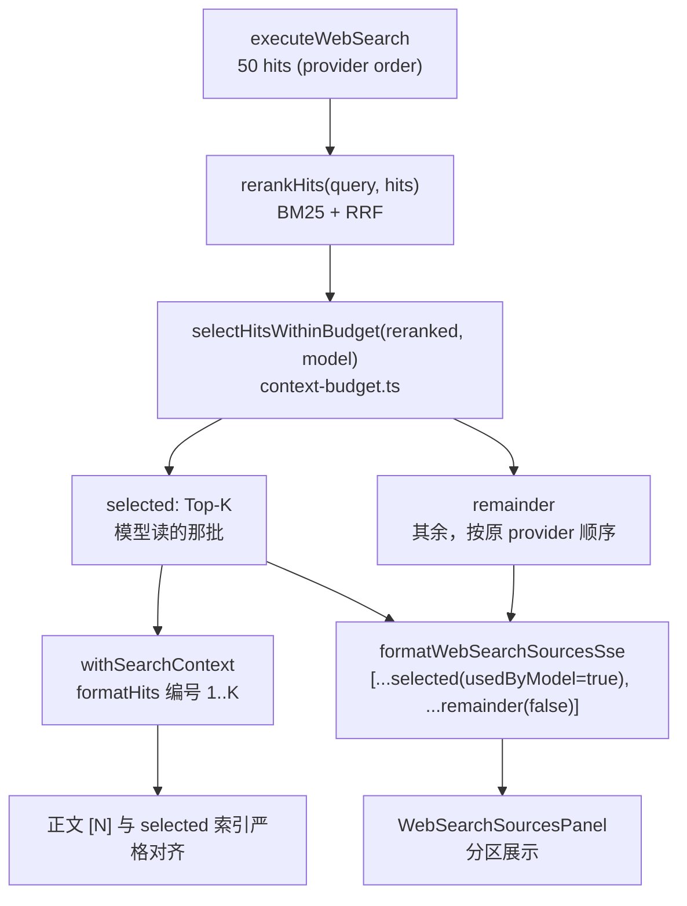

# Portal 联网搜索上下文预算与来源一致性

Planned-with: claude-opus-5

Suggested-Impl-Model: 见下方「推荐实施模型」表

> 本计划为自包含实施说明：实施者无需阅读规划对话，仅凭本文件即可落地。

## 落点分支（强制先做）

本改动属运行时/上下文预算的底层设计变更，按 `AGENTS.md` 分流规则**必须走 main**：

1. `git checkout main && git pull`
2. 本 plan 文件落到 **main** 的 `.cursor/plans/pending/2026-08-02-portal-web-search-context-budget.plan.md`，commit 并推远端供审核
3. 审核通过后移回 `.cursor/plans/` 根目录，再基于 main 开分支实施
4. 实施完成后再由 main 同步进 `hc-0730`（不要在 `hc-0730` 上直接改）

## 背景与根因（证据链，不依赖对话记忆）

用户反馈：搜索面板显示「搜索网页 · 50 个结果」，其中靠后的某条明明命中了答案，但模型回复说找不到。

三个叠加的缺陷，全部在 `enterprise/apps/web-portal/src/lib/web-search/tool-loop.ts`：

### 缺陷 1：注入上限硬编码，与模型无关

```74:76:enterprise/apps/web-portal/src/lib/web-search/tool-loop.ts
/** Cap model-bound context (UI sources may still list the full hit set). */
export const WEB_SEARCH_CONTEXT_HIT_LIMIT = 10;
export const WEB_SEARCH_CONTEXT_SNIPPET_CHARS = 320;
```

10 × 320 ≈ 3,200 字符（约 2K token）。而 GLM/Kimi 等常用模型上下文 128K+，等于主动浪费 98% 预算。`compactHitsForModel` 无条件 `slice(0, 10)`。

### 缺陷 2：UI 展示与模型输入分叉

同一次搜索走两条路：

- 模型输入：`withSearchContext(originalMessages, compactHitsForModel(hits))`（`tool-loop.ts:609`）→ **前 10 条**
- UI 来源：`pipeWithSourcesAppendix(upstream, hits)`（`tool-loop.ts:626`）→ `formatWebSearchSourcesSse(hits)`（`tool-loop.ts:234`）→ **全量 50 条**

用户无从知道这个分叉。

### 缺陷 3：无相关性重排

`hits` 是 provider 返回顺序，取前 10 纯按位置。答案落在第 12 条就必然漏掉。

### 隐患：引用索引对齐（引入重排后会变成 bug）

正文 `[N]` 按 1-based 映射到 `sources[N-1]`：

```44:53:enterprise/features/chat/src/utils/web-search-citation.ts
export function resolveCitationSource(
  sources: WebSearchSource[] | undefined,
  index1Based: number,
): WebSearchSource | undefined {
  if (!sources?.length) return undefined;
  if (!Number.isInteger(index1Based) || index1Based < 1 || index1Based > sources.length) {
    return undefined;
  }
  return sources[index1Based - 1];
}
```

而模型看到的编号来自 `formatHits`（`providers.ts:272`），按注入数组下标 +1。当前"取前 10 且保序"恰好让两者一致。**一旦重排打乱顺序，`[3]` 会指向不相干的网页。** 因此 SSE 来源数组必须把「模型读过的那批」按同一顺序放在数组最前面。

## 已确认的设计决策

- 选材：本地 BM25 重排后取 Top-K，K 按预算自适应（零额外调用与延迟）
- 预算：按模型名启发式映射上下文长度，不改 admin schema
- UI：全量展示但重排，模型读过的排最前且与 `[N]` 对齐，其余附在下方标注「未纳入本次回答」

## 数据流（改造后）



## 需求

### FR-1 新增 BM25 重排（新文件）

新建 `enterprise/apps/web-portal/src/lib/web-search/rerank.ts`：

```ts
import type { WebSearchHit } from "./providers";

/** CJK 无分词：中文按 bigram，ASCII 按小写单词。 */
export function tokenize(text: string): string[];

/**
 * BM25(k1=1.5, b=0.75) 打分后与 provider 原始排序做 RRF 融合：
 *   score = 1/(60 + bm25Rank) + 1/(60 + providerRank)
 * RRF 无需调参，且保留 provider 相关性信号，避免 BM25 噪声毁掉好排序。
 */
export function rerankHits(query: string, hits: WebSearchHit[]): WebSearchHit[];
```

要点：

- 文档文本 = `title + " " + snippet`
- 同分时按 provider 原顺序稳定排序（`Array.prototype.sort` 在 V8 已稳定，但需显式带 index 兜底）
- `query` 为空或 `hits.length <= 1` 时原样返回
- 纯函数，不做 I/O

### FR-2 新增按模型自适应的预算（新文件）

新建 `enterprise/apps/web-portal/src/lib/web-search/context-budget.ts`：

```ts
export const DEFAULT_CONTEXT_TOKENS = 32_000;
export const WEB_SEARCH_SNIPPET_CHARS = 480;   // Bocha summary 较长，320 会切掉数据
export const MIN_SELECTED_HITS = 5;
export const MIN_SNIPPET_CHARS = 160;

/** 模型名 → 上下文 token 数（启发式；route 已把 provider 前缀剥掉，防御性再取最后一段）。 */
export function resolveModelContextTokens(model: string | undefined): number;

/** 上下文 token → 允许注入搜索结果的字符预算。 */
export function resolveInjectionBudgetChars(model: string | undefined): number;

/** 在预算内贪心选取，返回 { selected, remainder }。 */
export function selectHitsWithinBudget(
  hits: WebSearchHit[],
  model: string | undefined,
): { selected: WebSearchHit[]; remainder: WebSearchHit[] };
```

`resolveModelContextTokens` 判定顺序：

1. 名称含显式窗口 `/[-_](\d+)k\b/i`（如 `moonshot-v1-32k`、`doubao-pro-32k`）→ `N * 1000`
2. 家族匹配（大小写不敏感，按序首命中）：
   - `/^(gpt-5|o[34])/` 或 `/claude/` → 200_000
   - `/glm-?[45]/`、`/kimi|moonshot/`、`/qwen/`、`/doubao/`、`/minimax/` → 128_000
   - `/deepseek/` → 64_000
3. 兜底 `DEFAULT_CONTEXT_TOKENS`

`resolveInjectionBudgetChars` 分档（环境变量 `WEB_SEARCH_CONTEXT_BUDGET_CHARS` 为有限正整数时最高优先级覆盖）：

| 上下文 token | 预算字符 |
| --- | --- |
| ≥ 200,000 | 32,000 |
| ≥ 128,000 | 24,000 |
| ≥ 64,000 | 12,000 |
| ≥ 32,000 | 8,000 |
| 其余 | 3,200（保持旧行为） |

`selectHitsWithinBudget` 算法：

1. 每条 hit 的成本 = 按 `formatHits` 同款格式渲染后的字符数（title + URL 行 + 可选发布时间行 + 截断到 `WEB_SEARCH_SNIPPET_CHARS` 的 snippet + 分隔符），snippet 用与 `truncateSnippet` 相同的规则
2. 顺序贪心累加，超预算即停（不跳过后续条目，保持"按相关性优先"语义）
3. 若 `selected.length < MIN_SELECTED_HITS` 且 `hits.length >= MIN_SELECTED_HITS`：把 snippet 上限降到 `max(MIN_SNIPPET_CHARS, floor(budget / MIN_SELECTED_HITS) - 120)` 后重取前 5 条
4. `remainder` = 未入选者，**保持传入顺序**
5. 返回的 `selected` 中每条 snippet 已按当次生效的上限截断

### FR-3 接线到 runWebSearchTurn

改 `enterprise/apps/web-portal/src/lib/web-search/tool-loop.ts`：

- 删除 `WEB_SEARCH_CONTEXT_HIT_LIMIT`；`WEB_SEARCH_CONTEXT_SNIPPET_CHARS` 改为从 `context-budget.ts` 重导出 `WEB_SEARCH_SNIPPET_CHARS`（保持既有测试 import 可用）
- 用重排 + 预算替换 `compactHitsForModel`。`rest.model` 即上游模型名（`route.ts` 已剥掉 provider 前缀），当前 `:544` 已解构出 `rest`：

```ts
// before (:606-610)
const messages = withCurrentTimeContext(
  searchFailed ? originalMessages : withSearchContext(originalMessages, compactHitsForModel(hits)),
);

// after
const modelName = typeof rest.model === "string" ? rest.model : undefined;
const ranked = searchFailed ? [] : rerankHits(query, hits);
const { selected, remainder } = searchFailed
  ? { selected: [], remainder: [] }
  : selectHitsWithinBudget(ranked, modelName);
const messages = withCurrentTimeContext(
  searchFailed ? originalMessages : withSearchContext(originalMessages, selected),
);
```

- `pipeWithSourcesAppendix(upstream, hits)`（`:626`）改为传 `selected` 与 `remainder`，由其组装有序数组
- `compactHitsForModel` 保留为 `@deprecated` 薄封装（`selectHitsWithinBudget(hits, undefined).selected`）或直接删除并同步改测试，二选一由实施者定，但不得留下未被调用的死代码
- 打一行可观测日志：`console.info(\`[web-search] model=\${modelName} budget=\${budget} selected=\${selected.length}/\${hits.length}\`)`

### FR-4 SSE 来源帧携带 usedByModel 且保证索引对齐

改 `formatWebSearchSourcesSse`（`tool-loop.ts:234-241`）签名为 `(selected: WebSearchHit[], remainder: WebSearchHit[])`：

```ts
const payload = [
  ...selected.map((hit) => ({ title: hit.title, url: hit.url, snippet: hit.snippet, usedByModel: true })),
  ...remainder.map((hit) => ({ title: hit.title, url: hit.url, snippet: hit.snippet, usedByModel: false })),
];
```

**不变式（必须写进测试）**：payload 前 `selected.length` 项与注入模型的数组同序同 URL，因此正文 `[N]`（N ≤ K）经 `resolveCitationSource` 解析到的来源，与模型看到的第 N 条是同一个 URL。

### FR-5 类型与持久化透传 usedByModel

按调用链依次改：

- `enterprise/packages/core-api/src/chat.ts:33-37` — `WebSearchSource` 增加 `usedByModel?: boolean`
- `enterprise/packages/sdk-ts/src/types.ts`（约 L41-45）— 同步增加该字段
- `enterprise/packages/sdk-ts/src/chat/http.ts:245-249` — map 时透传：`usedByModel: item.usedByModel === true`
- `enterprise/apps/web-portal/src/lib/chat-message-sanitize.ts:82-111` — `sanitizeWebSearchSources` 的 `out.push` 增加 `usedByModel: row.usedByModel === true`（`MAX_WEB_SEARCH_SOURCES` 已是 50，无需改）
- 无需改 `chat-history/sql-store.ts`：metadata 整体 JSON 序列化，字段自动带上

`enterprise/features/chat/src/store.ts:427-457` 的 `applyWebSearchSourcesToAssistant` 整体替换数组，无需改动。

### FR-6 来源面板分区展示

新增纯函数（放 `enterprise/features/chat/src/utils/web-search-citation.ts`，便于单测）：

```ts
export function partitionSourcesByUsage(sources: WebSearchSource[] | undefined): {
  used: WebSearchSource[];
  unused: WebSearchSource[];
};
```

规则：`usedByModel === true` 归 `used`；**若全部条目都没有该字段（历史消息），则全部归 `used`**，保证旧数据渲染不变。

改 `enterprise/features/chat/src/components/molecules/WebSearchSourcesPanel.tsx`：

- 用 `partitionSourcesByUsage` 拆两段渲染；`used` 在上，`unused` 在下并加一行分隔标题「未纳入本次回答（N）」
- **`highlightIndex` 与 `itemRefs` 的 key 必须继续使用「在完整 `sources` 数组中的 1-based 全局下标」**，不能改成分区内下标，否则 `[N]` 点击定位会错位
- `unused` 分区条目视觉弱化（如 `opacity-70`），不加任何解释性长文案

`MessageList.tsx:792-831` 的 chip 文案保持 `搜索网页 · {总数} 个结果` 不变。

## 验收标准

- AC-1 `rerank.test.ts`：给定 query「广州南沙天气」与 12 条 mock hits（相关项人为放在 index 9-11），`rerankHits` 后相关项进入前 5；query 为空时原样返回；同分保序
- AC-2 `context-budget.test.ts`：`resolveModelContextTokens("moonshot-v1-32k")===32_000`、`("glm-5.2")===128_000`、`("deepseek-chat")===64_000`、`("unknown-model")===32_000`
- AC-3 `context-budget.test.ts`：`resolveInjectionBudgetChars("glm-5.2")` ≥ 24_000 且远大于旧的 3_200；`WEB_SEARCH_CONTEXT_BUDGET_CHARS=5000` 时被覆盖为 5_000
- AC-4 `context-budget.test.ts`：50 条各 480 字的 hits 在 128K 模型下 `selected.length >= 30`；在兜底 32K 模型下 `selected.length` 明显更小但 `>= MIN_SELECTED_HITS`；`selected.length + remainder.length === hits.length` 恒成立
- AC-5 `tool-loop.test.ts`：mock 30 条 hits + `model: "glm-5.2"`，断言注入 system 的「联网搜索结果」块条目数 > 10（证明不再卡在 10）
- AC-6 `tool-loop.test.ts`（**索引对齐不变式**）：解析 SSE 的 `agenticx_web_search_sources`，断言其前 K 项的 URL 顺序与注入 system 块中 `[1]..[K]` 的 URL 顺序逐一相等，且前 K 项 `usedByModel === true`、其余为 `false`
- AC-7 `web-search-citation` 单测：`partitionSourcesByUsage` 对混合数组正确拆分；对**全部缺失 `usedByModel`** 的历史数组，`used` 返回全部、`unused` 为空
- AC-8 `chat-message-sanitize.test.ts`：带 `usedByModel: true` 的来源经 sanitize 后字段保留
- AC-9 回归：`pnpm exec vitest run src/lib/web-search/` 与 `src/lib/chat-message-sanitize.test.ts` 全绿；`enterprise` 侧 `typecheck` + `build` 绿
- AC-10 人工：新开会话问「广州南沙天气如何」，回答含具体气温/风力；点开来源面板可见上下两区；点击正文任一 `[N]` 跳转到的条目 URL 与该编号在回答中所指一致

## In scope / Out of scope

In scope：

- `enterprise/apps/web-portal/src/lib/web-search/`（新增 `rerank.ts`、`context-budget.ts`，改 `tool-loop.ts`）
- `enterprise/apps/web-portal/src/lib/chat-message-sanitize.ts`（仅透传新字段）
- `enterprise/packages/core-api/src/chat.ts`、`enterprise/packages/sdk-ts/`（仅加字段与透传）
- `enterprise/features/chat/src/utils/web-search-citation.ts`、`components/molecules/WebSearchSourcesPanel.tsx`

Out of scope（**禁止顺手改**，遵守 `no-scope-creep.mdc`）：

- Deep Research 编排器自己的来源发射路径（`src/lib/deep-research/`）——它有独立的 sources 逻辑，本次不动
- admin-console 模型配置 schema（本次明确不加 `contextWindow` 字段）
- `providers.ts` 的抓取逻辑、`freshness.ts`、`direct-fetch.ts`
- `WEB_SEARCH_SYSTEM_HINT` 文案（本次不调 prompt）
- Desktop 端与 Go gateway
- `MessageList.tsx` 除保持 chip 现状外的任何改动

## 推荐实施模型

- FR-1 / FR-2（纯函数 BM25 与预算表 + 单测，机械且边界清晰）→ `composer-2.5-fast`
- FR-3 ~ FR-6（跨 5 个包的类型/SSE/UI 接线，含引用索引对齐这一高回归风险点）→ `gpt-5.6-terra-medium`
- 若希望单模型一把过 → `cursor-grok-4.5-high-fast`

最终 `Impl-Model` trailer 以实际使用为准，由用户确认。

## 提交约定

```
Plan-Id: 2026-08-02-portal-web-search-context-budget
Plan-File: .cursor/plans/2026-08-02-portal-web-search-context-budget.plan.md
Plan-Model: claude-opus-5
Impl-Model: <实际实施模型，由用户提供>
Made-with: Damon Li
```