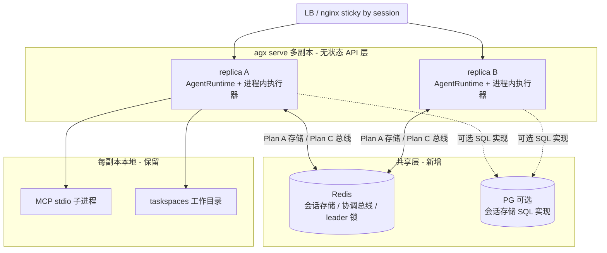
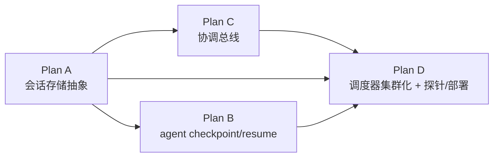

# AgenticX 高可用（HA）路线图 — 对标 AgentScope v2.0.5

Planned-with: kimi-k3
Status: pending-review
Research-Base: `research/codedeepresearch/agentscope/agentscope_ha_gap_analysis.md`（Upstream SHA `9d1026fad17e6a985873c0981bb8d4aeacf98cf9`，AgentScope v2.0.5）
Related: `.cursor/plans/pending/2026-07-12-enterprise-connector-runtime-ha.plan.md`（OpenConnector 子系统 HA，与本路线图无重叠、可并行）

## 1. 背景与目标

用户问题（2026-08-04）：「用 agenticx 搭建 agent 服务，模型没有性能瓶颈时瓶颈在哪」「agenticx 不支持分布式高可用吗」「规划完整文档，完全对标 agentscope 的高可用能力」。

调研结论（证据链见 Research-Base）：AgenticX 核心 runtime 当前是**单进程、有状态、本地文件**基线；AgentScope v2.0.5 的 HA 形态是「**无状态 API 层 + 共享存储（Redis/SQL）+ Redis 消息总线（锁/广播/replay）+ 进程内执行器 + 可重附着的外部执行环境**」。

**总目标**：让 `agx serve` 具备多副本部署能力——任意副本可接管会话、进程崩溃后运行中任务可恢复、流式事件断线可补发、定时任务不重复执行。

**非目标（Out of scope，全路线图级别）**：
- 不做 agent RPC 进程模型（AgentScope v1 RpcAgent 已被其官方弃用，E-017）。
- 不做 K8s workspace 后端 / 容器内 MCP gateway（G-007，与 `agentscope_proposal_v2.md` P0-1 合并后单独立项）。
- 不做模型 LB 池；模型 fallback 仅核实 litellm 通路后文档化（G-008）。
- 不动 Enterprise gateway（已具备多副本雏形）与 Desktop 客户端 localStorage 态。
- 不改变单机默认行为：所有 HA 能力默认关闭，`local`/`inprocess` 后端保持现状语义。

## 2. 对标矩阵（AgentScope 机制 ↔ AgenticX 现状 ↔ 子规划）

| AgentScope v2.0.5 机制（证据） | AgenticX 现状（证据） | Gap | 子规划 |
|---|---|---|---|
| StorageBase 抽象 + Redis/SQL 实现（E-004/E-005） | 内存 dict + `~/.agenticx` 本地文件，无抽象（`studio/session_manager.py:504-515`） | G-001 | **Plan A** |
| AgentState 每轮落盘 + 锁租约过期接管 + HITL resume（E-005/006/007/008） | mid-turn persist 仅消息快照；崩溃只标 `interrupted` 不恢复（`agent_runtime.py:2390-2441`、`session_manager.py:838-866`） | G-002 | **Plan B** |
| RedisMessageBus：会话锁/cancel 广播/SSE replay log/wakeup 队列（E-002/003/007/009） | 进程内 `asyncio.Lock` 与内存 interrupt 集合；SSE 无 replay（`session_manager.py:510-511`） | G-003 | **Plan C** |
| SchedulerManager 本地 APScheduler（其自身短板，多副本重复 fire，E-014） | AutomationScheduler 在 Electron 主进程（`desktop/electron/main.ts:1061`） | G-004 | **Plan D**（超越对标：做 leader 选举） |
| 无健康探针（其短板，E-016）；优雅停机 cancel 在途（E-015） | 无探针；shutdown 无在途处理（`cli/main.py:613` 单进程） | G-006 | **Plan D** |
| 沙箱内 MCP gateway + workspace 重附着（E-011/012/013） | GlobalMcpManager 进程级单例（`global_mcp_manager.py:63-93`） | G-005/G-007 | G-005 部分并入 **Plan A**；G-007 暂缓 |

## 3. 目标架构

## 4. 子规划与依赖

| 子规划 | 覆盖 Gap | 内容 | 推荐实施模型 | 推荐理由 |
|---|---|---|---|---|
| `2026-08-04-ha-session-storage-abstraction.plan.md` | G-001 + G-005 部分 | SessionStorageBackend Protocol + LocalFile/Redis 双实现 + 四处改造点接线 | kimi-k3-max | 会话是核心热路径，回归风险高，需强推理收口 |
| `2026-08-04-ha-agent-checkpoint-resume.plan.md` | G-002 | AgentCheckpoint 模型 + 主循环落点 + 崩溃恢复重入 | kimi-k3-max | tool_call 序列合法性是序列/一致性敏感改动 |
| `2026-08-04-ha-coordination-bus.plan.md` | G-003 | CoordinationBus Protocol + 会话锁/cancel 广播/SSE replay | kimi-k3-max | 分布式锁续期与 replay 语义易踩坑 |
| `2026-08-04-ha-scheduler-and-ops.plan.md` | G-004 + G-006 | 服务端调度器 + leader 选举 + 健康探针 + 优雅停机 + compose 示例 | glm-5.2-max | 相对样板的接线与部署工作，中档代码模型够用 |

> 推荐仅为性价比建议，最终 `Impl-Model` trailer 以实际使用为准、由用户确认。

## 5. 全局约束（所有子规划共同遵守）

1. **默认行为不变**：`AGX_STORAGE_BACKEND`/`AGX_HA_MODE` 未设置时，单机语义与现状逐字节一致；现有测试必须全绿。
2. **复用既有 Redis 设施**：连接统一走 `agenticx/server/redis_backend.py` 的 `RedisBackend`（连接池 + 优雅降级 + `AGENTICX_REDIS_URL`/`REDIS_URL` env），禁止新建平行连接体系；`redis>=5.0.0,<6` 已是主依赖，不新增依赖。
3. **no-scope-creep**：每个子规划只改其 In scope 列出的文件；发现既有逻辑正确但与 HA 无关的问题，记录到 plan 的「发现的非目标问题」节，不顺手修。
4. **server.py 红线**：改 `agenticx/studio/server.py` 必须遵守 AGENTS.md 该文件专项规则——import 区只精确增删目标行；提交前必须 `agx serve` 冷启动 smoke（`/api/session`、`/api/avatars`、`/api/sessions` 返回 200）。
5. **commit 规范**：`Plan-Id`/`Plan-File`/`Plan-Model`/`Impl-Model`/`Made-with: Damon Li` 五 trailer，不出现第三方品牌对标措辞（commit 中写「新增会话存储抽象」而非「对标 AgentScope」）。

## 6. 验收总门禁（路线图级）

1. 四个子规划各自 AC 全绿（见各文件）。
2. 端到端手工验收：compose 起 2 副本 + Redis，副本 A 上发起多轮工具调用会话，kill A，副本 B 上会话可恢复且 SSE 重连补发事件；定时任务仅单副本 fire。
3. 单机回归：不设任何 HA env 的 `npm run dev` + Desktop 全链路冒烟（新建会话/多轮工具/中断/定时任务）无行为变化。

## 7. Re-evaluation triggers（暂缓项重启条件)

- **G-007（K8s workspace / 容器内 MCP gateway）**：当出现 SaaS 形态需求、或单副本 MCP 子进程资源成为实测瓶颈时，与 `agentscope_proposal_v2.md` P0-1 合并立项。
- **G-008（模型 fallback）**：先由任一子规划实施者花 ≤0.5 天核实 litellm `fallbacks` 配置通路；通则写 `docs/guides/model-fallback.md`，不通再立项。
- **PG 会话存储实现**：当 Enterprise 客户要求「会话进 PG 统一审计」时，在 Plan A 的 Protocol 上加 `AsyncSQLBackend`（Protocol 设计已预留，见 Plan A FR-6）。
