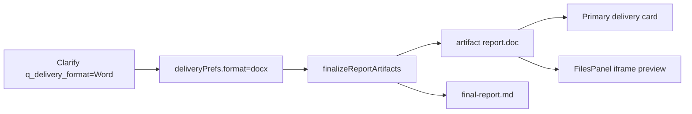

# 深研 Word 落盘 + 预览

Planned-with: cursor-grok-4.5
Suggested-Impl-Model: `composer-2.5-fast`（finalize 写 doc + prefs/主卡/预览判定；无跨栈高风险）

## 0. 一句话

用户澄清选 `Word（.doc）` → artifact store **必须**写入 `research/<runId>/report.doc` 并作为主交付卡；点开后走 HTML iframe 预览（内容为现有 Word 兼容 HTML，零新依赖）。

## 1. 根因（现状）

旧 plan [`.cursor/plans/2026-08-03-deep-research-clarify-delivery-prefs.plan.md`](.cursor/plans/2026-08-03-deep-research-clarify-delivery-prefs.plan.md) 写死：

> docx：主卡仍为 md；不另造第三份正文 artifact；Word 仅 `export?format=docx` 即时生成

因此 [`finalize-report-artifacts.ts`](enterprise/apps/web-portal/src/lib/deep-research/finalize-report-artifacts.ts) 只写 `report.html`；[`delivery-prefs.ts`](enterprise/apps/web-portal/src/lib/deep-research/delivery-prefs.ts) 的 `primaryReportPathSuffix` / `primaryArtifactTitle` 把 `docx` 当成 md。导出用的 `renderWordHtmlDocument` **已存在但从不落盘**。

前端 [`isHtmlArtifact`](enterprise/features/chat/src/components/molecules/deep-research-artifact-tree.ts) 只认 `.html` / `html` mime，即便有 `.doc` 也无法进 iframe 预览。

## 2. 产品决策（写死）

| 项 | 决策 |
|---|---|
| Word 形态 | **Word-HTML `.doc`**（`renderWordHtmlDocument` + `application/vnd.ms-word`），与澄清文案「Word（.doc）」及现有 export 一致；**不**引入真 OOXML `.docx` 生成库 |
| 落盘路径 | `research/<runId>/report.doc`；`format === "docx"` 时 **must-write**（配额满也要写，对齐 html/pdf 的 mustWriteHtml） |
| 主卡 / 摘要主链 | `report.doc`（标题 `${topic}.doc`） |
| md / html | `final-report.md` 仍写（写作真相源）；`report.html` 行为不变（供全部文件 / 非 Word 主格式），但 **不作** Word 主卡 |
| 预览 | `.doc` 内容即 HTML → 扩展 `isHtmlArtifact`（或等价判定）后走现有 `prepareHtmlPreviewSrcDoc` + iframe；下载 MIME 用 `application/vnd.ms-word` |
| 分支 | 交付落盘语义属数据层 → **在 `main` 落 pending plan 并实施**，再按需同步 `hc-0730`（勿在交付分支直接改底层） |



## 3. In / Out of scope

**In scope**

- FR-1：`format=docx` 强制写 `report.doc` + artifact 事件
- FR-2：prefs / 主卡 / summary 以 `report.doc` 为主产物
- FR-3：文件面板可预览、下载该 `.doc`
- 单测覆盖 finalize / prefs / isHtmlArtifact / client primary path

**Out of scope**

- 真 `.docx`（OOXML）/ mammoth / LibreOffice 转码
- Desktop 改动
- 服务端真 PDF
- 改检索 / lane / 澄清题文案（保持「Word（.doc）」）
- 为非 Word 格式强制删 html

## 4. 精确改动

### 4.1 Server prefs — [`delivery-prefs.ts`](enterprise/apps/web-portal/src/lib/deep-research/delivery-prefs.ts)

**Before：** `docx` → `final-report.md` / `${base}.md`  
**After：**

```ts
export function primaryReportPathSuffix(
  prefs: DeliveryPrefs,
): "final-report.md" | "report.html" | "report.doc" {
  if (prefs.format === "html" || prefs.format === "pdf") return "report.html";
  if (prefs.format === "docx") return "report.doc";
  return "final-report.md";
}

export function primaryArtifactTitle(topic: string, prefs: DeliveryPrefs): string {
  const base = sanitizeResearchTopic(topic);
  if (prefs.format === "html" || prefs.format === "pdf") return `${base}.html`;
  if (prefs.format === "docx") return `${base}.doc`;
  return `${base}.md`;
}
```

同步改 [`delivery-prefs.test.ts`](enterprise/apps/web-portal/src/lib/deep-research/delivery-prefs.test.ts)。

### 4.2 Finalize 落盘 — [`finalize-report-artifacts.ts`](enterprise/apps/web-portal/src/lib/deep-research/finalize-report-artifacts.ts)

在现有写 `report.html` 逻辑旁（或之后），当 `prefs.format === "docx"`：

1. `bodyHtml = markdownToHtml(linkified).html`（复用 export 路径，从 [`report-html.ts`](enterprise/apps/web-portal/src/lib/deep-research/report-html.ts) import）
2. `content = renderWordHtmlDocument(title, bodyHtml)`
3. `artifactStore.write({ path: \`research/${runId}/report.doc\`, title: primaryArtifactTitle(topic, prefs), kind: "report", mimeType: "application/vnd.ms-word", content })`
4. `enqueueEvent({ type: "artifact", ... })`
5. `mustWriteDoc`：与 html 相同，配额满也写

超 `MAX_ARTIFACT_BYTES`：截断 bodyHtml 后再 wrap（可复用 compact 思路的简化版：截断 markdown → 再 `markdownToHtml`），保证文档结构完整。

单测 [`finalize-report-artifacts.test.ts`](enterprise/apps/web-portal/src/lib/deep-research/finalize-report-artifacts.test.ts)：

- `format: "docx"` → list 含 `report.doc`，content 含 `xmlns:w` / `WordDocument`，有 artifact 事件
- 配额已满仍写 `report.doc`

### 4.3 Client 主卡 — [`deep-research-delivery-prefs.ts`](enterprise/features/chat/src/components/molecules/deep-research-delivery-prefs.ts)

```ts
export function primaryReportBasename(format: ClientDeliveryFormat): string {
  if (format === "html" || format === "pdf") return "report.html";
  if (format === "docx") return "report.doc";
  return "final-report.md";
}
```

`displayDeliveryFileName`：path 以 `.doc` 结尾时 ext=`.doc`。  
同步 [`deep-research-delivery-prefs.test.ts`](enterprise/features/chat/src/components/molecules/deep-research-delivery-prefs.test.ts)。

### 4.4 预览 / 下载 — chat molecules

[`deep-research-artifact-tree.ts`](enterprise/features/chat/src/components/molecules/deep-research-artifact-tree.ts) `isHtmlArtifact`：

```ts
// also true for Word-HTML .doc deliverables
if (mime.includes("msword") || mime.includes("word")) return true;
return item.path.toLowerCase().endsWith(".html") || item.path.toLowerCase().endsWith(".doc");
```

[`DeepResearchFilesPanel.tsx`](enterprise/features/chat/src/components/molecules/DeepResearchFilesPanel.tsx) `downloadTextFile`：若 path/mime 为 doc，Blob type 用 `application/vnd.ms-word;charset=utf-8`，文件名取 path basename（`.doc`）。

单测：`isHtmlArtifact({ path: ".../report.doc", mimeType: "application/vnd.ms-word" }) === true`。

### 4.5 Summary（自动跟随）

[`completion-summary.ts`](enterprise/apps/web-portal/src/lib/deep-research/completion-summary.ts) 的 `selectSummaryArtifacts` 已读 `primaryReportPathSuffix`——prefs 改完后 Word 主链自然指向 `report.doc`。补一条 completion-summary 单测即可。

### 4.6 Orchestrator 配额注释（最小）

[`orchestrator.ts`](enterprise/apps/web-portal/src/lib/deep-research/orchestrator.ts) 约 L1091「Reserve slots for final-report.md + report.html」注释/预留：docx 时再预留 `report.doc`（若已有数字常量则 +1），避免车道 memo 挤掉 Word 主产物。不改检索语义。

## 5. 验收（AC）

1. 澄清选 Word → 完成后「全部文件」出现 `*.doc`（path 含 `report.doc`），主交付卡为该文件（非仅 md/html）。
2. 点击该文件 → 右侧面板 iframe 渲染正文（非当 markdown 乱码、非空白错误）。
3. 下载该文件 → 扩展名 `.doc`，本机 Word/WPS 可打开。
4. 选 Markdown / HTML 行为不变（不强制写 `.doc`）。
5. 单测绿：`delivery-prefs` / `finalize-report-artifacts` / `deep-research-delivery-prefs` / `deep-research-artifact-tree` / `completion-summary` 相关用例。

## 6. 实施顺序

1. prefs 路径/标题 + 单测  
2. finalize 写 `report.doc` + 单测  
3. client primary + `isHtmlArtifact` + 下载 MIME + 单测  
4. summary / orchestrator 预留槽位对齐  
5. 手动跑一轮澄清选 Word 验收预览

## 7. Commit trailer 提醒

实施 commit 需用户确认 `Plan-Model` / `Impl-Model`；trailers：`Plan-Id` / `Plan-File` / `Plan-Model` / `Impl-Model` / `Made-with: Damon Li`。
