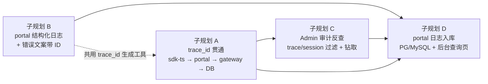

# Enterprise 全链路 Trace 与故障快速定位（主规划）

Planned-with: Claude Opus 5 (thinking)

## 背景与问题

用户报障时通常只发一张界面截图（例如聊天区出现「无法连接门户服务（网络中断或开发服务未响应）…」）。运维/研发目前**无法凭截图拿到任何可反查的标识**，只能靠账号 + 时间范围在审计里翻，且 portal 进程内发生的故障（SSE 断流、深度调研把 Node 事件环打满、前端 fetch 失败）**根本不进审计**，属于完全黑盒。

### 现状核查结论（2026-08-10，基于仓库真实代码）

**已具备：**

| 能力 | 落点 | 说明 |
|------|------|------|
| 网关审计事件 | `enterprise/apps/gateway/internal/audit/writer.go` `Event` 结构 | 含 `user_id` / `session_id` / provider / model / tokens / latency / digest / policies_hit / checksum 链 |
| 审计双写 | `internal/audit/pg_writer.go` + `DualWriter` | JSONL 强制成功 + PG `gateway_audit_events` best-effort |
| Admin 审计查询 | `apps/admin-console/src/app/audit/page.tsx`、`src/app/api/audit/query/route.ts` | 可按 user_id / model / policy / 时间过滤，RBAC 三档 |
| Trace 头定义 | `apps/gateway/internal/server/trace_context.go` | `X-AgenticX-Trace-Id` / `X-AgenticX-Trace-Step` → `requestIdentity.TraceID/TraceStep` |
| Trace step 落库 | `apps/gateway/internal/metering/trace_reporter.go` → 表 `agent_token_traces` | 按 (tenant, trace_id, step_no) upsert token/成本/耗时/错误 |
| Trace 查询 API | `apps/admin-console/src/app/api/agent-traces/route.ts` | `GET ?trace_id=` |

**缺口（本主规划要补的）：**

1. **portal 链路不产生 trace_id。** `enterprise/packages/sdk-ts/src/chat/http.ts` 的 `makeRequestId()`（L15-20）生成的 requestId 只存在于浏览器内存，既不发给后端也不落任何日志。当前只有 `apps/edge-agent/internal/gateway/client.go` 发 trace 头，Web 链路完全没有。
2. **审计事件没有 trace_id 字段。** `audit.Event`、表 `gateway_audit_events`、`AuditQueryInput` 都没有该列，导致审计与 `agent_token_traces` 无法互查。
3. **审计查询不能按 session_id / trace_id 过滤。** 见 `packages/core-api/src/audit.ts` L76-88 的 `AuditQueryInput`。
4. **web-portal 无 request-id、无结构化日志。** 全仓 `apps/web-portal/src` 搜不到 `requestId`/`x-request-id`；错误路径只有零散 `console.error`。
5. **错误文案不含任何 ID。** `normalizeTransportErrorMessage`（`sdk-ts/src/chat/http.ts` L35-53）返回纯文案，用户截图里没有可反查信息。

## 目标

**用户发一张截图 → 截图里有 `请求 ID: 01J...` → 运维在 Admin 粘贴该 ID → 5 分钟内看到：这次请求属于谁、走了哪个模型、每个 step 的 token/耗时/错误、portal 侧结构化日志、是否命中策略。**

## 子规划拆分

四份子规划**可独立实施、独立验收**。推荐串行顺序 A → B → C → D。

| 子规划 | 文件 | 范围 | 依赖 |
|--------|------|------|------|
| A | `2026-08-10-enterprise-trace-id-propagation.plan.md` | trace_id 生成/透传/落库（TS + Go + 双方言迁移） | 无 |
| B | `2026-08-10-enterprise-portal-request-logging.plan.md` | portal 结构化日志（stdout）+ 错误文案带 ID | 无（建议 A 先合，复用 trace_id 生成工具；若并行则先落 `trace-id.ts`） |
| C | `2026-08-10-enterprise-audit-trace-lookup.plan.md` | Admin 审计按 trace/session 过滤 + trace 详情钻取 | A（需要 `trace_id` 列存在） |
| D | `2026-08-10-enterprise-portal-log-persistence.plan.md` | portal 日志入库（PG + MySQL）+ 后台「Portal 日志」页 + 双向互跳 | A、B、C |

### A+B+C 之后仍存在的缺口（D 的存在理由）

做完 A+B+C，管理后台能查到**网关侧**发生了什么（审计事件 + trace step），但 **portal 进程内部**的故障只在 stdout：前端请求根本没到网关的失败、深度调研打满事件环导致的 SSE 断流、portal BFF 自身抛异常——这些在 `gateway_audit_events` 里查无此事。D 把这段日志旁路落库并接进后台，实现「一个 trace_id、一处查全」。

## 推荐实施模型（Suggested-Impl-Model）

| 子规划 | 推荐模型 | 理由 |
|--------|----------|------|
| A | GPT-5.6（强推理档） | 跨 TS/Go/SQL 三栈，17 处审计构造点 + 迁移双方言（PG/MySQL），一致性敏感、回归风险最高 |
| B | Composer 2.5 / Kimi Code（便宜档） | 单栈 TS，新增文件为主，逻辑直白，属于骨架型工作 |
| C | Codex 系列（代码专精中档） | 后端查询 + 中等复杂度前端表单/详情，无高风险改动 |
| D | GPT-5.6（强推理档） | 新表双方言 + 异步批量写入的有界队列与降级策略 + 保留期治理，写放大与性能回归风险高 |

以上仅为建议，实际 `Impl-Model` trailer 以真实使用为准。

## 全局边界（三份子规划共同遵守）

**In scope：** `enterprise/` 目录下的 web-portal、admin-console、gateway、packages/sdk-ts、packages/core-api、packages/db-schema、features/audit。

**Out of scope（严禁顺手改）：**

- `desktop/`、`agenticx/`（Python 框架）任何文件
- `apps/edge-agent/`（已有 trace 头实现，不动）
- 深度调研编排逻辑本身（`lib/deep-research/orchestrator.ts` 的检索/写作/预算逻辑）——只允许透传 header，不改行为
- 审计 checksum 链算法（`features/audit/src/services/checksum.ts`、`gateway/internal/audit/writer.go` 的 checksum 计算）
- 不引入 OpenTelemetry SDK / Jaeger / Langfuse 等外部依赖（远期规划，本轮不做）
- 不改任何 RBAC scope 定义

**共同约束：**

- trace_id 一律用 **ULID**（时序可排序），长度 26，字符集 Crockford Base32。`agent_token_traces.trace_id` 列宽 128，`gateway_audit_events` 新列同样按 128 定义。
- 严禁把 prompt / response 原文写入任何新增日志字段，只允许 hash 或长度。
- 所有新增 SQL 查询必须带 `tenant_id` 过滤（多租户硬约束）。

## 验收（主规划整体）

四份子规划全部完成后，执行端到端验证：

1. `bash enterprise/scripts/start-dev-with-infra.sh` 起完整栈
2. web-portal 登录后发一条普通对话，浏览器 DevTools Network 确认请求头含 `X-AgenticX-Trace-Id`
3. 断开网关（`kill` :8088 进程）再发一条 → 前端错误提示末尾出现「请求 ID: <ULID>」
4. 复制该 ID → admin-console `/audit` 页面 trace_id 过滤框粘贴 → 命中该次调用
5. 对成功的调用，在审计详情点「查看 Trace」→ 展示 `agent_token_traces` 中该 trace 的所有 step
6. 点「查看 Portal 日志」→ `/portal-logs` 展示该 trace 在 portal 侧的全部结构化日志行；对「请求没到网关就失败」的场景，审计里查无此事但 portal 日志里有完整错误栈
7. 切换 `DATABASE_URL` 到 MySQL 后重跑 2-6，行为一致

## 不做什么（明确排除，避免实施者扩大范围）

- 不解决「深度调研把 portal 进程打满」这个根因（那需要把调研拆到独立 worker/队列，属于另一个 plan）
- 不做 ClickHouse 热温层、不做 Ed25519 链尾签名、不做冷归档
- 不做跨服务 span 父子关系（parent_span_id），本轮 trace 是「一次用户请求 = 一个 trace_id + 若干 step_no」的扁平模型
- portal 日志入库（D）只做结构化字段的等值/范围过滤，不做全文检索，也不为其建 checksum 防篡改链（它是排障日志，不是合规审计）

## 实施与 Codeview 结果（2026-08-10）

四个子规划均已合入 main，commit 与 Plan-Id 一一对应：

| 子规划 | Commit | 状态 |
|--------|--------|------|
| A trace_id 贯通 | `c2698693` | ✅ 已落地 |
| B portal 结构化日志 | `6fdc4558` | ✅ 已落地 |
| C 审计反查 + Trace 钻取 | `5becc78d` | ✅ 已落地 |
| D portal 日志入库 + 后台查询 | `e3394c8b` | ✅ 已落地 |

Codeview（A+B / C+D 两路只读审查）结论：FR 全部落地、零越界改动、无 🔴 阻断项；安全约束（ULID 校验、日志脱敏、checksum 链兼容、租户隔离、权限收紧）均有实现与测试；双方言 parity、go build、相关测试套件实测通过。审查发现的三处测试文件类型错误（A 的 `orchestrator.trace-step.test.ts` TS2322 ×2、D 的 `db-sink.test.ts` TS2493 ×2）已在后续 commit 修复。

### 已知缺口 / Backlog（codeview 提出，未在本轮范围）

- **MCP 工具调用审计仍是 trace 盲区**：`mcp_tool_call` 类事件（`internal/mcp/handler.go`、`internal/mcphost/host.go`）不在 A 的 17 处范围内，无 `trace_id`；`CallerIdentity` 需额外穿线。后续若要求「一个 ID 查全」需单独补。
- **E2E 验收未跑**：主规划「验收」清单（起全栈、断网关看文案、MySQL 重跑、D 的降级与 p50 性能兜底）依赖完整环境，本轮未执行，建议合入前按清单跑一遍留证。
- **purge / JSON 往返无自动化测试**：D-AC-3 保留期清理与 D-AC-1 的 `fields` JSON 往返依赖真实 PG/MySQL，当前仅静态 parity 校验。
- 设计观察（不阻塞）：D 的 `resolveDatabaseConfig()` 抛错计入 3 次失败而非立即 disabled（效果近似等价）；`with-request-log.ts` 的 Response 重包装对未来写 cookie 的路由有 Set-Cookie 保真风险（当前 4 路由不写 cookie）；`/portal-logs` 页 `limit` 固定 100 无分页 UI。
