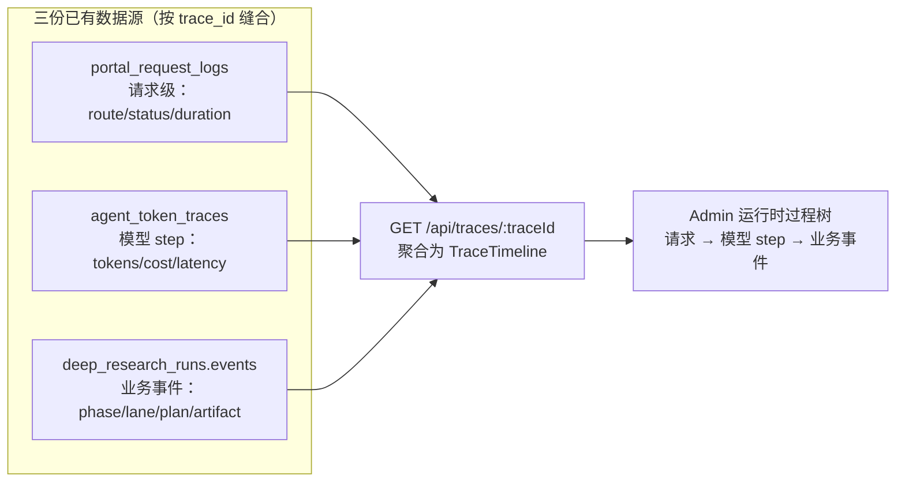

# Portal 可观测性：轮询噪音治理 + trace 运行时过程树（聚合视图）

Planned-with: Claude Opus 5 (thinking)

> 本规划是主规划 `.cursor/plans/2026-08-10-enterprise-trace-observability.plan.md` 的续作（子规划 E）。主规划的 A–D 已合入 main，其中显式排除了「span 父子关系」与「Langfuse 式过程树」，本轮以**聚合视图**方式补上，仍不引入外部可观测依赖。

## 背景与证据链（不依赖对话上下文）

用户在 admin-console `/portal-logs` 用聊天会话 ID 查询，得到几十条 `deep_research.runs.finish`，`自定义字段` 全为 `{}`；而该会话里用户真实发出的 query 只有 1–2 条。点开某条日志详情，只能看到 route / status / duration / user / session，**看不到 agent 这一轮到底做了什么**。

### 根因 1：轮询请求被当成业务日志入库（写放大 + 噪音）

前端深度调研恢复横幅每 10 秒轮询一次 runs 接口：

```55:61:enterprise/features/chat/src/components/molecules/DeepResearchRecoverBanner.tsx
    const timer = setInterval(() => {
      void poll();
    }, 10_000);
```

服务端该路由包了请求日志中间件：

```132:132:enterprise/apps/web-portal/src/app/api/chat/deep-research/runs/route.ts
  return withRequestLog("deep_research.runs", async (logCtx) => {
```

中间件对**所有**成功请求一律写 `info` 级：

```43:52:enterprise/apps/web-portal/src/lib/observability/with-request-log.ts
    log("info", {
      event: `${route}.finish`,
      route,
      trace_id: traceId,
      user_id: user.userId,
      tenant_id: user.tenantId,
      session_id: user.sessionId,
      status: response.status,
      duration_ms: Math.max(0, Date.now() - started),
    });
```

而 DB sink 的默认阈值是 `info`（`enterprise/apps/web-portal/src/lib/observability/db-sink.ts` L68–69，比较逻辑在 L218），所以每次轮询都落库一行。实测同一会话 7 分钟写入 44 行，其中 43 行是轮询、仅 1 行是 `chat.completions`（44 行 / 44 个互不相同 trace_id，非重复写入）。

### 根因 2：运行时过程数据与 trace_id 断开

深度调研的运行时事件已经存在且语义丰富——`DeepResearchEvent` 共 17 种 variant（定义于 `enterprise/packages/sdk-ts/src/deep-research.ts` L27–114：`run_started` / `phase` / `clarify` / `research_profile` / `research_plan` / `lane_started` / `lane_progress` / `lane_done` / `lane_sources` / `artifact` / `clarify_timeout` / `reflection` / `research_stats` / `narrative` 等），有序落在 run 表的 JSONB 列：

```16:17:enterprise/packages/db-schema/src/schema/deep-research-runs.ts
    /** 有序 DeepResearchEvent[]，重连时全量重放。 */
    events: jsonb("events").$type<unknown[]>().default([]).notNull(),
```

但该表**没有 `trace_id` 列**（全字段见同文件 L7–25），因此 admin 拿到一个 trace_id 无法定位对应 run 的事件流。当前按 trace_id 可查到的只有两处：

- `portal_request_logs`：请求级（`enterprise/packages/db-schema/src/schema/portal-request-logs.ts`）
- `agent_token_traces`：仅 gateway 侧模型调用，`step_kind` 恒为 `model`，扁平无父子（`enterprise/packages/db-schema/src/schema/agent-token-traces.ts` L4–28）

trace step 递增机制本身已通：orchestrator 的 `gatewayCallHeaders()`（`enterprise/apps/web-portal/src/lib/deep-research/orchestrator.ts` L303–309）与计数器（同文件 L650–651）会带 `x-agenticx-trace-step`；普通对话走 `enterprise/apps/web-portal/src/lib/web-search/tool-loop.ts` L561–562 同类逻辑。

### 目标



运维粘贴一个请求 ID（trace_id），即可看到这一轮 agent 的完整过程：走了哪些模型调用、每步 token/耗时、深度调研分了哪些 lane、检索到哪些来源、产出了哪些 artifact、在哪一步失败。

## 分期与范围

两期**可独立提交、独立验收**。E1 是低风险小改动，建议先合。

| 期 | 内容 | 依赖 |
|----|------|------|
| E1 | 轮询噪音治理（源头降级 + admin 路由/事件筛选） | 无 |
| E2 | trace 运行时过程树（run 表加 trace_id + 聚合 API + 树形 UI） | 无（与 E1 互不阻塞） |

---

## E1：轮询噪音治理

### FR-1 轮询类路由的成功日志降为 debug

**落点：** `enterprise/apps/web-portal/src/lib/observability/with-request-log.ts`

在文件顶部（`RequestLogUser` 类型之后）新增轮询路由清单与判定：

```ts
/**
 * 高频轮询路由：成功日志降为 debug，避免把 portal_request_logs 刷成访问日志。
 * 失败仍走 error 级，不受此影响。
 */
const POLLING_ROUTES: ReadonlySet<string> = new Set(["deep_research.runs"]);

function finishLevel(route: string): "info" | "debug" {
  return POLLING_ROUTES.has(route) ? "debug" : "info";
}
```

把 L43 的 `log("info", {` 改为 `log(finishLevel(route), {`，**其余字段一行不动**；L60 的 `log("error", …)` 保持不变。

**为什么用 debug 而不是直接不记：** stdout 侧受 `PORTAL_LOG_LEVEL` 控制（`logger.ts` L55–60），排障时把它设成 `debug` 仍能看到轮询；DB 侧受 `PORTAL_LOG_DB_MIN_LEVEL` 控制（默认 `info`，`db-sink.ts` L68–69），默认即不入库。两个开关本来就是独立的，无需新增 env。

**不要**把 `deep_research.stream` 加进清单：它是一次请求对应一条 SSE 长连接（`runs/[runId]/stream/route.ts`），不是轮询，其耗时对排障有价值。

### FR-2 admin Portal 日志页暴露路由 / 事件筛选

查询 API 与底层已支持 `route` / `event` 等值过滤，只是 UI 未暴露：

```13:14:enterprise/apps/admin-console/src/lib/portal-logs-query.ts
  event?: string;
  route?: string;
```

（PG 分支 L126–127、MySQL 分支 L154–155 已分别接线；POST 路由 `enterprise/apps/admin-console/src/app/api/portal-logs/query/route.ts` L19–28 已解析这两个参数。）

**落点：** `enterprise/apps/admin-console/src/app/portal-logs/page.tsx`

1. L62–66 的 state 区新增 `const [route, setRoute] = useState("")`
2. L84–91 的请求 body 新增 `route: route || undefined`
3. L114 的 `load` 依赖数组补 `route`
4. 筛选表单区（L205–253，与「级别」下拉同排）新增「路由」**下拉**（不用自由输入，避免拼错路由名），选项为固定枚举：
   - 全部（`""`）
   - `chat.completions`
   - `deep_research.runs`
   - `deep_research.stream`
   - `deep_research.resume`

   枚举来源即当前全部 4 个 `withRequestLog` 调用点：`api/chat/completions/route.ts` L46、`api/chat/deep-research/runs/route.ts` L132、`api/chat/deep-research/runs/[runId]/stream/route.ts` L36、`api/chat/deep-research/resume/route.ts` L83。
5. 文案 key 加到 `enterprise/apps/admin-console/messages/zh.json` 与 `en.json` 的 `pages.ops.portalLogs.filters` 下（与既有 trace_id / session_id / level 同级），中文用「路由」。

### E1 验收

- **AC-1-1** `enterprise/apps/web-portal/src/lib/observability/with-request-log.test.ts`：新增用例断言 `deep_research.runs` 成功时 finish 行 `level === "debug"`；`chat.completions` 成功时仍为 `"info"`；抛错路径仍产出 `level === "error"` 的 `.error` 行。注意该测试文件 L12 已 `vi.stubEnv("PORTAL_LOG_LEVEL", "debug")`，debug 行才可见。
- **AC-1-2** `enterprise/apps/web-portal/src/lib/observability/db-sink.test.ts`：新增用例——`PORTAL_LOG_DB_SINK=on` 且 `PORTAL_LOG_DB_MIN_LEVEL=info` 时，`level: "debug"` 的 `deep_research.runs.finish` 行不触发 DB 写入。
- **AC-1-3** 手工：`enterprise/.env.local` 已有 `PORTAL_LOG_DB_SINK=on`；重启 web-portal，开一个深度调研会话放置 2 分钟，再按会话 ID 查 `/portal-logs`，结果中**不应**出现 `deep_research.runs.finish`；把 `PORTAL_LOG_DB_MIN_LEVEL=debug` 重启后应重新出现。
- **AC-1-4** `pnpm -C enterprise/apps/admin-console typecheck` 绿；筛选「路由 = chat.completions」后只返回该路由行。

---

## E2：trace 运行时过程树（聚合视图）

### FR-3 run 表新增 trace_id（双方言 + 迁移）

**PG：** `enterprise/packages/db-schema/src/schema/deep-research-runs.ts`

在 `sessionId`（L10）之后新增一列，并在 L27–38 的索引区新增 trace 索引：

```ts
    /** 关联的请求 trace_id（ULID，长度 26；列宽按主规划统一 128）。可为空：老数据与非 trace 链路。 */
    traceId: varchar("trace_id", { length: 128 }),
```

```ts
    traceIdx: index("enterprise_deep_research_runs_trace_idx").on(table.tenantId, table.traceId),
```

**MySQL：** `enterprise/packages/db-schema/src/mysql-schema/deep-research-runs.ts` 同位置（`sessionId` L20 之后 / 索引区 L40–51）加同名同宽列与同名索引。

**迁移：** 按现有序号续写
- `enterprise/packages/db-schema/drizzle/0050_deep_research_runs_trace_id.sql`
- `enterprise/packages/db-schema/drizzle-mysql/0024_deep_research_runs_trace_id.sql`

两个 `meta/_journal.json` 同步登记（参照 0042 / 0016 的条目格式）。列必须 nullable、无默认值，保证对既有行零影响。

**parity：** `enterprise/packages/db-schema/src/__tests__/schema-parity.test.ts` 会自动比对两方言列集合，列名/notNull/逻辑类型必须一致，否则该测试失败。

### FR-4 run 创建时写入 trace_id

**落点 1：** `enterprise/apps/web-portal/src/lib/deep-research/run-store.ts`
- `RunRecord`（L39–54）新增 `traceId?: string`
- `RunStore.create` 入参（L57–63）新增 `traceId?: string`
- `mapRow`（L131 起）读取该列并映射到 `traceId`
- PG / MySQL / in-memory 三个实现的 insert 都要带上该字段（in-memory fallback 不能漏，否则测试环境行为不一致）

**落点 2：** `enterprise/apps/web-portal/src/lib/deep-research/orchestrator.ts` L737–749 的 `runStore.create({…})` 调用，新增 `traceId: deps.traceId`。`deps.traceId` 在 L652 已就位，来源是 completions 路由注入（`api/chat/completions/route.ts` L159–174）。

**边界：** 只加这一个字段的透传。**严禁**改动 orchestrator 的检索 / 写作 / 预算 / clarify 逻辑，也不改 `createRunWriter` 的批量 flush 策略（L748–816）与 `MAX_EVENTS_PER_RUN` trim 规则。

### FR-5 admin 侧按 trace 读取 run 事件

**新建：** `enterprise/apps/admin-console/src/lib/deep-research-trace-query.ts`

导出 `getDeepResearchRunByTrace(tenantId: string, traceId: string)`，双方言实现，结构与 `portal-logs-query.ts` 完全对齐（`resolveDatabaseConfig()` switch + `default: const exhaustive: never = config`）。返回 `{ runId, sessionId, status, phase, topic, events, createdAt, updatedAt } | null`。

**硬约束：** where 必须同时含 `tenant_id` 与 `trace_id`（多租户隔离，主规划共同约束）。

### FR-6 聚合 API

**新建：** `enterprise/apps/admin-console/src/app/api/traces/[traceId]/route.ts`

`GET`，鉴权复用审计那套（与 `app/api/audit/query/route.ts` 同款 `requireAdminSomeScope`，scopes 用 `audit:read:all` / `audit:read:dept`；**不新增任何 scope 定义**）。

聚合三源并归一为统一节点结构（建议类型放 `enterprise/packages/core-api/src/trace.ts` 新文件，或就近放 admin lib，实施者二选一但需前后端共用同一类型）：

```ts
export type TraceNodeKind =
  | "request"      // portal_request_logs 一行
  | "model_step"   // agent_token_traces 一个 step
  | "dr_phase"     // 深度调研阶段（recon/clarify/plan/lanes/reflect/synthesize/done）
  | "dr_lane"      // 单条研究支线
  | "dr_event";    // 其余业务事件（plan/sources/reflection/stats/artifact…）

export type TraceNode = {
  id: string;
  kind: TraceNodeKind;
  label: string;
  status?: string;
  startedAt?: string;
  durationMs?: number;
  tokens?: { input: number; output: number; reasoning: number; total: number };
  costUsd?: number;
  attrs?: Record<string, unknown>;
  children: TraceNode[];
};

export type TraceTimeline = {
  trace_id: string;
  nodes: TraceNode[];
  totals: { steps: number; tokens: number; cost_usd: number; duration_ms: number | null };
  sources: { portal_logs: number; model_steps: number; deep_research_run: boolean };
};
```

**组装规则（确定性，不要自由发挥）：**

1. 顶层节点 = `portal_request_logs` 中该 trace 的行，按 `log_time` 升序；`chat.completions` 行作为主节点。
2. `agent_token_traces` 的 step 按 `step_no` 升序挂到主请求节点下，`kind: "model_step"`，label 用 `#{step_no} {provider}/{model}`。
3. 若 `getDeepResearchRunByTrace` 命中，遍历 `events`：
   - `phase` 事件开一个 `dr_phase` 节点，后续事件挂到最近的 phase 下（顺序扫描，无需回溯）
   - `lane_started` 开 `dr_lane` 节点，同 `laneId` 的 `lane_progress` / `lane_sources` / `lane_done` 挂进去
   - 其余事件为 `dr_event` 叶子
   - 事件本身没有时间戳字段，`startedAt` 留空、按数组顺序展示即可，**不要**编造时间
4. 无深度调研 run 时（普通对话），树就是「请求 → 模型 step」两层，这是预期形态，不是缺陷。

**脱敏（主规划共同约束的延续）：** 不得返回 prompt / 完整回答原文。`narrative` 文本截断到 200 字符；`research_plan` 只返回结构（版本、lane 标题），不返回完整 prompt；`lane_sources` 的 URL / 标题可返回（本身是公开来源）。

### FR-7 树形 UI 与入口

**新建页面：** `enterprise/apps/admin-console/src/app/traces/[traceId]/page.tsx`

- 顶部概览：trace_id（可复制）、总 step 数、总 token、总成本、总耗时、状态
- 主体：可展开/收起的层级列表（复用 `@agenticx/ui` 现有原语，**不引入新的树组件依赖**）；每行左侧 kind 徽标、中间 label、右侧 duration / tokens
- `model_step` 行展开显示 provider / model / tokens 明细 / `error_message`
- `dr_lane` 行展开显示 sources 列表（标题 + 链接）
- 失败节点用 destructive 徽标，便于一眼定位断点

**入口（两处，都只加按钮不改既有逻辑）：**
1. `enterprise/apps/admin-console/src/app/portal-logs/page.tsx` 详情 Sheet（L288–380）：在既有「复制 trace_id / 跳审计」旁加「查看运行时过程」→ `/traces/{trace_id}`
2. `enterprise/apps/admin-console/src/app/audit/page.tsx` 的 trace 详情区（L592–621，当前展示扁平 span 表格）：加同一入口

导航与 i18n：侧栏**不**新增一级菜单（trace 详情是钻取页，不是独立模块）；页面标题等文案加到 `messages/zh.json` / `en.json` 的 `pages.ops` 下，中文如「运行时过程」。

### E2 验收

- **AC-2-1** `pnpm -C enterprise/packages/db-schema test`（含 `schema-parity.test.ts`）绿：两方言均有 `trace_id` 列且逻辑类型一致。
- **AC-2-2** 新增 `enterprise/apps/web-portal/src/lib/deep-research/run-store.trace-id.test.ts`：`create({… traceId })` 后 `get()` 能读回 `traceId`；不传时为 `undefined` 且不报错（in-memory 实现即可覆盖）。
- **AC-2-3** 新增 `enterprise/apps/admin-console/src/lib/__tests__/trace-timeline.test.ts`：喂入固定三源假数据（3 条 portal log + 4 个 model step + 一段含 `phase`/`lane_started`/`lane_sources`/`lane_done`/`artifact` 的 events 数组），断言：顶层节点数、lane 子节点归属正确、totals.tokens 等于各 step 之和、`narrative` 被截断到 200 字符、无 prompt 原文泄漏。
- **AC-2-4** 无深度调研 run 的 trace（普通对话）聚合结果 `sources.deep_research_run === false` 且树为两层，接口不 500。
- **AC-2-5** 跨租户隔离：用租户 A 的 admin 请求租户 B 的 trace_id，返回空结果（不得越权读到数据）。
- **AC-2-6** 手工端到端：`bash enterprise/scripts/start-dev-with-infra.sh` 起栈 → portal 发一条深度调研 query → 从消息气泡复制请求 ID → admin `/traces/{id}` 能看到 phase/lane/sources/artifact 与模型 step；切 `DATABASE_URL` 到另一方言重跑一致。
- **AC-2-7** `pnpm -C enterprise/apps/admin-console typecheck` 与 web-portal 相关测试套件不新增失败（既有失败项照旧：`store.interrupt`、`store.multi-session` 各 1 条为先前存在的问题，与本规划无关）。

---

## In scope / Out of scope

**In scope：** `enterprise/` 下的 `apps/web-portal`（仅 observability 与 deep-research/run-store 的 trace_id 透传）、`apps/admin-console`、`packages/db-schema`、`packages/core-api`（仅新增 trace 类型）、`features/chat`（**只读，不改**）。

**Out of scope（严禁顺手改，违反即回退）：**

- `desktop/`、`agenticx/`（Python 框架）任何文件
- 深度调研编排行为：检索 / 写作 / 预算 / clarify / lane 数量 / flush 策略 / trim 规则——只允许加 `traceId` 一个字段的透传
- 前端轮询间隔 `10_000`（`DeepResearchRecoverBanner.tsx` L55–61）不动；本轮只治日志噪音，不改产品轮询行为
- 不新建 span 表、不引入 `parent_span_id` 物理列（真 span 模型留作后续 plan，本轮聚合视图的 `TraceNode` 结构可平滑演进过去）
- 不引入 OpenTelemetry / Jaeger / Langfuse 等外部依赖
- 不改 RBAC scope 定义，不改审计 checksum 链算法
- 不为 `portal_request_logs` 建防篡改链（它是排障日志，不是合规审计）
- 不做 MCP 工具调用的 trace 补齐（主规划 backlog 已记录，另立 plan）

## 推荐实施模型（Suggested-Impl-Model）

| 期 | 推荐模型 | 理由 |
|----|----------|------|
| E1 | Composer 2.5 / Kimi Code（便宜档） | 单栈 TS，改动点 ≤ 5 处且都有精确锚点，API 侧已就绪，属骨架型工作 |
| E2 | Codex 系列（代码专精中档） | 后端双方言聚合查询 + 中等复杂度前端树形 UI；风险集中在双方言迁移与 parity，但有既有 0042/0016 可完全照抄 |

若两期合并一次做完，建议提到强推理档（GPT-5.6），因为迁移 + 三源聚合 + UI 同时改动时的一致性风险上升。最终 `Impl-Model` trailer 以实际使用为准。
