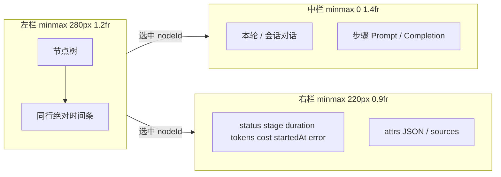

# Trace Detail 三栏布局（树 + 时间轴 + Content + Metadata）

Planned-with: Cursor Grok 4.5
Suggested-Impl-Model: 见「Suggested-Impl 子任务表」

> **For implementers:** 仅凭本 plan 即可落地；勿依赖对话记忆。所有落点均给出文件路径 + 函数/符号 + 锚点。
> 内部 UX 对照：业界常见 LLM Observability「Trace Detail」三栏（左树/时间条、中 Prompt·Output、右 Latency/Status/Tokens/Cost）。**禁止**引入第三方观测平台 npm 包或 iframe；**禁止**在 commit/PR 文案中点名第三方品牌。

**Goal:** 将 admin-console 现有双栏 `TraceExplorer` 升级为可扫视的三栏 Trace Detail：左侧节点树 + 绝对时间轴条、中间 Content（对话 / 步骤 I/O）、右侧选中节点元数据；并补齐 `model_step.startedAt` 使时间轴可定位。

**Architecture:** 数据源不变（`GET /api/traces/:traceId` → `assembleTraceTimeline` → `TraceTimeline`）。先在 assembler 把 span `created_at` 映射到 `TraceNode.startedAt`；再重构 `TraceExplorer` 为三栏 grid；时间轴用纯 CSS absolute positioning（`left%/width%` 相对 trace 时间窗），不引入图表库。对话与步骤 I/O 仍复用现有 `TraceConversationPanel` / `SessionConversationPanel` / `attrs.io`。

**Tech Stack:** Next.js admin-console、React、`@agenticx/core-api` 的 `TraceNode`/`TraceTimeline`、vitest、既有 Tailwind 语义 token（`border-border` / `bg-muted` / `text-muted-foreground` 等）。

---

## 根因与证据链

1. **当前是双栏，不是三栏 Content / Metadata 分离**
   `enterprise/apps/admin-console/src/components/trace-timeline-tree.tsx` 的 `TraceExplorer`（约 L308–488）：`selected` 时 `md:grid-cols-[1.1fr_1fr]`，右侧把「本轮/会话对话」与「节点详情 dl + io + attrs」**纵向堆叠**。对照目标：中栏只放 Content，右栏只放元数据。

2. **左侧「耗时条」是相对 max duration 的宽度条，不是共享时间轴**
   同文件 `TraceTreeRow`（约 L112–176）：`barPct = durationMs / maxDurationMs`，条从行首开始画满相对比例，**没有** `startedAt` 相对 trace 起点的 `offset`。因此无法表达「谁先谁后 / 是否重叠」。

3. **`model_step` 未填充 `startedAt`，详情栏「开始时间」常为 —**
   `enterprise/apps/admin-console/src/lib/trace-timeline.ts` 的 `assembleTraceTimeline`（约 L212–245）构造 `modelChildren` 时只设 `durationMs`，**不设** `startedAt`。
   但 `AgentTraceSpanRow.created_at: Date` 已在
   `enterprise/apps/admin-console/src/lib/db-stores/postgresql/agent-trace-store.ts:12-28` 与测试 fixture
   `enterprise/apps/admin-console/src/lib/__tests__/trace-timeline.test.ts` 的 `span()`（`created_at: new Date("2026-08-10T08:00:00.000Z")`）中存在。
   request 节点已有 `startedAt: log.log_time`（`trace-timeline.ts:194`）。

4. **类型层已支持时间字段**
   `enterprise/packages/core-api/src/trace.ts`：`TraceNode.startedAt?: string`、`durationMs?: number`。无需改 schema / migration。

5. **步骤 I/O 与对话是两条通路（保持不动）**
   - Span：`metadata.io.{prompt_preview,completion_preview}`（依赖网关 IO 捕获开关，缺则中栏只显示对话）
   - 对话：`GET /api/traces/[traceId]/conversation` + session expand
   本 plan **不**改捕获策略，只把已有数据摆进中栏。

---

## Suggested-Impl 子任务表

| 子任务 | Suggested-Impl-Model | 理由 |
|--------|----------------------|------|
| FR-1 assembler `startedAt` + 时间窗 helper + 单测 | Composer 2.5 | 纯函数接线与断言，样板清晰 |
| FR-2 / FR-3 三栏布局骨架 + 中栏 Content / 右栏 Metadata 拆分 | Composer 2.5 | 主要是现有 JSX 重组，落点明确 |
| FR-4 绝对时间轴条（CSS）+ kind 着色 | GPT-5.6 Terra 或 Composer 2.5 | 坐标计算要防 NaN/缺字段；视觉密度需对齐现有 token |
| FR-5 i18n | Composer 2.5 | 键值增补 |
| 全页/Drawer 接线与 tsc | Composer 2.5 | 改 labels 透传即可 |
| FR-7 DR 事件 `ts` + assembler 支线/阶段耗时 | Composer 2.5 | 类型交叉 + 纯函数回填，落点明确 |

最终 `Impl-Model` trailer 以实际使用为准。

---

## In scope

- FR-1：`assembleTraceTimeline` 为 `model_step` 写入 `startedAt`（ISO string from `span.created_at`）
- FR-2：`TraceExplorer` 三栏布局（左树+时间轴 | 中 Content | 右 Metadata）；未选中时仅左栏（或左栏全宽）
- FR-3：中栏 = 对话 scope（本轮/会话）+ 若有 `attrs.io` 则 Prompt/Completion 区块（可用现有 `ConversationMd` 或保持 monospace preview，**不强制**改 Markdown）
- FR-4：左侧每行绝对时间轴条：相对整条 trace 的 `[tMin, tMax]` 计算 `offsetPct` / `widthPct`
- FR-5：zh/en i18n 增补（layout 提示、时间轴空态等，若需要）
- FR-6：既有入口共用：`/traces/[traceId]` 与 portal-logs 详情 Sheet 内 `TraceTimelineInline` / `TraceExplorer`
- FR-7：深度调研支线 / 阶段 / 事件补齐 `startedAt` + `durationMs`（事件写入 `ts`，assembler 回填），使时间轴与元数据「耗时」可见

## Out of scope / no-scope-creep

- **不做** tags 字段 / 新表 / migration
- **不做** `parent_span_id` 工具调用树重构（继续现有 request → model_step 扁平 + DR 树）
- **不改** 网关 `GATEWAY_TRACE_IO_CAPTURE` 默认策略与截断长度
- **不引入** 第三方观测 SDK / iframe / 新图表库（禁止 recharts 仅为 Gantt 而加；用 CSS）
- **不改** Desktop 群聊运行图（`.cursor/plans/pending/2026-08-11-group-chat-process-observability.plan.md` 是另一条线）
- **不改** `agenticx/studio/server.py`
- **不改** Trace 列表页 Dashboard / Playground（图中其它屏）
- **不** 默认自动选中第一个节点（保持现状：点击才开右侧/三栏；若产品后续要默认选中可另开 plan）
- **不做** 存量无 `ts` 的历史 DR 事件回填（仅新产生的 run 有墙钟耗时；旧 run 支线仍可为 —）
- **不** 把顶栏 totals.duration_ms 改成全树时间窗（另议；本 FR 只修节点级耗时）

---

## 目标布局（实现意图）



未选中：`grid-cols-1`，仅左栏 + `selectHint`（与现逻辑一致）。
选中：`md:grid-cols-[minmax(280px,1.2fr)_minmax(0,1.4fr)_minmax(220px,0.9fr)]`（窄屏可改为上树 / 下中+右 或中右纵向堆叠，见 FR-2 窄屏规则）。

---

## FR / AC

### FR-1：assembler 填充 `model_step.startedAt`

**落点：** `enterprise/apps/admin-console/src/lib/trace-timeline.ts`
函数：`assembleTraceTimeline` 内 `modelChildren` map（约 L212–245）

**Before（意图）：**

```ts
return {
  id: `model-${span.id}`,
  kind: "model_step" as const,
  label,
  status: span.status,
  durationMs: span.duration_ms,
  // startedAt 缺失
  tokens: { ... },
  costUsd: Number(span.cost_usd) || 0,
  attrs: { ... },
  children: [],
};
```

**After（意图）：**

```ts
const startedAt =
  span.created_at instanceof Date
    ? span.created_at.toISOString()
    : typeof span.created_at === "string"
      ? span.created_at
      : undefined;

return {
  id: `model-${span.id}`,
  kind: "model_step" as const,
  label,
  status: span.status,
  startedAt,
  durationMs: span.duration_ms,
  tokens: { ... },
  costUsd: Number(span.cost_usd) || 0,
  attrs: { ... },
  children: [],
};
```

**同文件新增纯函数**（放在 `assembleTraceTimeline` 上方，便于单测导出）：

```ts
/** Trace time window from startedAt + durationMs across the tree. */
export function computeTraceTimeWindow(nodes: TraceNode[]): {
  tMinMs: number | null;
  tMaxMs: number | null;
} {
  // 深度优先：对每个有合法 Date.parse(startedAt) 的节点
  // start = parse(startedAt)
  // end = start + (durationMs ?? 0)
  // tMin = min(starts); tMax = max(ends, starts)
  // 若无任何合法 startedAt → 两者 null
}

export function computeGanttPlacement(
  node: Pick<TraceNode, "startedAt" | "durationMs">,
  tMinMs: number,
  tMaxMs: number,
): { offsetPct: number; widthPct: number } | null {
  // 非法/缺 startedAt/或 tMax<=tMin → null（调用方回退相对条或隐藏）
  // offsetPct = ((start - tMin) / span) * 100
  // widthPct = max(1, (durationMs || 0) / span * 100)  // 至少 1% 可见
  // clamp 到 [0,100]
}
```

- **AC-1.1:** 扩展 `enterprise/apps/admin-console/src/lib/__tests__/trace-timeline.test.ts`：
  fixture 中 `span({ id: "s1", step_no: 1, created_at: new Date("2026-08-10T08:00:02.000Z"), ... })`，断言对应 `model_step.startedAt === "2026-08-10T08:00:02.000Z"`。
- **AC-1.2:** 新增用例：`computeTraceTimeWindow` 在 request `log_time=08:00:00` duration 10000ms + model start 08:00:02 duration 1000ms 时，`tMinMs`/`tMaxMs` 覆盖该区间。
- **AC-1.3:** `computeGanttPlacement` 对缺 `startedAt` 返回 `null`。
- **AC-1.4:** 既有 sanitize / DR 树用例不回归。

**命令：**

```bash
pnpm -C enterprise/apps/admin-console exec vitest run src/lib/__tests__/trace-timeline.test.ts
```

Expected: PASS。

---

### FR-2：`TraceExplorer` 三栏骨架

**落点：** `enterprise/apps/admin-console/src/components/trace-timeline-tree.tsx`
符号：`export function TraceExplorer`（约 L262–491）

**改动意图：**

1. 外层 grid：
   - `!selected` → `grid-cols-1`（仅左）
   - `selected` → `md:grid-cols-[minmax(280px,1.2fr)_minmax(0,1.4fr)_minmax(220px,0.9fr)]`；`<md` 时用 `grid-cols-1`，顺序为 左 → 中 → 右（纵向滚动可接受）。
2. **左栏**：现有 `data.nodes.map(TraceTreeRow)`；去掉行内「相对 maxDuration 满宽条」的**主语义**（见 FR-4 替换为绝对条）。行末 `durationMs` 数字保留。
3. **中栏**（仅 `selected`）：迁入现有对话 scope UI + `TraceConversationPanel` / `SessionConversationPanel`（约 L338–399），以及 `attrs.io` Prompt/Completion 块（从右侧搬过来，约 L454–468）。中栏顶部保留 scope 切换；**不**放 status/tokens dl。
4. **右栏**（仅 `selected`）：迁入 `detailTitle` + ✕、kind badge、label、`DetailField` dl、sources、attrs JSON（约 L401–486）。✕ 行为不变：`setSelectedId(null)`。
5. 左栏点击切换选中逻辑不变：`onSelect` 同 id 再点关闭。

**窄屏：** 不强制三栏并排；保持单列堆叠即可（AC 以 `md+` 为准）。

- **AC-2.1:** `/traces/[traceId]` 选中一节点后，DOM 中可见三个区域：树、对话/IO、元数据（可用角色/文案区分：`labels.detailTitle` 仅出现在右栏）。
- **AC-2.2:** 未选中时不渲染中栏与右栏（与现 `selectHint` 一致）。
- **AC-2.3:** portal-logs Sheet 内同一组件行为一致（改 Explorer 即可，Sheet 宽度若过窄可在 `portal-logs/page.tsx` 将 Sheet `sm:max-w-*` 提到 `sm:max-w-6xl` 或 `sm:max-w-[90vw]`——**仅当**现宽导致三栏不可用时改；改前先目测）。
- **AC-2.4:** `pnpm -C enterprise/apps/admin-console exec tsc --noEmit` 通过。

**Labels 透传：** `traces/[traceId]/page.tsx` 与 `portal-logs/page.tsx` 已组装 `TraceExplorerLabels`；若新增文案键，两处同步传入（见 FR-5）。

---

### FR-3：中栏 Content 信息架构

**落点：** 同 `TraceExplorer` 中栏 JSX

**顺序（固定）：**

1. Scope tabs：本轮 / 整个会话（现有）
2. 对应 `TraceConversationPanel` 或 `SessionConversationPanel`
3. 若 `selected.attrs.io` 存在：分隔线 + `labels.ioTitle` + Prompt / Completion（搬自右栏）
4. 无 io 且对话 empty：不额外报错（面板自带 empty 文案）

**不要**把完整 `attrs` JSON 放进中栏（留在右栏）。

- **AC-3.1:** 有 `io.prompt_preview` 的 model_step 选中后，中栏可见 Prompt 文案，右栏**不再**重复同一 IO 大块（右栏可只保留 attrs 里的其它字段；若 attrs 仍含 `io` 键，JSON 里出现可接受，但不渲染独立 IO 卡片）。
- **AC-3.2:** 无 io 的 request 节点：中栏仍可加载本轮对话（若 API 有数据）。

---

### FR-4：左侧绝对时间轴条

**落点：**

- `TraceExplorer`：`useMemo(() => computeTraceTimeWindow(data.nodes), [data.nodes])`
- `TraceTreeRow`：新增 props `tMinMs` / `tMaxMs`（可为 null）；用 `computeGanttPlacement` 画条

**Before：** 行内 `barPct = durationMs / maxDurationMs`，条从 0 起向右延伸相对比例。

**After：**

```tsx
const place =
  tMinMs != null && tMaxMs != null
    ? computeGanttPlacement(node, tMinMs, tMaxMs)
    : null;

// 轨道：mt-1 h-1.5 w-full rounded-full bg-muted relative overflow-hidden
// 条：absolute h-full rounded-full，style={{ left: `${place.offsetPct}%`, width: `${place.widthPct}%` }}
// kind/status 着色：复用 kindDotClass 的失败态 → bg-destructive/80；model_step → bg-primary/70；
//   request → bg-muted-foreground/50；dr_* → bg-violet-500/70（或现有 badge 色系，选一种写死在函数 ganttBarClass(kind,status)）
```

若 `place == null`：不画条（或仅在有 `durationMs` 时保留极淡相对条作降级——**推荐不画相对条**，避免两种语义并存；plan 选定：**无 placement 则不画条，仅保留右侧 ms 数字**）。

左栏顶部可选加一条极简刻度（0% / 50% / 100% 或总 `duration` 文案），非必须；若加，文案走 i18n。

- **AC-4.1:** 单测覆盖 placement 数学（FR-1 的 `computeGanttPlacement`）。
- **AC-4.2:** 手工：同一 trace 下后发生的 model_step，条应比早发生的更靠右（用 fixture 或本地已有日志目测）。
- **AC-4.3:** 全树无任何 `startedAt` 时不崩溃，树与数字仍可用。

---

### FR-5：i18n

**落点：**

- `enterprise/apps/admin-console/messages/zh.json` → `portalLogs.traceRuntime.detail.*`（约 L1153）
- `enterprise/apps/admin-console/messages/en.json` 对称

**新增键（按需，名称固定）：**

```json
"contentTitle": "内容",
"metadataTitle": "元数据",
"ganttUnavailable": "无时间戳，无法绘制时间轴"
```

- `contentTitle`：中栏小节（可选；若中栏仅靠 conversation.title 可省略 `contentTitle`——**实施时若中栏已有「本轮对话」标题则可不加 contentTitle，但 `metadataTitle` 建议替换或并列于右栏 `detail.title`**）。
- 最小集：**可不新增键**若复用 `detail.title` 作右栏、`conversation.title` 作中栏。则 FR-5 降级为「确认无硬编码中文」；若出现新 UI 字符串必须进 i18n。

- **AC-5.1:** 切换 `zh`/`en` 无裸露硬编码中文（本 plan 新增 UI）。
- **AC-5.2:** `traces/[traceId]/page.tsx` 与 `portal-logs/page.tsx` labels 对象字段对齐 TypeScript（改了 `TraceExplorerLabels` 必须两处补全）。

---

### FR-6：入口与回归

**落点（只接线，不改业务逻辑）：**

| 文件 | 注意 |
|------|------|
| `enterprise/apps/admin-console/src/app/traces/[traceId]/page.tsx` | 已用 `TraceExplorer`；补 labels |
| `enterprise/apps/admin-console/src/app/portal-logs/page.tsx` | `TraceTimelineInline` / Explorer；必要时加宽 Sheet |
| `enterprise/apps/admin-console/src/components/trace-timeline-tree.tsx` | `TraceTimelineInline` 透传不变 |

- **AC-6.1:** 从 Portal 日志点进运行时过程，三栏可用。
- **AC-6.2:** 从 `/traces/:id` 直达，三栏可用。
- **AC-6.3:** 无新增依赖（`package.json` 不新增图表库）。
- **AC-6.4:** 既有对话预览/展开 Markdown 行为不回退（勿改 `conversation-message-list.tsx` / `conversation-md.tsx`，除非类型强制）。

---

### FR-7：深度调研支线 / 阶段 / 事件耗时

**根因：** `buildDeepResearchChildren`（`trace-timeline.ts`）对 `dr_lane` / `dr_phase` / `dr_event` 不写 `startedAt`/`durationMs`；编排侧 `lane_started` / `lane_done` 等事件载荷也无墙钟字段，故元数据「耗时」与时间轴条均为空。模型 step 来自 `agent_token_traces`，与 DR 事件树无关。

**写路径落点（stamp `ts`）：**

1. 类型（两处保持一致）：
   - `enterprise/packages/core-api/src/chat.ts` 的 `DeepResearchEvent`
   - `enterprise/packages/sdk-ts/src/deep-research.ts` 的 `DeepResearchEvent`

   Before：纯 discriminated union。
   After：先定义 payload union，再：

   ```ts
   export type DeepResearchEvent = DeepResearchEventPayload & { ts?: string };
   ```

   `ts` 为可选 ISO-8601，旧事件兼容。

2. Stamp（已有则不覆盖）：
   - `enterprise/apps/web-portal/src/lib/deep-research/orchestrator.ts` 的 `enqueueEvent`（约 L792）：
     `const stamped = { ...event, ts: event.ts ?? new Date().toISOString() };` 再 `writer?.push` / SSE。
   - `enterprise/apps/web-portal/src/lib/deep-research/run-store.ts` 的 `createRunWriter().push`（约 L797）：同样补 `ts`，覆盖非 orchestrator 入口。

**读路径落点（assembler）：** `buildDeepResearchChildren`

- 辅助：`eventTs(raw) → string | undefined`（合法 `Date.parse`）。
- **lane：** `lane_started` → 节点 `startedAt = eventTs`；`lane_done` → 若同 `laneId` 节点已有 `startedAt` 且 done 有 `ts`，则 `durationMs = done - start`（≥0），并写 `status`。
- **phase：** `phase` 事件设 `startedAt`；下一 `phase` 到来时给上一 phase 填 `durationMs`；循环结束若仍无 duration，用该 phase 子树中最大 `startedAt+duration` 或最后一个带 `ts` 的子孙回填（有则写，无则保持空）。
- **其它 dr_event：** 有 `ts` 则 `startedAt = ts`；点事件可不设 `durationMs`（时间轴无条，仅开始时间可显；若希望可见短条，可选 `durationMs: 0`——**本 FR 选定：点事件不设 durationMs**）。
- `sanitizeDrEventAttrs`：**保留** `ts`（随 rest 进入 attrs 可接受）。

**测试：** `enterprise/apps/admin-console/src/lib/__tests__/trace-timeline.test.ts`

- Fixture：`lane_started`/`lane_done` 带相隔 5s 的 `ts`，断言对应 `dr_lane.durationMs === 5000` 且 `startedAt` 正确。
- 无 `ts` 的旧事件：lane 仍无 `durationMs`（不回归、不瞎填）。

- **AC-7.1:** 带 `ts` 的 lane_started→lane_done 组装后元数据耗时与时间轴条可见。
- **AC-7.2:** 新 run 经 `enqueueEvent`/`writer.push` 落库的事件 JSON 含 `ts`。
- **AC-7.3:** 无 `ts` 历史事件不抛错、耗时仍为 —。
- **AC-7.4:** `pnpm -C enterprise/apps/admin-console exec vitest run src/lib/__tests__/trace-timeline.test.ts` 绿。

---

## 实施任务顺序（给 Composer）

### Task 1: 时间窗 helper + assembler startedAt + 测试

1. 在 `trace-timeline.ts` 导出 `computeTraceTimeWindow` / `computeGanttPlacement`。
2. `modelChildren` 写入 `startedAt`。
3. 扩展 `trace-timeline.test.ts`（AC-1.*）。
4. 跑 vitest 至绿。

### Task 2: 拆分 TraceExplorer 三栏 JSX

1. 按 FR-2/FR-3 移动区块；更新 `TraceExplorerLabels` 仅在必要时。
2. `tsc --noEmit`。
3. 目测 `/traces/...` 与 portal-logs Sheet。

### Task 3: TraceTreeRow 绝对条

1. 传入 `tMinMs`/`tMaxMs`；实现 `ganttBarClass`。
2. 删除相对 `maxDurationMs` 条（可删除 `maxDurationMs` prop 若不再使用——**若删除**，清理 `collectDurations` 与所有调用点）。
3. 手工确认条位置；vitest 数学用例仍绿。

### Task 4: i18n + Sheet 宽度（若需要）

1. 补 zh/en 与两处 page labels。
2. 最终 `tsc` + vitest `trace-timeline.test.ts`。

### Task 5: FR-7 DR 事件耗时（续作）

1. 两处 `DeepResearchEvent` 增加可选 `ts`。
2. `enqueueEvent` + `createRunWriter().push` stamp。
3. `buildDeepResearchChildren` 回填 lane/phase/event 时间字段 + 单测。
4. vitest 绿；新跑一条 deep research 后看支线耗时。

---

## 验证清单（实施者自测）

```bash
# 单测
pnpm -C enterprise/apps/admin-console exec vitest run src/lib/__tests__/trace-timeline.test.ts

# 类型
pnpm -C enterprise/apps/admin-console exec tsc --noEmit
```

手工（需本地 `enterprise` 已起、有带 model steps 的 trace_id）：

1. 打开 `/traces/<traceId>`，未选中 = 仅树。
2. 点击 `model_step`：出现三栏；右栏 tokens/cost/startedAt 有值；中栏对话或 IO。
3. 比较两个 step 的时间条左右位置与 `startedAt` 一致。
4. 再点同一节点：关闭中右栏。
5. Portal 日志详情抽屉同样走查一遍。
6. **（FR-7）** 新跑一轮 deep research 后打开同 trace：支线节点有耗时数字与时间轴条；选中后元数据「耗时」非 —。

---

## 风险与降级

| 风险 | 降级 |
|------|------|
| 旧数据 span 无可靠 `created_at` 顺序（与真实 LLM 开始时刻偏差） | 仍展示条；文案不宣称「精确墙钟」，仅作相对顺序辅助 |
| 多 request 节点时间窗被无关 log 拉宽 | `computeTraceTimeWindow` 用全树；若噪声过大，后续可改为「仅 primary.children + primary」——**本 plan 不做** |
| Sheet 过窄三栏挤压 | 加宽 Sheet 或窄屏单列（FR-2） |
| 无 IO 捕获 | 中栏只靠 conversation，不视为 bug |
| 存量 DR 事件无 `ts` | 支线耗时仍为 —；须新 run 才有数据（不做历史回填） |

---

## Commit 提示（实施阶段）

Plan 已在 `.cursor/plans/`。FR-1 / FR-2–6 已落地。续作建议：

3. `feat(enterprise): stamp deep-research event timestamps for lane duration`（FR-7）

Trailers：`Plan-Id: 2026-08-11-trace-detail-three-pane-layout`，`Plan-File: .cursor/plans/2026-08-11-trace-detail-three-pane-layout.plan.md`，`Plan-Model` / `Impl-Model` / `Made-with: Damon Li`。
Subject/body **勿**写第三方观测产品名。
