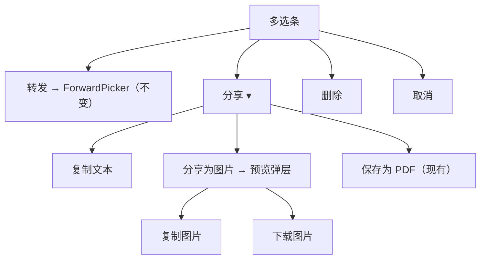

# 多选工具栏：转发保持 + 分享（文本 / 图片 / PDF）

Planned-with: Grok 4.6

Suggested-Impl-Model: Grok 4.5

> 分享图片预览卡需要对照现有聊天气泡圆角与 `bg-surface-card` 做视觉收口；工具栏/菜单接线本身是样板。Grok 4.5 够用。不要为菜单接线升到顶配。

## 背景与根因

多选条当前把三种「给人看」的出口摊成平级按钮，和「转给其他智能体会话」混在一起：

```11884:11939:desktop/src/components/ChatPane.tsx
{selectedMessageIds.size > 0 ? (
  <div className="mb-1.5 flex items-center gap-1 rounded-2xl ...">
    <span>已多选 {selectedTurnCount} 轮</span>
    <button onClick={forwardSelectedMessages}>转发</button>
    <button onClick={/* inline clipboard */}>复制</button>
    <button onClick={() => void exportSelectedMessagesToPdf()}>保存为 PDF</button>
    <button onClick={() => void deleteSelectedMessages()}>删除</button>
    <button onClick={() => setSelectedMessageIds(new Set())}>取消</button>
  </div>
) : null}
```

产品决策（已确认）：

- **转发** = 转给其他 agent / 其他会话。行为与 `ForwardPicker` 不变。
- **分享** = 给人看：纯文本、多轮对话图片（豆包式预览卡）、PDF。
- **分享链接** = 明确不做（后续）。

证据：复制是 `navigator.clipboard.writeText` 结构化纯文本（同文件 L11897–11914）；PDF 走 `exportSelectedMessagesToPdf` → `buildMessagesPdfHtml` → `window.agenticxDesktop.exportMessagesPdf`。图片分享尚不存在。主进程已有 PNG 剪贴板/下载 IPC，可复用：

- `desktop/electron/main.ts` `clipboard-write-png`（约 L6625）/ `download-png-to-downloads`（约 L6649）
- preload：`copyPngToClipboard` / `downloadPngToDownloads`（`desktop/electron/preload.ts` 约 L998–1004）
- 类型：`desktop/src/global.d.ts` 约 L1496–1500

## 子规划 → 推荐模型

| 子规划 | 推荐模型 | 理由 |
|---|---|---|
| 工具栏收成「转发 / 分享 ▾」+ 菜单接线 | Grok 4.5 | 改 className / 抽出已有 callback，无架构风险 |
| 分享文本过滤 + PDF 入口挪进菜单 | Grok 4.5 | 复用 `isExportableMessage` / 现有 PDF 函数 |
| 分享图片预览弹层 + 栅格化 | Grok 4.5 | 视觉要对齐气泡/输入框，但 token 与布局已在本 plan 写死 |

## In scope / Out of scope

**In scope**

- 多选条信息架构：`已多选 N 轮` · `转发` · `分享` · `删除` · `取消`
- `分享` 弹出菜单：复制文本 / 分享为图片 / 保存为 PDF
- 分享为图片：预览弹层（标题「分享图片预览」）+ 卡片（「分享对话」+ 日期 + AI 免责声明）+ `复制图片` / `下载图片`
- 分享内容按「轮」：用户提问 + 可导出的助手正文（含 `show_widget` 图），不含思考碎片与普通 tool 过程
- 复制文本同样过滤，避免把工具调用碎片贴进剪贴板

**Out of scope（禁止顺手做）**

- 分享链接 / 短链 / 云端卡片
- 发给飞书/微信联系人
- 改 `ForwardPicker` 目标列表或转发协议
- 改 `ChatView`（Lite 无此多选条）
- 改 PDF 版式（只把入口挪进分享菜单）
- 单条消息操作栏（气泡上的复制/转发）不改
- 不把 `html-to-image` 以外的新依赖加进来

## 信息架构



工具栏目标态（同一条 `rounded-2xl bg-surface-card` 条，不要描边）：

`已多选 N 轮` · `转发` · `分享` · `删除` · `取消`

分享菜单用 `createPortal(..., document.body)`，挂在「分享」按钮上方，样式对齐现有 `agx-menu-pop`（`ChatPane.tsx` 约 L675：`rounded-xl border border-border bg-surface-panel p-1.5 shadow-xl`）。菜单项不要出现「分享链接」。

## 分享内容过滤（文本 / 图片共用）

PDF 已有过滤，见 `desktop/src/utils/export-pdf-html.ts`：

- `isExportableMessage`（约 L116–120）：`tool` 只保留 `show_widget`；think-only assistant 丢掉
- `expandSelectionForCompletePdfExport`（约 L127–154）：补全整轮

**改动：** 把 `isExportableMessage` **export** 出来（现在是文件内 private function）。新增：

```ts
// desktop/src/utils/export-pdf-html.ts
export function messagesForShareExport(
  selected: Message[],
  allVisible: Message[],
): Message[] {
  return expandSelectionForCompletePdfExport(selected, allVisible)
    .filter(isExportableMessage);
}
```

文本分享、图片卡片、都走这个函数。PDF 继续走自己的 `expandSelectionForCompletePdfExport` + `buildMessagesPdfHtml`（内部已 filter），行为不变。

复制文本格式保持现状结构，只是输入从 `selectedMessages` 换成 `messagesForShareExport(...)`：

```
[我] 14:32
用户正文

[Machi] 14:33
助手正文
```

落点：把 `ChatPane.tsx` L11897–11914 的 inline `onClick` 抽成 `shareSelectedAsText`（与 `exportSelectedMessagesToPdf` 同级，约 L5356 附近）。成功后 `setStallHintToast("已复制文本")`（该 toast 已在输入区上方，L11793 一带）。

## 分享图片视觉（对齐截图，用本产品 token）

新建 `desktop/src/components/ShareImagePreviewModal.tsx`。

弹层结构（portal 到 `document.body`，遮罩对齐 `QrConnectModal` / `ForwardPicker`：半透明 scrim + 居中卡片，**主体不透明** `bg-surface-panel`，不要整层过透）：

- 顶栏：左「分享图片预览」，右 ✕（`onClose`）
- 中部：可滚动预览区（`max-h-[min(70vh,720px)] overflow-y-auto`）
- 底部同一排：`复制图片`（次按钮 `bg-surface-card`）在左，`下载图片`（主按钮 `--ui-btn-primary-*`）在右；取消语义由 ✕ 承担，不要再单独甩一个取消到中间

预览卡（这是栅格化目标节点 `shareCardRef`）必须是**完整高度、不被 overflow 裁切**的内层。预览滚动包在外层，`toPng(shareCardRef)` 打内层。

卡片样式（写死，实施时不要自由发挥）：

- 容器：`w-[420px] rounded-2xl bg-surface-card px-6 py-5 text-text-strong`
- 标题：「分享对话」，`text-[18px] font-semibold`
- 元信息：`YYYY 年 M 月 D 日` + `内容由 AI 生成，不能完全保障真实`，`text-[12px] text-text-muted`
- 分隔线：`border-t border-border`（不要粗白边）
- **用户消息**：右对齐气泡，`max-w-[85%] rounded-2xl bg-surface-hover px-3 py-2 text-[13px] whitespace-pre-wrap`
- **助手消息**：左对齐、无气泡，Markdown（`marked`，与 PDF 同源）。代码块用现有聊天气泡代码主题 class，不要浅色主题退化成纯 txt
- **widget**：复用 PDF 路径的 SVG 内联（调用 `buildMessagesPdfHtml` 太重）；图片卡只渲染 `role !== "tool"` 的 user/assistant 正文。`show_widget` 本轮若出现，在助手正文下用「（含图表，请以应用内为准）」一行 muted 提示，**不要**在 v1 把交互图表栅格进分享图（与 PDF 对 stock_chart 的降级一致）

免责声明文案固定为：`内容由 AI 生成，不能完全保障真实`。

## 栅格化与 IPC（不新造主进程通道）

`desktop/package.json` 增加依赖 `html-to-image`（仅 Desktop）。

`ShareImagePreviewModal` 内：

```ts
import { toPng } from "html-to-image";

const dataUrl = await toPng(shareCardRef.current, {
  pixelRatio: 2,
  cacheBust: true,
  backgroundColor: getComputedStyle(shareCardRef.current).backgroundColor,
});
const buf = await (await fetch(dataUrl)).arrayBuffer();
```

- 复制图片：`window.agenticxDesktop.copyPngToClipboard(buf)` → toast「已复制图片」
- 下载图片：`window.agenticxDesktop.downloadPngToDownloads({ buffer: buf, defaultFileName: \`Near对话_${slug}_${stamp}.png\` })` → toast「已保存到 {path}」（与 PDF 成功文案同一套 `setStallHintToast`）

失败：弹层**不关**，底部或卡片下展示错误（`栅格化失败：…` / `HTTP/IPC 错误`），不要只顶栏 toast。

**不要**改 `desktop/electron/main.ts` / `preload.ts`（已有 IPC）。改了 main 必须整进程重启，本次无必要。

## ChatPane 接线

**文件：** `desktop/src/components/ChatPane.tsx`

1. state（约 L2857 `forwardPickerOpen` 旁）：

```ts
const [shareMenuOpen, setShareMenuOpen] = useState(false);
const [shareImageOpen, setShareImageOpen] = useState(false);
const shareBtnRef = useRef<HTMLButtonElement | null>(null);
```

2. 抽出 `shareSelectedAsText`（从 L11897 inline 搬上来）。依赖：`selectedMessages`, `visibleMessages`, `userBubbleLabel`。

3. 工具栏「复制」「保存为 PDF」两个按钮删除，换成一个「分享」按钮：`ref={shareBtnRef}`，`onClick` toggle `shareMenuOpen`。

4. 菜单 portal：点击项后关菜单；点「分享为图片」只 `setShareImageOpen(true)`，不关多选态。

5. 在现有 `<ForwardPicker>`（约 L12802）旁挂：

```tsx
<ShareImagePreviewModal
  open={shareImageOpen}
  messages={messagesForShareExport(selectedMessages, visibleMessages)}
  sessionTitle={paneAvatarMeta.name || pane?.avatarName || "对话记录"}
  userBubbleLabel={userBubbleLabel}
  onClose={() => setShareImageOpen(false)}
  onToast={(msg) => setStallHintToast(msg)}
/>
```

菜单关闭：mousedown outside / Escape。`createPortal` 防被 composer `overflow` 裁掉。

## 测试

**文件：** `desktop/src/utils/export-pdf-html.test.ts`（已有 `expandSelectionForCompletePdfExport` 用例）

新增：

- `messagesForShareExport`：选中 ReAct 块里一条 assistant 时，结果含 user + 最终 assistant，**不含**普通 `role:"tool"`（非 widget）
- think-only assistant 不出现在分享列表

**文件：** `desktop/src/components/ShareImagePreviewModal.test.tsx`（若 Desktop 组件测试惯例不便挂 React Testing Library，改为纯函数测卡片数据：把「用户/助手分行」抽到 `desktop/src/utils/share-image-model.ts`）

```ts
export function buildShareImageTurns(messages: Message[]): Array<
  | { kind: "user"; text: string }
  | { kind: "assistant"; text: string }
>;
```

AC：

- AC-1：多选 1 轮后工具栏无「复制」「保存为 PDF」平级项，有「分享」
- AC-2：分享 → 复制文本，剪贴板为过滤后的 `[角色] 时间\\n正文`，toast「已复制文本」
- AC-3：分享 → 保存为 PDF，仍弹出系统保存框（现有 IPC）
- AC-4：分享 → 分享为图片，出现「分享图片预览」；卡内用户右气泡、助手左无气泡；有日期与免责声明
- AC-5：预览里点复制图片 / 下载图片，分别走 `copyPngToClipboard` / `downloadPngToDownloads`（可用 mock）
- AC-6：菜单无「分享链接」

手动：`desktop` 下 `npx vitest run src/utils/export-pdf-html.test.ts src/utils/share-image-model.ts`（或对应测试文件）。

## 实施顺序

1. export `isExportableMessage` + 新增 `messagesForShareExport` + 单测（红→绿）
2. `share-image-model.ts` + 单测
3. 工具栏改为转发/分享菜单；文本与 PDF 接到菜单（先不接图片弹层）
4. `ShareImagePreviewModal` 预览 UI（先不栅格，用固定 fixture 消息看布局）
5. 接 `html-to-image` + 现有 PNG IPC
6. ChatPane 挂弹层，按 AC 自测一轮多选

## 验收时不要做的事

- 不要改 `agenticx/studio/server.py`
- 不要动 logo / assets
- 不要把分享菜单做成再占一整条工具栏宽度的第二根 bar
