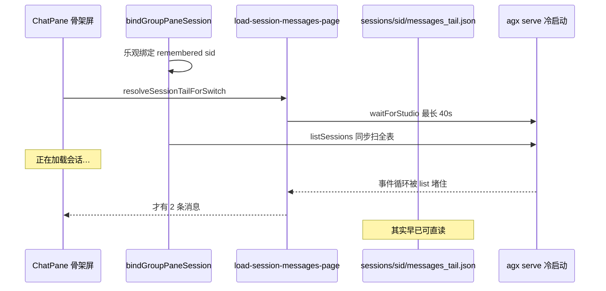

# 群聊打开卡在「正在加载会话」优化

Planned-with: Cursor Grok 4.6
Suggested-Impl-Model: Composer 2.5（磁盘直读 + 热路径跳过 list；无视觉重塑）

## 背景与现象

第一轮（`.cursor/plans/2026-08-14-group-chat-open-latency.plan.md`）修好了「无 `sessionId` → 正在初始化会话…」。重启后再开群聊（如 `aa272f90-b9eb-456b-97d5-427330dace3f` / 群「Graph难用例突击队」）仍长时间停在 **「正在加载会话…」** 骨架屏（`ChatPane.tsx` 约 L11948：`pane.loadingMessages && pane.sessionId`）。

## 根因与证据链

该 sid 磁盘事实：

- `avatar_id` = `group:98c19c731b99`
- `messages.json` **2 条 / 645B**（用户「在吗」+ 一句短回复）；`messages_tail.json` 已是可直接渲染的 tail 快照
- 同群其它会话也很小。**不是历史太大**

打开热路径仍：

1. 乐观绑定 sid 后 `ChatPane` bootstrap → IPC `load-session-messages-page` **先 `waitForStudio(40s)`** 再 HTTP（`desktop/electron/main.ts` 约 L8557-8570）
2. `bindGroupPaneSession` **仍 `await listSessions(group:…)`**（同文件 `list-sessions` 也 `waitForStudio`，`usePaneNavigation.ts` L171-173）
3. `GET /api/sessions` 在 FastAPI 事件循环上 **同步** 跑 `manager.list_sessions`（`server.py` L5570-5577）：`_list_latest_sessions_sync(limit=0)` 拉全表 latest（本机 summaries 约 800+ distinct）再 Python 过滤；`_list_persisted_sessions` 的 `known` 只有命中行，**仍会对其余 ~670 个会话目录做 metadata 探测**
4. 本机 `~/.agenticx/memory/sessions.sqlite` **~900MB**；冷启动 FTS backfill 与同步 list 叠在一起时，本该瞬时的 `/api/session/messages` 会被事件循环堵住（先前并发探测：messages 单独 ~0.7ms，与 list 并发时退化到数百 ms+）



## 需求

### FR-1：消息 bootstrap 优先读本地 tail，不阻塞在 Studio 就绪

落点：新建 `desktop/electron/session-messages-disk.ts`；`desktop/electron/main.ts` 的 `load-session-messages-page`（tailRounds 路径）与 `load-session-messages`。

- 会话根：`path.join(os.homedir(), ".agenticx", "sessions")`（与现有 `CONFIG_DIR`）
- `sessionId` 必须通过安全校验（`^[A-Za-z0-9._:-]+$`、禁止 `..`、resolve 后仍在 sessions 根下）
- tailRounds：先读 `messages_tail.json`；没有则切 `messages.json` 末 40 条；命中则 **跳过 `waitForStudio`**
- 全量 `load-session-messages`：先读 `messages.json`，命中同样跳过等待
- 磁盘未命中再走现有 HTTP（行为不变）

### FR-2：乐观 sid 已写入窗格时，打开热路径不再 `listSessions`

落点：`desktop/src/utils/group-pane-open.ts` 新增 `shouldSkipGroupSessionListOnOpen`；`usePaneNavigation.ts` `bindGroupPaneSession`。

- `optimisticSid` 非空且 `readCurrentSid() === optimisticSid` → **直接 return**，不要 `await listSessions`
- 无 remembered sid 时仍走 list → 可能 create（现状）

### FR-3：`GET /api/sessions` 离开事件循环

落点：`agenticx/studio/server.py` `list_sessions` handler（**函数体内** import `run_in_persist_pool`，禁止改文件顶部 import 区）。

```python
sessions = await run_in_persist_pool(manager.list_sessions, avatar_id)
```

### FR-4：`list_sessions(avatar_id=)` 在 SQL 侧过滤，且不要对 sqlite 已有会话做目录探测

- `SessionStore._list_latest_sessions_sync(limit=0, avatar_id=wanted)`：latest 查询加 `json_extract(s.metadata, '$.avatar_id') = ?`，name repair 只跑命中行
- 新增 `_list_all_session_ids_sync()`：`SELECT DISTINCT session_id FROM session_summaries`
- `_list_persisted_sessions`：传入 `avatar_id` 到 SQL；磁盘 `iterdir` 跳过 **全部** sqlite 已有 `session_id`（不只是当前 avatar 命中行）

## 验收标准

- AC-1：`desktop/tests/session-messages-disk.test.ts` — 合法 sid 读出 tail；`../` 拒绝；缺文件返回 null
- AC-2：`group-pane-open.test.ts` — 已绑定乐观 sid 时 `shouldSkipGroupSessionListOnOpen` 为 true；无 sid 为 false
- AC-3：`test_session_store.py` — `avatar_id=` 的 latest 列表不含其它 avatar；`test_session_manager_persistence.py` — 过滤 list **不会** 对 sqlite 已入库的其它 avatar 目录调用 `_load_latest_session_metadata_sync`
- AC-4：`npx vitest run` 上述前端测 + `pytest` 上述后端测绿
- AC-5：人工 — 完全退出再开 Desktop，点已聊过的项目群，应在约 1s 内离开「正在加载会话…」并看到磁盘上的消息（本会话仅 2 条），不必等 Studio 全量就绪

## In scope

- `desktop/electron/session-messages-disk.ts` + 测试 + `main.ts` 两处 IPC
- `group-pane-open.ts` / `usePaneNavigation.ts` 热路径跳过 list
- `server.py` list_sessions 进 persist pool（handler 内 import）
- `session_store.py` SQL avatar 过滤 + `_list_all_session_ids_sync`
- `session_manager.py` `_list_persisted_sessions` 把 avatar 传入 SQL 并用 sqlite id 跳过 iterdir
- 对应 pytest

## Out of scope

- 不改 ChatPane 骨架文案 / bootstrap 重试次数（2026-08-12 plan）
- 不改群聊懒创建、ProjectsView 预热、无 avatar 的全量历史列表
- 不改 `openMetaOrAvatarPane` 时序
- 不收缩 900MB sqlite / 不做 VACUUM（可另开运维任务）
- 不改 poll 空会话全量 `loadSessionMessages`（磁盘直读后骨架不再等它）

## 子规划 → 推荐模型

| 子任务 | 推荐模型 | 理由 |
|---|---|---|
| 磁盘直读 + vitest | Composer 2.5 | 纯解析/路径校验 |
| 跳过 list 决策函数 | Composer 2.5 | 一行谓词 |
| persist pool + SQL 过滤 | Composer 2.5 | 对照现有 query 加 WHERE |
