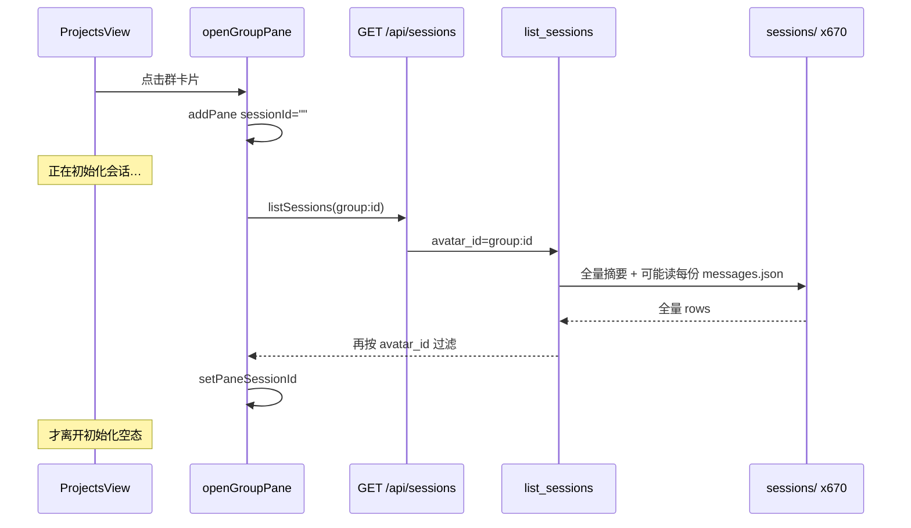

# 项目群聊打开卡在「正在初始化会话」优化

Planned-with: Cursor Grok 4.6
Suggested-Impl-Model: Composer 2.5（单文件前端决策函数 + 一处 list 过滤；无视觉重塑）

## 背景与现象

从「项目群聊」点开已有群（如「游戏开发工作室」）后，主区长时间停在「正在初始化会话…」+「重试」。该文案仅在 `!pane.sessionId && isGroupPane` 时出现（`desktop/src/components/ChatPane.tsx` 约 L11938）。

本机 `~/.agenticx/sessions` 约 **670** 个会话目录。每次打开群聊都会先 `await listSessions(group:…)`，该 API 在过滤 `avatar_id` 之前会全量扫描持久化会话（含 `messages.json` 补读），因此 `sessionId` 迟迟无法写入，UI 被锁在初始化空态。

## 根因与证据链

1. **群聊不能懒创建**：`openGroupPane`（`desktop/src/hooks/usePaneNavigation.ts` L175-216）新建窗格时 `sessionId=""`，必须等 `listSessions` → 可能再 `createSession` 才 `setPaneSessionId`。Meta/分身可空 `sessionId` 进空态；群聊不行。
2. **不走「上次会话」快路径**：同分文件 `openMetaOrAvatarPane`（L87、L137）会读 `getRememberedSessionForAvatar`。群聊打开完全忽略该缓存，即使 `App.tsx` L407-412 已按 `avatarId`（含 `group:`）写入 `agx-avatar-last-session-v1`。
3. **已有空窗格永不补绑**：`existing` 分支（L180-184）只 `setActivePaneId` 后 `return`。若上次 `listSessions`/`createSession` 失败或仍在飞，再次点击永远停在初始化态，只能手点「重试」（`initSession`）。
4. **`list_sessions(avatar_id=)` 仍全量扫盘**：`SessionManager.list_sessions`（`agenticx/studio/session_manager.py` L1178）在内存过滤后调用 `_list_persisted_sessions()`（L2933，**无 avatar 参数**）。该方法 `_list_latest_sessions_sync(limit=0)` 拉全部摘要；`chat_messages<=0` 时读 `messages.json`（L2951-2958）；标题需补全时再读磁盘（L2966-2969）；最后 `sessions/` 全目录 `iterdir` + 读未入库会话的 `messages.json`（L2988-3003）。`avatar_id` 过滤发生在这些 I/O **之后**（L1217）。670 个会话时，打开一个群也要付全量磁盘税。

## 需求

### FR-1：打开群聊立即绑定上次会话（乐观）

落点：`desktop/src/hooks/usePaneNavigation.ts` `openGroupPane`；决策纯函数新建 `desktop/src/utils/group-pane-open.ts`。

- 新建窗格后、`await listSessions` **之前**，若 `getRememberedSessionForAvatar(groupAvatarId)` 非空且当前 pane `sessionId` 仍空，立刻 `setPaneSessionId`（可顺带 `schedulePrefetchSessionTail`）。
- `listSessions` 返回后用 `pickConfirmedGroupSessionId`：remembered 仍在列表中则保留；否则改绑 `pickMostRecentSessionId`；列表为空且 pane 已有 sid（乐观绑定的空会话，因无消息被 list 隐藏）则 **不要** 再 `createSession`。
- 仅当列表无命中 **且** pane 仍无 sid 时才 `createSession`。

### FR-2：已有群窗格若 `sessionId` 为空须补绑

`existing` 分支：有 sid 则只聚焦（现状）；无 sid 则走与新建相同的 bind 流程，禁止裸 `return`。

### FR-3：`list_sessions(avatar_id=)` 在读盘前过滤

`_list_persisted_sessions(self, avatar_id=None)`：`wanted = normalize_session_avatar_binding(avatar_id)` 非空时，SQLite 行在读 `messages.json` / 推标题 **之前** skip 不匹配的 `metadata.avatar_id`。磁盘 fallback：先 `_load_latest_session_metadata_sync`，avatar 不匹配则 continue，禁止先读 `messages.json`。`list_sessions` 把 `avatar_id` 传入。

## 验收标准

- AC-1：`group-pane-open.test.ts` — remembered sid 为乐观绑定；list 命中则确认；list 空且已有 sid 不 create；list 空且无 sid 才 create；已有 pane 无 sid 需要 bind。
- AC-2：`test_session_manager_persistence.py` — 若干其它 avatar 的 `chat_messages=0` 会话不会在 `list_sessions(avatar_id="group:g1")` 时触发其 `messages.json` 读取；group 会话仍返回。
- AC-3：`cd desktop && npx vitest run src/utils/group-pane-open.test.ts` 与 `pytest tests/test_session_manager_persistence.py -k list_sessions` 绿。
- AC-4：人工 — 再次打开已聊过的项目群，应在约 1s 内离开「正在初始化会话…」（有历史则进消息，无历史进空态），不必点重试。

## In scope

- `desktop/src/utils/group-pane-open.ts` + 测试
- `desktop/src/hooks/usePaneNavigation.ts` `openGroupPane`（及把 `isSessionAvatarMatch` / `pickMostRecentSessionId` 挪到该 util 供测试；`openMetaOrAvatarPane` 改为 import，行为不变）
- `agenticx/studio/session_manager.py` `_list_persisted_sessions` / `list_sessions` 调用
- `tests/test_session_manager_persistence.py` 新增一条 avatar 过滤测例

## Out of scope

- 不改群聊懒创建（首条消息才 create）——群聊发送/工作区仍要求 bound `session_id`
- 不改 `ChatPane` 骨架屏 / bootstrap 重试（已有 2026-08-12 plan）
- 不改 `ProjectsView` 预热全量 tail
- 不改无 `avatar_id` 的全量 `GET /api/sessions`（历史面板）
- 不重构 `openMetaOrAvatarPane` 的 list-then-bind 时序

## 子规划 → 推荐模型

| 子任务 | 推荐模型 | 理由 |
|---|---|---|
| 纯函数 + vitest | Composer 2.5 | 决策表驱动，无 UI |
| `openGroupPane` 接线 | Composer 2.5 | 对照 avatar 路径抄 |
| `_list_persisted_sessions` 过滤 | Composer 2.5 | 在现有循环加 continue |
