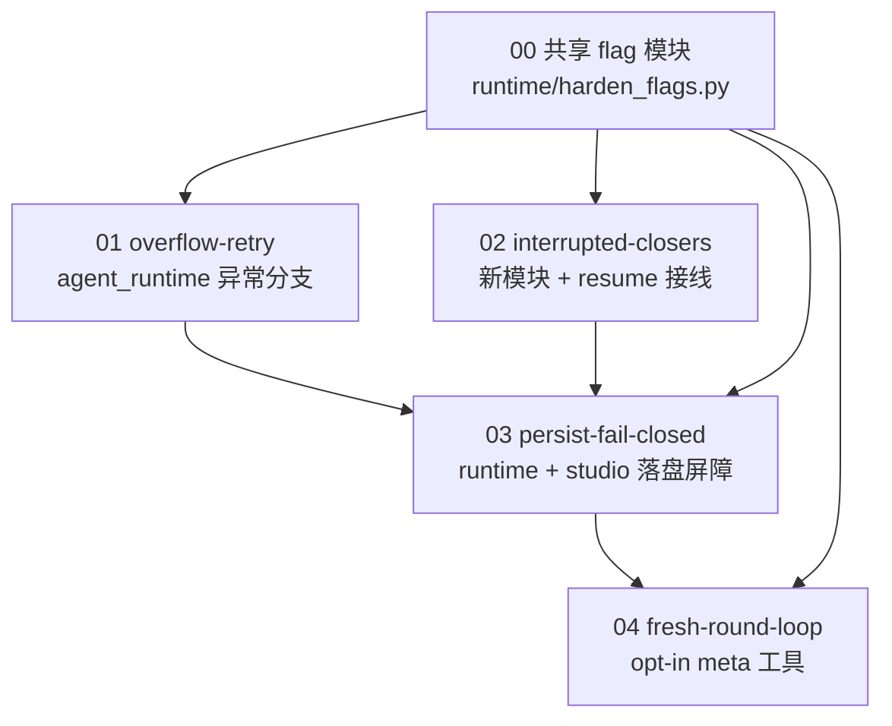

# 长程任务稳定执行：Runtime 加固（主规划）

Planned-with: Opus 5 (Cursor)
Research-Input: `research/codedeepresearch/deepseek-harness/`（gap analysis G-001~G-009 + proposal，SELECTIVE_ADOPT）；对话侧由 Grok 4.6 参与讨论收敛。

## 1. 这个规划要解决什么

Studio/Desktop 对话热路径是 `AgentRuntime.run_turn`（`agenticx/runtime/agent_runtime.py`）。长程任务上有四个已定位的稳定性缺口，都能在现有运行时边界内补齐，不需要换编排器：

| 编号 | 一句话缺口 | 子规划 |
|------|-----------|--------|
| G-003 | provider 确认 context overflow 后，**没有**「压历史 → 重试本轮」；现有分支只压 meta 系统提示且仅 `agent_id == "meta"` + 特定模型 | `01-overflow-retry` |
| G-001 | 崩溃续跑时把未完成 `tool_calls` **整段剥掉**，模型分不清「没开始」和「发出去了但结果未知」 | `02-interrupted-closers` |
| G-002 | 副作用前的落盘是 best-effort（`except: pass`），存储故障时会丢「已决定调用但未落盘」的前缀 | `03-persist-fail-closed` |
| G-004 | 超长任务只能拉长同一 transcript，撞 `max_tool_rounds` 上限；没有「上下文复位 + 有界 handoff」的循环 | `04-fresh-round-loop` |

明确**不做**（来自 proposal「Explicitly not doing」）：不迁入插件微内核 / Web UI / 沙箱 native；不把 `messages.json` 改写成事件日志 JSONL；不移植上游 goal-round-driver；不替换 `LoopDetector`；git/PR 文案不写第三方品牌或「对标 X」。

## 2. 执行依赖关系

- **00（flag 模块）** 是所有子规划的前置，体量极小，由 `01` 的实施者顺带建立（子规划 01 的 FR-0）。
- **01 与 02 可并行**：01 只改 `agent_runtime.py` 的 `except Exception as exc:` 分支（L4380~4514）；02 新建 `agenticx/runtime/interrupted_closers.py` 并只接线 `agenticx/studio/session_manager.py` 与 `agenticx/runtime/checkpoint.py`。两者文件不重叠。
- **03 必须在 01、02 之后**：03 会在同一函数 `_run_turn_inner` 内插入 LLM/工具前屏障，与 01 的改动区块相邻，串行避免冲突；同时 03 依赖 02 的 closer 语义（落盘失败跳过工具后，需要合法配对的占位 tool 行）。
- **04 最后**：新工具契约需要 01/03 的稳定基线，且其 handoff 落盘依赖 03 的 `persist_or_abort`。

## 3. 推荐实施模型（Suggested-Impl-Model）

| 子规划 | 推荐模型 | 理由 |
|--------|---------|------|
| 01 overflow-retry | 代码专精中档（如 Codex 系列） | 在 6000+ 行热路径文件里做精确分支插入，序列/状态敏感，但无需架构决策 |
| 02 interrupted-closers | Composer 2.5 / 便宜代码专精档（如 Kimi Code、GLM） | 纯函数 + 单测，逻辑自包含，plan 已给全规则 |
| 03 persist-fail-closed | 强推理档（如 GPT-5.x） | 跨 runtime + studio + session_manager 三处，把静默失败改成可见失败属高回归风险收口 |
| 04 fresh-round-loop | 中档实现 + 强推理档收口 | 新工具契约与循环不变量需要判断力；具体接线是样板 |

以上仅建议，最终 commit trailer 的 `Impl-Model` 以实际使用为准，由用户确认。

## 4. 全局验收门

1. 四个子规划各自的 AC 全绿。
2. 既有测试全绿，至少覆盖：`tests/test_ha_checkpoint_resume.py`、`tests/test_compactor.py`、`tests/test_loop_detector.py`、`tests/test_smoke_openclaw_overflow_recovery.py`。
3. 只要动过 `agenticx/studio/server.py`，提交前必须冷启动验证：`agx serve --host 127.0.0.1 --port <临时端口>`，确认进程不崩且 `/api/session`、`/api/avatars`、`/api/sessions` 返回 200（AGENTS.md 强制门槛）。
4. `no-scope-creep`：每个 diff 行都能追溯到某条 FR；`agent_runtime.py` / `server.py` 的 import 区禁止整段替换。

## 5. 回滚

每个子规划独立 flag（见 `agenticx/runtime/harden_flags.py`），单独关闭即回到当前行为：

| flag（config key） | env | 默认 |
|--------------------|-----|------|
| `runtime.overflow_retry` | `AGX_OVERFLOW_RETRY` | on |
| `runtime.max_overflow_retries` | `AGX_MAX_OVERFLOW_RETRIES` | 2 |
| `runtime.interrupted_closers` | `AGX_INTERRUPTED_CLOSERS` | on |
| `runtime.persist_fail_closed` | `AGX_PERSIST_FAIL_CLOSED` | **off**（先 warn+日志一版） |
| `runtime.fresh_round_loop` | `AGX_FRESH_ROUND_LOOP` | **off**（opt-in 工具） |

## 6. 子规划清单

- `.cursor/plans/pending/2026-08-14-longrun-runtime-hardening-01-overflow-retry.plan.md`
- `.cursor/plans/pending/2026-08-14-longrun-runtime-hardening-02-interrupted-closers.plan.md`
- `.cursor/plans/pending/2026-08-14-longrun-runtime-hardening-03-persist-fail-closed.plan.md`
- `.cursor/plans/pending/2026-08-14-longrun-runtime-hardening-04-fresh-round-loop.plan.md`

实施某个子规划前，把该文件从 `pending/` 移回 `.cursor/plans/` 根目录，commit trailer 用 `Plan-File: .cursor/plans/<name>.plan.md`。
