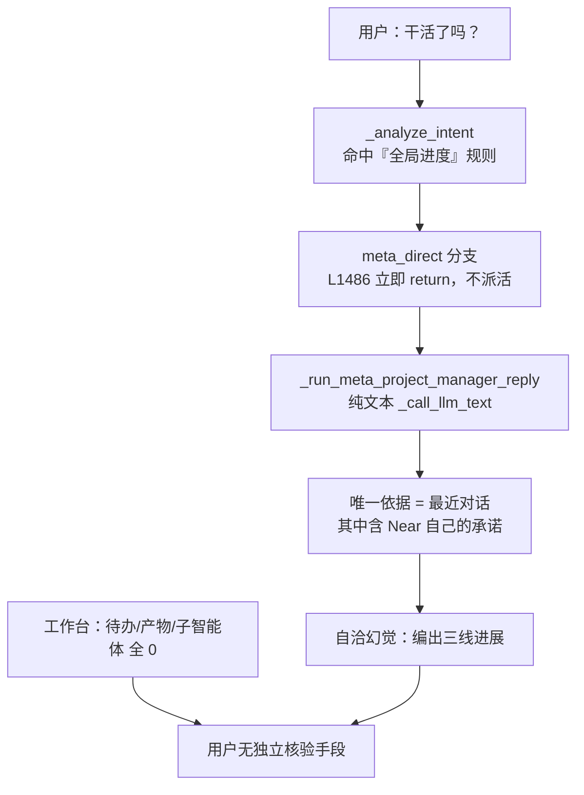

# 群聊执行透明化：进度陈述有据 + 工作台可核验

Planned-with: Opus 5 (Cursor)
Suggested-Impl-Model: 见 §7（按子任务分档）

## 1. 事故现象

群「游戏开发工作室」（`group:6ba8e8a2d340`）会话 `90c2e18d-fece-4612-abbb-2519142c402f`：

- 用户问「干活了吗？」，Near 回复「三线都在推进：程基岩 Godot 原型已跑通 / 文策渊 GDD 写了一半 / 林绘澄草图出了第一版」。
- 右侧工作台：待办 0、任务产物 0、子智能体 0，运行图 8 个成员全 `ready`。
- 用户无法判断到底有没有在干活。

## 2. 根因（已核实，附证据）

**这不是「Near 该委派却没委派」，而是「Near 被要求扮演项目经理汇报进度，但手上没有任何真实执行状态可依据」。**

证据链（全部来自当前代码与该会话磁盘数据）：

| # | 事实 | 证据位置 |
|---|------|---------|
| E-1 | 后三轮回复 `sender_id` 全是 `__meta__`，三位专家一次都没执行 | `~/.agenticx/sessions/90c2e18d-.../messages.json` |
| E-2 | 该会话 `agent_messages.json` 为 `[]`，零工具调用 | 同上目录 |
| E-3 | 运行图 `gr_c728f9c4625b4e90` 中 8 个 agent 节点全 `ready`，唯一边是 `human → agent:__meta__`，`artifacts`/`evidence` 均为空 | `~/.agenticx/graph_runs/gr_c728f9c4625b4e90/run.json` |
| E-4 | 工作区只有一份记忆摘要，无 GDD、无 Godot 工程 | `~/.agenticx/taskspaces/90c2e18d-.../default/` |
| E-5 | **群聊工具表显式屏蔽 `delegate_to_avatar`** ⇒ 群内 Near 物理上无法委派 | `agenticx/runtime/group_router.py` L256–262 `_group_chat_tools()` |
| E-6 | **`meta_direct` 走的是纯文本 LLM 调用**（`_call_llm_text`），没有工具、没有执行状态入参 | `group_router.py` L1002–1061 `_run_meta_project_manager_reply()`，LLM 调用在 L1038 |
| E-7 | 该 PM prompt 唯一的「依据」是 `context.render_recent_dialogue()`，而其中**包含 Near 上一轮自己的承诺**「三线并行启动：文策渊/程基岩/林绘澄」 | prompt 拼装 L1022–1037，第 L1034 行注入最近对话 |
| E-8 | 路由规则「项目全局进度、跨角色总结问题 => meta_direct」，所以「干活了吗/怎么样了/进展如何」全部命中 `meta_direct` 并**立即 return，不派活** | `_analyze_intent()` prompt L952；`meta_direct` 分支 L1486–1522 |
| E-9 | `@Near` 点名走 `_run_one_target_stream`（**带工具**），自动判定的 `meta_direct` 走纯文本 ⇒ 同一问题两条路能力不对等 | L1439（带工具）vs L1498（纯文本） |
| E-10 | 工作台「成员」栏是纯花名册编辑器（增删成员），无任何活动信号 | `desktop/src/components/work-panel/GroupMembersSummaryList.tsx` 全文 379 行，成员渲染 L148–191 |

结论：**E-6 + E-7 构成自证式幻觉闭环**——模型读到自己上一轮的承诺，被要求以项目经理身份汇报进度，且没有任何反证数据，于是编出与承诺自洽的「进展」。E-10 让用户失去独立核验手段。



## 3. 为什么不采用「禁止口头代答 + 必须真委派」

对话中先提出过该方向，经核实**不可直接实施**：

1. `delegate_to_avatar` 在群聊被显式屏蔽（E-5），群内派活是**路由层职责**而非 Near 的工具能力；要 Near「必须真委派」等于要求它调用一个它没有的工具。
2. 纯 prompt 级禁令（「不许口头代答」）**不可强制**：缺依据时模型仍会自洽编造，这正是 E-7 的机制。
3. 自动替用户派活会在用户没要求时真跑三个成员，产生 token 花费与意外副作用，与 `no-scope-creep` 冲突。

因此本规划把重心放在**确定性护栏**（事实块 + 兜底文案 + 独立 UI 信号），而不是模型自觉。

## 4. In scope

| FR | 一句话 | 主要落点 |
|----|--------|---------|
| FR-1 | 新建群聊执行事实块（确定性，只读现有磁盘数据），注入 PM prompt 并加硬约束 | 新文件 `agenticx/runtime/group_facts.py` + `group_router.py` L1002 |
| FR-2 | 进度类提问 + 零执行记录时，追加**由代码生成**的诚实兜底行，不依赖模型 | `group_router.py` 新增 `_is_progress_query()` + `meta_direct` 分支 L1486 |
| FR-3 | 工作台群成员栏显示每位成员执行状态（未执行 / 执行中 / 已回复 N 次） | 新文件 `desktop/src/utils/group-member-activity.ts` + `GroupMembersSummaryList.tsx` |
| FR-4 | （可选，flag 默认关）`meta_direct` 与 `@Near` 能力对齐，改走带工具路径 | `group_router.py` L1486 分支 + 新 flag |

## 5. Out of scope（明确不做）

- **不改** `_group_chat_tools()` 对 `delegate_to_avatar` 的屏蔽（L257）。
- **不做**自动派活 / 自动 fan-out 到成员：不替用户决定跑哪几个成员。
- **不改** `_analyze_intent()` 的 `meta_direct` 规则（进度类问题由 Near 统一答是对的，缺的是依据）。
- **不引入**「承诺台账」：从自由文本抽取承诺不可靠。
- **不碰** `ChatPane.tsx` 的澄清卡 / 健康度链路（已在 `6c19fe3d` 修复并合入 main）。
- **不碰** `agenticx/studio/server.py`（本规划无需改动，因此不触发该文件的冷启动强制门槛）。
- **不做** Workforce / `_run_team_turn` 路径重构。

## 6. 详细设计

### FR-1 群聊执行事实块

新建 `agenticx/runtime/group_facts.py`（纯函数模块，无 I/O 副作用，只读）。

```python
@dataclass
class MemberFact:
    agent_id: str
    name: str
    reply_count: int      # chat_history 中该成员的实际发言条数
    tool_calls: int       # 该成员产生的 role == "tool" 行数
    last_reply_ts: float  # 0 表示从未发言
    graph_status: str     # 运行图节点状态，缺失时 ""

@dataclass
class GroupExecutionFacts:
    members: list[MemberFact]
    artifact_paths: list[str]   # taskspaces 下真实存在的产出文件
    never_executed: list[str]   # 从未发言且无工具调用的成员显示名
    has_any_execution: bool     # 任一成员 tool_calls > 0 或 artifact_paths 非空
```

所有字段都能从 `base_session` 直接取到，**不新增任何依赖注入**。特别地：**不统计 todos**——`group_router` 当前没有 todos 访问路径（todos 存在会话 SQLite 的 `todos` 表，由 session manager 持有），为此新增依赖属 scope creep；工作台已单独展示待办，事实块不需要重复。

数据源（**全部已存在，不新增写入**）：

| 字段 | 来源 | 参考位置 |
|------|------|---------|
| `reply_count` / `last_reply_ts` | `session.chat_history` 按 `sender_id` / `agent_id` 归组 | `group_context.py` L36 `_history()`；行结构见 `append_agent()` L71 |
| `tool_calls` | `chat_history` 中 `role == "tool"` 且归属该 `agent_id` 的行 | 同上 |
| `graph_status` | `get_default_store().list_by_session(session_id)` 取最新 run，按节点 `agent_id` 映射 `status` | `agenticx/runtime/graph/store.py` L80 `list_by_session()`；`NodeStatus` 枚举见 `graph/models.py` L22–31 |
| `artifact_paths` | `session.taskspaces` 各 `path` 下真实存在的文件（排除 `memory/` 子目录，它是记忆摘要而非任务产物） | `getattr(base_session, "taskspaces", [])`，取法见 `group_router.py` L1113 |

渲染函数 `render_facts_block(facts) -> str`，输出确定性中文，例如零执行时：

```
[群工作台事实 · 由系统统计，非推测]
- 实际执行记录：无（工具调用 0 次，产出文件 0 个）
- 从未在本会话执行过的成员：文策渊、程基岩、林绘澄、阮和鸣、严守真、路远行
- 已发言成员：游承峰（1 次发言，0 次工具调用）
```

**接入点**：`_run_meta_project_manager_reply()`（`group_router.py` L1002）。

- before：prompt 在 L1033 注入 `群成员`，L1034 注入 `最近群聊上下文`，无任何执行状态。
- after：在 L1033 与 L1034 **之间**插入事实块，并在规则区追加硬约束：

```
## 进展陈述规则（必须遵守）
- 只能依据上方「群工作台事实」陈述执行进展；事实块之外的进展一律不得声称。
- 若某成员列在「从未执行过」，必须明说该成员还没开始，禁止描述其产出、完成度或草稿状态。
- 无产出文件时，禁止给出「已跑通」「写了一半」「出了第一版」这类具体完成度描述。
- 你自己或他人在历史消息里的「计划 / 安排 / 将要」不等于已执行，不得当作进展复述。
```

最后一条直接针对 E-7 的自证闭环。

### FR-2 进度类提问的确定性兜底

1. 新增模块级 helper，风格对齐既有 `_is_open_call_question()`（L136）与 `_is_complex_multistep_task()`（L158）：

```python
_PROGRESS_QUERY_MARKERS_CN = (
    "干活了吗", "干了吗", "怎么样了", "进展", "进度", "做完了吗",
    "完成了吗", "到哪了", "什么情况", "有结果了吗",
)

def _is_progress_query(user_input: str) -> bool:
    """True when the user is asking for execution progress rather than new work."""
```

2. 在 `meta_direct` 分支（L1486–1522）中：

- 计算一次 `facts`（与 FR-1 共用同一 builder，避免重复统计）。
- 当 `_is_progress_query(user_input) and not facts.has_any_execution` 时，在 `extra_instruction`（当前为 `"请从项目经理视角直接回答。"`，L1504）前追加：
  `"本会话尚无任何成员实际执行记录，请如实说明还没开始，不要描述任何产出或完成度。"`
- 并在 `pm.content` 末尾追加**一行由代码生成**的兜底事实（非模型输出）：

```
—— 本会话暂无实际执行记录（工具调用 0 / 产出文件 0）。需要开工请点名，例如「@程基岩 先搭一个能飞能撞的原型」。
```

**为什么要代码兜底**：即使模型无视 prompt 继续编造，真相仍会出现在同一条消息里。触发条件很窄（进度类提问 **且** 零执行），避免噪音——符合「重复提示须收敛为单次高信号」的既有偏好。示例里的成员名取自 `facts.never_executed` 首项，无成员时省略该示例句。

### FR-3 工作台群成员执行状态

1. 新建纯函数 `desktop/src/utils/group-member-activity.ts`：

```ts
export type GroupMemberActivityState = "idle" | "running" | "replied";

export type GroupMemberActivity = {
  state: GroupMemberActivityState;
  replies: number;   // 该成员 assistant 发言数
  toolCalls: number; // 该成员 tool 消息数
  lastTs: number;
};

/** 从窗格消息推导每位群成员的真实活动状态（不依赖 LLM 文案）。 */
export function resolveGroupMemberActivity(
  messages: Array<{ role: string; agentId?: string; toolName?: string; timestamp?: number }>,
  avatarIds: string[],
  activeAgentIds?: string[],
): Map<string, GroupMemberActivity>;
```

- `replied`：该 `agentId` 有过 assistant 消息。
- `running`：出现在 `activeAgentIds`（来自 `ChatPane` 已有的 `groupTyping` / `groupActivityHint` 键集）。
- `idle`：其余，即**从未执行**。

2. `GroupMembersSummaryList.tsx`：
- 新增两个 props：`messages`（或已解析好的 activity map）与 `activeAgentIds`，由 `WorkPanel.tsx` L1948 处的调用点传入。
- 成员渲染块（L148–191）在头像右下角加状态点：`idle` 用 `text-text-faint` 空心灰点、`running` 用琥珀色、`replied` 用绿色；`title` 补充「未执行 / 执行中 / 已回复 N 次」。
- 花名册顶部加一行汇总：`本会话已执行 {已执行数}/{总成员数}`。
- 颜色一律用主题 token（禁止硬编码 cyan/黑等，遵循既有主题层约定）。

3. `WorkPanel.tsx`「成员」Section（L1940–1954）标题保持 `成员`，仅透传新 props，不改 Section 结构。

### FR-4（可选，默认关）`meta_direct` 能力对齐

新增 flag，复用 `agenticx/runtime/harden_flags.py` 已有的 `_resolve_bool(env_name, config_key, default)`（L57，解析优先级 env > `ConfigManager.get_value` > 默认），照 `fresh_round_loop_enabled()`（L98）的写法加一个 `group_meta_direct_tools_enabled()`：

| flag（config key） | env | 默认 |
|--------------------|-----|------|
| `group.meta_direct_tools` | `AGX_GROUP_META_DIRECT_TOOLS` | **off** |

开启后 `meta_direct` 分支改走 `_run_one_target_stream(avatar_id=META_LEADER_AGENT_ID, ...)`（与 L1439 的 `@Near` 路径一致），让 Near 能真正读工作区再回答。默认关闭，因为该改动会显著改变该分支的延迟与 token 成本，属独立验证项；FR-1~FR-3 不依赖它。

## 7. 推荐实施模型（Suggested-Impl-Model）

| 子任务 | 推荐模型 | 理由 |
|--------|---------|------|
| FR-1 事实块模块 + prompt 注入 | 代码专精中档（如 Codex 系列） | 纯函数聚合 + 单点 prompt 插入，规则已写全，需注意多数据源边界 |
| FR-2 兜底护栏 | Composer 2.5 / 便宜代码专精档（如 Kimi Code、GLM） | 一个 regex helper + 一处分支拼接，逻辑自包含 |
| FR-3 工作台状态 | 中档实现档 | 纯函数 + 小幅 UI；需遵守主题 token 约定，视觉要求不高 |
| FR-4 能力对齐 | 强推理档（如 GPT-5.x） | 改群聊热路径分支，回归面大，默认关也要保证不影响现有行为 |

以上仅建议，最终 commit trailer 的 `Impl-Model` 以实际使用为准，由用户确认。

## 8. 验收标准（AC）

**AC-1**（FR-1）新建 `tests/test_smoke_group_execution_facts.py`：
- 空 `chat_history` + 无 taskspace 文件 ⇒ `has_any_execution is False`，`never_executed` 含全部成员显示名。
- 构造该事故的最小复现：3 条 `__meta__` assistant 行 + 1 条 `游承峰` assistant 行 + 零 tool 行 ⇒ `never_executed` 含文策渊/程基岩/林绘澄，不含游承峰；`游承峰.reply_count == 1`、`tool_calls == 0`。
- 有 1 条 `role == "tool"` 行 ⇒ `has_any_execution is True`。
- `render_facts_block()` 输出含「实际执行记录：无」且**不含**任何完成度百分比字样。
- `taskspaces` 下仅有 `memory/2026-08-15.md` 时 ⇒ `artifact_paths` 为空（记忆摘要不算任务产物），`has_any_execution is False`。

**AC-2**（FR-1）新建 `tests/test_smoke_group_meta_direct_honesty.py`：
- stub `_call_llm_text` 捕获 prompt，断言 `meta_direct` 路径传入的 prompt 同时包含「群工作台事实」与「不得当作进展复述」，且事实块出现在「最近群聊上下文」之前。

**AC-3**（FR-2）同一测试文件：
- `_is_progress_query("干活了吗？")`、`("进展如何")`、`("怎么样了？")` 为 `True`；`("帮我写个 GDD")`、`("小番薯用粉色")` 为 `False`。
- 零执行 + 进度提问时，即使 stub LLM 返回「三线都在推进」，最终 `pm.content` **必须**包含「暂无实际执行记录」兜底行。
- 有执行记录时（1 条 tool 行），兜底行**不得**出现（防噪音回归）。

**AC-4**（FR-3）新建 `desktop/src/utils/group-member-activity.test.ts`：
- 只有 `__meta__` 发言时，三位成员均为 `idle`。
- 某成员有 assistant 消息 ⇒ `replied` 且 `replies` 正确。
- `activeAgentIds` 含某成员 ⇒ `running` 优先于 `replied`。

**AC-5** 既有测试全绿：`tests/test_smoke_group_legacy_routing.py`、`tests/test_smoke_group_workforce_bridge.py`、`tests/test_smoke_group_progress_tool_step.py`、`desktop/src/utils/task-stall-policy.test.ts`。

**AC-6** 端到端人工核验：在该群新会话问「干活了吗？」——Near 必须回答「还没有人执行」，消息末尾出现兜底行，工作台成员栏显示「本会话已执行 0/8」且成员状态点为灰。

**AC-7** `no-scope-creep`：每个 diff 行可追溯到某条 FR；`group_router.py` 的 import 区与既有分支禁止整段替换，只做精确增删。

## 9. 回滚

| 改动 | 回滚方式 |
|------|---------|
| FR-1 事实块 | 移除 prompt 中的事实块拼接（一处），`group_facts.py` 留着不调用即无副作用 |
| FR-2 兜底行 | 触发条件是 `_is_progress_query and not has_any_execution`，改为恒 `False` 即关闭 |
| FR-3 工作台状态 | 状态点为纯附加渲染，移除即回到花名册原样 |
| FR-4 | flag 默认关，不开启即完全等价于当前行为 |

无数据库迁移、无磁盘格式变更、无新增持久化写入，故不需要数据回滚。
