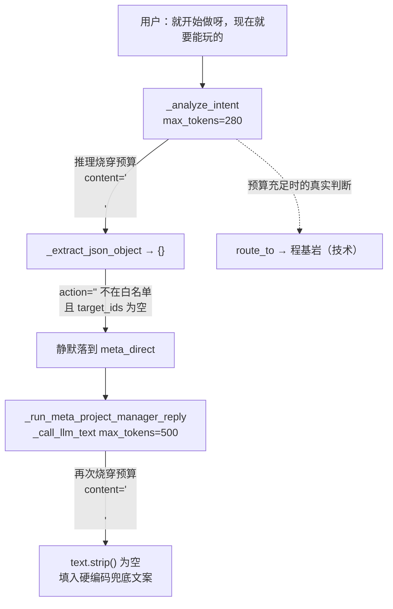

# 群聊路由 LLM 预算饥饿：截断即静默降级修复

Planned-with: Opus 5 (Cursor)
Suggested-Impl-Model: 见 §7

## 1. 事故现象

群「游戏开发工作室」会话 `90c2e18d-fece-4612-abbb-2519142c402f`：

- 用户连续两轮（`messages.json` 索引 8、10）收到**完全相同的 32 字回复**：
  `我先给出当前可确认的进展：暂无足够信息，请指明想看的模块或成员。`
- 索引 9 的用户消息是「就开始做呀，我今我现在就要看到能玩的东西」——这是**开工指令**，不是查进度，回复却是一句进度汇报口吻的空话。
- 用户把同一句话前面加上 `@Near` 重发（索引 11），立刻得到 414 字正常回复（索引 12）。
- 用户误以为是模型能力问题（当时在 MiniMax-M2.7 / M3 之间切换过），实际不是。

## 2. 根因（已实机复现，附数据）

**根因：`group_router.py` 里两处 LLM 调用的 `max_tokens` 预算太小，被推理模型的思维链吃光，返回的 `content` 只剩空白字符；两处失败都被静默降级，且最终降级文案伪装成了业务结论。**

那句 32 字文案是**代码硬编码的空回复兜底**，不是模型生成的，全仓仅一处（`group_router.py:1113`）。

### 2.1 失败链路



### 2.2 复现数据

用仓库内 `MiniMaxProvider` + 该会话真实上下文（`messages.json` 索引 0–7 全文注入）重建 prompt，参数与代码一致：

| 调用点 | max_tokens | 模型 | finish_reason | completion_tokens | content | 后果 |
|---|---|---|---|---|---|---|
| `_analyze_intent` | 280 | MiniMax-M2.7 | stop | 264 | 117 字合法 JSON | 正确判为 `route_to` → 程基岩 |
| `_analyze_intent` | 280 | MiniMax-M3 | **length** | 280（撞满） | `'\n\n'` | 解析失败 → 静默 `meta_direct` |
| `_run_meta_project_manager_reply` | 500 | MiniMax-M2.7 | **length** | 500（撞满） | `'\n\n'` | **触发兜底文案** |
| `_run_meta_project_manager_reply` | 500 | MiniMax-M3 | stop | 384 | 425 字正常 | 正常回复 |

关键结论：

1. **该网关的推理 token 计入 `max_tokens`**。M3 的意图判断思维链 1191 字符，280 预算直接撞满，正文只剩两个换行。
2. **四次调用全部贴着边界**（264/280、500/500、384/500），所以同一会话里索引 3、5、12 正常而 8、10 失败——**结果随机，不是模型不行**。
3. **短 prompt 下 `content` 完全正常**（M2.7 198 字 / M3 304 字，`finish_reason=stop`）。所以这**不是** provider 丢弃 `reasoning_content` 的问题，`_parse_response` 只读 `content` 在预算充足时工作正常。
4. **路由规则本身没错**。预算够时意图判断准确产出 `route_to` → 程基岩，理由「用户要求立即开始制作并看到可玩 Demo，需技术执行开发」。`meta_direct` 是 JSON 解析失败后的默认值，不是误判。

### 2.3 证据位置

| # | 事实 | 位置 |
|---|---|---|
| E-1 | 兜底文案硬编码，全仓唯一一处 | `agenticx/runtime/group_router.py:1113` |
| E-2 | 意图判断预算 280 | `group_router.py:1014-1020`（`_analyze_intent` 内 `_call_llm_text(... temperature=0.1, max_tokens=280)`） |
| E-3 | PM 回复预算 500 | `group_router.py:1104-1110`（`_run_meta_project_manager_reply` 内 `_call_llm_text(... temperature=0.2, max_tokens=500)`） |
| E-4 | `_call_llm_text` 丢弃 `finish_reason`，只返回文本 | `group_router.py:906-925`，末行 `return self._extract_text(response)` |
| E-5 | `_extract_text` 对空白内容 `.strip()` 后返回 `''` | `group_router.py:871-886` |
| E-6 | 解析失败静默默认 `meta_direct`，无任何日志 | `group_router.py:1039-1047` |
| E-7 | `finish_reason` 在响应对象上可读 | `agenticx/llms/response.py:12-18`（`LLMChoice.finish_reason`） |
| E-8 | `@` 点名时 `_analyze_intent` 直接短路、**不调 LLM**，因此绕过该缺陷 | `group_router.py:976-981` |
| E-9 | 该会话零工具调用（`agent_messages.json` 为 `[]`，2 字节） | `~/.agenticx/sessions/90c2e18d-.../agent_messages.json` |

## 3. 设计取舍（勿走弯路）

实施者容易走错的两个方向，**明确否决**：

1. **不要把 `reasoning_content` 合并进正文**。看到「思维链占满预算」容易想到在 `litellm_provider._parse_response` 里把 `reasoning_content` 拼进 `content`（`kimi_provider.py:486-489` 有这种写法）。本场景**不能这么做**：那会把模型内部推理直接暴露给终端用户。正确做法是给足预算 + 识别截断。
2. **不要改 `_analyze_intent` 的路由规则或加开工关键词表**。复现已证明规则本身正确（§2.2 结论 4）。改 prompt 或加 `_is_progress_query` 式关键词属于治错了病根。

另外一个成本认知：`max_tokens` 是**上限而非计费量**，只有模型真的生成才计费。把上限从 280 抬到 1500 在正常轮次不产生额外 token 花费，仅在原本会被截断的轮次多花本该生成的那部分。

## 4. In scope

| FR | 一句话 | 落点 |
|----|--------|------|
| FR-1 | 两处调用的 `max_tokens` 抬高并可配置 | `harden_flags.py` 新增 2 个 int flag；`group_router.py:1014-1020`、`1104-1110` |
| FR-2 | `_call_llm_text` 识别 `finish_reason == "length"` 且正文为空时，用加倍预算重试一次 | `group_router.py:906-925` |
| FR-3 | 意图解析失败、兜底触发两处补 warning 日志与 reason 标记 | `group_router.py:1039-1047`、`1111-1113` |
| FR-4 | 兜底文案改为如实说明「模型本轮无输出」，不再伪装进度汇报 | `group_router.py:1113` |

## 5. Out of scope（严格边界，勿顺手改）

- **不改** `_analyze_intent` 的 prompt 文本与路由规则。
- **不改** 解析失败时默认落 `meta_direct` 的**行为**（FR-3 只加可观测性，不改分支走向）；避免变成自动派活产生意外副作用。
- **不改** `litellm_provider.py` / `minimax_provider.py` 任何一行（§3 已否决合并 reasoning 的方案）。
- **不改** `_group_chat_tools()` 对 `delegate_to_avatar` 的屏蔽。
- **不改** `_is_progress_query` 关键词表与零执行兜底行逻辑（`_append_zero_exec_fallback`）。
- **不动** `agenticx/studio/server.py`（本 plan 无需改动该文件，故不触发其冷启动强制门槛）。
- **不改** `_call_llm_text` 的**签名与返回类型**：现有 4 处测试以 `async def stub_llm(**kwargs) -> str` 形式打桩（`tests/test_smoke_group_meta_direct_honesty.py:78,113,152`），改签名会全线破测。

## 6. 详细设计

### FR-1 预算可配置并抬高

在 `agenticx/runtime/harden_flags.py` 末尾（现文件 106 行结束，紧跟 `group_meta_direct_tools_enabled()` 之后）新增两个函数，**照抄同文件 `max_overflow_retries()`（L72-85）的 env → config → default + 钳制范式**，复用已有的 `_config_int()`（L41-54）：

```python
def group_intent_max_tokens() -> int:
    """``AGX_GROUP_INTENT_MAX_TOKENS`` / ``group.intent_max_tokens``. Default 1500, clamp 280..8000.

    Reasoning models spend the completion budget on the thinking chain before
    emitting the routing JSON; 280 tokens truncates them mid-thought.
    """
    raw: Optional[int] = None
    env = os.environ.get("AGX_GROUP_INTENT_MAX_TOKENS", "").strip()
    if env:
        try:
            raw = int(env)
        except Exception:
            raw = None
    if raw is None:
        raw = _config_int("group.intent_max_tokens")
    if raw is None:
        raw = 1500
    return max(280, min(8000, int(raw)))


def group_meta_reply_max_tokens() -> int:
    """``AGX_GROUP_META_REPLY_MAX_TOKENS`` / ``group.meta_reply_max_tokens``. Default 2000, clamp 500..8000."""
    # same env -> config -> default -> clamp shape as above
```

默认值依据：M3 意图判断思维链 1191 字符已撞满 280，1500 给约 2 倍余量；PM 侧 854 字符思维链 + 400~500 字正文，2000 有充裕余量。钳制下界取现值（280 / 500）以保证配置错填也不比现在更差。

在 `group_router.py` 顶部导入区（现 L32 `from agenticx.runtime.harden_flags import group_meta_direct_tools_enabled`）改为一并导入新函数。**注意：只改这一行的导入列表，不得整段替换相邻 import 行**（参见仓库内 `server.py` 误删 import 的事故教训，本文件同样适用）。

两处调用改动：

- `group_router.py:1014-1020`（`_analyze_intent`）：`max_tokens=280` → `max_tokens=group_intent_max_tokens()`
- `group_router.py:1104-1110`（`_run_meta_project_manager_reply`）：`max_tokens=500` → `max_tokens=group_meta_reply_max_tokens()`

`temperature` 保持原值（0.1 / 0.2），不动。

### FR-2 截断重试

改 `_call_llm_text`（`group_router.py:906-925`）。**保持 `async def _call_llm_text(self, *, provider, model, prompt, temperature=0.2, max_tokens=600) -> str` 签名与返回 `str` 不变**，内部新增一次重试。

改动意图（before → after）：

before —— 一次调用，只取文本，`finish_reason` 被丢掉：

```python
        try:
            response = llm.invoke(messages, temperature=temperature, max_tokens=max_tokens)
        except TypeError:
            response = llm.invoke(messages)
        return self._extract_text(response)
```

after —— 抽出单次调用为内部小函数，返回 `(text, finish_reason)`；正文为空且 `finish_reason == "length"` 时，用 `min(max_tokens * 2, 8000)` 重试一次：

```python
        def _once(budget: int) -> tuple[str, str]:
            try:
                response = llm.invoke(messages, temperature=temperature, max_tokens=budget)
            except TypeError:
                response = llm.invoke(messages)
            text = self._extract_text(response)
            reason = ""
            choices = getattr(response, "choices", None) or []
            if choices:
                reason = str(getattr(choices[0], "finish_reason", "") or "")
            return text, reason

        text, finish_reason = _once(max_tokens)
        if not text.strip() and finish_reason.lower() == "length":
            retry_budget = min(int(max_tokens) * 2, 8000)
            _log.warning(
                "group_router: empty completion truncated by budget "
                "(finish_reason=length, max_tokens=%s); retrying with %s",
                max_tokens,
                retry_budget,
            )
            text, finish_reason = _once(retry_budget)
        return text
```

实施细节约束：

- `choices` 与 `finish_reason` 必须用 `getattr` 防御读取。测试里 `llm_factory` 返回 `MagicMock()`，`MagicMock` 对任意属性都返回 mock 对象，`str(mock)` 不等于 `"length"`，因此不会误触发重试——这是**期望行为**，勿为迁就 mock 加特殊分支。
- `_log` 已在 `group_router.py:17` 定义（`_log = logging.getLogger(__name__)`），直接用，不要新建 logger。
- 只重试一次，不做循环，避免长 prompt 场景成本失控。

### FR-3 失败可观测

两处补日志，**不改分支走向**：

1. `group_router.py:1039-1047`（`_analyze_intent` 解析段）：在 `payload = self._extract_json_object(text)` 之后紧跟一段——`payload` 为空字典时打 warning，并把 `reason` 标记为 `intent_parse_failed` 以便下游追溯：

```python
        payload = self._extract_json_object(text)
        if not payload:
            _log.warning(
                "group_router: intent JSON unparsable (text_len=%s); "
                "falling back to meta_direct",
                len(str(text or "")),
            )
```

`reason` 的既有算法是 `str(payload.get("reason", "") or "").strip() or "llm_decision"`（L1045）。把默认值分支改为：`payload` 为空时用 `"intent_parse_failed"`，其余保持 `"llm_decision"`。**不要**改 L1046-1047 的 action 归一化逻辑。

2. `group_router.py:1111-1113`（PM 兜底段）：填兜底文案前打一条 warning，注明本轮模型无可见输出，便于把「模型无输出」与「项目无进展」区分开：

```python
        final_text = text.strip()
        if not final_text:
            _log.warning(
                "group_router: meta PM reply empty after retry; emitting no-output notice"
            )
            final_text = _META_EMPTY_REPLY_NOTICE
```

### FR-4 兜底文案改写

在 `group_router.py` 模块级常量区（建议紧邻 L36-38 的 `META_LEADER_AGENT_ID` / `META_LEADER_NAME` 之后）新增：

```python
# Shown when the meta PM completion comes back with no visible content.
# Must NOT read like a progress report: an empty completion is a model/runtime
# condition, not a statement about project status.
_META_EMPTY_REPLY_NOTICE = (
    "这轮我没有产出内容（模型回复长度上限可能被推理占满）。"
    "请再发一次，或直接 @ 对应成员派活，例如「@程基岩 先搭一个能飞能撞的原型」。"
)
```

然后把 `group_router.py:1113` 的字面量替换为该常量。

文案约束：不得暴露仓库内部路径、函数名或配置键（面向终端用户）；示例中的成员名仅作示意，不要从代码里读取具体分身名以免耦合。

## 7. 推荐实施模型

| 子任务 | 推荐 | 理由 |
|---|---|---|
| FR-1 / FR-3 / FR-4 | `composer-2.5-fast` | 新增 flag、改常量、加日志，落点与范式都已给全，属机械改动，不值得上高档模型 |
| FR-2 | `gpt-5.6-sol-medium` | 触及重试语义与 mock 兼容边界，需要对既有测试打桩方式有判断力，用代码专精中档更稳 |

整体若一次性交给单一模型实施，用 `gpt-5.6-sol-medium` 即可；本 plan 已按「Composer 2.5 可独立实施」标准写全落点，仅 FR-2 有少量判断成分。最终 `Impl-Model` trailer 以实际使用为准，由用户确认。

## 8. 验收标准

新建 `tests/test_smoke_group_llm_budget.py`（照 `tests/test_smoke_group_meta_direct_honesty.py` 的 `_make_avatar` / `_make_router` / `_make_session` 结构与 `pytest.mark.asyncio` 用法）。

**AC-1（FR-1）** flag 默认值与钳制：

```python
assert group_intent_max_tokens() == 1500
assert group_meta_reply_max_tokens() == 2000
# env 覆盖与钳制（用 monkeypatch.setenv）
monkeypatch.setenv("AGX_GROUP_INTENT_MAX_TOKENS", "99")     -> 280（下界钳制）
monkeypatch.setenv("AGX_GROUP_INTENT_MAX_TOKENS", "999999") -> 8000（上界钳制）
monkeypatch.setenv("AGX_GROUP_INTENT_MAX_TOKENS", "abc")    -> 1500（非法回落默认）
```

**AC-2（FR-1）** 两处调用真的把新预算传下去：打桩 `router._call_llm_text` 捕获 `kwargs["max_tokens"]`，
- 调 `_analyze_intent(...)`（`explicit_targets=[]`，否则会在 L976 短路不调 LLM）后断言 `== 1500`；
- 调 `_run_meta_project_manager_reply(...)` 后断言 `== 2000`。

**AC-3（FR-2）** 截断重试：构造 fake llm，`invoke` 第一次返回 `content='\n\n'` 且 `choices[0].finish_reason='length'`，第二次返回 `content='正常回复'` 且 `finish_reason='stop'`。经由 `llm_factory` 注入后调用 `router._call_llm_text(provider=None, model=None, prompt='x', max_tokens=500)`，断言：
- 返回值为 `'正常回复'`；
- `invoke` 被调用 2 次，且第二次 `max_tokens == 1000`。

**AC-4（FR-2 负向）** `finish_reason='stop'` 且正文为空时**不得**重试：`invoke` 仅调用 1 次，返回 `''`。

**AC-5（FR-3）** 用 `caplog.at_level(logging.WARNING)` 断言：意图 JSON 不可解析时日志含 `intent JSON unparsable`，且返回的 `IntentDecision.reason == "intent_parse_failed"`、`action == "meta_direct"`（**行为不变**）。

**AC-6（FR-4）** 文案：断言 `_META_EMPTY_REPLY_NOTICE` 中**不含** `"当前可确认的进展"`，且含 `"没有产出内容"`；并断言旧字面量 `"暂无足够信息，请指明想看的模块或成员"` 在 `agenticx/runtime/group_router.py` 全文中已不存在。

**AC-7（回归）** 既有测试全绿，重点四个文件：

```bash
pytest tests/test_smoke_group_meta_direct_honesty.py \
       tests/test_smoke_group_execution_facts.py \
       tests/test_smoke_group_legacy_routing.py \
       tests/test_smoke_group_llm_budget.py -q
```

**AC-8（人工）** 在 Desktop 群聊里用 MiniMax-M2.7 与 M3 各发一次不带 `@` 的开工类消息（如「就开始做呀，我现在就要看到能玩的东西」），确认：
- 不再出现「我先给出当前可确认的进展：暂无足够信息…」；
- 消息被路由到技术成员并真实开工，或在模型确实无输出时看到 FR-4 的如实提示。
