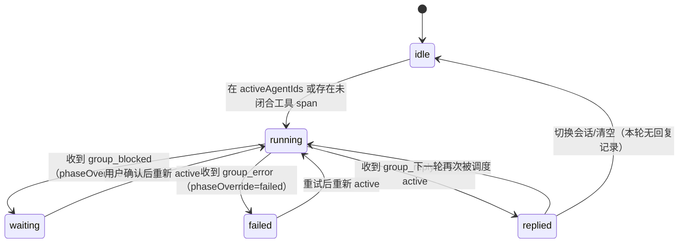

# 群聊「工位墙」：一眼看清谁在干活、在干什么活、卡在哪

Planned-with: opus-5

## 背景与证据链

用户反馈（原话）：「这个图，我看不出谁正在干活，谁卡住了？要不要换模型之类的，换指令这样」，期望「非常有品位、非常直观地让用户感受到到底谁在干活、谁正在干什么活，有点像腾讯 Marvis，几匹马在工位上干活的感觉」。

排查结论：**运行时信号是完整的，缺的只是呈现层**。三条证据：

1. **后端每轮都在吐足够细的 per-member 信号。** `agenticx/runtime/group_router.py`：
   - `_typing_event(agent_id, avatar_name)`（L355）标记某成员开始发言；
   - `group_progress` 事件（L513 构造、L519 `_runtime_event_to_progress_text`、L581 返回 `{"tool_name", "tool_phase", "tool_call_id"}`）携带工具名与 `calling` / `done` 相位；
   - `group_blocked`（等待确认）、`group_error`、`group_reply` 分别标记阻塞、失败、完成。
2. **前端已经接住并存进了 store。** `desktop/src/components/ChatPane.tsx`：
   - L9659 `group_typing` → `setGroupTyping`；
   - L9664 `group_progress` → `setGroupTyping` + `setGroupActivityHint`（L9673/L9680），并写入图 store 的 `toolStepsByNode`；
   - L9699 `group_blocked`、L9831 `group_error` 分别清理上述状态；
   - L2979–L2984 已有 `groupTyping` / `groupActivityHint` / `groupActiveAgentIds`。
3. **已有推导层能算出「运行中的工具 span」。** `desktop/src/components/graph/span-derive.ts` 的 `deriveToolSpans()` 会为 `phase === "calling"` 的步骤产出 `running: true` 且 `endMs === undefined` 的 span（L31–L42），`ExecutionTimeline.tsx` L86/L105 已在消费。

那么为什么用户「看不出」？三个视图各差一口气：

- **运行图全员显示「就绪」**：`agenticx/runtime/graph/social.py` 的 `ensure_presence_run()`（L49–L85）建的是 presence 常态节点（`meta={"source": "presence", "ephemeral": True}`），只有 Workforce 任务 DAG 路径（`agenticx/runtime/graph/scheduler.py` L77/L88/L94）才会把节点置为 `RUNNING` / `DONE` / `FAILED`。群聊常规轮次走的不是那条路，所以 agent 节点状态**永不迁移**。
- **执行时间线是甘特图**：适合事后复盘，不适合扫一眼就懂「现在谁在干活」。
- **成员列表只有一个二元点**：`desktop/src/components/work-panel/GroupMembersSummaryList.tsx` L38–L42 `activityDotClass()` 只有 idle / running / replied 三态，L213 渲染成 8px 圆点，答不了「他在干什么」「卡了多久」「要不要换模型」。

本 plan 补的正是三者之间空着的那一格：一个**常驻、可扫读、带就近操作**的成员执行视图。

## 设计意图（品味口径）

隐喻是「工位」：每位成员一张横向卡片（工位），卡上能一眼读到三件事——**是谁、正在干什么、干了多久**。安静的工位应该真的安静（低饱和、不动、不抢视觉），干活的工位有呼吸感（shimmer 活动行 + 边缘微光），卡住的工位必须自己喊出来（琥珀色 + 就近操作入口）。

硬性审美约束：

- 禁止显眼粗白边框（沿用仓库既有偏好），层级用背景色与不透明度区分。
- 颜色一律走主题 token（`--status-warning` / `--status-success` / `--status-danger` / `text-text-*` / `bg-surface-*`），不得硬编码十六进制，须在 dark / dim / light 三态下可读。
- 动效复用既有资产：`desktop/src/components/ds/Shimmer.tsx`（`variant="status"`）与 `desktop/src/styles/animations.css` 的 `agx-working-shimmer` / `agx-dot-pulse`；`animations.css` L88 已有 `prefers-reduced-motion` 块，新增动效必须在该块内降级为静态。
- 空闲成员不得出现任何动效或高饱和色。

## In scope / Out of scope

**In scope**

- 新增纯函数模块推导每位成员的执行相位、当前动作文案、已耗时、工具计数。
- 用「工位卡」替换 `GroupMembersSummaryList` 中 52px 头像宫格的浏览态渲染。
- 把 `groupActivityHint` 与新增的阻塞 / 失败相位从 `ChatPane` 透传到 `WorkPanel` → 工位墙。
- 前端把执行相位叠加到运行图 presence 节点，使 `RunGraphPanel` 不再全员「就绪」。
- 卡住 / 失败的工位提供就近操作：追加指令、切换模型、打断。

**Out of scope（明确不做，防 scope creep）**

- 不改 `agenticx/runtime/graph/social.py`、`scheduler.py`、`intervene.py`：presence 节点状态**不做后端持久化**，本轮为前端内存态叠加。跨重启 / 断点续开后工位墙显示历史相位属已知限制，另开 plan。
- 不改 `agenticx/runtime/group_router.py` 的事件协议、路由逻辑、prompt 与 `group_facts.py`（已由 `2026-08-15-group-execution-transparency` 落地）。
- 不动 `ExecutionTimeline.tsx` 与 `span-derive.ts` 的现有导出行为（只读消费，不改签名）。
- 不修 `tests/test_smoke_group_workforce_bridge.py` 中两条既有失败用例（`test_tool_call_progress_includes_args_preview` / `test_tool_result_progress_includes_result_preview`），与本 plan 无关。
- 不改成员增删（`persistMembers` / add-remove 弹窗）逻辑。

---

## FR-1 成员执行相位推导（纯函数）

**落点**：改造 `desktop/src/utils/group-member-activity.ts`（现 62 行，全文见现状）。保留现有导出 `resolveGroupMemberActivity` / `groupMemberActivityTitle` / 类型 `GroupMemberActivityState`（`GroupMembersSummaryList` 与既有测试 `desktop/src/utils/group-member-activity.test.ts` 依赖它们，不得破坏）；**新增**一组更丰富的导出。

新增类型与函数（追加到文件末尾）：

```ts
export type CrewPhase = "idle" | "running" | "waiting" | "replied" | "failed";

export type CrewSlot = {
  agentId: string;
  phase: CrewPhase;
  /** 当前/最近一次动作的人话描述，例如「正在读取 group_router.py」；idle 时为空串 */
  actionText: string;
  /** running 时为「已进行毫秒数」；其余相位为 0 */
  elapsedMs: number;
  replies: number;
  toolCalls: number;
  lastTs: number;
};

export type CrewSlotInput = {
  avatarIds: string[];
  messages: ActivityMessage[];
  /** ChatPane groupTyping / groupActivityHint 的并集 key */
  activeAgentIds?: string[];
  /** ChatPane groupActivityHint：agentId → 一行进度文案 */
  activityHintById?: Record<string, string>;
  /** 图 store toolStepsByNode 派生：agentId → 未闭合工具 span */
  runningToolByAgent?: Record<string, { toolName: string; startMs: number }>;
  /** group_blocked / group_error 产生的显式相位覆盖 */
  phaseOverrideById?: Record<string, "waiting" | "failed">;
  /** 便于测试注入 */
  nowMs?: number;
};

export function resolveCrewSlots(input: CrewSlotInput): CrewSlot[];
export function crewPhaseLabel(slot: CrewSlot): string;
```

相位判定优先级（**必须严格按此顺序**，先命中者胜）：



判定实现要点：

1. `phaseOverrideById[agentId]` 存在 → 直接取该值（`waiting` / `failed`），**优先于 running**（阻塞时后端已清 typing，但用户仍需看到「卡住」而非「已回复」）。
2. 否则 `activeAgentIds` 命中 **或** `runningToolByAgent[agentId]` 存在 → `running`。
3. 否则 `replies > 0` → `replied`。
4. 否则 → `idle`。

`actionText` 取值优先级：`runningToolByAgent[agentId]` 有值时用 `正在调用 ${formatToolDisplayName(toolName)}`（复用 `desktop/src/components/messages/tool-display-name.ts` 的既有导出）→ 否则用 `activityHintById[agentId]` → 否则 `waiting` 相位固定 `等待确认后继续` / `failed` 固定 `执行失败` → 否则空串。

`elapsedMs` 仅当 `phase === "running"` 且 `runningToolByAgent[agentId]` 存在时为 `nowMs - startMs`（`nowMs` 缺省取 `Date.now()`）；负值收敛为 0。

`replies` / `toolCalls` / `lastTs` 的统计逻辑与现有 `resolveGroupMemberActivity`（L28–L39）一致：`role === "assistant"` 计回复，`role === "tool"` 计工具调用，取最大 `timestamp` 为 `lastTs`。**实现时抽出共享的私有统计函数，两个导出复用，避免逻辑漂移。**

`crewPhaseLabel` 文案：`running` → `执行中`；`waiting` → `等待确认`；`failed` → `执行失败`；`replied` → `已回复 N 次`；`idle` → `未执行`。

**AC-1**（新增 `desktop/src/utils/group-member-activity.test.ts` 用例，与现有三条并存）：

- `resolveCrewSlots` 输入空 `messages` + 空 `activeAgentIds` → 每位成员 `phase === "idle"`、`actionText === ""`、`elapsedMs === 0`。
- 给定 `runningToolByAgent = { a1: { toolName: "file_read", startMs: 1_000 } }` 且 `nowMs = 4_000` → `a1.phase === "running"`、`elapsedMs === 3000`、`actionText` 包含 `file_read` 的展示名。
- 给定 `phaseOverrideById = { a1: "waiting" }` 且 `a1` 同时在 `activeAgentIds` 中 → `phase === "waiting"`（验证覆盖优先级高于 running）。
- 给定 `messages` 含 `a1` 两条 `assistant` → 无 active 时 `phase === "replied"`、`crewPhaseLabel` 为 `已回复 2 次`。
- `phaseOverrideById = { a1: "failed" }` → `phase === "failed"`、`actionText === "执行失败"`。
- 既有三条用例（idle / replied / running）必须继续通过。

---

## FR-2 ChatPane 透传阻塞与失败相位

**落点**：`desktop/src/components/ChatPane.tsx`。

1. 在 L2979–L2984 附近（`groupTyping` / `groupActivityHint` / `groupActiveAgentIds` 声明处）**新增**一个 state：

```ts
/** 显式相位覆盖：group_blocked → "waiting"，group_error → "failed"。 */
const [groupMemberPhase, setGroupMemberPhase] = useState<Record<string, "waiting" | "failed">>({});
```

2. 在 `group_blocked` 分支（L9699 起，现有代码已 `delete` typing 与 hint）末尾追加 `setGroupMemberPhase((prev) => ({ ...prev, [eventAgentId]: "waiting" }))`。
3. 在 `group_error` 分支（L9831 起）末尾追加 `setGroupMemberPhase((prev) => ({ ...prev, [eventAgentId]: "failed" }))`。
4. 在 `group_typing`（L9659）与 `group_progress`（L9664）分支中，成员重新活跃时**清除**该成员的覆盖：`setGroupMemberPhase((prev) => { if (!(eventAgentId in prev)) return prev; const next = { ...prev }; delete next[eventAgentId]; return next; })`。提前返回 `prev` 是为避免无变化时触发重渲染。
5. 在 L11220 附近的重置处（现有 `setGroupTyping({}); setGroupActivityHint({});`）追加 `setGroupMemberPhase({})`。
6. 把 `groupActivityHint` 与 `groupMemberPhase` 作为新 props 传给 `WorkPanel`（现有 `groupActiveAgentIds` 的传递点旁边）。

**约束**：不得修改上述分支中任何既有语句，只允许在分支内**追加**新语句。`ChatPane.tsx` 是超大文件，编辑时必须精确增行、禁止整段替换（同 `no-scope-creep` 与 `server.py` 的教训）。

**AC-2**：`npm run typecheck`（或 `tsc --noEmit`）通过；手工验收：群聊中触发一次需确认的工具，工位墙对应成员显示「等待确认」琥珀态，确认后恢复「执行中」。

---

## FR-3 工位墙 UI

**落点**：新建 `desktop/src/components/work-panel/CrewWorkstationWall.tsx`；在 `desktop/src/components/work-panel/GroupMembersSummaryList.tsx` 的浏览态中替换现有头像宫格。

### 数据接线

`desktop/src/components/work-panel/WorkPanel.tsx`：

- `Props` 中新增 `groupActivityHint?: Record<string, string>` 与 `groupMemberPhase?: Record<string, "waiting" | "failed">`（参照现有 `groupActiveAgentIds` 的声明与默认值写法，L~384 类型区与组件参数解构处）。
- 在 L1951 的 `<GroupMembersSummaryList ... />` 调用处透传这两个 prop（`messages` / `groupActiveAgentIds` 已在传）。

`GroupMembersSummaryList.tsx`：

- 新增同名 props；用 `useGraphRunStore`（`desktop/src/components/graph/useGraphRun.ts`）读取 `byPane[paneId]?.toolStepsByNode`，配合 `deriveToolSpans` + `agentIdFromNode`（`span-derive.ts` 既有导出）派生 `runningToolByAgent`：遍历每个 node 的 span，取 `running === true` 且 `startMs` 最大的一条。**需要新增 `paneId` prop**（`WorkPanel` 内已有 `paneId`，直接传）。
- 用 `resolveCrewSlots` 替换 L84–L94 的 `activityById` / `executedCount` 计算；`executedCount` 改为统计 `phase !== "idle"` 的 slot 数（语义不变）。
- L162–L258 的 `flex flex-wrap` 头像宫格：**仅在 `mode === "browse"` 时**替换为 `<CrewWorkstationWall />`；`mode === "add"` / `mode === "remove"` 保持现有宫格渲染与增删交互不变（移出成员靠点头像，改成卡片会破坏该交互）。

### CrewWorkstationWall 组件规格

Props：`slots: CrewSlot[]`、`avatarById: Map<string, Avatar>`、`metaLeaderLabel: string`、`onAppendDirective?: (agentId: string) => void`、`onSwitchModel?: (agentId: string) => void`、`onInterrupt?: (agentId: string) => void`。

布局（每位成员一行「工位卡」，纵向堆叠，`space-y-1.5`）：

- 卡容器：`rounded-lg px-2 py-1.5`，背景按相位分层——`idle` 用 `bg-transparent`、其余用 `bg-surface-card`；`running` 额外加一层 `ring-1 ring-[var(--status-warning)]/30`（不使用粗边框）。
- 左侧：32px 圆角头像（`rounded-xl`，沿用 `memberInitials` / `memberColorClass` 既有实现，从 `GroupMembersSummaryList` 抽为共享导出或复制到新文件——**优先抽为共享，避免两份调色逻辑漂移**），右下角相位圆点：`running` 用 `--status-warning` + `agx-dot-pulse`、`waiting` 用 `--status-warning`（不脉冲）、`failed` 用 `--status-danger`、`replied` 用 `--status-success`、`idle` 用描边空心点。
- 中间主区（`min-w-0 flex-1`）：第一行成员名（`text-[12px] text-text-primary truncate`）；第二行动作行（`text-[10px]`）：
  - `running` → `<Shimmer variant="status" text={actionText} />`，动作行右侧接一个 `text-text-faint` 的耗时（`formatElapsed(elapsedMs)`，`<60s` 显示 `12s`，否则 `2m 05s`，与 `ExecutionTimeline.tsx` L40–L47 的 `formatDuration` 口径一致——**复用而非重写，把 `formatDuration` 从 `ExecutionTimeline.tsx` 抽到 `span-derive.ts` 或新建 `format-duration.ts` 并双方引用**）；
  - `waiting` → 琥珀色文案 + 就近操作按钮；
  - `failed` → `--status-danger` 文案 + 「重试」入口（走 `onInterrupt` 之外的既有重试路径，若无则本轮省略该按钮）；
  - `replied` / `idle` → `text-text-faint` 的静态文案（`crewPhaseLabel`），**无任何动效**。
- 右侧：`toolCalls > 0` 时显示极轻量计数（`text-[10px] text-text-faint`，如 `3 次调用`），为 0 时不渲染该元素（避免空态噪声）。
- Meta 协调者（`metaLeaderLabel`）作为第一张卡，沿用现有 L163–L176 的呈现语义（无增删按钮）。

就近操作（**仅在 `waiting` / `failed` 相位显示**，避免常态按钮噪声）：一组 `text-[10px]` 文字按钮「追加指令 / 换模型 / 打断」，分别调用对应回调；回调未传时不渲染该按钮。用户原始诉求正是「要不要换模型之类的，换指令这样」，此处是该诉求的落点。

动效与降级：新增的呼吸 ring 若使用自定义 keyframes，必须写入 `desktop/src/styles/animations.css` 并在该文件 L88 的 `@media (prefers-reduced-motion: reduce)` 块内降级为静态。

**AC-3**：

- 新增 `desktop/src/components/work-panel/CrewWorkstationWall.test.tsx`（若仓库该目录暂无组件测试基建，则改为在 `group-member-activity.test.ts` 中补齐纯函数断言，并在 plan 执行记录里说明）：
  - 传入一个 `running` slot → 渲染出 `actionText` 且存在 shimmer 类名 `agx-working-shimmer`；
  - 传入 `idle` slot → 不含 `agx-working-shimmer`、不含耗时文本；
  - 传入 `waiting` slot 且提供三个回调 → 渲染出「追加指令」「换模型」「打断」三个按钮；不提供回调时不渲染。
- 手工验收：群聊发起一轮多成员任务，工作台「成员」区可在不展开任何 tab 的情况下读出「谁在跑、跑的是哪个工具、跑了多久」；`mode === "remove"` 下点头像仍能移出成员。
- `npm run typecheck` 与既有 `group-member-activity.test.ts` 全绿。

---

## FR-4 运行图不再全员「就绪」

**落点**：`desktop/src/components/graph/RunGraphPanel.tsx`（读取 presence 节点渲染处）。

前端叠加：渲染 agent 节点时，若该 agent 在 `resolveCrewSlots` 结果中相位为 `running` / `waiting` / `failed`，则用该相位覆盖 `GraphNodeSnapshot.status`（映射：`running → "running"`、`waiting → "blocked"`、`failed → "failed"`、`replied → "done"`、`idle` 保持后端原值）。`GraphNodeStatus`（`graph-types.ts` L3–L12）已含全部目标值，`layoutGraphNodes`（L283–L306）已有对应列位，无需扩展类型。

**约束**：覆盖只发生在渲染层，**不得**写回 `useGraphRunStore` 的 `nodes`（否则会与后端 `graph.node_updated` 事件互相踩，且污染快照）。

**AC-4**：群聊执行中打开「运行图」tab，正在调用工具的成员节点落在 `running` 列而非 `ready` 列；执行结束后回到 `done`。纯前端叠加，不引入后端改动，故无 Python 测试。

---

## 验收总则

1. `cd desktop && npm run typecheck` 通过。
2. `cd desktop && npx vitest run src/utils/group-member-activity.test.ts` 全绿（含既有三条 + FR-1 新增）。
3. 若新增组件测试，`npx vitest run src/components/work-panel/CrewWorkstationWall.test.tsx` 全绿。
4. **不需要**跑 `agx serve` 冷启动（本 plan 零 Python 改动）；若实施中发现必须改 Python，先停下与用户确认，并按 `AGENTS.md` 对 `server.py` 的强制门槛补冷启动验证。
5. 三态主题（dark / dim / light）下逐一目视确认工位卡对比度与相位色可读。

## 推荐实施模型

| 子规划 | 推荐模型 | 理由 |
| --- | --- | --- |
| FR-1 相位推导纯函数 + 单测 | 代码专精中档（如 Codex 系列） | 纯逻辑与测试，规则已写死，不需审美，中档足够且省 |
| FR-2 ChatPane 事件接线 | 代码专精中档（如 Codex 系列） | 超大文件精确增行，需谨慎但无设计判断 |
| FR-3 工位墙 UI | 顶配（如 Opus 系列） | 唯一需要视觉审美与品味的部分，用户明确要求「非常有品位」，不宜降档 |
| FR-4 运行图相位叠加 | Composer / Fast 档 | 一处映射函数 + 渲染覆盖，样板级改动 |

`Impl-Model` trailer 以实际使用为准，由用户确认。

## 已知限制（不在本轮解决）

- 相位为前端内存态：刷新窗格或跨重启后，工位墙只能从 `messages` 还原 `replied` / `idle`，无法还原历史 `running` / `waiting`。要做到「断点续开后工位墙可回放」，需让 presence 节点或一份轻量快照落盘，属后端改动，另开 plan。
- `meta_direct` 路径下 Meta 协调者不走工具，其工位卡通常只在 `running`（纯文本生成）与 `replied` 间迁移，看不到工具级动作。该差异由 `group_meta_direct_tools_enabled()` flag 控制，属既有设计，不在本 plan 内改。
