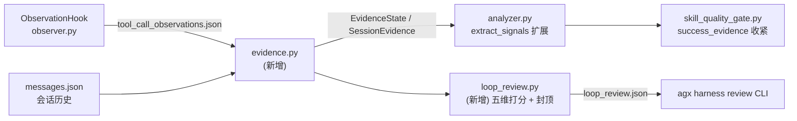

# Session Loop Review：把 Better Harness 的「证据分级 + 回环体检」内化进 AGX

Planned-with: claude-opus-5-thinking
Plan-Id: 2026-08-15-session-loop-review

## 背景与动机（不依赖对话上下文，实施者请先读完本节）

`research/codedeepresearch/better-harness/` 已完成对上游 `QoderAI/better-harness`
（SHA `d091bef5f8d754e4f184f19fa7733949165fb4f4`，MIT）的深度调研，结论是
**不引入上游任何代码**（Node/JS CLI，读取外部 host 的 session 日志，与 AGX Python
运行时不同构）。但调研过程暴露了 AGX 自身一个真实缺口，这才是本 plan 的动机：

**AGX 现有的「会话学习信号」过于单薄，无法区分「跑了很多工具」和「任务真的被验证通过了」。**

证据（本仓库实测，非推断）：

1. `agenticx/learning/analyzer.py:27-51` 的 `SessionSignals` 只有 7 个字段：
   `tool_call_count / unique_tools / error_count / success_count /
   error_recovery_count / retry_pattern_count / total_elapsed_ms`。
   全部是「过程量」，没有任何「结果量」。
2. `agenticx/learning/analyzer.py:101-137` 的 `extract_signals()` 只做
   连续同名工具 = retry、失败后同名工具成功 = error_recovery 两种模式识别。
3. `agenticx/learning/skill_quality_gate.py:67-70` 的 `_check_success_evidence`
   判定标准是「至少有一次工具调用 success=True」——而 `success` 由
   `agenticx/learning/observer.py:111` 的 `infer_success(tool_name, result)`
   从返回文本推断。即：**一个只读了几个文件、从未跑过测试、用户中途放弃的会话，
   也能拿到 success_evidence 满分并触发技能自动创建。**
4. `agenticx/evaluation/` 是 ADK 风格的 **预置 EvalSet 离线评测**（合成用例），
   不消费真实 session 目录，与「回顾真实会话质量」不是同一件事。
5. `grep -r "work.?loop|evidence.?bundle|findings\.json" agenticx/` 无命中，
   确认 AGX 内部不存在等价机制。

Better Harness 唯一值得内化的是它的**判据（rubric）**，不是它的代码：

- **证据分级**：`Present`（东西存在）< `Wired`（接上了）< `Exercised`（真跑过）
  < `Outcome-supported`（有结果佐证）；另有 `Missing` / `Unobserved` / `N/A`。
- **证据等级为分数设上限**：只有 `Present` 级证据的维度，分数不允许超过某个上限。
  这条是核心——它防止「看起来做了很多事」被误判成「做好了」。
- **分数与 finding 分离**：低分不自动生成问题；finding 必须有影响范围、
  最小修复动作、验证路径。

本 plan 只做一件事：**把「证据分级 + 分级封顶」这条判据落到 AGX 的会话回顾链路上，
并输出一份只读的会话回环体检报告。** 不抄上游代码，不引入 Node 依赖，
不改动运行时主链路。

## 架构位置



## In scope

- 新增 `agenticx/learning/evidence.py`：证据状态枚举 + 从 observations/messages 推导证据。
- 扩展 `agenticx/learning/analyzer.py` 的 `SessionSignals`（**只加字段，不删不改已有字段**）。
- 收紧 `agenticx/learning/skill_quality_gate.py` 的 `_check_success_evidence`（可配置、默认保持向后兼容）。
- 新增 `agenticx/learning/loop_review.py`：确定性五维打分 + 证据封顶 + 生成 `loop_review.json`。
- 新增 CLI 子命令 `agx harness review`。
- 会话结束时自动生成 `loop_review.json`（复用现有 `SessionReviewHook.on_agent_end` 时机）。
- Studio 新增一个只读 REST 接口 + Desktop 侧栏分数徽标与五维体检卡。
- 新增冒烟测试 4 个文件。

## Out of scope（严禁顺手做）

- 不引入上游 better-harness 任何源码、模板、术语文件。
- 不改 `agenticx/runtime/agent_runtime.py`。
- `agenticx/studio/server.py` **只允许新增一个路由函数**，禁止改动该文件任何既有代码或 import 区
  （该文件的 import 区有历史事故记录，见 `AGENTS.md`）。
- 不接 LLM 打分（本期全部确定性规则；LLM judge 留待后续）。
- 不改动 `agenticx/evaluation/` 任何文件。
- 不修改 `ObservationHook` 的落盘格式（只新增读侧解析，保证旧 session 可读）。
- 不做跨会话趋势视图 / 聚合图表（数据量不足，留后续 plan）。
- 不因体检结果拦截技能自动创建（本期只压分，不拦截）。

## 推荐实施模型（Suggested-Impl-Model）

| 子任务 | 推荐模型 | 理由 |
|---|---|---|
| FR-1 evidence.py + FR-2 signals 扩展 | Composer 2.5 / 代码专精便宜档 | 纯新增模块 + 加字段，判据已写死在本 plan |
| FR-3 quality gate 收紧 | Codex 中档 | 涉及既有行为变更与向后兼容开关，需谨慎 |
| FR-4 loop_review.py | Codex 中档 | 逻辑密度最高，但无跨栈风险 |
| FR-5 CLI 接线 + FR-6 文档 | Composer 2.5 | 样板 |
| FR-7 会话结束自动生成 | Codex 中档 | 触碰 hook 生命周期，需保证异常不影响主链路 |
| FR-8 REST + IPC + Desktop 卡片 | Codex 中档；卡片视觉可交 Opus 档微调 | 跨栈（Python/Electron/React），但形态已在 plan 中定死 |

---

## FR-1：证据状态模型 `agenticx/learning/evidence.py`（新增文件）

### 数据结构

```python
class EvidenceState(str, Enum):
    MISSING = "missing"                      # rank 0
    UNOBSERVED = "unobserved"                # rank 0，与 missing 区分语义：不是没做，是看不到
    PRESENT = "present"                      # rank 1
    WIRED = "wired"                          # rank 2
    EXERCISED = "exercised"                  # rank 3
    OUTCOME_SUPPORTED = "outcome_supported"  # rank 4
    NOT_APPLICABLE = "not_applicable"        # rank -1，不参与打分

EVIDENCE_RANK: dict[EvidenceState, int] = {...}  # 按上面注释取值

# 证据等级 → 分数上限（0-100）。这是本 plan 的核心判据。
EVIDENCE_SCORE_CAP: dict[EvidenceState, int] = {
    EvidenceState.MISSING: 20,
    EvidenceState.UNOBSERVED: 40,
    EvidenceState.PRESENT: 55,
    EvidenceState.WIRED: 70,
    EvidenceState.EXERCISED: 85,
    EvidenceState.OUTCOME_SUPPORTED: 100,
    EvidenceState.NOT_APPLICABLE: 100,
}
```

```python
@dataclass
class SessionEvidence:
    verification_calls: int = 0      # 跑过验证类工具的次数
    verification_success: int = 0    # 其中成功的次数
    write_calls: int = 0             # 产生了写副作用的工具次数
    user_turns: int = 0
    user_correction_turns: int = 0   # 用户纠偏轮次
    confirm_events: int = 0          # 需要用户确认的高风险动作次数
    observations_available: bool = True   # 有无 tool_call_observations.json
    messages_available: bool = True       # 有无 messages.json
```

### 工具分类常量（写死在本文件，不要放 config）

```python
VERIFICATION_TOOLS = frozenset({"bash_exec", "run_tests", "liteparse"})
# bash_exec 需二次判定：仅当命令文本命中 VERIFICATION_CMD_RE 才算验证
VERIFICATION_CMD_RE = re.compile(
    r"\b(pytest|npm\s+(run\s+)?(test|typecheck|build)|pnpm\s+(test|typecheck|build)"
    r"|tsc\b|go\s+test|cargo\s+test|ruff|mypy|eslint)\b"
)
WRITE_TOOLS = frozenset({"file_write", "file_edit", "str_replace", "apply_patch", "skill_manage"})
```

> 注意：`observer.py` 落盘的 observation **不含 arguments**（见
> `agenticx/learning/observer.py:112-120`，只有 `tool_name / result_summary /
> success / error_signal / turn_index / elapsed_ms`）。因此 `bash_exec` 的命令文本
> 只能从 `result_summary` 里匹配。**本期接受这一限制**：`VERIFICATION_CMD_RE`
> 同时在 `tool_name` 与 `result_summary` 上匹配，匹配不到就降级为
> `EvidenceState.UNOBSERVED` 而不是 `MISSING`——这正是 `UNOBSERVED` 存在的意义。
> 严禁为此去改 `observer.py` 的落盘结构（那是另一个 plan 的事）。

### 函数签名

```python
def collect_session_evidence(
    observations: list[dict[str, Any]],
    messages: list[dict[str, Any]] | None = None,
) -> SessionEvidence: ...

def classify_validation_evidence(ev: SessionEvidence) -> EvidenceState: ...
def classify_delivery_evidence(ev: SessionEvidence) -> EvidenceState: ...
def cap_score(raw_score: int, state: EvidenceState) -> int:
    """return min(raw_score, EVIDENCE_SCORE_CAP[state])"""
```

`classify_validation_evidence` 判定阶梯（自上而下命中即返回）：

1. `verification_success > 0` → `OUTCOME_SUPPORTED`
2. `verification_calls > 0` → `EXERCISED`
3. `write_calls > 0 and not ev.observations_available` → `UNOBSERVED`
4. `write_calls > 0` → `PRESENT`（改了东西但没验证）
5. `write_calls == 0 and observations` 非空 → `NOT_APPLICABLE`（纯只读会话无需验证）
6. 其余 → `MISSING`

`classify_delivery_evidence` 判定阶梯：

1. `user_turns >= 2 and user_correction_turns == 0 and verification_success > 0` → `OUTCOME_SUPPORTED`
2. `user_turns >= 2 and user_correction_turns == 0` → `EXERCISED`
3. `user_turns >= 2` → `WIRED`
4. `not ev.messages_available` → `UNOBSERVED`
5. 其余 → `PRESENT`

「用户纠偏轮次」判定：`messages` 中 `role == "user"` 且内容命中
`CORRECTION_RE = re.compile(r"(不对|错了|不是这样|重来|回退|revert|undo|that'?s wrong|not what)", re.I)`。

### AC-1

新建 `tests/test_smoke_loop_review_evidence.py`，断言：

- `collect_session_evidence([])` 返回全零且 `observations_available is False`。
- 输入 `[{"tool_name": "bash_exec", "result_summary": "5 passed in 1.2s", "success": True}]`
  且 `result_summary` 含 `pytest` 关键词的样本 → `classify_validation_evidence` 得 `OUTCOME_SUPPORTED`。
- 输入仅 `[{"tool_name": "file_write", "success": True}]` → `PRESENT`。
- 输入仅 `[{"tool_name": "file_read", "success": True}]` → `NOT_APPLICABLE`。
- `cap_score(95, EvidenceState.PRESENT) == 55`；`cap_score(30, EvidenceState.OUTCOME_SUPPORTED) == 30`。

---

## FR-2：扩展 `SessionSignals`（`agenticx/learning/analyzer.py`）

在 `SessionSignals`（当前 L26-51）**追加**字段，默认值必须让旧调用方零感知：

```python
    verification_calls: int = 0
    verification_success: int = 0
    write_calls: int = 0
    validation_evidence: str = EvidenceState.UNOBSERVED.value
```

在 `extract_signals()`（当前 L101-137）循环结束、`signals.unique_tools = len(tools_seen)`
之后（L136 附近）追加：

```python
    ev = collect_session_evidence(observations)
    signals.verification_calls = ev.verification_calls
    signals.verification_success = ev.verification_success
    signals.write_calls = ev.write_calls
    signals.validation_evidence = classify_validation_evidence(ev).value
```

import 放文件顶部（遵守 no-inline-imports 规则）：
`from agenticx.learning.evidence import EvidenceState, classify_validation_evidence, collect_session_evidence`。

**严禁**修改 L114-134 现有循环里任何一行——那是 `test_smoke_hermes_agent_analyzer.py` 的现有断言范围。

### AC-2

- `pytest tests/test_smoke_hermes_agent_analyzer.py` 全绿（无回归）。
- 在 `tests/test_smoke_loop_review_evidence.py` 追加断言：
  `extract_signals([...file_write...]).validation_evidence == "present"`。

---

## FR-3：收紧技能门禁的 success_evidence（`agenticx/learning/skill_quality_gate.py`）

现状（L67-70）：只要有一次 `success=True` 就满分 1.0。

改为分级给分，保持函数签名与返回类型不变：

```python
def _check_success_evidence(observations: list[dict[str, Any]]) -> QualityCheck:
    ev = collect_session_evidence(observations)
    state = classify_validation_evidence(ev)
    rank = EVIDENCE_RANK[state]
    if state is EvidenceState.NOT_APPLICABLE:
        return QualityCheck("success_evidence", True, "read-only session", 0.6)
    if rank >= EVIDENCE_RANK[EvidenceState.EXERCISED]:
        return QualityCheck("success_evidence", True, f"evidence={state.value}", 1.0)
    if rank >= EVIDENCE_RANK[EvidenceState.PRESENT]:
        # 改了东西但没验证：放行但压分，让聚合分逼近 GATE_MIN_SCORE
        return QualityCheck("success_evidence", True, f"evidence={state.value}, unverified", 0.5)
    return QualityCheck("success_evidence", False, f"evidence={state.value}", 0.0)
```

**兼容开关**：新增 `learning.evidence_gate_strict`（默认 `False`）到
`agenticx/learning/config.py` 的 `DEFAULTS`（当前 L34-49）。
`strict=False` 时，上面「rank >= PRESENT」分支返回 1.0（等价旧行为）；
`strict=True` 时才返回 0.5。默认关闭，避免静默改变现网技能创建率。

### AC-3

- `pytest tests/test_smoke_hermes_agent_quality_gate.py` 全绿。
- 新建 `tests/test_smoke_loop_review_gate.py`：
  - `evidence_gate_strict=False`（默认）时，纯 `file_write` 会话 `success_evidence.score == 1.0`。
  - monkeypatch 配置为 `True` 后，同一输入 `score == 0.5` 且 `passed is True`。
  - 空 observations 时 `passed is False`。

---

## FR-4：会话回环体检 `agenticx/learning/loop_review.py`（新增文件）

### 五个维度（AGX 术语，不照抄上游命名）

| key | 中文 | 原始分依据（确定性） | 封顶依据 |
|---|---|---|---|
| `task_framing` | 任务理解 | 有用户首轮 query 且 `user_correction_turns == 0` 加分 | delivery evidence |
| `controlled_execution` | 受控执行 | `error_count / tool_call_count` 越低越高；`confirm_events > 0` 加分 | 有 observations 则 EXERCISED，否则 UNOBSERVED |
| `change_validation` | 变更验证 | `verification_success / max(1, write_calls)` | validation evidence |
| `reliable_delivery` | 可靠交付 | `success_rate` + 无 `error_signal` 尾部 | delivery evidence |
| `learning_capture` | 学习沉淀 | 会话内是否调用过 `skill_manage` | 有 skill_manage 则 EXERCISED，否则 PRESENT |

原始分一律 0-100 整数，算完后统一过 `cap_score(raw, state)`。

### 报告数据结构

```python
@dataclass
class DimensionReview:
    key: str
    label: str
    raw_score: int
    score: int              # cap 之后
    evidence: str           # EvidenceState.value
    rationale: str          # 一句话，说明分数从哪来

@dataclass
class LoopReview:
    session_id: str
    generated_at: str       # ISO8601 UTC
    schema_version: int = 1
    dimensions: list[DimensionReview] = field(default_factory=list)
    findings: list[dict[str, Any]] = field(default_factory=list)
    overall: int = 0        # 五维算术平均，向下取整
```

### finding 生成规则（与分数解耦，这是上游最值得抄的判据）

**只有满足全部三条**才生成一条 finding，否则宁可不报：

1. 该维度 `evidence` 属于 `{MISSING, PRESENT}`（即证据不足，不是"分低"）；
2. 能写出**具体修复动作**（从下表固定文案取，不允许模型自由发挥）；
3. 能写出**验证路径**（同样取自固定文案）。

固定文案表（写死在模块常量 `FINDING_TEMPLATES: dict[str, dict[str, str]]`）：

| 维度 | impact | repair | verification |
|---|---|---|---|
| `change_validation` | 本次会话产生了写操作但未观察到验证动作 | 在收尾轮追加一次测试/类型检查工具调用 | 重跑会话后 `change_validation.evidence` 应达到 `exercised` |
| `reliable_delivery` | 会话缺少用户确认或存在纠偏轮次 | 收尾时向用户复述交付物与验收口径 | `user_correction_turns` 归零 |
| `learning_capture` | 复杂会话未沉淀任何技能 | 会话结束后触发一次 `skill_manage` 复盘 | `learning_capture.evidence` 达到 `exercised` |

### 入口函数

```python
def review_session(session_dir: Path) -> LoopReview: ...
def write_review(review: LoopReview, session_dir: Path) -> Path:
    """写 <session_dir>/loop_review.json，返回路径。"""
def format_review_text(review: LoopReview) -> str:
    """给 CLI 用的人类可读文本，不用 rich table，纯字符串。"""
```

`review_session` 读取：
- `session_dir / "tool_call_observations.json"`（复用 `analyzer.load_session_observations`）
- `session_dir / "messages.json"`（自己写一个容错读取，文件缺失返回 `[]` 并置
  `messages_available=False`，**不要抛异常**）

**只读约束**：除 `write_review` 显式落盘 `loop_review.json` 外，本模块不得写任何文件、
不得调用 LLM、不得发起网络请求。

### AC-4

新建 `tests/test_smoke_loop_review_report.py`，用 `tmp_path` 造假 session 目录：

- 空目录 → `review_session` 不抛异常，`overall <= 40`，
  各维度 `evidence` 为 `unobserved` 或 `missing`。
- 造一个「写了文件 + 跑了 pytest 成功 + 用户 2 轮无纠偏 + 调过 skill_manage」的目录
  → `change_validation.score >= 85`，`overall >= 70`，`findings == []`。
- 造一个「只写文件、没验证」的目录 → `change_validation.score <= 55` 且
  `findings` 中存在 `key == "change_validation"` 的条目，且该条目含
  `impact`/`repair`/`verification` 三个非空字段。
- `write_review` 后 `loop_review.json` 存在且可 `json.loads`，`schema_version == 1`。

---

## FR-5：CLI 子命令 `agx harness review`

在 `agenticx/cli/main.py` 中，参照现有 `@app.command()` 写法（如 L539 `version`、
L559 `serve`），新增一个 typer 子 app：

- 在 `_get_*_app()` 惰性工厂区（L89-129 区域）新增 `_get_harness_app()`，
  返回 `agenticx/cli/harness_app.py` 中的 `app`，并按现有 `_get_skills_app` /
  `_get_hooks_app` 的注册方式挂到主 app，命令名 `harness`。
  **严格照抄相邻工厂函数的惰性 import 写法**，不要改动它们。
- 新建 `agenticx/cli/harness_app.py`：

```
agx harness review [--session <session_id>] [--json] [--write]
```

  - 不传 `--session` 时取 `~/.agenticx/sessions/` 下 mtime 最新的目录。
  - `--json` 输出 `dataclasses.asdict(review)` 的 JSON；否则输出 `format_review_text`。
  - `--write` 才落盘 `loop_review.json`；默认只打印（保持只读默认）。
  - session 目录不存在时打印明确错误并 `raise typer.Exit(code=1)`，不得抛裸异常。

### AC-5

- `agx harness review --help` 正常输出。
- 对一个真实存在的 session 目录执行 `agx harness review --json` 返回合法 JSON 且退出码 0。
- 对不存在的 id 执行返回退出码 1 且 stderr/stdout 含 `session not found`。
- `agx --help` 与 `agx serve --help` 无回归（惰性注册没打断主 app）。

---

## FR-6：研究结论回写（文档，非代码）

`research/codedeepresearch/better-harness/better-harness_proposal.md` 当前结论为
`DO_NOT_ADOPT`，其理由之一是「用户问题未被验证」。该前提已不成立（用户明确提出
要对 AGX 运行时链条做同类评估）。将结论改为
`SELECTIVE_ADOPT (concept-only, zero upstream code)`，并在 Immediate actions
指向本 plan 文件路径。同步在 `better-harness_agenticx_gap_analysis.md` 把
「会话级证据分级 / 回环体检」一行从 NO-GAP 改为 P1，理由引用
`analyzer.py:27-51` 与 `skill_quality_gate.py:67-70`。

**不要**改动这两份文档的其它章节与证据表。

### AC-6

两份文档 diff 仅涉及上述结论行与新增引用，`git diff --stat` 中这两个文件行数变更 < 30。

---

---

## FR-7：会话结束时自动生成 `loop_review.json`

落点：`agenticx/learning/session_review_hook.py` 的 `SessionReviewHook.on_agent_end`
（当前 L161-166）。现状是：

```python
    async def on_agent_end(self, final_text: str, session: Any) -> None:
        if not _review_enabled():
            return
        if not self._should_review(session):
            return
        asyncio.create_task(self._run_review(session))
```

改为在两个 early-return **之前**先落体检报告，因为体检和技能复盘的门槛不同：
体检对所有会话都有意义（哪怕只有 2 次工具调用），技能复盘才需要 `is_complex`。

```python
    async def on_agent_end(self, final_text: str, session: Any) -> None:
        self._spawn_loop_review(session)          # 新增，不受 _review_enabled 控制
        if not _review_enabled():
            return
        if not self._should_review(session):
            return
        asyncio.create_task(self._run_review(session))

    def _spawn_loop_review(self, session: Any) -> None:
        """Fire-and-forget deterministic loop review. Never raises."""
        if not get_learning_config().get("loop_review_enabled", True):
            return
        session_id = str(getattr(session, "session_id", "")
                         or getattr(session, "id", "") or "").strip()
        if not session_id:
            return
        session_dir = Path.home() / ".agenticx" / "sessions" / session_id
        if not session_dir.is_dir():
            return
        asyncio.create_task(self._run_loop_review(session_dir))

    async def _run_loop_review(self, session_dir: Path) -> None:
        try:
            review = await asyncio.to_thread(review_session, session_dir)
            await asyncio.to_thread(write_review, review, session_dir)
        except Exception:
            logger.debug("loop review failed for %s", session_dir, exc_info=True)
```

约束：

- **绝对不能抛异常打断 `on_agent_end`**——`_spawn_loop_review` 内部所有分支都要能静默返回。
- 全程无 LLM、无网络，整段计算是纯 CPU 的 json 解析 + 遍历，用 `asyncio.to_thread`
  避免阻塞事件循环。
- `_review_enabled()`（技能复盘开关）与体检开关**互相独立**：用户关掉技能自动创建时，
  体检报告仍应生成。
- 新增配置项 `learning.loop_review_enabled`（默认 `True`）到
  `agenticx/learning/config.py` 的 `DEFAULTS`（L34-49），与 FR-3 的
  `evidence_gate_strict` 一并加入。
- import 放文件顶部：
  `from agenticx.learning.config import get_learning_config`
  `from agenticx.learning.loop_review import review_session, write_review`
  （注意 `Path` 已在 L20 导入，勿重复）。

### AC-7

在 `tests/test_smoke_loop_review_report.py` 追加：

- 构造一个带 `session_id` 属性的假 session 对象与 `tmp_path` 目录，monkeypatch
  `Path.home()` 指向 `tmp_path`，`await hook.on_agent_end("done", session)` 后
  `loop_review.json` 存在。
- monkeypatch 配置 `loop_review_enabled=False` 后，同样调用**不**生成文件。
- 让 `review_session` monkeypatch 成抛异常的桩，确认 `on_agent_end` 仍正常返回不抛。
- `pytest tests/test_smoke_hermes_agent_session_review.py` 全绿（无回归）。

---

## FR-8：Studio REST + Desktop 体检卡片

### 8a. 后端接口（`agenticx/studio/server.py`）

在 `list_interrupted_sessions`（当前 L7191-7197）之后**追加**一个新路由，
严格照抄相邻路由的写法（`@app.get` + `x_agx_desktop_token: str | None = Header(default=None)`
+ `_check_token(...)`）：

```python
    @app.get("/api/sessions/{session_id}/loop-review")
    async def get_session_loop_review(
        session_id: str,
        refresh: bool = Query(default=False),
        x_agx_desktop_token: str | None = Header(default=None),
    ) -> dict:
        """Read-only workflow health review for one session."""
```

行为：

- `session_dir` 不存在 → 返回 `{"ok": False, "error": "session not found"}`（HTTP 200，
  不抛 404，与相邻只读接口的容错风格一致）。
- `refresh=False` 且 `loop_review.json` 存在 → 直接读文件返回 `{"ok": True, "review": {...}}`。
- `refresh=True` 或文件不存在 → 现算（`review_session`），**不落盘**，返回结果。
- 计算走 `run_in_persist_pool` 或 `asyncio.to_thread`，不得在事件循环里同步读大文件。

**改动纪律**：本文件只允许新增这一个函数体，不得触碰顶部 import 区。
`review_session` 用**函数内局部 import**（这是 `server.py` 的既有惯例，
优先级高于 no-inline-imports 通用规则，理由是该文件 import 区极度敏感）。

### 8b. Electron IPC

- `desktop/electron/main.ts`：在 `ipcMain.handle("list-sessions", ...)`（L6991-7003）
  之后新增 `ipcMain.handle("get-session-loop-review", ...)`，完全照抄前者的
  `waitForStudio()` → `fetch(getStudioUrl() + ...)` → 错误返回 `{ ok: false }` 结构。
- `desktop/electron/preload.ts`：按现有 `listSessions` 的暴露方式加 `getSessionLoopReview`。
- `desktop/src/global.d.ts`：在 `listSessions` 声明（L612）附近追加类型：

```ts
      getSessionLoopReview: (sessionId: string, refresh?: boolean) => Promise<{
        ok: boolean;
        review?: {
          session_id: string;
          generated_at: string;
          schema_version: number;
          overall: number;
          dimensions: Array<{
            key: string; label: string; raw_score: number;
            score: number; evidence: string; rationale: string;
          }>;
          findings: Array<{ key: string; impact: string; repair: string; verification: string }>;
        };
        error?: string;
      }>;
```

改完 `main.ts`/`preload.ts` 后必须**完全退出并重启** `npm run dev`，
仅刷新渲染进程不会加载新 IPC handler。

### 8c. Desktop UI

新增 `desktop/src/components/session/LoopReviewCard.tsx`：

- Props：`{ sessionId: string; onClose: () => void }`。
- 挂载时调 `window.agenticxDesktop.getSessionLoopReview(sessionId)`，加载中显示骨架，
  `ok === false` 时显示「本次会话暂无体检数据」而非报错红字。
- 布局：顶部一行 `Overall NN / 100`；下面五行维度，每行 = 中文标签 + 横向进度条 +
  分数 + `evidence` 芯片；**当 `score < raw_score` 时**在该行右侧显示一个「已按证据封顶」
  的小标记（这是整张卡最重要的信息，不能省）。
- findings 区块在下方，每条渲染 影响 / 修复 / 验证 三行；`findings` 为空时
  渲染一行「未发现需要修复的问题」。

视觉纪律（对齐既有设计约定）：

- 颜色一律用主题 token（`bg-surface-card`、`text-text-strong` 等），
  **禁止硬编码十六进制色值**；分数条的强调色用 `--ui-btn-primary-*` 系列。
- evidence 芯片只用两档语义色：`outcome_supported`/`exercised` 为正向色，
  其余为中性/警示色，不要搞六种颜色。
- 卡片须在 dark / dim / light 三态下都可读。

入口挂载：`desktop/src/components/sidebar/SidebarSessionHistory.tsx`

- 在 `loadSessions`（L193-212）成功后，对可见行**批量并发**拉取体检分数
  （`Promise.allSettled`，失败静默），存到组件内 `Map<string, number>` state。
- 每行标题右侧渲染一个小分数徽标：`>= 80` 正向色，`60-79` 中性色，`< 60` 警示色，
  无数据则不渲染徽标（不要渲染占位符）。
- 点击徽标打开 `LoopReviewCard`（用 `createPortal` 挂到 `document.body`，
  避免被侧栏 `overflow` 裁掉——这是本项目踩过的已知坑）。

**严禁**改动 `SidebarSessionHistory.tsx` 中会话选择、删除、置顶、
飞书/微信绑定标记等任何既有逻辑。

### AC-8

- `curl --noproxy '*' -H "x-agx-desktop-token: $(cat ~/.agenticx/serve.token)" \
  "http://127.0.0.1:$(cat ~/.agenticx/serve.port)/api/sessions/<真实id>/loop-review"`
  返回 `ok: true` 且 `review.dimensions` 长度为 5。
- 同一命令对不存在的 id 返回 `{"ok": false, "error": "session not found"}`，HTTP 200。
- `cd desktop && npx tsc --noEmit` 通过。
- 手动验收：重启 `npm run dev`，侧栏历史会话至少一行出现分数徽标，点击弹出卡片，
  三态主题各切一次均可读；某个「写了文件但没跑测试」的会话，其变更验证行显示
  「已按证据封顶」标记。

---

## 实施顺序与验收门禁

1. FR-1 → AC-1
2. FR-2 → AC-2（必须先确认 `test_smoke_hermes_agent_analyzer.py` 未回归）
3. FR-3 → AC-3
4. FR-4 → AC-4
5. FR-5 → AC-5
6. FR-7 → AC-7（先于 FR-8，保证 UI 有数据可读）
7. FR-8 → AC-8
8. FR-6 → AC-6（文档收尾）

后端全部完成后跑：

```bash
pytest tests/test_smoke_hermes_agent_analyzer.py \
       tests/test_smoke_hermes_agent_quality_gate.py \
       tests/test_smoke_hermes_agent_observer.py \
       tests/test_smoke_hermes_agent_session_review.py \
       tests/test_smoke_loop_review_evidence.py \
       tests/test_smoke_loop_review_gate.py \
       tests/test_smoke_loop_review_report.py -q
```

因本 plan 触碰 `agenticx/cli/main.py` 与 `agenticx/studio/server.py`，
提交前**必须**做一次冷启动 smoke（这是 `server.py` 改动的强制验收门槛）：

```bash
agx serve --host 127.0.0.1 --port 8899 &
curl --noproxy '*' -s -o /dev/null -w '%{http_code}' http://127.0.0.1:8899/api/avatars
```

期望 200；随后 kill 该进程。另需确认 `/api/session`、`/api/avatars`、`/api/sessions`
三个核心接口均返回 200，确保新增路由没有破坏应用初始化。

## Commit 规划

按功能点分四个 commit：

1. `feat(learning): add session evidence model and evidence-capped signals`（FR-1 + FR-2）
2. `feat(learning): add session loop review report and evidence-aware skill gate`（FR-3 + FR-4 + FR-7）
3. `feat(cli): add agx harness review command`（FR-5）
4. `feat(desktop): surface session loop review score and health card`（FR-8 + FR-6）

每个 commit 带 trailer：

```
Plan-Id: 2026-08-15-session-loop-review
Plan-File: .cursor/plans/2026-08-15-session-loop-review.plan.md
Plan-Model: <待用户确认>
Impl-Model: <待用户确认>
Made-with: Damon Li
```

## P2（本期不做，后续另开 plan）

- **跨会话趋势视图**：设置内新增「会话健康度」页，聚合最近 N 份 `loop_review.json`，
  按维度看分布与时间趋势。必须等真实数据积累到一定量再做，否则是空图表。
- **Meta 只读工具 `loop_review_get`**：注册到 `STUDIO_TOOLS`，让用户在对话里
  直接问「刚才那轮我哪里没做到位」。
- 让 `SessionReviewHook` 在生成技能前读取 `LoopReview`，用 `change_validation` 证据等级
  决定是否允许自动创建（本期只做门禁压分，不做拦截）。
- LLM judge 复核确定性打分（需先积累一批真实 `loop_review.json` 做基线）。
