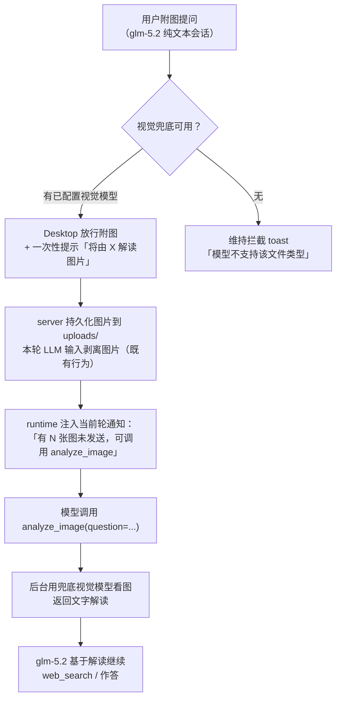

# Plan: 非视觉模型图片兜底 —— `analyze_image` 工具 + 视觉模型回退

Planned-with: kimi-k3
Suggested-Impl-Model: cursor-grok-4.6-high-fast（用户指定：全部子任务均由 grok 4.6 实施）

> **实施者须知**：本 plan 自包含，不依赖任何对话上下文。每个改动点都给出精确文件路径、函数名、锚点行号与 before/after 代码。严格按 FR 顺序实施，禁止顺手改动未列出的代码路径（仓库有 `no-scope-creep` 强制规则）。

## 背景与根因（证据链）

**现象**：会话模型为 glm-5.2（纯文本）时，用户附图提问（如「帮我查下这个组织」），模型只回「当前会话不支持多模态理解，请把名称打出来」，没有任何兜底，体验很蠢。

**根因链**（均已核实，行号为实施前快照，允许小幅漂移，以锚点代码为准）：

1. **视觉能力判定被 provider 门控，自定义网关误判**：`agenticx/llms/vision.py:63-73` 的 `is_vision_capable` 只在 `provider == "zhipu"/"minimax"/"bailian"/"dashscope"` 时识别纯文本 SKU；用户经 `custom_openai_*` 兼容网关使用 glm-5.2 时被误判为「可视觉」，图片被硬塞给文本模型。前端 `desktop/src/utils/model-vision.ts:39-52` 的 `isKnownNonVisionChatModel` 同样 provider 门控。
2. **附图持久化已存在但只服务「手动切模型」**：2026-06-12 的 plan 已让用户图片落盘到 `~/.agenticx/sessions/<sid>/uploads/` 并写入 history attachments，但只有用户手动切换到视觉模型后才会被 promote。
3. **`view_image` 对非视觉模型直接报错**：`agenticx/cli/agent_tools.py:5855-5860`（`_tool_view_image` 的 `_session_vision_capable` 守卫）。
4. **`spawn_subagent` 无法传图**：`agenticx/runtime/meta_tools.py:260-271` 的 `attachments` 仅 `{name, content}` 纯文本；`team_manager.py:544-552` 也只落文本。所以「spawn 一个视觉子智能体」当前走不通，且重（新窗格、异步轮询），不适合「查个 Logo」这种轻任务。
5. **非视觉模型下当前轮图片被静默剥离，模型甚至不知道有图**：`agenticx/studio/server.py:2807-2813` 把 `image_inputs = []`；`agenticx/runtime/agent_runtime.py:1096` 的 `_build_attached_files_hint` 明确排除 `[图片: ...]` 占位（行为被 `tests/test_agent_runtime_attached_hint.py:55-66` 锁定）。

**方案选型**：新增 `analyze_image` 工具 —— 当前模型为纯文本时，用已配置的视觉模型在后台做一次「看图 → 文字解读」调用，把解读文本交回当前模型继续完成任务。不切会话模型、不开子智能体窗格。这是与用户的共识方案（备选 B「真 spawn 视觉子智能体」因 attachments 链路不通且过重被否决）。

## 目标流程



## FR / 改动点

### FR-1 视觉能力判定改为按模型 slug、跨 provider 生效

**为什么必须做**：不做这个，`custom_openai_*` 下的 glm-5.2 会被判定为「可视觉」，`analyze_image` 会拒绝服务（FR-3 的守卫），整条兜底链对用户实际配置失效。

**文件 1**：`agenticx/llms/vision.py`，`is_vision_capable`（当前 63-73 行）。

before:

```python
def is_vision_capable(provider_name: str, model_name: str) -> bool:
    """Return True when the provider/model pair should accept image_url inputs."""
    provider = str(provider_name or "").strip().lower()
    model = str(model_name or "").strip()
    if provider == "minimax" and _minimax_m2_family_no_vision(model):
        return False
    if provider == "zhipu" and _zhipu_text_only_family(model):
        return False
    if provider in {"bailian", "dashscope"} and _bailian_qwen_text_no_vision(model):
        return False
    return True
```

after:

```python
def is_vision_capable(provider_name: str, model_name: str) -> bool:
    """Return True when the provider/model pair should accept image_url inputs.

    Known text-only families are detected by model slug regardless of provider,
    so OpenAI-compatible gateways (custom_openai_*) serving glm-5.x / qwen text
    SKUs are also treated as text-only. Unknown slugs stay vision-permissive.
    ``provider_name`` is kept for API compatibility and logging only.
    """
    model = str(model_name or "").strip()
    if _minimax_m2_family_no_vision(model):
        return False
    if _zhipu_text_only_family(model):
        return False
    if _bailian_qwen_text_no_vision(model):
        return False
    return True
```

注意：三个 `_xxx_family` 辅助函数内部已自行做 slug 提取（`raw.rsplit("/", 1)[-1]`）与 `v/vision/vl/omni` 视觉标记排除，直接传完整 model 即可。保留 `_zhipu_glm5_family_no_vision` 别名行（注释标注 do not remove）。

**文件 2**：`desktop/src/utils/model-vision.ts`，`isKnownNonVisionChatModel`（当前 47-51 行）。

before:

```ts
  if (KNOWN_TEXT_ONLY_RE.test(combined) || KNOWN_TEXT_ONLY_RE.test(modelLower)) return true;
  if (p === "minimax" && minimaxM2TextOnlySlug(slug)) return true;
  if (p === "zhipu" && zhipuTextOnlySlug(slug)) return true;
  if ((p === "bailian" || p === "dashscope") && bailianQwenTextOnlySlug(slug)) return true;
  return false;
```

after:

```ts
  if (KNOWN_TEXT_ONLY_RE.test(combined) || KNOWN_TEXT_ONLY_RE.test(modelLower)) return true;
  // Known text-only families are matched by model slug regardless of provider,
  // so custom OpenAI-compatible gateways serving these SKUs are also blocked.
  if (minimaxM2TextOnlySlug(slug)) return true;
  if (zhipuTextOnlySlug(slug)) return true;
  if (bailianQwenTextOnlySlug(slug)) return true;
  return false;
```

**回归风险说明**：`gpt-4o`、`glm-4.6v`、`qwen2.5-vl`、`llama3.2-vision` 等均不含文本家族特征或带视觉标记，判定不变。仅「已知纯文本 SKU 经自定义网关」这一此前误判路径改变行为（改为正确剥离 + 走兜底）。

### FR-2 新增 `agenticx/llms/vision_fallback.py` —— 兜底视觉模型解析

**新建文件**，完整内容：

```python
#!/usr/bin/env python3
"""Resolve a vision-capable fallback model for text-only chat sessions.

Author: Damon Li
"""

from __future__ import annotations

from typing import Any, Dict, List

from agenticx.cli.config_manager import ConfigManager
from agenticx.llms.provider_display import format_model_option_label
from agenticx.llms.vision import is_vision_capable


def _provider_enabled(provider_cfg: Dict[str, Any]) -> bool:
    raw = provider_cfg.get("enabled", True)
    if isinstance(raw, bool):
        return raw
    if isinstance(raw, str):
        return raw.strip().lower() not in {"false", "0", "no", "off"}
    if isinstance(raw, (int, float)):
        return bool(raw)
    return True


def _provider_models(provider_cfg: Dict[str, Any]) -> List[str]:
    models: List[str] = []
    raw = provider_cfg.get("models")
    if isinstance(raw, list):
        models.extend(str(m).strip() for m in raw if str(m or "").strip())
    single = str(provider_cfg.get("model") or "").strip()
    if single and single not in models:
        models.append(single)
    return models


def _has_credentials(provider_cfg: Dict[str, Any]) -> bool:
    return bool(
        str(provider_cfg.get("api_key") or "").strip()
        or str(provider_cfg.get("base_url") or "").strip()
    )


def resolve_vision_fallback(session: Any = None) -> Dict[str, Any]:
    """Pick a vision-capable model for the analyze_image tool.

    Order: explicit ``vision_fallback: {provider, model}`` in config.yaml,
    then the current session's provider, then remaining providers in config
    order. Returns {"available", "provider", "model", "label"}.
    """
    try:
        raw_override = ConfigManager.get_value("vision_fallback")
    except Exception:
        raw_override = None
    try:
        cfg = ConfigManager.load()
        providers = cfg.providers if isinstance(cfg.providers, dict) else {}
    except Exception:
        providers = {}

    def _blocked(provider_name: str) -> bool:
        if session is None:
            return False
        try:
            from agenticx.llms.provider_fault import is_provider_session_blocked

            return bool(is_provider_session_blocked(session, provider_name))
        except Exception:
            return False

    def _as_result(provider_name: str, model: str) -> Dict[str, Any]:
        pcfg = providers.get(provider_name)
        label = format_model_option_label(
            provider_name, model, pcfg if isinstance(pcfg, dict) else None
        )
        return {
            "available": True,
            "provider": provider_name,
            "model": model,
            "label": label,
        }

    if isinstance(raw_override, dict):
        ov_provider = str(raw_override.get("provider") or "").strip()
        ov_model = str(raw_override.get("model") or "").strip()
        if (
            ov_provider
            and ov_model
            and is_vision_capable(ov_provider, ov_model)
            and not _blocked(ov_provider)
        ):
            return _as_result(ov_provider, ov_model)

    session_provider = str(getattr(session, "provider_name", "") or "").strip()
    ordered: List[str] = []
    if session_provider and session_provider in providers:
        ordered.append(session_provider)
    ordered.extend(name for name in providers if name not in ordered)

    for provider_name in ordered:
        pcfg = providers.get(provider_name)
        if not isinstance(pcfg, dict):
            continue
        if not _provider_enabled(pcfg) or not _has_credentials(pcfg):
            continue
        if _blocked(provider_name):
            continue
        for model in _provider_models(pcfg):
            if is_vision_capable(provider_name, model):
                return _as_result(provider_name, model)
    return {"available": False, "provider": "", "model": "", "label": ""}
```

依据：`ConfigManager.get_value` 支持任意 dotted key 的原始 YAML 合并读取（`agenticx/cli/config_manager.py:422-431`）；provider 配置的 `models` list / `model` 单值结构见 `agenticx/llms/provider_display.py:150-160`；`format_model_option_label(provider, model, cfg)` 签名见同文件 160 行调用处。

### FR-3 新增 `analyze_image` 工具（`agenticx/cli/agent_tools.py`）

**3a. 抽出共享图片加载 helper**。`_tool_view_image`（当前 5850-5944 行）中「解析 target → (data, mime, name, source)」一段原样抽为 `_load_image_target`，错误改为抛 `ValueError`（消息不带 `ERROR: ` 前缀），两个调用方各自包成 `ERROR: ...` 字符串，保证 view_image 既有错误文案逐字不变。

新增 helper（放在 `_tool_view_image` 之前）：

```python
async def _load_image_target(
    target: str,
    session: Optional[StudioSession],
) -> Tuple[bytes, str, str, str]:
    """Resolve an image target to (data, mime, name, source).

    Shared by view_image and analyze_image. Raises ValueError with a
    user-facing message (without the "ERROR: " prefix) on failure.
    """
    parsed = urlparse(target)
    if target.startswith("data:image/"):
        parsed_data = _parse_data_image_url(target)
        if parsed_data is None:
            raise ValueError("unsupported image type")
        data, mime = parsed_data
        return data, mime, "clipboard-image", target
    if parsed.scheme in {"http", "https"}:
        try:
            data, content_type, final_url = await _fetch_http_bytes(
                target,
                timeout=10.0,
                max_bytes=_VIEW_IMAGE_MAX_BYTES,
            )
        except ValueError as exc:
            reason = str(exc)
            if reason == "too-large":
                raise ValueError("image exceeds 8MB limit") from exc
            if reason.startswith("http "):
                raise ValueError(reason) from exc
            raise ValueError("network") from exc
        except Exception as exc:
            raise ValueError("network") from exc
        mime = _detect_image_mime(data) or (
            content_type if content_type.startswith("image/") else None
        )
        if not mime:
            raise ValueError("unsupported image type")
        return data, mime, _filename_from_url(final_url, mime), final_url
    if parsed.scheme in {"file", ""} or target.startswith("/") or (len(target) > 2 and target[1] == ":"):
        if session is not None:
            try:
                from agenticx.studio.chat_attachments import resolve_session_chat_image

                session_hit = resolve_session_chat_image(session, target)
            except Exception:
                session_hit = None
            if session_hit is not None:
                return session_hit
        try:
            path = _resolve_workspace_path(target, session, pick_existing=True)
        except ValueError as exc:
            raise ValueError(str(exc)) from exc
        if not path.exists() or not path.is_file():
            raise ValueError(f"file not found: {path}")
        data = path.read_bytes()
        if len(data) > _VIEW_IMAGE_MAX_BYTES:
            raise ValueError("image exceeds 8MB limit")
        mime = _detect_image_mime(data)
        if not mime:
            raise ValueError("unsupported image type")
        return data, mime, path.name, str(path)
    raise ValueError("only http(s) URLs, data:image/* URLs, and local file paths are supported")
```

`_tool_view_image` 改写为（守卫与收尾逻辑保持原样；非视觉报错文案**有意**改为引导 analyze_image）：

```python
async def _tool_view_image(arguments: Dict[str, Any], session: Optional[StudioSession] = None) -> str:
    target = str(arguments.get("target", "") or "").strip()
    note = str(arguments.get("note", "") or "").strip()
    if not target:
        return "ERROR: missing required parameter 'target'"
    if not _session_vision_capable(session):
        model = str(getattr(session, "model_name", "") or "unknown")
        return (
            f"ERROR: current model '{model}' does not support vision; "
            "use analyze_image(target=...) to read it via the vision fallback model, "
            "or switch to a vision-capable model."
        )
    pending = _pending_visual_attachments(session)
    if len(pending) >= _VIEW_IMAGE_MAX_PENDING:
        return "ERROR: too many pending visual attachments (max 4 per turn)"
    try:
        data, mime, name, source = await _load_image_target(target, session)
    except ValueError as exc:
        return f"ERROR: {exc}"
    if len(data) > _VIEW_IMAGE_MAX_BYTES:
        return "ERROR: image exceeds 8MB limit"
    data_url = _data_url_from_bytes(data, mime)
    pending.append(
        {
            "name": name,
            "data_url": data_url,
            "mime_type": mime,
            "size": len(data),
            "source": source,
            "note": note,
        }
    )
    size_kb = max(1, len(data) // 1024)
    note_clause = f" ({note})" if note else ""
    return (
        f"[image loaded: {name} ({size_kb} KB, {mime}); "
        f"will be visually attached in next turn{note_clause}]"
    )
```

**3b. 新增 `_tool_analyze_image`**（放在 `_tool_view_image` 之后）：

```python
async def _tool_analyze_image(arguments: Dict[str, Any], session: Optional[StudioSession] = None) -> str:
    target = str(arguments.get("target", "") or "").strip()
    question = str(arguments.get("question", "") or "").strip()
    if _session_vision_capable(session):
        return (
            "ERROR: current model already supports vision; use view_image(target=...) instead "
            "so the image is attached to your own next turn."
        )
    from agenticx.llms.vision_fallback import resolve_vision_fallback

    info = resolve_vision_fallback(session=session)
    if not info.get("available"):
        return (
            "ERROR: no vision-capable fallback model is configured. Tell the user to add a "
            "vision model (a SKU whose name carries a v/vision/vl marker, e.g. glm-4.6v) in "
            "Settings → 模型服务, or set vision_fallback.provider/model in ~/.agenticx/config.yaml."
        )
    if target:
        try:
            data, mime, name, source = await _load_image_target(target, session)
        except ValueError as exc:
            return f"ERROR: {exc}"
        if len(data) > _VIEW_IMAGE_MAX_BYTES:
            return "ERROR: image exceeds 8MB limit"
        data_url = _data_url_from_bytes(data, mime)
    else:
        from agenticx.studio.chat_attachments import (
            image_data_url_from_attachment,
            iter_session_image_attachments,
        )

        atts = iter_session_image_attachments(session) if session is not None else []
        if not atts:
            return (
                "ERROR: no image found in this session; "
                "pass target explicitly (path, http(s) URL, or data:image/* URL)"
            )
        att = atts[-1]
        data_url = image_data_url_from_attachment(att)
        if not data_url:
            return "ERROR: latest image attachment has no readable bytes"
        name = str(att.get("name", "") or "image")
        source = str(att.get("storage_path", "") or "session-upload")

    prompt_text = question or (
        "请详细描述这张图片的关键内容（其中的文字、标识/Logo、界面元素、图表数据等），"
        "以便后续据此检索与推理。"
    )
    messages = [
        {
            "role": "user",
            "content": [
                {"type": "text", "text": prompt_text},
                {"type": "image_url", "image_url": {"url": data_url}},
            ],
        }
    ]
    try:
        from agenticx.llms.provider_resolver import ProviderResolver

        llm = ProviderResolver.resolve(
            provider_name=str(info["provider"]),
            model=str(info["model"]),
        )
        resp = await llm.ainvoke(messages)
    except Exception as exc:
        return (
            f"ERROR: vision fallback call failed "
            f"({info.get('label') or info.get('model')}): {exc}"
        )
    desc = str(getattr(resp, "content", "") or "").strip()
    if not desc:
        return "ERROR: vision fallback returned empty content"
    label = str(info.get("label") or f"{info.get('provider')}/{info.get('model')}")
    return (
        f"[analyze_image: 视觉解读由 {label} 提供；图片 {name}，来源 {source}]\n"
        f"{desc}\n"
        "[/analyze_image] 请基于以上文字解读继续完成用户请求（如需检索请调用 web_search）。"
    )
```

依据：`ProviderResolver.resolve(provider_name=..., model=...)` 返回 `BaseLLMProvider`（`agenticx/llms/provider_resolver.py:253-298`）；`ainvoke(List[Dict])` 把 messages 原样传给 `litellm.acompletion`，支持 `image_url` content block（`agenticx/llms/litellm_provider.py:236-275`）；返回 `LLMResponse.content`（`agenticx/llms/response.py:20-28`）。`iter_session_image_attachments` / `image_data_url_from_attachment` 见 `agenticx/studio/chat_attachments.py:476-507` / `:63-74`。

**3c. 注册 tool schema**：在 `STUDIO_TOOLS` 中 `view_image` schema（当前 1878-1903 行）之后插入：

```python
    {
        "type": "function",
        "function": {
            "name": "analyze_image",
            "description": (
                "Analyze an image with the configured vision-capable fallback model and return "
                "a textual understanding. Use ONLY when the current session model is text-only "
                "(view_image reports the model does not support vision, or a system notice says "
                "attached images were omitted). Accepts a local file path, http(s) URL, or "
                "data:image/* URL; when target is omitted, the most recently attached image in "
                "this session is used. The returned text description is your only window into "
                "the image — quote specifics from it when continuing the task."
            ),
            "parameters": {
                "type": "object",
                "properties": {
                    "target": {
                        "type": "string",
                        "description": "Optional. File path, http(s) URL, or data:image/* URL. Omit to use the latest session image.",
                    },
                    "question": {
                        "type": "string",
                        "description": "Optional focus for the vision pass, e.g. '识别图中的组织名称与 Logo 文字'.",
                    },
                },
                "required": [],
                "additionalProperties": False,
            },
        },
    },
```

**3d. 注册 dispatch**：`dispatch_tool_async` 中 `if name == "view_image":` 分支（当前 7915-7916 行）之后插入：

```python
        if name == "analyze_image":
            return await _tool_analyze_image(arguments, session)
```

注意保持与周围分支相同的缩进层级（先读 7900-7990 确认）。

### FR-4 当前轮「图片已省略」通知（`agenticx/runtime/agent_runtime.py`）

**落点**：`run_turn` 内 user_content 组装处（当前 3247-3254 行）。

before:

```python
        user_content: Any = user_message_content if user_message_content is not None else user_input
        attached_hint = _build_attached_files_hint(session)
        if attached_hint:
            if isinstance(user_content, str):
                user_content = f"{user_content}{attached_hint}"
            elif isinstance(user_content, list):
                user_content = list(user_content) + [{"type": "text", "text": attached_hint}]
        messages.append({"role": "user", "content": user_content})
```

after（在 `messages.append` 之前插入通知块；`is_vision_capable` 已在文件 47 行导入）：

```python
        user_content: Any = user_message_content if user_message_content is not None else user_input
        attached_hint = _build_attached_files_hint(session)
        if attached_hint:
            if isinstance(user_content, str):
                user_content = f"{user_content}{attached_hint}"
            elif isinstance(user_content, list):
                user_content = list(user_content) + [{"type": "text", "text": attached_hint}]
        if history_user_attachments and not is_vision_capable(
            str(getattr(session, "provider_name", "") or ""),
            str(getattr(session, "model_name", "") or ""),
        ):
            _img_rows = [
                a
                for a in history_user_attachments
                if isinstance(a, dict)
                and (
                    str(a.get("mime_type", "") or "").startswith("image/")
                    or str(a.get("data_url", "") or "").startswith("data:image/")
                )
            ]
            if _img_rows:
                _names = ", ".join(str(a.get("name", "") or "image") for a in _img_rows[:4])
                _omit_notice = (
                    f"\n[系统提示] 用户本轮附带了 {len(_img_rows)} 张图片（{_names}），"
                    "但当前模型不支持视觉输入，图片未包含在你的输入中。"
                    "请调用 analyze_image（target 可省略，默认读取最近附图；可用 question 指定关注点）"
                    "获取图片内容解读后继续任务；不要回复用户「我看不到图片」。"
                )
                if isinstance(user_content, str):
                    user_content = f"{user_content}{_omit_notice}"
                elif isinstance(user_content, list):
                    user_content = list(user_content) + [{"type": "text", "text": _omit_notice}]
        messages.append({"role": "user", "content": user_content})
```

该通知只进 LLM 工作消息，不进 `chat_history`（与 `_build_attached_files_hint` 同一语义，见 `tests/test_agent_runtime_attached_hint.py:76-100` 的既有断言模式）。provider/model 用 session 属性而非后面的局部变量，因为 server 已在 `run_turn` 前回填（`agenticx/studio/server.py:2816-2823`）；空值时 `is_vision_capable("", "")` 返回 True，不误报。

### FR-5 `GET /api/vision/fallback` 端点（`agenticx/studio/server.py`）

**server.py 敏感文件纪律**（AGENTS.md 强制）：只精确插入，禁止整段替换相邻代码；改完必须冷启动 smoke。

**落点**：`get_config_providers` 函数结束（当前 7430 行 `return {"ok": False, "providers": {}, "error": str(exc)}`）之后、`@app.put("/api/config/providers/{name}")`（当前 7432 行）之前，插入：

```python
    @app.get("/api/vision/fallback")
    async def get_vision_fallback(
        x_agx_desktop_token: str | None = Header(default=None),
    ) -> dict:
        """Report the configured vision fallback model for text-only chat sessions."""
        _check_token(x_agx_desktop_token)
        try:
            from agenticx.llms.vision_fallback import resolve_vision_fallback

            info = resolve_vision_fallback()
            return {"ok": True, **info}
        except Exception as exc:
            logger.warning("get_vision_fallback error: %s", exc)
            return {"ok": False, "available": False, "error": str(exc)}
```

`_check_token` / `Header` / `logger` 均已在该文件定义或导入（见 7402/7410/7429 行用法），注意保持与 `get_config_providers` 相同的 4 空格缩进（位于 `create_studio_app()` 内）。

### FR-6 系统提示引导（`agenticx/runtime/prompts/meta_agent.py`）

**落点**：`_build_url_vision_capability_block`（当前 650-661 行），在末尾 `"...visual attachments at 4.\n\n"` 之后追加一句：

before:

```python
        "- Only call `view_image` when visual content is necessary to answer; do not "
        "preemptively view every image. Each turn caps total visual attachments at 4.\n\n"
    )
```

after:

```python
        "- Only call `view_image` when visual content is necessary to answer; do not "
        "preemptively view every image. Each turn caps total visual attachments at 4.\n"
        "- If the current model is text-only (view_image reports the model does not support "
        "vision, or a [系统提示] notice says attached images were omitted), call "
        "`analyze_image(target=..., question=...)` instead — `target` may be omitted to read "
        "the most recently attached image. Use the returned textual description to continue "
        "the task (e.g. web_search). Never tell the user you cannot see an image before "
        "trying analyze_image.\n\n"
    )
```

### FR-7 Desktop 附图放行 + 一次性提示（`desktop/`）

**7a. 新建 `desktop/src/utils/vision-fallback.ts`**，完整内容：

```ts
/** Vision fallback availability for text-only chat models (short-TTL cached). */

import { studioFetch } from "./studio-fetch";

export interface VisionFallbackInfo {
  available: boolean;
  provider?: string;
  model?: string;
  label?: string;
}

const TTL_MS = 30_000;
let cache: { at: number; value: VisionFallbackInfo } | null = null;

export async function getVisionFallbackInfo(
  opts: { apiToken?: string; force?: boolean } = {},
): Promise<VisionFallbackInfo> {
  if (!opts.force && cache && Date.now() - cache.at < TTL_MS) return cache.value;
  try {
    const resp = await studioFetch("/api/vision/fallback", { apiToken: opts.apiToken });
    const data = (await resp.json()) as Partial<VisionFallbackInfo> & { ok?: boolean };
    const value: VisionFallbackInfo = {
      available: Boolean(resp.ok && data.ok && data.available),
      provider: data.provider,
      model: data.model,
      label: data.label,
    };
    cache = { at: Date.now(), value };
    return value;
  } catch {
    return cache?.value ?? { available: false };
  }
}

export function invalidateVisionFallbackCache(): void {
  cache = null;
}
```

`studioFetch` 已有实现：`desktop/src/utils/studio-fetch.ts:24-41`。

**7b. `desktop/src/components/ChatPane.tsx`**：

1. import 区加：`import { getVisionFallbackInfo, type VisionFallbackInfo } from "../utils/vision-fallback";`
2. state 区（`attachToastOpen` 声明附近，当前 3034 行）加：

```ts
  const [attachToastMessage, setAttachToastMessage] = useState(VISION_UNSUPPORTED_TOAST);
  const [visionFallback, setVisionFallback] = useState<VisionFallbackInfo>({ available: false });
  const fallbackHintedRef = useRef<string>("");
```

3. 新增 effect（`apiBase`/`apiToken` 来自 `useAppStore`，当前 2729-2730 行；`chatProvider`/`chatModel` 为现有变量）：

```ts
  useEffect(() => {
    let cancelled = false;
    void getVisionFallbackInfo({ apiToken })
      .then((info) => {
        if (!cancelled) setVisionFallback(info);
      })
      .catch(() => {});
    return () => {
      cancelled = true;
    };
  }, [apiToken, chatProvider, chatModel]);
```

4. 在 `parseLocalFile` 之前加 helper：

```ts
  const visionAttachBlocked =
    isKnownNonVisionChatModel(chatProvider, chatModel) && !visionFallback.available;
  const notifyImageAttach = () => {
    if (visionAttachBlocked) {
      setAttachToastMessage(VISION_UNSUPPORTED_TOAST);
      setAttachToastOpen(true);
      return;
    }
    if (isKnownNonVisionChatModel(chatProvider, chatModel) && visionFallback.available) {
      const key = `${paneId}:${chatProvider}/${chatModel}`;
      if (fallbackHintedRef.current !== key) {
        fallbackHintedRef.current = key;
        setAttachToastMessage(`当前模型不支持看图，将由 ${visionFallback.label || "视觉模型"} 解读图片`);
        setAttachToastOpen(true);
      }
    }
  };
```

（`paneId` 为组件现有变量；若该作用域拿不到，用 `pane.id` 或 `pane.sessionId` 替代，先读周边代码确认。）

5. 四处附图闸门统一改为「有兜底则放行 + 一次性提示」：

- `parseLocalFile` 内（当前 8349-8351 行）：

```ts
    if (isImageFile(file) && isKnownNonVisionChatModel(chatProvider, chatModel)) {
      notifyImageAttach();
      if (visionAttachBlocked) return;
    }
```

- 文件选择 onChange（当前 12950-12956 行）：

```ts
                      if (isImageFile(file) && isKnownNonVisionChatModel(chatProvider, chatModel)) {
                        if (!showedVisionToast) {
                          notifyImageAttach();
                          showedVisionToast = true;
                        }
                        if (visionAttachBlocked) continue;
                      }
```

- 拖拽 onDrop（当前 12808-12813 行）：同上的 `notifyImageAttach()` + `if (visionAttachBlocked) continue;` 模式。
- 粘贴 onPaste（当前 12825-12829 行）：

```ts
                  if (isKnownNonVisionChatModel(chatProvider, chatModel)) {
                    e.preventDefault();
                    notifyImageAttach();
                    if (visionAttachBlocked) return;
                  }
```

（放行后落到下面既有的 `withClipboardImageNames` 插入逻辑，行为与视觉模型一致。）

6. Toast 渲染（当前 12394-12401 行）：`message={VISION_UNSUPPORTED_TOAST}` 改为 `message={attachToastMessage}`。

**不改**：8353 行的视频文件闸门（`analyze_image` 仅支持图片，视频维持拦截）。

## 子任务 → 推荐实施模型

| 子任务 | 推荐模型 | 理由 |
|---|---|---|
| T1 = FR-1 视觉判定跨 provider | grok 4.6 | 用户指定；纯函数改动 + 测试，低风险 |
| T2 = FR-2 vision_fallback.py | grok 4.6 | 用户指定；新文件，plan 已给完整代码 |
| T3 = FR-3 analyze_image 工具 | grok 4.6 | 用户指定；抽取 + 新工具，plan 已给完整代码 |
| T4 = FR-4 当前轮省略通知 | grok 4.6 | 用户指定；单点插入，注意只进工作消息不进历史 |
| T5 = FR-5 /api/vision/fallback | grok 4.6 | 用户指定；server.py 敏感文件，严守精确插入 + 冷启动 smoke |
| T6 = FR-6 系统提示 | grok 4.6 | 用户指定；文案追加 |
| T7 = FR-7 Desktop 放行与提示 | grok 4.6 | 用户指定；4 处闸门同模式替换 + 新 util |

## Acceptance Criteria（可执行）

**AC-1 单测（Python）**：

```bash
pytest tests/test_llm_vision.py tests/test_vision_fallback.py tests/test_analyze_image_tool.py tests/test_view_image_tool.py tests/test_agent_runtime_attached_hint.py tests/test_agent_runtime_image_omitted_notice.py -v
```

- `tests/test_llm_vision.py` 新增断言：`is_vision_capable("custom_openai_caiyun", "glm-5.2") is False`、`is_vision_capable("custom_openai_x", "glm-4.6v") is True`、`is_vision_capable("custom_openai_x", "qwen3.7-max") is False`、`is_vision_capable("openai", "gpt-4o") is True`。
- 新建 `tests/test_vision_fallback.py`：monkeypatch `ConfigManager.load`/`get_value`，覆盖：显式 override 生效、优先取 session provider 下的视觉 SKU、跳过 disabled/无凭据/纯文本模型、全无可视觉模型时 `available=False`。
- 新建 `tests/test_analyze_image_tool.py`：monkeypatch `ProviderResolver.resolve` 返回假 provider（`ainvoke` 返回 `SimpleNamespace(content="图中是某组织 Logo")`）：(a) 纯文本 session + data URL target → 结果含解读文本，且假 provider 收到的 messages 含 `image_url` block；(b) 视觉 session → 返回引导用 view_image 的 ERROR；(c) 无兜底配置 → ERROR 文案含「vision_fallback」与「模型服务」；(d) 省略 target 时从 session.chat_history 的 attachments 取最近一张。
- 新建 `tests/test_agent_runtime_image_omitted_notice.py`（参照 `test_agent_runtime_attached_hint.py` 的 `_CaptureMessagesLLM` 模式）：纯文本 session（`provider_name="zhipu", model_name="glm-5.2"`）带图片 attachments 跑 `run_turn` → LLM 收到的 user content 含「analyze_image」通知，`chat_history` 用户行不含该通知；视觉 session（`glm-4.6v`）无通知。
- 既有 `tests/test_view_image_tool.py` 必须全绿；若其中断言了旧的非视觉报错文案，把断言更新为包含 `analyze_image` 的新文案（这是 FR-3a 的有意变更）。

**AC-2 前端**：

```bash
cd desktop && npx vitest run src/utils/model-vision.test.ts && npx tsc --noEmit
```

- `model-vision.test.ts` 新增：`isKnownNonVisionChatModel("custom_openai_caiyun", "glm-5.2") === true`、`isKnownNonVisionChatModel("custom_openai_x", "glm-4.6v") === false`。

**AC-3 server.py 冷启动 smoke（强制，server.py 改动门槛）**：

```bash
agx serve --host 127.0.0.1 --port 65444 &
curl --noproxy '*' -s -H "x-agx-desktop-token: $(cat ~/.agenticx/serve.token)" http://127.0.0.1:65444/api/vision/fallback
curl --noproxy '*' -s -o /dev/null -w '%{http_code}' http://127.0.0.1:65444/api/avatars
```

进程不崩溃；`/api/vision/fallback` 返回 `{"ok": true, "available": ...}`；`/api/session`、`/api/avatars`、`/api/sessions` 均 200。

**AC-4 手工 E2E**：

1. 任一已配置 provider 的 `models` 里加入一个视觉 SKU（如 zhipu 加 `glm-4.6v`）。
2. Desktop 会话选 glm-5.2 → 拖入一张含组织 Logo 的截图 → 附图成功，出现一次性提示「将由 … 解读图片」。
3. 发送「帮我查下这个组织」→ 工具链出现 `analyze_image` → 最终回答包含图中组织名称的检索结果。
4. 移除所有视觉模型后重启 → 附图再次被拦截，toast 为原「模型不支持该文件类型」。

## In scope / Out of scope

**In scope**：上文 FR-1 ~ FR-7 列出的文件与测试。

**Out of scope**（禁止顺手改）：

- `enterprise/` 下的 `model-vision.ts` 副本与 `MachiChatView.tsx`（Enterprise 前台不在本期）。
- 视频文件兜底（analyze_image 仅图片）。
- `spawn_subagent` 图片传递 / 真视觉子智能体委派（后续单独规划）。
- 设置面板为 `vision_fallback` 做 GUI（本期仅支持 YAML 配置节）。
- MCP 截图类工具的 `_SCREENSHOT_NON_VISION_HINT` 文案。
- `view_image` 的 pending 注入机制、`vision_history_budget` 预算逻辑。

## 风险与回滚

- **FR-1 行为面扩大**：已知纯文本家族 SKU 在任何 provider 下都会被剥离图片。若某自定义网关实际代理的是带视觉能力的同名微调模型，会误判为纯文本——缓解：模型 id 含 `v/vision/vl/omni` 标记即视为可视觉，用户也可用 `vision_fallback` 显式 override。回滚：单独 revert `is_vision_capable` 与 `isKnownNonVisionChatModel` 两处改动即可，其余 FR 不受影响（analyze_image 仅在判定为纯文本时生效）。
- **兜底调用成本**：每次 analyze_image 是一次额外视觉模型调用，8MB 上限沿用 `_VIEW_IMAGE_MAX_BYTES`，不引入新的无界存储。
- **server.py 崩溃风险**：按 AC-3 冷启动验证后才算完成。

## Plan-Id / Traceability

Plan-Id: 2026-08-17-vision-fallback-analyze-image
Plan-File: .cursor/plans/pending/2026-08-17-vision-fallback-analyze-image.plan.md

Made-with: Damon Li
