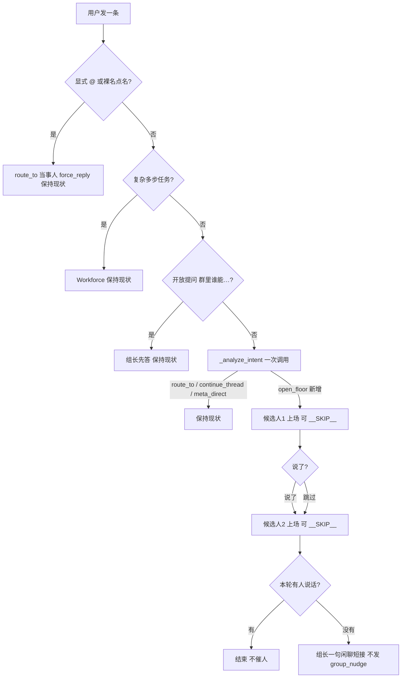

# 群聊「房间感」：开放发言轮（open_floor）

Planned-with: Claude Opus 5（上游调研与产品讨论由 Cursor Grok 4.6 完成，见 `research/codedeepresearch/cumora/` 与 `research/codedeepresearch/jiuwenswarm/`）
Status: implemented
Plan-Id: 2026-08-18-group-chat-open-floor-room-feel

> **For implementer:** 只改本 plan 列出的文件与函数。**不要碰** `agenticx/studio/server.py`、`desktop/` 任何文件（本 plan 复用现有 SSE 事件类型，前端零改动）。不要 commit，除非用户明确要求。

**Goal:** 让 Near 桌面群聊像真人微信群：一条闲聊进群后，**相关的人自己决定接不接**，可以有人接、可以两个人接、也可以没人接（组长随口接一句圆场），而不是每一轮都由路由器硬指定一个发言人、并在没人应答时公开催人。

**Architecture:** 在现有 `GroupChatRouter` 上加一个**第四种意图** `open_floor`。它不新增 LLM 调用（复用 `_analyze_intent` 那一次），不新增 SSE 事件类型，不改存储。`open_floor` 命中时：给 2 名候选人**依次**上场机会，每人可 `__SKIP__`；本轮已出现过的完全相同正文被判重丢弃；全员不说时由组长发一句 1–2 句的闲聊短接，而不是 `group_nudge` 催人。

**Tech Stack:** Python 3.10（`agenticx/runtime/group_router.py`、`agenticx/runtime/harden_flags.py`）+ pytest smoke（`tests/test_smoke_group_open_floor.py`）。

---

## 规划模型建议

| 子任务 | 推荐模型 | 理由 |
|---|---|---|
| FR-1/FR-2/FR-3 路由分支改造 | Cursor Grok 4.6 | 触碰默认群聊主路径，需理解现有 `_run_intelligent_turn` 的多分支与 early-return 结构，回归风险最高 |
| FR-4 判重纯函数 + FR-6 flags | Composer 2.5 | 照抄 `harden_flags.py` 既有样板即可 |
| FR-5 提示词条目 | Cursor Grok 4.6 | 需要群聊语感，不是样板 |
| FR-7 smoke 测试 | Composer 2.5 | 照抄 `tests/test_smoke_group_legacy_routing.py` 的 stub 模式 |

Suggested-Impl-Model: Cursor Grok 4.6（主体）

---

## In scope

- `_analyze_intent` 新增 `open_floor` action（prompt 规则 + JSON 校验 + 候选人裁剪）
- `_run_intelligent_turn` 新增 `open_floor` 分支：多候选、可跳过、允许零发言
- `open_floor` 分支内：全员不说 → 组长闲聊短接（**不发** `group_nudge`）
- `open_floor` 分支内：本轮字面重复正文判重丢弃
- `_run_one_target` 系统提示词新增「形状级群规矩」条目
- `harden_flags.py` 新增两个内部 flag（回滚开关）
- 新增 `tests/test_smoke_group_open_floor.py`

## Out of scope / no-scope-creep

- **不改** `group_router.py:1256` 那一行（`- 若需要回答，请直接给完整答案，不要流式、不分段。`）。那行归 `2026-08-16-group-chat-humanlike-multi-bubble.plan.md` 负责；两个 plan 都改同一行会冲突。本 plan 只在 `## 行为要求` 里**新增**条目。
- **不改** `route_to` / `continue_thread` / `meta_direct` / 开放提问（`_is_open_call_question`）/ Workforce 自动分流四条既有分支的行为，包括它们各自的 `group_nudge` 与兜底。
- **不新增** SSE 事件类型，**不改** `agenticx/studio/server.py` 的持久化白名单，**不改** `desktop/`。
- **不引入** Cumora 的 seen 游标 / HELD 回包 / `--send-anyway` / hold token / Redis（见 `research/codedeepresearch/cumora/cumora_proposal.md` 明确排除项）。
- **不引入** JiuwenSwarm 的 `/join` 席位、godview/mention/private 三态投递、`$成员名` 语法、数字分身（见 `research/codedeepresearch/jiuwenswarm/jiuwenswarm_proposal.md`）。
- **不做** 全员并行叫醒。`open_floor` 仍是**顺序**上场，后一个人看得到前一个人已写入 `GroupChatContext` 的话。
- **不做** 反独白门（不禁止同一个人连发）——与多气泡计划对着干。
- **不为** 两个新 flag 加 Desktop 设置面板。它们是**内部回滚开关**，语义与既有 `group.meta_direct_tools`（`harden_flags.py:103-105`，同样无 GUI）一致；若产品后续决定作为用户可调项长期保留，再单独补设置面板。

---

## 根因与证据链

### 现状：谁开口是路由器裁定的，不是房间里的人自己决定的

```
agenticx/runtime/group_router.py:1682-1691
active_thread = context.get_active_thread()
primary_targets = [x for x in decision.target_ids if x in valid_members]
if decision.action == "continue_thread" and active_thread is not None:
    primary_targets = [active_thread.partner_id]
if not primary_targets and valid_members:
    primary_targets = [valid_members[0]]      # ← 兜底抓「第一个成员」
```

`_analyze_intent` 只有三种 action（`:1042-1044`），规则末尾写着「不确定时优先 route_to 最可能成员」（`:1055`），且解析失败也回落到 `route_to` + `members[0]`（`:1072-1077`、`:1105-1107`）。结果：**闲聊也会被指派给某一个人**，而且经常是列表里的第一个，跟他相关不相关无关。

### 现状：没人接的时候会公开催人

```
agenticx/runtime/group_router.py:1786-1801
nudge_text = f"@{nudge_name} 团长刚才的问题需要你来回答，请直接给出进度和下一步。"
...
event_type="group_nudge",
```

对「你们平时都瞎扯啥」这种闲聊，群里冒出一句「团长刚才的问题需要你来回答，请直接给出进度和下一步」，是当前最不像微信群的地方。

### 已经具备、本 plan 直接复用的能力（不要重写）

- 成员可以拒答：`force_rule` 在未点名时给出 `__SKIP__` 指令（`:1241-1245`），`_run_one_target` 把 `__SKIP__` 转成 `group_skipped`（`:1371-1380`）。
- 顺序上下文：`_run_one_target` 结尾 `context.append_agent(...)`（`:1399-1404`），所以第二个发言人看得到第一个说完的话。
- 成员之间接话：`_emit_mention_follow_ups`（`:774`）。
- 前端已能渲染多条 `group_reply`（`desktop/src/components/ChatPane.tsx:9912`），所以「本轮 0/1/2 条回复」不需要前端改动。

### 上游可迁移的原则（只取原则，不取实现）

- Cumora：「点了名就别插嘴 / 按已经发出的接下去 / 缺人就补位 / 提示词只写形状不写题库」，以及「跟刚发出的那条一字不差就拒」。见 `research/codedeepresearch/cumora/cumora_proposal.md` 第 2 节（E-007 字面重复门、`GLANCE_YIELD_RULES`）。
- JiuwenSwarm：本 plan 不取其机制；仅作为「Leader 编排那一截我们已有 Workforce」的旁证（`jiuwenswarm_agenticx_gap_analysis.md` G-001）。

---

## 目标行为



## 不变量

1. `open_floor` **不新增** LLM 调用：仍是 `_analyze_intent` 那一次。
2. `open_floor` **不新增** SSE 事件类型：发出的仍是 `group_typing` / `group_progress` / `group_reply` / `group_skipped`。
3. `open_floor` 分支内发言**严格顺序**，不并行；第 N+1 位看得到第 N 位已写入 `GroupChatContext` 的正文。
4. 一轮里 `open_floor` 可见回复条数 ∈ {0, 1, 2}（上限由 flag 控制，默认 2）；0 条时必定补一条组长短接，所以**用户永远不会收到空轮**。
5. `open_floor` 分支**不发** `group_nudge`；其它分支的 `group_nudge` 行为一字不改。
6. flag 关闭时，`_analyze_intent` 不再产出 `open_floor`，`_run_intelligent_turn` 行为与今天完全一致。
7. 判重只在 `open_floor` 分支内、只比对**本轮已发出**的可见正文；跨轮不判重（否则会误杀「嗯」「好」这类正常应答）。

---

## FR / AC

### FR-1：`_analyze_intent` 新增 `open_floor` action

**落点：** `agenticx/runtime/group_router.py`，`_analyze_intent`（`:1010-1108`）。

**改动 1 — JSON schema 与规则（`:1042` 与 `:1050-1056`）。**

before（`:1042`）：

```python
'  "action": "route_to" | "meta_direct" | "continue_thread",\n'
```

after：

```python
'  "action": "route_to" | "meta_direct" | "continue_thread" | "open_floor",\n'
```

before（`:1055`，规则块最后一条）：

```python
"- 不确定时优先 route_to 最可能成员。"
```

after（**替换这一条**，并在其前面新增两条）：

```python
"- 闲聊、寒暄、开玩笑、随口问「你们平时都聊啥」这类没有明确职责归属的话 => open_floor，"
'并在 target_ids 里按相关性给出 1–2 个最可能想搭话的成员（可以为空）。\n'
"- open_floor 表示「把话丢进群里，谁想接谁接」，成员有权不接；"
"不要为了有人回答而硬选一个不相关的成员。\n"
"- 有明确专业问题或可执行诉求、但没点名时，仍然 route_to 最可能成员。"
```

**改动 2 — action 白名单与 `open_floor` 的候选人裁剪（`:1098-1108`）。**

before（`:1098`）：

```python
if action not in {"route_to", "meta_direct", "continue_thread"}:
```

after：

```python
if action == "open_floor" and not group_open_floor_enabled():
    # Flag off：退回今天的行为，不引入新分支
    action = "route_to" if target_ids else "meta_direct"
if action not in {"route_to", "meta_direct", "continue_thread", "open_floor"}:
```

在 `if action == "route_to" and not target_ids and members:`（`:1105`）**之前**插入 `open_floor` 的裁剪（注意：`open_floor` **允许** `target_ids` 为空，不要走 `fallback_first_member`）：

```python
if action == "open_floor":
    target_ids = target_ids[: group_open_floor_max_speakers()]
```

**改动 3 — import。** 文件顶部 `from agenticx.runtime.harden_flags import (...)`（`:32-36`）已有 import 块，**只在括号内新增两行**，不要整段替换：

```python
    group_open_floor_enabled,
    group_open_floor_max_speakers,
```

**注意：** 异常兜底（`:1065-1082`）与 JSON 不可解析兜底（`:1083-1089`）**一行不改**。模型挂了就退回今天的行为，不要在失败路径上引入新分支。

**AC-1:** `tests/test_smoke_group_open_floor.py::test_analyze_intent_parses_open_floor`

- mock `router._call_llm_text` 返回 `'{"action":"open_floor","target_ids":["a1","a2","a3"],"reason":"chitchat"}'`
- 群成员为 `["a1","a2","a3"]`（`registry.get_avatar` 返回带 `name` 的 MagicMock）
- 断言 `decision.action == "open_floor"`，`decision.target_ids == ["a1","a2"]`（被 `group_open_floor_max_speakers()` 默认 2 裁掉第三个）

**AC-1b:** `test_analyze_intent_open_floor_allows_empty_targets`

- mock 返回 `'{"action":"open_floor","target_ids":[],"reason":"chitchat"}'`
- 断言 `decision.action == "open_floor"` 且 `decision.target_ids == []`（**不得**被回落成 `route_to` + `members[0]`）

**AC-1c:** `test_analyze_intent_open_floor_disabled_by_flag`

- `monkeypatch.setenv("AGX_GROUP_OPEN_FLOOR", "0")`
- mock 返回 `open_floor` + `target_ids=["a1"]`
- 断言 `decision.action == "route_to"` 且 `decision.target_ids == ["a1"]`

---

### FR-2：`_run_intelligent_turn` 新增 `open_floor` 分支

**落点：** `agenticx/runtime/group_router.py`，`_run_intelligent_turn`。插入位置：`meta_direct` 分支 `return` 之后（`:1681` 的 `return` 与 `:1682` 的 `active_thread = context.get_active_thread()` 之间）。**用插入，不要改写下面既有的 `route_to` 代码。**

新分支伪代码（保持与既有分支同样的 `should_stop` / fanout / typing / follow-up 结构）：

```python
if decision.action == "open_floor":
    context.clear_active_thread()
    candidates = [x for x in decision.target_ids if x in valid_members]
    if not candidates:
        candidates = valid_members[: group_open_floor_max_speakers()]
    candidates = candidates[: group_open_floor_max_speakers()]
    if candidates:
        for ge in self._project_h2a_fanout(
            base_session=base_session,
            group_id=group_id,
            group_avatar_ids=group_avatar_ids,
            target_agent_ids=candidates,
        ):
            yield ge
    spoken_texts: list[str] = []          # FR-4 判重用
    for target in candidates:
        if await self._should_stop(should_stop):
            return
        av = self.avatar_registry.get_avatar(target)
        ty_name = str(getattr(av, "name", "") or target) if av else target
        yield self._typing_event(target, ty_name)
        if await self._should_stop(should_stop):
            return
        reply: GroupReply | None = None
        async for target_evt in self._run_one_target_stream(
            base_session=base_session,
            context=context,
            group_id=group_id,
            group_name=group_name,
            avatar_id=target,
            user_input=user_input,
            quoted_content=quoted_content,
            should_stop=should_stop,
            force_reply=False,            # ← 关键：open_floor 永不强制发言
            user_display_name=user_display_name,
        ):
            if target_evt.event_type == "group_reply" and _is_verbatim_duplicate(
                target_evt.content, spoken_texts
            ):
                # 跟本轮已经发出的正文一字不差 → 不再发第二条一样的气泡
                target_evt = GroupReply(
                    agent_id=target_evt.agent_id,
                    avatar_name=target_evt.avatar_name,
                    avatar_url=target_evt.avatar_url,
                    content="",
                    skipped=True,
                    event_type="group_skipped",
                )
            yield target_evt
            if target_evt.event_type in {"group_reply", "group_skipped"}:
                reply = target_evt
        if reply is None:
            continue
        self._record_turn_response(responded_this_turn, reply)
        if not reply.skipped and reply.content.strip():
            spoken_texts.append(reply.content)
            context.bump_active_thread(
                partner_id=reply.agent_id,
                partner_name=reply.avatar_name,
                last_topic=user_input[:120],
            )
        async for fu in self._emit_mention_follow_ups(
            reply=reply,
            group_avatar_ids=group_avatar_ids,
            base_session=base_session,
            context=context,
            group_id=group_id,
            group_name=group_name,
            should_stop=should_stop,
            user_display_name=user_display_name,
            hops=_get_mention_hops(),
            responded_this_turn=responded_this_turn,
        ):
            yield fu
    if spoken_texts:
        return
    # ── 没人接：组长圆场，不催人（FR-3）──
    ...见 FR-3...
```

**为什么 `force_reply=False`：** 这是整个 plan 的核心。`_run_one_target` 的 `force_rule`（`:1241-1245`）在 `force_reply=False` 时给出的正是「与你职责无关就只输出 `__SKIP__`」。也就是说**跳过能力今天就有，本 plan 只是第一次让它在闲聊轮真正生效**。

**AC-2:** `test_open_floor_two_candidates_second_may_skip`

- stub `_analyze_intent` → `IntentDecision("open_floor", ["a1","a2"], "chitchat")`
- stub `_run_one_target_stream`：`a1` 产出 `group_reply("我来接一句")`，`a2` 产出 `group_skipped`
- 断言：收集到的事件里 `group_reply` 恰好 1 条且 `agent_id == "a1"`；**没有** `group_nudge`

**AC-2b:** `test_open_floor_never_forces_reply`

- 记录 `_run_one_target_stream` 每次被调用的 `kwargs["force_reply"]`
- 断言全部为 `False`

**AC-2c:** `test_open_floor_falls_back_to_members_when_targets_empty`

- stub `_analyze_intent` → `IntentDecision("open_floor", [], "chitchat")`，群成员 `["a1","a2","a3"]`
- 断言实际上场的 `avatar_id` 序列为 `["a1","a2"]`（受 `group_open_floor_max_speakers()` 限制）

---

### FR-3：`open_floor` 全员不说 → 组长闲聊短接，不发 `group_nudge`

**落点：** FR-2 新分支末尾（`if spoken_texts: return` 之后）。

```python
    yield self._typing_event(META_LEADER_AGENT_ID, self._meta_leader_label)
    if await self._should_stop(should_stop):
        return
    pm = await self._run_meta_project_manager_reply(
        base_session=base_session,
        context=context,
        group_name=group_name,
        user_input=user_input,
        quoted_content=quoted_content,
        extra_instruction=(
            "群里这会儿没人接话，你随口接一句就行：**1–2 句**，像微信群里群主随手回一下。"
            "不要点评谁没回、不要催人回答、不要罗列进度或下一步，也不要 @ 任何成员。"
        ),
        user_display_name=user_display_name,
    )
    yield pm
    self._record_turn_response(responded_this_turn, pm)
    async for fu in self._emit_mention_follow_ups(
        reply=pm,
        group_avatar_ids=group_avatar_ids,
        base_session=base_session,
        context=context,
        group_id=group_id,
        group_name=group_name,
        should_stop=should_stop,
        user_display_name=user_display_name,
        hops=_get_mention_hops(),
        responded_this_turn=responded_this_turn,
    ):
        yield fu
    return
```

**注意：** 不要改 `_run_meta_project_manager_reply` 本体（`:1110-1182`），特别是 `facts_block` 与「进展陈述规则」——那是 `test_smoke_group_meta_direct_honesty.py` 钉住的诚实性门禁。这里只通过 `extra_instruction` 收敛语气。

**AC-3:** `test_open_floor_all_skipped_gets_casual_meta_reply_not_nudge`

- stub `_analyze_intent` → `open_floor`，两名候选人都产出 `group_skipped`
- stub `_run_meta_project_manager_reply` 返回 `group_reply("哈哈没啥固定套路")`，并记录收到的 `extra_instruction`
- 断言：事件流里**没有** `event_type == "group_nudge"`；最后一条 `group_reply` 的 `agent_id == "__meta__"`；`extra_instruction` 含「没人接话」

**AC-3b:** `test_route_to_nudge_path_unchanged`（回归）

- stub `_analyze_intent` → `IntentDecision("route_to", ["a1"], "duty")`，`a1` 产出 `group_skipped`
- 断言仍然出现 `event_type == "group_nudge"`（既有行为一字未改）

---

### FR-4：本轮字面重复正文判重（纯函数）

**落点：** `agenticx/runtime/group_router.py`，模块级，建议紧跟 `_is_complex_multistep_task`（`:210-247`）之后。

```python
def _normalize_reply_text(text: str) -> str:
    """Collapse whitespace so 'A  B\n' and 'A B' compare equal."""
    return " ".join(str(text or "").split())


def _is_verbatim_duplicate(text: str, already_spoken: Sequence[str]) -> bool:
    """True when this reply is byte-identical (after whitespace collapse) to a
    reply already emitted in the same user turn.

    Deliberately literal: it only kills copy-paste collisions between two
    members answering the same prompt. Paraphrases are left alone — judging
    semantic overlap needs a model call and would suppress legitimate
    "I agree, and also..." replies.
    """
    norm = _normalize_reply_text(text)
    if not norm:
        return False
    return any(_normalize_reply_text(prev) == norm for prev in already_spoken)
```

**AC-4:** `test_verbatim_duplicate_pure_function`

- `_is_verbatim_duplicate("好的", ["好的"]) is True`
- `_is_verbatim_duplicate(" 好的\n", ["好的"]) is True`（空白归一）
- `_is_verbatim_duplicate("好的呀", ["好的"]) is False`（不做近义判定）
- `_is_verbatim_duplicate("", ["好的"]) is False`
- `_is_verbatim_duplicate("好的", []) is False`

**AC-4b:** `test_open_floor_drops_verbatim_duplicate_bubble`

- stub 两名候选人产出**完全相同**的 `group_reply("我也这么觉得")`
- 断言：`group_reply` 只出现 1 条；第二名候选人对应事件为 `group_skipped`

---

### FR-5：成员提示词补「形状级群规矩」

**落点：** `agenticx/runtime/group_router.py`，`_run_one_target` 的 `system_prompt`（`:1246-1268`）。

在 `- 你能看到其他成员最近发言，可基于上下文补充或纠正。`（`:1262`）之后、`- 查看「最近群聊上下文」…`（`:1263`）之前**插入三行新条目**。**不要动 `:1256` 那一行**（归多气泡 plan）。

```python
            "- 群里有人被点名时，这一轮就让当事人先答；你没被点到又没有独特信息，就只输出 __SKIP__。\n"
            "- 接话要顺着「最近群聊上下文」里**已经发出**的内容往下说；"
            "不要猜别人接下来会说什么，也不要把别人刚说过的话换个说法再说一遍。\n"
            "- 宁可不说，也不要为了凑一句而输出没有信息量的客套或复述；"
            "但如果这事明显该有人接、而群里没人接，你就补位。\n"
```

**为什么只写形状不写题库：** Cumora 的教训是每次为一类事故加一条专项规则（数数、接龙），换个场景就又坏（见 `cumora_proposal.md` 第 2 节）。上面三条只描述「让位 / 顺接 / 补位」这三种形状。

**AC-5:** `test_member_prompt_contains_yield_rules`

- 用 `monkeypatch` 替换 `AgentRuntime`，捕获 `run_turn(..., system_prompt=...)` 实参（参照 `tests/test_smoke_group_llm_budget.py` 现有做法；若该文件用的是别的拦截方式，沿用该文件的方式）
- 断言 `system_prompt` 同时包含 `"就让当事人先答"`、`"已经发出"`、`"宁可不说"`
- 断言 `system_prompt` **仍然包含** `"不要流式、不分段"`（证明没有误删多气泡 plan 要改的那行）

---

### FR-6：两个内部回滚 flag

**落点：** `agenticx/runtime/harden_flags.py`，追加到文件末尾（`:142` 之后）。照抄同文件 `group_intent_max_tokens`（`:108-125`）的写法。

```python
def group_open_floor_enabled() -> bool:
    """``AGX_GROUP_OPEN_FLOOR`` / ``group.open_floor``. Default True.

    Off 时 ``_analyze_intent`` 不再产出 ``open_floor``，群聊回到「路由器指派单一
    发言人」的旧行为，用于快速回滚。
    """
    return _resolve_bool("AGX_GROUP_OPEN_FLOOR", "group.open_floor", True)


def group_open_floor_max_speakers() -> int:
    """``AGX_GROUP_OPEN_FLOOR_MAX_SPEAKERS`` / ``group.open_floor_max_speakers``.

    Default 2, clamp 1..3. 一轮闲聊里最多让几个人有机会开口（他们仍可跳过）。
    """
    raw: Optional[int] = None
    env = os.environ.get("AGX_GROUP_OPEN_FLOOR_MAX_SPEAKERS", "").strip()
    if env:
        try:
            raw = int(env)
        except Exception:
            raw = None
    if raw is None:
        raw = _config_int("group.open_floor_max_speakers")
    if raw is None:
        raw = 2
    return max(1, min(3, int(raw)))
```

**AC-6:** `test_open_floor_flags`

- 默认：`group_open_floor_enabled() is True`，`group_open_floor_max_speakers() == 2`
- `monkeypatch.setenv("AGX_GROUP_OPEN_FLOOR", "0")` → `False`
- `monkeypatch.setenv("AGX_GROUP_OPEN_FLOOR_MAX_SPEAKERS", "9")` → `3`（clamp 上界）
- `monkeypatch.setenv("AGX_GROUP_OPEN_FLOOR_MAX_SPEAKERS", "0")` → `1`（clamp 下界）
- `monkeypatch.setenv("AGX_GROUP_OPEN_FLOOR_MAX_SPEAKERS", "abc")` → `2`（解析失败回默认，不抛）

---

### FR-7：smoke 测试文件

**落点：** 新建 `tests/test_smoke_group_open_floor.py`。

- 文件头 docstring 说明「钉住 open_floor 闲聊轮：可跳过、可零发言、不催人、字面判重」，并写 `Author: Damon Li`（与 `tests/test_smoke_group_legacy_routing.py:8` 一致）。
- 复用该文件的 `_make_router_with_spies()` / `_make_session()` 模式（`:24-45`）：`registry = MagicMock()`、`llm_factory=MagicMock(return_value=MagicMock())`、`max_tool_rounds=5`。
- 通过 `router.run_group_turn(routing="intelligent", ...)` 驱动，用 `async for` 收集全部 `GroupReply` 后断言。
- 必须 stub 掉 `_run_one_target_stream`、`_analyze_intent`、`_run_meta_project_manager_reply`、`_run_team_turn`，避免真实网络调用。
- 用例清单：AC-1、AC-1b、AC-1c、AC-2、AC-2b、AC-2c、AC-3、AC-3b、AC-4、AC-4b、AC-5、AC-6。

**AC-7:** 以下命令全绿：

```bash
cd /Users/damon/myWork/AgenticX
python -m pytest tests/test_smoke_group_open_floor.py -q
python -m pytest tests/test_smoke_group_legacy_routing.py tests/test_smoke_group_workforce_bridge.py \
  tests/test_smoke_group_meta_direct_honesty.py tests/test_smoke_group_execution_facts.py \
  tests/test_smoke_group_llm_budget.py tests/test_smoke_group_debate_nudge.py \
  tests/test_smoke_group_a2a_graph_edges.py tests/test_smoke_group_progress_tool_step.py -q
```

第二条是回归门槛：既有八个群聊 smoke 一个都不许挂。

---

## 手工验收（对齐截图那种体感）

前提：一个含 2 名分身 + Near（Meta）的群。

| 输入 | 期望 |
|---|---|
| `啥也没聊，瞎扯把` | 有人随口接，或没人接时 Near 一句短的；**不出现**「团长刚才的问题需要你来回答」 |
| `你们平时都瞎扯啥？` | 1–2 个分身接话，语气短；不出现进度罗列 |
| `111，唱首歌` | 仍然只有 111 答（裸名点名 → `route_to` + `force_reply`），行为与今天一致 |
| `@某某 帮我看下这个报错` | 仍然只有被 @ 的人答，且必须答 |
| `群里谁能一句话说下这个项目干啥的` | 仍然 Near 先答（`_is_open_call_question` 分支未改） |
| `先把 X 调研一遍，然后出个方案，最后我们评审` | 仍然进 Workforce（`_is_complex_multistep_task` 未改） |
| `AGX_GROUP_OPEN_FLOOR=0` 后重启 `agx serve`，再发 `瞎扯把` | 回到今天的行为：指派单一发言人，没人答时出现 `group_nudge` |

## 风险与回滚

| 风险 | 缓解 |
|---|---|
| 闲聊被误判成 `open_floor`，专业问题没人接 | `open_floor` 全员跳过时必定有组长短接，用户不会收到空轮；且 prompt 明确「有明确专业诉求仍 route_to」 |
| 一轮两个人都说话，token 翻倍 | 上限 2 且每人可跳过；相比今天最多也是 2 人（`primary_targets[:2]`，`:1691`），成本上界不变 |
| 与多气泡 plan 冲突 | 两个 plan 触碰的行不重叠；AC-5 显式断言 `:1256` 那行仍在 |
| 行为变化被用户视为倒退 | `AGX_GROUP_OPEN_FLOOR=0` 一键回滚，无需改代码 |

## 交付

- 改动文件：`agenticx/runtime/group_router.py`、`agenticx/runtime/harden_flags.py`、新增 `tests/test_smoke_group_open_floor.py`
- **不含** `agenticx/studio/server.py`、`desktop/`（因此不需要 `agx serve` 冷启动门槛；但若实施中发现必须动 `server.py`，先停下来问用户）
- commit 由用户明确要求后再做；trailer 用 `Plan-Id: 2026-08-18-group-chat-open-floor-room-feel`
